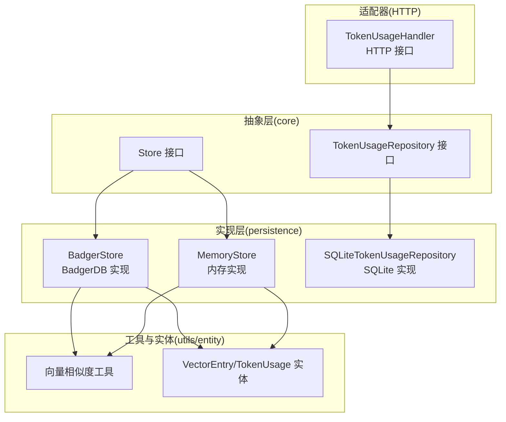
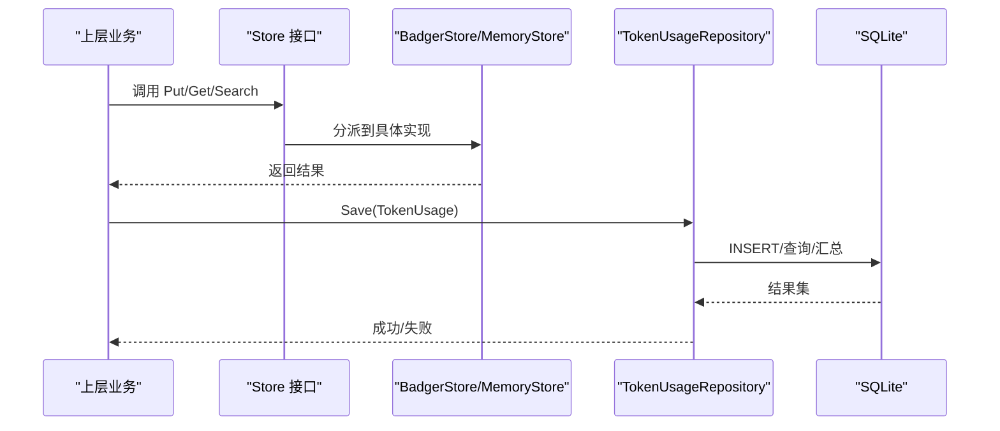
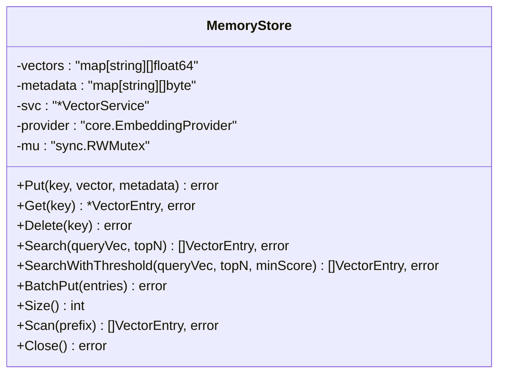
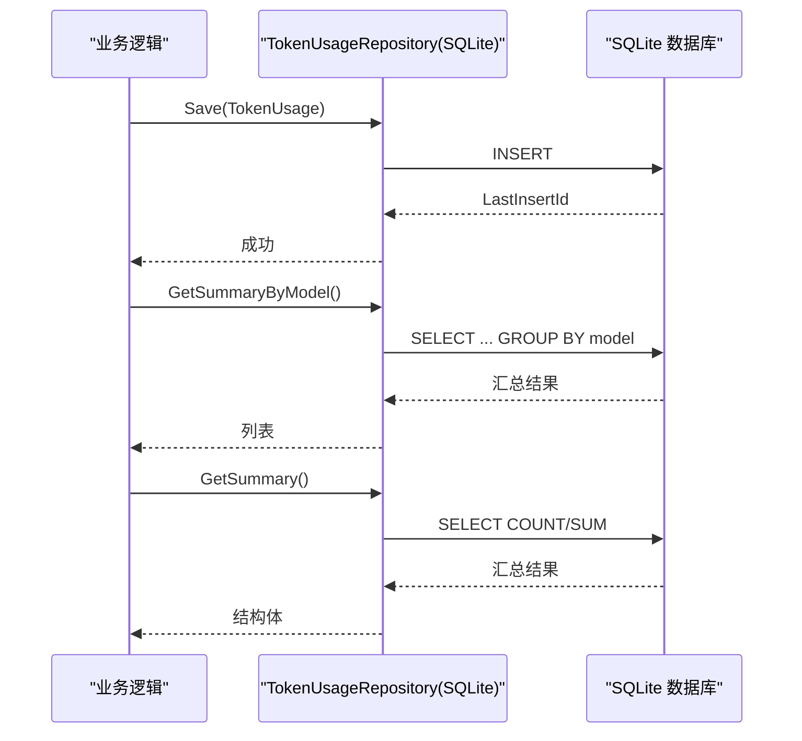
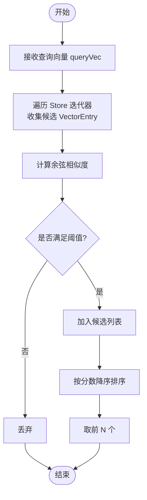
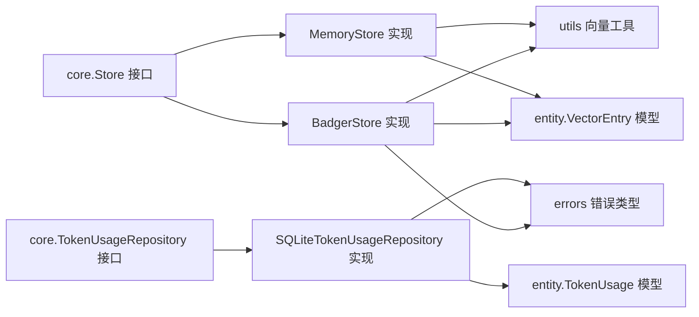

# 持久化存储

<cite>
**本文引用的文件**
- [internal/infrastructure/persistence/store.go](file://internal/infrastructure/persistence/store.go)
- [internal/infrastructure/persistence/badger_store.go](file://internal/infrastructure/persistence/badger_store.go)
- [internal/infrastructure/persistence/memory_store.go](file://internal/infrastructure/persistence/memory_store.go)
- [internal/infrastructure/persistence/token_usage_repository.go](file://internal/infrastructure/persistence/token_usage_repository.go)
- [internal/core/store.go](file://internal/core/store.go)
- [internal/core/token_usage.go](file://internal/core/token_usage.go)
- [internal/entity/vector.go](file://internal/entity/vector.go)
- [internal/entity/token_usage.go](file://internal/entity/token_usage.go)
- [internal/utils/vector.go](file://internal/utils/vector.go)
- [internal/errors/errors.go](file://internal/errors/errors.go)
- [internal/adapters/http/handlers/token_usage.go](file://internal/adapters/http/handlers/token_usage.go)
- [internal/infrastructure/persistence/badger_store_test.go](file://internal/infrastructure/persistence/badger_store_test.go)
- [internal/config/config.go](file://internal/config/config.go)
- [releases/README.md](file://releases/README.md)
</cite>

## 目录
1. [简介](#简介)
2. [项目结构](#项目结构)
3. [核心组件](#核心组件)
4. [架构总览](#架构总览)
5. [详细组件分析](#详细组件分析)
6. [依赖关系分析](#依赖关系分析)
7. [性能考量](#性能考量)
8. [故障排查指南](#故障排查指南)
9. [结论](#结论)
10. [附录](#附录)

## 简介
本文件面向 MindX 的持久化存储子系统，系统采用“抽象接口 + 多实现”的设计，围绕向量存储与 Token 使用统计两大核心能力展开。向量存储通过统一接口对外暴露，当前提供基于 BadgerDB 的生产级实现与基于内存的开发/测试实现；Token 使用统计以 SQLite 作为轻量级持久化后端，提供按模型、时间范围等维度的查询与汇总能力，并配套 HTTP 接口用于报表展示。

## 项目结构
- 存储抽象与实现
  - 抽象接口：core 层定义 Store 与 TokenUsageRepository 接口，隔离上层业务与底层实现。
  - 具体实现：persistence 层提供 BadgerStore、MemoryStore 与 SQLiteTokenUsageRepository。
- 工具与实体
  - utils 提供向量相似度计算等通用工具。
  - entity 定义存储使用的数据模型（向量条目、Token 使用记录及其汇总）。
- 错误处理
  - errors 提供统一的错误类型与包装方法，便于定位存储类错误来源。
- 配置与入口
  - config 负责配置加载与模板初始化，配合 bootstrap 初始化存储实例。
- 测试与验证
  - persistence 层包含 BadgerStore 的单元测试，覆盖 Put/Get/Delete/BatchPut/Search/Scan 等关键路径。



**图表来源**
- [internal/core/store.go](file://internal/core/store.go#L5-L15)
- [internal/core/token_usage.go](file://internal/core/token_usage.go#L8-L33)
- [internal/infrastructure/persistence/badger_store.go](file://internal/infrastructure/persistence/badger_store.go#L16-L44)
- [internal/infrastructure/persistence/memory_store.go](file://internal/infrastructure/persistence/memory_store.go#L13-L30)
- [internal/infrastructure/persistence/token_usage_repository.go](file://internal/infrastructure/persistence/token_usage_repository.go#L12-L43)
- [internal/utils/vector.go](file://internal/utils/vector.go#L10-L29)
- [internal/entity/vector.go](file://internal/entity/vector.go#L5-L10)
- [internal/entity/token_usage.go](file://internal/entity/token_usage.go#L5-L37)
- [internal/adapters/http/handlers/token_usage.go](file://internal/adapters/http/handlers/token_usage.go#L10-L18)

**章节来源**
- [internal/infrastructure/persistence/store.go](file://internal/infrastructure/persistence/store.go#L25-L43)
- [internal/config/config.go](file://internal/config/config.go#L13-L36)

## 核心组件
- 存储抽象接口 Store
  - 定义 Put/Get/Delete/Search/SearchWithThreshold/BatchPut/Scan/Close 等方法，屏蔽具体实现差异。
- 向量存储实现
  - BadgerStore：基于 BadgerDB 的 LSM-Tree 实现，具备事务、压缩、ValueLog GC 等特性，适合生产环境。
  - MemoryStore：基于内存的临时实现，适合开发与测试场景。
- Token 使用统计接口与实现
  - TokenUsageRepository：定义 Save/GetByID/GetByModel/GetByTimeRange/GetSummary/GetSummaryByModel/Delete/Close 等方法。
  - SQLiteTokenUsageRepository：基于 sqlite3 的轻量实现，启用 WAL 提升并发读写性能。
- 实体与工具
  - VectorEntry：键、向量与元数据的统一载体。
  - TokenUsage/TokenUsageSummary/TokenUsageByModelSummary：统计模型。
  - utils.CalculateCosineSimilarity/FindMostSimilar：相似度计算与 TopN 选择。

**章节来源**
- [internal/core/store.go](file://internal/core/store.go#L5-L15)
- [internal/infrastructure/persistence/badger_store.go](file://internal/infrastructure/persistence/badger_store.go#L16-L44)
- [internal/infrastructure/persistence/memory_store.go](file://internal/infrastructure/persistence/memory_store.go#L13-L30)
- [internal/core/token_usage.go](file://internal/core/token_usage.go#L8-L33)
- [internal/infrastructure/persistence/token_usage_repository.go](file://internal/infrastructure/persistence/token_usage_repository.go#L12-L43)
- [internal/entity/vector.go](file://internal/entity/vector.go#L5-L10)
- [internal/entity/token_usage.go](file://internal/entity/token_usage.go#L5-L37)
- [internal/utils/vector.go](file://internal/utils/vector.go#L10-L29)

## 架构总览
MindX 的持久化存储采用分层与多实现策略：
- 上层业务仅依赖 core 接口，通过工厂函数 NewStore 选择具体实现（badger 或 memory），默认 memory。
- 向量检索流程：查询向量经 utils 计算相似度，再由 Store 实现扫描候选并返回 TopN。
- Token 使用统计：业务侧记录 TokenUsage，由 SQLiteTokenUsageRepository 持久化，HTTP 层提供聚合查询接口。



**图表来源**
- [internal/core/store.go](file://internal/core/store.go#L5-L15)
- [internal/infrastructure/persistence/badger_store.go](file://internal/infrastructure/persistence/badger_store.go#L65-L99)
- [internal/infrastructure/persistence/memory_store.go](file://internal/infrastructure/persistence/memory_store.go#L32-L48)
- [internal/core/token_usage.go](file://internal/core/token_usage.go#L8-L33)
- [internal/infrastructure/persistence/token_usage_repository.go](file://internal/infrastructure/persistence/token_usage_repository.go#L66-L92)

## 详细组件分析

### BadgerStore 组件分析
BadgerStore 是生产级向量存储实现，基于 dgraph-io/badger，具备以下关键点：
- 初始化与选项
  - 默认开启 CompactL0OnClose 与 NumCompactors，提升关闭时的压缩效率。
  - 后台定时执行 RunValueLogGC，降低空间占用与碎片。
- 事务与一致性
  - 写入/删除/批量写入均在事务上下文中执行，确保原子性。
  - View/Update 明确读写语义，避免并发问题。
- 数据结构与序列化
  - VectorEntry 以 JSON 形式存储，包含 Key、Vector 与 Metadata。
  - Metadata 支持 []byte/json.RawMessage 及任意结构体（自动序列化）。
- 检索与相似度
  - Search/SearchWithThreshold 遍历迭代器，计算余弦相似度，再取 TopN。
  - 支持阈值过滤与前缀扫描 Scan。
- 备份与关闭
  - Backup 导出数据库快照；Close 停止 GC 协程并关闭 DB。

```mermaid
classDiagram
class BadgerStore {
-db : "*badger.DB"
-svc : "*VectorService"
-provider : "core.EmbeddingProvider"
-stopCh : "chan struct{}"
+Put(key, vector, metadata) error
+Get(key) *VectorEntry, error
+Delete(key) error
+Search(queryVec, topN) []VectorEntry, error
+SearchWithThreshold(queryVec, topN, minScore) []VectorEntry, error
+BatchPut(entries) error
+Scan(prefix) []VectorEntry, error
+Backup(w) (uint64, error)
+Close() error
-runGC() void
}
class VectorService {
+FindMostSimilar(queryVec, candidates, topN) []SimilarityResult
}
class VectorEntry {
+Key : string
+Vector : []float64
+Metadata : json.RawMessage
}
BadgerStore --> VectorService : "使用"
BadgerStore --> VectorEntry : "序列化/反序列化"
```

**图表来源**
- [internal/infrastructure/persistence/badger_store.go](file://internal/infrastructure/persistence/badger_store.go#L16-L44)
- [internal/infrastructure/persistence/badger_store.go](file://internal/infrastructure/persistence/badger_store.go#L65-L99)
- [internal/infrastructure/persistence/badger_store.go](file://internal/infrastructure/persistence/badger_store.go#L130-L198)
- [internal/infrastructure/persistence/badger_store.go](file://internal/infrastructure/persistence/badger_store.go#L206-L209)
- [internal/infrastructure/persistence/badger_store.go](file://internal/infrastructure/persistence/badger_store.go#L211-L229)
- [internal/infrastructure/persistence/badger_store.go](file://internal/infrastructure/persistence/badger_store.go#L231-L263)
- [internal/infrastructure/persistence/store.go](file://internal/infrastructure/persistence/store.go#L45-L56)
- [internal/entity/vector.go](file://internal/entity/vector.go#L5-L10)

**章节来源**
- [internal/infrastructure/persistence/badger_store.go](file://internal/infrastructure/persistence/badger_store.go#L24-L44)
- [internal/infrastructure/persistence/badger_store.go](file://internal/infrastructure/persistence/badger_store.go#L47-L63)
- [internal/infrastructure/persistence/badger_store.go](file://internal/infrastructure/persistence/badger_store.go#L65-L99)
- [internal/infrastructure/persistence/badger_store.go](file://internal/infrastructure/persistence/badger_store.go#L130-L198)
- [internal/infrastructure/persistence/badger_store.go](file://internal/infrastructure/persistence/badger_store.go#L206-L209)
- [internal/infrastructure/persistence/badger_store.go](file://internal/infrastructure/persistence/badger_store.go#L211-L229)
- [internal/infrastructure/persistence/badger_store.go](file://internal/infrastructure/persistence/badger_store.go#L231-L263)

### MemoryStore 组件分析
MemoryStore 为开发/测试场景提供内存实现：
- 并发安全：使用互斥锁保护 vectors 与 metadata。
- 操作语义：Put/Get/Delete/BatchPut/Scan 与 BadgerStore 对齐，便于替换。
- 适用场景：单进程、低数据量、无需持久化的场景。



**图表来源**
- [internal/infrastructure/persistence/memory_store.go](file://internal/infrastructure/persistence/memory_store.go#L13-L30)
- [internal/infrastructure/persistence/memory_store.go](file://internal/infrastructure/persistence/memory_store.go#L32-L48)
- [internal/infrastructure/persistence/memory_store.go](file://internal/infrastructure/persistence/memory_store.go#L50-L76)
- [internal/infrastructure/persistence/memory_store.go](file://internal/infrastructure/persistence/memory_store.go#L78-L124)
- [internal/infrastructure/persistence/memory_store.go](file://internal/infrastructure/persistence/memory_store.go#L131-L148)
- [internal/infrastructure/persistence/memory_store.go](file://internal/infrastructure/persistence/memory_store.go#L150-L155)
- [internal/infrastructure/persistence/memory_store.go](file://internal/infrastructure/persistence/memory_store.go#L157-L176)

**章节来源**
- [internal/infrastructure/persistence/memory_store.go](file://internal/infrastructure/persistence/memory_store.go#L13-L30)
- [internal/infrastructure/persistence/memory_store.go](file://internal/infrastructure/persistence/memory_store.go#L32-L48)
- [internal/infrastructure/persistence/memory_store.go](file://internal/infrastructure/persistence/memory_store.go#L50-L76)
- [internal/infrastructure/persistence/memory_store.go](file://internal/infrastructure/persistence/memory_store.go#L78-L124)
- [internal/infrastructure/persistence/memory_store.go](file://internal/infrastructure/persistence/memory_store.go#L131-L148)
- [internal/infrastructure/persistence/memory_store.go](file://internal/infrastructure/persistence/memory_store.go#L150-L155)
- [internal/infrastructure/persistence/memory_store.go](file://internal/infrastructure/persistence/memory_store.go#L157-L176)

### Token 使用统计实现分析
- 数据模型
  - TokenUsage：记录模型名、时长、提示/补全/总 Token 数、创建时间。
  - TokenUsageSummary/TokenUsageByModelSummary：提供总量、平均值等汇总指标。
- 仓库接口
  - Save/GetByID/GetByModel/GetByTimeRange/GetSummary/GetSummaryByModel/Delete/Close。
- SQLite 实现要点
  - 自动创建表与索引（model、created_at）。
  - 启用 WAL 模式以提升并发读写。
  - 提供按模型与时间范围的查询与聚合。
- HTTP 接口
  - TokenUsageHandler 暴露按模型分组与总体统计的查询接口。



**图表来源**
- [internal/core/token_usage.go](file://internal/core/token_usage.go#L8-L33)
- [internal/infrastructure/persistence/token_usage_repository.go](file://internal/infrastructure/persistence/token_usage_repository.go#L17-L43)
- [internal/infrastructure/persistence/token_usage_repository.go](file://internal/infrastructure/persistence/token_usage_repository.go#L66-L92)
- [internal/infrastructure/persistence/token_usage_repository.go](file://internal/infrastructure/persistence/token_usage_repository.go#L194-L224)
- [internal/infrastructure/persistence/token_usage_repository.go](file://internal/infrastructure/persistence/token_usage_repository.go#L226-L271)
- [internal/adapters/http/handlers/token_usage.go](file://internal/adapters/http/handlers/token_usage.go#L20-L33)
- [internal/adapters/http/handlers/token_usage.go](file://internal/adapters/http/handlers/token_usage.go#L35-L48)

**章节来源**
- [internal/entity/token_usage.go](file://internal/entity/token_usage.go#L5-L37)
- [internal/core/token_usage.go](file://internal/core/token_usage.go#L8-L33)
- [internal/infrastructure/persistence/token_usage_repository.go](file://internal/infrastructure/persistence/token_usage_repository.go#L17-L43)
- [internal/infrastructure/persistence/token_usage_repository.go](file://internal/infrastructure/persistence/token_usage_repository.go#L66-L92)
- [internal/infrastructure/persistence/token_usage_repository.go](file://internal/infrastructure/persistence/token_usage_repository.go#L194-L224)
- [internal/infrastructure/persistence/token_usage_repository.go](file://internal/infrastructure/persistence/token_usage_repository.go#L226-L271)
- [internal/adapters/http/handlers/token_usage.go](file://internal/adapters/http/handlers/token_usage.go#L20-L33)
- [internal/adapters/http/handlers/token_usage.go](file://internal/adapters/http/handlers/token_usage.go#L35-L48)

### 向量相似度与检索流程
- 相似度计算
  - utils.CalculateCosineSimilarity：计算余弦相似度，范围 [-1,1]。
  - utils.FindMostSimilar：对候选集合按分数降序排序并截取 TopN。
- 检索流程
  - Store 实现遍历迭代器收集候选，计算相似度，过滤阈值，最终返回 TopN。



**图表来源**
- [internal/utils/vector.go](file://internal/utils/vector.go#L10-L29)
- [internal/utils/vector.go](file://internal/utils/vector.go#L31-L70)
- [internal/infrastructure/persistence/badger_store.go](file://internal/infrastructure/persistence/badger_store.go#L135-L198)
- [internal/infrastructure/persistence/memory_store.go](file://internal/infrastructure/persistence/memory_store.go#L83-L124)

**章节来源**
- [internal/utils/vector.go](file://internal/utils/vector.go#L10-L29)
- [internal/utils/vector.go](file://internal/utils/vector.go#L31-L70)
- [internal/infrastructure/persistence/badger_store.go](file://internal/infrastructure/persistence/badger_store.go#L135-L198)
- [internal/infrastructure/persistence/memory_store.go](file://internal/infrastructure/persistence/memory_store.go#L83-L124)

## 依赖关系分析
- 接口与实现解耦
  - core.Store 与 core.TokenUsageRepository 作为契约，分别被 BadgerStore/MemoryStore 与 SQLiteTokenUsageRepository 实现。
- 工具与实体
  - utils 与 entity 在 Store 与 TokenUsageRepository 中被广泛使用。
- 错误处理
  - 存储错误通过 errors 包进行类型化包装，便于上层识别与处理。



**图表来源**
- [internal/core/store.go](file://internal/core/store.go#L5-L15)
- [internal/core/token_usage.go](file://internal/core/token_usage.go#L8-L33)
- [internal/infrastructure/persistence/badger_store.go](file://internal/infrastructure/persistence/badger_store.go#L16-L44)
- [internal/infrastructure/persistence/memory_store.go](file://internal/infrastructure/persistence/memory_store.go#L13-L30)
- [internal/infrastructure/persistence/token_usage_repository.go](file://internal/infrastructure/persistence/token_usage_repository.go#L12-L43)
- [internal/utils/vector.go](file://internal/utils/vector.go#L10-L29)
- [internal/entity/vector.go](file://internal/entity/vector.go#L5-L10)
- [internal/entity/token_usage.go](file://internal/entity/token_usage.go#L5-L37)
- [internal/errors/errors.go](file://internal/errors/errors.go#L9-L33)

**章节来源**
- [internal/core/store.go](file://internal/core/store.go#L5-L15)
- [internal/core/token_usage.go](file://internal/core/token_usage.go#L8-L33)
- [internal/infrastructure/persistence/badger_store.go](file://internal/infrastructure/persistence/badger_store.go#L16-L44)
- [internal/infrastructure/persistence/memory_store.go](file://internal/infrastructure/persistence/memory_store.go#L13-L30)
- [internal/infrastructure/persistence/token_usage_repository.go](file://internal/infrastructure/persistence/token_usage_repository.go#L12-L43)
- [internal/utils/vector.go](file://internal/utils/vector.go#L10-L29)
- [internal/entity/vector.go](file://internal/entity/vector.go#L5-L10)
- [internal/entity/token_usage.go](file://internal/entity/token_usage.go#L5-L37)
- [internal/errors/errors.go](file://internal/errors/errors.go#L9-L33)

## 性能考量
- BadgerStore 性能优化建议
  - 选项调优：根据数据规模与写入压力调整内存表数量、L0 表数量、值日志文件大小、块缓存与索引缓存大小。
  - 压缩与 GC：保持 CompactL0OnClose 与后台 GC，避免长时间运行导致的碎片与空间膨胀。
  - 批量写入：优先使用 BatchPut 减少事务开销。
  - 迭代器参数：PrefetchSize 可根据候选规模调整，平衡内存与吞吐。
- 相似度计算
  - 当候选规模较大时，建议在入库前做预过滤（如按前缀/标签），缩小候选集后再计算相似度。
  - 若向量维度较高，可考虑降维或近似检索方案（需扩展实现）。
- SQLiteTokenUsageRepository
  - WAL 模式已启用，建议合理设置连接池与只读查询拆分，避免写放大。
  - 聚合查询尽量走索引（model、created_at），避免全表扫描。
- 并发与资源
  - BadgerStore 的 GC 为后台协程，避免阻塞主线程；MemoryStore 使用互斥锁，注意锁粒度与临界区长度。

**章节来源**
- [internal/infrastructure/persistence/badger_store.go](file://internal/infrastructure/persistence/badger_store.go#L24-L44)
- [internal/infrastructure/persistence/badger_store.go](file://internal/infrastructure/persistence/badger_store.go#L135-L198)
- [internal/infrastructure/persistence/token_usage_repository.go](file://internal/infrastructure/persistence/token_usage_repository.go#L37-L40)

## 故障排查指南
- 常见错误类型
  - STORAGE 类型错误：数据库打开失败、序列化/反序列化异常、空向量写入等。
  - 通过 errors 包的 Wrap/StorageError 等方法包装，便于定位来源。
- 典型问题与处理
  - 打不开 Badger 数据库：检查路径权限、磁盘空间、并发访问冲突。
  - 写入失败：确认 vector 非空；检查 JSON 序列化错误；必要时回滚或重试。
  - 查询无结果：确认键是否存在、前缀匹配是否正确、阈值是否过高。
  - SQLite 插入失败：检查表结构、索引、并发写入冲突。
- 测试参考
  - BadgerStore 单测覆盖了 Put/Get/Delete/BatchPut/Search/Scan/阈值过滤等关键路径，可据此对照定位问题。

**章节来源**
- [internal/errors/errors.go](file://internal/errors/errors.go#L9-L33)
- [internal/errors/errors.go](file://internal/errors/errors.go#L165-L173)
- [internal/infrastructure/persistence/badger_store_test.go](file://internal/infrastructure/persistence/badger_store_test.go#L21-L184)

## 结论
MindX 的持久化存储通过清晰的抽象与多实现策略，实现了向量存储与 Token 使用统计的解耦与可替换。BadgerStore 适合生产环境，具备事务、压缩与 GC 等特性；MemoryStore 适合开发与测试；SQLiteTokenUsageRepository 提供轻量级统计能力并配套 HTTP 接口。结合合理的性能调优与完善的错误处理，系统可在不同场景下稳定运行。

## 附录
- 配置与初始化
  - 通过 config 加载 server/channels/capabilities/models 等配置，配合 bootstrap 初始化存储实例。
- 发布与部署
  - releases 目录包含各平台打包产物，部署时注意数据目录权限与路径配置。

**章节来源**
- [internal/config/config.go](file://internal/config/config.go#L13-L36)
- [releases/README.md](file://releases/README.md)