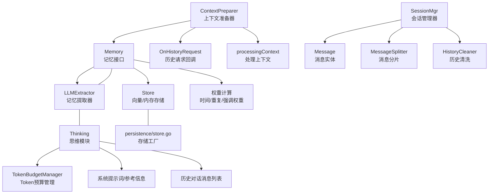
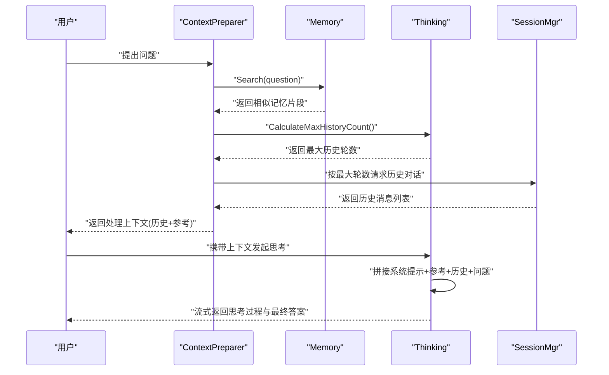
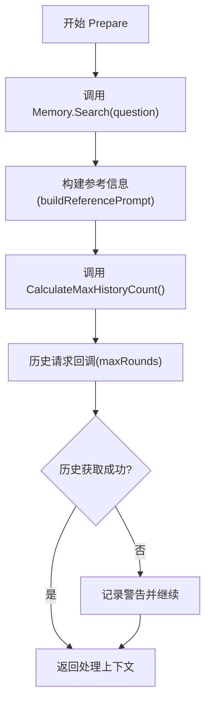
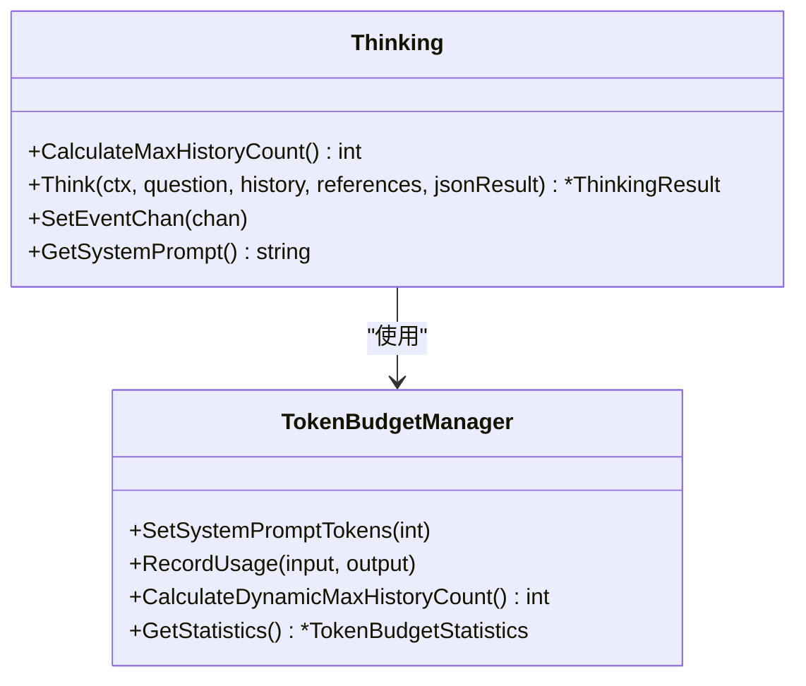
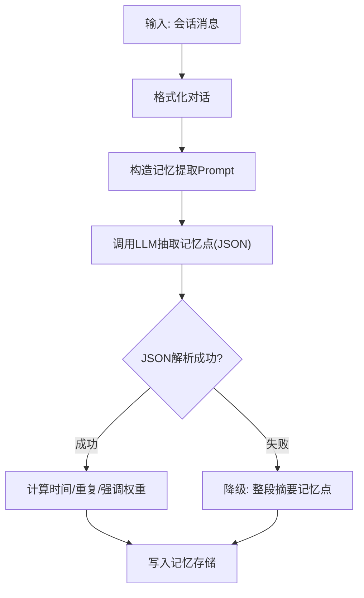
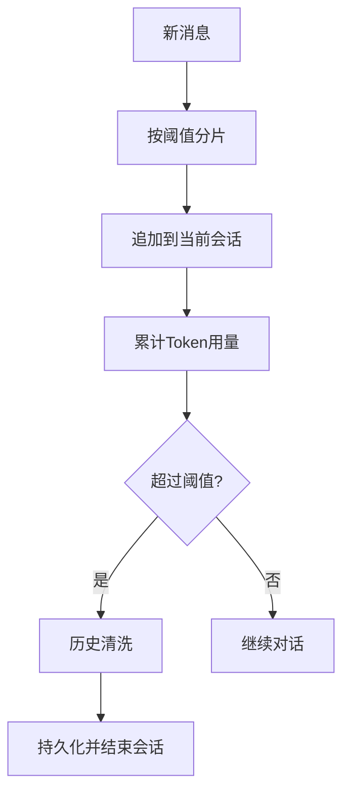
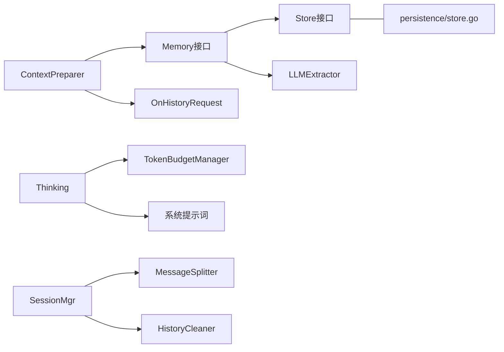

# 上下文准备

<cite>
**本文引用的文件**
- [internal/usecase/brain/context_preparer.go](file://internal/usecase/brain/context_preparer.go)
- [internal/usecase/brain/thinking.go](file://internal/usecase/brain/thinking.go)
- [internal/usecase/brain/token_budget.go](file://internal/usecase/brain/token_budget.go)
- [internal/core/memory.go](file://internal/core/memory.go)
- [internal/usecase/memory/memory.go](file://internal/usecase/memory/memory.go)
- [internal/usecase/memory/weight.go](file://internal/usecase/memory/weight.go)
- [internal/usecase/memory/extractor.go](file://internal/usecase/memory/extractor.go)
- [internal/usecase/session/session_mgr.go](file://internal/usecase/session/session_mgr.go)
- [internal/entity/session.go](file://internal/entity/session.go)
- [internal/infrastructure/persistence/store.go](file://internal/infrastructure/persistence/store.go)
- [config/models.yml](file://config/models.yml)
- [internal/usecase/brain/context_test.go](file://internal/usecase/brain/context_test.go)
- [internal/usecase/brain/token_budget_test.go](file://internal/usecase/brain/token_budget_test.go)
</cite>

## 目录
1. [简介](#简介)
2. [项目结构](#项目结构)
3. [核心组件](#核心组件)
4. [架构总览](#架构总览)
5. [详细组件分析](#详细组件分析)
6. [依赖关系分析](#依赖关系分析)
7. [性能考量](#性能考量)
8. [故障排查指南](#故障排查指南)
9. [结论](#结论)
10. [附录](#附录)

## 简介
本文件围绕“上下文准备”系统进行深入技术说明，涵盖历史对话获取、记忆片段提取、参考信息整合与提示工程等关键环节；解释上下文长度计算、截断策略与信息权重分配机制；阐述如何通过上下文准备实现个性化回复与语境理解；并给出性能优化策略与缓存机制建议，以及面向开发者的定制与扩展指南。

## 项目结构
上下文准备涉及“大脑”（思维与提示）层、“记忆”层、“会话”层与“持久化”层的协同：
- 上下文准备器负责组装历史对话与参考信息
- 思维模块负责动态计算可承载的历史轮次，并将参考信息注入系统提示
- 记忆模块负责记忆点的记录、检索与权重计算
- 会话管理器负责消息分片、历史清洗与会话生命周期管理
- 持久化层提供向量存储与元数据存储

图表来源
- [internal/usecase/brain/context_preparer.go](file://internal/usecase/brain/context_preparer.go#L1-L71)
- [internal/usecase/brain/thinking.go](file://internal/usecase/brain/thinking.go#L1-L120)
- [internal/usecase/memory/memory.go](file://internal/usecase/memory/memory.go#L1-L112)
- [internal/usecase/memory/extractor.go](file://internal/usecase/memory/extractor.go#L1-L149)
- [internal/usecase/session/session_mgr.go](file://internal/usecase/session/session_mgr.go#L1-L430)
- [internal/infrastructure/persistence/store.go](file://internal/infrastructure/persistence/store.go#L1-L57)

章节来源
- [internal/usecase/brain/context_preparer.go](file://internal/usecase/brain/context_preparer.go#L1-L71)
- [internal/usecase/brain/thinking.go](file://internal/usecase/brain/thinking.go#L1-L120)
- [internal/usecase/memory/memory.go](file://internal/usecase/memory/memory.go#L1-L112)
- [internal/usecase/session/session_mgr.go](file://internal/usecase/session/session_mgr.go#L1-L430)
- [internal/infrastructure/persistence/store.go](file://internal/infrastructure/persistence/store.go#L1-L57)

## 核心组件
- 上下文准备器（ContextPreparer）
  - 职责：从记忆检索参考片段，按思维模块建议的最大历史轮数拉取历史对话，组装成处理上下文
  - 关键方法：Prepare、buildReferencePrompt
- 思维模块（Thinking）
  - 职责：动态计算最大历史轮数、构建系统提示词、拼接历史与当前问题、流式接收与事件派发、记录Token用量与预算
  - 关键方法：CalculateMaxHistoryCount、Think、SetEventChan
- Token预算管理（TokenBudgetManager）
  - 职责：基于模型最大Token与预留输出Token，结合运行时平均Token消耗动态调整历史轮数
  - 关键方法：CalculateDynamicMaxHistoryCount、RecordUsage、SetSystemPromptTokens
- 记忆模块（Memory）
  - 职责：记录记忆点、检索相似记忆、聚类对话、清理过期记忆、生成向量
  - 关键方法：Record、Search、ClusterConversations、Optimize
- 权重计算（weight.go）
  - 职责：时间衰减权重、重复度惩罚权重、强调权重聚合
- 记忆提取器（LLMExtractor）
  - 职责：从会话中抽取记忆点并写入记忆系统
- 会话管理器（SessionMgr）
  - 职责：消息分片、历史清洗、Token用量统计、会话切换与持久化
- 持久化存储（Store）
  - 职责：Badger/内存存储工厂与向量相似度服务

章节来源
- [internal/usecase/brain/context_preparer.go](file://internal/usecase/brain/context_preparer.go#L1-L71)
- [internal/usecase/brain/thinking.go](file://internal/usecase/brain/thinking.go#L1-L120)
- [internal/usecase/brain/token_budget.go](file://internal/usecase/brain/token_budget.go#L1-L176)
- [internal/core/memory.go](file://internal/core/memory.go#L1-L40)
- [internal/usecase/memory/memory.go](file://internal/usecase/memory/memory.go#L1-L112)
- [internal/usecase/memory/weight.go](file://internal/usecase/memory/weight.go#L1-L58)
- [internal/usecase/memory/extractor.go](file://internal/usecase/memory/extractor.go#L1-L149)
- [internal/usecase/session/session_mgr.go](file://internal/usecase/session/session_mgr.go#L1-L430)
- [internal/infrastructure/persistence/store.go](file://internal/infrastructure/persistence/store.go#L1-L57)

## 架构总览
上下文准备的端到端流程如下：

图表来源
- [internal/usecase/brain/context_preparer.go](file://internal/usecase/brain/context_preparer.go#L25-L52)
- [internal/usecase/brain/thinking.go](file://internal/usecase/brain/thinking.go#L78-L119)
- [internal/usecase/session/session_mgr.go](file://internal/usecase/session/session_mgr.go#L223-L232)

## 详细组件分析

### 上下文准备器（ContextPreparer）
- 历史对话获取
  - 通过思维模块的“最大历史轮数”计算结果，向历史请求回调拉取对应轮次的历史消息
  - 若回调失败，记录警告日志并继续
- 记忆片段提取与参考信息整合
  - 调用记忆检索接口，将返回的记忆摘要拼接为“参考信息”
  - 将参考信息追加到系统提示词中，参与后续推理
- 输出
  - 返回处理上下文对象，包含历史对话与参考信息

图表来源
- [internal/usecase/brain/context_preparer.go](file://internal/usecase/brain/context_preparer.go#L25-L52)

章节来源
- [internal/usecase/brain/context_preparer.go](file://internal/usecase/brain/context_preparer.go#L1-L71)

### 思维模块与提示工程
- 动态历史轮数计算
  - 静态估算：可用Token预算 / 平均每轮Token
  - 动态调整：基于运行时统计的平均Token消耗平滑更新，避免模型参数变化导致的估算偏差
- 提示工程
  - 将参考信息拼接到系统提示词末尾，形成“系统提示词+参考信息”的提示模板
  - 支持流式接收与事件派发，便于前端实时渲染与监控
- Token用量与预算
  - 记录每次推理的Prompt/Completion/Total Token，驱动预算管理器更新

图表来源
- [internal/usecase/brain/thinking.go](file://internal/usecase/brain/thinking.go#L78-L119)
- [internal/usecase/brain/token_budget.go](file://internal/usecase/brain/token_budget.go#L95-L130)

章节来源
- [internal/usecase/brain/thinking.go](file://internal/usecase/brain/thinking.go#L1-L330)
- [internal/usecase/brain/token_budget.go](file://internal/usecase/brain/token_budget.go#L1-L176)

### 记忆系统与权重分配
- 记忆点结构
  - 包含关键词、内容、摘要、向量、聚类ID、时间/重复/强调/总权重等
- 权重计算
  - 时间权重：近期记忆更高，采用指数衰减
  - 重复权重：基于与已有记忆的关键词与摘要相似度统计，限制重复信息的过度权重
  - 强调权重：由外部或业务逻辑赋予
  - 总权重：三者聚合，用于检索排序
- 记忆提取
  - 基于LLM对会话进行话题分类、关键词、摘要与内容抽取，写入记忆系统

图表来源
- [internal/usecase/memory/extractor.go](file://internal/usecase/memory/extractor.go#L42-L83)
- [internal/usecase/memory/weight.go](file://internal/usecase/memory/weight.go#L12-L58)

章节来源
- [internal/core/memory.go](file://internal/core/memory.go#L1-L40)
- [internal/usecase/memory/memory.go](file://internal/usecase/memory/memory.go#L1-L112)
- [internal/usecase/memory/weight.go](file://internal/usecase/memory/weight.go#L1-L58)
- [internal/usecase/memory/extractor.go](file://internal/usecase/memory/extractor.go#L1-L149)

### 会话管理与历史清洗
- 消息分片
  - 将超长消息按固定阈值切分为多条，避免单条消息超出Token预算
- 历史清洗
  - 在返回历史前进行清洗，去除噪声与冗余，提升上下文质量
- Token统计与会话切换
  - 累计Token用量，达到阈值自动结束会话并触发记忆提取
  - 支持会话切换与持久化

图表来源
- [internal/usecase/session/session_mgr.go](file://internal/usecase/session/session_mgr.go#L164-L201)
- [internal/entity/session.go](file://internal/entity/session.go#L1-L23)

章节来源
- [internal/usecase/session/session_mgr.go](file://internal/usecase/session/session_mgr.go#L1-L430)
- [internal/entity/session.go](file://internal/entity/session.go#L1-L23)

### 持久化与向量存储
- 存储类型
  - Badger：适用于生产环境的高性能KV存储
  - 内存：适用于测试与轻量场景
- 向量服务
  - 提供相似度查找与Top-N候选过滤

章节来源
- [internal/infrastructure/persistence/store.go](file://internal/infrastructure/persistence/store.go#L1-L57)

## 依赖关系分析
- ContextPreparer 依赖 Memory 接口与 OnHistoryRequest 回调
- Thinking 依赖 TokenBudgetManager 与系统提示词模板
- Memory 依赖 Store 与 EmbeddingService，负责向量化与去重
- SessionMgr 依赖 MessageSplitter 与 HistoryCleaner，负责消息分片与清洗
- Store 提供 Badger/Memory 两种实现

图表来源
- [internal/usecase/brain/context_preparer.go](file://internal/usecase/brain/context_preparer.go#L1-L71)
- [internal/usecase/brain/thinking.go](file://internal/usecase/brain/thinking.go#L1-L120)
- [internal/usecase/memory/memory.go](file://internal/usecase/memory/memory.go#L1-L112)
- [internal/usecase/session/session_mgr.go](file://internal/usecase/session/session_mgr.go#L1-L430)
- [internal/infrastructure/persistence/store.go](file://internal/infrastructure/persistence/store.go#L1-L57)

章节来源
- [internal/usecase/brain/context_preparer.go](file://internal/usecase/brain/context_preparer.go#L1-L71)
- [internal/usecase/brain/thinking.go](file://internal/usecase/brain/thinking.go#L1-L120)
- [internal/usecase/memory/memory.go](file://internal/usecase/memory/memory.go#L1-L112)
- [internal/usecase/session/session_mgr.go](file://internal/usecase/session/session_mgr.go#L1-L430)
- [internal/infrastructure/persistence/store.go](file://internal/infrastructure/persistence/store.go#L1-L57)

## 性能考量
- Token预算与动态轮数
  - 通过运行时统计平滑更新平均Token消耗，避免静态估算误差
  - 最小历史轮数保障基础上下文，防止过度截断
- 历史清洗与消息分片
  - 清洗降低噪声，分片避免单条消息越界
- 存储与向量服务
  - Badger适合高吞吐场景；内存存储适合测试
- 日志与指标
  - 记录Token用量、平均轮次、动态调整前后对比，便于优化

章节来源
- [internal/usecase/brain/token_budget.go](file://internal/usecase/brain/token_budget.go#L75-L130)
- [internal/usecase/session/session_mgr.go](file://internal/usecase/session/session_mgr.go#L164-L201)
- [internal/infrastructure/persistence/store.go](file://internal/infrastructure/persistence/store.go#L25-L43)

## 故障排查指南
- 上下文准备失败
  - 检查记忆检索是否报错、历史请求回调是否返回空或错误
  - 查看日志中“获取记忆/历史”的警告与调试信息
- 思维模块异常
  - 关注Token用量保存失败、流式接收错误、模型调用失败
  - 检查系统提示词长度与参考信息拼接是否合理
- 记忆提取失败
  - LLM返回非JSON时会触发降级：整段摘要作为记忆点
  - 检查记忆点的关键词、摘要与内容是否符合预期
- 会话Token超限
  - 检查消息分片阈值设置与累计Token统计逻辑

章节来源
- [internal/usecase/brain/context_preparer.go](file://internal/usecase/brain/context_preparer.go#L30-L51)
- [internal/usecase/brain/thinking.go](file://internal/usecase/brain/thinking.go#L188-L220)
- [internal/usecase/memory/extractor.go](file://internal/usecase/memory/extractor.go#L128-L149)
- [internal/usecase/session/session_mgr.go](file://internal/usecase/session/session_mgr.go#L164-L201)

## 结论
上下文准备通过“记忆检索+历史对话+参考信息+提示工程”的组合，实现了对个性化与语境的理解。配合动态Token预算与历史轮数调整、消息分片与历史清洗、以及权重与记忆提取机制，系统在准确性与稳定性之间取得平衡。开发者可在上述模块中按需扩展与定制，以适配不同业务场景。

## 附录

### 上下文长度计算与截断策略
- 计算步骤
  - 参考信息长度：按摘要拼接后的字符数估算
  - 历史对话长度：按最大历史轮数与平均每轮Token估算
  - 系统提示词长度：按字符数近似估算（字符数/4）
  - 可用Token预算 = 模型最大Token - 预留输出Token - 系统提示词Token
  - 动态轮数 = 可用Token预算 / 实际平均每轮Token
- 截断策略
  - 当动态轮数小于最小轮数时，强制保留最小轮数
  - 当动态轮数大于实际可承载轮数时，按轮次裁剪历史对话

章节来源
- [internal/usecase/brain/thinking.go](file://internal/usecase/brain/thinking.go#L121-L159)
- [internal/usecase/brain/token_budget.go](file://internal/usecase/brain/token_budget.go#L95-L130)

### 信息权重分配机制
- 时间权重：近期记忆权重更高，随天数增长衰减
- 重复权重：基于关键词与摘要相似度统计重复次数，限制过度权重
- 强调权重：由业务或外部输入赋予
- 总权重：三者聚合，用于检索排序与上下文优先级

章节来源
- [internal/usecase/memory/weight.go](file://internal/usecase/memory/weight.go#L12-L58)

### 个性化回复与语境理解
- 个性化
  - 基于记忆检索与历史对话，增强对用户身份、偏好与上下文的感知
- 语境理解
  - 通过历史清洗与消息分片，减少噪声，提升连贯性与一致性
- 测试验证
  - 多轮对话一致性测试覆盖用户名、话题连续性与多轮总结等场景

章节来源
- [internal/usecase/brain/context_test.go](file://internal/usecase/brain/context_test.go#L1-L115)

### 性能优化与缓存机制
- 缓存建议
  - 记忆检索结果短期缓存（如LRU），减少重复查询
  - 历史对话按轮次缓存，结合Token预算动态失效
- 优化建议
  - 使用Badger存储提升检索与写入性能
  - 平滑更新平均Token消耗，减少频繁波动
  - 合理设置消息分片阈值，避免过度切分

章节来源
- [internal/infrastructure/persistence/store.go](file://internal/infrastructure/persistence/store.go#L25-L43)
- [internal/usecase/brain/token_budget.go](file://internal/usecase/brain/token_budget.go#L75-L93)

### 配置与使用示例（路径指引）
- 模型配置
  - 参考路径：config/models.yml
  - 关键项：模型名、BaseURL、API Key、温度、最大Token
- 上下文准备器创建
  - 参考路径：internal/usecase/brain/context_preparer.go
  - 关键函数：NewContextPreparer
- 思维模块与预算管理
  - 参考路径：internal/usecase/brain/thinking.go
  - 关键函数：NewThinking、CalculateMaxHistoryCount
  - 参考路径：internal/usecase/brain/token_budget.go
  - 关键函数：NewTokenBudgetManager、RecordUsage
- 记忆系统与提取
  - 参考路径：internal/usecase/memory/memory.go
  - 关键函数：Record、Search、ClusterConversations
  - 参考路径：internal/usecase/memory/extractor.go
  - 关键函数：Extract、buildPrompt
- 会话管理
  - 参考路径：internal/usecase/session/session_mgr.go
  - 关键函数：RecordMessage、GetHistory、CreateNewSession

章节来源
- [config/models.yml](file://config/models.yml#L1-L92)
- [internal/usecase/brain/context_preparer.go](file://internal/usecase/brain/context_preparer.go#L17-L23)
- [internal/usecase/brain/thinking.go](file://internal/usecase/brain/thinking.go#L33-L63)
- [internal/usecase/brain/token_budget.go](file://internal/usecase/brain/token_budget.go#L27-L42)
- [internal/usecase/memory/memory.go](file://internal/usecase/memory/memory.go#L28-L60)
- [internal/usecase/memory/extractor.go](file://internal/usecase/memory/extractor.go#L34-L40)
- [internal/usecase/session/session_mgr.go](file://internal/usecase/session/session_mgr.go#L109-L128)