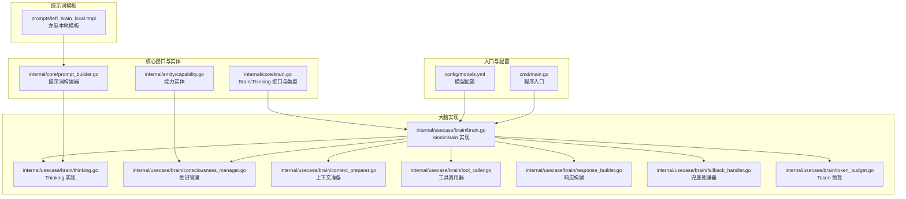
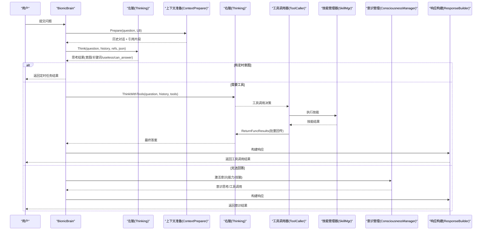
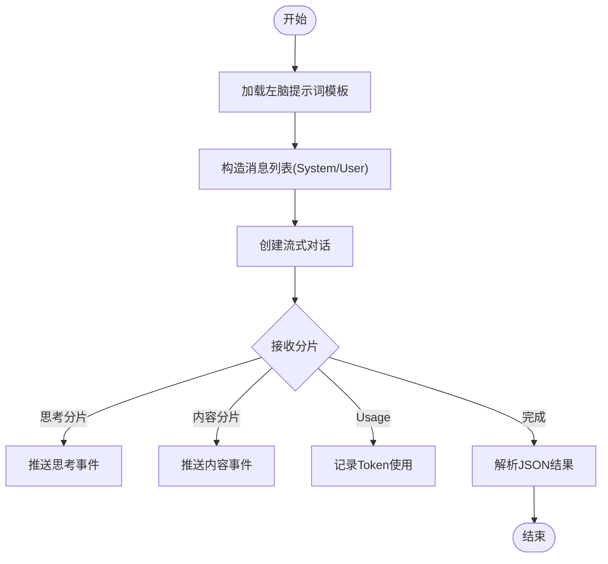
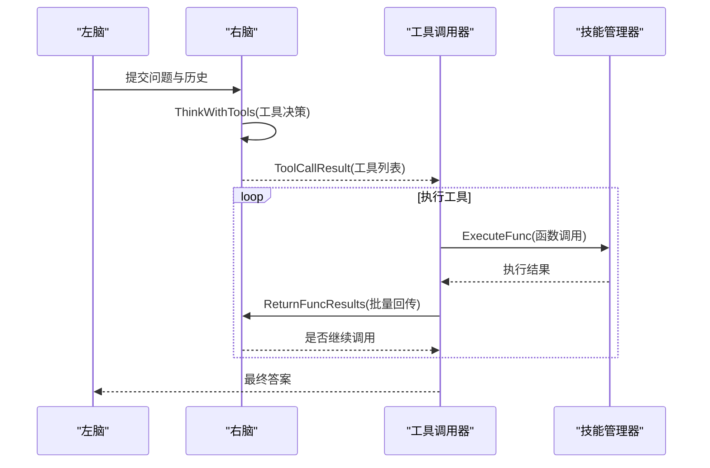
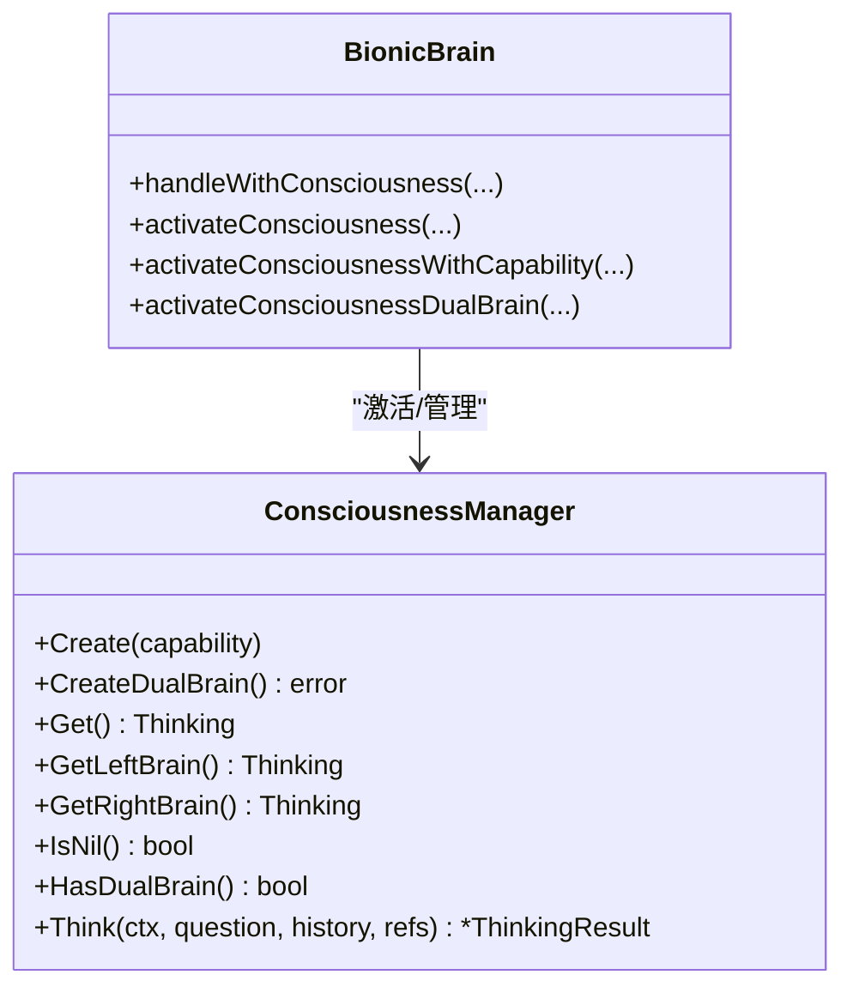
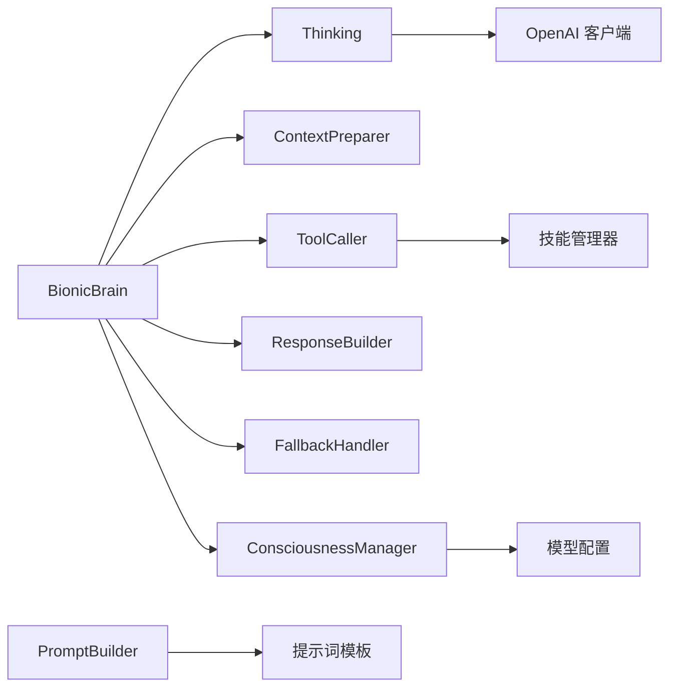

# 仿生大脑架构

<cite>
**本文档引用的文件**
- [cmd/main.go](file://cmd/main.go)
- [internal/core/brain.go](file://internal/core/brain.go)
- [internal/usecase/brain/brain.go](file://internal/usecase/brain/brain.go)
- [internal/usecase/brain/consciousness_manager.go](file://internal/usecase/brain/consciousness_manager.go)
- [internal/usecase/brain/thinking.go](file://internal/usecase/brain/thinking.go)
- [internal/usecase/brain/context_preparer.go](file://internal/usecase/brain/context_preparer.go)
- [internal/usecase/brain/tool_caller.go](file://internal/usecase/brain/tool_caller.go)
- [internal/usecase/brain/response_builder.go](file://internal/usecase/brain/response_builder.go)
- [internal/usecase/brain/token_budget.go](file://internal/usecase/brain/token_budget.go)
- [internal/usecase/brain/fallback_handler.go](file://internal/usecase/brain/fallback_handler.go)
- [internal/core/prompt_builder.go](file://internal/core/prompt_builder.go)
- [prompts/left_brain_local.tmpl](file://prompts/left_brain_local.tmpl)
- [config/models.yml](file://config/models.yml)
- [internal/entity/capability.go](file://internal/entity/capability.go)
</cite>

## 目录
1. [简介](#简介)
2. [项目结构](#项目结构)
3. [核心组件](#核心组件)
4. [架构总览](#架构总览)
5. [详细组件分析](#详细组件分析)
6. [依赖关系分析](#依赖关系分析)
7. [性能考量](#性能考量)
8. [故障排查指南](#故障排查指南)
9. [结论](#结论)
10. [附录](#附录)

## 简介
本项目实现了一种“仿生大脑”三层架构：左脑（潜意识）、右脑（工具调用）与意识（主意识）。其设计理念是：
- 左脑负责简单任务与低算力思考，使用本地小型模型，快速判断意图、关键词与是否需要工具调用。
- 右脑负责工具调用决策与执行，通过函数/工具调用能力连接技能系统，完成复杂任务。
- 意识（主意识）在左脑无法回答或需要更高阶能力时激活，可按能力动态创建，支持单脑或双脑模式。

系统具备思考流事件推送、动态历史轮数预算、工具调用批处理与回传、兜底回退机制、定时任务调度等功能，实现从“简单即快、复杂即强”的智能决策闭环。

## 项目结构
项目采用分层与领域驱动设计，核心位于 internal/usecase/brain 下，围绕大脑处理流程组织模块；核心接口与实体位于 internal/core；提示词模板位于 prompts；模型配置位于 config。

图表来源
- [cmd/main.go](file://cmd/main.go#L1-L21)
- [internal/core/brain.go](file://internal/core/brain.go#L1-L205)
- [internal/usecase/brain/brain.go](file://internal/usecase/brain/brain.go#L1-L674)
- [internal/usecase/brain/thinking.go](file://internal/usecase/brain/thinking.go#L1-L800)
- [internal/usecase/brain/consciousness_manager.go](file://internal/usecase/brain/consciousness_manager.go#L1-L130)
- [internal/usecase/brain/context_preparer.go](file://internal/usecase/brain/context_preparer.go#L1-L71)
- [internal/usecase/brain/tool_caller.go](file://internal/usecase/brain/tool_caller.go#L1-L209)
- [internal/usecase/brain/response_builder.go](file://internal/usecase/brain/response_builder.go#L1-L42)
- [internal/usecase/brain/token_budget.go](file://internal/usecase/brain/token_budget.go#L1-L226)
- [internal/core/prompt_builder.go](file://internal/core/prompt_builder.go#L1-L282)
- [prompts/left_brain_local.tmpl](file://prompts/left_brain_local.tmpl#L1-L102)
- [config/models.yml](file://config/models.yml#L1-L92)
- [internal/entity/capability.go](file://internal/entity/capability.go#L1-L16)

章节来源
- [cmd/main.go](file://cmd/main.go#L1-L21)
- [internal/core/brain.go](file://internal/core/brain.go#L1-L205)
- [internal/usecase/brain/brain.go](file://internal/usecase/brain/brain.go#L1-L674)

## 核心组件
- Brain 接口与类型：定义思考接口、思考事件、工具调用结果、思维请求/响应、能力与历史回调等。
- BionicBrain：大脑实现，协调左脑、右脑、意识、上下文准备、工具调用、响应构建与兜底。
- Thinking：思考实现，封装 OpenAI 客户端、流式响应、事件推送、Token 预算、工具调用与回传。
- ConsciousnessManager：意识管理，按能力动态创建单脑或双脑（左/右）。
- ContextPreparer：准备上下文，结合长时记忆与会话历史。
- ToolCaller：工具调用器，LLM 决策 → 技能执行 → 结果回传 → 可继续调用。
- ResponseBuilder：统一构建响应。
- TokenBudgetManager：动态预算管理，基于实际消耗调整历史轮数上限。
- FallbackHandler：兜底处理器，右脑重试或返回友好提示。
- PromptBuilder：提示词构建器，支持本地/云端模板与回退策略。

章节来源
- [internal/core/brain.go](file://internal/core/brain.go#L1-L205)
- [internal/usecase/brain/brain.go](file://internal/usecase/brain/brain.go#L1-L674)
- [internal/usecase/brain/thinking.go](file://internal/usecase/brain/thinking.go#L1-L800)
- [internal/usecase/brain/consciousness_manager.go](file://internal/usecase/brain/consciousness_manager.go#L1-L130)
- [internal/usecase/brain/context_preparer.go](file://internal/usecase/brain/context_preparer.go#L1-L71)
- [internal/usecase/brain/tool_caller.go](file://internal/usecase/brain/tool_caller.go#L1-L209)
- [internal/usecase/brain/response_builder.go](file://internal/usecase/brain/response_builder.go#L1-L42)
- [internal/usecase/brain/token_budget.go](file://internal/usecase/brain/token_budget.go#L1-L226)
- [internal/usecase/brain/fallback_handler.go](file://internal/usecase/brain/fallback_handler.go#L1-L60)
- [internal/core/prompt_builder.go](file://internal/core/prompt_builder.go#L1-L282)

## 架构总览
三层架构与协作流程如下：

图表来源
- [internal/usecase/brain/brain.go](file://internal/usecase/brain/brain.go#L133-L237)
- [internal/usecase/brain/thinking.go](file://internal/usecase/brain/thinking.go#L121-L329)
- [internal/usecase/brain/tool_caller.go](file://internal/usecase/brain/tool_caller.go#L27-L139)
- [internal/usecase/brain/consciousness_manager.go](file://internal/usecase/brain/consciousness_manager.go#L40-L129)
- [internal/usecase/brain/response_builder.go](file://internal/usecase/brain/response_builder.go#L13-L41)

## 详细组件分析

### 左脑（潜意识）：快速意图识别与简单回答
- 职责：使用本地小型模型，基于提示词模板进行思考，输出 JSON 包含意图、关键词、useless、can_answer、定时/转发等信息。
- 关键点：
  - 提示词模板：本地模板与回退策略，支持人设注入与思考步骤。
  - 动态历史轮数：根据 Token 预算与实际消耗动态计算最大历史轮数。
  - 流式事件：开始、进度、分片、工具调用、结果、错误事件推送。
- 交互示例（路径参考）：
  - [左脑思考实现](file://internal/usecase/brain/thinking.go#L121-L329)
  - [提示词构建器](file://internal/core/prompt_builder.go#L119-L161)
  - [本地模板](file://prompts/left_brain_local.tmpl#L1-L102)

图表来源
- [internal/usecase/brain/thinking.go](file://internal/usecase/brain/thinking.go#L121-L329)
- [internal/core/prompt_builder.go](file://internal/core/prompt_builder.go#L119-L161)
- [prompts/left_brain_local.tmpl](file://prompts/left_brain_local.tmpl#L1-L102)

章节来源
- [internal/usecase/brain/thinking.go](file://internal/usecase/brain/thinking.go#L121-L329)
- [internal/core/prompt_builder.go](file://internal/core/prompt_builder.go#L119-L161)
- [prompts/left_brain_local.tmpl](file://prompts/left_brain_local.tmpl#L1-L102)

### 右脑（工具调用）：函数/工具调用与技能执行
- 职责：根据左脑意图与关键词匹配工具，LLM 决定调用哪些工具，执行技能，批量回传结果，必要时继续调用。
- 关键点：
  - 工具搜索：基于关键词检索技能，生成工具 Schema（名称、描述、参数、输出格式、使用指南）。
  - 工具调用：支持多轮调用，最大调用次数限制，错误回传与继续决策。
  - 结果回传：批量回传工具执行结果给 LLM，获得最终答案。
- 交互示例（路径参考）：
  - [工具调用器](file://internal/usecase/brain/tool_caller.go#L27-L139)
  - [右脑思考与工具调用](file://internal/usecase/brain/thinking.go#L338-L577)

图表来源
- [internal/usecase/brain/tool_caller.go](file://internal/usecase/brain/tool_caller.go#L27-L139)
- [internal/usecase/brain/thinking.go](file://internal/usecase/brain/thinking.go#L338-L577)

章节来源
- [internal/usecase/brain/tool_caller.go](file://internal/usecase/brain/tool_caller.go#L27-L139)
- [internal/usecase/brain/thinking.go](file://internal/usecase/brain/thinking.go#L338-L577)

### 意识（主意识）：高级思考与能力扩展
- 职责：当左脑无法回答或需要更强能力时激活；可按能力创建单脑或双脑（左/右）模式。
- 关键点：
  - 能力前缀：支持以“/能力名”强制走指定能力。
  - 单脑模式：按能力模型与系统提示词创建思考实例。
  - 双脑模式：同时创建左/右脑，先左脑思考，再右脑工具调用。
- 交互示例（路径参考）：
  - [意识管理](file://internal/usecase/brain/consciousness_manager.go#L40-L129)
  - [按能力激活](file://internal/usecase/brain/brain.go#L611-L673)
  - [双脑激活](file://internal/usecase/brain/brain.go#L395-L451)

图表来源
- [internal/usecase/brain/consciousness_manager.go](file://internal/usecase/brain/consciousness_manager.go#L13-L129)
- [internal/usecase/brain/brain.go](file://internal/usecase/brain/brain.go#L307-L451)

章节来源
- [internal/usecase/brain/consciousness_manager.go](file://internal/usecase/brain/consciousness_manager.go#L40-L129)
- [internal/usecase/brain/brain.go](file://internal/usecase/brain/brain.go#L307-L451)

### 上下文准备与思考流事件
- ContextPreparer：从长时记忆检索引用片段，结合历史对话与左脑最大历史轮数，构造上下文。
- 思考流事件：通过 EventChan 推送思考开始、进度、分片、工具调用、结果、错误等事件，便于前端实时反馈。
- 交互示例（路径参考）：
  - [上下文准备](file://internal/usecase/brain/context_preparer.go#L25-L52)
  - [思考流事件](file://internal/usecase/brain/thinking.go#L69-L76)

章节来源
- [internal/usecase/brain/context_preparer.go](file://internal/usecase/brain/context_preparer.go#L25-L52)
- [internal/usecase/brain/thinking.go](file://internal/usecase/brain/thinking.go#L69-L76)

### 响应构建与兜底处理
- ResponseBuilder：统一构建左脑直接回答与工具调用回答两种响应。
- FallbackHandler：当右脑工具调用失败或无法回答时，尝试用右脑重试或返回友好提示。
- 交互示例（路径参考）：
  - [响应构建](file://internal/usecase/brain/response_builder.go#L13-L41)
  - [兜底处理](file://internal/usecase/brain/fallback_handler.go#L31-L59)

章节来源
- [internal/usecase/brain/response_builder.go](file://internal/usecase/brain/response_builder.go#L13-L41)
- [internal/usecase/brain/fallback_handler.go](file://internal/usecase/brain/fallback_handler.go#L31-L59)

### Token 预算与算力优化
- TokenBudgetManager：动态统计输入/输出 Token，平滑更新平均每轮 Token 消耗，据此计算最大历史轮数，避免越界。
- 算力优化：
  - 动态历史轮数：减少长历史带来的 Token 超限风险。
  - 工具调用批处理：一次回传多个结果，减少往返次数。
  - 事件通道：前端可边看边用，提升感知性能。
- 交互示例（路径参考）：
  - [动态历史轮数计算](file://internal/usecase/brain/thinking.go#L78-L119)
  - [预算记录与统计](file://internal/usecase/brain/token_budget.go#L51-L150)

章节来源
- [internal/usecase/brain/thinking.go](file://internal/usecase/brain/thinking.go#L78-L119)
- [internal/usecase/brain/token_budget.go](file://internal/usecase/brain/token_budget.go#L51-L150)

## 依赖关系分析
- 模块耦合：
  - BionicBrain 依赖 Thinking、ContextPreparer、ToolCaller、ResponseBuilder、FallbackHandler、ConsciousnessManager。
  - Thinking 依赖模型配置、日志、Token 仓库与重试机制。
  - ToolCaller 依赖技能管理器与日志。
  - ConsciousnessManager 依赖模型管理器与能力配置。
- 外部依赖：
  - OpenAI 客户端用于流式对话与工具调用。
  - 模板系统用于提示词渲染。
  - Prometheus 指标埋点用于 LLM 调用统计。

图表来源
- [internal/usecase/brain/brain.go](file://internal/usecase/brain/brain.go#L36-L131)
- [internal/usecase/brain/thinking.go](file://internal/usecase/brain/thinking.go#L33-L63)
- [internal/usecase/brain/tool_caller.go](file://internal/usecase/brain/tool_caller.go#L15-L25)
- [internal/usecase/brain/consciousness_manager.go](file://internal/usecase/brain/consciousness_manager.go#L23-L59)
- [internal/core/prompt_builder.go](file://internal/core/prompt_builder.go#L46-L68)

章节来源
- [internal/usecase/brain/brain.go](file://internal/usecase/brain/brain.go#L36-L131)
- [internal/usecase/brain/thinking.go](file://internal/usecase/brain/thinking.go#L33-L63)
- [internal/usecase/brain/tool_caller.go](file://internal/usecase/brain/tool_caller.go#L15-L25)
- [internal/usecase/brain/consciousness_manager.go](file://internal/usecase/brain/consciousness_manager.go#L23-L59)
- [internal/core/prompt_builder.go](file://internal/core/prompt_builder.go#L46-L68)

## 性能考量
- 动态历史轮数：根据实际 Token 消耗平滑更新，避免静态估算导致的历史截断不足或浪费。
- 工具调用批处理：一次回传多个结果，减少往返次数，提高吞吐。
- 流式响应：前端可边接收边展示，降低首屏延迟。
- 指标监控：埋点 LLM 调用次数、耗时与 Token 使用，便于容量规划与优化。
- 模型选择：通过配置文件选择不同模型，按任务复杂度与成本权衡。

## 故障排查指南
- 左脑思考失败：检查模型连接、提示词模板加载与 Token 预算配置。
  - 参考路径：[左脑思考](file://internal/usecase/brain/thinking.go#L121-L329)
- 右脑工具调用失败：检查工具搜索、技能执行与结果回传链路。
  - 参考路径：[工具调用器](file://internal/usecase/brain/tool_caller.go#L27-L139)
- 意识激活失败：确认能力配置、模型可用性与系统提示词。
  - 参考路径：[意识管理](file://internal/usecase/brain/consciousness_manager.go#L40-L129)
- Token 统计异常：检查预算记录与平均值平滑更新逻辑。
  - 参考路径：[Token 预算](file://internal/usecase/brain/token_budget.go#L51-L150)

章节来源
- [internal/usecase/brain/thinking.go](file://internal/usecase/brain/thinking.go#L121-L329)
- [internal/usecase/brain/tool_caller.go](file://internal/usecase/brain/tool_caller.go#L27-L139)
- [internal/usecase/brain/consciousness_manager.go](file://internal/usecase/brain/consciousness_manager.go#L40-L129)
- [internal/usecase/brain/token_budget.go](file://internal/usecase/brain/token_budget.go#L51-L150)

## 结论
本仿生大脑架构通过左脑、右脑与意识的分层协同，实现了从“简单即快、复杂即强”的智能决策闭环。系统具备完善的思考流事件推送、动态历史轮数预算、工具调用批处理与回传、兜底回退与能力扩展能力，能够根据任务复杂度自动选择合适的思考层级，实现算力优化与资源合理分配。开发者可通过能力与模型配置灵活扩展，满足多样化的业务场景。

## 附录
- 初始化流程（路径参考）：
  - [程序入口](file://cmd/main.go#L14-L20)
  - [大脑构造](file://internal/usecase/brain/brain.go#L56-L131)
- 模型配置（路径参考）：
  - [模型配置](file://config/models.yml#L1-L92)
- 能力定义（路径参考）：
  - [能力实体](file://internal/entity/capability.go#L4-L15)