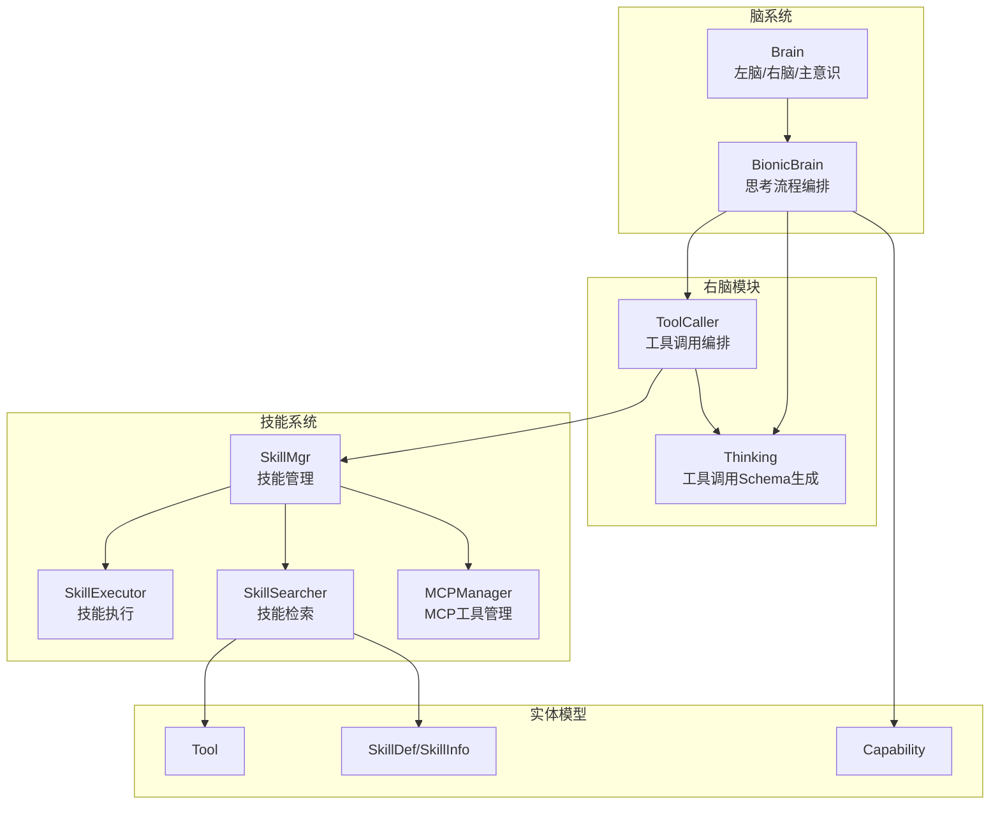
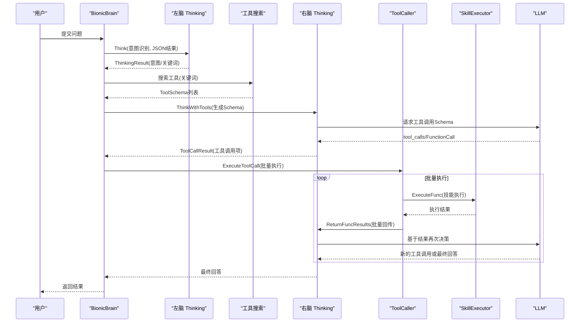
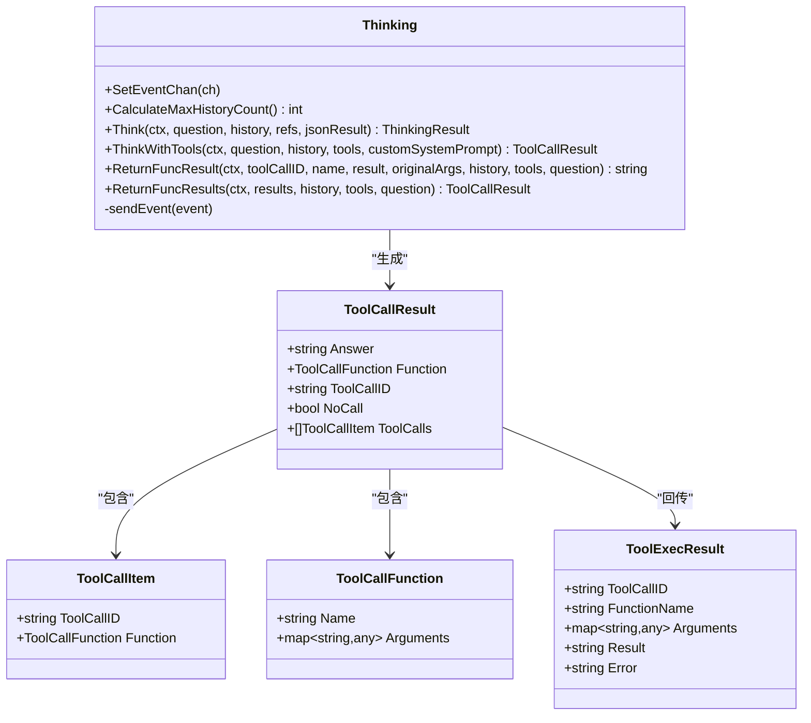
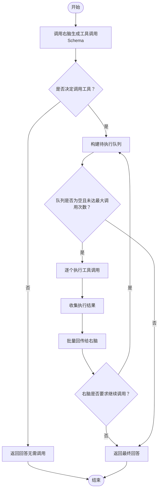
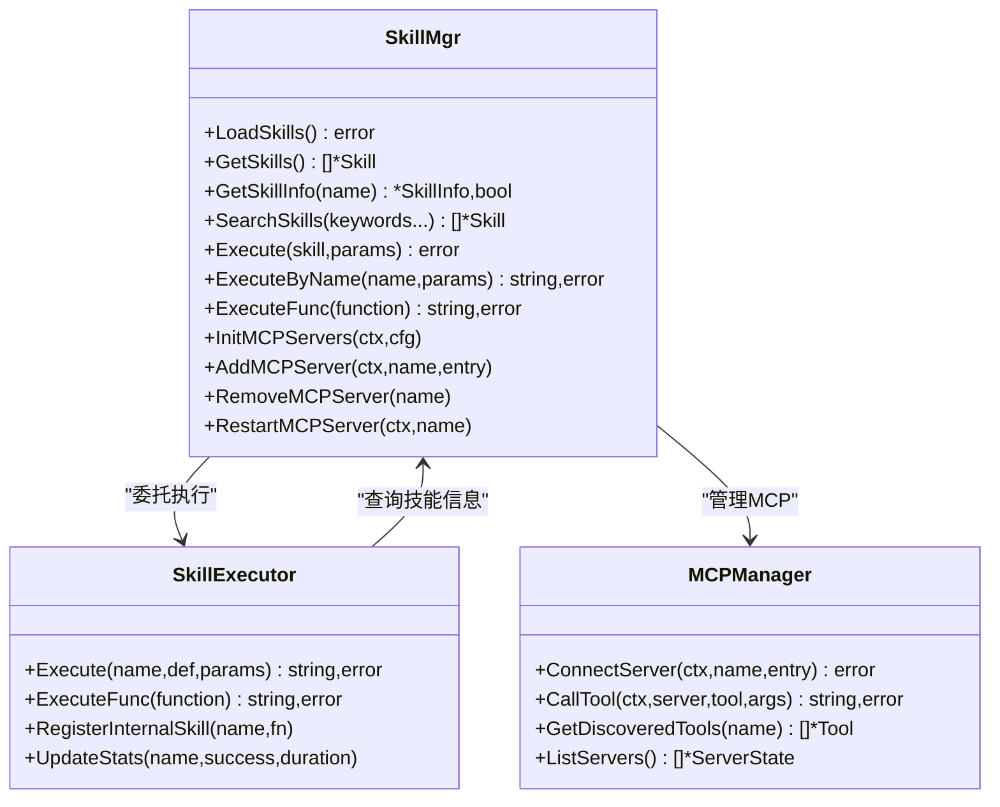
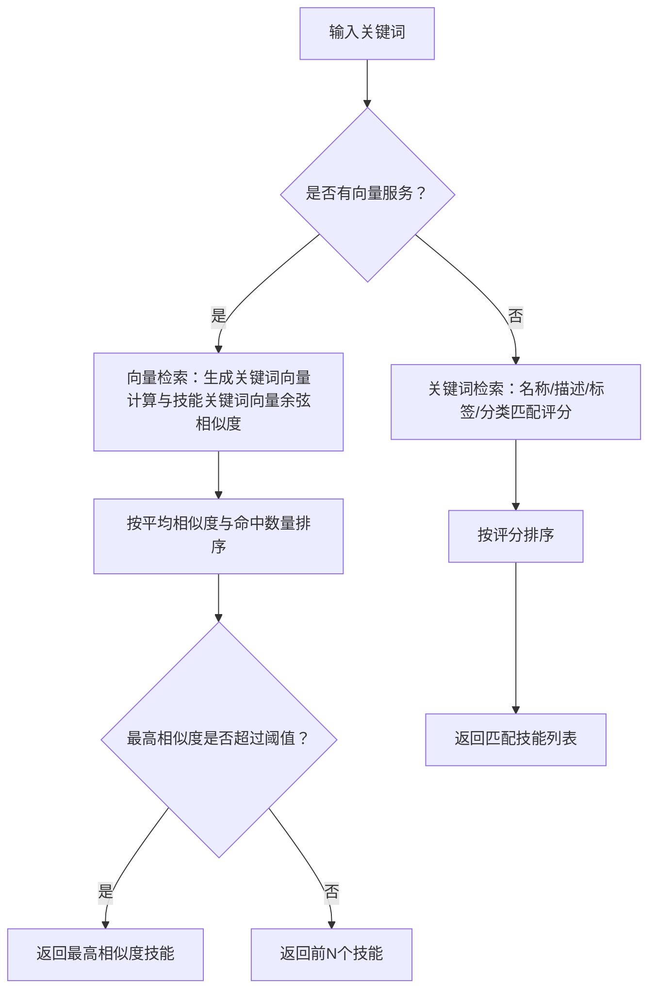
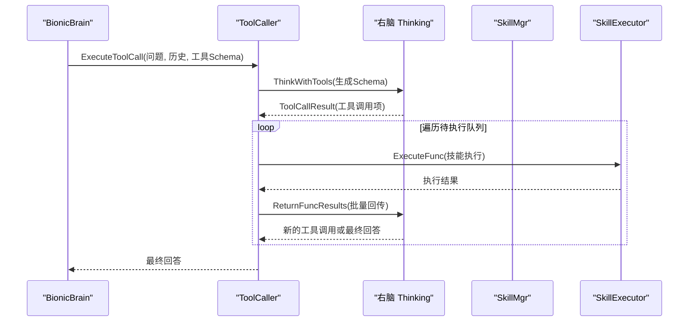
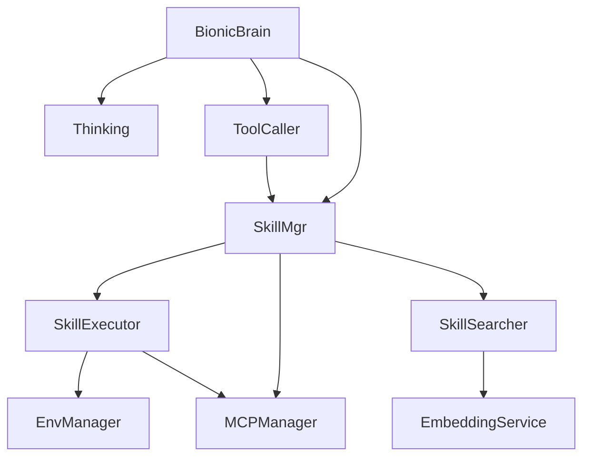

# 右脑工具调用机制

<cite>
**本文档引用的文件**
- [internal/core/brain.go](file://internal/core/brain.go)
- [internal/usecase/brain/brain.go](file://internal/usecase/brain/brain.go)
- [internal/usecase/brain/thinking.go](file://internal/usecase/brain/thinking.go)
- [internal/usecase/brain/tool_caller.go](file://internal/usecase/brain/tool_caller.go)
- [internal/usecase/skills/skill_mgr.go](file://internal/usecase/skills/skill_mgr.go)
- [internal/usecase/skills/executor.go](file://internal/usecase/skills/executor.go)
- [internal/usecase/skills/searcher.go](file://internal/usecase/skills/searcher.go)
- [internal/usecase/skills/mcp_manager.go](file://internal/usecase/skills/mcp_manager.go)
- [internal/entity/tool.go](file://internal/entity/tool.go)
- [internal/entity/skill.go](file://internal/entity/skill.go)
- [internal/entity/capability.go](file://internal/entity/capability.go)
- [internal/usecase/brain/tool_execution_test.go](file://internal/usecase/brain/tool_execution_test.go)
- [internal/usecase/brain/tool_call_test.go](file://internal/usecase/brain/tool_call_test.go)
- [config/models.yml](file://config/models.yml)
- [internal/usecase/skills/builtins/registry.go](file://internal/usecase/skills/builtins/registry.go)
</cite>

## 目录
1. [简介](#简介)
2. [项目结构](#项目结构)
3. [核心组件](#核心组件)
4. [架构总览](#架构总览)
5. [详细组件分析](#详细组件分析)
6. [依赖关系分析](#依赖关系分析)
7. [性能考虑](#性能考虑)
8. [故障排除指南](#故障排除指南)
9. [结论](#结论)
10. [附录](#附录)

## 简介
本文件面向开发者，系统性阐述右脑工具调用机制的设计与实现。右脑作为行为性思考系统，负责在复杂任务中生成工具调用Schema并驱动函数调用执行，其核心目标是：
- 基于用户意图与关键词，从技能库中检索匹配工具
- 通过专用的右脑模型生成工具调用Schema（函数调用规范）
- 执行工具调用并将结果回传给模型，驱动最终回答或继续调用
- 提供工具匹配算法、调用序列、结果聚合与错误处理机制
- 支持与技能管理器的交互、工具调用生命周期管理与回退策略

## 项目结构
右脑工具调用机制涉及的核心模块如下：
- 脑系统（Brain）：封装左脑、右脑与主意识，协调思考流程与工具调用
- 右脑思考（Thinking）：负责工具调用Schema生成与结果回传
- 工具调用器（ToolCaller）：协调工具决策、执行与结果回传循环
- 技能管理器（SkillMgr）：统一管理内置技能、外部脚本技能与MCP工具
- 技能执行器（SkillExecutor）：实际执行技能，支持内部函数、外部命令与MCP工具
- 技能搜索器（SkillSearcher）：基于关键词与向量的技能检索
- 实体模型（Tool/Skill/Capability）：工具、技能与能力的数据结构

**图表来源**
- [internal/core/brain.go](file://internal/core/brain.go#L116-L140)
- [internal/usecase/brain/brain.go](file://internal/usecase/brain/brain.go#L36-L131)
- [internal/usecase/brain/thinking.go](file://internal/usecase/brain/thinking.go#L21-L63)
- [internal/usecase/brain/tool_caller.go](file://internal/usecase/brain/tool_caller.go#L15-L25)
- [internal/usecase/skills/skill_mgr.go](file://internal/usecase/skills/skill_mgr.go#L20-L62)
- [internal/usecase/skills/executor.go](file://internal/usecase/skills/executor.go#L19-L42)
- [internal/usecase/skills/searcher.go](file://internal/usecase/skills/searcher.go#L15-L32)
- [internal/usecase/skills/mcp_manager.go](file://internal/usecase/skills/mcp_manager.go#L36-L47)
- [internal/entity/tool.go](file://internal/entity/tool.go#L3-L10)
- [internal/entity/skill.go](file://internal/entity/skill.go#L5-L25)
- [internal/entity/capability.go](file://internal/entity/capability.go#L3-L15)

**章节来源**
- [internal/core/brain.go](file://internal/core/brain.go#L116-L140)
- [internal/usecase/brain/brain.go](file://internal/usecase/brain/brain.go#L36-L131)

## 核心组件
- Brain与BionicBrain：负责思考流程编排，包括左脑意图识别、工具搜索、右脑工具调用、主意识能力路由与回退策略
- Thinking（右脑）：生成工具调用Schema，支持函数调用（tool_calls）与旧版FunctionCall格式；负责批量回传工具执行结果
- ToolCaller：协调一次完整的工具调用生命周期，包括工具决策、批量执行、结果回传与继续调用
- SkillMgr：技能全生命周期管理，包括加载、索引、检索、执行、MCP工具注册与运行时管理
- SkillExecutor：实际执行技能，支持内部函数、外部脚本与MCP工具
- SkillSearcher：基于关键词与向量的技能检索，提供向量化相似度匹配与关键词匹配双通道
- 实体模型：Tool、SkillDef/SkillInfo、Capability，支撑工具定义、技能元数据与能力配置

**章节来源**
- [internal/core/brain.go](file://internal/core/brain.go#L70-L140)
- [internal/usecase/brain/thinking.go](file://internal/usecase/brain/thinking.go#L21-L63)
- [internal/usecase/brain/tool_caller.go](file://internal/usecase/brain/tool_caller.go#L15-L25)
- [internal/usecase/skills/skill_mgr.go](file://internal/usecase/skills/skill_mgr.go#L20-L62)
- [internal/usecase/skills/executor.go](file://internal/usecase/skills/executor.go#L19-L42)
- [internal/usecase/skills/searcher.go](file://internal/usecase/skills/searcher.go#L15-L32)
- [internal/entity/tool.go](file://internal/entity/tool.go#L3-L10)
- [internal/entity/skill.go](file://internal/entity/skill.go#L5-L25)
- [internal/entity/capability.go](file://internal/entity/capability.go#L3-L15)

## 架构总览
右脑工具调用机制遵循“意图识别 → 工具检索 → Schema生成 → 批量执行 → 结果回传 → 决策继续”的闭环流程。该流程在左脑与右脑之间协作，必要时接入主意识能力。

**图表来源**
- [internal/usecase/brain/brain.go](file://internal/usecase/brain/brain.go#L133-L237)
- [internal/usecase/brain/thinking.go](file://internal/usecase/brain/thinking.go#L338-L577)
- [internal/usecase/brain/tool_caller.go](file://internal/usecase/brain/tool_caller.go#L27-L139)
- [internal/usecase/skills/executor.go](file://internal/usecase/skills/executor.go#L197-L216)

## 详细组件分析

### 右脑思考（Thinking）组件
右脑的核心职责是生成工具调用Schema并处理结果回传。它支持以下关键能力：
- 工具调用Schema生成：将ToolSchema转换为OpenAI工具定义，构建系统提示与消息流，调用模型生成tool_calls或FunctionCall
- 结果回传：将工具执行结果批量回传给模型，支持继续调用或最终回答
- 事件推送：通过事件通道推送思考过程（开始、进度、分片、工具调用、结果、完成、错误）

**图表来源**
- [internal/usecase/brain/thinking.go](file://internal/usecase/brain/thinking.go#L21-L63)
- [internal/core/brain.go](file://internal/core/brain.go#L27-L68)

**章节来源**
- [internal/usecase/brain/thinking.go](file://internal/usecase/brain/thinking.go#L338-L577)
- [internal/usecase/brain/thinking.go](file://internal/usecase/brain/thinking.go#L579-L800)
- [internal/core/brain.go](file://internal/core/brain.go#L27-L68)

### 工具调用器（ToolCaller）组件
ToolCaller负责一次完整的工具调用生命周期：
- 工具决策：调用右脑生成工具调用Schema
- 批量执行：遍历待执行队列，调用技能执行器执行工具
- 结果回传：将执行结果批量回传给右脑，驱动模型继续调用或最终回答
- 循环控制：限制最大调用次数，防止无限循环

**图表来源**
- [internal/usecase/brain/tool_caller.go](file://internal/usecase/brain/tool_caller.go#L27-L139)

**章节来源**
- [internal/usecase/brain/tool_caller.go](file://internal/usecase/brain/tool_caller.go#L27-L139)

### 技能管理器（SkillMgr）与执行器（SkillExecutor）
SkillMgr提供技能全生命周期管理：
- 加载与索引：加载技能定义、建立向量索引、同步组件
- 搜索：基于关键词与向量相似度检索技能
- 执行：根据技能类型（内部函数、外部脚本、MCP工具）执行
- MCP管理：连接MCP服务器、发现工具、调用工具

SkillExecutor负责具体执行：
- 内部技能：直接调用注册的Go函数
- 外部技能：通过命令行执行脚本，支持参数序列化与超时控制
- MCP技能：通过MCP客户端调用远端工具

**图表来源**
- [internal/usecase/skills/skill_mgr.go](file://internal/usecase/skills/skill_mgr.go#L20-L84)
- [internal/usecase/skills/executor.go](file://internal/usecase/skills/executor.go#L19-L42)
- [internal/usecase/skills/mcp_manager.go](file://internal/usecase/skills/mcp_manager.go#L36-L47)

**章节来源**
- [internal/usecase/skills/skill_mgr.go](file://internal/usecase/skills/skill_mgr.go#L20-L84)
- [internal/usecase/skills/executor.go](file://internal/usecase/skills/executor.go#L57-L216)
- [internal/usecase/skills/mcp_manager.go](file://internal/usecase/skills/mcp_manager.go#L49-L141)

### 工具匹配算法与检索
工具匹配采用双通道策略：
- 向量检索：基于关键词向量与技能关键词向量的余弦相似度，筛选高分技能
- 关键词检索：当向量服务不可用或无向量时，回退到关键词匹配，结合名称、描述、标签、分类进行评分排序

**图表来源**
- [internal/usecase/skills/searcher.go](file://internal/usecase/skills/searcher.go#L72-L188)
- [internal/usecase/skills/searcher.go](file://internal/usecase/skills/searcher.go#L190-L281)

**章节来源**
- [internal/usecase/skills/searcher.go](file://internal/usecase/skills/searcher.go#L42-L188)
- [internal/usecase/skills/searcher.go](file://internal/usecase/skills/searcher.go#L190-L281)

### 与技能管理器的交互与工具调用生命周期
- 工具生成阶段：BionicBrain调用OnToolsRequest获取ToolSchema，右脑将ToolSchema转换为OpenAI工具定义并请求模型生成Schema
- 执行阶段：ToolCaller批量执行工具调用，SkillExecutor根据技能类型执行
- 结果回传阶段：ToolCaller将执行结果批量回传给右脑，驱动模型继续调用或最终回答
- 生命周期管理：支持最大调用次数限制、错误记录与统计更新、MCP服务器的连接与重试

**图表来源**
- [internal/usecase/brain/brain.go](file://internal/usecase/brain/brain.go#L239-L305)
- [internal/usecase/brain/tool_caller.go](file://internal/usecase/brain/tool_caller.go#L27-L139)
- [internal/usecase/brain/thinking.go](file://internal/usecase/brain/thinking.go#L694-L800)
- [internal/usecase/skills/executor.go](file://internal/usecase/skills/executor.go#L197-L216)

**章节来源**
- [internal/usecase/brain/brain.go](file://internal/usecase/brain/brain.go#L239-L305)
- [internal/usecase/brain/tool_caller.go](file://internal/usecase/brain/tool_caller.go#L27-L139)
- [internal/usecase/brain/thinking.go](file://internal/usecase/brain/thinking.go#L694-L800)
- [internal/usecase/skills/executor.go](file://internal/usecase/skills/executor.go#L197-L216)

### 错误处理与回退策略
- 右脑工具调用失败：记录错误并回退到左脑或主意识能力
- MCP连接失败：区分可重试错误（超时/网络）与不可重试错误（协议/进程崩溃），实施指数退避重试
- 技能执行失败：记录错误与结果，继续调用其他工具或返回最终回答
- 令牌预算与历史长度：动态计算最大历史轮次，避免超出模型承载能力

**章节来源**
- [internal/usecase/brain/brain.go](file://internal/usecase/brain/brain.go#L307-L393)
- [internal/usecase/skills/mcp_manager.go](file://internal/usecase/skills/mcp_manager.go#L404-L468)
- [internal/usecase/skills/executor.go](file://internal/usecase/skills/executor.go#L105-L136)
- [internal/usecase/brain/thinking.go](file://internal/usecase/brain/thinking.go#L78-L119)

## 依赖关系分析
右脑工具调用机制的关键依赖关系如下：
- BionicBrain依赖Thinking（左右脑）、ToolCaller、SkillMgr、ContextPreparer、ResponseBuilder、FallbackHandler
- ToolCaller依赖SkillMgr与Logging
- SkillMgr依赖SkillLoader、SkillExecutor、SkillSearcher、SkillIndexer、SkillConverter、Installer、EnvManager、MCPManager
- SkillExecutor依赖EnvManager、MCPManager、Store
- SkillSearcher依赖EmbeddingService与向量表
- MCPManager负责MCP服务器连接、工具发现与调用

**图表来源**
- [internal/usecase/brain/brain.go](file://internal/usecase/brain/brain.go#L36-L131)
- [internal/usecase/brain/tool_caller.go](file://internal/usecase/brain/tool_caller.go#L15-L25)
- [internal/usecase/skills/skill_mgr.go](file://internal/usecase/skills/skill_mgr.go#L20-L62)
- [internal/usecase/skills/executor.go](file://internal/usecase/skills/executor.go#L19-L42)
- [internal/usecase/skills/searcher.go](file://internal/usecase/skills/searcher.go#L15-L32)
- [internal/usecase/skills/mcp_manager.go](file://internal/usecase/skills/mcp_manager.go#L36-L47)

**章节来源**
- [internal/usecase/brain/brain.go](file://internal/usecase/brain/brain.go#L36-L131)
- [internal/usecase/brain/tool_caller.go](file://internal/usecase/brain/tool_caller.go#L15-L25)
- [internal/usecase/skills/skill_mgr.go](file://internal/usecase/skills/skill_mgr.go#L20-L62)

## 性能考虑
- 令牌预算与历史长度：通过动态计算最大历史轮次，平衡上下文长度与模型承载能力
- 向量检索：在向量服务可用时优先使用，减少无关技能匹配；在向量缺失时回退关键词匹配
- 调用循环限制：限制最大工具调用次数，避免深度链路导致的资源耗尽
- MCP连接重试：区分可重试与不可重试错误，采用指数退避策略，降低瞬时故障影响
- 执行超时：外部脚本与MCP工具均设置超时，避免长时间阻塞

**章节来源**
- [internal/usecase/brain/thinking.go](file://internal/usecase/brain/thinking.go#L78-L119)
- [internal/usecase/skills/searcher.go](file://internal/usecase/skills/searcher.go#L72-L188)
- [internal/usecase/brain/tool_caller.go](file://internal/usecase/brain/tool_caller.go#L13-L13)
- [internal/usecase/skills/mcp_manager.go](file://internal/usecase/skills/mcp_manager.go#L404-L468)
- [internal/usecase/skills/executor.go](file://internal/usecase/skills/executor.go#L145-L151)

## 故障排除指南
- 右脑工具调用失败：检查工具Schema生成与模型返回格式，确认tool_calls或FunctionCall解析
- 技能执行失败：查看技能是否存在、参数是否正确、外部命令是否可执行、MCP服务器状态
- MCP连接失败：确认服务器地址/认证/传输类型配置，检查可重试错误与不可重试错误
- 向量检索异常：确认嵌入服务可用、向量表是否为空、关键词向量生成是否成功
- 令牌预算不足：调整保留输出令牌、最小历史轮次或平均每轮令牌数

**章节来源**
- [internal/usecase/brain/tool_call_test.go](file://internal/usecase/brain/tool_call_test.go#L14-L120)
- [internal/usecase/brain/tool_execution_test.go](file://internal/usecase/brain/tool_execution_test.go#L127-L174)
- [internal/usecase/skills/mcp_manager.go](file://internal/usecase/skills/mcp_manager.go#L404-L468)
- [internal/usecase/skills/searcher.go](file://internal/usecase/skills/searcher.go#L72-L91)

## 结论
右脑工具调用机制通过明确的职责划分与稳健的执行流程，实现了从意图识别到工具调用再到结果聚合的完整闭环。其核心优势在于：
- 双通道工具匹配（向量+关键词）提升召回质量
- 右脑专用模型生成Schema，保证调用规范与一致性
- 批量执行与回传机制，支持复杂任务的迭代求解
- 完善的错误处理与回退策略，保障系统稳定性
- 与技能管理器的深度集成，支持内部函数、外部脚本与MCP工具的统一调度

## 附录

### 开发者扩展指南
- 自定义工具开发
  - 在技能目录中新增技能定义，包含名称、描述、参数、命令与可选的安装方法
  - 若为MCP工具，配置MCP服务器并在运行时注册
  - 使用内置工具Schema生成逻辑，确保参数结构符合OpenAI工具定义
  - 参考路径：[internal/usecase/skills/skill_mgr.go](file://internal/usecase/skills/skill_mgr.go#L228-L230)，[internal/usecase/skills/executor.go](file://internal/usecase/skills/executor.go#L138-L195)，[internal/usecase/skills/mcp_manager.go](file://internal/usecase/skills/mcp_manager.go#L49-L141)

- 调用链路优化
  - 优先使用向量检索提升匹配精度，确保关键词向量生成稳定
  - 控制最大工具调用次数，避免深度链路导致的延迟与资源消耗
  - 对MCP工具设置合理的超时与重试策略，提升鲁棒性
  - 参考路径：[internal/usecase/skills/searcher.go](file://internal/usecase/skills/searcher.go#L72-L188)，[internal/usecase/brain/tool_caller.go](file://internal/usecase/brain/tool_caller.go#L13-L13)，[internal/usecase/skills/mcp_manager.go](file://internal/usecase/skills/mcp_manager.go#L404-L468)

- 性能监控方法
  - 通过日志记录工具调用过程与关键指标，结合Prometheus指标统计
  - 监控令牌使用、调用耗时、错误率与MCP连接状态
  - 参考路径：[internal/usecase/brain/thinking.go](file://internal/usecase/brain/thinking.go#L257-L262)，[internal/usecase/skills/executor.go](file://internal/usecase/skills/executor.go#L266-L300)

- 示例参考
  - 端到端工具调用测试：[internal/usecase/brain/tool_execution_test.go](file://internal/usecase/brain/tool_execution_test.go#L357-L461)
  - 直接工具调用与回传测试：[internal/usecase/brain/tool_call_test.go](file://internal/usecase/brain/tool_call_test.go#L14-L120)

**章节来源**
- [internal/usecase/skills/skill_mgr.go](file://internal/usecase/skills/skill_mgr.go#L228-L230)
- [internal/usecase/skills/executor.go](file://internal/usecase/skills/executor.go#L138-L195)
- [internal/usecase/skills/mcp_manager.go](file://internal/usecase/skills/mcp_manager.go#L49-L141)
- [internal/usecase/skills/searcher.go](file://internal/usecase/skills/searcher.go#L72-L188)
- [internal/usecase/brain/tool_caller.go](file://internal/usecase/brain/tool_caller.go#L13-L13)
- [internal/usecase/brain/thinking.go](file://internal/usecase/brain/thinking.go#L257-L262)
- [internal/usecase/skills/executor.go](file://internal/usecase/skills/executor.go#L266-L300)
- [internal/usecase/brain/tool_execution_test.go](file://internal/usecase/brain/tool_execution_test.go#L357-L461)
- [internal/usecase/brain/tool_call_test.go](file://internal/usecase/brain/tool_call_test.go#L14-L120)