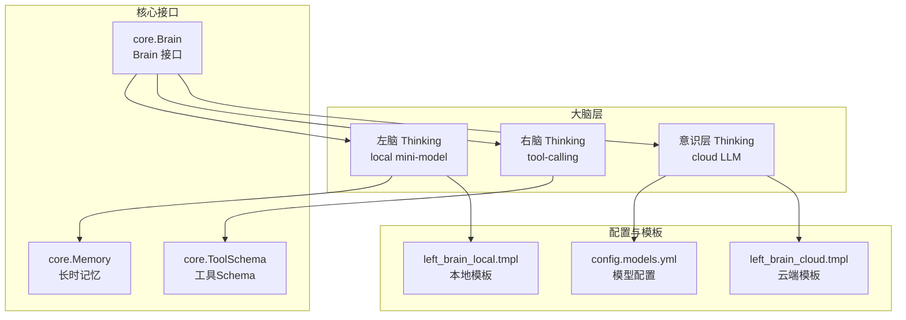
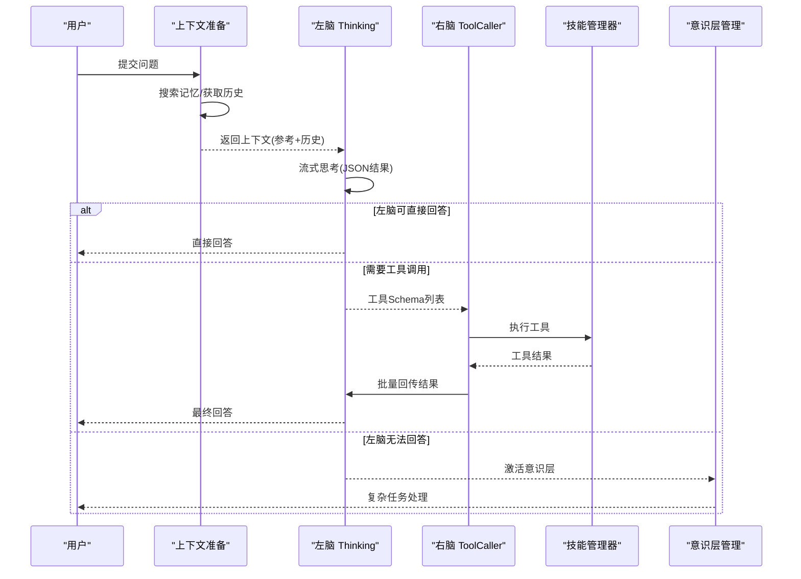
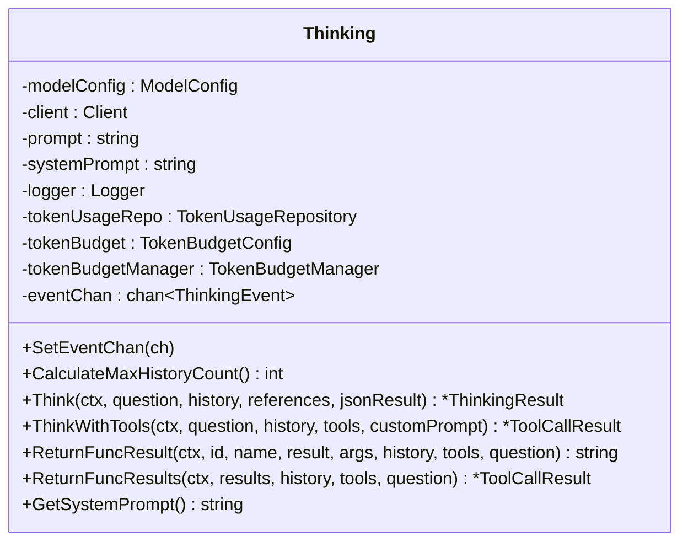
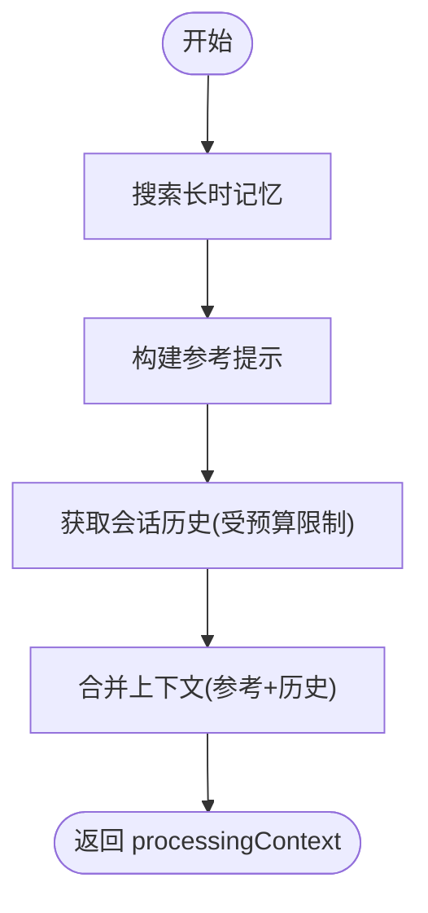
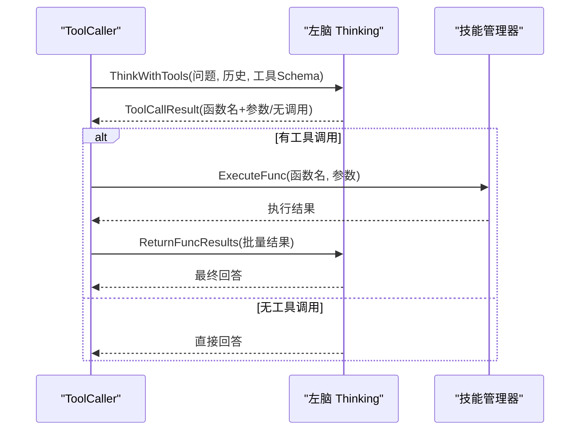
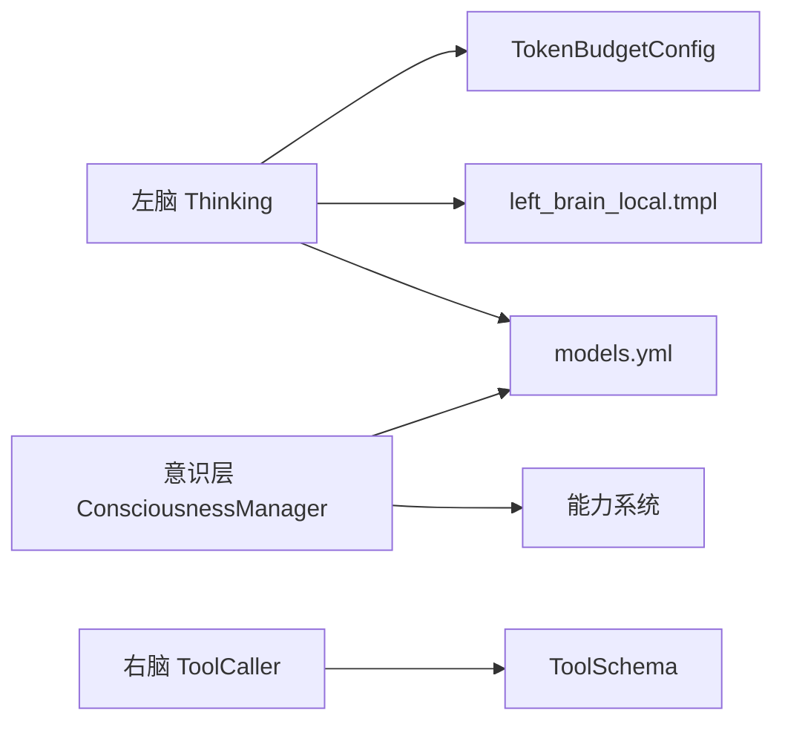

# 左脑思考机制

<cite>
**本文档引用的文件**
- [thinking.go](file://internal/usecase/brain/thinking.go)
- [context_preparer.go](file://internal/usecase/brain/context_preparer.go)
- [response_builder.go](file://internal/usecase/brain/response_builder.go)
- [brain.go](file://internal/usecase/brain/brain.go)
- [tool_caller.go](file://internal/usecase/brain/tool_caller.go)
- [consciousness_manager.go](file://internal/usecase/brain/consciousness_manager.go)
- [brain.go](file://internal/core/brain.go)
- [memory.go](file://internal/core/memory.go)
- [prompt_builder.go](file://internal/core/prompt_builder.go)
- [models.yml](file://config/models.yml)
- [model.go](file://internal/config/model.go)
- [left_brain_local.tmpl](file://prompts/left_brain_local.tmpl)
- [left_brain_cloud.tmpl](file://prompts/left_brain_cloud.tmpl)
- [token_budget.go](file://internal/usecase/brain/token_budget.go)
- [token_budget_test.go](file://internal/usecase/brain/token_budget_test.go)
- [TokenBudgetSection.tsx](file://dashboard/src/components/settings/TokenBudgetSection.tsx)
</cite>

## 目录
1. [简介](#简介)
2. [项目结构](#项目结构)
3. [核心组件](#核心组件)
4. [架构总览](#架构总览)
5. [详细组件分析](#详细组件分析)
6. [依赖关系分析](#依赖关系分析)
7. [性能考虑](#性能考虑)
8. [故障排除指南](#故障排除指南)
9. [结论](#结论)
10. [附录](#附录)

## 简介
本文件系统性阐述 MindX 左脑思考机制的设计与实现，重点覆盖以下方面：
- 左脑作为潜意识思考系统的定位与职责：处理简单任务、本地微型化模型推理、快速响应与低成本算力消耗。
- 左脑思考流程：从问题接收、上下文准备、模型推理到结果生成的完整过程。
- 决策机制与关键词提取算法：基于模板化的提示词与 JSON 结果约束，实现意图识别、关键词抽取、无意义闲聊判定、工具调用可行性判断等。
- 与右脑协作方式：当左脑无法直接回答时，触发右脑工具调用；若仍无法解决，则激活主意识（意识层）。
- 算力优化策略：动态历史轮次预算、Token 预算管理、事件流式传输、Prometheus 指标埋点等。
- 扩展与定制指南：模型切换、参数调优、性能优化技巧。

## 项目结构
MindX 的大脑模块采用“潜意识（左脑）+ 主意识（右脑+意识）”分层架构，左脑负责本地微模型的快速思考与执行，右脑负责工具调用，意识层在复杂任务时介入。核心文件分布如下：
- usecase/brain：左脑、右脑、意识层的具体实现
- internal/core：大脑与记忆、工具、会话等核心接口与数据结构
- config：模型配置与预算配置
- prompts：左脑本地与云端模板
- dashboard：前端配置界面（Token 预算等）

图表来源
- [brain.go](file://internal/usecase/brain/brain.go#L116-L140)
- [thinking.go](file://internal/usecase/brain/thinking.go#L21-L63)
- [consciousness_manager.go](file://internal/usecase/brain/consciousness_manager.go#L40-L99)
- [models.yml](file://config/models.yml#L1-L92)
- [left_brain_local.tmpl](file://prompts/left_brain_local.tmpl#L1-L102)
- [left_brain_cloud.tmpl](file://prompts/left_brain_cloud.tmpl#L1-L200)

章节来源
- [brain.go](file://internal/usecase/brain/brain.go#L116-L140)
- [models.yml](file://config/models.yml#L1-L92)

## 核心组件
- 左脑 Thinking：封装本地微模型的思考与推理，支持流式事件推送、Token 预算动态计算、JSON 结果解析与工具调用回传。
- 上下文准备 ContextPreparer：从长时记忆与会话历史中构建参考提示与历史对话，控制最大历史轮次。
- 响应构建 ResponseBuilder：将左脑结果映射为统一的思考响应结构，携带工具、转发渠道与定时任务信息。
- 右脑 ToolCaller：负责工具搜索、函数调用决策、批量执行与结果回传，支持多轮继续调用。
- 意识层 ConsciousnessManager：在左脑无法回答时创建主意识（双脑或单脑），并进行思考。
- 核心接口 core：定义 Thinking、Brain、Memory、ToolSchema 等关键类型与行为契约。

章节来源
- [thinking.go](file://internal/usecase/brain/thinking.go#L21-L63)
- [context_preparer.go](file://internal/usecase/brain/context_preparer.go#L11-L52)
- [response_builder.go](file://internal/usecase/brain/response_builder.go#L7-L42)
- [tool_caller.go](file://internal/usecase/brain/tool_caller.go#L15-L25)
- [consciousness_manager.go](file://internal/usecase/brain/consciousness_manager.go#L13-L38)
- [brain.go](file://internal/core/brain.go#L70-L115)

## 架构总览
左脑思考机制遵循“本地快速思考 + 右脑工具调用 + 意识层复杂任务”的分层设计。其核心流程如下：

图表来源
- [context_preparer.go](file://internal/usecase/brain/context_preparer.go#L25-L52)
- [thinking.go](file://internal/usecase/brain/thinking.go#L121-L329)
- [tool_caller.go](file://internal/usecase/brain/tool_caller.go#L27-L139)
- [consciousness_manager.go](file://internal/usecase/brain/consciousness_manager.go#L121-L129)

## 详细组件分析

### 左脑 Thinking 组件
- 初始化与配置
  - 通过模型配置构造 OpenAI 客户端，支持 BaseURL、APIKey、温度、最大 Token 等参数。
  - 构建 Token 预算管理器，用于动态计算最大历史轮次。
- 思考流程
  - 组装系统提示词（可附加参考记忆），构建消息序列（历史+用户问题）。
  - 启动流式聊天补全，支持思考标记包裹的中间内容与最终 JSON 结果。
  - 解析 JSON 结果为 ThinkingResult，记录 Token 使用与 Prometheus 指标。
- 工具调用与回传
  - ThinkWithTools：根据工具 Schema 决定是否调用工具，支持批量工具调用。
  - ReturnFuncResult/ReturnFuncResults：将工具执行结果回传给模型，支持继续调用。
- 事件流
  - 通过事件通道推送开始、增量、工具调用、工具结果、完成、错误等事件，便于前端实时反馈。

图表来源
- [thinking.go](file://internal/usecase/brain/thinking.go#L21-L63)
- [thinking.go](file://internal/usecase/brain/thinking.go#L121-L329)
- [thinking.go](file://internal/usecase/brain/thinking.go#L338-L577)

章节来源
- [thinking.go](file://internal/usecase/brain/thinking.go#L33-L63)
- [thinking.go](file://internal/usecase/brain/thinking.go#L121-L329)
- [thinking.go](file://internal/usecase/brain/thinking.go#L338-L577)

### 上下文准备 ContextPreparer 组件
- 从长时记忆系统检索与问题相关的记忆点，构建参考提示。
- 通过 OnHistoryRequest 获取历史对话，结合左脑的 Token 预算计算最大历史轮次，避免超出模型承载能力。
- 将记忆与历史拼接为上下文，供左脑思考使用。

图表来源
- [context_preparer.go](file://internal/usecase/brain/context_preparer.go#L25-L52)
- [context_preparer.go](file://internal/usecase/brain/context_preparer.go#L54-L70)

章节来源
- [context_preparer.go](file://internal/usecase/brain/context_preparer.go#L11-L52)

### 响应构建 ResponseBuilder 组件
- 将左脑 ThinkingResult 映射为 ThinkingResponse，包含回答、工具列表、转发渠道、定时任务等字段。
- 提供工具调用响应构建方法，用于右脑直接返回回答的情况。

章节来源
- [response_builder.go](file://internal/usecase/brain/response_builder.go#L7-L42)

### 右脑 ToolCaller 组件
- 工具搜索：根据关键词从技能管理器检索工具 Schema，生成标准化的 ToolSchema 列表。
- 工具调用：调用左脑 ThinkWithTools 决定工具调用；批量执行工具；将结果回传给左脑；支持多轮继续调用。
- 执行限制：设置最大工具调用轮次，防止无限循环。

图表来源
- [tool_caller.go](file://internal/usecase/brain/tool_caller.go#L27-L139)
- [thinking.go](file://internal/usecase/brain/thinking.go#L338-L577)

章节来源
- [tool_caller.go](file://internal/usecase/brain/tool_caller.go#L15-L25)
- [tool_caller.go](file://internal/usecase/brain/tool_caller.go#L141-L209)

### 意识层 ConsciousnessManager 组件
- 在左脑无法回答时创建主意识（双脑或单脑），加载能力对应的系统提示与人设信息。
- 提供 Think 方法，优先使用已创建的意识层，否则回退到左脑。

章节来源
- [consciousness_manager.go](file://internal/usecase/brain/consciousness_manager.go#L40-L99)
- [consciousness_manager.go](file://internal/usecase/brain/consciousness_manager.go#L121-L129)

### 核心接口与数据结构
- Thinking 接口：定义思考、工具调用、回传、历史轮次计算、事件通道设置等方法。
- Brain 结构：包含左脑、右脑、意识层、记忆获取、思考处理入口与事件回调。
- Memory 接口：记录、搜索、优化、对话聚类等长时记忆能力。
- ToolSchema：工具名称、描述、参数、输出格式、使用指南等。

章节来源
- [brain.go](file://internal/core/brain.go#L70-L115)
- [brain.go](file://internal/core/brain.go#L116-L140)
- [memory.go](file://internal/core/memory.go#L24-L40)

## 依赖关系分析
- 左脑依赖
  - 模型配置：models.yml 中的模型列表与默认模型选择。
  - 提示词模板：left_brain_local.tmpl 与 left_brain_cloud.tmpl。
  - Token 预算：config/model.go 中的 TokenBudgetConfig。
- 右脑依赖
  - 工具 Schema：由技能管理器生成，ToolCaller 负责搜索与标准化。
- 意识层依赖
  - 能力配置：从能力系统获取系统提示与模型名称。
  - 模型配置：ConsciousnessManager 根据能力选择模型。

图表来源
- [models.yml](file://config/models.yml#L1-L92)
- [left_brain_local.tmpl](file://prompts/left_brain_local.tmpl#L1-L102)
- [model.go](file://internal/config/model.go#L24-L28)
- [tool_caller.go](file://internal/usecase/brain/tool_caller.go#L141-L209)
- [consciousness_manager.go](file://internal/usecase/brain/consciousness_manager.go#L40-L99)

章节来源
- [models.yml](file://config/models.yml#L1-L92)
- [model.go](file://internal/config/model.go#L24-L28)

## 性能考虑
- 动态历史轮次预算
  - 通过 TokenBudgetManager 基于历史使用统计动态计算最大历史轮次，避免固定值导致的浪费或溢出。
  - 支持静态估算与动态调整，提供节省统计（额外轮次、改善比例）。
- 流式思考与事件推送
  - 左脑支持流式响应，边生成边推送事件，降低首屏延迟。
- 指标埋点
  - Prometheus 指标记录 LLM 调用次数、耗时、Token 使用量，便于性能监控与优化。
- 前端配置
  - Token 预算配置项（预留输出 Token、最小历史轮次、单轮平均 Token）可在前端调整，影响左脑历史轮次上限。

章节来源
- [token_budget.go](file://internal/usecase/brain/token_budget.go#L1-L204)
- [token_budget.go](file://internal/usecase/brain/token_budget.go#L205-L225)
- [token_budget_test.go](file://internal/usecase/brain/token_budget_test.go#L95-L158)
- [thinking.go](file://internal/usecase/brain/thinking.go#L186-L329)
- [TokenBudgetSection.tsx](file://dashboard/src/components/settings/TokenBudgetSection.tsx#L1-L48)

## 故障排除指南
- 左脑思考失败
  - 检查模型连接（BaseURL、APIKey）、温度与最大 Token 配置。
  - 查看流式接收错误与指标埋点，确认是否有 EOF 或网络异常。
- JSON 结果解析失败
  - 左脑会回退为纯文本回答，检查模板输出格式与模型响应稳定性。
- 工具调用失败
  - 确认工具 Schema 正确生成，技能管理器可执行对应函数。
  - 检查批量回传结果是否成功，模型是否要求继续调用。
- 意识层未创建
  - 确认能力系统返回能力且模型配置有效，或回退到左脑。

章节来源
- [thinking.go](file://internal/usecase/brain/thinking.go#L190-L220)
- [thinking.go](file://internal/usecase/brain/thinking.go#L274-L286)
- [tool_caller.go](file://internal/usecase/brain/tool_caller.go#L109-L139)
- [consciousness_manager.go](file://internal/usecase/brain/consciousness_manager.go#L40-L99)

## 结论
左脑思考机制通过本地微型化模型实现快速、低成本的简单任务处理，并与右脑工具调用、意识层复杂任务形成清晰的分层协作。其核心优势在于：
- 本地快速响应，显著降低算力与延迟
- 动态预算与流式事件，提升用户体验
- 明确的决策与关键词提取流程，保证意图识别与工具调用的准确性
- 可扩展的模型与参数配置，便于定制与优化

## 附录

### 左脑思考流程（代码级）
- 问题接收与上下文准备
  - ContextPreparer.Prepare：检索记忆、获取历史、构建参考提示
- 模型推理
  - Thinking.Think：组装消息、流式思考、解析 JSON、记录 Token
- 结果生成
  - ResponseBuilder.BuildLeftBrainResponse：映射为统一响应
- 协作与回退
  - 若左脑无法回答，激活意识层或右脑工具调用

章节来源
- [context_preparer.go](file://internal/usecase/brain/context_preparer.go#L25-L52)
- [thinking.go](file://internal/usecase/brain/thinking.go#L121-L329)
- [response_builder.go](file://internal/usecase/brain/response_builder.go#L13-L26)
- [consciousness_manager.go](file://internal/usecase/brain/consciousness_manager.go#L121-L129)

### 关键词提取与决策机制
- 模板驱动的思考步骤与规则
  - left_brain_local.tmpl 定义思考步骤、useless/can_answer/schedule/cancel_schedule/send_to 等规则与输出格式
- JSON 结果约束
  - 左脑强制输出纯 JSON，便于稳定解析与后续处理
- 关键词与意图
  - 通过模板中的任务描述与规则，实现关键词抽取与意图识别

章节来源
- [left_brain_local.tmpl](file://prompts/left_brain_local.tmpl#L1-L102)

### 模型切换与参数调优
- 模型配置
  - 在 models.yml 中添加/修改模型，设置 base_url、api_key、temperature、max_tokens
- 左脑模型选择
  - 通过 BrainModelsConfig 指定 subconscious_left 模型
- 右脑模型选择
  - 通过 BrainModelsConfig 指定 subconscious_right 模型
- 参数调优建议
  - temperature 影响创造性与稳定性，max_tokens 控制上下文长度
  - Token 预算（预留输出、最小轮次、单轮平均）影响历史轮次上限

章节来源
- [models.yml](file://config/models.yml#L1-L92)
- [model.go](file://internal/config/model.go#L7-L12)
- [model.go](file://internal/config/model.go#L24-L28)

### 算力优化策略
- 动态历史轮次
  - 基于 Token 使用统计动态计算最大历史轮次，避免固定值造成的浪费
- 流式事件
  - 边生成边推送，减少等待时间
- 指标监控
  - Prometheus 指标记录调用次数、耗时与 Token 使用，辅助优化

章节来源
- [token_budget.go](file://internal/usecase/brain/token_budget.go#L1-L204)
- [thinking.go](file://internal/usecase/brain/thinking.go#L186-L329)