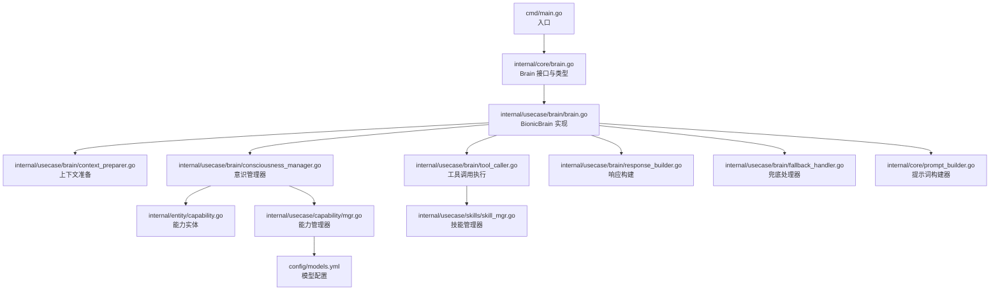
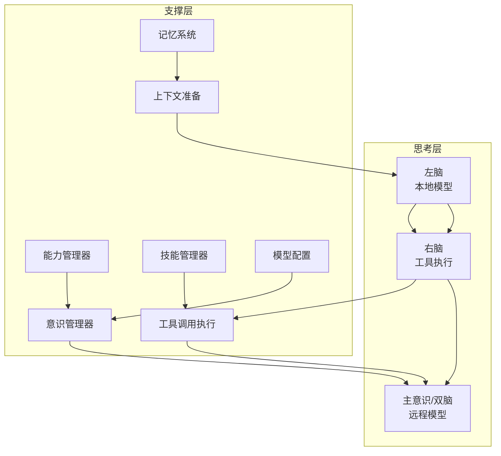
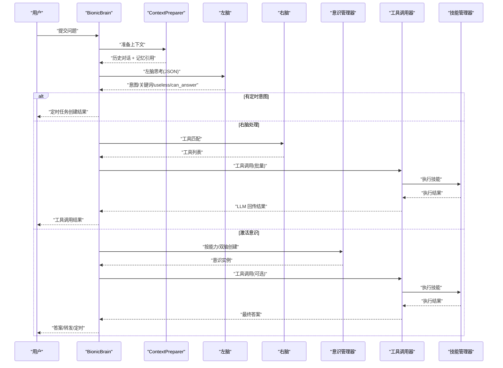
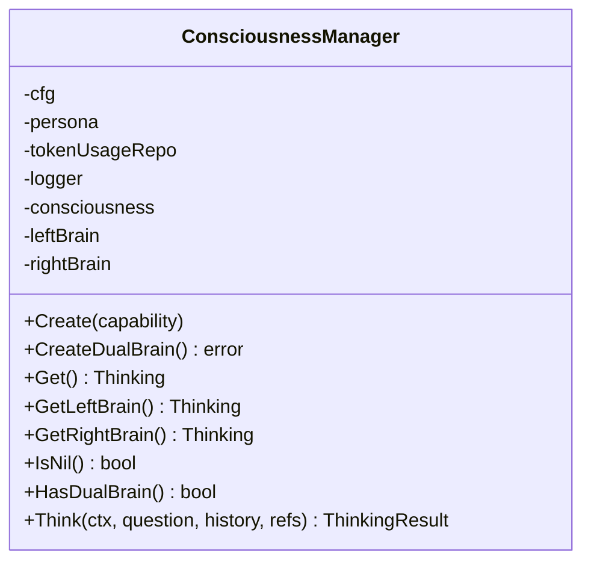
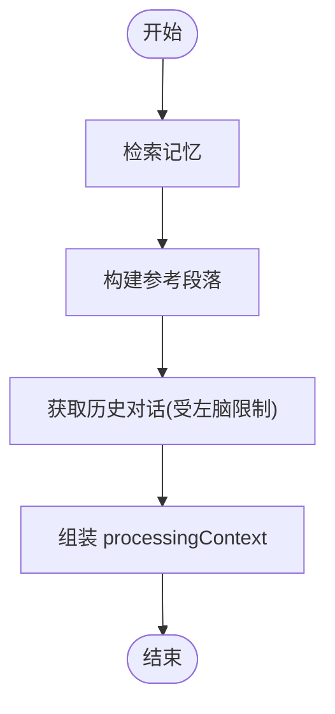
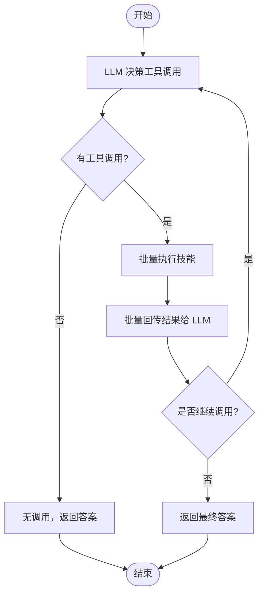
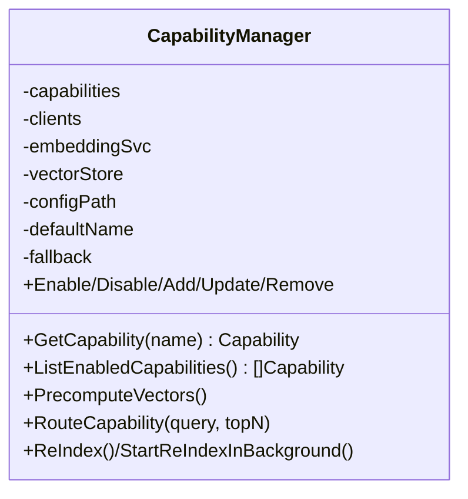
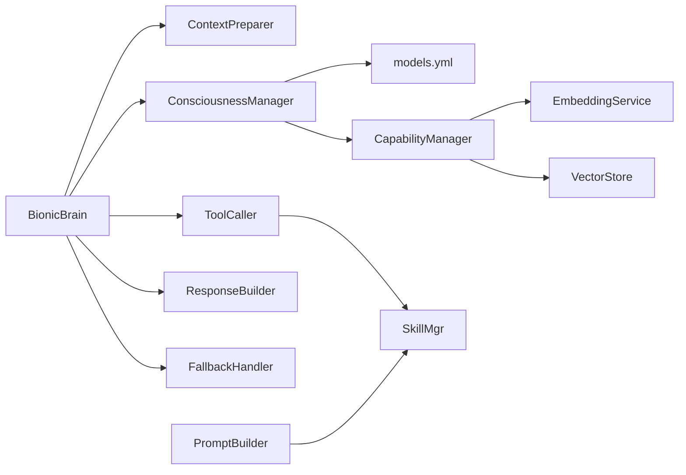
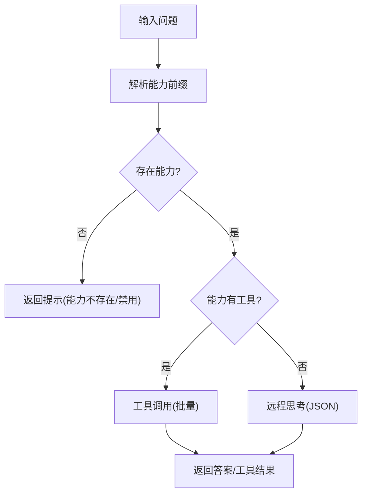

# 意识决策系统

<cite>
**本文引用的文件**
- [cmd/main.go](file://cmd/main.go)
- [internal/core/brain.go](file://internal/core/brain.go)
- [internal/usecase/brain/brain.go](file://internal/usecase/brain/brain.go)
- [internal/usecase/brain/consciousness_manager.go](file://internal/usecase/brain/consciousness_manager.go)
- [internal/usecase/brain/context_preparer.go](file://internal/usecase/brain/context_preparer.go)
- [internal/usecase/brain/tool_caller.go](file://internal/usecase/brain/tool_caller.go)
- [internal/usecase/brain/response_builder.go](file://internal/usecase/brain/response_builder.go)
- [internal/usecase/brain/fallback_handler.go](file://internal/usecase/brain/fallback_handler.go)
- [internal/entity/capability.go](file://internal/entity/capability.go)
- [internal/usecase/capability/mgr.go](file://internal/usecase/capability/mgr.go)
- [internal/core/prompt_builder.go](file://internal/core/prompt_builder.go)
- [internal/usecase/skills/skill_mgr.go](file://internal/usecase/skills/skill_mgr.go)
- [config/models.yml](file://config/models.yml)
</cite>

## 目录
1. [简介](#简介)
2. [项目结构](#项目结构)
3. [核心组件](#核心组件)
4. [架构总览](#架构总览)
5. [详细组件分析](#详细组件分析)
6. [依赖关系分析](#依赖关系分析)
7. [性能考量](#性能考量)
8. [故障排查指南](#故障排查指南)
9. [结论](#结论)
10. [附录](#附录)

## 简介
本文件面向“意识决策系统”的开发者与维护者，系统化阐述“主意识”如何作为高级思考与决策中枢，与“潜意识”“右脑工具执行”“能力管理器”“远程大语言模型”协同工作，完成复杂任务的动态能力匹配与远程推理闭环。文档覆盖：
- 意识的初始化与动态创建
- 能力评估与能力前缀路由
- 上下文构建与记忆引用
- 工具调用与远程推理的循环执行
- 远程模型集成与兜底策略
- 决策流程的可视化序列图与流程图
- 扩展指南：新增能力、远程模型配置、决策逻辑定制

## 项目结构
围绕“意识决策系统”，核心代码位于 internal/usecase/brain 与 internal/core，配合能力管理器、技能管理器、提示词构建器与模型配置。

图表来源
- [cmd/main.go](file://cmd/main.go#L1-L21)
- [internal/core/brain.go](file://internal/core/brain.go#L116-L140)
- [internal/usecase/brain/brain.go](file://internal/usecase/brain/brain.go#L56-L131)
- [internal/usecase/brain/context_preparer.go](file://internal/usecase/brain/context_preparer.go#L25-L52)
- [internal/usecase/brain/tool_caller.go](file://internal/usecase/brain/tool_caller.go#L27-L139)
- [internal/usecase/brain/consciousness_manager.go](file://internal/usecase/brain/consciousness_manager.go#L40-L99)
- [internal/usecase/brain/response_builder.go](file://internal/usecase/brain/response_builder.go#L13-L41)
- [internal/usecase/brain/fallback_handler.go](file://internal/usecase/brain/fallback_handler.go#L31-L59)
- [internal/entity/capability.go](file://internal/entity/capability.go#L3-L16)
- [internal/usecase/capability/mgr.go](file://internal/usecase/capability/mgr.go#L30-L120)
- [internal/core/prompt_builder.go](file://internal/core/prompt_builder.go#L119-L161)
- [internal/usecase/skills/skill_mgr.go](file://internal/usecase/skills/skill_mgr.go#L36-L85)
- [config/models.yml](file://config/models.yml#L1-L92)

章节来源
- [cmd/main.go](file://cmd/main.go#L1-L21)
- [internal/core/brain.go](file://internal/core/brain.go#L116-L140)

## 核心组件
- Brain 接口与类型：定义思考接口、对话消息、工具调用结果、思维事件等核心类型；Brain 结构体内含左脑、右脑、意识三部分协作。
- BionicBrain：Brain 的具体实现，负责整体流程编排：上下文准备、左脑思考、右脑工具调用、意识激活与远程推理、兜底处理。
- ConsciousnessManager：动态创建“主意识”或“双脑”（左/右脑），按能力配置选择远程模型并注入系统提示词。
- ContextPreparer：从记忆与历史会话构建上下文，拼接参考片段。
- ToolCaller：驱动 LLM 决策工具调用，执行技能并回传结果，支持批量工具调用与最大调用次数控制。
- ResponseBuilder/FallbackHandler：统一响应封装与兜底策略。
- Capability/CapabilityManager：能力定义、客户端初始化、向量化路由、启用/禁用/更新/删除能力。
- PromptBuilder：构建本地/云端提示词模板，支持动态技能关键词注入。
- SkillMgr：技能加载、索引、搜索、执行、MCP 管理与环境变量管理。
- models.yml：集中管理模型 BaseURL、API Key、温度、最大 tokens 等参数。

章节来源
- [internal/core/brain.go](file://internal/core/brain.go#L70-L140)
- [internal/usecase/brain/brain.go](file://internal/usecase/brain/brain.go#L56-L131)
- [internal/usecase/brain/consciousness_manager.go](file://internal/usecase/brain/consciousness_manager.go#L40-L99)
- [internal/usecase/brain/context_preparer.go](file://internal/usecase/brain/context_preparer.go#L25-L52)
- [internal/usecase/brain/tool_caller.go](file://internal/usecase/brain/tool_caller.go#L27-L139)
- [internal/usecase/brain/response_builder.go](file://internal/usecase/brain/response_builder.go#L13-L41)
- [internal/usecase/brain/fallback_handler.go](file://internal/usecase/brain/fallback_handler.go#L31-L59)
- [internal/entity/capability.go](file://internal/entity/capability.go#L3-L16)
- [internal/usecase/capability/mgr.go](file://internal/usecase/capability/mgr.go#L30-L120)
- [internal/core/prompt_builder.go](file://internal/core/prompt_builder.go#L119-L161)
- [internal/usecase/skills/skill_mgr.go](file://internal/usecase/skills/skill_mgr.go#L36-L85)
- [config/models.yml](file://config/models.yml#L1-L92)

## 架构总览
意识决策系统采用“三层脑”协作架构：
- 潜意识（左脑）：本地模型，负责意图识别、关键词抽取、是否可直接回答、定时/转发意图判断。
- 右脑（工具执行）：负责根据关键词匹配工具，驱动工具调用与批量回传，直至得出最终答案。
- 主意识（意识/双脑）：在左脑无法回答时被激活，结合能力配置与远程模型进行复杂推理与工具调用；也可通过能力前缀强制走指定能力路径。

图表来源
- [internal/core/brain.go](file://internal/core/brain.go#L116-L140)
- [internal/usecase/brain/brain.go](file://internal/usecase/brain/brain.go#L133-L237)
- [internal/usecase/brain/consciousness_manager.go](file://internal/usecase/brain/consciousness_manager.go#L40-L99)
- [internal/usecase/brain/context_preparer.go](file://internal/usecase/brain/context_preparer.go#L25-L52)
- [internal/usecase/brain/tool_caller.go](file://internal/usecase/brain/tool_caller.go#L27-L139)
- [internal/usecase/capability/mgr.go](file://internal/usecase/capability/mgr.go#L122-L143)
- [config/models.yml](file://config/models.yml#L1-L92)

## 详细组件分析

### 组件一：BionicBrain（主意识思考中枢）
职责与流程
- 初始化：装配左/右脑、上下文准备器、工具调用器、意识管理器、响应构建器、兜底处理器。
- 请求处理：解析能力前缀、准备上下文、左脑思考、右脑工具匹配与调用、意识激活与远程推理、兜底返回。
- 关键路径：post → tryRightBrainProcess → consciousnessWithTools/activateConsciousnessDualBrain → FallbackHandler。

图表来源
- [internal/usecase/brain/brain.go](file://internal/usecase/brain/brain.go#L133-L237)
- [internal/usecase/brain/brain.go](file://internal/usecase/brain/brain.go#L239-L305)
- [internal/usecase/brain/brain.go](file://internal/usecase/brain/brain.go#L307-L451)
- [internal/usecase/brain/brain.go](file://internal/usecase/brain/brain.go#L519-L532)
- [internal/usecase/brain/tool_caller.go](file://internal/usecase/brain/tool_caller.go#L27-L139)
- [internal/usecase/brain/consciousness_manager.go](file://internal/usecase/brain/consciousness_manager.go#L40-L99)

章节来源
- [internal/usecase/brain/brain.go](file://internal/usecase/brain/brain.go#L56-L131)
- [internal/usecase/brain/brain.go](file://internal/usecase/brain/brain.go#L133-L237)
- [internal/usecase/brain/brain.go](file://internal/usecase/brain/brain.go#L239-L305)
- [internal/usecase/brain/brain.go](file://internal/usecase/brain/brain.go#L307-L451)
- [internal/usecase/brain/brain.go](file://internal/usecase/brain/brain.go#L519-L532)

### 组件二：ConsciousnessManager（意识/双脑管理）
职责与流程
- Create：基于能力配置创建“主意识”，注入系统提示词与模型参数。
- CreateDualBrain：创建“双脑”（左/右脑），分别用于远程推理与工具调用。
- Think：委派到当前可用的意识实例（主意识或双脑左脑）。

图表来源
- [internal/usecase/brain/consciousness_manager.go](file://internal/usecase/brain/consciousness_manager.go#L13-L38)
- [internal/usecase/brain/consciousness_manager.go](file://internal/usecase/brain/consciousness_manager.go#L40-L99)
- [internal/usecase/brain/consciousness_manager.go](file://internal/usecase/brain/consciousness_manager.go#L121-L129)

章节来源
- [internal/usecase/brain/consciousness_manager.go](file://internal/usecase/brain/consciousness_manager.go#L40-L99)

### 组件三：ContextPreparer（上下文构建）
职责与流程
- 从记忆系统检索相关记忆点，构建“参考”段落。
- 通过 OnHistoryRequest 获取历史对话，限制最大轮数以适配模型上下文窗口。
- 将记忆引用与历史对话组合为 processingContext 返回。

图表来源
- [internal/usecase/brain/context_preparer.go](file://internal/usecase/brain/context_preparer.go#L25-L52)
- [internal/usecase/brain/context_preparer.go](file://internal/usecase/brain/context_preparer.go#L54-L70)

章节来源
- [internal/usecase/brain/context_preparer.go](file://internal/usecase/brain/context_preparer.go#L25-L52)

### 组件四：ToolCaller（工具调用执行）
职责与流程
- ThinkWithTools 决定调用哪些工具（支持单次/批量）。
- 执行技能并回传结果给 LLM，支持多轮继续调用，直到 NoCall 或达到上限。
- 支持将工具 Schema 转换为 JSON Schema 参数结构，便于模型理解。

图表来源
- [internal/usecase/brain/tool_caller.go](file://internal/usecase/brain/tool_caller.go#L27-L139)
- [internal/usecase/brain/tool_caller.go](file://internal/usecase/brain/tool_caller.go#L141-L208)

章节来源
- [internal/usecase/brain/tool_caller.go](file://internal/usecase/brain/tool_caller.go#L27-L139)

### 组件五：CapabilityManager（能力管理）
职责与流程
- 加载/保存能力配置，初始化 OpenAI 客户端（按能力绑定模型）。
- 能力向量化预计算与路由，支持默认/向量两种路由策略。
- 启用/禁用/添加/更新/删除能力，支持后台重新索引。

图表来源
- [internal/usecase/capability/mgr.go](file://internal/usecase/capability/mgr.go#L16-L120)
- [internal/usecase/capability/mgr.go](file://internal/usecase/capability/mgr.go#L389-L458)

章节来源
- [internal/usecase/capability/mgr.go](file://internal/usecase/capability/mgr.go#L30-L120)
- [internal/usecase/capability/mgr.go](file://internal/usecase/capability/mgr.go#L389-L458)

### 组件六：PromptBuilder（提示词构建）
职责与流程
- 支持本地/云端模板与回退硬编码提示词。
- 动态注入技能关键词，保证 LLM 对工具域的理解一致性。

章节来源
- [internal/core/prompt_builder.go](file://internal/core/prompt_builder.go#L119-L161)
- [internal/core/prompt_builder.go](file://internal/core/prompt_builder.go#L165-L212)
- [internal/core/prompt_builder.go](file://internal/core/prompt_builder.go#L216-L263)

### 组件七：SkillMgr（技能管理）
职责与流程
- 加载/索引/搜索/执行技能，支持 MCP 管理与环境变量。
- 将技能标签同步到 PromptBuilder，动态更新关键词集合。

章节来源
- [internal/usecase/skills/skill_mgr.go](file://internal/usecase/skills/skill_mgr.go#L36-L85)
- [internal/usecase/skills/skill_mgr.go](file://internal/usecase/skills/skill_mgr.go#L100-L120)

## 依赖关系分析
- BionicBrain 依赖 ContextPreparer、ToolCaller、ConsciousnessManager、ResponseBuilder、FallbackHandler。
- ConsciousnessManager 依赖模型配置与能力配置，动态创建 Thinking 实例。
- ToolCaller 依赖 SkillMgr 与 Thinking 接口，实现工具调用闭环。
- CapabilityManager 依赖 EmbeddingService 与 VectorStore，提供能力向量化与路由。
- PromptBuilder 与 SkillMgr 协同，保证提示词与工具域一致。

图表来源
- [internal/usecase/brain/brain.go](file://internal/usecase/brain/brain.go#L56-L131)
- [internal/usecase/brain/consciousness_manager.go](file://internal/usecase/brain/consciousness_manager.go#L40-L99)
- [internal/usecase/brain/tool_caller.go](file://internal/usecase/brain/tool_caller.go#L27-L139)
- [internal/usecase/capability/mgr.go](file://internal/usecase/capability/mgr.go#L122-L143)
- [internal/core/prompt_builder.go](file://internal/core/prompt_builder.go#L119-L161)
- [internal/usecase/skills/skill_mgr.go](file://internal/usecase/skills/skill_mgr.go#L36-L85)

## 性能考量
- 上下文窗口控制：ContextPreparer 依据左脑的最大历史轮数限制，避免超出模型上下文。
- 工具调用上限：ToolCaller 设定最大工具调用次数，防止无限循环。
- 远程模型超时：BionicBrain.post 使用 5 分钟超时，保障前端体验。
- 向量化路由：CapabilityManager 预计算能力向量，加速能力匹配。
- 日志与事件：通过 ThinkingEvent 推送思考进度，便于前端与可观测性。

章节来源
- [internal/usecase/brain/context_preparer.go](file://internal/usecase/brain/context_preparer.go#L39-L49)
- [internal/usecase/brain/tool_caller.go](file://internal/usecase/brain/tool_caller.go#L13-L139)
- [internal/usecase/brain/brain.go](file://internal/usecase/brain/brain.go#L136-L137)
- [internal/usecase/capability/mgr.go](file://internal/usecase/capability/mgr.go#L389-L420)

## 故障排查指南
常见问题与定位建议
- 左脑思考失败：检查模型可用性、提示词构建、日志错误码。
- 右脑工具未命中：确认关键词提取、工具索引与向量化是否生效。
- 意识创建失败：检查能力配置、模型 BaseURL/API Key、远程服务连通性。
- 工具执行异常：查看技能执行日志、参数校验、MCP 服务状态。
- 兜底线：FallbackHandler 会在右脑重试失败后返回友好提示，避免空答案。

章节来源
- [internal/usecase/brain/brain.go](file://internal/usecase/brain/brain.go#L159-L163)
- [internal/usecase/brain/brain.go](file://internal/usecase/brain/brain.go#L224-L227)
- [internal/usecase/brain/consciousness_manager.go](file://internal/usecase/brain/consciousness_manager.go#L329-L336)
- [internal/usecase/brain/fallback_handler.go](file://internal/usecase/brain/fallback_handler.go#L31-L59)

## 结论
意识决策系统通过“三层脑”与“能力/技能/记忆”三大支撑体系，实现了从意图识别、工具匹配、远程推理到最终决策的闭环。其关键优势在于：
- 动态能力匹配与远程模型集成
- 工具调用的批量与多轮回传
- 可观测的思考事件流
- 可扩展的能力与技能生态

## 附录

### 决策流程（能力前缀强制路径）
当问题以“/能力名”开头时，系统将强制走该能力路径，优先匹配能力工具，否则直接远程思考。

图表来源
- [internal/usecase/brain/brain.go](file://internal/usecase/brain/brain.go#L586-L608)
- [internal/usecase/brain/brain.go](file://internal/usecase/brain/brain.go#L611-L673)

### 代码示例路径（不含具体代码内容）
- 意识初始化与装配
  - [internal/usecase/brain/brain.go](file://internal/usecase/brain/brain.go#L56-L131)
- 能力评估与能力前缀路由
  - [internal/usecase/brain/brain.go](file://internal/usecase/brain/brain.go#L140-L146)
  - [internal/usecase/brain/brain.go](file://internal/usecase/brain/brain.go#L586-L608)
- 上下文构建（记忆+历史）
  - [internal/usecase/brain/context_preparer.go](file://internal/usecase/brain/context_preparer.go#L25-L52)
- 工具调用与批量回传
  - [internal/usecase/brain/tool_caller.go](file://internal/usecase/brain/tool_caller.go#L27-L139)
- 远程大语言模型集成
  - [internal/usecase/brain/consciousness_manager.go](file://internal/usecase/brain/consciousness_manager.go#L40-L99)
  - [config/models.yml](file://config/models.yml#L1-L92)
- 兜底策略
  - [internal/usecase/brain/fallback_handler.go](file://internal/usecase/brain/fallback_handler.go#L31-L59)

### 扩展指南
- 新增能力
  - 在工作区 capabilities.yml 中添加能力条目，设置模型、系统提示词、工具列表、启用状态。
  - 若启用向量化路由，先执行预计算或后台重新索引。
  - 参考：[internal/usecase/capability/mgr.go](file://internal/usecase/capability/mgr.go#L274-L291)，[internal/usecase/capability/mgr.go](file://internal/usecase/capability/mgr.go#L389-L420)
- 配置远程模型
  - 在 models.yml 中新增模型条目，填写 BaseURL、API Key、温度、最大 tokens。
  - 能力配置中的 Model 名称需与 models.yml 中的 name 对应。
  - 参考：[config/models.yml](file://config/models.yml#L1-L92)
- 自定义决策逻辑
  - 修改提示词模板或 PromptBuilder 的构建逻辑，确保与工具域一致。
  - 参考：[internal/core/prompt_builder.go](file://internal/core/prompt_builder.go#L119-L161)
- 新增工具/技能
  - 在 skills 目录下编写技能，确保定义文件与参数校验完整。
  - 通过 SkillMgr 的安装/启用流程加载技能，自动同步关键词到提示词。
  - 参考：[internal/usecase/skills/skill_mgr.go](file://internal/usecase/skills/skill_mgr.go#L36-L85)