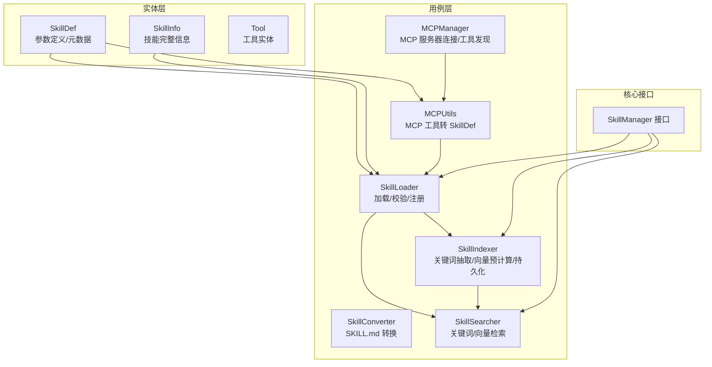
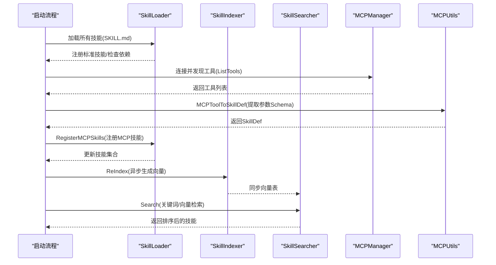
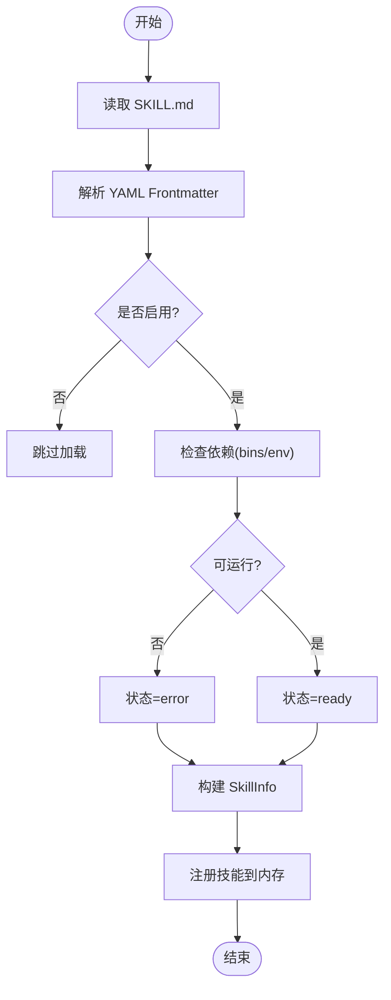
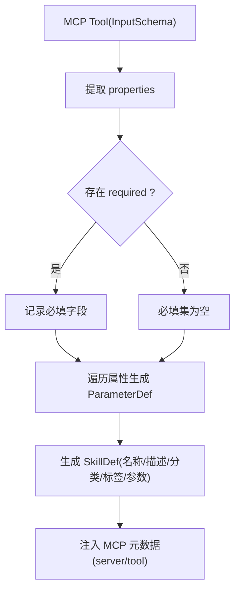
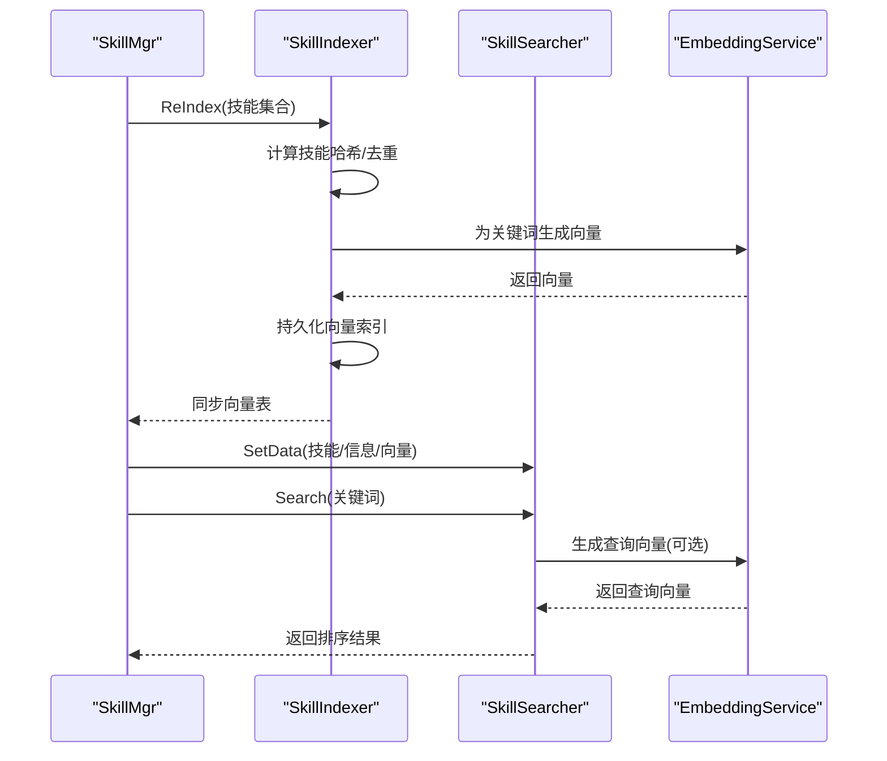
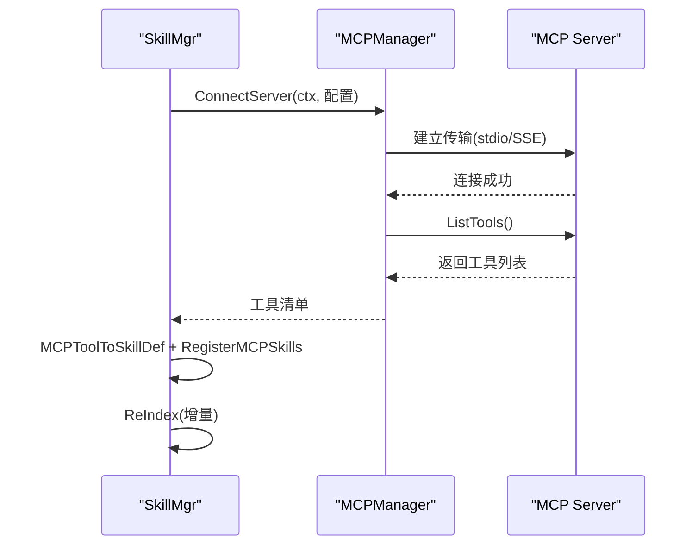
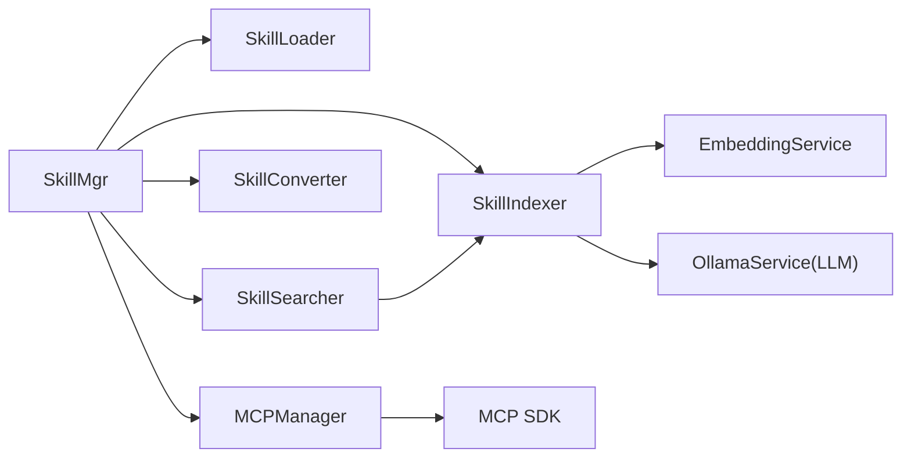

# 工具发现与Schema生成

<cite>
**本文档引用的文件**
- [internal/entity/tool.go](file://internal/entity/tool.go)
- [internal/entity/skill.go](file://internal/entity/skill.go)
- [internal/core/skillmgr.go](file://internal/core/skillmgr.go)
- [internal/usecase/skills/loader.go](file://internal/usecase/skills/loader.go)
- [internal/usecase/skills/converter.go](file://internal/usecase/skills/converter.go)
- [internal/usecase/skills/searcher.go](file://internal/usecase/skills/searcher.go)
- [internal/usecase/skills/indexer.go](file://internal/usecase/skills/indexer.go)
- [internal/usecase/skills/mcp_manager.go](file://internal/usecase/skills/mcp_manager.go)
- [internal/usecase/skills/mcp_utils.go](file://internal/usecase/skills/mcp_utils.go)
- [skills/calculator/SKILL.md](file://skills/calculator/SKILL.md)
</cite>

## 目录
1. [简介](#简介)
2. [项目结构](#项目结构)
3. [核心组件](#核心组件)
4. [架构总览](#架构总览)
5. [详细组件分析](#详细组件分析)
6. [依赖关系分析](#依赖关系分析)
7. [性能考虑](#性能考虑)
8. [故障排查指南](#故障排查指南)
9. [结论](#结论)
10. [附录](#附录)

## 简介
本文件系统性阐述 MindX 工具发现与 Schema 生成机制，涵盖以下要点：
- 工具发现的完整流程：技能加载、参数提取、向量化索引与检索。
- 从技能定义生成标准工具 Schema 的过程：参数类型、必填字段、描述信息的处理。
- 工具 Schema 的结构设计：名称、描述、参数定义、输出格式等字段。
- 缓存与性能优化策略：异步索引队列、向量持久化、关键词缓存、MCP 服务器连接重试。
- 实践示例与最佳实践：展示如何扩展与自定义工具 Schema。

## 项目结构
围绕工具发现与 Schema 生成，核心代码分布在 usecase 层的 loader、converter、searcher、indexer、mcp_manager 以及实体层的 skill 定义与工具实体。

图表来源
- [internal/entity/skill.go](file://internal/entity/skill.go#L6-L25)
- [internal/usecase/skills/loader.go](file://internal/usecase/skills/loader.go#L18-L33)
- [internal/usecase/skills/converter.go](file://internal/usecase/skills/converter.go#L16-L21)
- [internal/usecase/skills/searcher.go](file://internal/usecase/skills/searcher.go#L15-L22)
- [internal/usecase/skills/indexer.go](file://internal/usecase/skills/indexer.go#L32-L51)
- [internal/usecase/skills/mcp_manager.go](file://internal/usecase/skills/mcp_manager.go#L36-L40)
- [internal/usecase/skills/mcp_utils.go](file://internal/usecase/skills/mcp_utils.go#L56-L97)
- [internal/core/skillmgr.go](file://internal/core/skillmgr.go#L9-L17)

章节来源
- [internal/entity/skill.go](file://internal/entity/skill.go#L6-L25)
- [internal/usecase/skills/loader.go](file://internal/usecase/skills/loader.go#L18-L33)
- [internal/usecase/skills/indexer.go](file://internal/usecase/skills/indexer.go#L32-L51)
- [internal/usecase/skills/mcp_manager.go](file://internal/usecase/skills/mcp_manager.go#L36-L40)

## 核心组件
- 实体定义
  - SkillDef：技能定义，包含名称、描述、版本、分类、标签、参数定义、依赖、安装方法、元数据、输出格式等。
  - SkillInfo：技能完整信息，包含 Def、目录、内容、可运行状态、缺失依赖、格式、状态、向量、统计信息等。
  - Tool：工具实体（用于通用工具表示）。
- 用例组件
  - SkillLoader：扫描 skills 目录，解析 SKILL.md，校验依赖，注册标准技能与 MCP 技能。
  - SkillConverter：将 SKILL.md 的 YAML Frontmatter 更新为规范化结构。
  - SkillSearcher：基于关键词与向量相似度进行技能检索。
  - SkillIndexer：异步抽取关键词、生成向量、持久化索引，维护向量表。
  - MCPManager：连接 MCP 服务器，发现工具，调用工具。
  - MCPUtils：将 MCP Tool 转换为 SkillDef，提取 JSON Schema 参数。
- 核心接口
  - SkillManager：统一的技能管理接口，提供执行、检索、注册内部技能等能力。

章节来源
- [internal/entity/skill.go](file://internal/entity/skill.go#L6-L25)
- [internal/entity/skill.go](file://internal/entity/skill.go#L59-L82)
- [internal/entity/tool.go](file://internal/entity/tool.go#L4-L10)
- [internal/usecase/skills/loader.go](file://internal/usecase/skills/loader.go#L18-L33)
- [internal/usecase/skills/converter.go](file://internal/usecase/skills/converter.go#L16-L21)
- [internal/usecase/skills/searcher.go](file://internal/usecase/skills/searcher.go#L15-L22)
- [internal/usecase/skills/indexer.go](file://internal/usecase/skills/indexer.go#L32-L51)
- [internal/usecase/skills/mcp_manager.go](file://internal/usecase/skills/mcp_manager.go#L36-L40)
- [internal/usecase/skills/mcp_utils.go](file://internal/usecase/skills/mcp_utils.go#L56-L97)
- [internal/core/skillmgr.go](file://internal/core/skillmgr.go#L9-L17)

## 架构总览
工具发现与 Schema 生成的整体流程如下：

图表来源
- [internal/usecase/skills/loader.go](file://internal/usecase/skills/loader.go#L206-L231)
- [internal/usecase/skills/mcp_manager.go](file://internal/usecase/skills/mcp_manager.go#L120-L137)
- [internal/usecase/skills/mcp_utils.go](file://internal/usecase/skills/mcp_utils.go#L56-L97)
- [internal/usecase/skills/indexer.go](file://internal/usecase/skills/indexer.go#L188-L253)
- [internal/usecase/skills/searcher.go](file://internal/usecase/skills/searcher.go#L42-L62)

## 详细组件分析

### 技能加载与依赖校验（SkillLoader）
- 功能要点
  - 扫描 skills 目录，读取 SKILL.md，解析 YAML Frontmatter 为 SkillDef。
  - 校验依赖：二进制可执行文件与环境变量是否存在。
  - 注册标准技能与 MCP 技能；支持按前缀注销 MCP 技能。
- 关键路径
  - 解析与校验：[ParseSkillDef](file://internal/usecase/skills/loader.go#L165-L184)、[CheckDependencies](file://internal/usecase/skills/loader.go#L186-L204)
  - 注册 MCP 技能：[RegisterMCPSkills](file://internal/usecase/skills/loader.go#L207-L231)
  - 注销 MCP 技能：[UnregisterMCPSkills](file://internal/usecase/skills/loader.go#L234-L248)

图表来源
- [internal/usecase/skills/loader.go](file://internal/usecase/skills/loader.go#L60-L123)

章节来源
- [internal/usecase/skills/loader.go](file://internal/usecase/skills/loader.go#L60-L123)
- [internal/usecase/skills/loader.go](file://internal/usecase/skills/loader.go#L165-L184)
- [internal/usecase/skills/loader.go](file://internal/usecase/skills/loader.go#L186-L204)
- [internal/usecase/skills/loader.go](file://internal/usecase/skills/loader.go#L207-L231)
- [internal/usecase/skills/loader.go](file://internal/usecase/skills/loader.go#L234-L248)

### 工具Schema生成（MCP 工具 -> SkillDef）
- 功能要点
  - 将 MCP Tool 的 InputSchema 转换为 MindX 的参数定义（ParameterDef），自动推断类型与必填项。
  - 生成规范化的技能名称、分类、标签（含 mcp 与服务器名）。
  - 支持从 catalog 注入额外标签以提升检索精度。
- 关键路径
  - Schema 参数提取：[extractParameters](file://internal/usecase/skills/mcp_utils.go#L99-L131)
  - 转换入口：[MCPToolToSkillDef](file://internal/usecase/skills/mcp_utils.go#L56-L97)

图表来源
- [internal/usecase/skills/mcp_utils.go](file://internal/usecase/skills/mcp_utils.go#L56-L97)
- [internal/usecase/skills/mcp_utils.go](file://internal/usecase/skills/mcp_utils.go#L99-L131)

章节来源
- [internal/usecase/skills/mcp_utils.go](file://internal/usecase/skills/mcp_utils.go#L56-L97)
- [internal/usecase/skills/mcp_utils.go](file://internal/usecase/skills/mcp_utils.go#L99-L131)

### 向量化索引与检索（SkillIndexer + SkillSearcher）
- 功能要点
  - 异步索引：从技能定义中抽取关键词，调用嵌入服务生成向量，持久化到存储。
  - 检索策略：优先向量相似度，其次关键词匹配；支持阈值与 TopN 回退。
  - 缓存与一致性：基于哈希判断是否需要重建索引，避免重复计算。
- 关键路径
  - 关键词抽取与向量生成：[processTask](file://internal/usecase/skills/indexer.go#L116-L176)
  - 任务队列与持久化：[ReIndex](file://internal/usecase/skills/indexer.go#L188-L253)、[saveVectorIndexToStore](file://internal/usecase/skills/indexer.go#L409-L444)
  - 向量检索：[searchByVector](file://internal/usecase/skills/searcher.go#L72-L188)、[searchByKeywords](file://internal/usecase/skills/searcher.go#L190-L281)

图表来源
- [internal/usecase/skills/indexer.go](file://internal/usecase/skills/indexer.go#L188-L253)
- [internal/usecase/skills/indexer.go](file://internal/usecase/skills/indexer.go#L409-L444)
- [internal/usecase/skills/searcher.go](file://internal/usecase/skills/searcher.go#L72-L188)

章节来源
- [internal/usecase/skills/indexer.go](file://internal/usecase/skills/indexer.go#L116-L176)
- [internal/usecase/skills/indexer.go](file://internal/usecase/skills/indexer.go#L188-L253)
- [internal/usecase/skills/indexer.go](file://internal/usecase/skills/indexer.go#L409-L444)
- [internal/usecase/skills/searcher.go](file://internal/usecase/skills/searcher.go#L72-L188)
- [internal/usecase/skills/searcher.go](file://internal/usecase/skills/searcher.go#L190-L281)

### MCP 服务器集成与工具发现
- 功能要点
  - 支持 SSE 与 stdio 两种传输方式；stdio 通过命令行启动子进程。
  - 连接成功后调用 ListTools 获取工具清单，随后注册为技能。
  - 带重试的初始化流程，区分可重试与不可重试错误。
- 关键路径
  - 连接与发现：[ConnectServer](file://internal/usecase/skills/mcp_manager.go#L50-L141)
  - 工具调用：[CallTool](file://internal/usecase/skills/mcp_manager.go#L169-L204)
  - 初始化与重试：[initMCPServerWithRetry](file://internal/usecase/skills/skill_mgr.go#L406-L449)

图表来源
- [internal/usecase/skills/mcp_manager.go](file://internal/usecase/skills/mcp_manager.go#L50-L141)
- [internal/usecase/skills/mcp_manager.go](file://internal/usecase/skills/mcp_manager.go#L169-L204)
- [internal/usecase/skills/skill_mgr.go](file://internal/usecase/skills/skill_mgr.go#L470-L506)

章节来源
- [internal/usecase/skills/mcp_manager.go](file://internal/usecase/skills/mcp_manager.go#L50-L141)
- [internal/usecase/skills/mcp_manager.go](file://internal/usecase/skills/mcp_manager.go#L169-L204)
- [internal/usecase/skills/skill_mgr.go](file://internal/usecase/skills/skill_mgr.go#L406-L449)
- [internal/usecase/skills/skill_mgr.go](file://internal/usecase/skills/skill_mgr.go#L470-L506)

### 工具Schema结构设计
- 字段说明
  - 名称：由服务器名与工具名组合生成，确保唯一性。
  - 描述：沿用 MCP Tool 的描述，可结合 catalog 覆盖为中文。
  - 分类：固定为 mcp。
  - 标签：包含 mcp、服务器名与 catalog 标签，提升检索召回。
  - 参数定义：从 InputSchema 的 properties 提取，类型默认 string，必填依据 required。
  - 元数据：包含 mcp.server 与 mcp.tool，便于后续执行定位。
- 示例参考
  - 标准技能示例：[skills/calculator/SKILL.md](file://skills/calculator/SKILL.md#L1-L37)

章节来源
- [internal/usecase/skills/mcp_utils.go](file://internal/usecase/skills/mcp_utils.go#L56-L97)
- [internal/entity/skill.go](file://internal/entity/skill.go#L6-L25)
- [internal/entity/skill.go](file://internal/entity/skill.go#L44-L49)
- [skills/calculator/SKILL.md](file://skills/calculator/SKILL.md#L1-L37)

## 依赖关系分析
- 组件耦合
  - SkillMgr 作为编排者，协调 Loader、Indexer、Searcher、Converter、MCPManager。
  - Indexer 与 EmbeddingService、LLM 服务耦合，负责向量化与关键词抽取。
  - Searcher 依赖 Indexer 的向量表与 Loader 的技能信息。
  - MCPManager 与 MCP SDK 紧密耦合，负责连接与工具调用。
- 外部依赖
  - LLM 服务用于关键词抽取（JSON 结构输出）。
  - 存储服务用于向量索引的持久化与队列恢复。

图表来源
- [internal/usecase/skills/skill_mgr.go](file://internal/usecase/skills/skill_mgr.go#L40-L62)
- [internal/usecase/skills/indexer.go](file://internal/usecase/skills/indexer.go#L32-L51)
- [internal/usecase/skills/searcher.go](file://internal/usecase/skills/searcher.go#L15-L22)
- [internal/usecase/skills/mcp_manager.go](file://internal/usecase/skills/mcp_manager.go#L36-L40)

章节来源
- [internal/usecase/skills/skill_mgr.go](file://internal/usecase/skills/skill_mgr.go#L40-L62)
- [internal/usecase/skills/indexer.go](file://internal/usecase/skills/indexer.go#L32-L51)
- [internal/usecase/skills/searcher.go](file://internal/usecase/skills/searcher.go#L15-L22)
- [internal/usecase/skills/mcp_manager.go](file://internal/usecase/skills/mcp_manager.go#L36-L40)

## 性能考虑
- 异步索引与批处理
  - 使用任务队列与原子计数器跟踪待处理任务数量，避免阻塞主线程。
  - 通过哈希快速判断是否需要重建索引，减少重复计算。
- 向量缓存与持久化
  - 将向量索引持久化到存储，启动时加载，降低冷启动成本。
  - 队列文件备份与恢复，保证任务不丢失。
- 检索降级与阈值控制
  - 向量检索失败或无可用向量时回退到关键词匹配。
  - 设定相似度阈值与 TopN 回退策略，平衡准确率与召回。
- MCP 连接重试
  - 对超时与临时网络错误进行有限次重试，避免因冷启动导致的失败。
- 并发初始化
  - 多个 MCP 服务器并发初始化，各自独立超时控制。

章节来源
- [internal/usecase/skills/indexer.go](file://internal/usecase/skills/indexer.go#L75-L114)
- [internal/usecase/skills/indexer.go](file://internal/usecase/skills/indexer.go#L188-L253)
- [internal/usecase/skills/indexer.go](file://internal/usecase/skills/indexer.go#L343-L393)
- [internal/usecase/skills/searcher.go](file://internal/usecase/skills/searcher.go#L56-L62)
- [internal/usecase/skills/searcher.go](file://internal/usecase/skills/searcher.go#L159-L187)
- [internal/usecase/skills/skill_mgr.go](file://internal/usecase/skills/skill_mgr.go#L374-L393)
- [internal/usecase/skills/skill_mgr.go](file://internal/usecase/skills/skill_mgr.go#L406-L449)

## 故障排查指南
- 技能加载失败
  - 检查 SKILL.md 是否包含有效的 YAML Frontmatter。
  - 确认依赖的二进制与环境变量是否满足要求。
  - 参考：[ParseSkillDef](file://internal/usecase/skills/loader.go#L165-L184)、[CheckDependencies](file://internal/usecase/skills/loader.go#L186-L204)
- 向量索引异常
  - 查看关键词抽取日志与嵌入服务错误。
  - 确认存储写入权限与队列文件状态。
  - 参考：[processTask](file://internal/usecase/skills/indexer.go#L116-L176)、[saveQueueToFile](file://internal/usecase/skills/indexer.go#L446-L488)
- 检索效果不佳
  - 检查向量表是否为空或过期，必要时触发 ReIndex。
  - 调整关键词与标签，提升检索召回。
  - 参考：[IsVectorTableEmpty](file://internal/usecase/skills/searcher.go#L283-L287)、[ReIndex](file://internal/usecase/skills/skill_mgr.go#L232-L241)
- MCP 连接失败
  - 区分可重试与不可重试错误，查看重试日志与超时设置。
  - 确认传输类型配置（SSE/stdio）与认证头。
  - 参考：[isMCPRetryableError](file://internal/usecase/skills/skill_mgr.go#L451-L468)、[ConnectServer](file://internal/usecase/skills/mcp_manager.go#L50-L141)

章节来源
- [internal/usecase/skills/loader.go](file://internal/usecase/skills/loader.go#L165-L184)
- [internal/usecase/skills/loader.go](file://internal/usecase/skills/loader.go#L186-L204)
- [internal/usecase/skills/indexer.go](file://internal/usecase/skills/indexer.go#L116-L176)
- [internal/usecase/skills/indexer.go](file://internal/usecase/skills/indexer.go#L446-L488)
- [internal/usecase/skills/searcher.go](file://internal/usecase/skills/searcher.go#L283-L287)
- [internal/usecase/skills/skill_mgr.go](file://internal/usecase/skills/skill_mgr.go#L232-L241)
- [internal/usecase/skills/skill_mgr.go](file://internal/usecase/skills/skill_mgr.go#L451-L468)
- [internal/usecase/skills/mcp_manager.go](file://internal/usecase/skills/mcp_manager.go#L50-L141)

## 结论
MindX 的工具发现与 Schema 生成机制通过“加载-转换-索引-检索-执行”的闭环实现，具备良好的扩展性与鲁棒性。MCP 工具可无缝接入，参数 Schema 自动提取，向量索引异步预计算并持久化，检索支持多策略回退。开发者可通过扩展 MCP catalog、优化关键词与标签、调整阈值与重试策略，持续提升工具发现的准确性与性能。

## 附录
- 开发者扩展建议
  - 自定义 MCP catalog：在配置中补充工具描述与标签，提升中文检索质量。
  - 优化关键词：通过 LLM 关键词抽取提示词模板，提升向量语义质量。
  - 监控与告警：关注索引队列积压、向量生成失败、MCP 连接超时等指标。
- 最佳实践
  - 保持 SKILL.md 的 YAML Frontmatter 规范化，便于 Converter 正确处理。
  - 为 MCP 工具提供清晰的 InputSchema，确保参数类型与必填信息准确。
  - 合理设置索引队列容量与重试策略，平衡吞吐与稳定性。