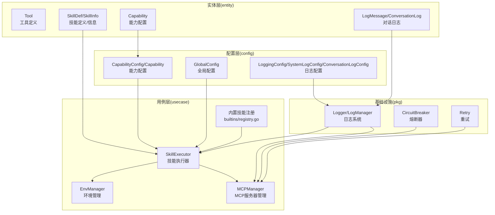
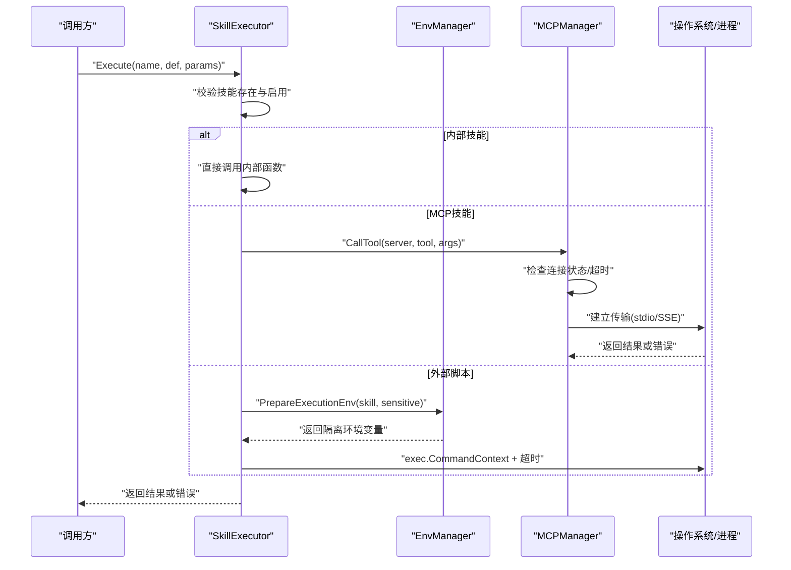
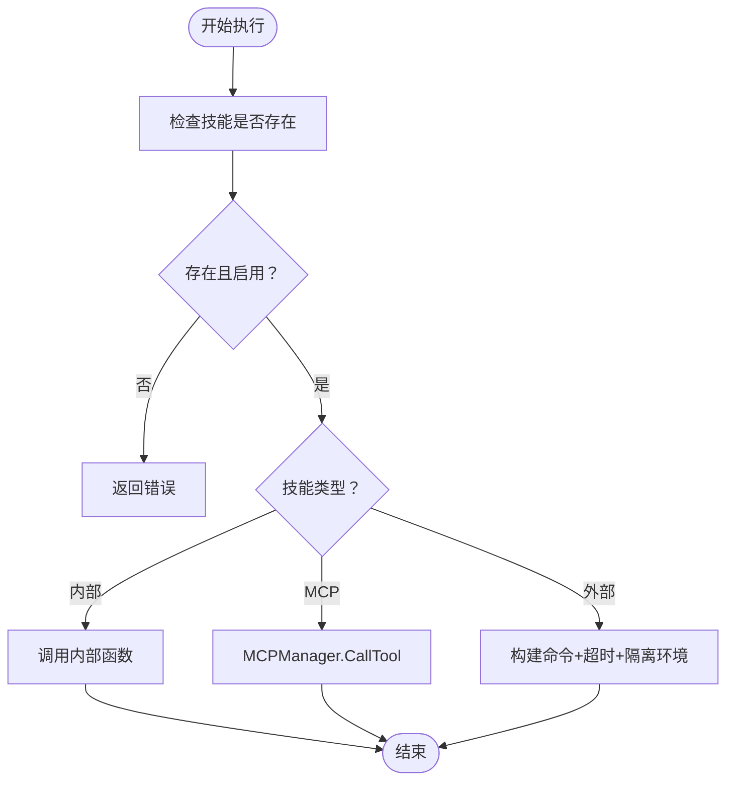
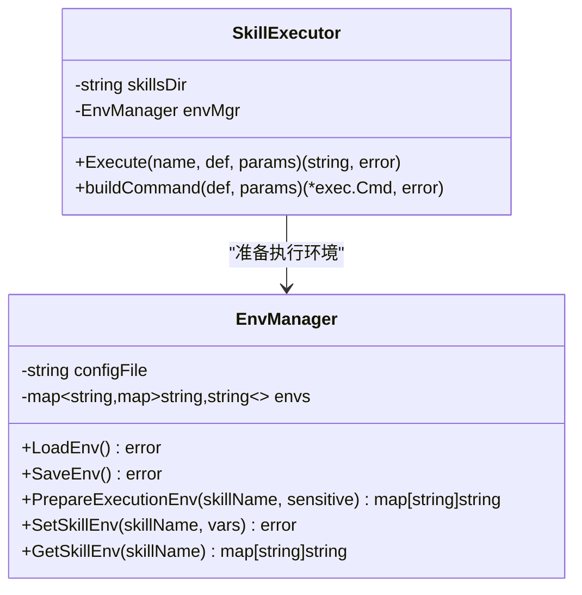
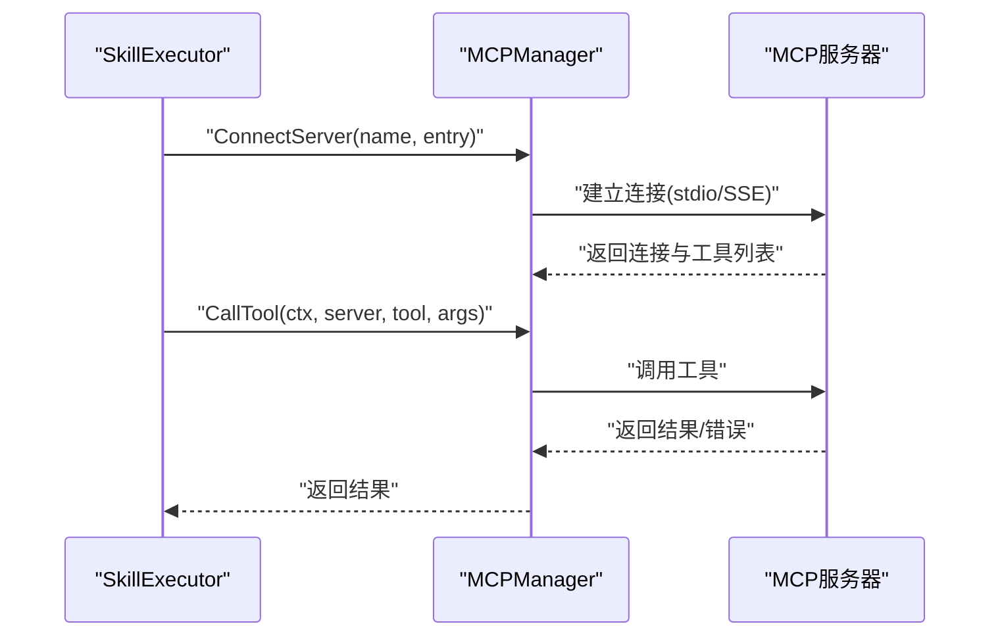
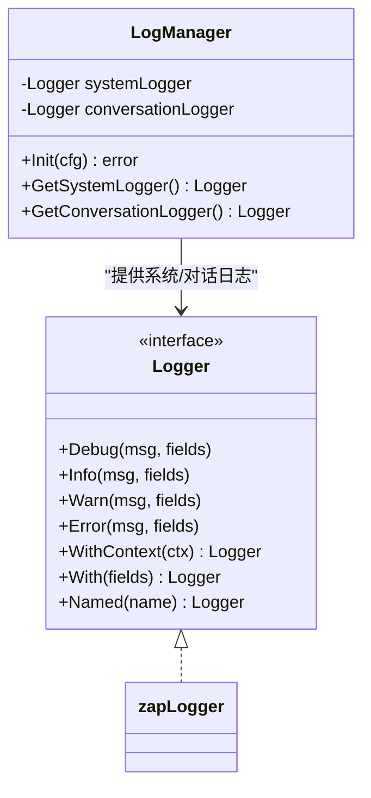
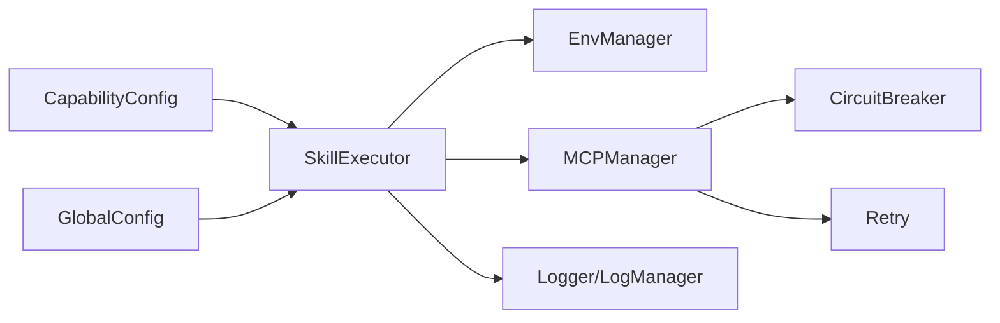

# 工具安全与权限控制

<cite>
**本文引用的文件**
- [internal/entity/tool.go](file://internal/entity/tool.go)
- [internal/entity/skill.go](file://internal/entity/skill.go)
- [internal/entity/capability.go](file://internal/entity/capability.go)
- [internal/config/capability.go](file://internal/config/capability.go)
- [internal/config/global.go](file://internal/config/global.go)
- [internal/config/logging.go](file://internal/config/logging.go)
- [internal/usecase/skills/executor.go](file://internal/usecase/skills/executor.go)
- [internal/usecase/skills/skill_env.go](file://internal/usecase/skills/skill_env.go)
- [internal/usecase/skills/mcp_manager.go](file://internal/usecase/skills/mcp_manager.go)
- [internal/usecase/skills/builtins/registry.go](file://internal/usecase/skills/builtins/registry.go)
- [pkg/logging/logger.go](file://pkg/logging/logger.go)
- [pkg/circuitbreaker/breaker.go](file://pkg/circuitbreaker/breaker.go)
- [pkg/retry/retry.go](file://pkg/retry/retry.go)
- [internal/entity/logs.go](file://internal/entity/logs.go)
</cite>

## 目录
1. [简介](#简介)
2. [项目结构](#项目结构)
3. [核心组件](#核心组件)
4. [架构总览](#架构总览)
5. [详细组件分析](#详细组件分析)
6. [依赖关系分析](#依赖关系分析)
7. [性能考量](#性能考量)
8. [故障排查指南](#故障排查指南)
9. [结论](#结论)
10. [附录](#附录)

## 简介
本文件聚焦于MindX平台的“工具安全与权限控制”机制，围绕以下目标展开：
- 工具调用的安全检查：技能权限验证、参数合法性检查、执行环境隔离
- 访问控制策略与权限继承机制
- 工具执行的沙箱与资源限制
- 工具调用的日志记录与审计
- 超时控制与异常中断机制
- 提供可操作的安全加固与合规性检查指导

## 项目结构
本项目采用分层与领域驱动设计，安全相关的关键代码集中在usecase层的技能执行与MCP管理、config层的能力与日志配置、以及entity层的数据模型。

图表来源
- [internal/entity/tool.go](file://internal/entity/tool.go#L1-L11)
- [internal/entity/skill.go](file://internal/entity/skill.go#L5-L25)
- [internal/entity/capability.go](file://internal/entity/capability.go#L3-L15)
- [internal/config/capability.go](file://internal/config/capability.go#L3-L29)
- [internal/config/global.go](file://internal/config/global.go#L3-L17)
- [internal/config/logging.go](file://internal/config/logging.go#L14-L44)
- [internal/usecase/skills/executor.go](file://internal/usecase/skills/executor.go#L19-L42)
- [internal/usecase/skills/skill_env.go](file://internal/usecase/skills/skill_env.go#L28-L42)
- [internal/usecase/skills/mcp_manager.go](file://internal/usecase/skills/mcp_manager.go#L36-L47)
- [internal/usecase/skills/builtins/registry.go](file://internal/usecase/skills/builtins/registry.go#L15-L29)
- [pkg/logging/logger.go](file://pkg/logging/logger.go#L58-L94)
- [pkg/circuitbreaker/breaker.go](file://pkg/circuitbreaker/breaker.go#L34-L56)
- [pkg/retry/retry.go](file://pkg/retry/retry.go#L76-L107)
- [internal/entity/logs.go](file://internal/entity/logs.go#L5-L19)

章节来源
- [internal/entity/tool.go](file://internal/entity/tool.go#L1-L11)
- [internal/entity/skill.go](file://internal/entity/skill.go#L5-L25)
- [internal/entity/capability.go](file://internal/entity/capability.go#L3-L15)
- [internal/config/capability.go](file://internal/config/capability.go#L3-L29)
- [internal/config/global.go](file://internal/config/global.go#L3-L17)
- [internal/config/logging.go](file://internal/config/logging.go#L14-L44)
- [internal/usecase/skills/executor.go](file://internal/usecase/skills/executor.go#L19-L42)
- [internal/usecase/skills/skill_env.go](file://internal/usecase/skills/skill_env.go#L28-L42)
- [internal/usecase/skills/mcp_manager.go](file://internal/usecase/skills/mcp_manager.go#L36-L47)
- [internal/usecase/skills/builtins/registry.go](file://internal/usecase/skills/builtins/registry.go#L15-L29)
- [pkg/logging/logger.go](file://pkg/logging/logger.go#L58-L94)
- [pkg/circuitbreaker/breaker.go](file://pkg/circuitbreaker/breaker.go#L34-L56)
- [pkg/retry/retry.go](file://pkg/retry/retry.go#L76-L107)
- [internal/entity/logs.go](file://internal/entity/logs.go#L5-L19)

## 核心组件
- 技能执行器（SkillExecutor）：统一调度内部技能、外部脚本与MCP工具，负责超时控制、统计与日志记录。
- 环境管理（EnvManager）：集中管理技能执行所需的环境变量与工作目录，实现最小暴露面。
- MCP管理（MCPManager）：管理MCP服务器连接、工具发现与调用，支持stdio与SSE两种传输，并进行会话级安全控制。
- 日志系统（Logger/LogManager）：提供系统日志与对话日志，支持文件轮转与结构化输出。
- 熔断器与重试：对MCP调用等外部依赖提供弹性保护。
- 能力与权限（Capability/CapabilityConfig）：定义工具可用范围、默认能力与系统提示词，作为访问控制的上层策略。

章节来源
- [internal/usecase/skills/executor.go](file://internal/usecase/skills/executor.go#L57-L79)
- [internal/usecase/skills/skill_env.go](file://internal/usecase/skills/skill_env.go#L100-L120)
- [internal/usecase/skills/mcp_manager.go](file://internal/usecase/skills/mcp_manager.go#L49-L141)
- [pkg/logging/logger.go](file://pkg/logging/logger.go#L58-L94)
- [pkg/circuitbreaker/breaker.go](file://pkg/circuitbreaker/breaker.go#L34-L56)
- [pkg/retry/retry.go](file://pkg/retry/retry.go#L76-L107)
- [internal/entity/capability.go](file://internal/entity/capability.go#L3-L15)
- [internal/config/capability.go](file://internal/config/capability.go#L3-L29)

## 架构总览
下图展示了工具调用从入口到执行的总体流程，以及安全控制点的分布。

图表来源
- [internal/usecase/skills/executor.go](file://internal/usecase/skills/executor.go#L57-L79)
- [internal/usecase/skills/executor.go](file://internal/usecase/skills/executor.go#L105-L136)
- [internal/usecase/skills/executor.go](file://internal/usecase/skills/executor.go#L138-L195)
- [internal/usecase/skills/skill_env.go](file://internal/usecase/skills/skill_env.go#L100-L120)
- [internal/usecase/skills/mcp_manager.go](file://internal/usecase/skills/mcp_manager.go#L169-L204)

## 详细组件分析

### 技能执行器与参数合法性检查
- 技能存在性与启用状态检查：执行前确认技能信息存在且启用。
- 参数合法性检查：基于SkillDef中的参数定义（类型、必填）进行校验；对于外部脚本，参数以JSON形式经stdin传入，避免命令拼接注入。
- 超时控制：为MCP与外部脚本分别设置超时上下文，默认30秒，可按技能定义覆盖。
- 统计与日志：记录成功/失败次数、平均耗时、最后运行时间，并写入持久化存储。

图表来源
- [internal/usecase/skills/executor.go](file://internal/usecase/skills/executor.go#L57-L79)
- [internal/usecase/skills/executor.go](file://internal/usecase/skills/executor.go#L105-L136)
- [internal/usecase/skills/executor.go](file://internal/usecase/skills/executor.go#L138-L195)

章节来源
- [internal/entity/skill.go](file://internal/entity/skill.go#L44-L49)
- [internal/usecase/skills/executor.go](file://internal/usecase/skills/executor.go#L57-L79)
- [internal/usecase/skills/executor.go](file://internal/usecase/skills/executor.go#L117-L122)
- [internal/usecase/skills/executor.go](file://internal/usecase/skills/executor.go#L145-L148)
- [internal/usecase/skills/executor.go](file://internal/usecase/skills/executor.go#L170-L177)

### 执行环境隔离与资源限制
- 环境变量隔离：仅注入技能专属的SKILL_前缀变量，避免污染全局环境；支持从skills.yml配置技能专属变量。
- 工作目录隔离：外部脚本在技能专属目录执行，减少对宿主系统的侵扰。
- 资源限制：通过超时上下文限制执行时间；MCP传输采用stdio或SSE，结合工作目录与环境变量最小化攻击面。
- 敏感信息处理：日志系统提供字段封装，建议避免记录敏感字段（如API Key）。

图表来源
- [internal/usecase/skills/skill_env.go](file://internal/usecase/skills/skill_env.go#L28-L42)
- [internal/usecase/skills/skill_env.go](file://internal/usecase/skills/skill_env.go#L100-L120)
- [internal/usecase/skills/executor.go](file://internal/usecase/skills/executor.go#L218-L260)

章节来源
- [internal/usecase/skills/skill_env.go](file://internal/usecase/skills/skill_env.go#L100-L120)
- [internal/usecase/skills/executor.go](file://internal/usecase/skills/executor.go#L155-L168)
- [internal/usecase/skills/executor.go](file://internal/usecase/skills/executor.go#L218-L260)

### MCP工具调用与访问控制
- 连接管理：支持stdio与SSE两种传输；stdio模式下继承当前进程环境并合并用户配置，工作目录指向用户HOME，降低对mindx进程工作目录的依赖。
- 工具发现：连接后自动列举可用工具，便于前端与后端进行能力映射。
- 调用控制：调用前检查服务器状态，失败时更新状态并返回错误；支持超时控制。
- 权限继承：通过能力配置（Capability/CapabilityConfig）限定可用工具集合，结合系统提示词与模态限制，形成“能力-工具”的访问矩阵。

图表来源
- [internal/usecase/skills/mcp_manager.go](file://internal/usecase/skills/mcp_manager.go#L49-L141)
- [internal/usecase/skills/mcp_manager.go](file://internal/usecase/skills/mcp_manager.go#L169-L204)
- [internal/config/capability.go](file://internal/config/capability.go#L12-L28)

章节来源
- [internal/usecase/skills/mcp_manager.go](file://internal/usecase/skills/mcp_manager.go#L49-L141)
- [internal/usecase/skills/mcp_manager.go](file://internal/usecase/skills/mcp_manager.go#L169-L204)
- [internal/config/capability.go](file://internal/config/capability.go#L12-L28)
- [internal/entity/capability.go](file://internal/entity/capability.go#L3-L15)

### 内置技能与权限继承
- 内置技能注册：通过注册表将web_search、open_url、write_file等内置函数注册为可执行技能，便于统一权限控制与审计。
- 权限继承：内置技能同样受能力配置约束，仅在对应能力允许的工具列表中生效。

章节来源
- [internal/usecase/skills/builtins/registry.go](file://internal/usecase/skills/builtins/registry.go#L15-L29)

### 日志记录与审计
- 日志类型：系统日志与对话日志分离，支持文件轮转与控制台输出。
- 结构化字段：提供字符串、整型、布尔、任意类型、错误与时长等字段封装，便于审计。
- 审计建议：避免在日志中记录敏感字段；对关键事件（如工具调用、MCP连接、权限拒绝）进行记录。

图表来源
- [pkg/logging/logger.go](file://pkg/logging/logger.go#L24-L43)
- [pkg/logging/logger.go](file://pkg/logging/logger.go#L58-L94)
- [pkg/logging/logger.go](file://pkg/logging/logger.go#L296-L324)

章节来源
- [pkg/logging/logger.go](file://pkg/logging/logger.go#L112-L191)
- [pkg/logging/logger.go](file://pkg/logging/logger.go#L193-L242)
- [internal/config/logging.go](file://internal/config/logging.go#L14-L44)
- [internal/entity/logs.go](file://internal/entity/logs.go#L5-L19)

### 超时控制与异常中断
- 超时控制：MCP与外部脚本均使用带超时的context，防止长时间阻塞。
- 异常中断：捕获执行过程中的错误，区分可重试与不可重试场景；MCP调用失败时更新状态，避免重复无效调用。
- 熔断与重试：对外部依赖提供熔断与指数退避重试，提升稳定性。

章节来源
- [internal/usecase/skills/executor.go](file://internal/usecase/skills/executor.go#L117-L122)
- [internal/usecase/skills/executor.go](file://internal/usecase/skills/executor.go#L145-L148)
- [internal/usecase/skills/mcp_manager.go](file://internal/usecase/skills/mcp_manager.go#L169-L204)
- [pkg/circuitbreaker/breaker.go](file://pkg/circuitbreaker/breaker.go#L59-L81)
- [pkg/retry/retry.go](file://pkg/retry/retry.go#L76-L107)

## 依赖关系分析
- 技能执行器依赖环境管理器进行环境隔离，依赖MCP管理器进行MCP工具调用。
- 能力配置与全局配置为技能执行提供策略与运行参数。
- 日志系统贯穿执行链路，提供统一的审计能力。
- 熔断器与重试模块为外部依赖提供弹性保护。

图表来源
- [internal/usecase/skills/executor.go](file://internal/usecase/skills/executor.go#L19-L42)
- [internal/usecase/skills/skill_env.go](file://internal/usecase/skills/skill_env.go#L28-L42)
- [internal/usecase/skills/mcp_manager.go](file://internal/usecase/skills/mcp_manager.go#L36-L47)
- [internal/config/capability.go](file://internal/config/capability.go#L3-L29)
- [internal/config/global.go](file://internal/config/global.go#L3-L17)
- [pkg/logging/logger.go](file://pkg/logging/logger.go#L58-L94)
- [pkg/circuitbreaker/breaker.go](file://pkg/circuitbreaker/breaker.go#L34-L56)
- [pkg/retry/retry.go](file://pkg/retry/retry.go#L76-L107)

章节来源
- [internal/usecase/skills/executor.go](file://internal/usecase/skills/executor.go#L19-L42)
- [internal/usecase/skills/skill_env.go](file://internal/usecase/skills/skill_env.go#L28-L42)
- [internal/usecase/skills/mcp_manager.go](file://internal/usecase/skills/mcp_manager.go#L36-L47)
- [internal/config/capability.go](file://internal/config/capability.go#L3-L29)
- [internal/config/global.go](file://internal/config/global.go#L3-L17)
- [pkg/logging/logger.go](file://pkg/logging/logger.go#L58-L94)
- [pkg/circuitbreaker/breaker.go](file://pkg/circuitbreaker/breaker.go#L34-L56)
- [pkg/retry/retry.go](file://pkg/retry/retry.go#L76-L107)

## 性能考量
- 超时与并发：为每个工具调用设置合理超时，避免阻塞；对MCP调用使用熔断与重试，减少抖动影响。
- 环境隔离成本：环境变量与工作目录的准备应尽量轻量化，避免频繁I/O。
- 日志开销：系统日志采用文件轮转与结构化输出，避免过量日志影响性能。

## 故障排查指南
- 技能执行失败
  - 检查技能定义的参数类型与必填项是否满足
  - 查看执行日志中的错误字段与堆栈
  - 确认MCP服务器状态与工具发现结果
- MCP连接问题
  - 确认传输类型（stdio/SSE）与命令/URL配置
  - 检查环境变量注入与工作目录设置
- 超时与中断
  - 调整技能超时配置或外部服务端超时
  - 观察熔断器状态与重试行为
- 日志审计
  - 确认日志级别与输出路径配置
  - 排查敏感字段是否被记录

章节来源
- [internal/usecase/skills/executor.go](file://internal/usecase/skills/executor.go#L94-L98)
- [internal/usecase/skills/mcp_manager.go](file://internal/usecase/skills/mcp_manager.go#L105-L114)
- [pkg/logging/logger.go](file://pkg/logging/logger.go#L112-L191)
- [pkg/circuitbreaker/breaker.go](file://pkg/circuitbreaker/breaker.go#L101-L115)
- [pkg/retry/retry.go](file://pkg/retry/retry.go#L76-L107)

## 结论
MindX在工具安全与权限控制方面形成了“参数校验+环境隔离+超时控制+日志审计+熔断重试”的闭环。通过能力配置与MCP管理实现访问控制与权限继承，通过环境管理与工作目录实现执行隔离，通过日志系统与审计字段实现可追溯性。建议在生产环境中进一步强化敏感信息保护与路径白名单策略，持续完善安全基线与合规检查。

## 附录
- 开发者安全加固清单
  - 参数校验：确保SkillDef中的参数定义完整，必要时在执行前进行二次校验
  - 环境隔离：仅注入必需的SKILL_前缀变量，避免全局污染
  - 超时策略：为所有外部调用设置合理超时，防止资源泄露
  - 敏感信息：避免在日志中记录API Key等敏感字段，必要时脱敏
  - 审计字段：统一使用日志字段封装，记录关键事件与错误上下文
  - 弹性保护：对外部依赖启用熔断与重试，提升系统韧性