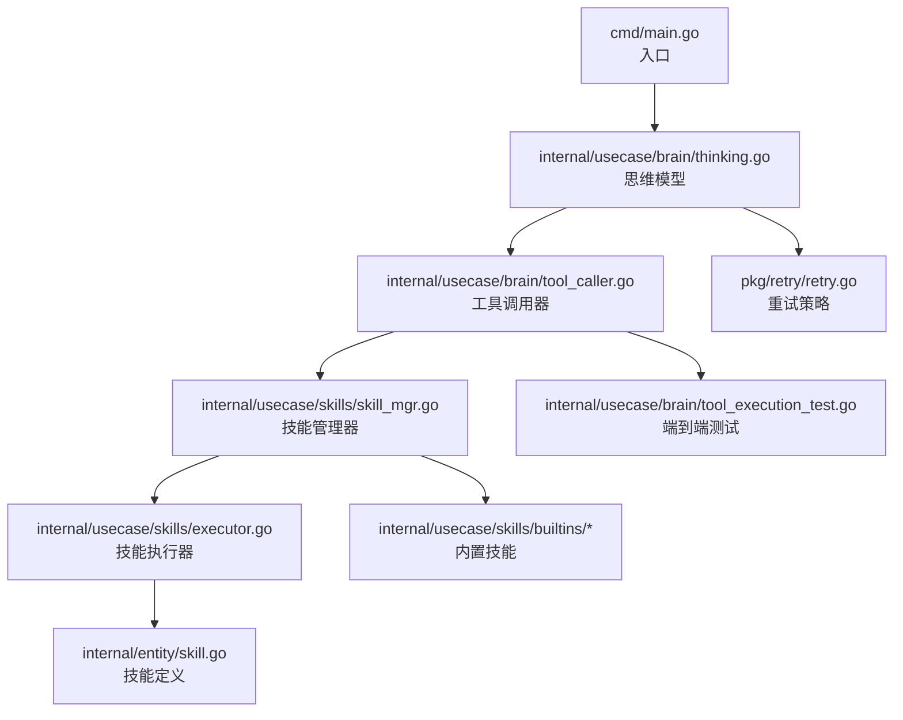
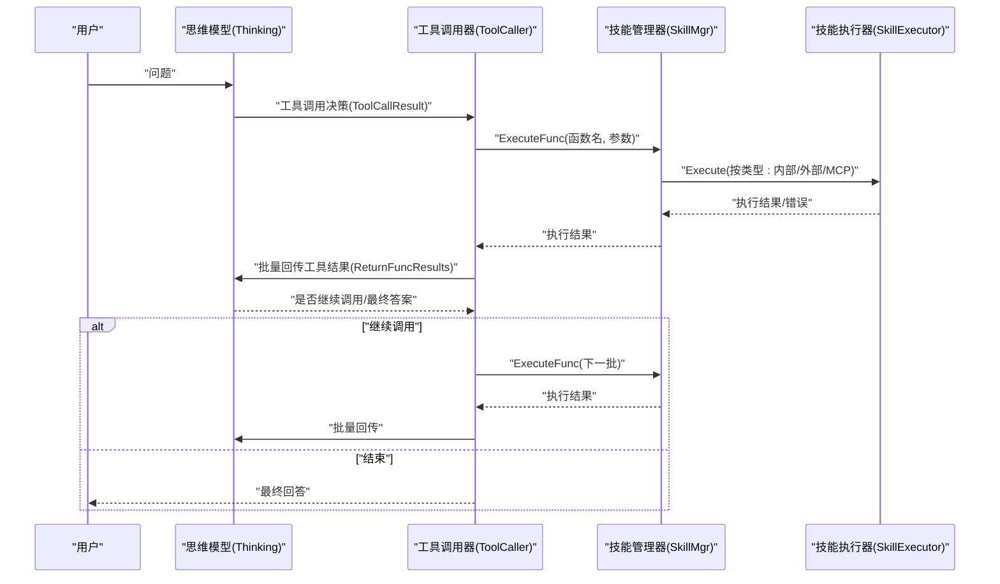
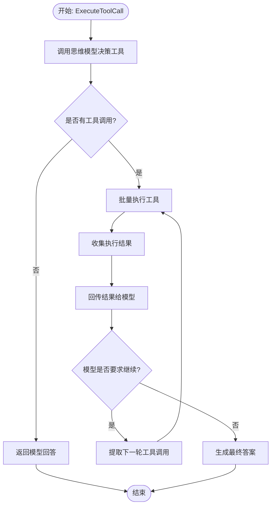
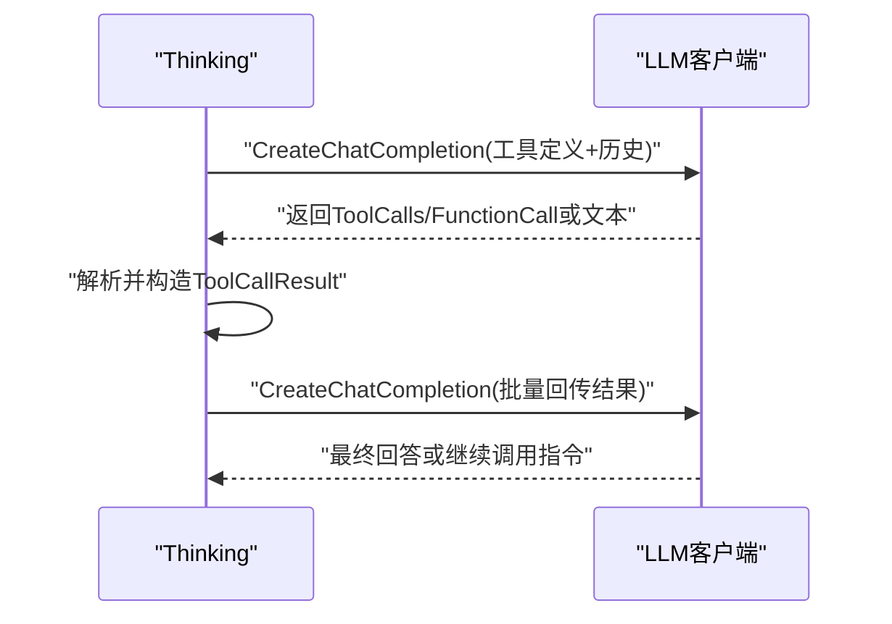
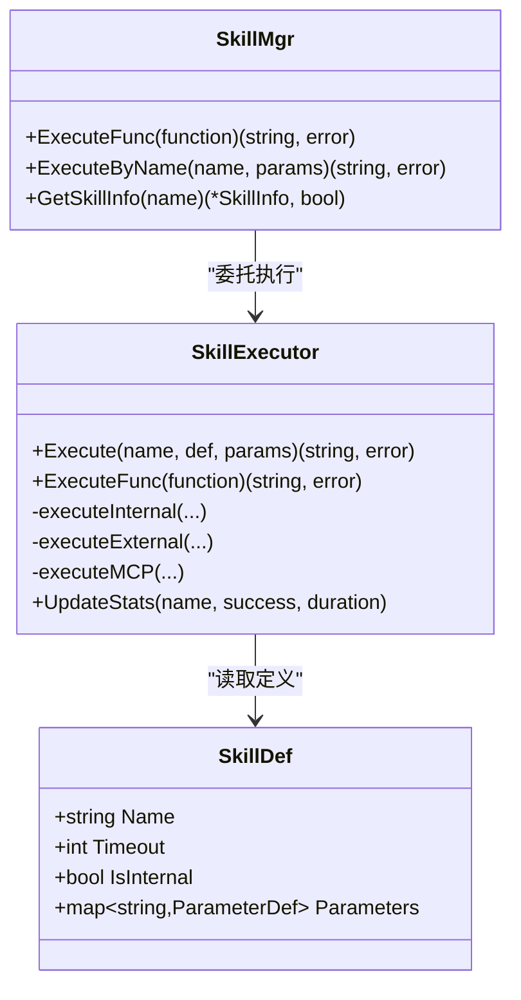
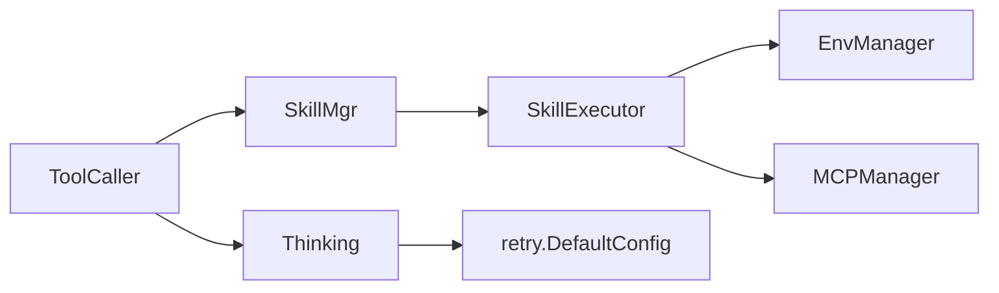

# 工具执行流程

<cite>
**本文档引用的文件**
- [cmd/main.go](file://cmd/main.go)
- [internal/usecase/brain/tool_caller.go](file://internal/usecase/brain/tool_caller.go)
- [internal/usecase/brain/thinking.go](file://internal/usecase/brain/thinking.go)
- [internal/usecase/skills/executor.go](file://internal/usecase/skills/executor.go)
- [internal/usecase/skills/skill_mgr.go](file://internal/usecase/skills/skill_mgr.go)
- [internal/usecase/skills/builtins/cron.go](file://internal/usecase/skills/builtins/cron.go)
- [internal/usecase/skills/builtins/web_search.go](file://internal/usecase/skills/builtins/web_search.go)
- [internal/entity/skill.go](file://internal/entity/skill.go)
- [pkg/retry/retry.go](file://pkg/retry/retry.go)
- [internal/usecase/brain/tool_execution_test.go](file://internal/usecase/brain/tool_execution_test.go)
</cite>

## 目录
1. [简介](#简介)
2. [项目结构](#项目结构)
3. [核心组件](#核心组件)
4. [架构总览](#架构总览)
5. [详细组件分析](#详细组件分析)
6. [依赖关系分析](#依赖关系分析)
7. [性能考虑](#性能考虑)
8. [故障排除指南](#故障排除指南)
9. [结论](#结论)

## 简介
本文件面向开发者，系统性阐述 MindX 工具执行的完整生命周期：从工具调用决策、批量执行、结果收集与回传，到循环调用与最终答案生成。文档重点覆盖以下方面：
- 工具调用的参数传递机制与执行上下文管理
- 批量工具调用的并发控制与错误处理策略
- 工具执行的超时管理、重试机制与资源限制
- 结果格式化与最终答案生成
- 性能优化与故障排除方法

## 项目结构
围绕工具执行的关键模块分布如下：
- 入口与初始化：cmd/main.go
- 思维与工具调用：internal/usecase/brain/thinking.go、internal/usecase/brain/tool_caller.go
- 技能执行与管理：internal/usecase/skills/executor.go、internal/usecase/skills/skill_mgr.go
- 内置技能示例：internal/usecase/skills/builtins/*
- 实体与配置：internal/entity/skill.go
- 重试与退避：pkg/retry/retry.go
- 端到端测试：internal/usecase/brain/tool_execution_test.go

图表来源
- [cmd/main.go](file://cmd/main.go#L1-L21)
- [internal/usecase/brain/thinking.go](file://internal/usecase/brain/thinking.go#L1-L120)
- [internal/usecase/brain/tool_caller.go](file://internal/usecase/brain/tool_caller.go#L1-L60)
- [internal/usecase/skills/skill_mgr.go](file://internal/usecase/skills/skill_mgr.go#L1-L85)
- [internal/usecase/skills/executor.go](file://internal/usecase/skills/executor.go#L1-L60)
- [internal/entity/skill.go](file://internal/entity/skill.go#L1-L40)
- [pkg/retry/retry.go](file://pkg/retry/retry.go#L1-L40)
- [internal/usecase/brain/tool_execution_test.go](file://internal/usecase/brain/tool_execution_test.go#L1-L40)

章节来源
- [cmd/main.go](file://cmd/main.go#L1-L21)
- [internal/usecase/brain/thinking.go](file://internal/usecase/brain/thinking.go#L1-L120)
- [internal/usecase/brain/tool_caller.go](file://internal/usecase/brain/tool_caller.go#L1-L60)
- [internal/usecase/skills/skill_mgr.go](file://internal/usecase/skills/skill_mgr.go#L1-L85)
- [internal/usecase/skills/executor.go](file://internal/usecase/skills/executor.go#L1-L60)
- [internal/entity/skill.go](file://internal/entity/skill.go#L1-L40)
- [pkg/retry/retry.go](file://pkg/retry/retry.go#L1-L40)
- [internal/usecase/brain/tool_execution_test.go](file://internal/usecase/brain/tool_execution_test.go#L1-L40)

## 核心组件
- 思维模型（Thinking）：负责与 LLM 对话，生成工具调用决策或最终回答；支持流式响应、Token 预算与重试。
- 工具调用器（ToolCaller）：协调思维模型与技能执行器，实现“决策-执行-回传-再决策”的循环调用。
- 技能管理器（SkillMgr）：统一加载、索引、转换、安装技能，暴露 ExecuteFunc 接口供 ToolCaller 调用。
- 技能执行器（SkillExecutor）：按技能类型（内部、外部脚本、MCP）执行，统一超时、参数序列化与统计上报。
- 内置技能（builtins）：如定时任务、网页搜索等，演示参数传递与结果格式化。

章节来源
- [internal/usecase/brain/thinking.go](file://internal/usecase/brain/thinking.go#L21-L120)
- [internal/usecase/brain/tool_caller.go](file://internal/usecase/brain/tool_caller.go#L15-L40)
- [internal/usecase/skills/skill_mgr.go](file://internal/usecase/skills/skill_mgr.go#L20-L85)
- [internal/usecase/skills/executor.go](file://internal/usecase/skills/executor.go#L19-L60)
- [internal/usecase/skills/builtins/cron.go](file://internal/usecase/skills/builtins/cron.go#L9-L40)
- [internal/usecase/skills/builtins/web_search.go](file://internal/usecase/skills/builtins/web_search.go#L10-L35)

## 架构总览
工具执行的端到端流程由“左脑意图识别 + 右脑工具决策 + 执行 + 结果回传 + 循环决策”构成，最终生成自然语言回答。

图表来源
- [internal/usecase/brain/tool_caller.go](file://internal/usecase/brain/tool_caller.go#L27-L139)
- [internal/usecase/brain/thinking.go](file://internal/usecase/brain/thinking.go#L338-L577)
- [internal/usecase/brain/thinking.go](file://internal/usecase/brain/thinking.go#L694-L800)
- [internal/usecase/skills/skill_mgr.go](file://internal/usecase/skills/skill_mgr.go#L213-L226)
- [internal/usecase/skills/executor.go](file://internal/usecase/skills/executor.go#L57-L79)

## 详细组件分析

### 工具调用器（ToolCaller）
- 职责
  - 依据历史对话与工具列表，调用思维模型进行工具选择。
  - 将模型返回的工具调用项批量执行，并将结果回传给模型。
  - 支持循环调用，直到模型判定无需继续或达到最大调用次数。
- 关键流程
  - 决策：调用 Thinking.ThinkWithTools 获取 ToolCallResult。
  - 批量执行：遍历 ToolCalls，逐个调用 SkillMgr.ExecuteFunc。
  - 结果回传：调用 Thinking.ReturnFuncResults，将所有结果一次性回传。
  - 循环：若模型仍要求继续，则提取新的 ToolCalls 继续下一轮。
- 上下文与参数
  - 通过 ToolCallFunction{Name, Arguments} 传递函数名与参数。
  - 历史消息与自定义系统提示参与模型决策。
- 错误处理
  - 单个工具执行失败会被记录为 ToolExecResult.Error，但不影响后续工具执行。
  - 达到最大调用次数（默认 10）时终止循环。
- 日志与可观测性
  - 记录每次工具执行的函数名与参数，以及执行结果或错误。

图表来源
- [internal/usecase/brain/tool_caller.go](file://internal/usecase/brain/tool_caller.go#L27-L139)

章节来源
- [internal/usecase/brain/tool_caller.go](file://internal/usecase/brain/tool_caller.go#L27-L139)

### 思维模型（Thinking）
- 工具调用决策（ThinkWithTools）
  - 构造工具定义数组（名称、描述、参数 Schema），并附带系统提示词。
  - 发起一次 ChatCompletion 请求，解析返回的 ToolCalls 或 FunctionCall。
  - 兼容旧格式（FunctionCall/Ollama JSON），并兼容多工具调用。
- 批量结果回传（ReturnFuncResults）
  - 将所有工具调用项与对应结果组装为 Assistant + Tool 消息序列。
  - 再次发起 ChatCompletion，让模型基于全部结果做出最终回答或继续调用。
- 重试与指标
  - 使用 pkg/retry.DefaultConfig 进行指数退避重试。
  - 记录 LLM 调用次数、耗时与 Token 使用量。
- 超时与预算
  - 动态计算最大历史轮数，避免超出模型上下文长度。
  - 在流式响应中分段解析思考过程与最终回答。

图表来源
- [internal/usecase/brain/thinking.go](file://internal/usecase/brain/thinking.go#L338-L577)
- [internal/usecase/brain/thinking.go](file://internal/usecase/brain/thinking.go#L694-L800)
- [pkg/retry/retry.go](file://pkg/retry/retry.go#L11-L28)

章节来源
- [internal/usecase/brain/thinking.go](file://internal/usecase/brain/thinking.go#L338-L577)
- [internal/usecase/brain/thinking.go](file://internal/usecase/brain/thinking.go#L694-L800)
- [pkg/retry/retry.go](file://pkg/retry/retry.go#L11-L28)

### 技能管理器与执行器（SkillMgr/SkillExecutor）
- 技能管理器（SkillMgr）
  - 负责加载、索引、转换、安装技能，维护技能元数据与向量索引。
  - 提供 ExecuteFunc 接口，供 ToolCaller 直接调用。
- 技能执行器（SkillExecutor）
  - 支持三种执行路径：
    - 内部函数：直接调用注册的 InternalSkillFunc。
    - 外部脚本：构建命令、设置超时、准备环境变量、序列化参数并通过 stdin 传递。
    - MCP 工具：通过 MCP 管理器调用远端工具，支持超时控制。
  - 统一统计与持久化：记录成功/失败次数、执行耗时、最近运行时间，并写入存储。
  - 参数传递：将 ToolCallFunction.Arguments 拷贝为 map[string]any 传入执行函数。

图表来源
- [internal/usecase/skills/skill_mgr.go](file://internal/usecase/skills/skill_mgr.go#L213-L226)
- [internal/usecase/skills/executor.go](file://internal/usecase/skills/executor.go#L57-L79)
- [internal/usecase/skills/executor.go](file://internal/usecase/skills/executor.go#L197-L216)
- [internal/entity/skill.go](file://internal/entity/skill.go#L6-L25)

章节来源
- [internal/usecase/skills/skill_mgr.go](file://internal/usecase/skills/skill_mgr.go#L213-L226)
- [internal/usecase/skills/executor.go](file://internal/usecase/skills/executor.go#L57-L79)
- [internal/usecase/skills/executor.go](file://internal/usecase/skills/executor.go#L197-L216)
- [internal/entity/skill.go](file://internal/entity/skill.go#L6-L25)

### 内置技能示例
- 定时任务（cron）：根据 action（add/list/delete/pause/resume）操作调度器，返回结构化 JSON。
- 网页搜索（web_search）：调用浏览器驱动进行搜索，返回包含结果数量、耗时与条目的 JSON。

章节来源
- [internal/usecase/skills/builtins/cron.go](file://internal/usecase/skills/builtins/cron.go#L17-L41)
- [internal/usecase/skills/builtins/web_search.go](file://internal/usecase/skills/builtins/web_search.go#L10-L35)

### 参数传递机制与执行上下文管理
- 参数传递
  - ToolCaller 将 ToolCallFunction{Name, Arguments} 传入 SkillMgr.ExecuteFunc。
  - SkillExecutor.ExecuteFunc 将 Arguments 拷贝为 map[string]any，随后按技能类型执行。
- 执行上下文
  - 外部脚本：设置工作目录为技能目录，准备环境变量，将参数以 JSON 形式写入 stdin。
  - MCP 工具：为每次调用创建带超时的 context，并指定服务器与工具名。
  - 内部函数：直接调用注册的函数，便于单元测试与快速验证。

章节来源
- [internal/usecase/brain/tool_caller.go](file://internal/usecase/brain/tool_caller.go#L86-L108)
- [internal/usecase/skills/executor.go](file://internal/usecase/skills/executor.go#L197-L216)
- [internal/usecase/skills/executor.go](file://internal/usecase/skills/executor.go#L138-L195)
- [internal/usecase/skills/executor.go](file://internal/usecase/skills/executor.go#L105-L136)

### 批量执行与并发控制
- 当前实现为顺序批量执行：遍历 ToolCalls，逐个调用 SkillMgr.ExecuteFunc。
- 并发控制
  - 未引入 goroutine 并行执行，避免资源竞争与上下文污染。
  - 若需并发，建议在 ToolCaller 层引入带缓冲的 worker pool，并为每个工具调用创建独立 context。
- 错误处理
  - 单个工具失败不影响其他工具执行；失败结果会作为 ToolExecResult.Error 回传给模型。

章节来源
- [internal/usecase/brain/tool_caller.go](file://internal/usecase/brain/tool_caller.go#L74-L108)

### 超时管理与资源限制
- 超时策略
  - 外部脚本与 MCP 工具：优先使用技能定义中的 Timeout 字段，否则默认 30 秒。
  - 思维模型：使用 pkg/retry.DefaultConfig 进行请求级重试，避免单次超时导致失败。
- 资源限制
  - 外部脚本：通过 exec.CommandContext 与超时 context 控制执行时间。
  - MCP 工具：同样通过 context.WithTimeout 控制连接与调用超时。
- Token 预算
  - 思维模型根据模型最大 Token、保留输出 Token、最小历史轮数与平均每轮 Token 计算动态最大历史轮数，防止越界。

章节来源
- [internal/usecase/skills/executor.go](file://internal/usecase/skills/executor.go#L117-L121)
- [internal/usecase/skills/executor.go](file://internal/usecase/skills/executor.go#L145-L148)
- [internal/usecase/brain/thinking.go](file://internal/usecase/brain/thinking.go#L45-L51)
- [internal/usecase/brain/thinking.go](file://internal/usecase/brain/thinking.go#L78-L119)

### 结果格式化与最终答案生成
- 结果格式
  - 外部脚本：若标准输出为合法 JSON，视为成功；否则将输出作为字符串返回。
  - MCP/内部函数：通常返回 JSON 字符串，便于前端解析。
- 最终答案
  - 思维模型在批量回传后再次推理，生成最终自然语言回答。
  - ToolCaller 在模型声明 NoCall 或返回 Answer 时结束循环。

章节来源
- [internal/usecase/skills/executor.go](file://internal/usecase/skills/executor.go#L179-L190)
- [internal/usecase/brain/thinking.go](file://internal/usecase/brain/thinking.go#L694-L800)
- [internal/usecase/brain/tool_caller.go](file://internal/usecase/brain/tool_caller.go#L116-L120)

### 端到端测试与验证
- ToolExecutionSuite
  - 验证左脑意图识别、工具搜索、右脑工具调用与执行的完整链路。
  - 包含计算器、系统信息、天气等典型工具的执行测试。
  - 支持多工具场景，验证右脑在多个候选工具中的选择能力。
- 测试要点
  - 关键步骤：左脑 Think → 右脑 ThinkWithTools → ToolCaller.ExecuteToolCall → 最终回答。
  - 断言：最终回答非空，部分场景断言包含期望关键词。

章节来源
- [internal/usecase/brain/tool_execution_test.go](file://internal/usecase/brain/tool_execution_test.go#L127-L174)
- [internal/usecase/brain/tool_execution_test.go](file://internal/usecase/brain/tool_execution_test.go#L176-L222)
- [internal/usecase/brain/tool_execution_test.go](file://internal/usecase/brain/tool_execution_test.go#L224-L269)
- [internal/usecase/brain/tool_execution_test.go](file://internal/usecase/brain/tool_execution_test.go#L314-L340)
- [internal/usecase/brain/tool_execution_test.go](file://internal/usecase/brain/tool_execution_test.go#L357-L461)

## 依赖关系分析
- 组件耦合
  - ToolCaller 依赖 Thinking（决策）与 SkillMgr（执行）。
  - SkillMgr 依赖 SkillExecutor（执行）、SkillLoader（加载）、SkillSearcher（检索）、SkillIndexer（索引）。
  - SkillExecutor 依赖 EnvManager（环境准备）、MCPManager（MCP 调用）。
- 外部依赖
  - OpenAI 客户端用于与 LLM 交互。
  - Prometheus 指标用于记录 LLM 调用与 Token 使用。
- 潜在风险
  - ToolCaller 未做并发执行，可能成为性能瓶颈。
  - MCP 连接超时与不可重试错误的区分逻辑需持续完善。

图表来源
- [internal/usecase/brain/tool_caller.go](file://internal/usecase/brain/tool_caller.go#L27-L47)
- [internal/usecase/skills/skill_mgr.go](file://internal/usecase/skills/skill_mgr.go#L40-L62)
- [internal/usecase/skills/executor.go](file://internal/usecase/skills/executor.go#L32-L42)
- [pkg/retry/retry.go](file://pkg/retry/retry.go#L19-L28)

章节来源
- [internal/usecase/brain/tool_caller.go](file://internal/usecase/brain/tool_caller.go#L27-L47)
- [internal/usecase/skills/skill_mgr.go](file://internal/usecase/skills/skill_mgr.go#L40-L62)
- [internal/usecase/skills/executor.go](file://internal/usecase/skills/executor.go#L32-L42)
- [pkg/retry/retry.go](file://pkg/retry/retry.go#L19-L28)

## 性能考虑
- 并发执行
  - 建议在 ToolCaller 层引入 worker pool，按工具数量与系统资源动态分配并发度。
  - 为每个工具调用创建独立 context，避免相互影响。
- 超时与重试
  - 外部脚本与 MCP 工具的超时应结合业务需求与资源状况调优。
  - 思维模型请求采用指数退避重试，避免瞬时错误放大。
- 缓存与预热
  - MCP 服务器连接可预热，减少首次冷启动开销。
  - 技能统计与向量索引持久化，减少启动时重建成本。
- 日志与监控
  - 增加工具执行耗时直方图与错误分类统计，辅助定位热点与异常。

## 故障排除指南
- 工具未找到
  - 检查技能是否启用、是否存在缺失二进制或环境变量。
  - 查看 SkillMgr.GetSkillInfo 返回是否存在。
- 执行失败
  - 外部脚本：确认命令可执行、参数 JSON 序列化成功、工作目录权限。
  - MCP 工具：确认服务器已初始化、工具名正确、连接超时。
- 循环未结束
  - 检查思维模型是否正确回传结果；必要时在 ToolCaller 中增加最大轮次保护。
- 性能问题
  - 若工具数量较多，考虑并发执行与限流；观察系统 CPU/IO 使用情况。
- 日志定位
  - 关注 ToolCaller 与 SkillExecutor 的日志，定位具体失败工具与错误信息。

章节来源
- [internal/usecase/skills/skill_mgr.go](file://internal/usecase/skills/skill_mgr.go#L142-L149)
- [internal/usecase/skills/executor.go](file://internal/usecase/skills/executor.go#L138-L195)
- [internal/usecase/brain/tool_caller.go](file://internal/usecase/brain/tool_caller.go#L76-L79)

## 结论
MindX 的工具执行流程以“思维模型 + 工具调用器 + 技能管理器 + 执行器”为核心，实现了从工具选择到执行、回传与最终答案生成的闭环。当前实现强调稳定性与可观测性，未来可在并发执行、MCP 连接优化与缓存预热等方面进一步提升性能与可靠性。开发者可参考端到端测试用例与内置技能示例，快速扩展与调试新工具。