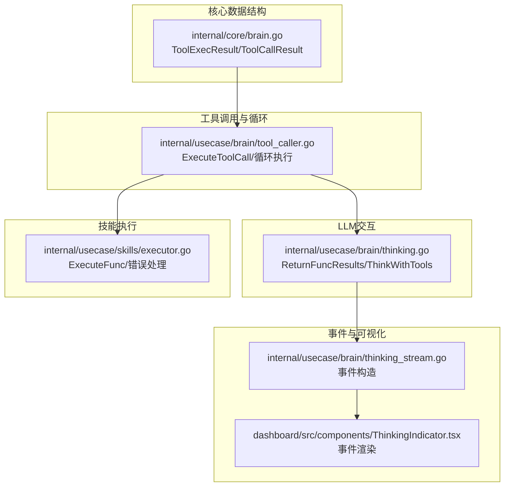
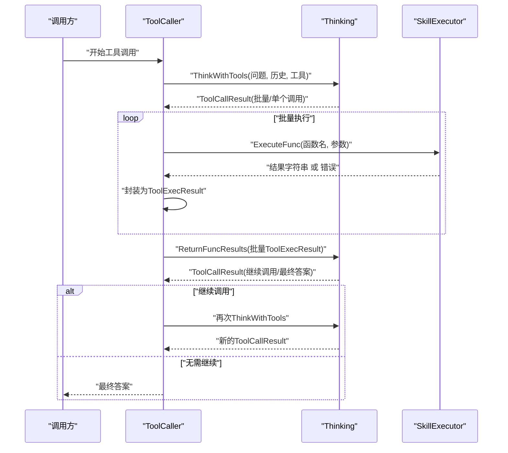
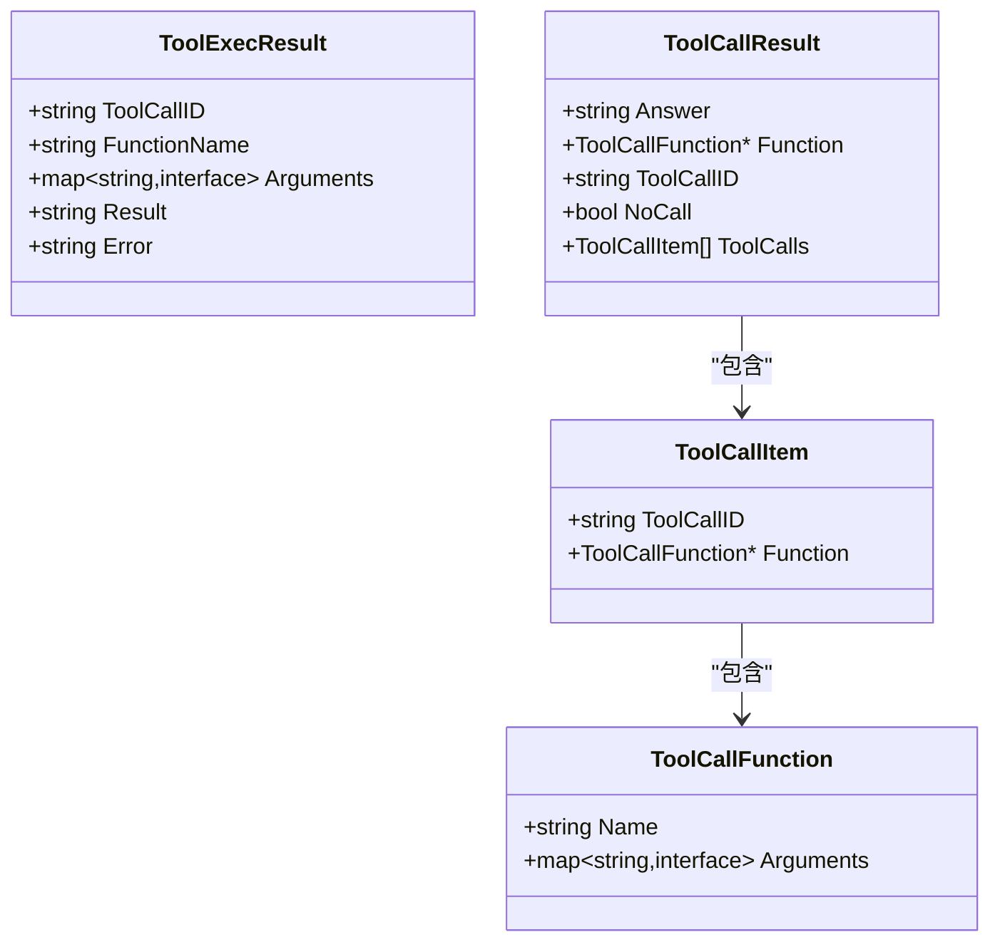
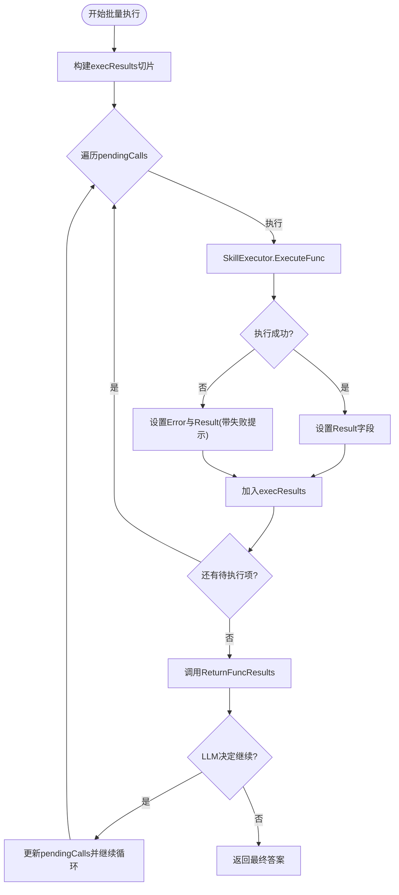
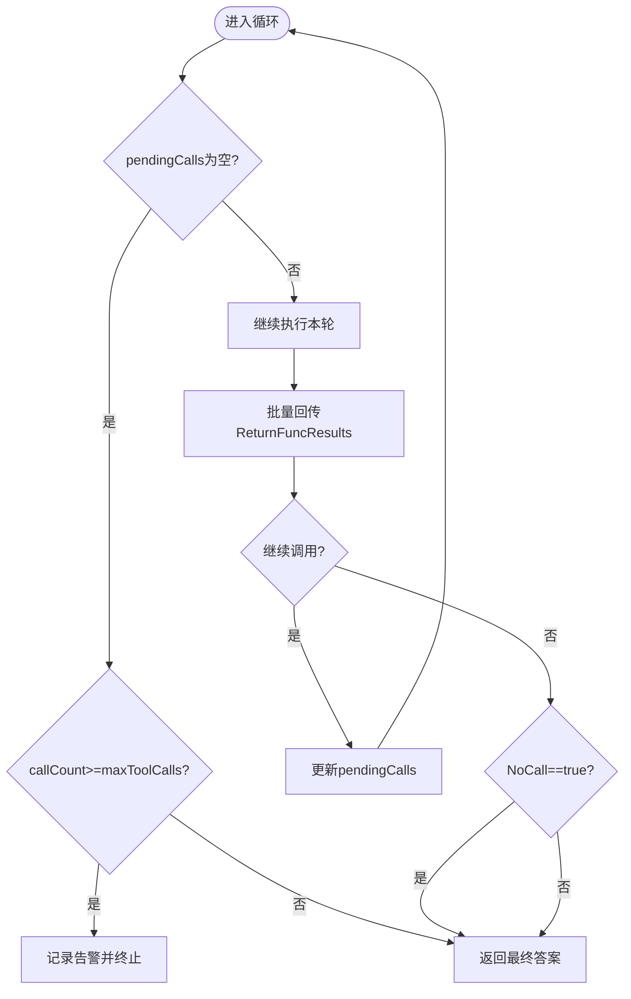
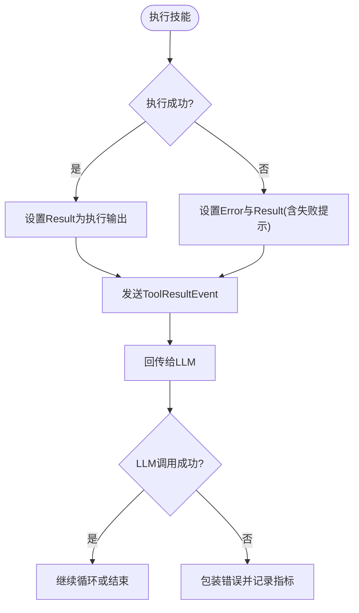
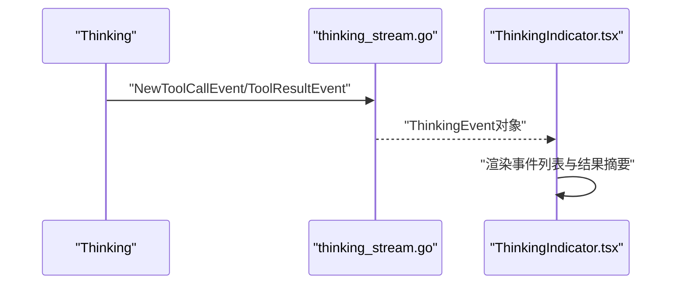
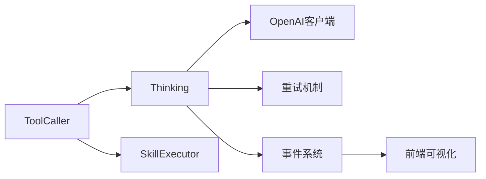

# 工具结果处理

<cite>
**本文档引用的文件**
- [internal/core/brain.go](file://internal/core/brain.go)
- [internal/usecase/brain/tool_caller.go](file://internal/usecase/brain/tool_caller.go)
- [internal/usecase/brain/thinking.go](file://internal/usecase/brain/thinking.go)
- [internal/usecase/brain/thinking_stream.go](file://internal/usecase/brain/thinking_stream.go)
- [internal/usecase/skills/executor.go](file://internal/usecase/skills/executor.go)
- [dashboard/src/components/ThinkingIndicator.tsx](file://dashboard/src/components/ThinkingIndicator.tsx)
- [internal/usecase/brain/tool_execution_test.go](file://internal/usecase/brain/tool_execution_test.go)
</cite>

## 目录
1. [简介](#简介)
2. [项目结构](#项目结构)
3. [核心组件](#核心组件)
4. [架构总览](#架构总览)
5. [详细组件分析](#详细组件分析)
6. [依赖关系分析](#依赖关系分析)
7. [性能考量](#性能考量)
8. [故障排查指南](#故障排查指南)
9. [结论](#结论)

## 简介
本文件聚焦于MindX系统中“工具结果处理”机制，系统性阐述工具执行结果的收集、格式化与回传给LLM的完整流程；详解ToolExecResult数据结构的设计与字段语义；说明批量处理与增量更新策略；解释工具调用的循环执行逻辑（继续调用判断与终止条件）；描述错误结果的处理与错误信息格式化；并提供具体实现模式与边界情况处理示例，帮助开发者进行优化与调试。

## 项目结构
围绕工具结果处理的关键代码分布在以下模块：
- 核心数据结构定义：internal/core/brain.go
- 工具调用与循环执行：internal/usecase/brain/tool_caller.go
- LLM交互与结果回传：internal/usecase/brain/thinking.go
- 事件流与前端可视化：internal/usecase/brain/thinking_stream.go、dashboard/src/components/ThinkingIndicator.tsx
- 技能执行器与错误处理：internal/usecase/skills/executor.go
- 测试用例与端到端验证：internal/usecase/brain/tool_execution_test.go

**图表来源**
- [internal/core/brain.go](file://internal/core/brain.go#L42-L68)
- [internal/usecase/brain/tool_caller.go](file://internal/usecase/brain/tool_caller.go#L27-L139)
- [internal/usecase/brain/thinking.go](file://internal/usecase/brain/thinking.go#L338-L577)
- [internal/usecase/brain/thinking_stream.go](file://internal/usecase/brain/thinking_stream.go#L50-L72)
- [dashboard/src/components/ThinkingIndicator.tsx](file://dashboard/src/components/ThinkingIndicator.tsx#L22-L112)
- [internal/usecase/skills/executor.go](file://internal/usecase/skills/executor.go#L197-L216)

**章节来源**
- [internal/core/brain.go](file://internal/core/brain.go#L42-L68)
- [internal/usecase/brain/tool_caller.go](file://internal/usecase/brain/tool_caller.go#L27-L139)
- [internal/usecase/brain/thinking.go](file://internal/usecase/brain/thinking.go#L338-L577)
- [internal/usecase/brain/thinking_stream.go](file://internal/usecase/brain/thinking_stream.go#L50-L72)
- [dashboard/src/components/ThinkingIndicator.tsx](file://dashboard/src/components/ThinkingIndicator.tsx#L22-L112)
- [internal/usecase/skills/executor.go](file://internal/usecase/skills/executor.go#L197-L216)

## 核心组件
- ToolExecResult：单次工具执行的结果载体，包含调用标识、函数名、参数、执行结果文本以及可选错误信息。
- ToolCallResult：LLM决策阶段的调用结果，支持单个或批量工具调用，包含答案、是否不调用、工具调用ID等。
- ToolCaller：协调工具调用的编排器，负责循环执行、批量回传与继续调用判断。
- Thinking：负责与LLM交互，构建消息历史、工具描述、回传结果并解析后续调用意图。
- SkillExecutor：实际执行技能，捕获输出与错误，统一返回字符串结果或错误。
- 事件系统：通过ThinkingEvent在各层间传递“工具调用”、“工具结果”等事件，前端可视化展示。

**章节来源**
- [internal/core/brain.go](file://internal/core/brain.go#L42-L68)
- [internal/usecase/brain/tool_caller.go](file://internal/usecase/brain/tool_caller.go#L27-L139)
- [internal/usecase/brain/thinking.go](file://internal/usecase/brain/thinking.go#L338-L577)
- [internal/usecase/skills/executor.go](file://internal/usecase/skills/executor.go#L197-L216)
- [internal/usecase/brain/thinking_stream.go](file://internal/usecase/brain/thinking_stream.go#L50-L72)

## 架构总览
工具结果处理遵循“决策—执行—回传—再决策”的循环，直至LLM决定停止或达到上限。

**图表来源**
- [internal/usecase/brain/tool_caller.go](file://internal/usecase/brain/tool_caller.go#L27-L139)
- [internal/usecase/brain/thinking.go](file://internal/usecase/brain/thinking.go#L338-L577)
- [internal/usecase/skills/executor.go](file://internal/usecase/skills/executor.go#L197-L216)

## 详细组件分析

### 数据结构：ToolExecResult 设计与字段语义
- ToolCallID：工具调用唯一标识，用于LLM回传结果时匹配对应调用。
- FunctionName：被调用的函数名，便于事件与日志追踪。
- Arguments：原始参数映射，用于回传给LLM时构造assistant消息。
- Result：工具执行的字符串化结果，供LLM进一步推理。
- Error：可选错误信息，当执行失败时填充，便于统一格式化。

**图表来源**
- [internal/core/brain.go](file://internal/core/brain.go#L42-L68)

**章节来源**
- [internal/core/brain.go](file://internal/core/brain.go#L42-L68)

### 批量处理与增量更新策略
- 批量执行：ToolCaller在每轮循环中并发执行当前待执行队列中的所有调用，生成ToolExecResult切片。
- 增量回传：将本轮所有ToolExecResult一次性传回LLM（ReturnFuncResults），LLM据此决定是否继续调用或给出最终答案。
- 增量事件：每条ToolExecResult都会触发ToolResultEvent事件，前端逐步展示工具结果。

**图表来源**
- [internal/usecase/brain/tool_caller.go](file://internal/usecase/brain/tool_caller.go#L69-L132)
- [internal/usecase/brain/thinking.go](file://internal/usecase/brain/thinking.go#L694-L855)

**章节来源**
- [internal/usecase/brain/tool_caller.go](file://internal/usecase/brain/tool_caller.go#L69-L132)
- [internal/usecase/brain/thinking.go](file://internal/usecase/brain/thinking.go#L694-L855)

### 循环执行逻辑：继续调用判断与终止条件
- 继续调用判断：ReturnFuncResults返回的ToolCallResult若包含ToolCalls或Function，则认为需要继续调用。
- 终止条件：
  - NoCall=true：LLM明确不需要调用工具，直接结束。
  - 达到最大调用次数（默认10次）：保护性终止，避免无限循环。
  - 无继续调用意图且无NoCall=true：视为最终答案。

**图表来源**
- [internal/usecase/brain/tool_caller.go](file://internal/usecase/brain/tool_caller.go#L69-L139)
- [internal/usecase/brain/thinking.go](file://internal/usecase/brain/thinking.go#L823-L855)

**章节来源**
- [internal/usecase/brain/tool_caller.go](file://internal/usecase/brain/tool_caller.go#L69-L139)
- [internal/usecase/brain/thinking.go](file://internal/usecase/brain/thinking.go#L823-L855)

### 错误结果处理与错误信息格式化
- 执行错误：SkillExecutor在执行失败时返回错误，ToolCaller将其封装到ToolExecResult.Error，并将Result设置为带“执行失败”前缀的字符串，确保LLM侧能识别为错误上下文。
- LLM错误：ReturnFuncResults内部对LLM调用失败进行统一包装，记录指标并返回错误。
- 事件通知：每次工具调用与结果都会产生事件，前端可据此高亮错误状态。

**图表来源**
- [internal/usecase/skills/executor.go](file://internal/usecase/skills/executor.go#L197-L216)
- [internal/usecase/brain/tool_caller.go](file://internal/usecase/brain/tool_caller.go#L91-L107)
- [internal/usecase/brain/thinking.go](file://internal/usecase/brain/thinking.go#L790-L796)

**章节来源**
- [internal/usecase/skills/executor.go](file://internal/usecase/skills/executor.go#L197-L216)
- [internal/usecase/brain/tool_caller.go](file://internal/usecase/brain/tool_caller.go#L91-L107)
- [internal/usecase/brain/thinking.go](file://internal/usecase/brain/thinking.go#L790-L796)

### 事件流与前端可视化
- 事件类型：工具调用（ToolCall）、工具结果（ToolResult）、思考过程等。
- 前端组件：ThinkingIndicator接收事件数组，按类型与元数据渲染图标、工具名、结果摘要等。
- 事件构造：thinking_stream.go提供事件工厂方法，统一事件结构。

**图表来源**
- [internal/usecase/brain/thinking_stream.go](file://internal/usecase/brain/thinking_stream.go#L50-L72)
- [dashboard/src/components/ThinkingIndicator.tsx](file://dashboard/src/components/ThinkingIndicator.tsx#L22-L112)

**章节来源**
- [internal/usecase/brain/thinking_stream.go](file://internal/usecase/brain/thinking_stream.go#L50-L72)
- [dashboard/src/components/ThinkingIndicator.tsx](file://dashboard/src/components/ThinkingIndicator.tsx#L22-L112)

### 端到端测试与边界情况
- 多工具场景：测试用例验证当提供多个工具时，右脑能正确选择并执行。
- 天气/系统信息/计算器等场景：覆盖不同工具类型的执行与结果回传。
- 小模型能力限制：当模型不支持function calling时，测试中会跳过或降级处理，保证整体流程鲁棒性。

**章节来源**
- [internal/usecase/brain/tool_execution_test.go](file://internal/usecase/brain/tool_execution_test.go#L176-L222)
- [internal/usecase/brain/tool_execution_test.go](file://internal/usecase/brain/tool_execution_test.go#L224-L261)
- [internal/usecase/brain/tool_execution_test.go](file://internal/usecase/brain/tool_execution_test.go#L314-L340)

## 依赖关系分析
- ToolCaller依赖Thinking进行工具决策与结果回传，依赖SkillExecutor执行具体技能。
- Thinking依赖OpenAI客户端与重试机制，负责消息构建与LLM调用。
- 事件系统贯穿各层，支撑前端可视化与调试。

**图表来源**
- [internal/usecase/brain/tool_caller.go](file://internal/usecase/brain/tool_caller.go#L15-L25)
- [internal/usecase/brain/thinking.go](file://internal/usecase/brain/thinking.go#L3-L18)
- [internal/usecase/skills/executor.go](file://internal/usecase/skills/executor.go#L1-L20)

**章节来源**
- [internal/usecase/brain/tool_caller.go](file://internal/usecase/brain/tool_caller.go#L15-L25)
- [internal/usecase/brain/thinking.go](file://internal/usecase/brain/thinking.go#L3-L18)
- [internal/usecase/skills/executor.go](file://internal/usecase/skills/executor.go#L1-L20)

## 性能考量
- 最大调用次数限制：默认10次，防止深度链式调用导致资源耗尽。
- 批量执行：同轮内并发执行多个工具，缩短总延迟。
- 指标埋点：统计LLM调用次数、耗时与Token用量，便于性能监控与优化。
- 事件异步：事件通道非阻塞发送，避免影响主流程吞吐。

[本节为通用建议，无需特定文件引用]

## 故障排查指南
- 工具执行失败
  - 现象：ToolExecResult.Error非空，Result包含“执行失败”提示。
  - 排查：检查技能是否存在、参数是否正确、外部依赖是否就绪。
  - 参考实现位置：[internal/usecase/skills/executor.go](file://internal/usecase/skills/executor.go#L197-L216)，[internal/usecase/brain/tool_caller.go](file://internal/usecase/brain/tool_caller.go#L91-L107)
- LLM回传失败
  - 现象：ReturnFuncResults返回错误并记录指标。
  - 排查：检查网络、模型可用性、请求格式与工具描述。
  - 参考实现位置：[internal/usecase/brain/thinking.go](file://internal/usecase/brain/thinking.go#L790-L796)
- 事件未显示
  - 现象：前端无工具结果展示。
  - 排查：确认事件通道已设置、事件类型与元数据正确。
  - 参考实现位置：[internal/usecase/brain/thinking_stream.go](file://internal/usecase/brain/thinking_stream.go#L50-L72)，[dashboard/src/components/ThinkingIndicator.tsx](file://dashboard/src/components/ThinkingIndicator.tsx#L22-L112)

**章节来源**
- [internal/usecase/skills/executor.go](file://internal/usecase/skills/executor.go#L197-L216)
- [internal/usecase/brain/tool_caller.go](file://internal/usecase/brain/tool_caller.go#L91-L107)
- [internal/usecase/brain/thinking.go](file://internal/usecase/brain/thinking.go#L790-L796)
- [internal/usecase/brain/thinking_stream.go](file://internal/usecase/brain/thinking_stream.go#L50-L72)
- [dashboard/src/components/ThinkingIndicator.tsx](file://dashboard/src/components/ThinkingIndicator.tsx#L22-L112)

## 结论
MindX的工具结果处理机制通过清晰的数据结构、严谨的循环控制与完善的事件体系，实现了从工具决策、批量执行到LLM回传与增量更新的闭环。ToolExecResult承担了结果承载与错误统一格式化的关键角色；ToolCaller与Thinking分别负责编排与LLM交互；前端事件系统提供了可观测性与调试体验。在实践中，建议关注最大调用次数、批量执行策略与错误处理的一致性，以获得更稳定与高效的工具调用体验。