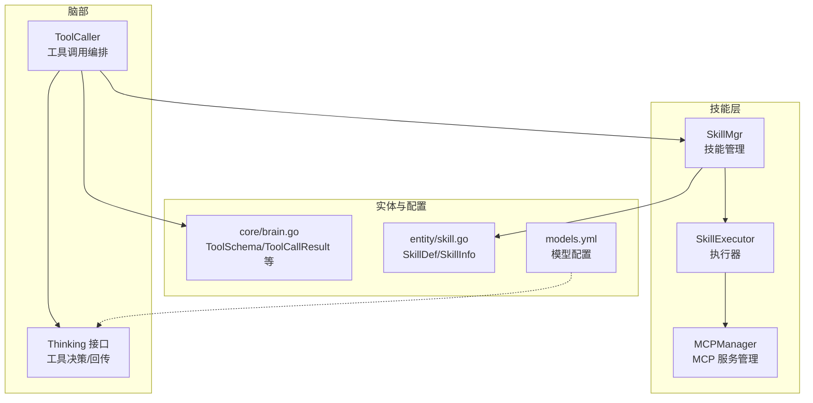
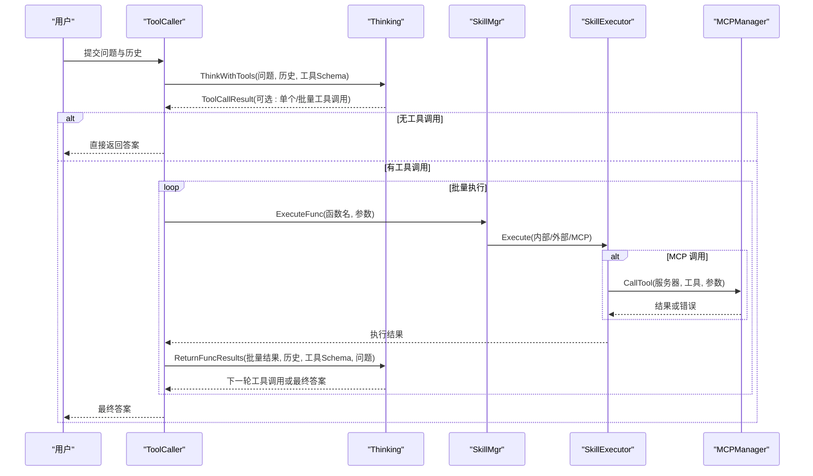
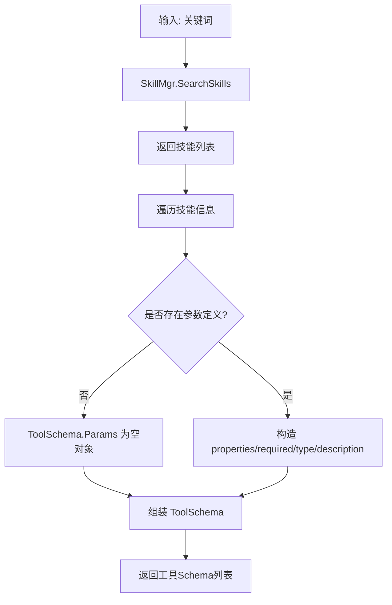
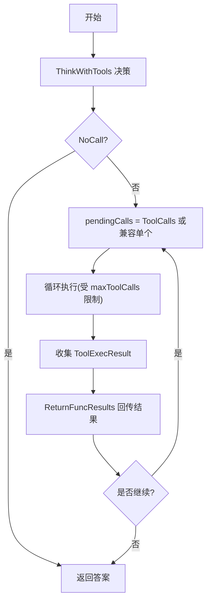
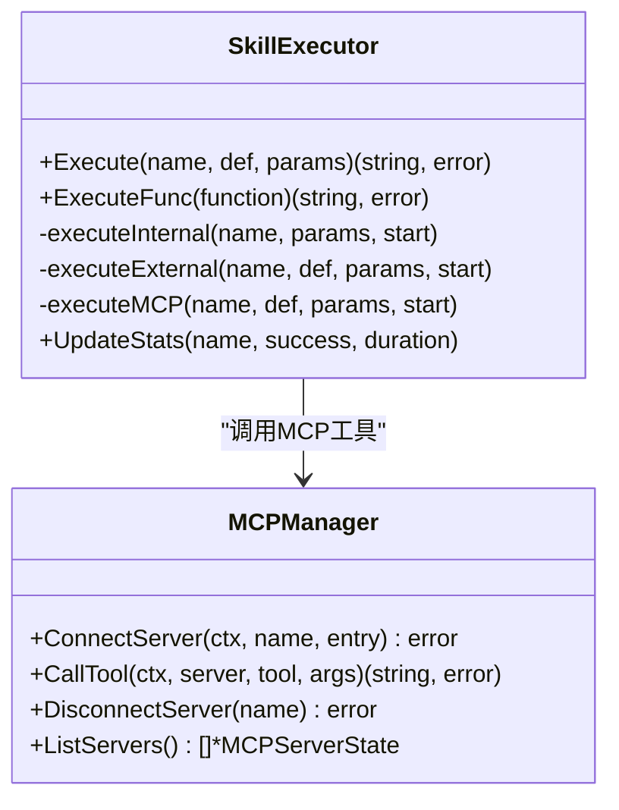
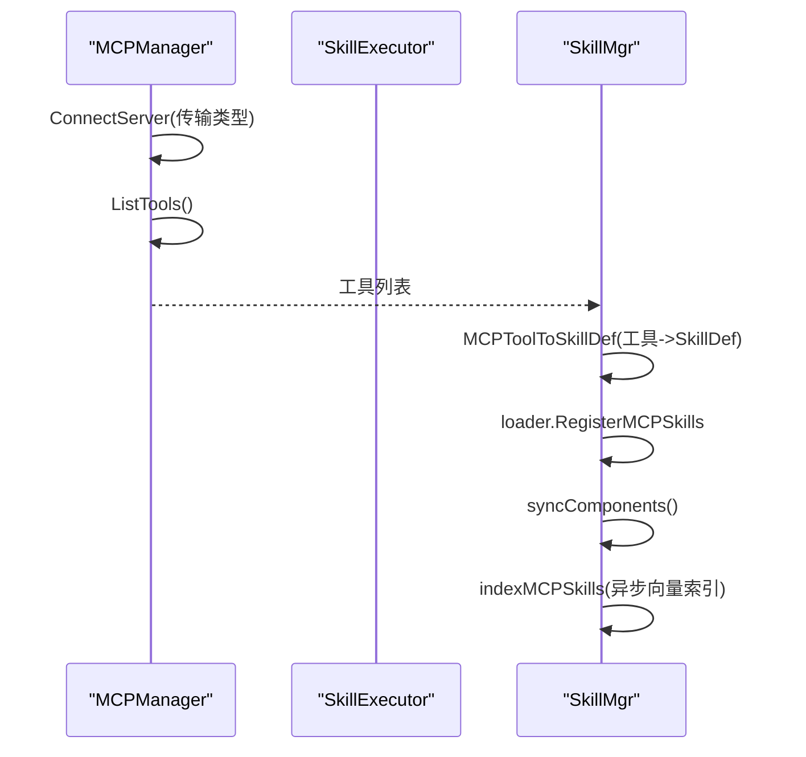
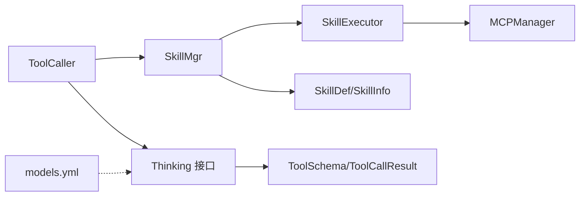

# 工具调用机制

<cite>
**本文引用的文件**
- [internal/usecase/brain/tool_caller.go](file://internal/usecase/brain/tool_caller.go)
- [internal/core/brain.go](file://internal/core/brain.go)
- [internal/usecase/skills/skill_mgr.go](file://internal/usecase/skills/skill_mgr.go)
- [internal/usecase/skills/executor.go](file://internal/usecase/skills/executor.go)
- [internal/usecase/skills/mcp_manager.go](file://internal/usecase/skills/mcp_manager.go)
- [internal/usecase/skills/mcp_utils.go](file://internal/usecase/skills/mcp_utils.go)
- [internal/entity/skill.go](file://internal/entity/skill.go)
- [internal/entity/tool.go](file://internal/entity/tool.go)
- [internal/usecase/skills/builtins/registry.go](file://internal/usecase/skills/builtins/registry.go)
- [internal/usecase/brain/tool_call_test.go](file://internal/usecase/brain/tool_call_test.go)
- [internal/usecase/brain/tool_execution_test.go](file://internal/usecase/brain/tool_execution_test.go)
- [config/models.yml](file://config/models.yml)
</cite>

## 目录
1. [简介](#简介)
2. [项目结构](#项目结构)
3. [核心组件](#核心组件)
4. [架构总览](#架构总览)
5. [详细组件分析](#详细组件分析)
6. [依赖关系分析](#依赖关系分析)
7. [性能考量](#性能考量)
8. [故障排除指南](#故障排除指南)
9. [结论](#结论)
10. [附录](#附录)

## 简介
本文件系统性阐述 MindX 的工具调用机制，覆盖从工具发现、Schema 生成、调用执行到结果处理的完整流程；解释参数传递、结果格式化与错误处理；对比批量与单个工具调用的差异与适用场景；总结安全机制、权限控制与超时管理；并提供扩展指南与排障方法，帮助开发者高效集成与维护工具链。

## 项目结构
工具调用相关代码主要分布在以下模块：
- 脑部决策与工具调用编排：internal/usecase/brain/tool_caller.go
- 核心数据结构与接口：internal/core/brain.go
- 技能管理与执行：internal/usecase/skills/skill_mgr.go、internal/usecase/skills/executor.go
- MCP 工具桥接：internal/usecase/skills/mcp_manager.go、internal/usecase/skills/mcp_utils.go
- 技能元数据与实体：internal/entity/skill.go、internal/entity/tool.go
- 内置技能注册：internal/usecase/skills/builtins/registry.go
- 测试样例：internal/usecase/brain/tool_call_test.go、internal/usecase/brain/tool_execution_test.go
- 模型配置：config/models.yml

**图表来源**
- [internal/usecase/brain/tool_caller.go](file://internal/usecase/brain/tool_caller.go#L1-L209)
- [internal/core/brain.go](file://internal/core/brain.go#L1-L205)
- [internal/usecase/skills/skill_mgr.go](file://internal/usecase/skills/skill_mgr.go#L1-L558)
- [internal/usecase/skills/executor.go](file://internal/usecase/skills/executor.go#L1-L402)
- [internal/usecase/skills/mcp_manager.go](file://internal/usecase/skills/mcp_manager.go#L1-L292)
- [internal/entity/skill.go](file://internal/entity/skill.go#L1-L83)
- [config/models.yml](file://config/models.yml#L1-L92)

**章节来源**
- [internal/usecase/brain/tool_caller.go](file://internal/usecase/brain/tool_caller.go#L1-L209)
- [internal/core/brain.go](file://internal/core/brain.go#L1-L205)
- [internal/usecase/skills/skill_mgr.go](file://internal/usecase/skills/skill_mgr.go#L1-L558)
- [internal/usecase/skills/executor.go](file://internal/usecase/skills/executor.go#L1-L402)
- [internal/usecase/skills/mcp_manager.go](file://internal/usecase/skills/mcp_manager.go#L1-L292)
- [internal/entity/skill.go](file://internal/entity/skill.go#L1-L83)
- [config/models.yml](file://config/models.yml#L1-L92)

## 核心组件
- ToolCaller：负责工具发现、Schema 生成、批量/单次工具调用、结果回传与最终答案产出。
- SkillMgr：统一管理技能加载、索引、转换、安装、MCP 服务器初始化与工具注册。
- SkillExecutor：执行内部技能、外部脚本与 MCP 工具，内置超时与统计。
- MCPManager：连接/断开 MCP 服务器，列举工具，调用工具并处理错误。
- 核心数据结构：ToolSchema、ToolCallResult、ToolExecResult、ToolCallFunction 等。

**章节来源**
- [internal/usecase/brain/tool_caller.go](file://internal/usecase/brain/tool_caller.go#L13-L25)
- [internal/usecase/skills/skill_mgr.go](file://internal/usecase/skills/skill_mgr.go#L20-L34)
- [internal/usecase/skills/executor.go](file://internal/usecase/skills/executor.go#L19-L42)
- [internal/usecase/skills/mcp_manager.go](file://internal/usecase/skills/mcp_manager.go#L36-L47)
- [internal/core/brain.go](file://internal/core/brain.go#L107-L114)

## 架构总览
工具调用的端到端流程如下：

**图表来源**
- [internal/usecase/brain/tool_caller.go](file://internal/usecase/brain/tool_caller.go#L27-L139)
- [internal/core/brain.go](file://internal/core/brain.go#L72-L87)
- [internal/usecase/skills/skill_mgr.go](file://internal/usecase/skills/skill_mgr.go#L213-L226)
- [internal/usecase/skills/executor.go](file://internal/usecase/skills/executor.go#L197-L216)
- [internal/usecase/skills/mcp_manager.go](file://internal/usecase/skills/mcp_manager.go#L169-L204)

## 详细组件分析

### 工具发现与 Schema 生成
- 工具发现：ToolCaller.SearchTools 根据关键词检索技能，SkillMgr.SearchSkills 调用搜索器返回技能列表。
- Schema 生成：遍历技能信息，基于 SkillDef.Parameters 构造 JSON Schema 的 properties/required/type/description 字段，拼装 ToolSchema（含输出格式与引导信息），并记录调试日志。

**图表来源**
- [internal/usecase/brain/tool_caller.go](file://internal/usecase/brain/tool_caller.go#L141-L208)
- [internal/usecase/skills/skill_mgr.go](file://internal/usecase/skills/skill_mgr.go#L228-L230)
- [internal/entity/skill.go](file://internal/entity/skill.go#L44-L49)

**章节来源**
- [internal/usecase/brain/tool_caller.go](file://internal/usecase/brain/tool_caller.go#L141-L208)
- [internal/usecase/skills/skill_mgr.go](file://internal/usecase/skills/skill_mgr.go#L228-L230)
- [internal/entity/skill.go](file://internal/entity/skill.go#L44-L49)

### 工具调用执行（单个/批量）
- 单个工具调用：ToolCaller.ExecuteToolCall 首次通过 Thinking.ThinkWithTools 决策，若返回单个 Function 则兼容处理为 ToolCallItem 列表。
- 批量工具调用：循环遍历 pendingCalls，逐个调用 SkillMgr.ExecuteFunc -> SkillExecutor.Execute，收集 ToolExecResult，然后通过 Thinking.ReturnFuncResults 将结果回传给模型，决定是否继续新一轮调用。
- 最大调用次数：内置 maxToolCalls 限制，防止无限循环。

**图表来源**
- [internal/usecase/brain/tool_caller.go](file://internal/usecase/brain/tool_caller.go#L27-L139)
- [internal/core/brain.go](file://internal/core/brain.go#L72-L87)

**章节来源**
- [internal/usecase/brain/tool_caller.go](file://internal/usecase/brain/tool_caller.go#L27-L139)
- [internal/core/brain.go](file://internal/core/brain.go#L42-L63)

### 执行器与多类型工具
- 内部技能：SkillExecutor.RegisterInternalSkill 注册，直接调用函数。
- 外部脚本：SkillExecutor.executeExternal 构建命令、注入环境变量、通过 stdin 传递参数、超时控制、错误解析与统计。
- MCP 工具：SkillExecutor.executeMCP 通过 MCPManager.CallTool 调用远端工具，支持 stdio 与 SSE 两种传输，内置超时与错误处理。

**图表来源**
- [internal/usecase/skills/executor.go](file://internal/usecase/skills/executor.go#L57-L195)
- [internal/usecase/skills/mcp_manager.go](file://internal/usecase/skills/mcp_manager.go#L169-L204)

**章节来源**
- [internal/usecase/skills/executor.go](file://internal/usecase/skills/executor.go#L57-L195)
- [internal/usecase/skills/mcp_manager.go](file://internal/usecase/skills/mcp_manager.go#L169-L204)

### MCP 工具桥接与元数据
- MCP 工具发现：MCPManager.ConnectServer 建立连接后调用 ListTools 获取工具清单，记录工具名与描述。
- 元数据映射：mcp_utils.MCPToolToSkillDef 将 MCP Tool 转换为 SkillDef，提取 InputSchema 为参数定义，写入 metadata.mcp 保存 server 与 tool 名称。
- 运行时注册：SkillMgr.connectAndRegisterMCP 将发现的工具注册为本地技能，同步组件并异步建立向量索引。

**图表来源**
- [internal/usecase/skills/mcp_manager.go](file://internal/usecase/skills/mcp_manager.go#L49-L141)
- [internal/usecase/skills/mcp_utils.go](file://internal/usecase/skills/mcp_utils.go#L56-L97)
- [internal/usecase/skills/skill_mgr.go](file://internal/usecase/skills/skill_mgr.go#L470-L506)

**章节来源**
- [internal/usecase/skills/mcp_manager.go](file://internal/usecase/skills/mcp_manager.go#L49-L141)
- [internal/usecase/skills/mcp_utils.go](file://internal/usecase/skills/mcp_utils.go#L56-L97)
- [internal/usecase/skills/skill_mgr.go](file://internal/usecase/skills/skill_mgr.go#L470-L506)

### 参数传递、结果格式化与错误处理
- 参数传递：ToolCallFunction.Arguments 以 map[string]interface{} 形式传入，SkillExecutor.ExecuteFunc 复制到内部 params；外部脚本通过 stdin 传递 JSON 参数。
- 结果格式化：ToolExecResult 包含 ToolCallID、FunctionName、Arguments、Result、Error；MCP 返回内容经 extractTextContent 拼接为字符串。
- 错误处理：执行器捕获错误并记录；MCP 调用失败更新状态；ToolCaller 对错误结果构造统一的 ToolExecResult；测试用例验证 Ollama 工具调用与回传流程。

**章节来源**
- [internal/core/brain.go](file://internal/core/brain.go#L56-L63)
- [internal/usecase/skills/executor.go](file://internal/usecase/skills/executor.go#L179-L194)
- [internal/usecase/skills/mcp_manager.go](file://internal/usecase/skills/mcp_manager.go#L169-L204)
- [internal/usecase/brain/tool_call_test.go](file://internal/usecase/brain/tool_call_test.go#L14-L120)

### 批量工具调用 vs 单个工具调用
- 单个工具调用：适用于简单任务，模型一次决策即可完成；ToolCaller 兼容旧格式 FunctionCall。
- 批量工具调用：适用于复杂任务，模型可能多次要求调用不同工具；ToolCaller 通过 ReturnFuncResults 接收批量结果并驱动下一轮调用。
- 场景选择：当任务涉及多步骤推理或跨域工具协作时，优先使用批量调用；简单任务使用单个调用更高效。

**章节来源**
- [internal/usecase/brain/tool_caller.go](file://internal/usecase/brain/tool_caller.go#L58-L132)
- [internal/usecase/brain/tool_execution_test.go](file://internal/usecase/brain/tool_execution_test.go#L314-L340)

### 安全机制、权限控制与超时管理
- 超时管理：外部脚本与 MCP 调用均使用 context.WithTimeout 控制生命周期，默认 30 秒，可按技能定义覆盖；MCP 连接根据传输类型设置不同超时。
- 权限控制：MCPManager 支持 stdio 与 SSE 两种传输；SSE 可注入自定义 headers；环境变量继承与覆盖策略确保最小暴露面。
- 安全建议（来自评估报告）：参数验证（必填/类型）、命令注入防护（exec.Command 参数化、stdin 传参）、敏感信息保护（避免日志泄露、支持环境变量注入）。

**章节来源**
- [internal/usecase/skills/executor.go](file://internal/usecase/skills/executor.go#L117-L153)
- [internal/usecase/skills/mcp_manager.go](file://internal/usecase/skills/mcp_manager.go#L73-L104)
- [internal/usecase/skills/mcp_manager.go](file://internal/usecase/skills/mcp_manager.go#L280-L291)
- [internal/usecase/skills/skill_mgr.go](file://internal/usecase/skills/skill_mgr.go#L395-L402)

## 依赖关系分析

**图表来源**
- [internal/usecase/brain/tool_caller.go](file://internal/usecase/brain/tool_caller.go#L1-L209)
- [internal/core/brain.go](file://internal/core/brain.go#L1-L205)
- [internal/usecase/skills/skill_mgr.go](file://internal/usecase/skills/skill_mgr.go#L1-L558)
- [internal/usecase/skills/executor.go](file://internal/usecase/skills/executor.go#L1-L402)
- [internal/usecase/skills/mcp_manager.go](file://internal/usecase/skills/mcp_manager.go#L1-L292)
- [internal/entity/skill.go](file://internal/entity/skill.go#L1-L83)
- [config/models.yml](file://config/models.yml#L1-L92)

**章节来源**
- [internal/usecase/brain/tool_caller.go](file://internal/usecase/brain/tool_caller.go#L1-L209)
- [internal/core/brain.go](file://internal/core/brain.go#L1-L205)
- [internal/usecase/skills/skill_mgr.go](file://internal/usecase/skills/skill_mgr.go#L1-L558)
- [internal/usecase/skills/executor.go](file://internal/usecase/skills/executor.go#L1-L402)
- [internal/usecase/skills/mcp_manager.go](file://internal/usecase/skills/mcp_manager.go#L1-L292)
- [internal/entity/skill.go](file://internal/entity/skill.go#L1-L83)
- [config/models.yml](file://config/models.yml#L1-L92)

## 性能考量
- 批量执行：ToolCaller 以批处理方式执行多个工具调用，减少模型往返次数，提高吞吐。
- 统计与缓存：SkillExecutor.UpdateStats 记录成功率、错误率与平均耗时；支持从 Store 持久化与加载统计，辅助性能监控。
- 异步索引：MCP 工具注册后异步建立向量索引，避免阻塞连接流程。
- 超时控制：外部脚本与 MCP 调用均设置超时，防止资源泄漏与雪崩效应。

**章节来源**
- [internal/usecase/brain/tool_caller.go](file://internal/usecase/brain/tool_caller.go#L74-L108)
- [internal/usecase/skills/executor.go](file://internal/usecase/skills/executor.go#L266-L300)
- [internal/usecase/skills/skill_mgr.go](file://internal/usecase/skills/skill_mgr.go#L243-L260)

## 故障排除指南
- 工具未发现：确认 SkillMgr 已加载技能并同步组件；检查关键词是否命中；查看 MCP 工具发现日志。
- 调用失败：检查 ToolExecResult.Error 字段；区分执行器错误与模型回传错误；关注超时与权限问题。
- MCP 连接异常：确认传输类型与配置；SSE 需正确注入 headers；stdio 需确保命令与工作目录正确；观察重试逻辑与不可重试错误类型。
- 参数错误：核对 ToolSchema.Params 与调用参数类型/必填项；必要时在前端进行校验。
- 性能问题：查看统计指标与平均耗时；考虑减少批量规模或优化工具实现。

**章节来源**
- [internal/usecase/skills/mcp_manager.go](file://internal/usecase/skills/mcp_manager.go#L49-L141)
- [internal/usecase/skills/executor.go](file://internal/usecase/skills/executor.go#L117-L135)
- [internal/usecase/skills/skill_mgr.go](file://internal/usecase/skills/skill_mgr.go#L404-L468)

## 结论
MindX 的工具调用机制通过 ToolCaller 编排、SkillMgr 管理与 SkillExecutor 执行三者协同，实现了从工具发现、Schema 生成到批量/单次调用、结果回传与最终答案产出的闭环。系统在超时控制、错误处理与性能统计方面具备完备能力，并通过 MCP 桥接实现对远端工具生态的无缝接入。开发者可据此扩展内置技能、接入第三方 MCP 服务或优化现有工具实现。

## 附录

### 扩展指南
- 新增内置技能：通过 builtins/registry.RegisterBuiltins 注册，SkillExecutor.RegisterInternalSkill 注册函数实现。
- 新增外部脚本技能：在技能目录编写脚本与 SKILL.md，定义 Command、Parameters、Timeout 等；系统自动加载与索引。
- 新增 MCP 工具：在配置中添加 MCP 服务器条目，SkillMgr.InitMCPServers 自动连接并注册；工具描述与标签可从目录覆盖。
- 自定义系统提示：通过 Thinking.GetSystemPrompt 与 ToolCaller.ExecuteToolCall 的 customSystemPrompt 参数定制提示词。

**章节来源**
- [internal/usecase/skills/builtins/registry.go](file://internal/usecase/skills/builtins/registry.go#L15-L29)
- [internal/usecase/skills/skill_mgr.go](file://internal/usecase/skills/skill_mgr.go#L373-L393)
- [internal/usecase/brain/tool_caller.go](file://internal/usecase/brain/tool_caller.go#L33-L34)

### 最佳实践
- 明确工具职责边界，保持单一功能原则，便于批量组合与复用。
- 为工具提供清晰的参数 Schema 与输出格式，提升模型调用稳定性。
- 使用超时与重试策略应对不稳定外部服务；对敏感参数避免记录到日志。
- 通过向量索引与关键词增强工具检索准确性；定期重建索引以反映变更。

**章节来源**
- [internal/entity/skill.go](file://internal/entity/skill.go#L44-L49)
- [internal/usecase/skills/skill_mgr.go](file://internal/usecase/skills/skill_mgr.go#L232-L241)
- [internal/usecase/skills/executor.go](file://internal/usecase/skills/executor.go#L117-L153)