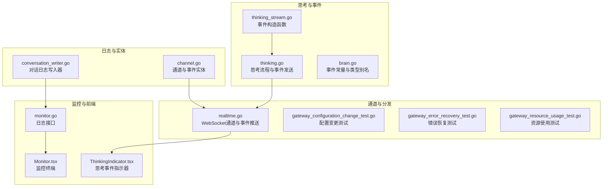
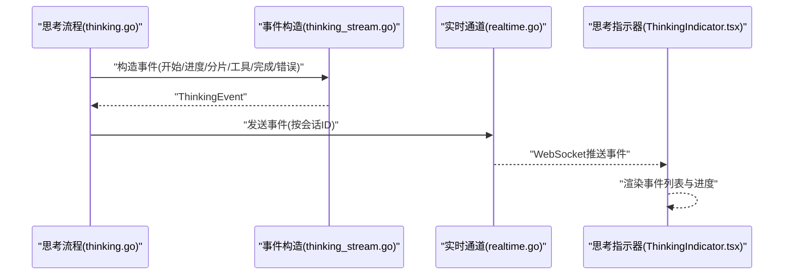
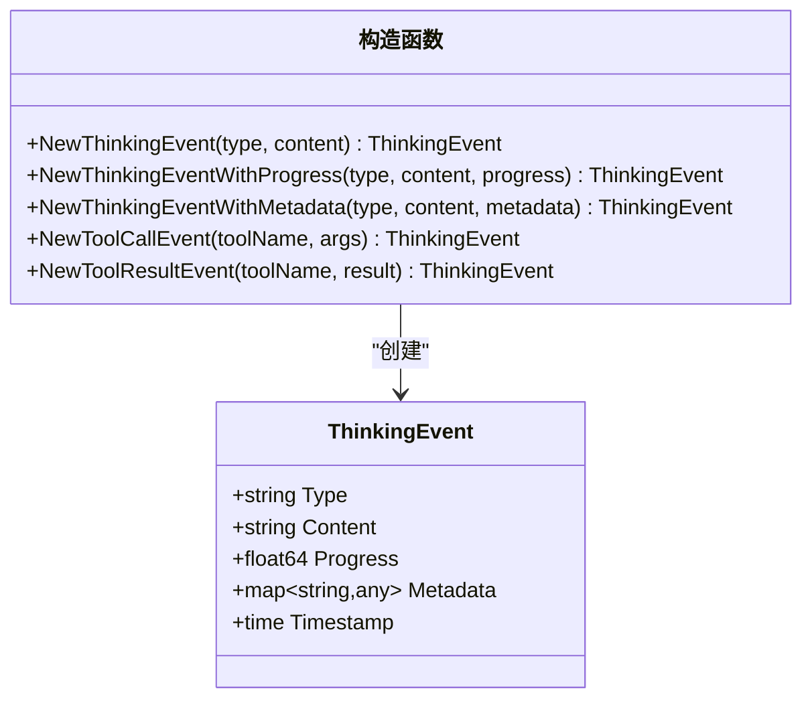
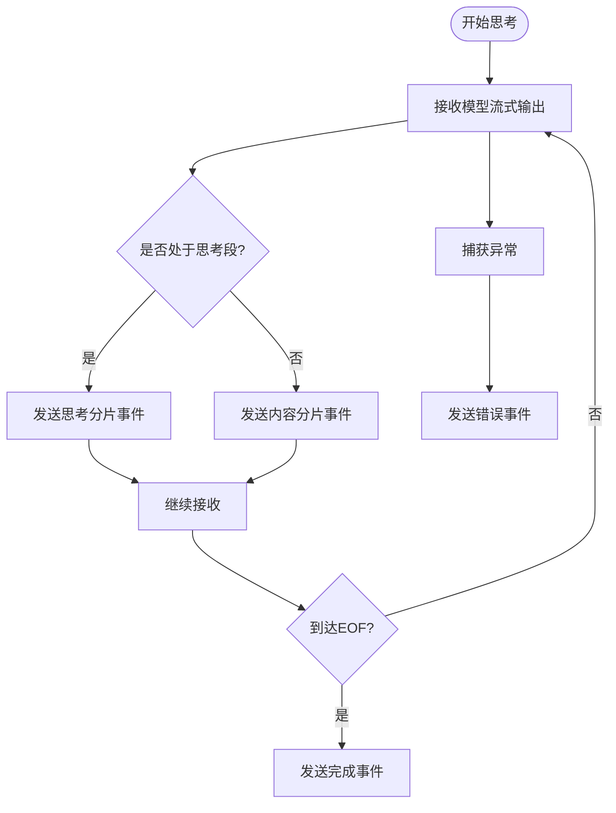
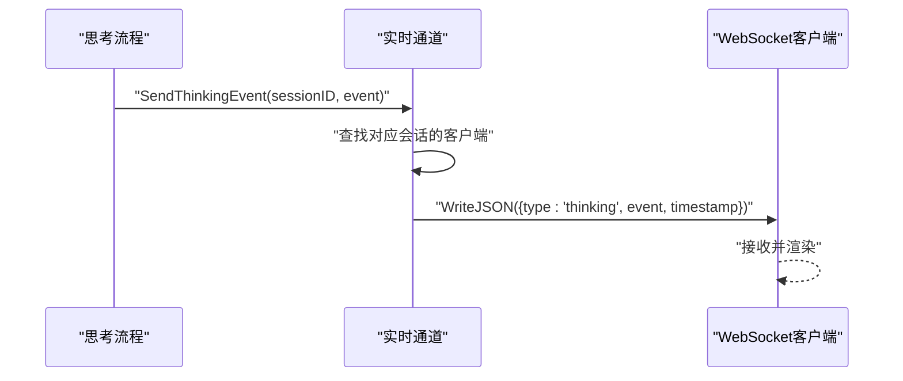
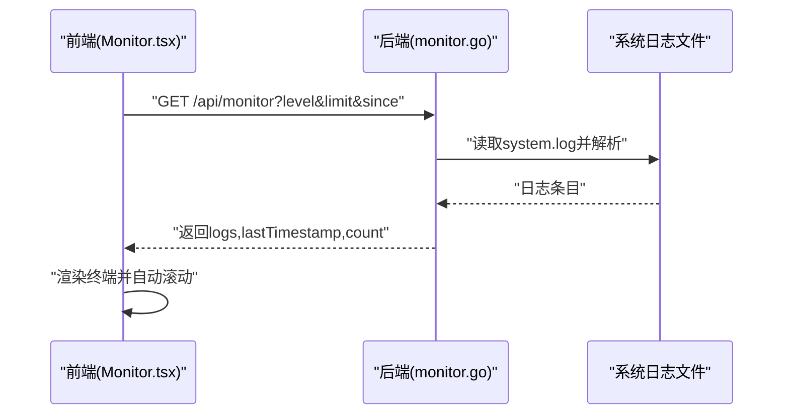
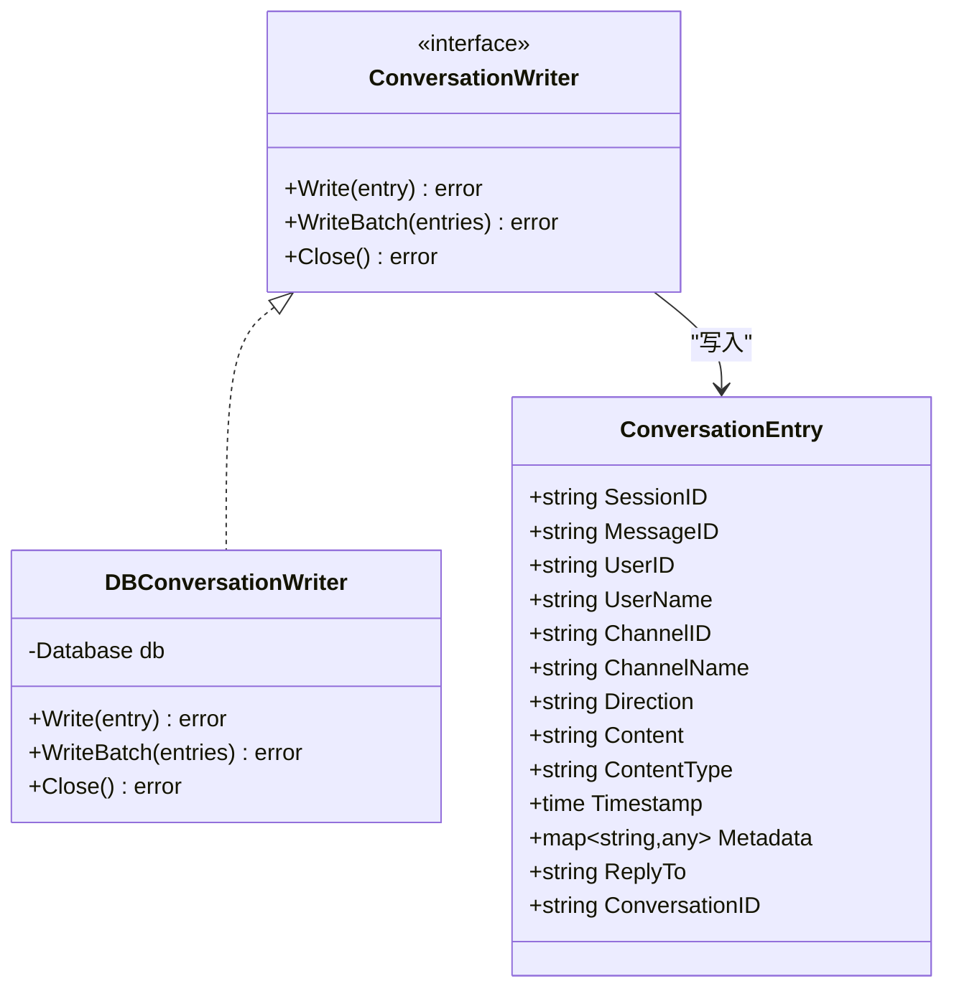
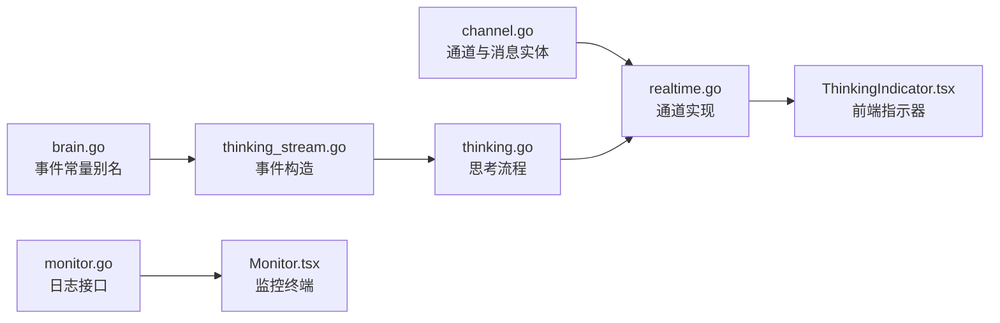

# 思考事件流

<cite>
**本文引用的文件**
- [thinking_stream.go](file://internal/usecase/brain/thinking_stream.go)
- [thinking.go](file://internal/usecase/brain/thinking.go)
- [brain.go](file://internal/core/brain.go)
- [realtime.go](file://internal/adapters/channels/realtime.go)
- [gateway_configuration_change_test.go](file://internal/adapters/channels/gateway_configuration_change_test.go)
- [gateway_error_recovery_test.go](file://internal/adapters/channels/gateway_error_recovery_test.go)
- [gateway_resource_usage_test.go](file://internal/adapters/channels/gateway_resource_usage_test.go)
- [ThinkingIndicator.tsx](file://dashboard/src/components/ThinkingIndicator.tsx)
- [monitor.go](file://internal/adapters/http/handlers/monitor.go)
- [Monitor.tsx](file://dashboard/src/components/Monitor.tsx)
- [conversation_writer.go](file://pkg/logging/conversation_writer.go)
- [channel.go](file://internal/entity/channel.go)
</cite>

## 目录
1. [简介](#简介)
2. [项目结构](#项目结构)
3. [核心组件](#核心组件)
4. [架构总览](#架构总览)
5. [详细组件分析](#详细组件分析)
6. [依赖关系分析](#依赖关系分析)
7. [性能考量](#性能考量)
8. [故障排查指南](#故障排查指南)
9. [结论](#结论)
10. [附录](#附录)

## 简介
本文件面向“思考事件流”系统，系统通过事件驱动的方式在思考过程中实时推送各类事件（开始、进度、分片、工具调用、工具结果、完成、错误），并提供前端可视化与后端监控能力。本文档覆盖事件类型定义、事件通道与事件处理流程、实时推送机制、性能优化与错误恢复策略，并给出扩展与定制建议。

## 项目结构
围绕思考事件流的关键目录与文件：
- usecase/brain：思考逻辑与事件构造
- adapters/channels：实时通道（WebSocket）与事件分发
- adapters/http/handlers：监控接口（日志拉取与清理）
- dashboard/src/components：前端事件指示器与监控终端
- pkg/logging：对话日志写入适配器
- internal/entity：通道与事件的基础实体定义

**图表来源**
- [thinking_stream.go](file://internal/usecase/brain/thinking_stream.go#L1-L73)
- [thinking.go](file://internal/usecase/brain/thinking.go#L1-L898)
- [brain.go](file://internal/core/brain.go#L1-L25)
- [realtime.go](file://internal/adapters/channels/realtime.go#L1-L567)
- [monitor.go](file://internal/adapters/http/handlers/monitor.go#L1-L188)
- [Monitor.tsx](file://dashboard/src/components/Monitor.tsx#L1-L279)
- [ThinkingIndicator.tsx](file://dashboard/src/components/ThinkingIndicator.tsx#L1-L132)
- [conversation_writer.go](file://pkg/logging/conversation_writer.go#L1-L105)
- [channel.go](file://internal/entity/channel.go#L1-L203)

**章节来源**
- [thinking_stream.go](file://internal/usecase/brain/thinking_stream.go#L1-L73)
- [thinking.go](file://internal/usecase/brain/thinking.go#L1-L898)
- [brain.go](file://internal/core/brain.go#L1-L25)
- [realtime.go](file://internal/adapters/channels/realtime.go#L1-L567)
- [monitor.go](file://internal/adapters/http/handlers/monitor.go#L1-L188)
- [Monitor.tsx](file://dashboard/src/components/Monitor.tsx#L1-L279)
- [ThinkingIndicator.tsx](file://dashboard/src/components/ThinkingIndicator.tsx#L1-L132)
- [conversation_writer.go](file://pkg/logging/conversation_writer.go#L1-L105)
- [channel.go](file://internal/entity/channel.go#L1-L203)

## 核心组件
- 事件类型与构造
  - 事件类型常量：开始、进度、分片、工具调用、工具结果、完成、错误
  - 事件构造函数：支持普通事件、带进度事件、带元数据事件、工具调用事件、工具结果事件
- 思考流程与事件发送
  - 左脑思考：流式接收模型输出，拆分“思考”与“内容”，分别发送分片事件
  - 右脑工具：解析工具调用，发送工具调用事件；回传工具结果后发送工具结果事件
  - 完成与错误：发送完成事件与错误事件
- 通道与实时推送
  - WebSocket 实时通道，按会话ID分发思考事件
  - 事件封装统一为“thinking”类型消息
- 前端可视化
  - 思考事件指示器：展示事件类型、内容、工具名、进度、结果
  - 监控终端：拉取系统日志，支持增量轮询、过滤与清空

**章节来源**
- [thinking_stream.go](file://internal/usecase/brain/thinking_stream.go#L10-L72)
- [thinking.go](file://internal/usecase/brain/thinking.go#L69-L329)
- [realtime.go](file://internal/adapters/channels/realtime.go#L170-L200)
- [ThinkingIndicator.tsx](file://dashboard/src/components/ThinkingIndicator.tsx#L5-L15)

## 架构总览
思考事件流从“思考流程”产生事件，经“通道层”推送到“前端指示器”，同时“监控接口”提供系统日志的拉取与轮询能力。

**图表来源**
- [thinking.go](file://internal/usecase/brain/thinking.go#L188-L329)
- [thinking_stream.go](file://internal/usecase/brain/thinking_stream.go#L24-L72)
- [realtime.go](file://internal/adapters/channels/realtime.go#L170-L200)
- [ThinkingIndicator.tsx](file://dashboard/src/components/ThinkingIndicator.tsx#L22-L111)

## 详细组件分析

### 事件类型与构造
- 事件类型
  - 开始：表示思考开始
  - 进度：带百分比进度的事件
  - 分片：模型输出的增量片段
  - 工具调用：触发工具调用事件
  - 工具结果：工具执行后的结果事件
  - 完成：思考完成
  - 错误：发生错误
- 事件构造
  - 普通事件：设置类型与内容，附带时间戳
  - 带进度事件：设置进度值
  - 带元数据事件：附加工具名、参数、结果等
  - 工具调用/结果事件：自动填充元数据

**图表来源**
- [thinking_stream.go](file://internal/usecase/brain/thinking_stream.go#L24-L72)

**章节来源**
- [thinking_stream.go](file://internal/usecase/brain/thinking_stream.go#L10-L72)
- [brain.go](file://internal/core/brain.go#L8-L18)

### 思考流程与事件发送
- 左脑思考
  - 流式接收模型输出，识别“思考”与“内容”两段，分别发送分片事件
  - 完成后发送完成事件
- 右脑工具
  - 解析工具调用，发送工具调用事件
  - 回传工具结果后发送工具结果事件
- 错误处理
  - 任何异常均发送错误事件并包装为业务错误

**图表来源**
- [thinking.go](file://internal/usecase/brain/thinking.go#L188-L329)

**章节来源**
- [thinking.go](file://internal/usecase/brain/thinking.go#L121-L329)

### 通道与事件分发
- 实时通道
  - 基于 WebSocket，按会话ID匹配客户端并推送事件
  - 事件统一封装为“thinking”类型消息，包含事件内容与时间戳
- 通道状态与健康检查
  - 提供运行状态、消息计数、启动/最后消息时间、健康检查等信息

**图表来源**
- [realtime.go](file://internal/adapters/channels/realtime.go#L170-L200)

**章节来源**
- [realtime.go](file://internal/adapters/channels/realtime.go#L18-L78)
- [realtime.go](file://internal/adapters/channels/realtime.go#L270-L324)

### 前端事件指示器与监控
- 思考事件指示器
  - 展示最新事件类型、内容、工具名、进度条、结果摘要
  - 支持展开/收起与自动滚动
- 监控终端
  - 拉取系统日志，支持按级别过滤、增量轮询、清空日志
  - 前端定时轮询，避免阻塞主线程

**图表来源**
- [Monitor.tsx](file://dashboard/src/components/Monitor.tsx#L34-L98)
- [monitor.go](file://internal/adapters/http/handlers/monitor.go#L48-L159)

**章节来源**
- [ThinkingIndicator.tsx](file://dashboard/src/components/ThinkingIndicator.tsx#L22-L111)
- [Monitor.tsx](file://dashboard/src/components/Monitor.tsx#L21-L151)
- [monitor.go](file://internal/adapters/http/handlers/monitor.go#L1-L188)

### 日志写入与对话持久化
- 对话日志写入器
  - 将 JSON 日志条目写入数据库或实现自定义存储
  - 提供批量写入与关闭接口
- 适配 Zap 写入器
  - 将结构化日志转换为对话条目并写入

**图表来源**
- [conversation_writer.go](file://pkg/logging/conversation_writer.go#L11-L75)

**章节来源**
- [conversation_writer.go](file://pkg/logging/conversation_writer.go#L1-L105)

## 依赖关系分析
- 事件类型与常量
  - 核心事件常量与类型别名在 core 包中导出，brain.usecase 与 entity 共享
- 通道与实体
  - channel.go 定义了通道类型、消息结构与状态，为通道层提供契约
- 测试验证
  - 配置变更、错误恢复、资源使用等测试覆盖通道稳定性与性能

**图表来源**
- [channel.go](file://internal/entity/channel.go#L1-L203)
- [brain.go](file://internal/core/brain.go#L8-L18)
- [thinking_stream.go](file://internal/usecase/brain/thinking_stream.go#L10-L22)
- [thinking.go](file://internal/usecase/brain/thinking.go#L21-L67)
- [realtime.go](file://internal/adapters/channels/realtime.go#L18-L78)
- [ThinkingIndicator.tsx](file://dashboard/src/components/ThinkingIndicator.tsx#L22-L33)
- [monitor.go](file://internal/adapters/http/handlers/monitor.go#L16-L46)
- [Monitor.tsx](file://dashboard/src/components/Monitor.tsx#L21-L37)

**章节来源**
- [channel.go](file://internal/entity/channel.go#L1-L203)
- [brain.go](file://internal/core/brain.go#L1-L25)
- [gateway_configuration_change_test.go](file://internal/adapters/channels/gateway_configuration_change_test.go#L1-L300)
- [gateway_error_recovery_test.go](file://internal/adapters/channels/gateway_error_recovery_test.go#L1-L92)
- [gateway_resource_usage_test.go](file://internal/adapters/channels/gateway_resource_usage_test.go#L244-L286)

## 性能考量
- 事件通道
  - 采用非阻塞发送：在事件通道满时丢弃，避免阻塞思考主流程
  - WebSocket 连接上限与心跳控制，防止资源耗尽
- 思考流程
  - 流式接收模型输出，边生成边推送，降低首帧延迟
  - 动态令牌预算与历史轮次计算，控制上下文长度
- 前端
  - 监控终端仅保留最近 N 条日志，避免内存膨胀
  - 增量轮询与自动滚动优化用户体验
- 测试验证
  - 资源使用测试表明在高吞吐下内存增长可控
  - 错误恢复测试验证系统在持续错误后仍可恢复

**章节来源**
- [thinking.go](file://internal/usecase/brain/thinking.go#L69-L76)
- [realtime.go](file://internal/adapters/channels/realtime.go#L44-L49)
- [Monitor.tsx](file://dashboard/src/components/Monitor.tsx#L146-L151)
- [gateway_resource_usage_test.go](file://internal/adapters/channels/gateway_resource_usage_test.go#L244-L286)
- [gateway_error_recovery_test.go](file://internal/adapters/channels/gateway_error_recovery_test.go#L51-L92)

## 故障排查指南
- 事件未推送
  - 检查通道是否运行、会话ID是否匹配
  - 查看通道日志与错误码
- 前端无事件显示
  - 确认 WebSocket 连接状态与事件类型
  - 检查前端事件过滤条件
- 日志缺失
  - 使用监控终端确认日志文件路径与权限
  - 使用“清空日志”重置文件
- 错误事件
  - 在思考流程中查看错误事件内容与堆栈
  - 结合监控终端定位具体错误位置

**章节来源**
- [realtime.go](file://internal/adapters/channels/realtime.go#L170-L200)
- [Monitor.tsx](file://dashboard/src/components/Monitor.tsx#L74-L98)
- [monitor.go](file://internal/adapters/http/handlers/monitor.go#L74-L98)
- [thinking.go](file://internal/usecase/brain/thinking.go#L194-L219)

## 结论
思考事件流通过清晰的事件类型、可靠的通道推送与前端可视化，实现了思考过程的可观测与可调试。结合监控接口与测试验证，系统具备良好的性能与稳定性。开发者可在此基础上扩展新的事件类型、定制事件处理逻辑与前端展示方式。

## 附录

### 事件流订阅、发布与处理模式
- 订阅
  - 前端通过 WebSocket 订阅“thinking”事件，按会话ID接收
- 发布
  - 思考流程在关键节点构造事件并通过通道发布
- 处理
  - 前端渲染事件列表、进度与工具信息；后端监控终端拉取系统日志

**章节来源**
- [ThinkingIndicator.tsx](file://dashboard/src/components/ThinkingIndicator.tsx#L22-L111)
- [realtime.go](file://internal/adapters/channels/realtime.go#L170-L200)
- [thinking.go](file://internal/usecase/brain/thinking.go#L188-L329)
- [Monitor.tsx](file://dashboard/src/components/Monitor.tsx#L34-L98)

### 扩展与定制建议
- 新增事件类型
  - 在事件构造处新增常量与构造函数
  - 在思考流程中按场景发送新事件
- 自定义通道
  - 实现新的通道适配器，遵循通道契约
  - 在网关中注册并启用
- 前端展示
  - 在指示器组件中增加事件类型的图标与样式
  - 增加事件过滤与搜索功能

**章节来源**
- [thinking_stream.go](file://internal/usecase/brain/thinking_stream.go#L10-L72)
- [channel.go](file://internal/entity/channel.go#L1-L203)
- [ThinkingIndicator.tsx](file://dashboard/src/components/ThinkingIndicator.tsx#L114-L131)