# 核心大脑系统

<cite>
**本文引用的文件**
- [cmd/main.go](file://cmd/main.go)
- [internal/core/brain.go](file://internal/core/brain.go)
- [internal/usecase/brain/brain.go](file://internal/usecase/brain/brain.go)
- [internal/usecase/brain/thinking.go](file://internal/usecase/brain/thinking.go)
- [internal/usecase/brain/context_preparer.go](file://internal/usecase/brain/context_preparer.go)
- [internal/usecase/brain/tool_caller.go](file://internal/usecase/brain/tool_caller.go)
- [internal/usecase/brain/consciousness_manager.go](file://internal/usecase/brain/consciousness_manager.go)
- [internal/usecase/brain/response_builder.go](file://internal/usecase/brain/response_builder.go)
- [internal/core/memory.go](file://internal/core/memory.go)
- [internal/usecase/brain/token_budget.go](file://internal/usecase/brain/token_budget.go)
- [internal/usecase/brain/fallback_handler.go](file://internal/usecase/brain/fallback_handler.go)
- [config/models.yml](file://config/models.yml)
- [internal/adapters/channels/realtime.go](file://internal/adapters/channels/realtime.go)
- [dashboard/src/components/ThinkingIndicator.tsx](file://dashboard/src/components/ThinkingIndicator.tsx)
- [dashboard/src/components/MessageList.tsx](file://dashboard/src/components/MessageList.tsx)
- [dashboard/src/components/styles/ThinkingIndicator.css](file://dashboard/src/components/styles/ThinkingIndicator.css)
- [dashboard/src/components/styles/MessageList.css](file://dashboard/src/components/styles/MessageList.css)
</cite>

## 目录
1. [简介](#简介)
2. [项目结构](#项目结构)
3. [核心组件](#核心组件)
4. [架构总览](#架构总览)
5. [详细组件分析](#详细组件分析)
6. [依赖关系分析](#依赖关系分析)
7. [性能考量](#性能考量)
8. [故障排查指南](#故障排查指南)
9. [结论](#结论)
10. [附录](#附录)

## 简介
本文件面向开发者，系统化阐述 MindX 核心大脑系统的设计与实现，重点覆盖：
- 仿生大脑架构：潜意识层（左脑）、主意识层（右脑）与意识层（远程智能体/云模型）的职责划分与协作机制
- 思考流程：上下文准备、意图识别、工具调用、响应构建与兜底策略
- 实时监控：思考事件流的采集、传输与前端可视化
- 自适应与算力优化：基于 Token 预算的动态历史轮数控制与算力适配
- 扩展指南：如何新增能力、工具与模型，以及如何接入新的通道

## 项目结构
MindX 的大脑系统位于 internal/usecase/brain 目录，围绕“仿生大脑”抽象，通过左脑（本地小模型）、右脑（工具决策与调用）、意识（远程能力/双脑）三层协同，结合长时记忆、工具管理、响应构建与兜底策略，完成从“思考”到“行动”的闭环。

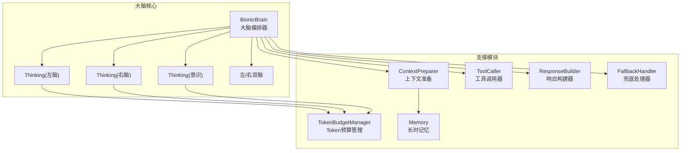

图表来源
- [internal/usecase/brain/brain.go](file://internal/usecase/brain/brain.go#L36-L131)
- [internal/usecase/brain/thinking.go](file://internal/usecase/brain/thinking.go#L21-L63)
- [internal/usecase/brain/context_preparer.go](file://internal/usecase/brain/context_preparer.go#L11-L23)
- [internal/usecase/brain/tool_caller.go](file://internal/usecase/brain/tool_caller.go#L15-L25)
- [internal/usecase/brain/response_builder.go](file://internal/usecase/brain/response_builder.go#L7-L11)
- [internal/usecase/brain/consciousness_manager.go](file://internal/usecase/brain/consciousness_manager.go#L13-L38)
- [internal/usecase/brain/token_budget.go](file://internal/usecase/brain/token_budget.go#L10-L42)
- [internal/core/memory.go](file://internal/core/memory.go#L24-L39)

章节来源
- [cmd/main.go](file://cmd/main.go#L18-L20)
- [internal/usecase/brain/brain.go](file://internal/usecase/brain/brain.go#L56-L131)

## 核心组件
- Brain 抽象：定义思考接口、思考请求/响应、工具 Schema、事件类型与回调，封装左/右脑与意识的组合与编排入口
- BionicBrain：大脑编排器，负责上下文准备、左脑思考、右脑工具决策与调用、意识激活与双脑协同、响应构建与兜底
- Thinking：具体思考实现，封装 OpenAI 客户端、流式输出、事件推送、Token 预算与历史轮数控制
- ContextPreparer：从长时记忆与历史回调中准备上下文与参考提示
- ToolCaller：工具调用器，协调 LLM 决策与技能执行，支持批量回传与继续调用
- ConsciousnessManager：意识管理器，按能力创建远程思维或双脑（左/右）协同
- ResponseBuilder：统一响应构建，区分左脑直接回答与工具调用结果
- FallbackHandler：兜底处理器，当右脑失败或无法回答时的回退策略
- TokenBudgetManager：动态 Token 预算与历史轮数控制
- Memory：长时记忆接口，提供检索与聚类

章节来源
- [internal/core/brain.go](file://internal/core/brain.go#L70-L140)
- [internal/usecase/brain/brain.go](file://internal/usecase/brain/brain.go#L36-L131)
- [internal/usecase/brain/thinking.go](file://internal/usecase/brain/thinking.go#L21-L63)
- [internal/usecase/brain/context_preparer.go](file://internal/usecase/brain/context_preparer.go#L11-L52)
- [internal/usecase/brain/tool_caller.go](file://internal/usecase/brain/tool_caller.go#L15-L139)
- [internal/usecase/brain/consciousness_manager.go](file://internal/usecase/brain/consciousness_manager.go#L13-L129)
- [internal/usecase/brain/response_builder.go](file://internal/usecase/brain/response_builder.go#L7-L41)
- [internal/usecase/brain/fallback_handler.go](file://internal/usecase/brain/fallback_handler.go#L10-L59)
- [internal/usecase/brain/token_budget.go](file://internal/usecase/brain/token_budget.go#L10-L130)
- [internal/core/memory.go](file://internal/core/memory.go#L24-L39)

## 架构总览
大脑系统采用“三层思考 + 多层支撑”的架构：
- 潜意识层（左脑）：本地小模型，负责简单意图识别、关键词抽取与基础回答；具备流式思考事件推送与 Token 预算控制
- 主意识层（右脑）：工具决策与调用，基于工具 Schema 与技能执行，支持批量工具调用与继续调用
- 意识层：远程智能体或双脑（左/右），用于复杂能力与高算力需求场景
- 支撑：长时记忆、上下文准备、响应构建、兜底策略、Token 预算与通道事件推送

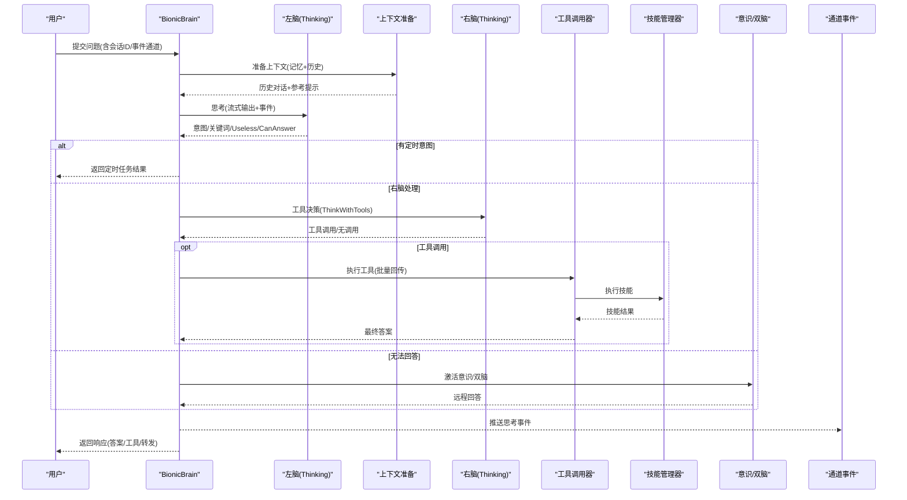

图表来源
- [internal/usecase/brain/brain.go](file://internal/usecase/brain/brain.go#L133-L237)
- [internal/usecase/brain/thinking.go](file://internal/usecase/brain/thinking.go#L121-L329)
- [internal/usecase/brain/tool_caller.go](file://internal/usecase/brain/tool_caller.go#L27-L139)
- [internal/usecase/brain/consciousness_manager.go](file://internal/usecase/brain/consciousness_manager.go#L40-L99)

章节来源
- [internal/usecase/brain/brain.go](file://internal/usecase/brain/brain.go#L133-L237)

## 详细组件分析

### 仿生大脑抽象与编排
- Brain 抽象定义思考接口、事件类型、工具 Schema、思考请求/响应与回调
- BionicBrain 作为编排器，串联上下文准备、左脑思考、右脑工具决策、意识/双脑协同与兜底策略
- 支持能力前缀路由：以“/能力名”强制走指定能力或双脑模式

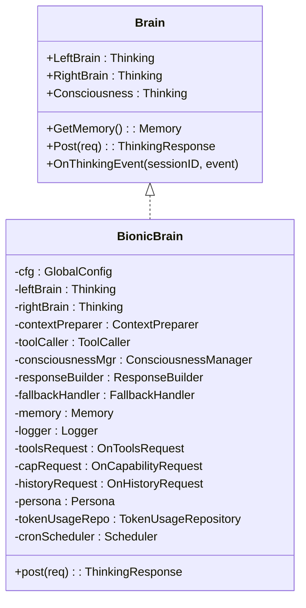

图表来源
- [internal/core/brain.go](file://internal/core/brain.go#L116-L140)
- [internal/usecase/brain/brain.go](file://internal/usecase/brain/brain.go#L36-L131)

章节来源
- [internal/core/brain.go](file://internal/core/brain.go#L70-L140)
- [internal/usecase/brain/brain.go](file://internal/usecase/brain/brain.go#L56-L131)

### 左脑思考：意图识别与流式事件
- 左脑负责简单意图识别、关键词抽取与基础回答，使用本地小模型
- 支持流式输出与思考事件推送：start/progress/chunk/tool_call/tool_result/complete/error
- 动态计算最大历史轮数，避免超出模型上下文

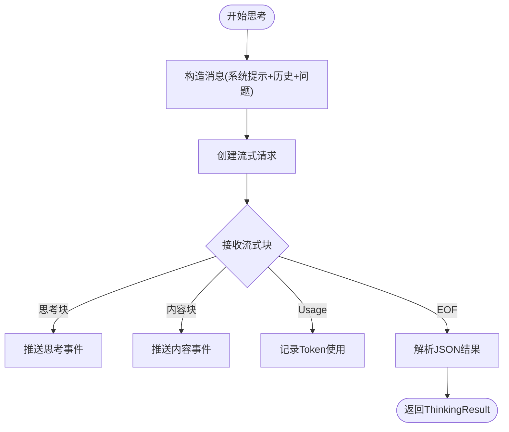

图表来源
- [internal/usecase/brain/thinking.go](file://internal/usecase/brain/thinking.go#L121-L329)
- [internal/usecase/brain/token_budget.go](file://internal/usecase/brain/token_budget.go#L75-L130)

章节来源
- [internal/usecase/brain/thinking.go](file://internal/usecase/brain/thinking.go#L121-L329)
- [internal/usecase/brain/token_budget.go](file://internal/usecase/brain/token_budget.go#L75-L130)

### 上下文准备：记忆检索与历史拼接
- 从长时记忆检索相似片段，构建参考提示
- 通过历史回调获取最大轮数内的历史对话，轮数由 Token 预算动态计算

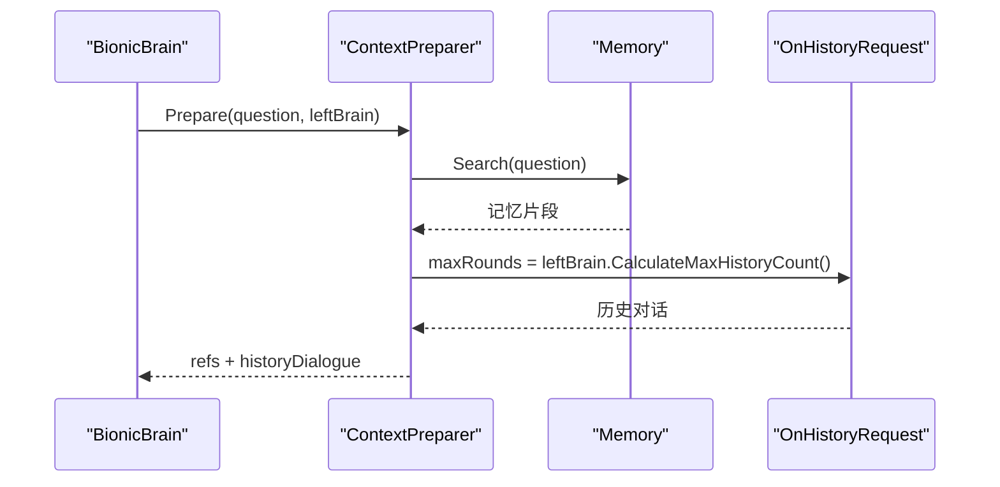

图表来源
- [internal/usecase/brain/context_preparer.go](file://internal/usecase/brain/context_preparer.go#L25-L52)
- [internal/core/memory.go](file://internal/core/memory.go#L24-L39)

章节来源
- [internal/usecase/brain/context_preparer.go](file://internal/usecase/brain/context_preparer.go#L25-L52)

### 右脑工具决策与执行：批量调用与继续调用
- 右脑根据问题与意图关键词检索工具，生成工具 Schema
- LLM 决定调用哪些工具，工具调用器批量执行并回传结果给 LLM
- 支持模型要求继续调用的场景，无需再次决策

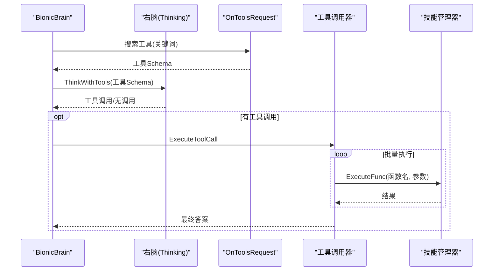

图表来源
- [internal/usecase/brain/brain.go](file://internal/usecase/brain/brain.go#L239-L305)
- [internal/usecase/brain/tool_caller.go](file://internal/usecase/brain/tool_caller.go#L27-L139)

章节来源
- [internal/usecase/brain/brain.go](file://internal/usecase/brain/brain.go#L239-L305)
- [internal/usecase/brain/tool_caller.go](file://internal/usecase/brain/tool_caller.go#L27-L139)

### 意识与双脑：远程能力与高算力协同
- 意识：按能力创建远程思维，注入人设与系统提示，支持工具调用
- 双脑：同时创建左/右脑，左脑负责复杂思考，右脑负责工具决策与调用
- 当左脑无法回答或右脑工具调用失败时，优先尝试意识/双脑

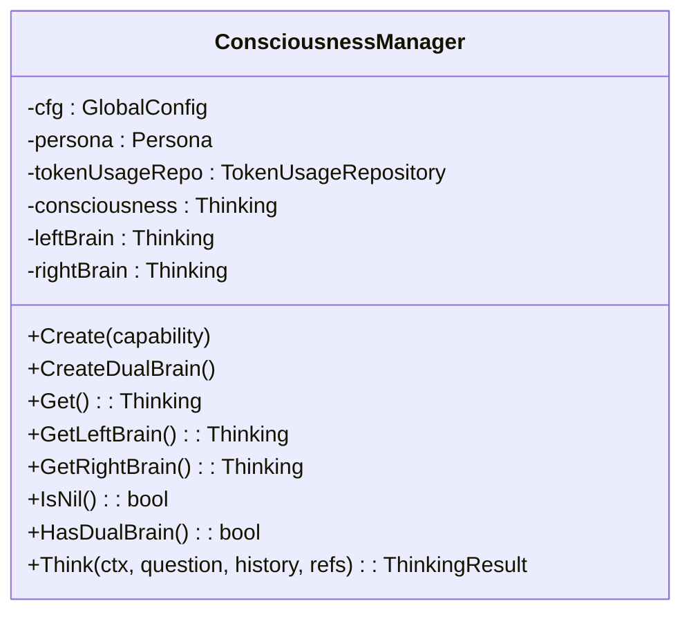

图表来源
- [internal/usecase/brain/consciousness_manager.go](file://internal/usecase/brain/consciousness_manager.go#L13-L129)

章节来源
- [internal/usecase/brain/consciousness_manager.go](file://internal/usecase/brain/consciousness_manager.go#L40-L129)

### 响应构建与兜底策略
- ResponseBuilder：将左脑结果或工具调用结果统一为 ThinkingResponse
- FallbackHandler：当右脑失败或无法回答时，尝试用右脑重试或返回兜底提示

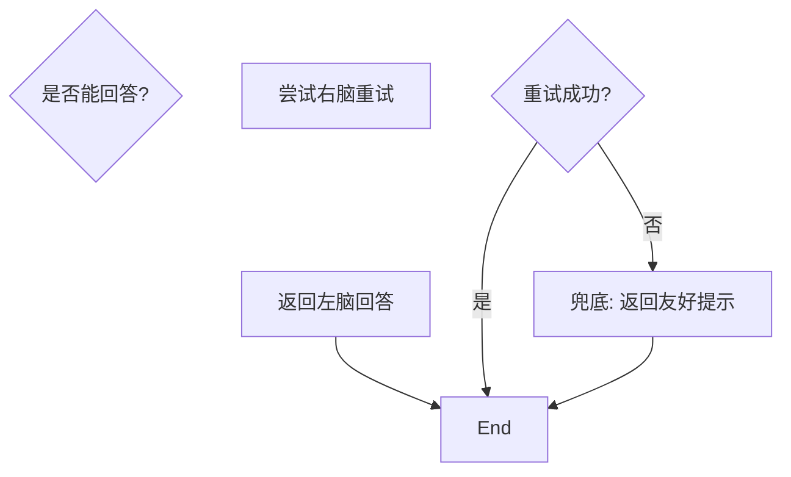

图表来源
- [internal/usecase/brain/response_builder.go](file://internal/usecase/brain/response_builder.go#L13-L41)
- [internal/usecase/brain/fallback_handler.go](file://internal/usecase/brain/fallback_handler.go#L31-L59)

章节来源
- [internal/usecase/brain/response_builder.go](file://internal/usecase/brain/response_builder.go#L13-L41)
- [internal/usecase/brain/fallback_handler.go](file://internal/usecase/brain/fallback_handler.go#L31-L59)

### 实时监控与事件流
- 左/右脑在思考过程中持续推送事件：start/progress/chunk/tool_call/tool_result/complete/error
- 通道层将事件写入客户端事件通道，前端组件实时展示思考过程

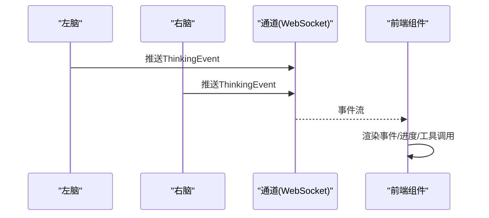

图表来源
- [internal/usecase/brain/thinking.go](file://internal/usecase/brain/thinking.go#L69-L76)
- [internal/adapters/channels/realtime.go](file://internal/adapters/channels/realtime.go#L280-L290)
- [dashboard/src/components/ThinkingIndicator.tsx](file://dashboard/src/components/ThinkingIndicator.tsx#L68-L97)
- [dashboard/src/components/MessageList.tsx](file://dashboard/src/components/MessageList.tsx#L354-L402)
- [dashboard/src/components/styles/ThinkingIndicator.css](file://dashboard/src/components/styles/ThinkingIndicator.css#L100-L171)
- [dashboard/src/components/styles/MessageList.css](file://dashboard/src/components/styles/MessageList.css#L509-L570)

章节来源
- [internal/usecase/brain/thinking.go](file://internal/usecase/brain/thinking.go#L69-L76)
- [internal/adapters/channels/realtime.go](file://internal/adapters/channels/realtime.go#L280-L290)
- [dashboard/src/components/ThinkingIndicator.tsx](file://dashboard/src/components/ThinkingIndicator.tsx#L68-L97)
- [dashboard/src/components/MessageList.tsx](file://dashboard/src/components/MessageList.tsx#L354-L402)

### 任务复杂度自动适配与算力优化
- Token 预算管理：基于模型 MaxTokens、预留输出 Token、系统提示词 Token 与动态平均每轮 Token 消耗，动态计算最大历史轮数
- 历史轮数控制：避免超上下文，保障稳定性；平滑更新平均 Token，减少抖动
- 模型配置：models.yml 提供多种模型，按场景选择本地/云端模型，配合温度、最大 Token 等参数

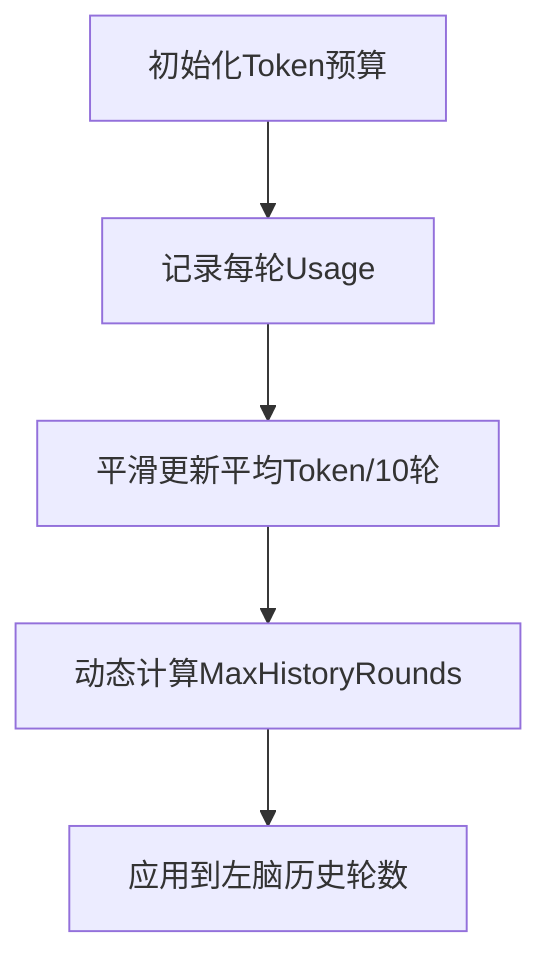

图表来源
- [internal/usecase/brain/token_budget.go](file://internal/usecase/brain/token_budget.go#L27-L130)
- [internal/usecase/brain/thinking.go](file://internal/usecase/brain/thinking.go#L78-L119)
- [config/models.yml](file://config/models.yml#L1-L92)

章节来源
- [internal/usecase/brain/token_budget.go](file://internal/usecase/brain/token_budget.go#L27-L130)
- [internal/usecase/brain/thinking.go](file://internal/usecase/brain/thinking.go#L78-L119)
- [config/models.yml](file://config/models.yml#L1-L92)

## 依赖关系分析
- BionicBrain 依赖 ContextPreparer、Thinking(左/右/意识)、ToolCaller、ResponseBuilder、FallbackHandler、Memory、TokenBudgetManager
- Thinking 依赖 OpenAI 客户端、日志、重试、Token 预算与事件通道
- ConsciousnessManager 依赖全局配置、人设、模型管理器与 Token 使用仓库
- 通道层通过事件通道将思考事件推送到前端

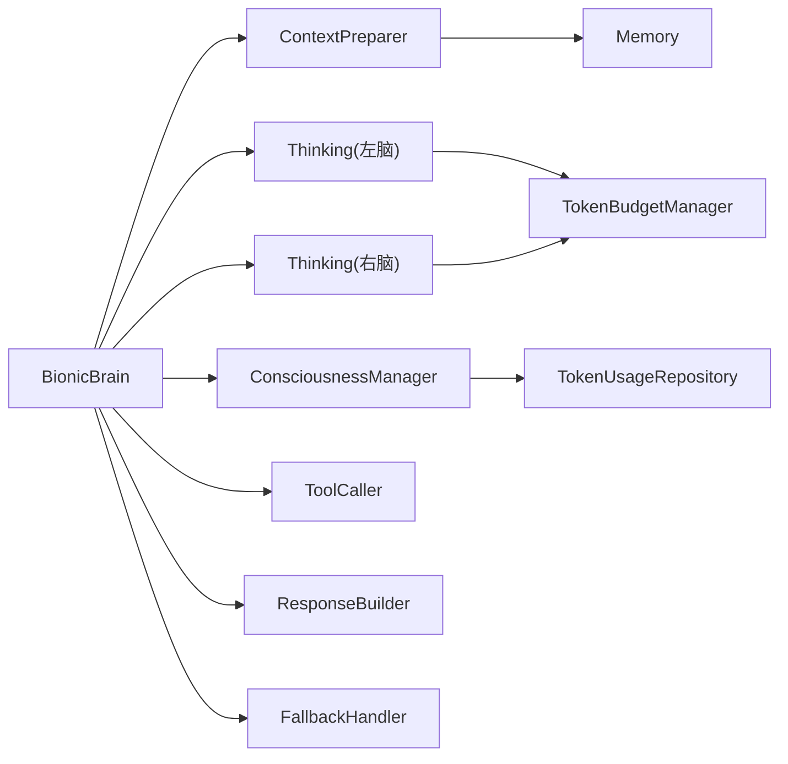

图表来源
- [internal/usecase/brain/brain.go](file://internal/usecase/brain/brain.go#L36-L131)
- [internal/usecase/brain/thinking.go](file://internal/usecase/brain/thinking.go#L21-L63)
- [internal/usecase/brain/consciousness_manager.go](file://internal/usecase/brain/consciousness_manager.go#L13-L38)

章节来源
- [internal/usecase/brain/brain.go](file://internal/usecase/brain/brain.go#L36-L131)

## 性能考量
- 流式思考与事件推送：降低首字节延迟，提升用户体验
- 动态历史轮数：避免上下文溢出，提高稳定性与吞吐
- 批量工具调用与继续调用：减少往返次数，提升工具链效率
- 模型选择与参数：按任务复杂度选择合适模型，合理设置温度与最大 Token
- 通道事件压缩与前端渲染优化：避免大量事件造成 UI 卡顿

## 故障排查指南
- 左脑思考失败：检查模型连接、API Key、BaseURL 与温度/最大 Token 配置
- 右脑工具调用失败：确认工具 Schema、技能是否存在、参数是否正确
- 意识/双脑不可用：检查能力配置、模型可用性与系统提示词
- Token 预算异常：查看动态平均 Token 是否稳定，必要时调整预留输出 Token 或最小轮数
- 事件未到达前端：检查通道事件通道是否正确绑定会话 ID，前端轮询/订阅是否正常

章节来源
- [internal/usecase/brain/thinking.go](file://internal/usecase/brain/thinking.go#L190-L200)
- [internal/usecase/brain/tool_caller.go](file://internal/usecase/brain/tool_caller.go#L44-L47)
- [internal/adapters/channels/realtime.go](file://internal/adapters/channels/realtime.go#L280-L290)

## 结论
MindX 的核心大脑系统通过“潜意识-主意识-意识”的分层设计与工具链协同，实现了从简单到复杂的任务适配；借助动态 Token 预算与历史轮数控制，系统在不同硬件与模型条件下保持稳定；通过事件流与前端可视化，实现了思考过程的可观测与可交互。开发者可在此基础上扩展能力、工具与模型，实现更强大的智能代理。

## 附录
- 使用模式建议
  - 简单问题：左脑直接回答，无需工具
  - 工具类问题：右脑工具决策与执行，支持批量与继续调用
  - 复杂问题：意识/双脑协同，结合远程能力与高算力模型
- 扩展指南
  - 新增能力：在能力注册表中添加能力定义与模型映射
  - 新增工具：提供技能定义与参数 Schema，确保 Guidence/OutputFormat 完整
  - 新增模型：在 models.yml 中配置新模型，按需调整温度与最大 Token
  - 新增通道：实现事件通道接口，绑定会话 ID，接入前端