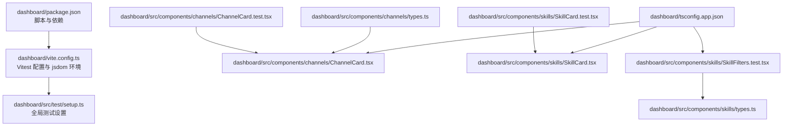
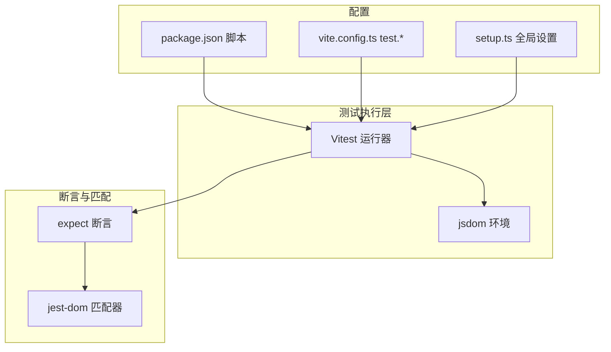
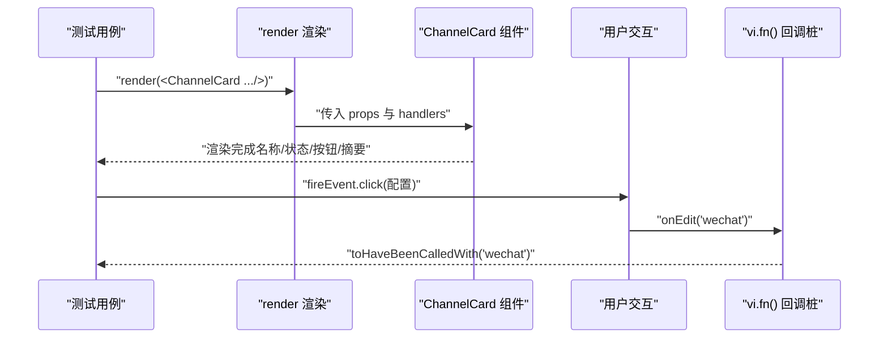
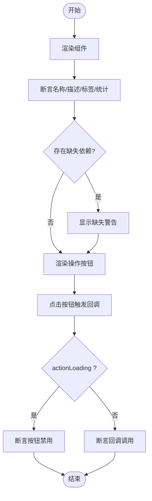
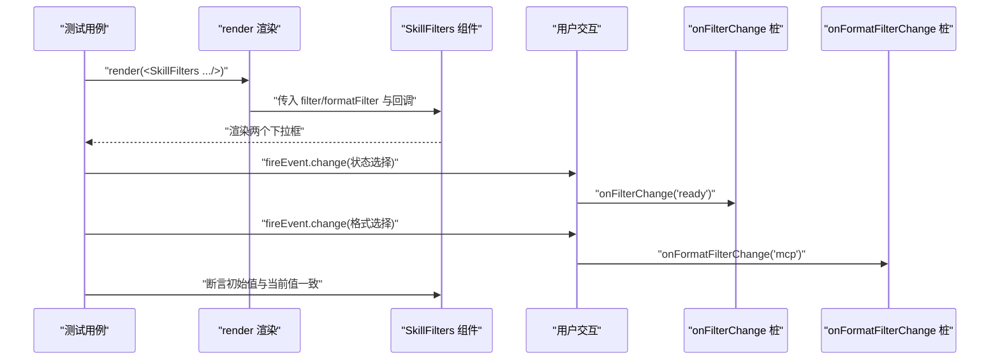
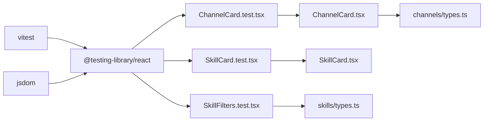

# 前端测试

<cite>
**本文引用的文件**
- [dashboard/package.json](file://dashboard/package.json)
- [dashboard/vite.config.ts](file://dashboard/vite.config.ts)
- [dashboard/src/test/setup.ts](file://dashboard/src/test/setup.ts)
- [dashboard/src/components/channels/ChannelCard.test.tsx](file://dashboard/src/components/channels/ChannelCard.test.tsx)
- [dashboard/src/components/channels/ChannelCard.tsx](file://dashboard/src/components/channels/ChannelCard.tsx)
- [dashboard/src/components/channels/types.ts](file://dashboard/src/components/channels/types.ts)
- [dashboard/src/components/skills/SkillCard.test.tsx](file://dashboard/src/components/skills/SkillCard.test.tsx)
- [dashboard/src/components/skills/SkillCard.tsx](file://dashboard/src/components/skills/SkillCard.tsx)
- [dashboard/src/components/skills/SkillFilters.test.tsx](file://dashboard/src/components/skills/SkillFilters.test.tsx)
- [dashboard/src/components/skills/types.ts](file://dashboard/src/components/skills/types.ts)
- [dashboard/tsconfig.app.json](file://dashboard/tsconfig.app.json)
- [dashboard/tsconfig.json](file://dashboard/tsconfig.json)
</cite>

## 目录
1. [简介](#简介)
2. [项目结构](#项目结构)
3. [核心组件](#核心组件)
4. [架构总览](#架构总览)
5. [组件与测试详解](#组件与测试详解)
6. [依赖关系分析](#依赖关系分析)
7. [性能考量](#性能考量)
8. [故障排查指南](#故障排查指南)
9. [结论](#结论)
10. [附录](#附录)

## 简介
本文件面向 MindX 前端（React + TypeScript）测试体系，系统化梳理组件测试、集成测试与端到端测试的策略与落地方式；详细说明测试环境配置（Jest 与 React Testing Library 的替代方案：Vitest + jsdom）、最佳实践（快照测试、交互测试、属性测试）、异步操作与 Mock 数据的使用，并给出 UI 组件测试工具与技巧，以及测试覆盖率分析建议。

## 项目结构
- 测试运行器采用 Vitest，通过 Vite 插件在 jsdom 环境中执行。
- 测试入口与全局设置位于 src/test/setup.ts，用于注册 @testing-library/jest-dom 匹配器。
- 组件测试集中在各组件目录下的 *.test.tsx 文件，覆盖核心 UI 组件如 ChannelCard、SkillCard、SkillFilters。
- 类型定义位于各自组件的 types.ts 中，确保测试对数据结构的一致理解。

图表来源
- [dashboard/package.json](file://dashboard/package.json#L1-L58)
- [dashboard/vite.config.ts](file://dashboard/vite.config.ts#L64-L68)
- [dashboard/src/test/setup.ts](file://dashboard/src/test/setup.ts#L1-L2)
- [dashboard/src/components/channels/ChannelCard.test.tsx](file://dashboard/src/components/channels/ChannelCard.test.tsx#L1-L66)
- [dashboard/src/components/channels/ChannelCard.tsx](file://dashboard/src/components/channels/ChannelCard.tsx#L1-L134)
- [dashboard/src/components/skills/SkillCard.test.tsx](file://dashboard/src/components/skills/SkillCard.test.tsx#L1-L84)
- [dashboard/src/components/skills/SkillCard.tsx](file://dashboard/src/components/skills/SkillCard.tsx#L1-L119)
- [dashboard/src/components/skills/SkillFilters.test.tsx](file://dashboard/src/components/skills/SkillFilters.test.tsx#L1-L41)
- [dashboard/src/components/skills/types.ts](file://dashboard/src/components/skills/types.ts#L1-L103)
- [dashboard/src/components/channels/types.ts](file://dashboard/src/components/channels/types.ts#L1-L16)
- [dashboard/tsconfig.app.json](file://dashboard/tsconfig.app.json#L1-L26)

章节来源
- [dashboard/package.json](file://dashboard/package.json#L1-L58)
- [dashboard/vite.config.ts](file://dashboard/vite.config.ts#L64-L68)
- [dashboard/src/test/setup.ts](file://dashboard/src/test/setup.ts#L1-L2)
- [dashboard/tsconfig.app.json](file://dashboard/tsconfig.app.json#L1-L26)
- [dashboard/tsconfig.json](file://dashboard/tsconfig.json#L1-L8)

## 核心组件
- ChannelCard：展示并控制渠道启停、编辑等动作，包含按钮状态与配置摘要渲染。
- SkillCard：展示技能元信息、状态徽标、统计信息、缺失依赖警告及一系列操作按钮。
- SkillFilters：提供状态与格式过滤下拉框，支持值变更回调。

章节来源
- [dashboard/src/components/channels/ChannelCard.tsx](file://dashboard/src/components/channels/ChannelCard.tsx#L73-L134)
- [dashboard/src/components/skills/SkillCard.tsx](file://dashboard/src/components/skills/SkillCard.tsx#L23-L119)
- [dashboard/src/components/skills/SkillFilters.test.tsx](file://dashboard/src/components/skills/SkillFilters.test.tsx#L1-L41)

## 架构总览
- 测试运行器：Vitest（替代 Jest）
- DOM 环境：jsdom（由 VitePWA 插件配置项中的 test.environment 指定）
- 断言库：Vitest 内置 expect（基于 chai），结合 @testing-library/jest-dom 提供 DOM 匹配器
- 设置文件：src/test/setup.ts 注册 jest-dom 匹配器，便于断言可见性、属性等
- TypeScript 支持：通过 tsconfig.app.json 的 bundler 模式与 jsx 配置，保证测试与源码一致

图表来源
- [dashboard/package.json](file://dashboard/package.json#L6-L11)
- [dashboard/vite.config.ts](file://dashboard/vite.config.ts#L64-L68)
- [dashboard/src/test/setup.ts](file://dashboard/src/test/setup.ts#L1-L2)

章节来源
- [dashboard/package.json](file://dashboard/package.json#L6-L11)
- [dashboard/vite.config.ts](file://dashboard/vite.config.ts#L64-L68)
- [dashboard/src/test/setup.ts](file://dashboard/src/test/setup.ts#L1-L2)

## 组件与测试详解

### ChannelCard 组件测试
- 测试目标
  - 渲染渠道名称与启用/禁用状态文案
  - 启用状态下显示启动/停止按钮，禁用时隐藏
  - 点击“配置”触发 onEdit 回调
  - 展示端口与路径配置摘要
- 关键断言点
  - 文案存在性与内容断言
  - 按钮可见性与禁用态
  - 回调调用参数与次数
- Mock 与辅助
  - 使用 makeChannel 构造函数生成稳定测试数据
  - 使用 vi.fn() 作为事件处理器桩函数

图表来源
- [dashboard/src/components/channels/ChannelCard.test.tsx](file://dashboard/src/components/channels/ChannelCard.test.tsx#L1-L66)
- [dashboard/src/components/channels/ChannelCard.tsx](file://dashboard/src/components/channels/ChannelCard.tsx#L73-L134)

章节来源
- [dashboard/src/components/channels/ChannelCard.test.tsx](file://dashboard/src/components/channels/ChannelCard.test.tsx#L1-L66)
- [dashboard/src/components/channels/ChannelCard.tsx](file://dashboard/src/components/channels/ChannelCard.tsx#L73-L134)
- [dashboard/src/components/channels/types.ts](file://dashboard/src/components/channels/types.ts#L1-L16)

### SkillCard 组件测试
- 测试目标
  - 渲染技能名称、描述、标签
  - 展示成功/错误/平均耗时等统计
  - 显示缺失二进制或环境变量的警告
  - 按钮行为：验证、转换格式、安装依赖、环境变量、启用/禁用
  - actionLoading 时按钮禁用
- 关键断言点
  - 文本存在性与正则匹配
  - 按钮禁用态
  - 条件渲染（非标准格式、缺失依赖）
  - 回调参数一致性

图表来源
- [dashboard/src/components/skills/SkillCard.test.tsx](file://dashboard/src/components/skills/SkillCard.test.tsx#L1-L84)
- [dashboard/src/components/skills/SkillCard.tsx](file://dashboard/src/components/skills/SkillCard.tsx#L23-L119)
- [dashboard/src/components/skills/types.ts](file://dashboard/src/components/skills/types.ts#L33-L64)

章节来源
- [dashboard/src/components/skills/SkillCard.test.tsx](file://dashboard/src/components/skills/SkillCard.test.tsx#L1-L84)
- [dashboard/src/components/skills/SkillCard.tsx](file://dashboard/src/components/skills/SkillCard.tsx#L23-L119)
- [dashboard/src/components/skills/types.ts](file://dashboard/src/components/skills/types.ts#L33-L64)

### SkillFilters 组件测试
- 测试目标
  - 渲染两个下拉框（状态与格式）
  - 变更下拉框时触发对应回调
  - 初始值正确反映当前过滤条件
- 关键断言点
  - role=combobox 数量
  - change 事件与回调参数
  - 选中值断言

图表来源
- [dashboard/src/components/skills/SkillFilters.test.tsx](file://dashboard/src/components/skills/SkillFilters.test.tsx#L1-L41)
- [dashboard/src/components/skills/types.ts](file://dashboard/src/components/skills/types.ts#L1-L103)

章节来源
- [dashboard/src/components/skills/SkillFilters.test.tsx](file://dashboard/src/components/skills/SkillFilters.test.tsx#L1-L41)
- [dashboard/src/components/skills/types.ts](file://dashboard/src/components/skills/types.ts#L1-L103)

## 依赖关系分析
- 测试运行依赖
  - vitest：测试运行器与内置 expect
  - jsdom：DOM 环境
  - @testing-library/jest-dom：DOM 断言扩展
- 组件依赖
  - ChannelCard 依赖 ChannelConfig 类型
  - SkillCard 依赖 SkillInfo 与 isMCPSkill 辅助判断
  - SkillFilters 依赖过滤枚举与回调类型

图表来源
- [dashboard/package.json](file://dashboard/package.json#L38-L55)
- [dashboard/src/components/channels/ChannelCard.test.tsx](file://dashboard/src/components/channels/ChannelCard.test.tsx#L1-L66)
- [dashboard/src/components/skills/SkillCard.test.tsx](file://dashboard/src/components/skills/SkillCard.test.tsx#L1-L84)
- [dashboard/src/components/skills/SkillFilters.test.tsx](file://dashboard/src/components/skills/SkillFilters.test.tsx#L1-L41)
- [dashboard/src/components/channels/types.ts](file://dashboard/src/components/channels/types.ts#L1-L16)
- [dashboard/src/components/skills/types.ts](file://dashboard/src/components/skills/types.ts#L1-L103)

章节来源
- [dashboard/package.json](file://dashboard/package.json#L38-L55)
- [dashboard/src/components/channels/types.ts](file://dashboard/src/components/channels/types.ts#L1-L16)
- [dashboard/src/components/skills/types.ts](file://dashboard/src/components/skills/types.ts#L1-L103)

## 性能考量
- 单测粒度
  - 优先进行组件单元测试，避免过度渲染复杂树，减少不必要的重渲染
- 异步测试
  - 使用 await/async 与屏幕查询断言，避免过早断言导致的不稳定
- Mock 策略
  - 对外部副作用（网络、定时器）进行最小化 Mock，保持测试可读性
- 渲染范围
  - 仅渲染必要子树，减少 DOM 查询与断言数量
- 并发与隔离
  - 每个测试独立渲染与清理，避免共享状态干扰

## 故障排查指南
- 常见问题
  - 文本未找到：检查文案是否随 props 或状态变化而更新；确认 i18n 未影响选择器
  - 按钮不可见：确认条件渲染逻辑（如 enabled/disabled）与 props 传递一致
  - 回调未触发：核对事件绑定与 fireEvent 使用；确保 vi.fn() 在渲染前创建
  - 环境不匹配：确认 vite.config.ts 中 test.environment 为 jsdom，且 setup.ts 已加载
- 排查步骤
  - 打印/记录中间状态（如 props、内部状态）
  - 将复杂断言拆分为多个简单断言，定位失败点
  - 使用 debug(screen) 查看实际渲染节点
  - 检查 tsconfig 与路径别名，避免导入路径导致的断言失败

章节来源
- [dashboard/vite.config.ts](file://dashboard/vite.config.ts#L64-L68)
- [dashboard/src/test/setup.ts](file://dashboard/src/test/setup.ts#L1-L2)

## 结论
MindX 前端测试以 Vitest + jsdom 为核心，结合 @testing-library/jest-dom 实现 DOM 行为与断言，覆盖了关键 UI 组件的渲染、交互与属性校验。通过类型驱动的测试数据构造与 vi.fn() 回调桩，测试具备良好的稳定性与可维护性。建议持续完善异步场景与 Mock 策略，提升测试覆盖率与质量。

## 附录

### 测试环境配置要点
- 运行命令
  - npm 脚本中提供 test 命令，直接运行 Vitest
- 环境与设置
  - test.globals=true：全局启用 describe/it/expect/vi
  - test.environment='jsdom'：DOM 环境
  - test.setupFiles='./src/test/setup.ts'：注册 jest-dom 匹配器
- TypeScript
  - tsconfig.app.json 启用 bundler 模式与 jsx，确保测试与源码一致

章节来源
- [dashboard/package.json](file://dashboard/package.json#L6-L11)
- [dashboard/vite.config.ts](file://dashboard/vite.config.ts#L64-L68)
- [dashboard/src/test/setup.ts](file://dashboard/src/test/setup.ts#L1-L2)
- [dashboard/tsconfig.app.json](file://dashboard/tsconfig.app.json#L1-L26)
- [dashboard/tsconfig.json](file://dashboard/tsconfig.json#L1-L8)

### 最佳实践清单
- 快照测试
  - 仅在静态结构稳定时使用，避免过度快照导致维护成本上升
- 交互测试
  - 使用 fireEvent 模拟真实用户交互；断言前后状态变化
- 属性测试
  - 通过 props 与条件渲染组合，覆盖边界与异常分支
- 异步操作
  - 使用 await 与屏幕查询断言，等待副作用完成
- Mock 数据
  - 使用工厂函数（如 makeSkill/makeChannel）统一构造测试数据，提高可读性与复用性

### 覆盖率分析建议
- 使用 Vitest 的覆盖率选项生成报告，关注以下维度：
  - 行覆盖率：关注条件渲染与错误分支
  - 分支覆盖率：重点覆盖 enabled/disabled、format 类型、缺失依赖等分支
  - 函数与语句覆盖率：确保回调桩与工具函数被调用
- 建议将覆盖率阈值纳入 CI，逐步提升整体覆盖率