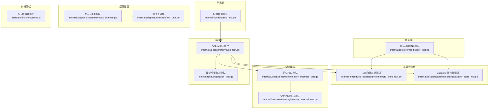
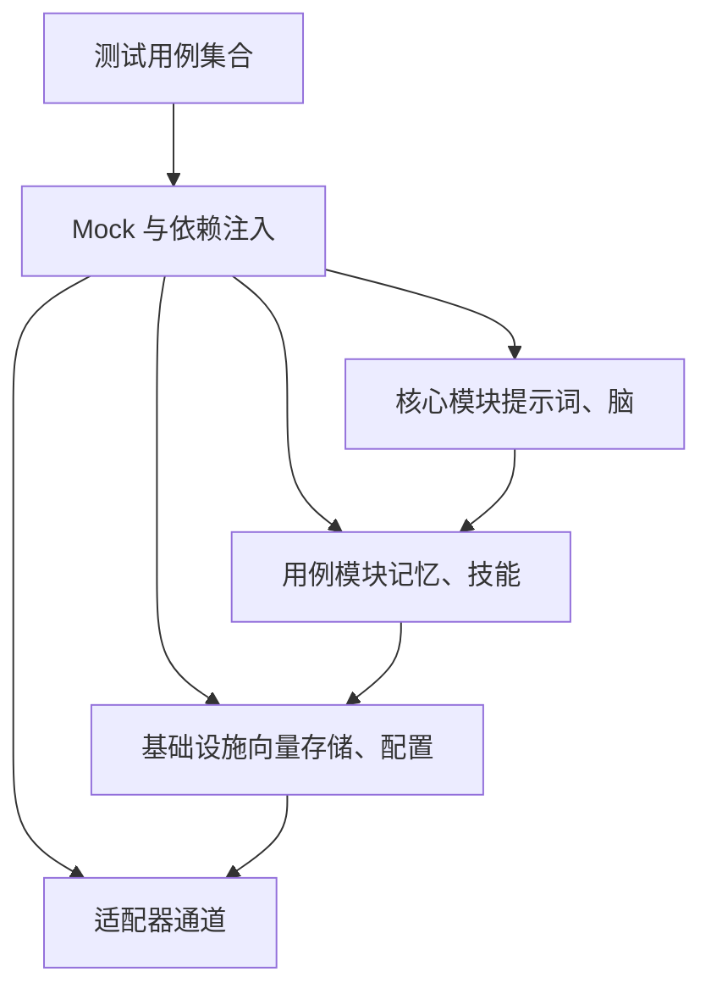
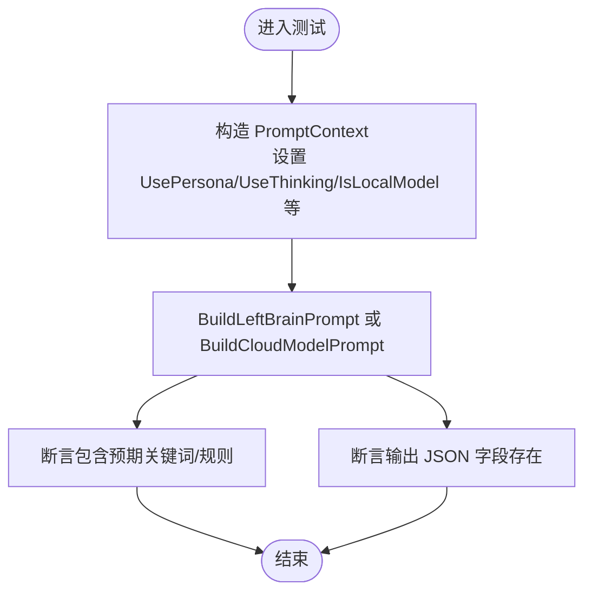
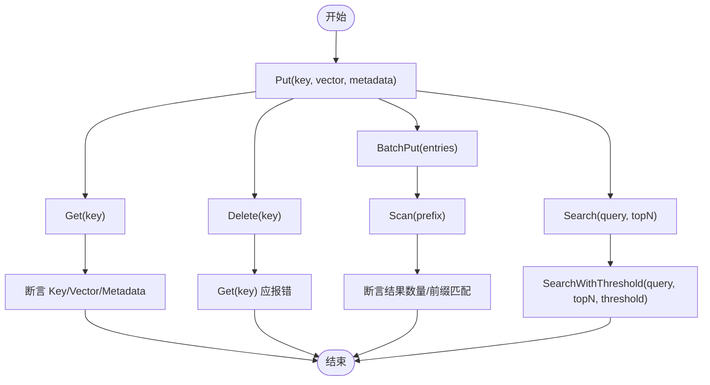
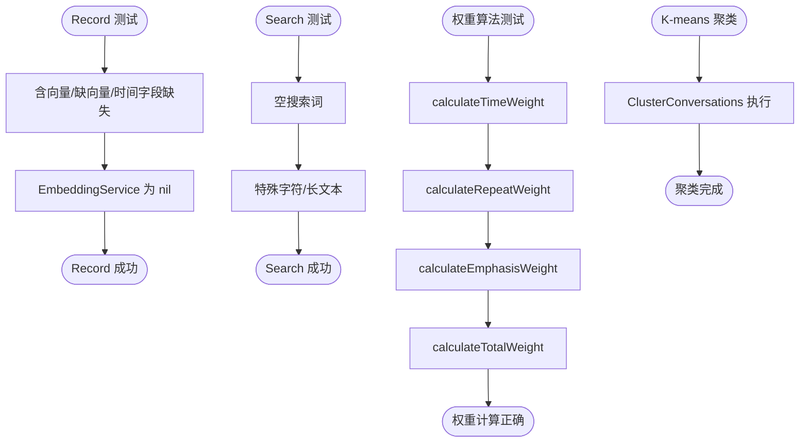
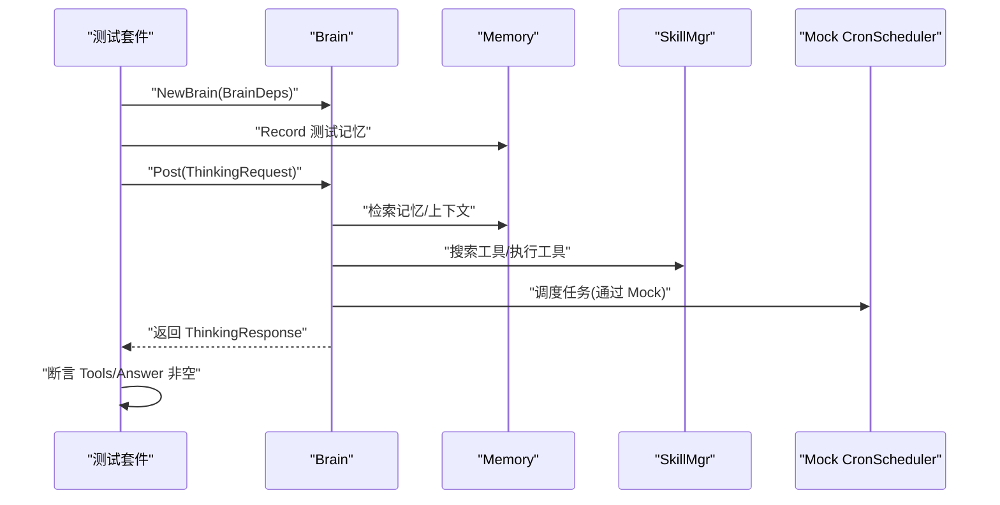
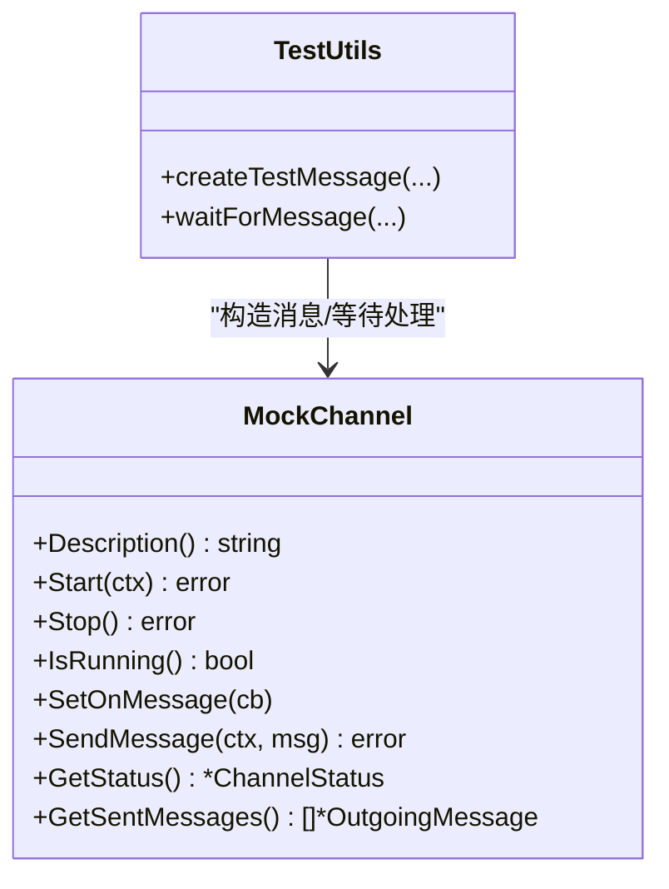
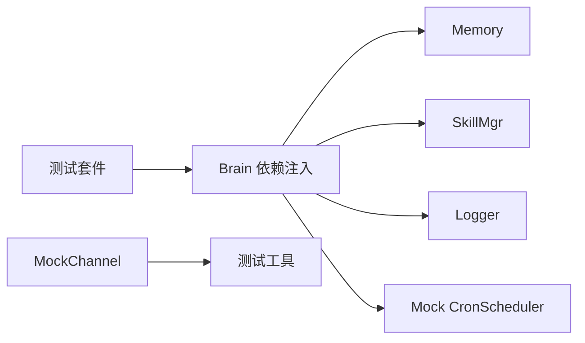

# 单元测试

<cite>
**本文引用的文件**   
- [go.mod](file://go.mod)
- [internal/usecase/brain/suite_test.go](file://internal/usecase/brain/suite_test.go)
- [internal/tests/integration_test.go](file://internal/tests/integration_test.go)
- [internal/core/prompt_builder_test.go](file://internal/core/prompt_builder_test.go)
- [internal/infrastructure/persistence/memory_store_test.go](file://internal/infrastructure/persistence/memory_store_test.go)
- [internal/infrastructure/persistence/badger_store_test.go](file://internal/infrastructure/persistence/badger_store_test.go)
- [internal/config/config_test.go](file://internal/config/config_test.go)
- [internal/usecase/memory/memory_interface_test.go](file://internal/usecase/memory/memory_interface_test.go)
- [internal/usecase/memory/memory_internal_test.go](file://internal/usecase/memory/memory_internal_test.go)
- [internal/adapters/channels/mock_channel.go](file://internal/adapters/channels/mock_channel.go)
- [internal/adapters/channels/test_utils.go](file://internal/adapters/channels/test_utils.go)
- [dashboard/src/test/setup.ts](file://dashboard/src/test/setup.ts)
</cite>

## 目录
1. [简介](#简介)
2. [项目结构](#项目结构)
3. [核心组件](#核心组件)
4. [架构总览](#架构总览)
5. [详细组件分析](#详细组件分析)
6. [依赖分析](#依赖分析)
7. [性能考虑](#性能考虑)
8. [故障排查指南](#故障排查指南)
9. [结论](#结论)
10. [附录](#附录)

## 简介
本文件面向 MindX 的单元测试体系，聚焦大脑思考模块、记忆模块、工具函数与基础设施层的测试设计与实现，系统阐述测试策略、断言方法、边界条件与异常处理、Mock 机制与依赖注入、测试数据准备与清理、最佳实践与覆盖率建议，并结合仓库现有测试文件给出可操作的示例与结果分析路径。

## 项目结构
MindX 的测试分布在多个层次：
- 核心层：提示词构建器的单元测试，覆盖多版本、多模式的提示词生成与输出格式校验。
- 基础设施层：向量存储（内存与 Badger）的单元测试，覆盖增删改查、批量写入、阈值检索、扫描与元数据序列化。
- 记忆模块：对外接口与内部算法的双轨测试，分别验证公开行为与内部权重、相似度、分词等算法细节。
- 脑模块：集成测试套件，使用真实组件（Memory、SkillMgr）与 Mock（CronScheduler）组合，覆盖思考流程、工具选择与执行、长输入、上下文一致性等。
- 配置层：配置加载与 Viper 初始化的边界与异常测试。
- 适配器层：通道适配器的 Mock 通道与测试工具，便于消息收发与状态断言。
- 前端测试：基于 Jest 的前端测试环境初始化。

**图表来源**
- [internal/core/prompt_builder_test.go](file://internal/core/prompt_builder_test.go#L1-L227)
- [internal/infrastructure/persistence/memory_store_test.go](file://internal/infrastructure/persistence/memory_store_test.go#L1-L177)
- [internal/infrastructure/persistence/badger_store_test.go](file://internal/infrastructure/persistence/badger_store_test.go#L1-L184)
- [internal/usecase/memory/memory_interface_test.go](file://internal/usecase/memory/memory_interface_test.go#L1-L259)
- [internal/usecase/memory/memory_internal_test.go](file://internal/usecase/memory/memory_internal_test.go#L1-L555)
- [internal/usecase/brain/suite_test.go](file://internal/usecase/brain/suite_test.go#L1-L334)
- [internal/tests/integration_test.go](file://internal/tests/integration_test.go#L1-L259)
- [internal/config/config_test.go](file://internal/config/config_test.go#L1-L56)
- [internal/adapters/channels/mock_channel.go](file://internal/adapters/channels/mock_channel.go#L54-L199)
- [internal/adapters/channels/test_utils.go](file://internal/adapters/channels/test_utils.go#L54-L84)
- [dashboard/src/test/setup.ts](file://dashboard/src/test/setup.ts#L1-L2)

**章节来源**
- [go.mod](file://go.mod#L1-L113)

## 核心组件
- 提示词构建器测试：覆盖本地/云端模型、思维引导、关键词注入、输出格式完整性、版本号等。
- 向量存储测试：覆盖 Put/Get/Delete/BatchPut/Search/Scan/Metadata 等完整生命周期与边界。
- 记忆模块测试：接口测试关注 Record/Search/聚类/优化/清理/权重调整；内部算法测试覆盖时间/重复/强调/总权重、分词、关键词相似度、排序、摘要/关键词降级、余弦相似度、K 值选择等。
- 脑模块测试：集成测试套件使用真实 Memory/SkillMgr 并注入 Mock CronScheduler，覆盖思考流程、工具选择与执行、长输入、上下文一致性；另有全量技能集成测试。
- 配置测试：覆盖配置文件缺失、Viper 初始化错误等异常路径。
- 适配器测试：Mock 通道与测试工具，便于断言消息收发与状态。
- 前端测试：Jest 环境初始化。

**章节来源**
- [internal/core/prompt_builder_test.go](file://internal/core/prompt_builder_test.go#L1-L227)
- [internal/infrastructure/persistence/memory_store_test.go](file://internal/infrastructure/persistence/memory_store_test.go#L1-L177)
- [internal/infrastructure/persistence/badger_store_test.go](file://internal/infrastructure/persistence/badger_store_test.go#L1-L184)
- [internal/usecase/memory/memory_interface_test.go](file://internal/usecase/memory/memory_interface_test.go#L1-L259)
- [internal/usecase/memory/memory_internal_test.go](file://internal/usecase/memory/memory_internal_test.go#L1-L555)
- [internal/usecase/brain/suite_test.go](file://internal/usecase/brain/suite_test.go#L1-L334)
- [internal/tests/integration_test.go](file://internal/tests/integration_test.go#L1-L259)
- [internal/config/config_test.go](file://internal/config/config_test.go#L1-L56)
- [internal/adapters/channels/mock_channel.go](file://internal/adapters/channels/mock_channel.go#L54-L199)
- [internal/adapters/channels/test_utils.go](file://internal/adapters/channels/test_utils.go#L54-L84)
- [dashboard/src/test/setup.ts](file://dashboard/src/test/setup.ts#L1-L2)

## 架构总览
下图展示单元测试在系统中的定位与交互关系，突出 Mock 与依赖注入在测试中的作用。

**图表来源**
- [internal/usecase/brain/suite_test.go](file://internal/usecase/brain/suite_test.go#L27-L100)
- [internal/adapters/channels/mock_channel.go](file://internal/adapters/channels/mock_channel.go#L54-L199)
- [internal/infrastructure/persistence/memory_store_test.go](file://internal/infrastructure/persistence/memory_store_test.go#L10-L29)
- [internal/config/config_test.go](file://internal/config/config_test.go#L12-L55)

## 详细组件分析

### 提示词构建器测试
- 设计原则
  - 分层断言：分别验证本地/云端模型、思维引导开关、关键词注入、输出格式完整性、版本号。
  - 边界条件：空关键词、重复关键词、否定/情绪/工具调用示例等。
  - 异常处理：版本号断言，确保输出格式字段齐全。
- 断言方法
  - 字符串包含/不包含断言，确保规则与关键词注入生效。
  - 输出格式字段存在性断言，保证 JSON 结构化输出的完整性。
- 典型用例路径
  - [TestPromptBuilder_LocalModel](file://internal/core/prompt_builder_test.go#L8-L34)
  - [TestPromptBuilder_CloudModel](file://internal/core/prompt_builder_test.go#L36-L62)
  - [TestPromptBuilder_EmptyKeywords](file://internal/core/prompt_builder_test.go#L99-L115)
  - [TestPromptBuilder_OutputFormatComplete](file://internal/core/prompt_builder_test.go#L212-L226)

**图表来源**
- [internal/core/prompt_builder_test.go](file://internal/core/prompt_builder_test.go#L8-L62)
- [internal/core/prompt_builder_test.go](file://internal/core/prompt_builder_test.go#L117-L174)
- [internal/core/prompt_builder_test.go](file://internal/core/prompt_builder_test.go#L212-L226)

**章节来源**
- [internal/core/prompt_builder_test.go](file://internal/core/prompt_builder_test.go#L1-L227)

### 向量存储测试（内存与 Badger）
- 设计原则
  - 完整生命周期：Put/Get/Delete/BatchPut/Scan。
  - 检索边界：Search/Threshold/Empty。
  - 元数据：PutWithMetadata。
  - 异常：GetNotFound、PutNilVector。
- 断言方法
  - Key/Vector/Metadata 正反向断言。
  - 结果数量与顺序断言。
  - 错误类型断言。
- 典型用例路径
  - [TestMemoryStore_PutAndGet](file://internal/infrastructure/persistence/memory_store_test.go#L10-L29)
  - [TestMemoryStore_SearchWithThreshold](file://internal/infrastructure/persistence/memory_store_test.go#L99-L114)
  - [TestBadgerStore_PutWithMetadata](file://internal/infrastructure/persistence/badger_store_test.go#L170-L183)

**图表来源**
- [internal/infrastructure/persistence/memory_store_test.go](file://internal/infrastructure/persistence/memory_store_test.go#L10-L177)
- [internal/infrastructure/persistence/badger_store_test.go](file://internal/infrastructure/persistence/badger_store_test.go#L21-L184)

**章节来源**
- [internal/infrastructure/persistence/memory_store_test.go](file://internal/infrastructure/persistence/memory_store_test.go#L1-L177)
- [internal/infrastructure/persistence/badger_store_test.go](file://internal/infrastructure/persistence/badger_store_test.go#L1-L184)

### 记忆模块测试（接口与内部算法）
- 接口测试（对外行为）
  - Record：含向量/缺向量/时间字段缺失/EmbeddingService 为 nil 等边界。
  - Search：空词/特殊字符/长文本。
  - ClusterConversations：K-means 聚类执行。
  - Optimize/CleanupExpiredMemories/AdjustMemoryWeight：方法可达性与错误路径。
- 内部算法测试（对内行为）
  - 权重：calculateTimeWeight/calculateRepeatWeight/calculateEmphasisWeight/calculateTotalWeight。
  - 文本处理：simpleTokenize、calculateKeywordSimilarity、sortByWeight。
  - 摘要/关键词降级：generateSummary/generateKeywords（无 LLM 客户端时的行为）。
  - 相似度与聚类：calculateCosineSimilarity、determineOptimalK。
- 断言方法
  - assert.NoError/assert.NotNil/assert.InDelta/assert.Equal/assert.Contains/assert.Len。
  - 对边界与异常路径进行显式错误断言。
- 典型用例路径
  - [TestRecord](file://internal/usecase/memory/memory_interface_test.go#L19-L119)
  - [TestSearch](file://internal/usecase/memory/memory_interface_test.go#L124-L163)
  - [TestCalculateTotalWeight](file://internal/usecase/memory/memory_internal_test.go#L176-L229)
  - [TestSimpleTokenize](file://internal/usecase/memory/memory_internal_test.go#L234-L282)
  - [TestGenerateSummary](file://internal/usecase/memory/memory_internal_test.go#L392-L413)

**图表来源**
- [internal/usecase/memory/memory_interface_test.go](file://internal/usecase/memory/memory_interface_test.go#L19-L163)
- [internal/usecase/memory/memory_internal_test.go](file://internal/usecase/memory/memory_internal_test.go#L12-L229)
- [internal/usecase/memory/memory_internal_test.go](file://internal/usecase/memory/memory_internal_test.go#L234-L430)

**章节来源**
- [internal/usecase/memory/memory_interface_test.go](file://internal/usecase/memory/memory_interface_test.go#L1-L259)
- [internal/usecase/memory/memory_internal_test.go](file://internal/usecase/memory/memory_internal_test.go#L1-L555)

### 脑模块测试（集成与全量技能）
- 集成测试套件
  - 使用真实 Memory/SkillMgr，注入 Mock CronScheduler，记录测试记忆，封装历史对话，验证思考流程、工具选择与执行、长输入、上下文一致性。
  - 测试数据目录与日志目录隔离，测试结束后清理。
- 全量技能集成测试
  - 启动应用，等待索引完成，遍历技能用例，断言工具发现与响应非空。
- 断言方法
  - assert.NoError/assert.NotNil/字符串包含/计数统计。
- 典型用例路径
  - [BrainIntegrationSuite.SetupSuite](file://internal/usecase/brain/suite_test.go#L119-L252)
  - [TestAllSkills](file://internal/tests/integration_test.go#L128-L215)

**图表来源**
- [internal/usecase/brain/suite_test.go](file://internal/usecase/brain/suite_test.go#L237-L249)
- [internal/tests/integration_test.go](file://internal/tests/integration_test.go#L128-L191)

**章节来源**
- [internal/usecase/brain/suite_test.go](file://internal/usecase/brain/suite_test.go#L1-L334)
- [internal/tests/integration_test.go](file://internal/tests/integration_test.go#L1-L259)

### 配置测试
- 设计原则：覆盖配置文件缺失、模板缺失导致的初始化错误。
- 断言方法：assert.Error/assert.NoError。
- 典型用例路径
  - [TestLoadServerConfig_MissingFile](file://internal/config/config_test.go#L31-L42)
  - [TestInitVippers_ReturnsError](file://internal/config/config_test.go#L44-L55)

**章节来源**
- [internal/config/config_test.go](file://internal/config/config_test.go#L1-L56)

### 适配器测试（Mock 通道与工具）
- Mock 通道
  - 支持 Start/Stop/IsRunning/SetOnMessage/SendMessage/GetStatus/GetSentMessages。
  - 内部状态保护与 goroutine 循环控制。
- 测试工具
  - createTestMessage/waitForMessage，便于构造消息与等待处理完成。
- 典型用例路径
  - [MockChannel.SendMessage](file://internal/adapters/channels/mock_channel.go#L160-L174)
  - [waitForMessage](file://internal/adapters/channels/test_utils.go#L72-L84)

**图表来源**
- [internal/adapters/channels/mock_channel.go](file://internal/adapters/channels/mock_channel.go#L54-L199)
- [internal/adapters/channels/test_utils.go](file://internal/adapters/channels/test_utils.go#L54-L84)

**章节来源**
- [internal/adapters/channels/mock_channel.go](file://internal/adapters/channels/mock_channel.go#L54-L199)
- [internal/adapters/channels/test_utils.go](file://internal/adapters/channels/test_utils.go#L54-L84)

### 前端测试环境
- 通过 Jest DOM 扩展初始化测试环境，确保前端组件测试可用。
- 典型用例路径
  - [setup.ts](file://dashboard/src/test/setup.ts#L1-L2)

**章节来源**
- [dashboard/src/test/setup.ts](file://dashboard/src/test/setup.ts#L1-L2)

## 依赖分析
- 测试框架与断言
  - 使用 testify/suite 进行测试套件组织，assert/require 进行断言。
- Mock 与依赖注入
  - 脑模块通过 BrainDeps 注入 Memory/SkillMgr/Logger/CronScheduler 等依赖，便于替换为 Mock。
  - 通道适配器提供 MockChannel 与测试工具，便于消息收发断言。
- 外部依赖
  - go.mod 中声明了测试相关依赖（如 testify、uber/mock 等），确保测试工具链稳定。

**图表来源**
- [internal/usecase/brain/suite_test.go](file://internal/usecase/brain/suite_test.go#L237-L249)
- [internal/adapters/channels/mock_channel.go](file://internal/adapters/channels/mock_channel.go#L54-L199)
- [go.mod](file://go.mod#L22-L99)

**章节来源**
- [go.mod](file://go.mod#L1-L113)
- [internal/usecase/brain/suite_test.go](file://internal/usecase/brain/suite_test.go#L1-L334)
- [internal/adapters/channels/mock_channel.go](file://internal/adapters/channels/mock_channel.go#L54-L199)

## 性能考虑
- 集成测试串行执行：脑模块集成测试明确标注需串行执行，避免并发请求导致资源争用或外部服务（如 Ollama）不稳定。
- 索引等待：集成测试等待 ReIndex 完成后再进行后续断言，确保向量索引就绪。
- 资源清理：测试结束后清理临时数据目录与句柄，避免磁盘与进程泄漏。

**章节来源**
- [internal/usecase/brain/suite_test.go](file://internal/usecase/brain/suite_test.go#L104-L105)
- [internal/tests/integration_test.go](file://internal/tests/integration_test.go#L73-L88)
- [internal/tests/integration_test.go](file://internal/tests/integration_test.go#L91-L96)

## 故障排查指南
- 配置加载失败
  - 症状：InitVippers 返回错误或配置文件缺失。
  - 排查：确认 WORKSPACE 与 CONFIG_PATH 环境变量、配置文件存在与权限。
  - 参考用例：[TestInitVippers_ReturnsError](file://internal/config/config_test.go#L44-L55)
- 向量存储异常
  - 症状：Put/Get/Delete/Scan/Search 报错或结果不符合预期。
  - 排查：检查向量维度、元数据序列化、阈值参数、空存储场景。
  - 参考用例：[TestBadgerStore_PutNilVector](file://internal/infrastructure/persistence/badger_store_test.go#L63-L69)
- 记忆模块错误
  - 症状：Record/Search/聚类失败或权重异常。
  - 排查：核对时间字段、关键词、向量生成、LLM 客户端降级逻辑。
  - 参考用例：[TestAdjustMemoryWeight](file://internal/usecase/memory/memory_interface_test.go#L251-L258)
- 脑模块集成失败
  - 症状：工具未发现、响应为空、索引未完成。
  - 排查：确认技能索引完成、工具关键词注入、Mock CronScheduler 状态。
  - 参考用例：[TestAllSkills](file://internal/tests/integration_test.go#L128-L215)

**章节来源**
- [internal/config/config_test.go](file://internal/config/config_test.go#L44-L55)
- [internal/infrastructure/persistence/badger_store_test.go](file://internal/infrastructure/persistence/badger_store_test.go#L63-L69)
- [internal/usecase/memory/memory_interface_test.go](file://internal/usecase/memory/memory_interface_test.go#L251-L258)
- [internal/tests/integration_test.go](file://internal/tests/integration_test.go#L128-L215)

## 结论
MindX 的单元测试体系覆盖核心、基础设施、记忆、脑模块与适配器等多个层面，采用分层断言与边界条件测试，结合 Mock 与依赖注入实现可控的测试环境。建议持续完善覆盖率与异常路径覆盖，保持集成测试的稳定性与可维护性。

## 附录
- 测试数据准备与清理
  - 使用 t.TempDir()/t.TempDir() 创建临时目录，测试结束后由 t.Cleanup 自动清理。
  - 脑模块集成测试创建独立测试数据与日志目录，测试结束后统一删除。
- Mock 机制与依赖注入
  - 通过 BrainDeps 注入 Memory/SkillMgr/Logger/CronScheduler，便于替换为 Mock。
  - 通道适配器提供 MockChannel 与测试工具，便于消息收发断言。
- 最佳实践与覆盖率建议
  - 优先覆盖关键路径与异常路径，确保边界条件与错误分支均有断言。
  - 对外部依赖（向量服务、模型服务）使用 Mock 或本地回退，避免集成测试阻塞。
  - 保持测试命名清晰，用例粒度适中，便于定位问题与回归验证。

**章节来源**
- [internal/infrastructure/persistence/badger_store_test.go](file://internal/infrastructure/persistence/badger_store_test.go#L10-L19)
- [internal/tests/integration_test.go](file://internal/tests/integration_test.go#L35-L89)
- [internal/usecase/brain/suite_test.go](file://internal/usecase/brain/suite_test.go#L119-L129)
- [internal/adapters/channels/mock_channel.go](file://internal/adapters/channels/mock_channel.go#L54-L199)
- [internal/adapters/channels/test_utils.go](file://internal/adapters/channels/test_utils.go#L54-L84)