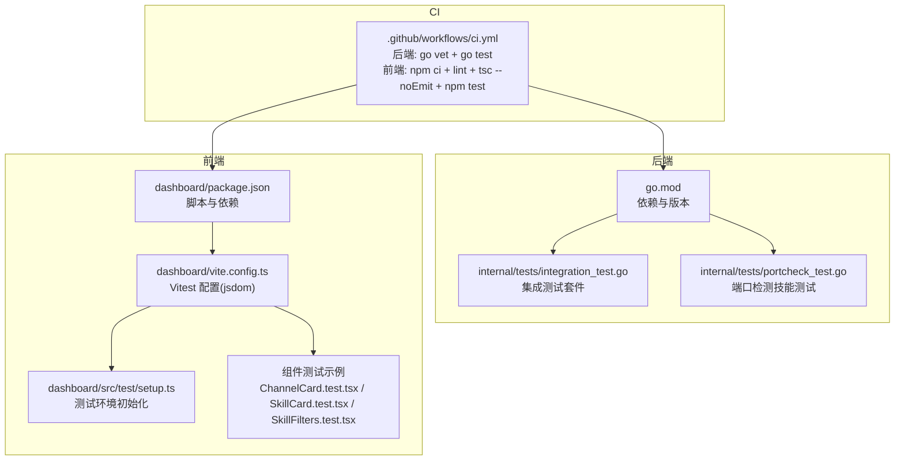
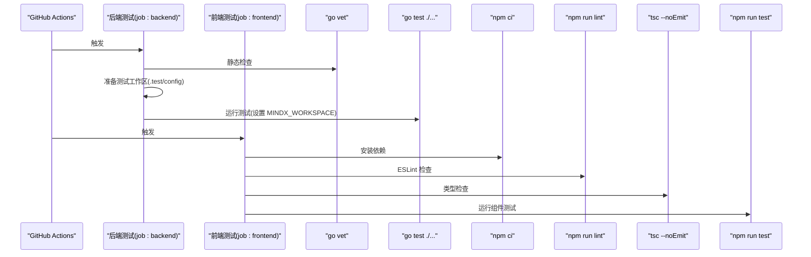
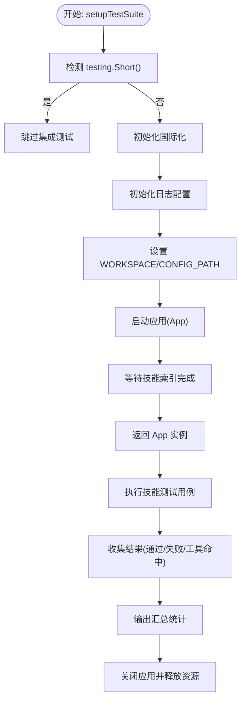
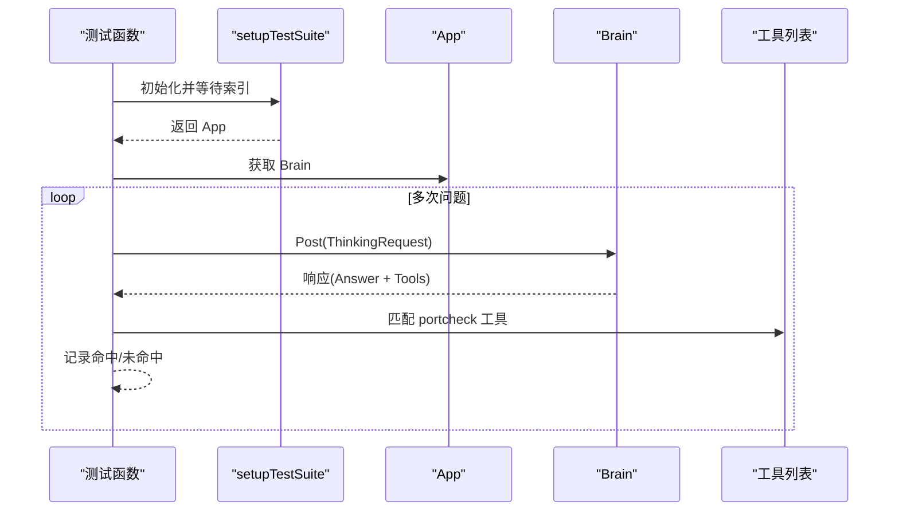
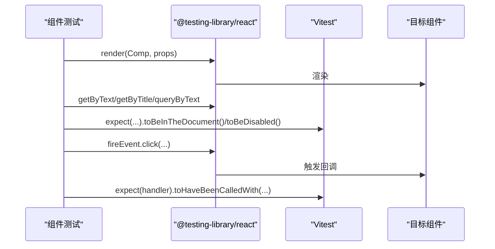
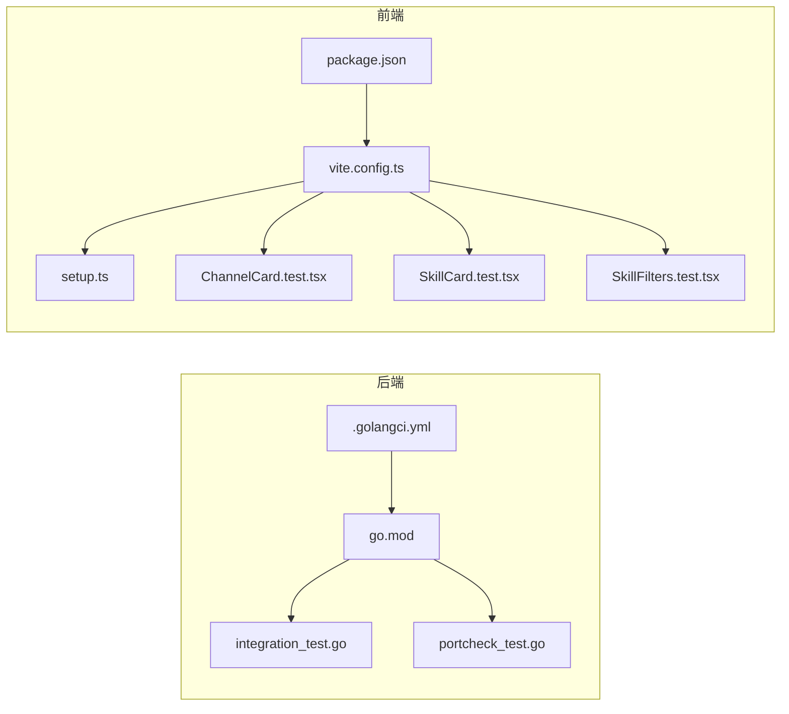

# 测试框架

<cite>
**本文引用的文件**
- [.github/workflows/ci.yml](file://.github/workflows/ci.yml)
- [go.mod](file://go.mod)
- [internal/tests/integration_test.go](file://internal/tests/integration_test.go)
- [internal/tests/portcheck_test.go](file://internal/tests/portcheck_test.go)
- [dashboard/package.json](file://dashboard/package.json)
- [dashboard/vite.config.ts](file://dashboard/vite.config.ts)
- [dashboard/src/test/setup.ts](file://dashboard/src/test/setup.ts)
- [dashboard/src/components/channels/ChannelCard.test.tsx](file://dashboard/src/components/channels/ChannelCard.test.tsx)
- [dashboard/src/components/skills/SkillCard.test.tsx](file://dashboard/src/components/skills/SkillCard.test.tsx)
- [dashboard/src/components/skills/SkillFilters.test.tsx](file://dashboard/src/components/skills/SkillFilters.test.tsx)
- [.golangci.yml](file://.golangci.yml)
- [dashboard/eslint.config.js](file://dashboard/eslint.config.js)
</cite>

## 目录
1. [简介](#简介)
2. [项目结构](#项目结构)
3. [核心组件](#核心组件)
4. [架构总览](#架构总览)
5. [详细组件分析](#详细组件分析)
6. [依赖分析](#依赖分析)
7. [性能考虑](#性能考虑)
8. [故障排查指南](#故障排查指南)
9. [结论](#结论)
10. [附录](#附录)

## 简介
本文件面向 MindX 测试框架，系统化梳理后端 Go 测试与前端 React/Vitest 测试的选型与配置，覆盖测试工具链（依赖、编译、质量检查）、测试数据管理策略（生成、存储、清理）、测试报告生成与分析方法、测试环境搭建与持续集成配置，以及框架扩展与定制建议。目标是帮助开发者快速理解并高效维护测试体系。

## 项目结构
MindX 的测试体系横跨后端 Go 与前端 React/Vitest 两部分：
- 后端：基于标准库 testing，集成自定义引导流程与日志配置，用于端到端技能集成测试。
- 前端：基于 Vitest + @testing-library/react，配合 Vite PWA 插件与 jsdom 环境，覆盖组件级单元测试。
- CI：GitHub Actions 分别执行后端 go vet、测试与前端 lint、类型检查、测试。

图表来源
- [.github/workflows/ci.yml](file://.github/workflows/ci.yml#L1-L49)
- [go.mod](file://go.mod#L1-L113)
- [internal/tests/integration_test.go](file://internal/tests/integration_test.go#L1-L259)
- [internal/tests/portcheck_test.go](file://internal/tests/portcheck_test.go#L1-L128)
- [dashboard/package.json](file://dashboard/package.json#L1-L58)
- [dashboard/vite.config.ts](file://dashboard/vite.config.ts#L1-L106)
- [dashboard/src/test/setup.ts](file://dashboard/src/test/setup.ts#L1-L2)
- [dashboard/src/components/channels/ChannelCard.test.tsx](file://dashboard/src/components/channels/ChannelCard.test.tsx#L1-L66)
- [dashboard/src/components/skills/SkillCard.test.tsx](file://dashboard/src/components/skills/SkillCard.test.tsx#L1-L84)
- [dashboard/src/components/skills/SkillFilters.test.tsx](file://dashboard/src/components/skills/SkillFilters.test.tsx#L1-L41)

章节来源
- [.github/workflows/ci.yml](file://.github/workflows/ci.yml#L1-L49)
- [go.mod](file://go.mod#L1-L113)
- [dashboard/package.json](file://dashboard/package.json#L1-L58)

## 核心组件
- 后端测试框架与工具链
  - 标准库 testing：用于编写集成测试与端到端测试。
  - go vet / golangci-lint：静态检查与规范约束。
  - testify：断言与辅助工具（在 go.mod 中声明）。
- 前端测试框架与工具链
  - Vitest：测试运行器与断言库。
  - @testing-library/react：DOM 测试最佳实践。
  - jsdom：在 Node 环境模拟浏览器 DOM。
  - ESLint + TypeScript ESLint：代码质量与规则校验。
- 测试数据与环境
  - 后端：通过环境变量 WORKSPACE、CONFIG_PATH 指定工作区与配置路径；测试前复制 config 到 .test/config 以隔离 CI 工作区。
  - 前端：通过 Vite PWA 插件与 jsdom 环境，统一 setupFiles 初始化。

章节来源
- [internal/tests/integration_test.go](file://internal/tests/integration_test.go#L1-L259)
- [internal/tests/portcheck_test.go](file://internal/tests/portcheck_test.go#L1-L128)
- [.golangci.yml](file://.golangci.yml#L1-L7)
- [dashboard/eslint.config.js](file://dashboard/eslint.config.js#L1-L29)
- [.github/workflows/ci.yml](file://.github/workflows/ci.yml#L19-L48)

## 架构总览
下图展示 CI 如何驱动后端与前端测试流水线，以及关键配置项对测试行为的影响。

图表来源
- [.github/workflows/ci.yml](file://.github/workflows/ci.yml#L1-L49)

## 详细组件分析

### 后端测试：集成与技能测试套件
- 测试入口与生命周期
  - 使用 testing.Short() 控制短测试跳过长耗时集成测试。
  - 通过全局单例 app 缓存，避免重复启动与资源浪费。
- 环境与配置
  - 设置 WORKSPACE 与 CONFIG_PATH，确保测试加载正确配置。
  - 复制 config 到 .test/config 并通过环境变量 MINDX_WORKSPACE 指定工作区。
- 日志与等待
  - 初始化日志配置，输出到临时文件以便定位问题。
  - 等待技能索引完成，避免测试在未就绪状态下执行。
- 测试用例组织
  - 统一的技能测试用例集，逐条验证工具匹配与响应有效性。
  - 提供“详细”测试用例，打印工具列表与响应，便于调试。

图表来源
- [internal/tests/integration_test.go](file://internal/tests/integration_test.go#L35-L89)
- [internal/tests/integration_test.go](file://internal/tests/integration_test.go#L128-L215)

章节来源
- [internal/tests/integration_test.go](file://internal/tests/integration_test.go#L1-L259)
- [.github/workflows/ci.yml](file://.github/workflows/ci.yml#L22-L30)

### 后端测试：端口检测技能专项测试
- 目标：验证“端口检测”技能在不同问题表述下的匹配与响应。
- 关键点：等待索引完成后发起多次提问，逐条断言工具命中情况。

图表来源
- [internal/tests/portcheck_test.go](file://internal/tests/portcheck_test.go#L83-L126)

章节来源
- [internal/tests/portcheck_test.go](file://internal/tests/portcheck_test.go#L1-L128)

### 前端测试：组件级单元测试
- 测试框架
  - Vitest 提供测试运行与断言能力；@testing-library/react 提供 DOM 查询与交互模拟。
  - jsdom 环境模拟浏览器 DOM，支持事件触发与可见性断言。
- 典型组件测试
  - ChannelCard：验证名称、启用状态、按钮显隐、点击回调等。
  - SkillCard：验证标签、统计信息、缺失二进制提示、按钮禁用状态等。
  - SkillFilters：验证筛选下拉框与回调触发。

图表来源
- [dashboard/src/components/channels/ChannelCard.test.tsx](file://dashboard/src/components/channels/ChannelCard.test.tsx#L1-L66)
- [dashboard/src/components/skills/SkillCard.test.tsx](file://dashboard/src/components/skills/SkillCard.test.tsx#L1-L84)
- [dashboard/src/components/skills/SkillFilters.test.tsx](file://dashboard/src/components/skills/SkillFilters.test.tsx#L1-L41)

章节来源
- [dashboard/src/components/channels/ChannelCard.test.tsx](file://dashboard/src/components/channels/ChannelCard.test.tsx#L1-L66)
- [dashboard/src/components/skills/SkillCard.test.tsx](file://dashboard/src/components/skills/SkillCard.test.tsx#L1-L84)
- [dashboard/src/components/skills/SkillFilters.test.tsx](file://dashboard/src/components/skills/SkillFilters.test.tsx#L1-L41)

### 前端测试环境与配置
- Vite 集成
  - 在 vite.config.ts 中启用 react 插件与 VitePWA 插件，并配置 jsdom 环境与 setupFiles。
  - 支持代理到后端服务，便于端到端联调。
- 测试初始化
  - setup.ts 引入 @testing-library/jest-dom，提供丰富的 DOM 断言。
- 脚本与依赖
  - package.json 中定义 lint、test、build 等脚本；devDependencies 包含 vitest、@testing-library/react、jsdom、typescript、typescript-eslint 等。

章节来源
- [dashboard/vite.config.ts](file://dashboard/vite.config.ts#L1-L106)
- [dashboard/src/test/setup.ts](file://dashboard/src/test/setup.ts#L1-L2)
- [dashboard/package.json](file://dashboard/package.json#L1-L58)

## 依赖分析
- 后端依赖
  - 标准库 testing 作为测试入口；testify 用于断言与辅助；golangci-lint 通过 .golangci.yml 启用 vet、errcheck、staticcheck、unused。
- 前端依赖
  - Vitest、@testing-library/react、jsdom、ESLint、TypeScript ESLint、React 生态等。

图表来源
- [go.mod](file://go.mod#L1-L113)
- [.golangci.yml](file://.golangci.yml#L1-L7)
- [internal/tests/integration_test.go](file://internal/tests/integration_test.go#L1-L259)
- [internal/tests/portcheck_test.go](file://internal/tests/portcheck_test.go#L1-L128)
- [dashboard/package.json](file://dashboard/package.json#L1-L58)
- [dashboard/vite.config.ts](file://dashboard/vite.config.ts#L1-L106)
- [dashboard/src/test/setup.ts](file://dashboard/src/test/setup.ts#L1-L2)
- [dashboard/src/components/channels/ChannelCard.test.tsx](file://dashboard/src/components/channels/ChannelCard.test.tsx#L1-L66)
- [dashboard/src/components/skills/SkillCard.test.tsx](file://dashboard/src/components/skills/SkillCard.test.tsx#L1-L84)
- [dashboard/src/components/skills/SkillFilters.test.tsx](file://dashboard/src/components/skills/SkillFilters.test.tsx#L1-L41)

章节来源
- [go.mod](file://go.mod#L1-L113)
- [.golangci.yml](file://.golangci.yml#L1-L7)
- [dashboard/package.json](file://dashboard/package.json#L1-L58)

## 性能考虑
- 后端集成测试
  - 使用全局缓存 app 实例，减少重复启动成本。
  - 通过等待技能索引完成，避免无效重试与资源浪费。
- 前端测试
  - 使用 jsdom 环境，避免真实浏览器开销；合理拆分测试文件，缩短单次运行时间。
  - 通过 Vite 的热更新与缓存机制提升开发体验与测试速度。

## 故障排查指南
- 后端测试常见问题
  - 索引未完成导致测试失败：确认等待逻辑与日志输出，必要时增加超时或重试。
  - 环境变量未设置：检查 WORKSPACE 与 CONFIG_PATH 是否正确指向 .test/config。
  - 日志定位：关注临时日志文件路径，结合测试输出定位问题。
- 前端测试常见问题
  - jsdom 环境不兼容：确认 setup.ts 已引入 @testing-library/jest-dom；检查 Vite 配置的 environment 与 setupFiles。
  - 事件未触发：使用 fireEvent 并确保元素可交互；检查按钮禁用状态与 actionLoading。
  - 类型错误：执行 tsc --noEmit 或 npm run build 以发现潜在类型问题。

章节来源
- [internal/tests/integration_test.go](file://internal/tests/integration_test.go#L48-L88)
- [internal/tests/portcheck_test.go](file://internal/tests/portcheck_test.go#L41-L81)
- [dashboard/vite.config.ts](file://dashboard/vite.config.ts#L64-L68)
- [dashboard/src/test/setup.ts](file://dashboard/src/test/setup.ts#L1-L2)

## 结论
MindX 的测试框架采用“后端标准库 + 前端 Vitest”的组合，配合 CI 自动化与质量检查工具，形成从静态检查到单元测试再到集成测试的完整闭环。通过合理的环境隔离、日志与等待机制，以及组件级测试用例，能够稳定支撑功能演进与回归验证。后续可在现有基础上扩展更多场景化测试与报告导出能力。

## 附录

### 测试工具链配置要点
- 后端
  - 静态检查：go vet；可选 golangci-lint（.golangci.yml 已启用 vet、errcheck、staticcheck、unused）。
  - 测试运行：go test ./...，CI 中通过 MINDX_WORKSPACE 指定测试工作区。
- 前端
  - 依赖安装：npm ci。
  - 代码质量：npm run lint（ESLint + TypeScript ESLint）。
  - 类型检查：tsc --noEmit。
  - 测试运行：npm run test（Vitest）。

章节来源
- [.github/workflows/ci.yml](file://.github/workflows/ci.yml#L19-L48)
- [.golangci.yml](file://.golangci.yml#L1-L7)
- [dashboard/eslint.config.js](file://dashboard/eslint.config.js#L1-L29)
- [dashboard/package.json](file://dashboard/package.json#L1-L58)

### 测试数据管理策略
- 生成
  - 后端：通过集成测试动态构造请求与断言，无需外部数据文件。
  - 前端：使用测试夹具（fixtures）构造 props，保证测试可重复。
- 存储
  - 后端：CI 将 config 复制到 .test/config，避免污染主仓库。
  - 前端：无持久化数据，测试结束后由 jsdom 环境回收。
- 清理
  - 后端：测试结束调用关闭流程，释放资源。
  - 前端：Vitest 进程退出即清理。

章节来源
- [.github/workflows/ci.yml](file://.github/workflows/ci.yml#L22-L30)
- [internal/tests/integration_test.go](file://internal/tests/integration_test.go#L91-L96)

### 测试报告与分析
- 后端
  - 当前通过日志与控制台输出汇总结果；可扩展为 JSON 报告并通过 CI artifacts 保存。
- 前端
  - Vitest 默认输出简洁报告；可通过 --reporter 选项切换格式（如 verbose、json），并结合 CI artifacts 导出报告。

章节来源
- [internal/tests/integration_test.go](file://internal/tests/integration_test.go#L193-L214)
- [dashboard/package.json](file://dashboard/package.json#L10-L10)

### 测试环境搭建与持续集成
- 本地
  - 后端：确保 go 版本与依赖满足要求；准备 config 到 .test/config；运行 go test ./...。
  - 前端：安装依赖后运行 npm run lint、tsc --noEmit、npm run test。
- CI
  - 后端：go vet + go test，设置 MINDX_WORKSPACE 指向 .test。
  - 前端：npm ci + lint + tsc --noEmit + npm run test。

章节来源
- [.github/workflows/ci.yml](file://.github/workflows/ci.yml#L1-L49)
- [dashboard/vite.config.ts](file://dashboard/vite.config.ts#L33-L48)

### 框架扩展与定制
- 后端
  - 新增测试：遵循现有 setup/teardown 模式，复用日志与等待逻辑。
  - 报告：引入 testify suite 或自定义 reporter，输出结构化结果。
- 前端
  - 新增组件测试：参考现有组件测试模式，统一断言风格与事件模拟。
  - 报告：配置 Vitest reporter 输出 JSON 并上传至 CI。
- 质量门禁
  - 后端：在 CI 中加入 golangci-lint 全量检查。
  - 前端：在 CI 中加入 lint 与 tsc，确保类型安全。

章节来源
- [internal/tests/integration_test.go](file://internal/tests/integration_test.go#L35-L89)
- [dashboard/src/components/channels/ChannelCard.test.tsx](file://dashboard/src/components/channels/ChannelCard.test.tsx#L1-L66)
- [dashboard/src/components/skills/SkillCard.test.tsx](file://dashboard/src/components/skills/SkillCard.test.tsx#L1-L84)
- [dashboard/src/components/skills/SkillFilters.test.tsx](file://dashboard/src/components/skills/SkillFilters.test.tsx#L1-L41)
- [.golangci.yml](file://.golangci.yml#L1-L7)
- [dashboard/eslint.config.js](file://dashboard/eslint.config.js#L1-L29)