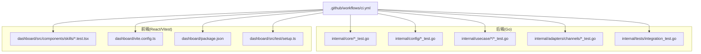
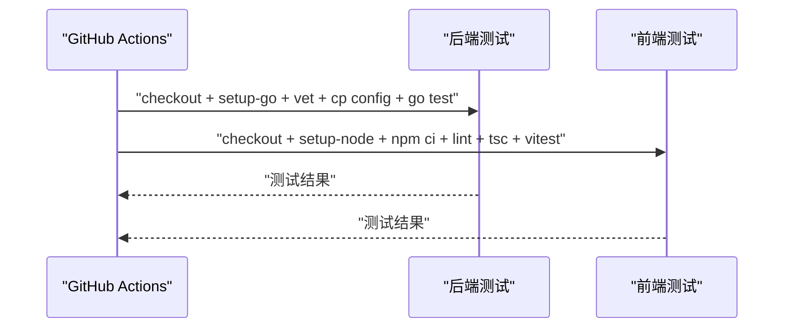
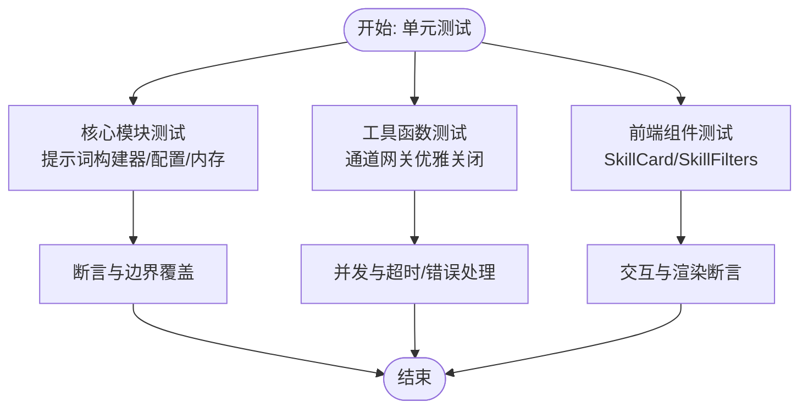
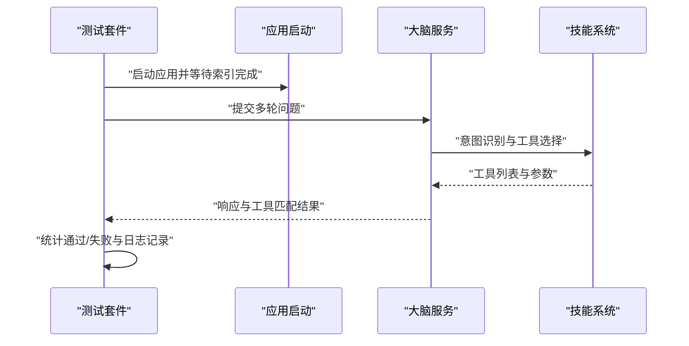
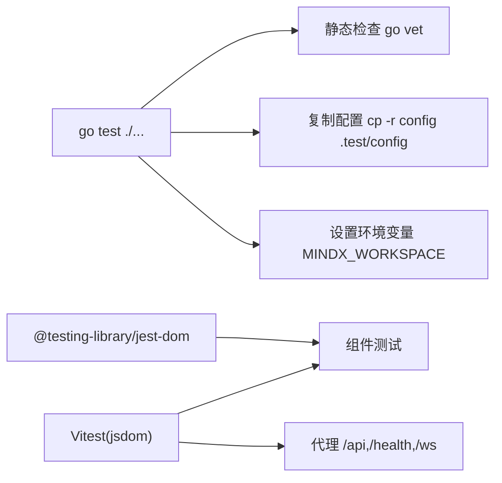
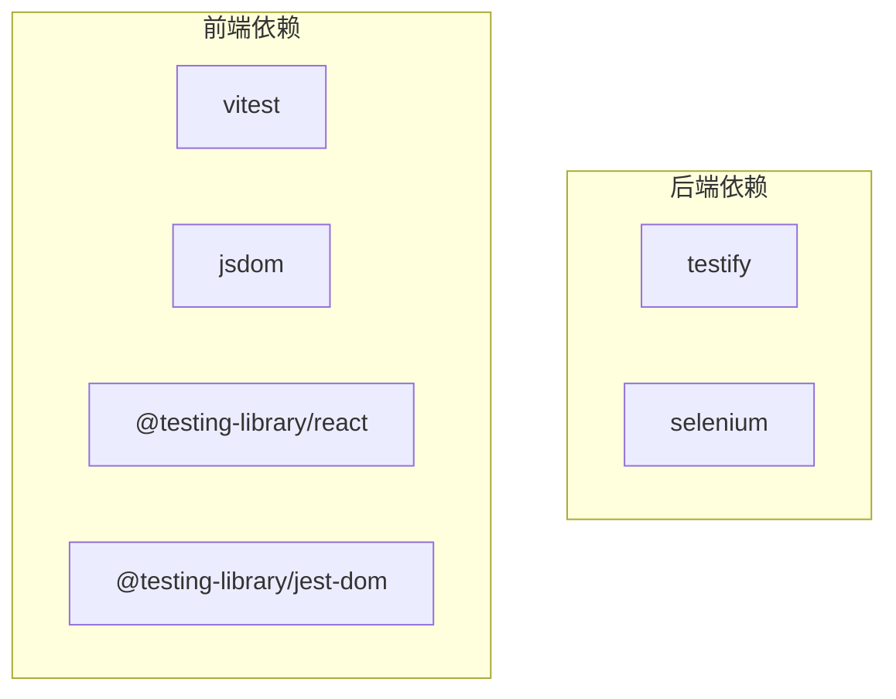

# 测试策略

<cite>
**本文引用的文件**
- [.github/workflows/ci.yml](file://.github/workflows/ci.yml)
- [go.mod](file://go.mod)
- [dashboard/vite.config.ts](file://dashboard/vite.config.ts)
- [dashboard/package.json](file://dashboard/package.json)
- [internal/tests/integration_test.go](file://internal/tests/integration_test.go)
- [internal/tests/portcheck_test.go](file://internal/tests/portcheck_test.go)
- [internal/core/prompt_builder_test.go](file://internal/core/prompt_builder_test.go)
- [internal/config/config_test.go](file://internal/config/config_test.go)
- [internal/usecase/memory/memory_internal_test.go](file://internal/usecase/memory/memory_internal_test.go)
- [internal/adapters/channels/gateway_graceful_shutdown_test.go](file://internal/adapters/channels/gateway_graceful_shutdown_test.go)
- [dashboard/src/components/skills/SkillCard.test.tsx](file://dashboard/src/components/skills/SkillCard.test.tsx)
- [dashboard/src/components/skills/SkillFilters.test.tsx](file://dashboard/src/components/skills/SkillFilters.test.tsx)
- [dashboard/src/test/setup.ts](file://dashboard/src/test/setup.ts)
</cite>

## 目录
1. [简介](#简介)
2. [项目结构](#项目结构)
3. [核心组件](#核心组件)
4. [架构总览](#架构总览)
5. [详细组件分析](#详细组件分析)
6. [依赖分析](#依赖分析)
7. [性能考虑](#性能考虑)
8. [故障排查指南](#故障排查指南)
9. [结论](#结论)
10. [附录](#附录)

## 简介
本文件面向 MindX 的测试策略与实施规范，覆盖单元测试、集成测试（含端到端与性能维度）、测试框架选择与配置、Mock 机制与测试数据管理、覆盖率与质量保障、以及测试自动化与持续集成。文档同时提供开发者可直接遵循的测试开发指南与最佳实践。

## 项目结构
MindX 采用前后端分离的测试组织方式：
- 后端（Go）：在各模块内部按功能域划分测试文件，如 core、config、usecase、adapters、infrastructure 等，便于定位与维护。
- 前端（React/Vite）：在 dashboard 子项目内使用 Vitest + jsdom 进行单元测试，组件测试集中在 src/components 下的对应文件中，并通过 vite.config.ts 配置测试环境与代理。

图表来源
- [.github/workflows/ci.yml](file://.github/workflows/ci.yml#L1-L49)
- [dashboard/vite.config.ts](file://dashboard/vite.config.ts#L64-L68)
- [dashboard/package.json](file://dashboard/package.json#L10-L11)

章节来源
- [.github/workflows/ci.yml](file://.github/workflows/ci.yml#L1-L49)
- [dashboard/vite.config.ts](file://dashboard/vite.config.ts#L1-L106)
- [dashboard/package.json](file://dashboard/package.json#L1-L58)

## 核心组件
- 后端测试框架与依赖
  - 使用标准库 testing 与 github.com/stretchr/testify 提供断言与测试辅助。
  - go.mod 中声明了测试相关依赖，如 testify、selenium（用于 UI 自动化测试）等。
- 前端测试框架与依赖
  - 使用 Vitest 作为测试运行器，jsdom 作为 DOM 环境；Testing Library 用于组件测试。
  - package.json 中定义了 test 脚本与 vitest 依赖。

章节来源
- [go.mod](file://go.mod#L1-L113)
- [dashboard/package.json](file://dashboard/package.json#L10-L11)
- [dashboard/vite.config.ts](file://dashboard/vite.config.ts#L64-L68)

## 架构总览
CI 流水线分别构建后端与前端测试任务：
- 后端：安装 Go、执行 go vet、复制配置到测试工作区、设置 MINDX_WORKSPACE 环境变量后运行 go test ./...。
- 前端：安装 Node.js、缓存依赖、执行 ESLint、类型检查、Vitest 测试。

图表来源
- [.github/workflows/ci.yml](file://.github/workflows/ci.yml#L9-L48)

章节来源
- [.github/workflows/ci.yml](file://.github/workflows/ci.yml#L1-L49)

## 详细组件分析

### 单元测试设计与实现
- 核心模块测试
  - 提示词构建器测试：覆盖本地/云端模型、思维链提示、关键词注入、输出格式完整性等场景，确保提示模板符合 v3.0 规范。
  - 配置加载测试：验证服务器配置加载、缺失文件与初始化错误路径。
  - 内存模块测试：涵盖时间权重、重复权重、强调权重、相似度计算、排序、摘要与关键词生成、余弦相似度、最优 K 值等算法细节。
- 工具函数测试
  - 通道网关优雅关闭测试：并发消息处理、活跃消息、多通道、超时、错误处理、上下文取消、通道停止错误等边界条件。
- 前端组件测试
  - SkillCard：渲染名称/描述/标签/统计信息、缺失二进制提示、按钮交互、格式转换按钮显示逻辑、加载态禁用等。
  - SkillFilters：状态与格式筛选下拉框渲染、变更事件回调、当前值反映。

章节来源
- [internal/core/prompt_builder_test.go](file://internal/core/prompt_builder_test.go#L1-L227)
- [internal/config/config_test.go](file://internal/config/config_test.go#L1-L56)
- [internal/usecase/memory/memory_internal_test.go](file://internal/usecase/memory/memory_internal_test.go#L1-L555)
- [internal/adapters/channels/gateway_graceful_shutdown_test.go](file://internal/adapters/channels/gateway_graceful_shutdown_test.go#L1-L268)
- [dashboard/src/components/skills/SkillCard.test.tsx](file://dashboard/src/components/skills/SkillCard.test.tsx#L1-L84)
- [dashboard/src/components/skills/SkillFilters.test.tsx](file://dashboard/src/components/skills/SkillFilters.test.tsx#L1-L41)

### 集成测试策略与实现
- 端到端测试
  - 全量技能测试：启动应用，等待技能索引完成，构造多条自然语言问题，验证大脑返回的工具匹配与回答非空。
  - 端口检查技能测试：针对 portcheck 技能，验证问题到工具匹配的正确性。
- 性能测试
  - 在内存模块测试中，对权重计算、相似度、排序等关键路径进行了数值精度与边界断言，间接体现性能与稳定性。
  - 通道网关优雅关闭测试中，通过并发消息与超时控制，验证系统在高负载与异常场景下的资源释放与稳定性。

图表来源
- [internal/tests/integration_test.go](file://internal/tests/integration_test.go#L128-L215)

章节来源
- [internal/tests/integration_test.go](file://internal/tests/integration_test.go#L1-L259)
- [internal/tests/portcheck_test.go](file://internal/tests/portcheck_test.go#L1-L128)
- [internal/usecase/memory/memory_internal_test.go](file://internal/usecase/memory/memory_internal_test.go#L1-L555)
- [internal/adapters/channels/gateway_graceful_shutdown_test.go](file://internal/adapters/channels/gateway_graceful_shutdown_test.go#L1-L268)

### 测试框架选择与配置
- 后端
  - 测试运行：go test ./...，配合 go vet 进行静态检查。
  - 配置复制：CI 中将 config 目录复制到 .test/config，测试时通过环境变量 MINDX_WORKSPACE 指定工作区。
- 前端
  - 测试运行：npm run test（Vitest），环境为 jsdom，全局断言由 @testing-library/jest-dom 提供。
  - 代理与开发服务器：vite.config.ts 配置 /api、/health、/ws 代理到后端服务端口，便于端到端联调。

图表来源
- [.github/workflows/ci.yml](file://.github/workflows/ci.yml#L22-L30)
- [dashboard/vite.config.ts](file://dashboard/vite.config.ts#L64-L87)
- [dashboard/src/test/setup.ts](file://dashboard/src/test/setup.ts#L1-L2)

章节来源
- [.github/workflows/ci.yml](file://.github/workflows/ci.yml#L1-L49)
- [dashboard/vite.config.ts](file://dashboard/vite.config.ts#L64-L87)
- [dashboard/src/test/setup.ts](file://dashboard/src/test/setup.ts#L1-L2)

### Mock 机制与测试数据管理
- 后端
  - 通道网关测试中使用 MockChannel 与嵌入式服务模拟器，隔离外部依赖，验证消息处理、并发与优雅关闭。
  - 配置测试通过临时目录与环境变量模拟工作区，避免污染真实配置。
- 前端
  - 组件测试通过局部 props 与 vi.fn() 创建回调桩，验证渲染与交互行为。
  - setup.ts 引入 jest-dom 匹配器，增强断言能力。

章节来源
- [internal/adapters/channels/gateway_graceful_shutdown_test.go](file://internal/adapters/channels/gateway_graceful_shutdown_test.go#L1-L268)
- [internal/config/config_test.go](file://internal/config/config_test.go#L1-L56)
- [dashboard/src/test/setup.ts](file://dashboard/src/test/setup.ts#L1-L2)
- [dashboard/src/components/skills/SkillCard.test.tsx](file://dashboard/src/components/skills/SkillCard.test.tsx#L1-L84)
- [dashboard/src/components/skills/SkillFilters.test.tsx](file://dashboard/src/components/skills/SkillFilters.test.tsx#L1-L41)

### 测试覆盖率与质量保证策略
- 覆盖率
  - 当前仓库未发现显式的覆盖率收集脚本或配置文件。建议在 CI 中引入覆盖率导出（如 go test -coverprofile=coverage.out ./...），并在前端使用 Vitest 的覆盖率选项。
- 质量保证
  - 静态检查：后端使用 go vet。
  - 类型检查与 Lint：前端使用 tsc 与 ESLint。
  - 断言一致性：统一使用 testify（Go）与 Testing Library（React）。

章节来源
- [.github/workflows/ci.yml](file://.github/workflows/ci.yml#L19-L48)
- [dashboard/package.json](file://dashboard/package.json#L9-L10)

### 测试自动化与持续集成
- CI 任务
  - 后端 Job：安装 Go、复制配置、设置工作区、执行 go test ./...。
  - 前端 Job：安装 Node、缓存依赖、ESLint、类型检查、Vitest。
- 建议增强
  - 添加覆盖率报告与质量门禁。
  - 将后端测试输出与前端测试输出归档以便审计。

章节来源
- [.github/workflows/ci.yml](file://.github/workflows/ci.yml#L1-L49)

## 依赖分析
- 后端依赖
  - 测试依赖 testify 用于断言与 require/assert。
  - selenium 作为 UI 自动化测试依赖。
- 前端依赖
  - Vitest、jsdom、@testing-library/react/jest-dom。
  - ESLint、TypeScript、TailwindCSS、Less 等开发工具链。

图表来源
- [go.mod](file://go.mod#L22-L23)
- [dashboard/package.json](file://dashboard/package.json#L40-L55)

章节来源
- [go.mod](file://go.mod#L1-L113)
- [dashboard/package.json](file://dashboard/package.json#L1-L58)

## 性能考虑
- 单元测试中的数值断言与边界覆盖有助于稳定性能表现，例如权重计算、相似度与排序的精度控制。
- 集成测试中的并发与超时控制，验证系统在高负载下的稳定性与资源释放能力。
- 前端组件测试关注渲染与交互开销，避免不必要的重渲染与无效断言。

## 故障排查指南
- 后端
  - 集成测试跳过：使用 testing.Short() 跳过耗时集成测试，可在本地快速运行单元测试。
  - 日志配置：通过 LoggingConfig 设置系统日志级别与输出路径，便于定位问题。
  - 环境变量：确认 MINDX_WORKSPACE 与 CONFIG_PATH 正确指向测试配置。
- 前端
  - 测试环境：确保 jsdom 环境与代理配置正确，避免跨域导致的请求失败。
  - 组件交互：使用 fireEvent 与断言组合验证用户交互是否触发预期回调。

章节来源
- [internal/tests/integration_test.go](file://internal/tests/integration_test.go#L35-L38)
- [internal/tests/integration_test.go](file://internal/tests/integration_test.go#L48-L61)
- [internal/tests/integration_test.go](file://internal/tests/integration_test.go#L63-L66)
- [dashboard/vite.config.ts](file://dashboard/vite.config.ts#L64-L87)
- [dashboard/src/components/skills/SkillCard.test.tsx](file://dashboard/src/components/skills/SkillCard.test.tsx#L60-L66)

## 结论
MindX 的测试体系以“单元测试为核心、集成测试为补充、前端组件测试为抓手”，结合 CI 的自动化流水线，形成从静态检查到端到端验证的完整闭环。建议后续引入覆盖率统计与质量门禁，进一步提升测试质量与交付可靠性。

## 附录
- 开发者测试指南与最佳实践
  - 单元测试
    - 使用 testify 的断言风格保持一致；为边界条件编写明确的测试用例。
    - 对算法模块（如权重、相似度、排序）进行数值精度断言。
  - 集成测试
    - 使用环境变量与临时目录隔离配置；等待异步索引完成后再发起请求。
    - 对关键路径（工具匹配、响应非空）进行断言。
  - 前端测试
    - 使用 Testing Library 的语义化断言；为交互行为提供回调桩。
    - 通过 vite.config.ts 的代理配置与后端联调，减少环境差异。
  - Mock 与数据
    - 后端优先使用结构体桩与嵌入式服务；前端使用 vi.fn() 与局部 props。
    - 避免共享可变状态，必要时使用独立的临时目录或数据库实例。
  - 覆盖率与质量
    - 建议在 CI 中启用覆盖率导出与报告；结合 ESLint 与 tsc 保证代码质量。