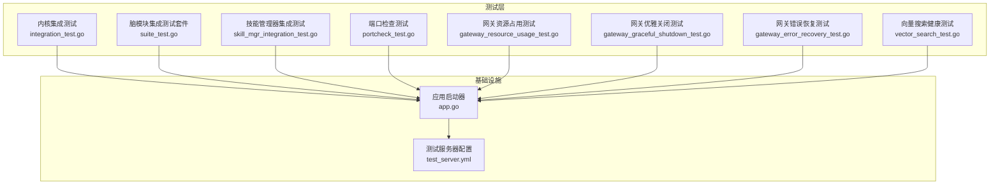
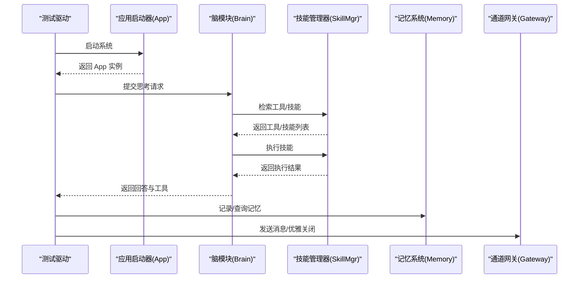
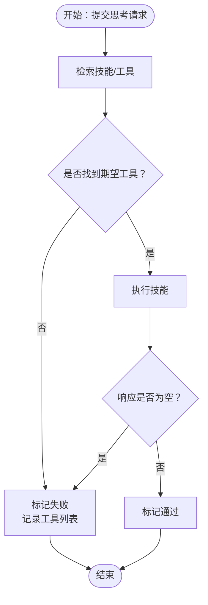
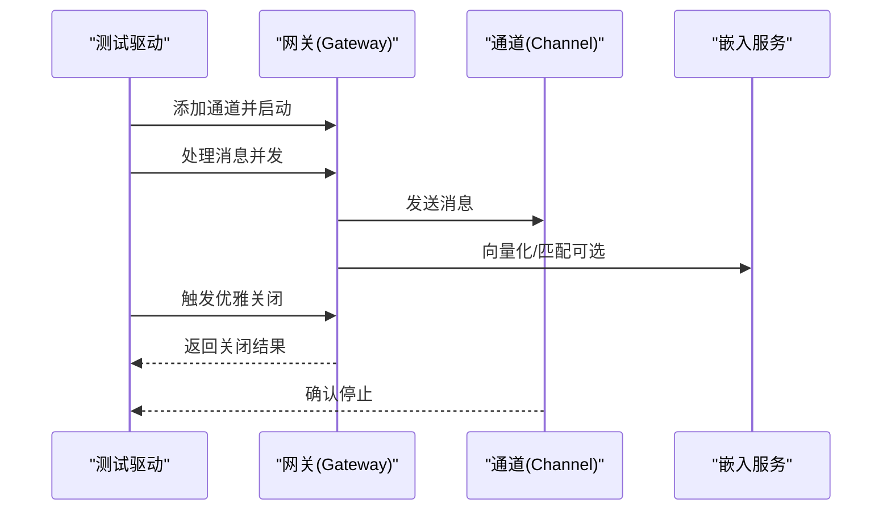
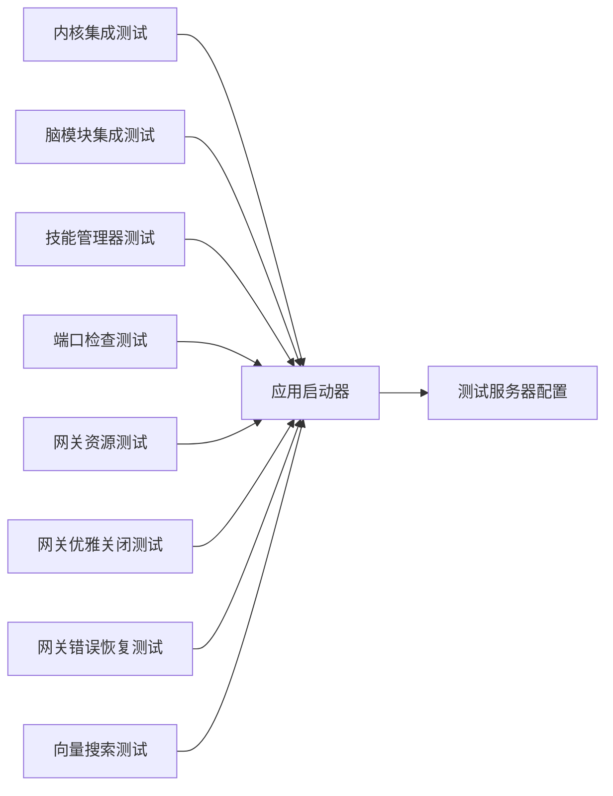

# 集成测试

<cite>
**本文引用的文件**
- [integration_test.go](file://internal/tests/integration_test.go)
- [suite_test.go](file://internal/usecase/brain/suite_test.go)
- [skill_mgr_integration_test.go](file://internal/usecase/skills/skill_mgr_integration_test.go)
- [gateway_graceful_shutdown_test.go](file://internal/adapters/channels/gateway_graceful_shutdown_test.go)
- [gateway_resource_usage_test.go](file://internal/adapters/channels/gateway_resource_usage_test.go)
- [gateway_error_recovery_test.go](file://internal/adapters/channels/gateway_error_recovery_test.go)
- [vector_search_test.go](file://internal/usecase/skills/vector_search_test.go)
- [portcheck_test.go](file://internal/tests/portcheck_test.go)
- [ci.yml](file://.github/workflows/ci.yml)
- [test_server.yml](file://config/test_server.yml)
- [app.go](file://internal/infrastructure/bootstrap/app.go)
</cite>

## 目录
1. [简介](#简介)
2. [项目结构](#项目结构)
3. [核心组件](#核心组件)
4. [架构总览](#架构总览)
5. [详细组件分析](#详细组件分析)
6. [依赖分析](#依赖分析)
7. [性能考虑](#性能考虑)
8. [故障排查指南](#故障排查指南)
9. [结论](#结论)
10. [附录](#附录)

## 简介
本文件面向 MindX 的端到端集成测试，系统性阐述系统启动测试、技能执行测试与内存管理测试的设计与实现。文档覆盖测试环境配置、数据准备、测试套件初始化与清理流程、测试场景设计（正常流程与异常场景）、测试结果验证方法与性能指标监控，并提供执行策略与调试技巧，以及完整的测试用例与测试报告分析建议。

## 项目结构
MindX 的集成测试分布在多个层次：
- 内核层集成测试：负责系统启动、技能执行与基础流程验证
- 脑模块集成测试：基于真实组件（记忆、技能管理器）进行端到端验证
- 通道适配器测试：验证网关在优雅关闭、资源占用、错误恢复等方面的稳定性
- 技能管理器测试：验证技能检索、执行、并发与向量搜索链路健康
- 端口检查专项测试：验证特定技能在真实系统中的行为

图表来源
- [integration_test.go](file://internal/tests/integration_test.go#L35-L89)
- [suite_test.go](file://internal/usecase/brain/suite_test.go#L119-L252)
- [skill_mgr_integration_test.go](file://internal/usecase/skills/skill_mgr_integration_test.go#L46-L84)
- [gateway_graceful_shutdown_test.go](file://internal/adapters/channels/gateway_graceful_shutdown_test.go#L15-L46)
- [gateway_resource_usage_test.go](file://internal/adapters/channels/gateway_resource_usage_test.go#L15-L60)
- [gateway_error_recovery_test.go](file://internal/adapters/channels/gateway_error_recovery_test.go#L13-L49)
- [vector_search_test.go](file://internal/usecase/skills/vector_search_test.go#L24-L112)
- [portcheck_test.go](file://internal/tests/portcheck_test.go#L32-L127)
- [app.go](file://internal/infrastructure/bootstrap/app.go#L66-L200)
- [test_server.yml](file://config/test_server.yml#L1-L35)

章节来源
- [integration_test.go](file://internal/tests/integration_test.go#L1-L259)
- [suite_test.go](file://internal/usecase/brain/suite_test.go#L1-L334)
- [skill_mgr_integration_test.go](file://internal/usecase/skills/skill_mgr_integration_test.go#L1-L378)
- [gateway_graceful_shutdown_test.go](file://internal/adapters/channels/gateway_graceful_shutdown_test.go#L1-L268)
- [gateway_resource_usage_test.go](file://internal/adapters/channels/gateway_resource_usage_test.go#L1-L287)
- [gateway_error_recovery_test.go](file://internal/adapters/channels/gateway_error_recovery_test.go#L1-L238)
- [vector_search_test.go](file://internal/usecase/skills/vector_search_test.go#L1-L156)
- [portcheck_test.go](file://internal/tests/portcheck_test.go#L1-L128)
- [app.go](file://internal/infrastructure/bootstrap/app.go#L1-L200)
- [test_server.yml](file://config/test_server.yml#L1-L35)

## 核心组件
- 应用启动器（App）：负责加载环境变量、创建工作区、初始化日志、配置模型与向量化服务、会话管理、记忆系统、Token 使用仓库、技能管理器与能力管理器等。启动完成后，系统进入可测试状态。
- 脑模块（Brain）：整合记忆、技能管理器、工具调用、历史请求与日志，提供统一的思考接口。
- 技能管理器（SkillMgr）：负责技能加载、检索、执行、启用/禁用、并发安全与向量索引维护。
- 通道网关（Gateway）：负责多通道消息路由、上下文管理、优雅关闭、错误恢复与资源占用控制。
- 向量搜索链路：基于 Ollama Embedding 与 Badger 向量存储，保障技能检索走向量路径而非关键字回退。

章节来源
- [app.go](file://internal/infrastructure/bootstrap/app.go#L66-L200)
- [suite_test.go](file://internal/usecase/brain/suite_test.go#L119-L252)
- [skill_mgr_integration_test.go](file://internal/usecase/skills/skill_mgr_integration_test.go#L46-L84)
- [vector_search_test.go](file://internal/usecase/skills/vector_search_test.go#L24-L112)

## 架构总览
集成测试围绕“系统启动—技能执行—内存管理—通道稳定性”四条主线展开，形成闭环验证。

图表来源
- [integration_test.go](file://internal/tests/integration_test.go#L128-L215)
- [suite_test.go](file://internal/usecase/brain/suite_test.go#L281-L307)
- [app.go](file://internal/infrastructure/bootstrap/app.go#L52-L62)

## 详细组件分析

### 系统启动测试
- 目标：验证应用启动流程、工作区与配置初始化、日志系统、向量化服务、会话管理、记忆系统、Token 使用仓库、技能管理器与能力管理器的正确装配。
- 关键点：
  - 环境变量设置（工作区、配置路径）
  - 日志配置与输出路径
  - 向量化服务与模型选择
  - 向量存储类型与路径
  - 会话管理器与默认模型参数
  - 记忆系统初始化与嵌入服务
  - Token 使用仓库初始化
- 验证方法：启动后检查 App 字段完整性；等待技能向量索引完成；执行一次思考请求验证链路可用。

章节来源
- [integration_test.go](file://internal/tests/integration_test.go#L35-L89)
- [app.go](file://internal/infrastructure/bootstrap/app.go#L66-L200)

### 技能执行测试
- 目标：验证技能检索、工具匹配与执行的端到端流程。
- 关键点：
  - 技能检索：无关键词返回全部技能；带关键词按相似度排序
  - 工具匹配：思考请求返回的工具列表应包含期望工具
  - 执行验证：响应非空、工具被调用
- 场景设计：
  - 正常流程：覆盖常见技能（天气、系统信息、终端、计算器、文件操作、网络等）
  - 异常场景：技能不存在、关键词不匹配、响应为空
- 验证方法：统计通过/失败计数，记录工具发现与调用状态，输出汇总报告。

图表来源
- [integration_test.go](file://internal/tests/integration_test.go#L128-L215)

章节来源
- [integration_test.go](file://internal/tests/integration_test.go#L98-L215)
- [skill_mgr_integration_test.go](file://internal/usecase/skills/skill_mgr_integration_test.go#L96-L219)

### 内存管理测试
- 目标：验证记忆系统的权重计算、关键词相似度、向量相似度、摘要与关键词生成、K 值选择等内部算法的正确性与稳定性。
- 关键点：
  - 时间权重、重复权重、强调权重与总权重计算
  - 分词与关键词相似度
  - 余弦相似度与 K 值选择
  - 摘要与关键词生成的降级处理
- 验证方法：针对每个函数编写边界与典型场景测试，断言数值范围与排序正确性。

章节来源
- [memory_internal_test.go](file://internal/usecase/memory/memory_internal_test.go#L12-L555)

### 通道网关测试
- 优雅关闭测试：验证在消息处理过程中优雅关闭，确保所有消息被处理、通道停止。
- 资源占用测试：验证在高并发、多会话、通道切换、嵌入缓存与内存压力下的内存增长与 goroutine 泄漏控制。
- 错误恢复测试：验证连续错误、多通道错误、panic 恢复、消息转发后的正确性与稳定性。

图表来源
- [gateway_graceful_shutdown_test.go](file://internal/adapters/channels/gateway_graceful_shutdown_test.go#L15-L46)
- [gateway_resource_usage_test.go](file://internal/adapters/channels/gateway_resource_usage_test.go#L15-L60)
- [gateway_error_recovery_test.go](file://internal/adapters/channels/gateway_error_recovery_test.go#L13-L49)

章节来源
- [gateway_graceful_shutdown_test.go](file://internal/adapters/channels/gateway_graceful_shutdown_test.go#L15-L268)
- [gateway_resource_usage_test.go](file://internal/adapters/channels/gateway_resource_usage_test.go#L15-L287)
- [gateway_error_recovery_test.go](file://internal/adapters/channels/gateway_error_recovery_test.go#L13-L238)

### 向量搜索链路健康测试
- 目标：确保向量搜索不退化为关键字搜索，验证嵌入模型可用、向量生成、索引建立、搜索走向量路径与结果正确性。
- 关键点：
  - 嵌入模型可用性与向量维度校验
  - 技能向量索引建立与非空校验
  - 关键词搜索走向量路径，期望技能排在首位

章节来源
- [vector_search_test.go](file://internal/usecase/skills/vector_search_test.go#L24-L156)

### 端口检查专项测试
- 目标：验证端口检查技能在真实系统中的行为，确保技能被正确识别与执行。
- 关键点：
  - 系统启动后等待索引完成
  - 提交端口检查问题，验证工具匹配与响应

章节来源
- [portcheck_test.go](file://internal/tests/portcheck_test.go#L32-L127)

## 依赖分析
- 测试套件依赖关系：
  - 内核集成测试依赖应用启动器与脑模块
  - 脑模块集成测试依赖真实记忆、技能管理器与会话管理器
  - 通道测试依赖网关与嵌入服务
  - 技能管理器测试依赖嵌入服务与 Ollama 模型
- 外部依赖：
  - Ollama 服务（嵌入与推理）
  - Badger/SQLite 向量存储
  - 环境变量与配置文件（测试服务器配置）

图表来源
- [integration_test.go](file://internal/tests/integration_test.go#L35-L89)
- [suite_test.go](file://internal/usecase/brain/suite_test.go#L119-L252)
- [skill_mgr_integration_test.go](file://internal/usecase/skills/skill_mgr_integration_test.go#L46-L84)
- [gateway_resource_usage_test.go](file://internal/adapters/channels/gateway_resource_usage_test.go#L15-L60)
- [gateway_graceful_shutdown_test.go](file://internal/adapters/channels/gateway_graceful_shutdown_test.go#L15-L46)
- [gateway_error_recovery_test.go](file://internal/adapters/channels/gateway_error_recovery_test.go#L13-L49)
- [vector_search_test.go](file://internal/usecase/skills/vector_search_test.go#L24-L112)
- [portcheck_test.go](file://internal/tests/portcheck_test.go#L32-L127)
- [app.go](file://internal/infrastructure/bootstrap/app.go#L66-L200)
- [test_server.yml](file://config/test_server.yml#L1-L35)

## 性能考虑
- 资源占用监控：
  - 使用 runtime.MemStats 与 goroutine 数量监控内存增长与 goroutine 泄漏
  - 验证在高并发（1000+ 消息）与多会话场景下的内存上限
- 向量搜索性能：
  - 确保嵌入模型可用与索引建立，避免关键字回退导致性能下降
- 并发与阻塞：
  - 脑模块集成测试明确标注需串行执行，避免 Ollama 并发限制
- 指标暴露：
  - 可参考项目中的 Prometheus 指标定义，扩展到集成测试报告中

章节来源
- [gateway_resource_usage_test.go](file://internal/adapters/channels/gateway_resource_usage_test.go#L15-L287)
- [vector_search_test.go](file://internal/usecase/skills/vector_search_test.go#L24-L156)
- [suite_test.go](file://internal/usecase/brain/suite_test.go#L104-L105)

## 故障排查指南
- 启动失败：
  - 检查环境变量（WORKSPACE、CONFIG_PATH）与配置文件路径
  - 查看系统日志输出路径与权限
- 技能未匹配：
  - 确认技能向量索引已完成（等待 IsReIndexing 为 false）
  - 核对技能标签与关键词是否正确
- 通道关闭异常：
  - 检查优雅关闭超时与活跃消息数量
  - 验证通道停止错误是否被吞没
- 资源异常：
  - 关注内存增长阈值与 goroutine 泄漏
  - 检查嵌入缓存大小与向量表非空性
- 错误恢复：
  - 观察连续错误与 panic 恢复后的状态
  - 确认错误响应消息是否正确发送

章节来源
- [integration_test.go](file://internal/tests/integration_test.go#L35-L89)
- [gateway_graceful_shutdown_test.go](file://internal/adapters/channels/gateway_graceful_shutdown_test.go#L131-L171)
- [gateway_resource_usage_test.go](file://internal/adapters/channels/gateway_resource_usage_test.go#L209-L287)
- [gateway_error_recovery_test.go](file://internal/adapters/channels/gateway_error_recovery_test.go#L199-L238)

## 结论
MindX 的集成测试体系以应用启动器为核心，串联脑模块、技能管理器与通道网关，覆盖系统启动、技能执行、内存管理与通道稳定性四大维度。通过严格的环境配置、数据准备与测试套件生命周期管理，结合资源占用与错误恢复等异常场景验证，确保系统在真实工作负载下的可靠性与性能表现。建议在持续集成中固定 Ollama 与嵌入模型版本，强化向量搜索健康检查与并发限制策略，进一步提升测试稳定性与可重复性。

## 附录

### 测试执行策略
- CI 策略：
  - 后端作业：准备测试工作区、设置 MINDX_WORKSPACE、执行 go test ./...
  - 前端作业：Node 环境、依赖安装、类型检查与测试
- 本地执行：
  - 设置 WORKSPACE 与 CONFIG_PATH
  - 准备 .test/config 与技能向量数据
  - 运行 go test ./internal/tests ./internal/usecase/... ./internal/adapters/... -v

章节来源
- [ci.yml](file://.github/workflows/ci.yml#L22-L30)

### 测试环境配置与数据准备
- 环境变量：
  - WORKSPACE：指向测试工作区
  - CONFIG_PATH：指向 config 目录
- 配置文件：
  - test_server.yml：定义模型、嵌入服务、向量存储与片段生成配置
- 数据准备：
  - 技能向量数据放置于 .test/skill_vectors
  - 记忆与会话数据放置于测试工作区的 memory 与 sessions 目录

章节来源
- [integration_test.go](file://internal/tests/integration_test.go#L56-L66)
- [test_server.yml](file://config/test_server.yml#L1-L35)

### 测试结果验证与报告分析
- 验证方法：
  - 技能测试：统计通过/失败计数，记录工具发现与调用状态
  - 资源测试：断言内存增长阈值与 goroutine 数量
  - 关闭测试：断言消息处理完成与通道停止
  - 错误恢复：断言错误计数、成功计数与消息发送数量
- 报告建议：
  - 输出每项测试的通过率、失败详情与性能指标
  - 对异常场景提供重试与降级策略建议

章节来源
- [integration_test.go](file://internal/tests/integration_test.go#L193-L215)
- [gateway_resource_usage_test.go](file://internal/adapters/channels/gateway_resource_usage_test.go#L57-L105)
- [gateway_graceful_shutdown_test.go](file://internal/adapters/channels/gateway_graceful_shutdown_test.go#L40-L46)
- [gateway_error_recovery_test.go](file://internal/adapters/channels/gateway_error_recovery_test.go#L41-L49)