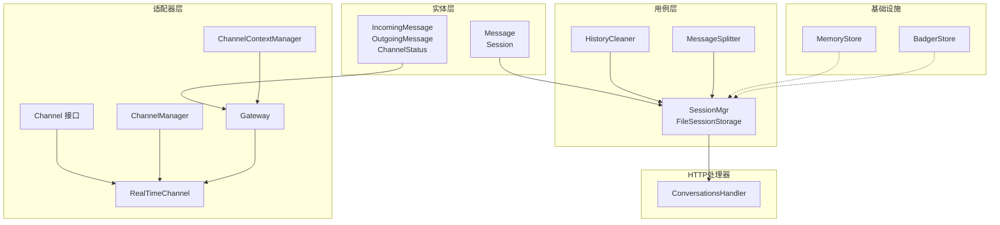
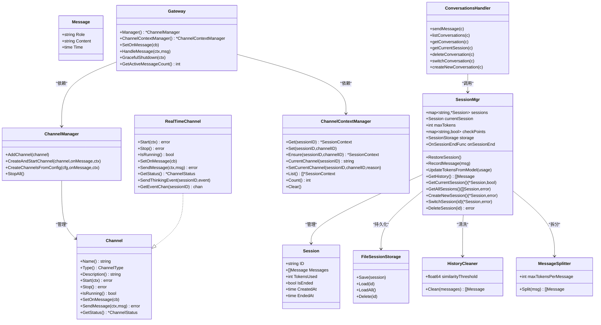
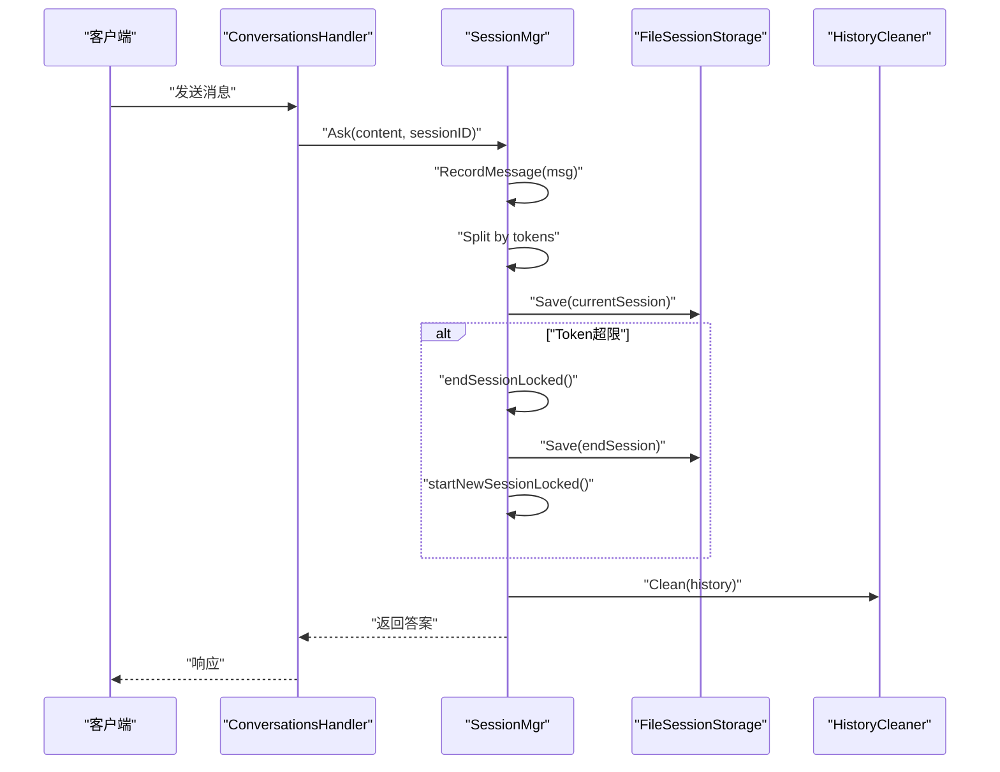
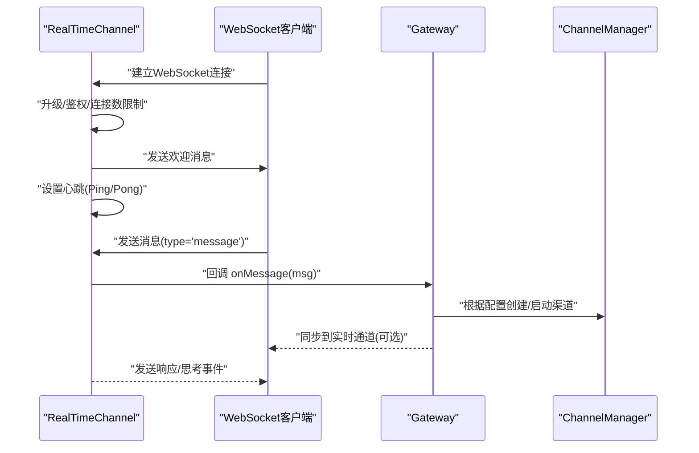
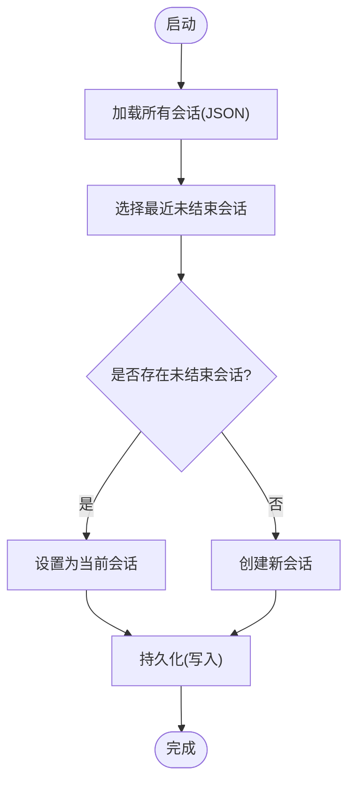
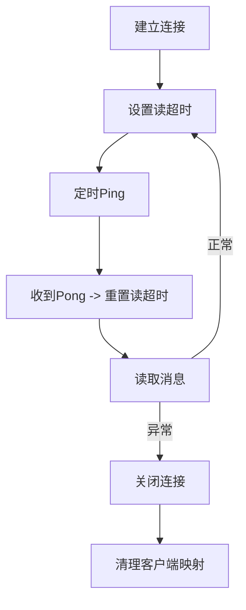
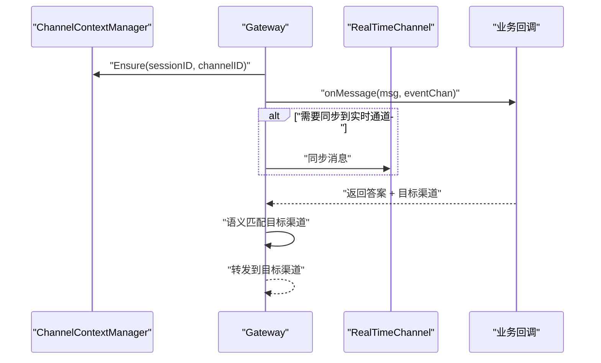
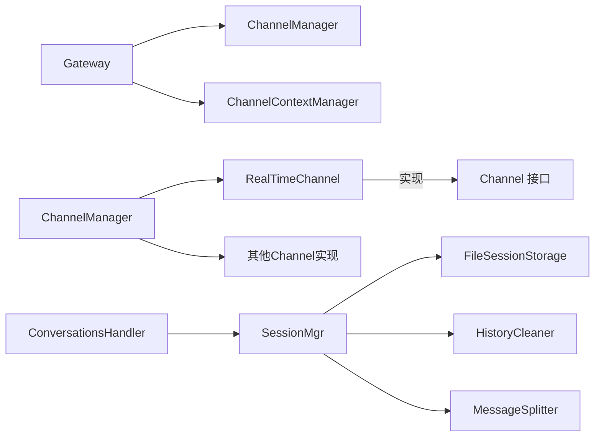

# 会话管理

<cite>
**本文引用的文件**
- [internal/entity/session.go](file://internal/entity/session.go)
- [internal/usecase/session/session_mgr.go](file://internal/usecase/session/session_mgr.go)
- [internal/usecase/session/history_cleaner.go](file://internal/usecase/session/history_cleaner.go)
- [internal/usecase/session/message_splitter.go](file://internal/usecase/session/message_splitter.go)
- [internal/adapters/channels/session.go](file://internal/adapters/channels/session.go)
- [internal/adapters/channels/realtime.go](file://internal/adapters/channels/realtime.go)
- [internal/adapters/channels/manager.go](file://internal/adapters/channels/manager.go)
- [internal/adapters/channels/gateway.go](file://internal/adapters/channels/gateway.go)
- [internal/core/channel.go](file://internal/core/channel.go)
- [internal/entity/channel.go](file://internal/entity/channel.go)
- [internal/adapters/http/handlers/conversations.go](file://internal/adapters/http/handlers/conversations.go)
- [config/channels.yml](file://config/channels.yml)
- [internal/infrastructure/persistence/memory_store.go](file://internal/infrastructure/persistence/memory_store.go)
- [internal/infrastructure/persistence/badger_store.go](file://internal/infrastructure/persistence/badger_store.go)
</cite>

## 目录
1. [简介](#简介)
2. [项目结构](#项目结构)
3. [核心组件](#核心组件)
4. [架构总览](#架构总览)
5. [详细组件分析](#详细组件分析)
6. [依赖关系分析](#依赖关系分析)
7. [性能考量](#性能考量)
8. [故障排查指南](#故障排查指南)
9. [结论](#结论)
10. [附录](#附录)

## 简介
本文件面向 MindX 渠道会话管理，系统性梳理会话生命周期（创建、维护、销毁）、实时与非实时会话差异、会话状态持久化与恢复、超时与心跳、连接管理策略、多渠道协调与冲突处理、数据结构设计、性能优化与内存管理，并提供调试与监控指引。文档以代码为依据，辅以可视化图示帮助理解。

## 项目结构
MindX 的会话管理横跨“实体层”、“用例层”、“适配器层”和“基础设施层”，围绕会话实体、会话管理器、消息拆分与清洗、渠道适配器、网关路由与上下文管理展开；同时通过 HTTP 处理器对外提供对话接口。

**图表来源**
- [internal/entity/session.go](file://internal/entity/session.go#L7-L22)
- [internal/usecase/session/session_mgr.go](file://internal/usecase/session/session_mgr.go#L16-L46)
- [internal/usecase/session/history_cleaner.go](file://internal/usecase/session/history_cleaner.go#L11-L21)
- [internal/usecase/session/message_splitter.go](file://internal/usecase/session/message_splitter.go#L9-L19)
- [internal/core/channel.go](file://internal/core/channel.go#L8-L40)
- [internal/adapters/channels/realtime.go](file://internal/adapters/channels/realtime.go#L18-L78)
- [internal/adapters/channels/manager.go](file://internal/adapters/channels/manager.go#L15-L29)
- [internal/adapters/channels/session.go](file://internal/adapters/channels/session.go#L11-L36)
- [internal/adapters/channels/gateway.go](file://internal/adapters/channels/gateway.go#L15-L31)
- [internal/adapters/http/handlers/conversations.go](file://internal/adapters/http/handlers/conversations.go#L19-L52)
- [internal/infrastructure/persistence/memory_store.go](file://internal/infrastructure/persistence/memory_store.go#L13-L30)
- [internal/infrastructure/persistence/badger_store.go](file://internal/infrastructure/persistence/badger_store.go#L16-L45)

**章节来源**
- [internal/entity/session.go](file://internal/entity/session.go#L1-L23)
- [internal/usecase/session/session_mgr.go](file://internal/usecase/session/session_mgr.go#L1-L128)
- [internal/adapters/channels/realtime.go](file://internal/adapters/channels/realtime.go#L1-L126)
- [internal/adapters/channels/manager.go](file://internal/adapters/channels/manager.go#L1-L147)
- [internal/adapters/channels/session.go](file://internal/adapters/channels/session.go#L1-L177)
- [internal/adapters/channels/gateway.go](file://internal/adapters/channels/gateway.go#L1-L200)
- [internal/adapters/http/handlers/conversations.go](file://internal/adapters/http/handlers/conversations.go#L1-L200)
- [internal/infrastructure/persistence/memory_store.go](file://internal/infrastructure/persistence/memory_store.go#L1-L177)
- [internal/infrastructure/persistence/badger_store.go](file://internal/infrastructure/persistence/badger_store.go#L1-L264)

## 核心组件
- 会话实体与消息
  - Message：角色、内容、时间
  - Session：会话ID、消息列表、Token用量、结束标记、创建/结束时间
- 会话管理器
  - SessionMgr：会话集合、当前会话、最大Token、检查点、存储、历史清洗器、消息拆分器、日志、结束回调
  - FileSessionStorage：文件持久化（保存、加载全部、删除）
- 历史清洗器
  - HistoryCleaner：去重（完全相同、相似度阈值）、相似度计算（编辑距离）
- 消息拆分器
  - MessageSplitter：按Token拆分（段落边界、句子边界、强制空格拆分）
- 渠道适配器
  - Channel 接口：名称、类型、描述、启动/停止、运行状态、消息回调、发送消息、状态查询
  - RealTimeChannel：WebSocket 实时通道（升级、心跳、消息处理、发送、状态）
  - ChannelManager：渠道生命周期管理（注册、批量启动/停止、配置驱动创建）
  - ChannelContextManager：会话级渠道上下文（当前渠道、切换、列表、计数、清空）
  - Gateway：消息路由、同步到实时通道、转发、优雅关闭、活跃消息计数
- HTTP 处理器
  - ConversationsHandler：发送消息、列出/获取/删除/切换会话、创建新会话
- 基础设施存储
  - MemoryStore/BadgerStore：向量存储（内存/磁盘），支持检索、批处理、扫描、GC

**章节来源**
- [internal/entity/session.go](file://internal/entity/session.go#L7-L22)
- [internal/usecase/session/session_mgr.go](file://internal/usecase/session/session_mgr.go#L16-L127)
- [internal/usecase/session/history_cleaner.go](file://internal/usecase/session/history_cleaner.go#L11-L21)
- [internal/usecase/session/message_splitter.go](file://internal/usecase/session/message_splitter.go#L9-L19)
- [internal/core/channel.go](file://internal/core/channel.go#L8-L40)
- [internal/adapters/channels/realtime.go](file://internal/adapters/channels/realtime.go#L18-L78)
- [internal/adapters/channels/manager.go](file://internal/adapters/channels/manager.go#L15-L147)
- [internal/adapters/channels/session.go](file://internal/adapters/channels/session.go#L11-L177)
- [internal/adapters/channels/gateway.go](file://internal/adapters/channels/gateway.go#L15-L200)
- [internal/adapters/http/handlers/conversations.go](file://internal/adapters/http/handlers/conversations.go#L19-L200)
- [internal/infrastructure/persistence/memory_store.go](file://internal/infrastructure/persistence/memory_store.go#L13-L177)
- [internal/infrastructure/persistence/badger_store.go](file://internal/infrastructure/persistence/badger_store.go#L16-L264)

## 架构总览
MindX 的会话管理采用“用例层 + 适配器层”的分层设计：
- 用例层负责会话生命周期、消息拆分与清洗、文件持久化
- 适配器层负责渠道抽象、实时通道、渠道管理、网关路由与上下文
- HTTP 层作为入口，调用会话管理器与助手服务
- 基础设施层提供向量存储能力（内存/磁盘）

**图表来源**
- [internal/entity/session.go](file://internal/entity/session.go#L7-L22)
- [internal/usecase/session/session_mgr.go](file://internal/usecase/session/session_mgr.go#L16-L127)
- [internal/usecase/session/history_cleaner.go](file://internal/usecase/session/history_cleaner.go#L11-L21)
- [internal/usecase/session/message_splitter.go](file://internal/usecase/session/message_splitter.go#L9-L19)
- [internal/core/channel.go](file://internal/core/channel.go#L8-L40)
- [internal/adapters/channels/realtime.go](file://internal/adapters/channels/realtime.go#L18-L78)
- [internal/adapters/channels/manager.go](file://internal/adapters/channels/manager.go#L15-L147)
- [internal/adapters/channels/session.go](file://internal/adapters/channels/session.go#L11-L177)
- [internal/adapters/channels/gateway.go](file://internal/adapters/channels/gateway.go#L15-L200)
- [internal/adapters/http/handlers/conversations.go](file://internal/adapters/http/handlers/conversations.go#L19-L200)

## 详细组件分析

### 会话生命周期管理
- 创建
  - 新会话生成唯一ID，初始化消息列表与Token用量，设置开始时间
  - 若当前存在未结束会话且有消息，先标记结束并持久化
- 维护
  - 记录消息时进行拆分（按Token），累加Token用量，持久化
  - 达到最大Token阈值自动结束当前会话并开启新会话
  - 历史清洗：去重（完全相同、相似度阈值），保留最新
- 销毁
  - 显式删除会话，若删除的是当前会话则立即新建
  - 优雅关闭：网关等待活跃消息处理完毕后停止所有渠道

**图表来源**
- [internal/adapters/http/handlers/conversations.go](file://internal/adapters/http/handlers/conversations.go#L54-L79)
- [internal/usecase/session/session_mgr.go](file://internal/usecase/session/session_mgr.go#L164-L201)
- [internal/usecase/session/session_mgr.go](file://internal/usecase/session/session_mgr.go#L248-L290)
- [internal/usecase/session/session_mgr.go](file://internal/usecase/session/session_mgr.go#L292-L317)
- [internal/usecase/session/history_cleaner.go](file://internal/usecase/session/history_cleaner.go#L23-L36)

**章节来源**
- [internal/usecase/session/session_mgr.go](file://internal/usecase/session/session_mgr.go#L130-L162)
- [internal/usecase/session/session_mgr.go](file://internal/usecase/session/session_mgr.go#L164-L201)
- [internal/usecase/session/session_mgr.go](file://internal/usecase/session/session_mgr.go#L248-L290)
- [internal/usecase/session/session_mgr.go](file://internal/usecase/session/session_mgr.go#L292-L317)
- [internal/usecase/session/session_mgr.go](file://internal/usecase/session/session_mgr.go#L348-L374)
- [internal/usecase/session/session_mgr.go](file://internal/usecase/session/session_mgr.go#L376-L407)
- [internal/usecase/session/session_mgr.go](file://internal/usecase/session/session_mgr.go#L409-L429)
- [internal/usecase/session/history_cleaner.go](file://internal/usecase/session/history_cleaner.go#L23-L89)

### 实时会话与非实时会话
- 实时会话（WebSocket）
  - RealTimeChannel：升级HTTP为WebSocket，心跳（Ping/Pong）、读超时、消息处理、发送消息与思考事件
  - 支持多客户端连接、最大连接数限制、健康检查
- 非实时会话（HTTP/Webhook/机器人）
  - 通过 Gateway 路由消息，必要时同步到实时通道以保持信息流畅性
  - ChannelManager 支持配置驱动批量创建与启动

**图表来源**
- [internal/adapters/channels/realtime.go](file://internal/adapters/channels/realtime.go#L342-L424)
- [internal/adapters/channels/realtime.go](file://internal/adapters/channels/realtime.go#L426-L559)
- [internal/adapters/channels/gateway.go](file://internal/adapters/channels/gateway.go#L120-L175)
- [internal/adapters/channels/manager.go](file://internal/adapters/channels/manager.go#L149-L229)

**章节来源**
- [internal/adapters/channels/realtime.go](file://internal/adapters/channels/realtime.go#L95-L151)
- [internal/adapters/channels/realtime.go](file://internal/adapters/channels/realtime.go#L217-L255)
- [internal/adapters/channels/realtime.go](file://internal/adapters/channels/realtime.go#L292-L340)
- [internal/adapters/channels/realtime.go](file://internal/adapters/channels/realtime.go#L342-L424)
- [internal/adapters/channels/realtime.go](file://internal/adapters/channels/realtime.go#L426-L559)
- [internal/adapters/channels/manager.go](file://internal/adapters/channels/manager.go#L149-L229)
- [internal/adapters/channels/gateway.go](file://internal/adapters/channels/gateway.go#L120-L175)

### 会话状态持久化与恢复
- 文件存储
  - FileSessionStorage：以 JSON 文件形式保存会话，文件名为会话ID+.json
  - 恢复：启动时加载所有会话，选择最近活跃未结束会话作为当前会话
- 存储接口
  - SessionStorage 接口定义 Save/Load/LoadAll/Delete，便于替换实现（如 BadgerStore）

**图表来源**
- [internal/usecase/session/session_mgr.go](file://internal/usecase/session/session_mgr.go#L130-L162)
- [internal/usecase/session/session_mgr.go](file://internal/usecase/session/session_mgr.go#L48-L101)

**章节来源**
- [internal/usecase/session/session_mgr.go](file://internal/usecase/session/session_mgr.go#L38-L101)
- [internal/usecase/session/session_mgr.go](file://internal/usecase/session/session_mgr.go#L130-L162)

### 会话超时、心跳与连接管理
- 心跳与超时
  - WebSocket：设置读超时（Pong超时=Ping间隔×2），周期性 Ping，PongHandler 重置读超时
  - 健康检查：ChannelStatus 包含运行状态、消息总数、最后消息时间、健康检查结果
- 连接管理
  - 最大连接数限制，拒绝过多连接
  - 优雅关闭：Gateway 在关闭时等待活跃消息处理完毕，再停止所有渠道

**图表来源**
- [internal/adapters/channels/realtime.go](file://internal/adapters/channels/realtime.go#L411-L468)
- [internal/adapters/channels/realtime.go](file://internal/adapters/channels/realtime.go#L469-L488)
- [internal/adapters/channels/realtime.go](file://internal/adapters/channels/realtime.go#L292-L340)
- [internal/adapters/channels/gateway.go](file://internal/adapters/channels/gateway.go#L474-L495)

**章节来源**
- [internal/adapters/channels/realtime.go](file://internal/adapters/channels/realtime.go#L411-L468)
- [internal/adapters/channels/realtime.go](file://internal/adapters/channels/realtime.go#L469-L488)
- [internal/adapters/channels/realtime.go](file://internal/adapters/channels/realtime.go#L292-L340)
- [internal/adapters/channels/gateway.go](file://internal/adapters/channels/gateway.go#L474-L495)

### 多渠道会话协调与冲突解决
- 会话上下文
  - ChannelContextManager：记录每个会话当前使用的渠道，支持切换、确保存在、查询
- 网关路由
  - Gateway：确保会话上下文、同步消息到实时通道、调用业务回调、转发到目标渠道
  - 优雅关闭：等待活跃消息处理完成，再停止所有渠道
- 冲突解决
  - 同一会话在不同渠道的消息，通过会话ID关联，避免重复处理
  - 转发：使用语义匹配（EmbeddingService）选择目标渠道

**图表来源**
- [internal/adapters/channels/session.go](file://internal/adapters/channels/session.go#L90-L112)
- [internal/adapters/channels/gateway.go](file://internal/adapters/channels/gateway.go#L120-L200)

**章节来源**
- [internal/adapters/channels/session.go](file://internal/adapters/channels/session.go#L43-L112)
- [internal/adapters/channels/gateway.go](file://internal/adapters/channels/gateway.go#L74-L200)

### 会话数据结构设计与性能优化
- 数据结构
  - Session：紧凑字段，时间戳用于排序与恢复
  - Message：最小字段集，便于序列化与传输
  - ChannelStatus：聚合运行状态、健康检查、消息计数
- 性能优化
  - 消息拆分：按段落、句子、空格三级策略，减少超长消息对模型输入的影响
  - 历史清洗：MD5哈希+编辑距离，降低重复与相似消息带来的处理成本
  - 并发：读写锁保护会话集合与当前会话，ChannelContextManager 读写锁保护上下文映射
  - 存储：FileSessionStorage 顺序写，避免频繁IO；向量存储 MemoryStore/BadgerStore 支持批量与扫描

**章节来源**
- [internal/entity/session.go](file://internal/entity/session.go#L7-L22)
- [internal/entity/channel.go](file://internal/entity/channel.go#L141-L184)
- [internal/usecase/session/message_splitter.go](file://internal/usecase/session/message_splitter.go#L21-L89)
- [internal/usecase/session/history_cleaner.go](file://internal/usecase/session/history_cleaner.go#L91-L125)
- [internal/usecase/session/session_mgr.go](file://internal/usecase/session/session_mgr.go#L16-L27)
- [internal/adapters/channels/session.go](file://internal/adapters/channels/session.go#L14-L36)
- [internal/infrastructure/persistence/memory_store.go](file://internal/infrastructure/persistence/memory_store.go#L13-L177)
- [internal/infrastructure/persistence/badger_store.go](file://internal/infrastructure/persistence/badger_store.go#L16-L264)

### 内存管理方案
- 会话内存
  - 会话在内存中以指针映射存储，避免深拷贝；文件持久化作为后备
- 渠道连接
  - RealTimeChannel 维护客户端连接映射，关闭时清理；最大连接数限制防止内存膨胀
- 清理策略
  - 会话结束标记 IsEnded=true，未提取记忆的会话可被清理
  - 向量存储 BadgerStore 后台执行 Value Log GC，降低磁盘占用

**章节来源**
- [internal/usecase/session/session_mgr.go](file://internal/usecase/session/session_mgr.go#L326-L338)
- [internal/adapters/channels/realtime.go](file://internal/adapters/channels/realtime.go#L137-L151)
- [internal/infrastructure/persistence/badger_store.go](file://internal/infrastructure/persistence/badger_store.go#L47-L63)

### 调试工具与监控指标
- 日志
  - 系统日志：会话创建/结束、持久化失败、消息记录、Token更新
  - 对话日志：消息收发详情（方向、内容、渠道）
- 健康检查
  - ChannelStatus：运行状态、消息总数、最后消息时间、健康检查（状态/消息/延迟）
- 监控
  - 活跃消息计数：Gateway 维护活跃消息数，用于优雅关闭与压力观测
  - 连接数：RealTimeChannel 提供活跃连接数查询
- 配置
  - channels.yml：启用/禁用渠道、端口、路径、鉴权等

**章节来源**
- [internal/usecase/session/session_mgr.go](file://internal/usecase/session/session_mgr.go#L152-L156)
- [internal/usecase/session/session_mgr.go](file://internal/usecase/session/session_mgr.go#L180-L194)
- [internal/usecase/session/session_mgr.go](file://internal/usecase/session/session_mgr.go#L209-L219)
- [internal/adapters/channels/realtime.go](file://internal/adapters/channels/realtime.go#L292-L340)
- [internal/adapters/channels/gateway.go](file://internal/adapters/channels/gateway.go#L504-L509)
- [config/channels.yml](file://config/channels.yml#L1-L96)

## 依赖关系分析
- 组件耦合
  - SessionMgr 依赖 FileSessionStorage、HistoryCleaner、MessageSplitter、日志、结束回调
  - Gateway 依赖 ChannelManager、ChannelContextManager、EmbeddingService（可选）
  - RealTimeChannel 实现 Channel 接口，依赖 WebSocket、配置
- 外部依赖
  - HTTP 路由：Gin
  - WebSocket：gorilla/websocket
  - 向量存储：Badger（dgraph-io/badger）

**图表来源**
- [internal/usecase/session/session_mgr.go](file://internal/usecase/session/session_mgr.go#L16-L127)
- [internal/adapters/channels/manager.go](file://internal/adapters/channels/manager.go#L15-L147)
- [internal/adapters/channels/session.go](file://internal/adapters/channels/session.go#L11-L177)
- [internal/adapters/channels/realtime.go](file://internal/adapters/channels/realtime.go#L18-L78)
- [internal/adapters/http/handlers/conversations.go](file://internal/adapters/http/handlers/conversations.go#L19-L52)

**章节来源**
- [internal/usecase/session/session_mgr.go](file://internal/usecase/session/session_mgr.go#L16-L127)
- [internal/adapters/channels/manager.go](file://internal/adapters/channels/manager.go#L15-L147)
- [internal/adapters/channels/session.go](file://internal/adapters/channels/session.go#L11-L177)
- [internal/adapters/channels/realtime.go](file://internal/adapters/channels/realtime.go#L18-L78)
- [internal/adapters/http/handlers/conversations.go](file://internal/adapters/http/handlers/conversations.go#L19-L52)

## 性能考量
- 消息拆分策略
  - 优先段落边界，其次句子边界，最后强制空格拆分，平衡模型输入长度与语义完整性
- 历史清洗
  - 哈希去重 + 相似度阈值，减少冗余消息对后续处理的压力
- 并发与锁
  - 读写锁保护共享状态，降低锁竞争；ChannelContextManager 读写分离
- 存储与I/O
  - 文件存储顺序写，避免随机IO；向量存储 BadgerStore 支持后台GC与批量写入
- 网关与优雅关闭
  - 活跃消息计数与 WaitGroup，确保关闭前处理完所有消息，避免资源泄漏

[本节为通用指导，无需具体文件分析]

## 故障排查指南
- 会话持久化失败
  - 现象：记录消息或结束会话后日志报错
  - 排查：检查存储目录权限、磁盘空间、文件写入权限
- 会话切换失败
  - 现象：SwitchSession 返回错误
  - 排查：确认会话ID存在、文件可读、日志中的错误信息
- 实时通道连接异常
  - 现象：WebSocket 升级失败、连接被拒绝、心跳失败
  - 排查：检查鉴权Token、最大连接数、Pong超时、网络连通性
- 渠道启动失败
  - 现象：CreateChannelsFromConfig 返回错误
  - 排查：检查 channels.yml 配置、端口占用、工厂函数注册

**章节来源**
- [internal/usecase/session/session_mgr.go](file://internal/usecase/session/session_mgr.go#L189-L194)
- [internal/usecase/session/session_mgr.go](file://internal/usecase/session/session_mgr.go#L282-L287)
- [internal/usecase/session/session_mgr.go](file://internal/usecase/session/session_mgr.go#L380-L387)
- [internal/adapters/channels/realtime.go](file://internal/adapters/channels/realtime.go#L342-L367)
- [internal/adapters/channels/realtime.go](file://internal/adapters/channels/realtime.go#L411-L418)
- [internal/adapters/channels/manager.go](file://internal/adapters/channels/manager.go#L196-L222)

## 结论
MindX 的会话管理以清晰的分层与接口抽象实现了跨渠道的一致性体验：用例层聚焦会话生命周期与消息处理，适配器层提供实时与非实时通道及网关协调，基础设施层提供可扩展的存储能力。通过消息拆分、历史清洗、心跳与优雅关闭等机制，系统在可用性、性能与可维护性之间取得平衡。建议在生产环境中结合监控与日志持续优化阈值与资源配置。

[本节为总结，无需具体文件分析]

## 附录
- 关键流程图与类图已在相应章节中给出，可直接参考
- 如需进一步了解渠道配置，请参阅 channels.yml

[本节为补充说明，无需具体文件分析]