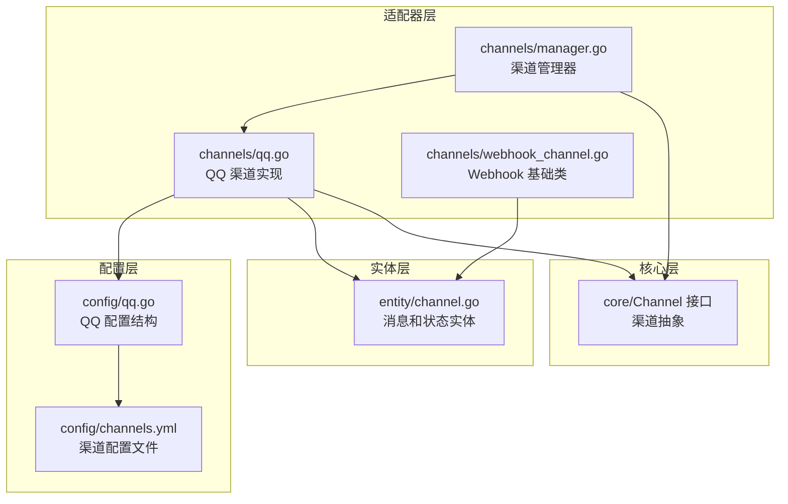
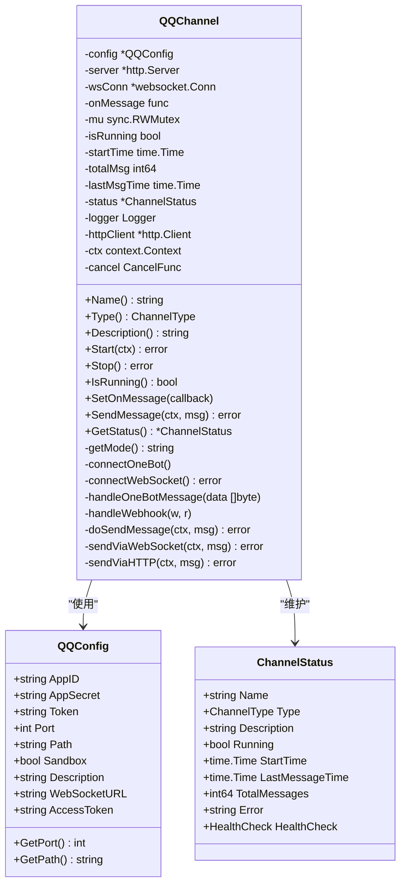
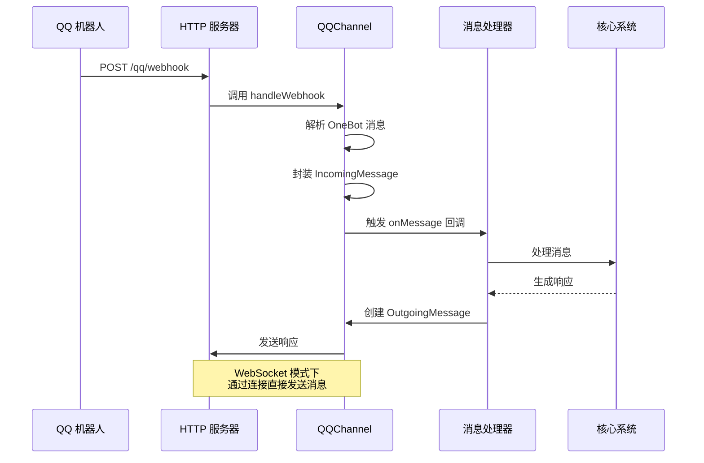
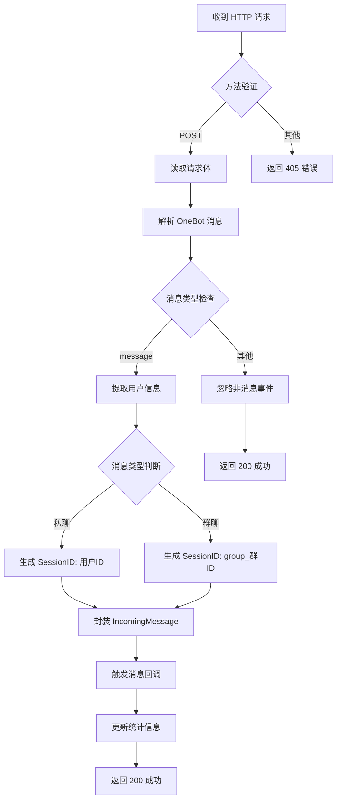
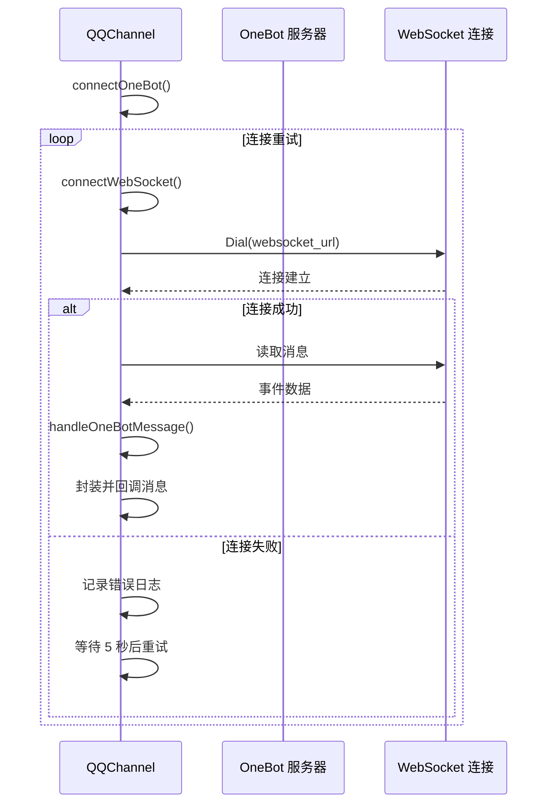
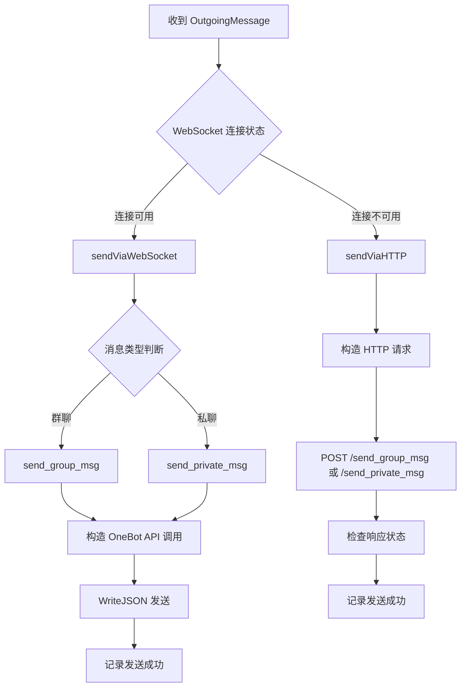
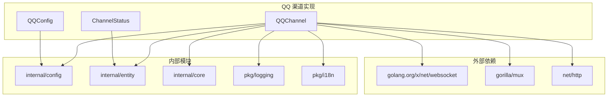
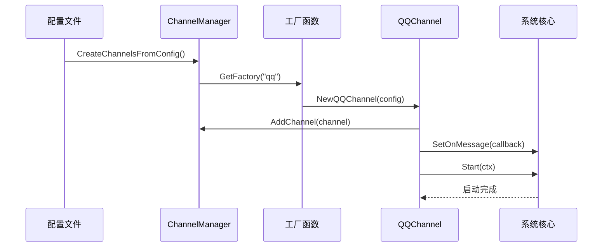

# QQ 渠道实现

<cite>
**本文档引用的文件**
- [internal/adapters/channels/qq.go](file://internal/adapters/channels/qq.go)
- [internal/config/qq.go](file://internal/config/qq.go)
- [config/channels.yml](file://config/channels.yml)
- [internal/entity/channel.go](file://internal/entity/channel.go)
- [internal/adapters/channels/webhook_channel.go](file://internal/adapters/channels/webhook_channel.go)
- [internal/adapters/channels/manager.go](file://internal/adapters/channels/manager.go)
</cite>

## 目录
1. [简介](#简介)
2. [项目结构](#项目结构)
3. [核心组件](#核心组件)
4. [架构概览](#架构概览)
5. [详细组件分析](#详细组件分析)
6. [依赖关系分析](#依赖关系分析)
7. [性能考虑](#性能考虑)
8. [故障排除指南](#故障排除指南)
9. [结论](#结论)
10. [附录](#附录)

## 简介

本文件为 QQ 渠道实现的全面技术文档，详细介绍了 QQ 机器人的 Webhook 集成方式、消息格式处理和认证机制。文档涵盖了 QQ 特有的消息类型支持、表情符号处理和图片消息发送，阐述了 QQ API 调用流程、机器人配置和消息路由规则，并提供了 QQ 机器人配置参数、安全设置和部署要求的具体说明。

## 项目结构

MindX 项目采用分层架构设计，QQ 渠道作为适配器层的一部分，位于 `internal/adapters/channels/` 目录下。整体项目结构如下：



**图表来源**
- [internal/adapters/channels/qq.go](file://internal/adapters/channels/qq.go#L1-L50)
- [internal/config/qq.go](file://internal/config/qq.go#L1-L17)
- [config/channels.yml](file://config/channels.yml#L47-L58)

**章节来源**
- [internal/adapters/channels/qq.go](file://internal/adapters/channels/qq.go#L1-L50)
- [internal/config/qq.go](file://internal/config/qq.go#L1-L17)
- [config/channels.yml](file://config/channels.yml#L1-L96)

## 核心组件

### QQChannel 结构体

QQChannel 是 QQ 渠道的核心实现，继承了 Channel 接口并实现了 OneBot 协议支持：



**图表来源**
- [internal/adapters/channels/qq.go](file://internal/adapters/channels/qq.go#L34-L72)
- [internal/config/qq.go](file://internal/config/qq.go#L3-L13)

### 消息实体模型

系统使用统一的消息实体模型来处理不同渠道的消息：

```mermaid
classDiagram
class IncomingMessage {
+string ChannelID
+string ChannelName
+string SessionID
+string MessageID
+MessageSender Sender
+string Content
+string ContentType
+Attachment[] Attachments
+map[string]interface{} Metadata
+time.Time Timestamp
+string ReplyTo
+string HookID
+string HookName
+string Source
+string ConversationID
}
class OutgoingMessage {
+string ChannelID
+string SessionID
+string Content
+string ContentType
+Attachment[] Attachments
+string ReplyTo
+map[string]interface{} Metadata
+string ConversationID
}
class MessageSender {
+string ID
+string Name
+string Avatar
+string Type
+map[string]interface{} Metadata
}
class Attachment {
+string Type
+string URL
+string Name
+int64 Size
+string MIMEType
+int Duration
+string Thumbnail
}
IncomingMessage --> MessageSender : "包含"
IncomingMessage --> Attachment : "可包含"
OutgoingMessage --> Attachment : "可包含"
```

**图表来源**
- [internal/entity/channel.go](file://internal/entity/channel.go#L24-L139)

**章节来源**
- [internal/adapters/channels/qq.go](file://internal/adapters/channels/qq.go#L34-L72)
- [internal/config/qq.go](file://internal/config/qq.go#L3-L13)
- [internal/entity/channel.go](file://internal/entity/channel.go#L24-L139)

## 架构概览

QQ 渠道实现了两种工作模式：Webhook 模式和 OneBot WebSocket 模式。

```mermaid
graph TB
subgraph "QQ 渠道架构"
A[QQChannel] --> B{模式选择}
B --> |WebSocket URL 存在| C[OneBot WebSocket 模式]
B --> |WebSocket URL 不存在| D[Webhook 模式]
C --> E[WebSocket 连接管理]
C --> F[事件监听循环]
D --> G[HTTP 服务器]
D --> H[Webhook 处理器]
E --> I[消息反序列化]
F --> I
G --> J[请求路由]
H --> J
I --> K[消息封装]
J --> K
K --> L[消息回调]
end
subgraph "消息发送路径"
M[OutgoingMessage] --> N{发送方式}
N --> |WebSocket 连接| O[sendViaWebSocket]
N --> |HTTP 请求| P[sendViaHTTP]
O --> Q[send_group_msg/send_private_msg]
P --> R[/send_group_msg /send_private_msg]
end
```

**图表来源**
- [internal/adapters/channels/qq.go](file://internal/adapters/channels/qq.go#L86-L126)
- [internal/adapters/channels/qq.go](file://internal/adapters/channels/qq.go#L361-L377)

### 工作流程序列图



**图表来源**
- [internal/adapters/channels/qq.go](file://internal/adapters/channels/qq.go#L256-L319)
- [internal/adapters/channels/qq.go](file://internal/adapters/channels/qq.go#L361-L478)

**章节来源**
- [internal/adapters/channels/qq.go](file://internal/adapters/channels/qq.go#L86-L126)
- [internal/adapters/channels/qq.go](file://internal/adapters/channels/qq.go#L191-L254)

## 详细组件分析

### Webhook 模式实现

Webhook 模式是 QQ 渠道的主要工作方式，通过 HTTP 服务器接收来自 QQ 机器人的消息。

#### Webhook 处理流程



**图表来源**
- [internal/adapters/channels/qq.go](file://internal/adapters/channels/qq.go#L256-L319)
- [internal/adapters/channels/qq.go](file://internal/adapters/channels/qq.go#L191-L254)

#### 消息格式映射

QQ 渠道支持 OneBot 协议标准消息格式，以下是关键字段映射：

| OneBot 字段 | QQChannel 映射 | 说明 |
|-------------|----------------|------|
| `post_type` | `message` | 仅处理消息事件 |
| `message_type` | `private/group` | 私聊或群聊 |
| `user_id` | `sender.id` | 发送者 QQ 号 |
| `group_id` | `metadata.group_id` | 群组 ID |
| `message` | `content` | 文本消息内容 |
| `raw_message` | `metadata.raw_message` | 原始消息 |
| `message_id` | `message_id` | 消息 ID |
| `sender.nickname` | `sender.name` | 发送者昵称 |

**章节来源**
- [internal/adapters/channels/qq.go](file://internal/adapters/channels/qq.go#L191-L254)

### OneBot WebSocket 模式实现

WebSocket 模式提供了实时双向通信能力，适用于需要主动发送消息的场景。

#### 连接管理流程



**图表来源**
- [internal/adapters/channels/qq.go](file://internal/adapters/channels/qq.go#L135-L189)

#### 消息发送机制



**图表来源**
- [internal/adapters/channels/qq.go](file://internal/adapters/channels/qq.go#L379-L478)

**章节来源**
- [internal/adapters/channels/qq.go](file://internal/adapters/channels/qq.go#L135-L189)
- [internal/adapters/channels/qq.go](file://internal/adapters/channels/qq.go#L379-L478)

### 配置管理

#### 配置参数详解

QQ 渠道支持以下配置参数：

| 参数名 | 类型 | 必需 | 默认值 | 说明 |
|--------|------|------|--------|------|
| `enabled` | boolean | 否 | false | 是否启用 QQ 渠道 |
| `name` | string | 否 | "QQ" | 渠道显示名称 |
| `icon` | string | 否 | "qq" | 渠道图标 |
| `app_id` | string | 否 | "" | 应用 ID |
| `app_secret` | string | 否 | "" | 应用密钥 |
| `token` | string | 否 | "" | 验证令牌 |
| `port` | integer | 否 | 6062 | HTTP 服务器端口 |
| `path` | string | 否 | "/qq/webhook" | Webhook 路径 |
| `sandbox` | boolean | 否 | false | 是否沙盒模式 |
| `websocket_url` | string | 否 | "" | OneBot WebSocket 地址 |
| `access_token` | string | 否 | "" | 访问令牌 |

#### 配置文件示例

```yaml
qq:
    enabled: false
    name: QQ
    icon: qq
    config:
        app_id: ""
        app_secret: ""
        description: QQ机器人接入(支持OneBot、Go-CQHTTP等)
        path: /qq/webhook
        port: 6062
        sandbox: false
        token: ""
```

**章节来源**
- [config/channels.yml](file://config/channels.yml#L47-L58)
- [internal/config/qq.go](file://internal/config/qq.go#L3-L13)

### 安全机制

#### 认证和授权

QQ 渠道实现了多层安全机制：

1. **WebSocket 认证**：通过 Authorization 头部传递 Bearer 令牌
2. **HTTP 认证**：支持 Authorization 头部的 Bearer 令牌
3. **连接重试机制**：自动处理连接中断和重连
4. **超时控制**：HTTP 请求超时时间为 10 秒

#### 日志和监控

系统提供了完整的日志记录和状态监控功能：

- **启动日志**：记录模式选择和端口信息
- **错误日志**：记录连接失败、解析错误等异常
- **性能日志**：记录消息发送成功和失败情况
- **状态监控**：跟踪运行状态、消息总数和最后消息时间

**章节来源**
- [internal/adapters/channels/qq.go](file://internal/adapters/channels/qq.go#L150-L165)
- [internal/adapters/channels/qq.go](file://internal/adapters/channels/qq.go#L457-L460)

## 依赖关系分析

### 组件依赖图



**图表来源**
- [internal/adapters/channels/qq.go](file://internal/adapters/channels/qq.go#L3-L18)
- [internal/config/qq.go](file://internal/config/qq.go#L1-L17)

### 渠道管理器集成

QQ 渠道通过 ChannelManager 进行统一管理：



**图表来源**
- [internal/adapters/channels/manager.go](file://internal/adapters/channels/manager.go#L149-L229)

**章节来源**
- [internal/adapters/channels/manager.go](file://internal/adapters/channels/manager.go#L1-L230)

## 性能考虑

### 连接池和资源管理

- **HTTP 客户端**：使用 10 秒超时限制，避免长时间阻塞
- **WebSocket 连接**：自动重连机制，最多等待 5 秒后重试
- **内存管理**：使用互斥锁保护共享状态，避免竞态条件
- **并发处理**：HTTP 服务器使用 goroutine 处理请求

### 错误处理策略

系统实现了完善的错误处理机制：

- **连接错误**：记录详细错误信息并自动重试
- **解析错误**：跳过无效消息，不影响其他消息处理
- **发送失败**：返回具体错误码，便于诊断问题
- **超时处理**：及时终止长时间无响应的操作

## 故障排除指南

### 常见问题及解决方案

#### 连接问题

**问题**：WebSocket 连接失败
**可能原因**：
- WebSocket URL 配置错误
- 网络连接不稳定
- 访问令牌无效

**解决步骤**：
1. 验证 `websocket_url` 配置正确
2. 检查网络连通性
3. 确认 `access_token` 有效
4. 查看日志中的错误详情

#### 消息接收问题

**问题**：无法接收 QQ 消息
**可能原因**：
- Webhook 路径配置错误
- 端口被占用
- 服务器未启动

**解决步骤**：
1. 确认 `path` 配置与 QQ 机器人设置一致
2. 检查端口 6062 是否被占用
3. 验证服务器启动状态
4. 查看 HTTP 服务器错误日志

#### 消息发送问题

**问题**：无法发送消息到 QQ
**可能原因**：
- WebSocket 连接未建立
- HTTP API 调用失败
- 权限不足

**解决步骤**：
1. 检查 WebSocket 连接状态
2. 验证 HTTP API 端点
3. 确认 QQ 机器人权限
4. 查看发送失败的详细错误

**章节来源**
- [internal/adapters/channels/qq.go](file://internal/adapters/channels/qq.go#L141-L147)
- [internal/adapters/channels/qq.go](file://internal/adapters/channels/qq.go#L276-L280)

## 结论

QQ 渠道实现提供了完整的 OneBot 协议支持，包括 Webhook 和 WebSocket 两种工作模式。系统具有良好的扩展性、安全性和可靠性，能够满足 QQ 机器人集成的各种需求。

主要特点包括：
- 支持 OneBot 协议标准消息格式
- 提供 Webhook 和 WebSocket 双模式支持
- 完善的错误处理和重试机制
- 详细的日志记录和状态监控
- 灵活的配置管理和动态加载

## 附录

### 部署要求

#### 系统要求
- Go 1.19+
- Linux/Windows/macOS
- 开放端口 6062（默认）

#### 环境变量
- `PORT`: HTTP 服务器端口（可选）
- `PATH`: Webhook 路径（可选）
- `WEBSOCKET_URL`: OneBot WebSocket 地址（可选）

### 集成示例

#### 基本配置示例
```yaml
channels:
  qq:
    enabled: true
    name: QQ
    icon: qq
    config:
      port: 6062
      path: /qq/webhook
      websocket_url: ws://localhost:8080/ws
      access_token: your-access-token
```

#### 高级配置示例
```yaml
channels:
  qq:
    enabled: true
    name: QQ
    icon: qq
    config:
      port: 6062
      path: /qq/webhook
      app_id: your-app-id
      app_secret: your-app-secret
      token: your-webhook-token
      websocket_url: ws://localhost:8080/ws
      access_token: your-access-token
      sandbox: false
```