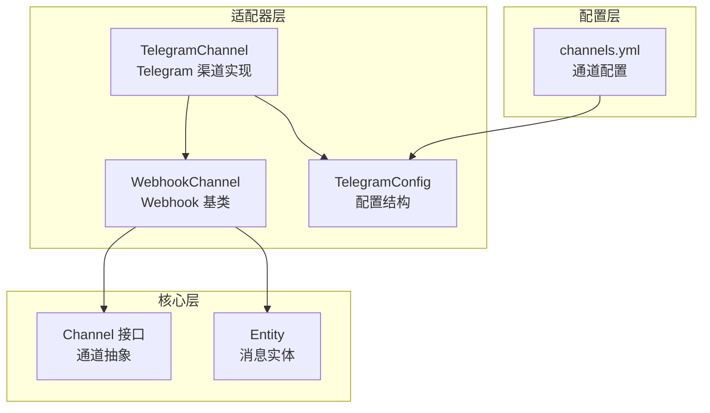
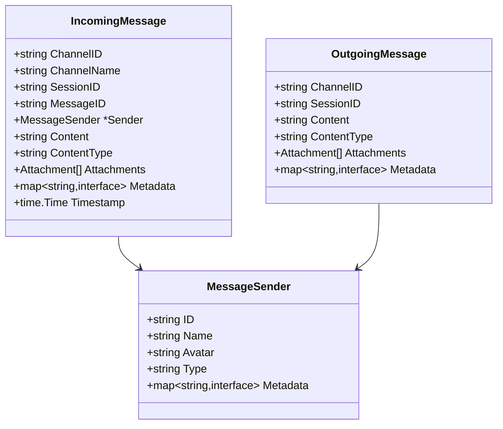
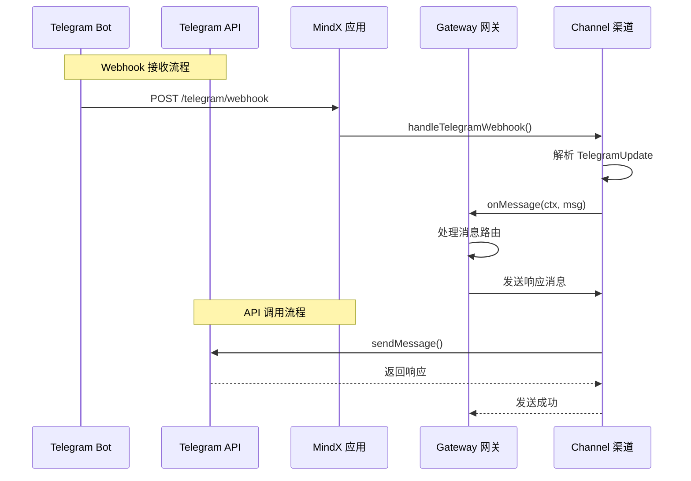
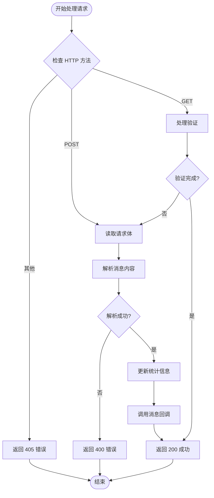
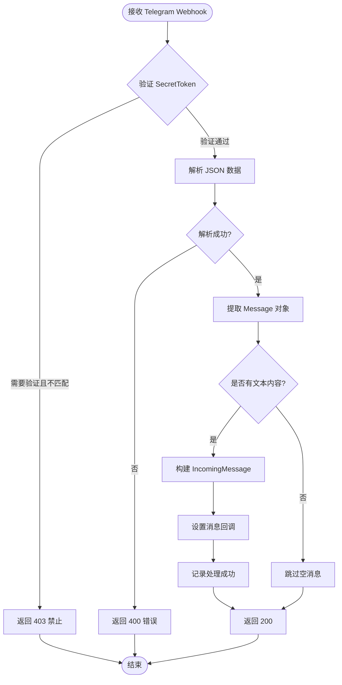
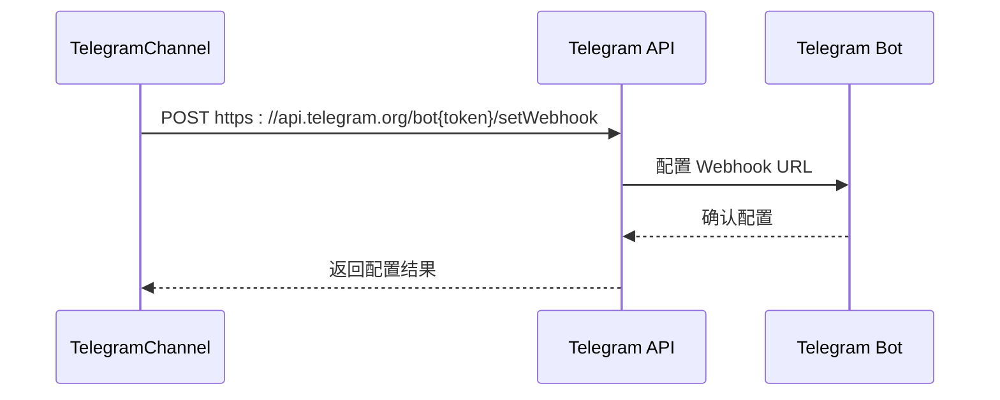
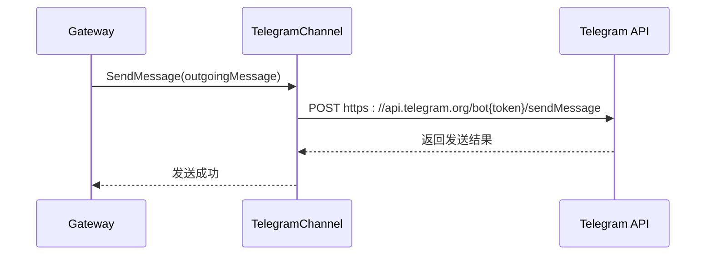
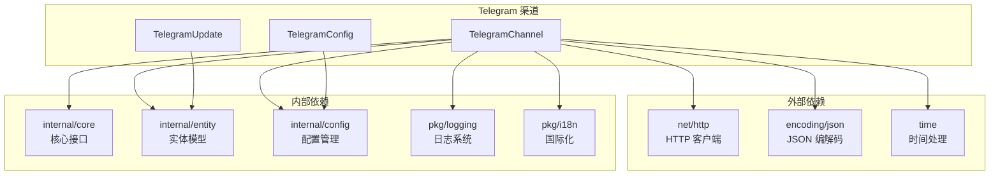
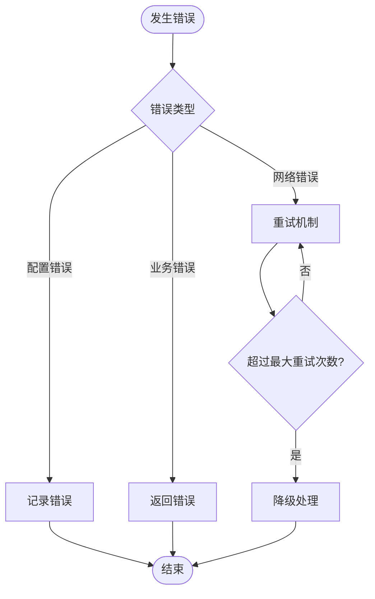

# Telegram 渠道实现

<cite>
**本文档引用的文件**
- [telegramchannel.go](file://internal/adapters/channels/telegramchannel.go)
- [telegram.go](file://internal/config/telegram.go)
- [channels.yml](file://config/channels.yml)
- [webhook_channel.go](file://internal/adapters/channels/webhook_channel.go)
- [gateway.go](file://internal/adapters/channels/gateway.go)
- [channel.go](file://internal/entity/channel.go)
- [channel.go](file://internal/core/channel.go)
</cite>

## 目录
1. [简介](#简介)
2. [项目结构](#项目结构)
3. [核心组件](#核心组件)
4. [架构概览](#架构概览)
5. [详细组件分析](#详细组件分析)
6. [依赖关系分析](#依赖关系分析)
7. [性能考虑](#性能考虑)
8. [故障排除指南](#故障排除指南)
9. [结论](#结论)

## 简介

本文档详细介绍了 MindX 项目中的 Telegram 渠道实现。该实现基于 Telegram Bot API，采用 Webhook 方式接收消息，并通过 HTTP API 发送消息。Telegram 渠道作为 MindX 多渠道通信系统的一部分，提供了完整的消息处理流程，包括消息接收、解析、转发和响应。

## 项目结构

Telegram 渠道实现位于项目的适配器层，采用模块化设计：



**图表来源**
- [telegramchannel.go](file://internal/adapters/channels/telegramchannel.go#L1-L55)
- [webhook_channel.go](file://internal/adapters/channels/webhook_channel.go#L29-L63)
- [telegram.go](file://internal/config/telegram.go#L3-L10)

**章节来源**
- [telegramchannel.go](file://internal/adapters/channels/telegramchannel.go#L1-L55)
- [webhook_channel.go](file://internal/adapters/channels/webhook_channel.go#L1-L63)

## 核心组件

### TelegramChannel 类

TelegramChannel 是 Telegram 渠道的核心实现，继承自 WebhookChannel 基类：

```mermaid
classDiagram
class TelegramChannel {
-WebhookChannel *WebhookChannel
-config *TelegramConfig
-httpClient *http.Client
+Start(ctx) error
+Stop() error
+SendMessage(ctx, msg) error
+Description() string
-setWebhook() error
-handleTelegramWebhook(w, r)
-parseTelegramUpdate(update) IncomingMessage
}
class WebhookChannel {
-platformName string
-platformType ChannelType
-config interface{}
-server *http.Server
-webhookPath string
-onMessage func
-isRunning bool
+Start(ctx) error
+Stop() error
+SetOnMessage(callback)
+SendMessage(ctx, msg) error
}
class TelegramConfig {
+BotToken string
+WebhookURL string
+SecretToken string
+Port int
+Path string
+UseWebhook bool
+GetPort() int
+GetPath() string
}
TelegramChannel --|> WebhookChannel
TelegramChannel --> TelegramConfig
```

**图表来源**
- [telegramchannel.go](file://internal/adapters/channels/telegramchannel.go#L32-L55)
- [webhook_channel.go](file://internal/adapters/channels/webhook_channel.go#L31-L47)
- [telegram.go](file://internal/config/telegram.go#L3-L10)

### 消息实体模型

Telegram 渠道使用统一的消息实体模型：



**图表来源**
- [channel.go](file://internal/entity/channel.go#L24-L70)
- [channel.go](file://internal/entity/channel.go#L73-L97)
- [channel.go](file://internal/entity/channel.go#L99-L115)

**章节来源**
- [telegramchannel.go](file://internal/adapters/channels/telegramchannel.go#L32-L55)
- [channel.go](file://internal/entity/channel.go#L24-L115)

## 架构概览

Telegram 渠道在整个系统中的位置和交互关系：



**图表来源**
- [telegramchannel.go](file://internal/adapters/channels/telegramchannel.go#L222-L264)
- [gateway.go](file://internal/adapters/channels/gateway.go#L74-L272)

## 详细组件分析

### WebhookChannel 基类

WebhookChannel 提供了通用的 Webhook 处理框架：



**图表来源**
- [webhook_channel.go](file://internal/adapters/channels/webhook_channel.go#L82-L135)

### Telegram 消息处理流程

Telegram 渠道的消息处理具有特定的业务逻辑：



**图表来源**
- [telegramchannel.go](file://internal/adapters/channels/telegramchannel.go#L222-L264)
- [telegramchannel.go](file://internal/adapters/channels/telegramchannel.go#L266-L304)

### 配置管理

Telegram 渠道支持灵活的配置选项：

| 配置项 | 类型 | 默认值 | 描述 |
|--------|------|--------|------|
| bot_token | string | "" | Telegram Bot API 密钥 |
| webhook_url | string | "" | Webhook 接收地址 |
| secret_token | string | "" | Webhook 安全令牌 |
| port | int | 8087 | HTTP 服务端口 |
| path | string | "/telegram/webhook" | Webhook 路径 |
| use_webhook | bool | true | 是否启用 Webhook |

**章节来源**
- [telegram.go](file://internal/config/telegram.go#L3-L10)
- [channels.yml](file://config/channels.yml#L59-L70)

### API 调用示例

#### 设置 Webhook



**图表来源**
- [telegramchannel.go](file://internal/adapters/channels/telegramchannel.go#L102-L150)

#### 发送消息



**图表来源**
- [telegramchannel.go](file://internal/adapters/channels/telegramchannel.go#L152-L220)

## 依赖关系分析

### 组件依赖图



**图表来源**
- [telegramchannel.go](file://internal/adapters/channels/telegramchannel.go#L3-L17)
- [telegram.go](file://internal/config/telegram.go#L1-L10)

### 通道注册机制

```mermaid
flowchart LR
Register[Register 函数] --> Init[init() 初始化]
Init --> Factory[工厂函数]
Factory --> NewChannel[NewTelegramChannel]
NewChannel --> Config[配置参数]
Config --> Channel[TelegramChannel 实例]
Channel --> WebhookBase[继承 WebhookChannel]
WebhookBase --> BaseConfig[基础配置]
```

**图表来源**
- [telegramchannel.go](file://internal/adapters/channels/telegramchannel.go#L19-L30)

**章节来源**
- [telegramchannel.go](file://internal/adapters/channels/telegramchannel.go#L1-L334)
- [webhook_channel.go](file://internal/adapters/channels/webhook_channel.go#L1-L306)

## 性能考虑

### 并发处理

Telegram 渠道实现了线程安全的消息处理：

- 使用互斥锁保护共享资源
- 异步消息处理避免阻塞 HTTP 请求
- 连接池和超时控制防止资源泄漏

### 错误处理策略



### 资源管理

- HTTP 客户端超时设置为 10 秒
- 服务器超时设置为 10 秒
- 自动清理僵尸连接
- 内存使用监控和限制

## 故障排除指南

### 常见问题及解决方案

#### Webhook 配置问题

**问题**: Webhook 设置失败
**诊断步骤**:
1. 检查 bot_token 是否正确配置
2. 验证 webhook_url 是否可达
3. 确认网络防火墙允许外部访问

**解决方案**:
- 使用 HTTPS 地址作为 webhook_url
- 确保端口在防火墙中开放
- 验证域名解析正常

#### 消息接收问题

**问题**: 无法接收 Telegram 消息
**诊断步骤**:
1. 检查 SecretToken 配置
2. 验证 HTTP 请求头
3. 查看日志中的错误信息

**解决方案**:
- 确保 X-Telegram-Bot-Api-Secret-Token 头正确传递
- 检查路径配置是否匹配
- 验证服务器时间同步

#### 消息发送问题

**问题**: 无法发送响应消息
**诊断步骤**:
1. 检查聊天 ID 格式
2. 验证 Bot 权限
3. 查看 API 返回状态

**解决方案**:
- 确保 chat_id 为有效的数字字符串
- 检查 Bot 是否被用户添加到群组
- 验证网络连接和 API 可用性

### 日志分析

Telegram 渠道使用结构化日志记录关键事件：

- 启动和停止事件
- 消息接收和发送统计
- 错误和异常情况
- 性能指标监控

**章节来源**
- [telegramchannel.go](file://internal/adapters/channels/telegramchannel.go#L222-L264)
- [webhook_channel.go](file://internal/adapters/channels/webhook_channel.go#L152-L200)

## 结论

MindX 的 Telegram 渠道实现提供了完整、可靠的 Telegram Bot API 集成方案。通过模块化的架构设计，该实现具备以下特点：

1. **标准化接口**: 遵循统一的 Channel 接口规范
2. **灵活配置**: 支持多种配置选项和部署场景
3. **健壮性**: 完善的错误处理和恢复机制
4. **可观测性**: 详细的日志记录和状态监控
5. **扩展性**: 易于集成新的 Telegram 功能

该实现为构建多渠道智能客服系统奠定了坚实的基础，支持未来功能扩展和性能优化。