# Webhook 基础实现

<cite>
**本文档引用的文件**
- [webhook_channel.go](file://internal/adapters/channels/webhook_channel.go)
- [gateway.go](file://internal/adapters/channels/gateway.go)
- [manager.go](file://internal/adapters/channels/manager.go)
- [registry.go](file://internal/adapters/channels/registry.go)
- [session.go](file://internal/adapters/channels/session.go)
- [channels.go](file://internal/adapters/channels/wechat.go)
- [telegramchannel.go](file://internal/adapters/channels/telegramchannel.go)
- [metrics.go](file://internal/adapters/http/middleware/metrics.go)
- [request_id.go](file://internal/adapters/http/middleware/request_id.go)
- [channels.yml](file://config/channels.yml)
- [channel.go](file://internal/entity/channel.go)
- [channels.go](file://internal/config/channels.go)
- [channel.go](file://internal/core/channel.go)
- [breaker.go](file://internal/adapters/channels/breaker.go)
- [token_refresher.go](file://internal/adapters/channels/token_refresher.go)
</cite>

## 目录
1. [简介](#简介)
2. [项目结构](#项目结构)
3. [核心组件](#核心组件)
4. [架构概览](#架构概览)
5. [详细组件分析](#详细组件分析)
6. [依赖关系分析](#依赖关系分析)
7. [性能考虑](#性能考虑)
8. [故障排除指南](#故障排除指南)
9. [结论](#结论)
10. [附录](#附录)

## 简介

MindX 的 Webhook 基础架构为多平台即时通讯渠道提供了统一的基础设施。该架构基于 WebhookChannel 基类，采用网关模式实现渠道适配，支持多种即时通讯平台（微信、Telegram、飞书、钉钉等）的统一接入。

本架构的核心设计理念包括：
- **抽象统一**：通过 WebhookChannel 基类抽象出所有 Webhook 渠道的共同特性
- **网关模式**：使用 Gateway 组件协调消息路由、转发和上下文管理
- **配置驱动**：通过 YAML 配置文件实现渠道的动态启停和参数配置
- **中间件集成**：支持 Prometheus 指标收集和请求 ID 追踪
- **错误恢复**：内置熔断器模式和优雅关闭机制

## 项目结构

Webhook 基础架构主要分布在以下目录中：

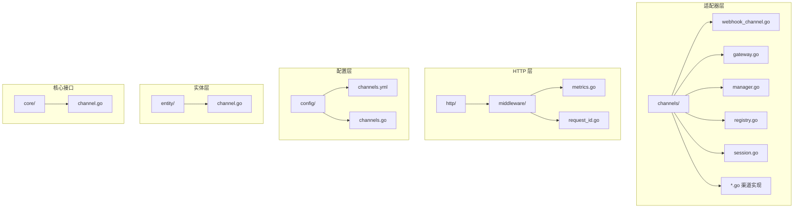

**图表来源**
- [webhook_channel.go](file://internal/adapters/channels/webhook_channel.go#L1-L306)
- [gateway.go](file://internal/adapters/channels/gateway.go#L1-L510)
- [manager.go](file://internal/adapters/channels/manager.go#L1-L230)

## 核心组件

### WebhookChannel 基类

WebhookChannel 是整个架构的核心基类，提供了统一的 Webhook 处理框架：

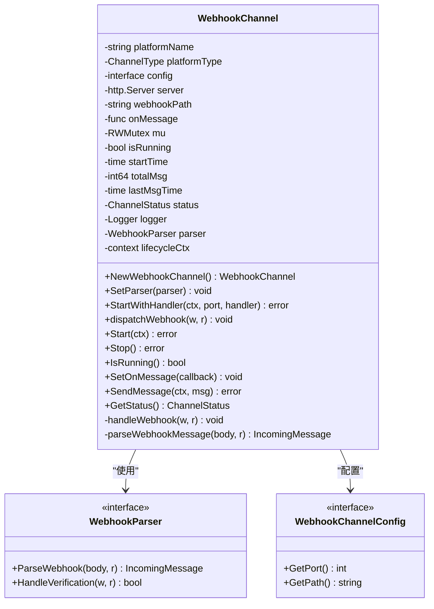

**图表来源**
- [webhook_channel.go](file://internal/adapters/channels/webhook_channel.go#L29-L47)

### 网关模式实现

Gateway 组件实现了消息路由和协调功能：

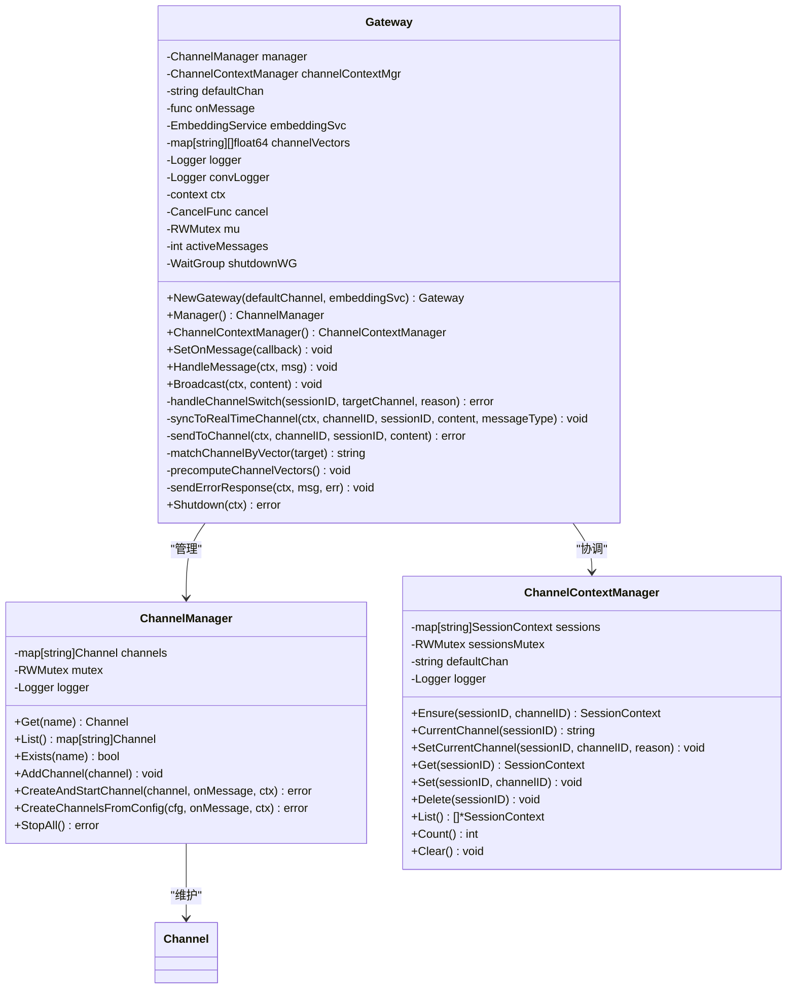

**图表来源**
- [gateway.go](file://internal/adapters/channels/gateway.go#L15-L31)
- [manager.go](file://internal/adapters/channels/manager.go#L15-L21)
- [session.go](file://internal/adapters/channels/session.go#L11-L27)

**章节来源**
- [webhook_channel.go](file://internal/adapters/channels/webhook_channel.go#L1-L306)
- [gateway.go](file://internal/adapters/channels/gateway.go#L1-L510)
- [manager.go](file://internal/adapters/channels/manager.go#L1-L230)
- [session.go](file://internal/adapters/channels/session.go#L1-L177)

## 架构概览

Webhook 基础架构采用分层设计，实现了高内聚、低耦合的系统结构：

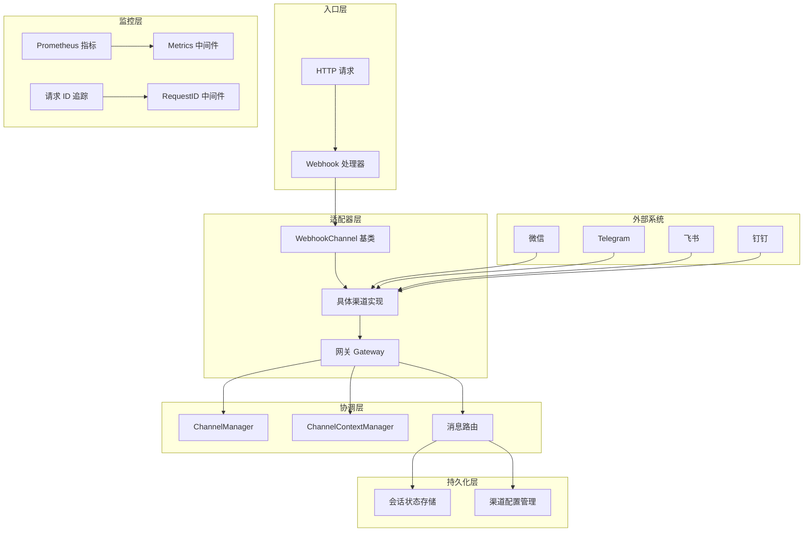

**图表来源**
- [webhook_channel.go](file://internal/adapters/channels/webhook_channel.go#L15-L47)
- [gateway.go](file://internal/adapters/channels/gateway.go#L15-L31)
- [metrics.go](file://internal/adapters/http/middleware/metrics.go#L12-L49)

## 详细组件分析

### WebhookChannel 生命周期管理

WebhookChannel 提供了完整的生命周期管理机制：

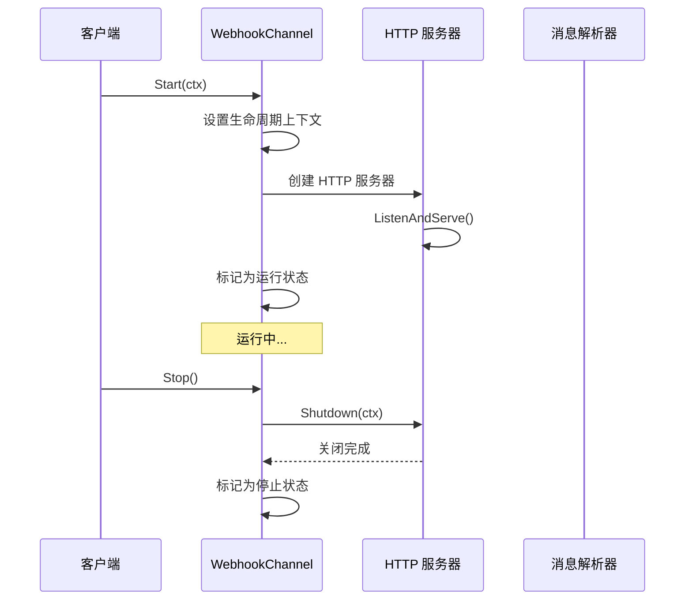

**图表来源**
- [webhook_channel.go](file://internal/adapters/channels/webhook_channel.go#L152-L222)

### 消息处理流程

WebhookChannel 的消息处理遵循统一的流程：

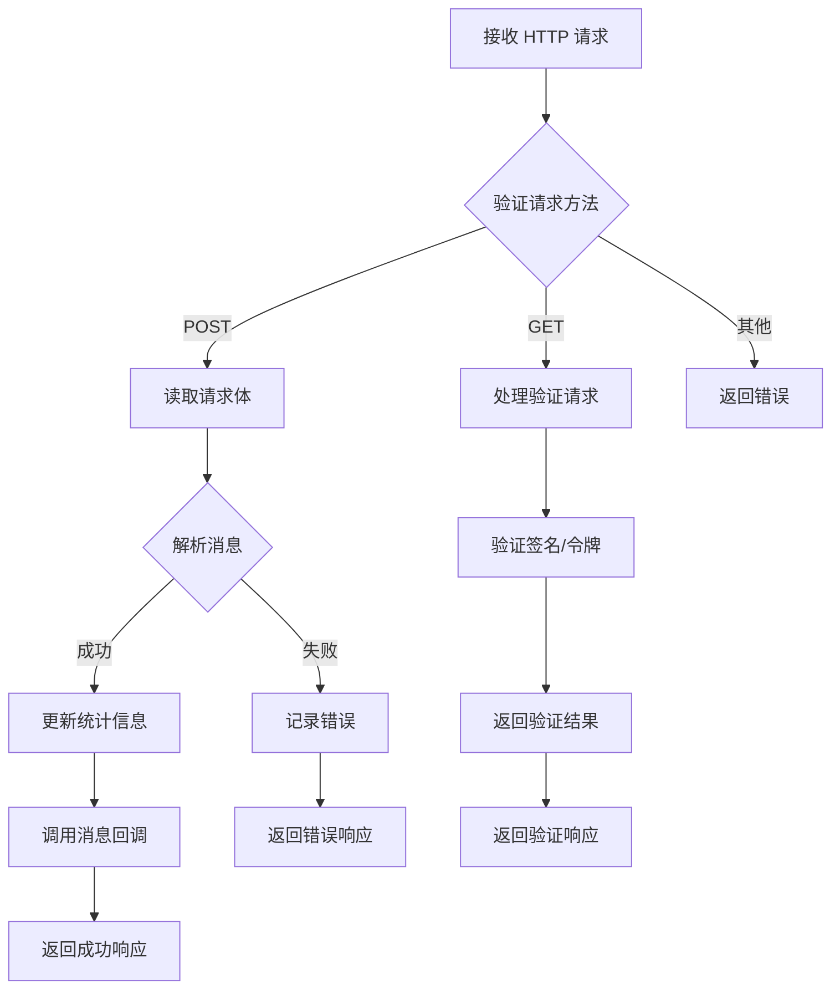

**图表来源**
- [webhook_channel.go](file://internal/adapters/channels/webhook_channel.go#L82-L135)

### 渠道适配器实现

#### 微信渠道适配器

微信渠道适配器展示了如何扩展 WebhookChannel：

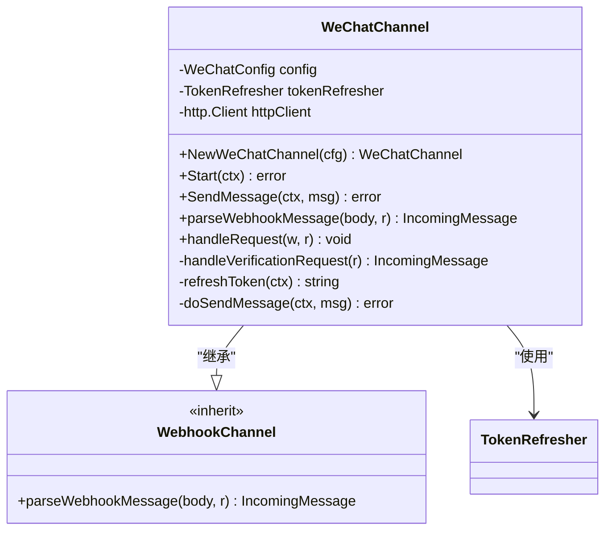

**图表来源**
- [channels.go](file://internal/adapters/channels/wechat.go#L51-L80)

#### Telegram 渠道适配器

Telegram 渠道适配器提供了另一个实现示例：

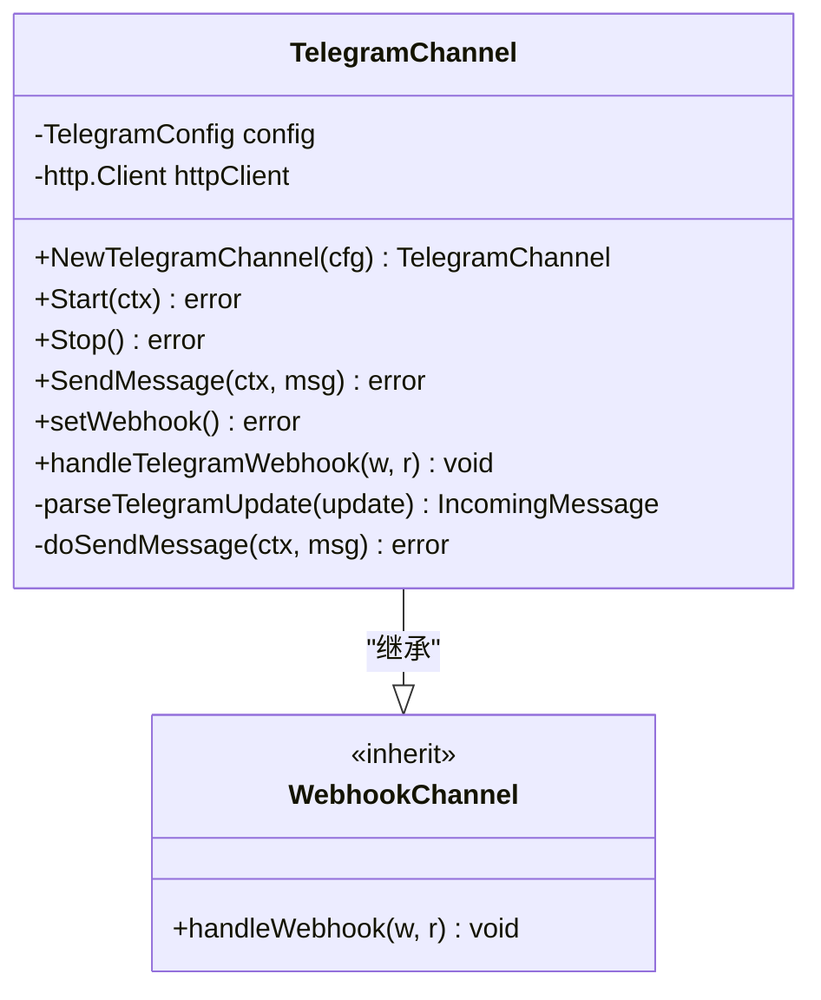

**图表来源**
- [telegramchannel.go](file://internal/adapters/channels/telegramchannel.go#L32-L55)

### 网关模式的消息路由

Gateway 组件实现了复杂的消息路由逻辑：

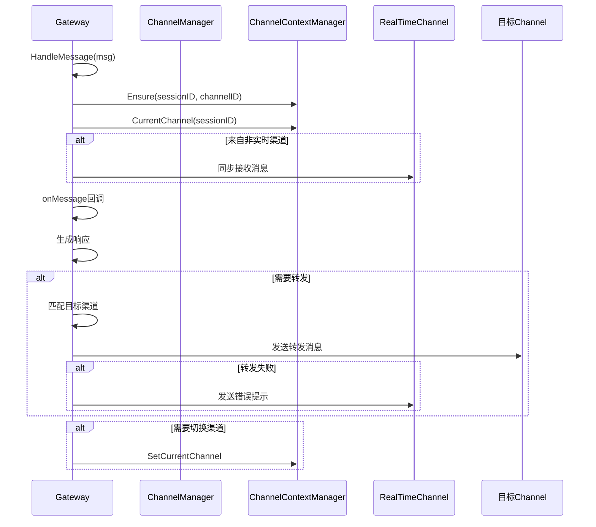

**图表来源**
- [gateway.go](file://internal/adapters/channels/gateway.go#L74-L272)

**章节来源**
- [webhook_channel.go](file://internal/adapters/channels/webhook_channel.go#L1-L306)
- [channels.go](file://internal/adapters/channels/wechat.go#L1-L369)
- [telegramchannel.go](file://internal/adapters/channels/telegramchannel.go#L1-L334)
- [gateway.go](file://internal/adapters/channels/gateway.go#L1-L510)

## 依赖关系分析

Webhook 基础架构的依赖关系呈现清晰的层次结构：

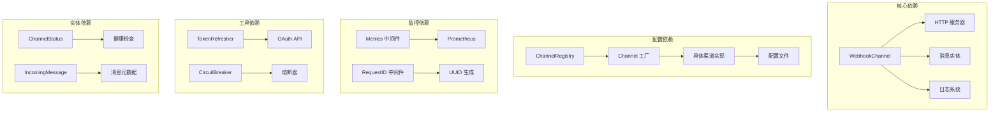

**图表来源**
- [registry.go](file://internal/adapters/channels/registry.go#L14-L38)
- [metrics.go](file://internal/adapters/http/middleware/metrics.go#L12-L49)
- [token_refresher.go](file://internal/adapters/channels/token_refresher.go#L10-L27)

**章节来源**
- [registry.go](file://internal/adapters/channels/registry.go#L1-L142)
- [metrics.go](file://internal/adapters/http/middleware/metrics.go#L1-L69)
- [token_refresher.go](file://internal/adapters/channels/token_refresher.go#L1-L58)

## 性能考虑

### 并发处理

WebhookChannel 采用了多种并发优化策略：

1. **读写锁分离**：使用 RWMutex 精确控制并发访问
2. **goroutine 隔离**：HTTP 服务器在独立 goroutine 中运行
3. **上下文取消**：支持优雅的生命周期管理

### 资源管理

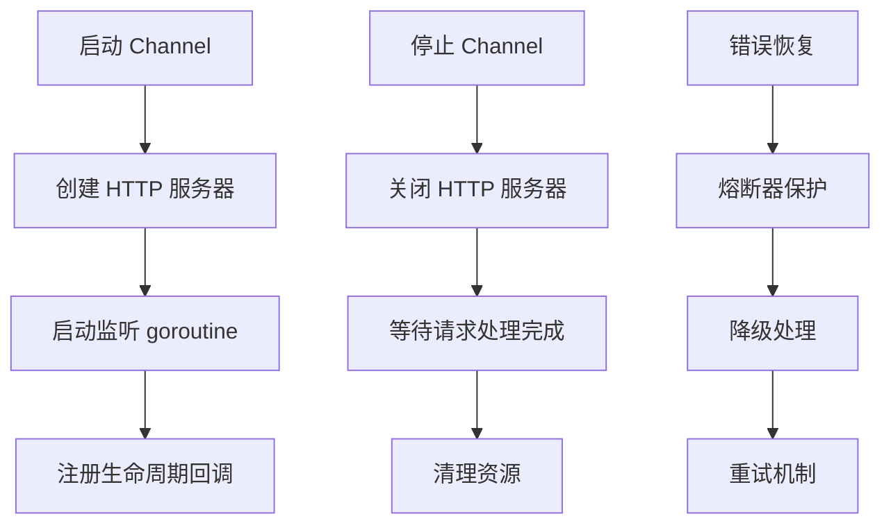

**图表来源**
- [webhook_channel.go](file://internal/adapters/channels/webhook_channel.go#L152-L222)
- [breaker.go](file://internal/adapters/channels/breaker.go#L13-L25)

### 监控指标

系统集成了全面的监控指标：

| 指标类型 | 指标名称 | 用途 |
|---------|---------|------|
| HTTP 请求 | `mindx_http_requests_total` | 统计请求总量和状态分布 |
| HTTP 响应 | `mindx_http_request_duration_seconds` | 监控请求处理时延 |
| 渠道消息 | `mindx_channel_messages_total` | 追踪各渠道消息流量 |
| LLM 调用 | `mindx_llm_calls_total` | 监控大模型调用情况 |
| 令牌使用 | `mindx_token_usage_total` | 统计 Token 消耗 |

**章节来源**
- [metrics.go](file://internal/adapters/http/middleware/metrics.go#L12-L49)
- [webhook_channel.go](file://internal/adapters/channels/webhook_channel.go#L40-L43)

## 故障排除指南

### 常见问题诊断

#### 渠道启动失败

**症状**：Channel 启动时报错
**排查步骤**：
1. 检查配置文件中的端口和路径设置
2. 验证网络连通性和端口占用情况
3. 查看日志中的具体错误信息

#### 消息解析错误

**症状**：Webhook 请求返回 400 错误
**排查步骤**：
1. 验证请求体格式是否符合平台要求
2. 检查签名验证逻辑
3. 确认消息解析器实现正确性

#### 熔断器触发

**症状**：大量 API 调用失败
**排查步骤**：
1. 检查上游服务状态
2. 查看熔断器统计信息
3. 调整熔断器阈值参数

### 调试技巧

1. **启用详细日志**：通过环境变量设置日志级别
2. **使用 RequestID**：便于跨服务追踪请求链路
3. **监控关键指标**：关注 HTTP 响应时间和错误率
4. **测试验证**：使用 curl 或 Postman 测试 Webhook 端点

**章节来源**
- [webhook_channel.go](file://internal/adapters/channels/webhook_channel.go#L100-L113)
- [request_id.go](file://internal/adapters/http/middleware/request_id.go#L10-L22)

## 结论

MindX 的 Webhook 基础架构通过精心设计的抽象层和网关模式，成功实现了多平台即时通讯渠道的统一接入。该架构具有以下优势：

1. **高度可扩展**：基于接口和工厂模式，易于添加新的渠道支持
2. **强健的错误处理**：内置熔断器、优雅关闭和监控机制
3. **灵活的配置管理**：支持运行时启停和参数调整
4. **完善的监控体系**：提供全面的性能指标和日志记录

该架构为构建企业级多渠道消息系统提供了坚实的基础，支持未来业务的快速发展和扩展需求。

## 附录

### 配置示例

channels.yml 文件包含所有支持渠道的配置模板：

```yaml
enabled_channels: []
channels:
    wechat:
        enabled: false
        name: 微信
        icon: wechat
        config:
            app_id: ""
            app_secret: ""
            path: /wechat/webhook
            port: 6061
            token: ""
    telegram:
        enabled: false
        name: Telegram
        icon: telegram
        config:
            bot_token: ""
            path: /telegram/webhook
            port: 6067
            secret_token: ""
```

### 最佳实践

1. **错误处理**：始终检查和处理可能的错误情况
2. **资源清理**：确保在 Stop 方法中正确清理资源
3. **配置验证**：在启动前验证所有必需的配置参数
4. **日志记录**：为关键操作添加详细的日志信息
5. **性能监控**：定期检查和分析监控指标

### 扩展指南

要创建新的 Webhook 渠道适配器：

1. 定义渠道配置结构
2. 实现 WebhookParser 接口
3. 在 init() 函数中注册工厂函数
4. 实现必要的验证和签名逻辑
5. 添加适当的错误处理和日志记录