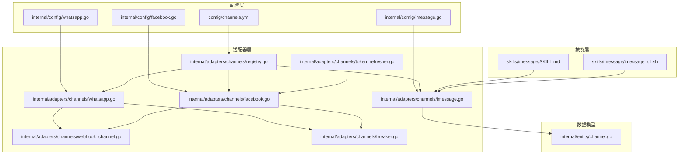
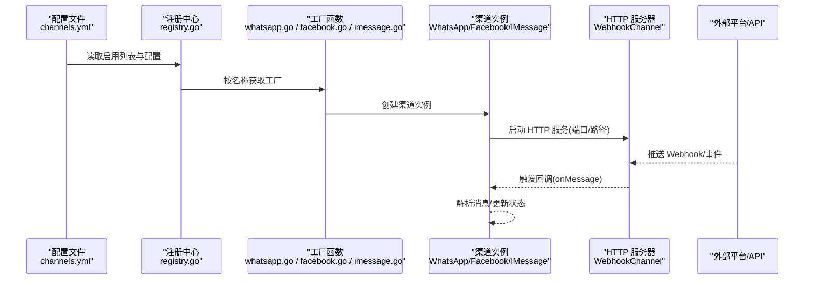
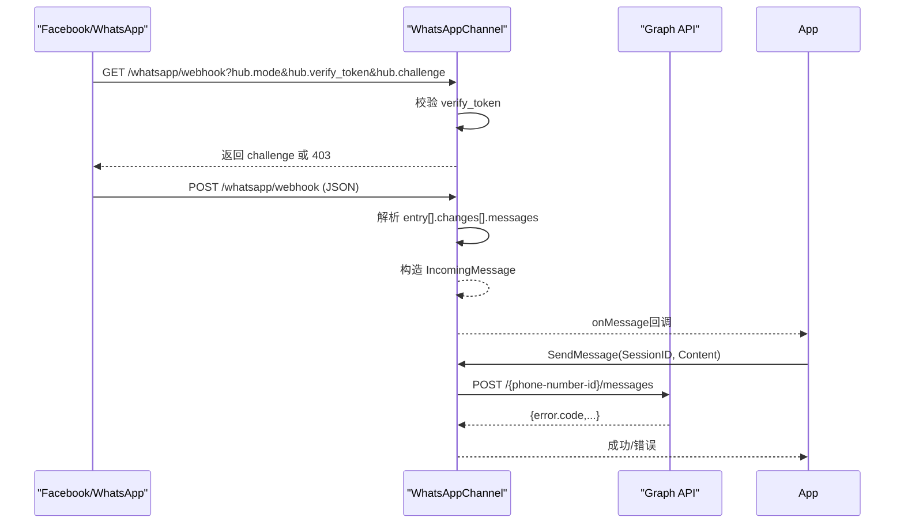
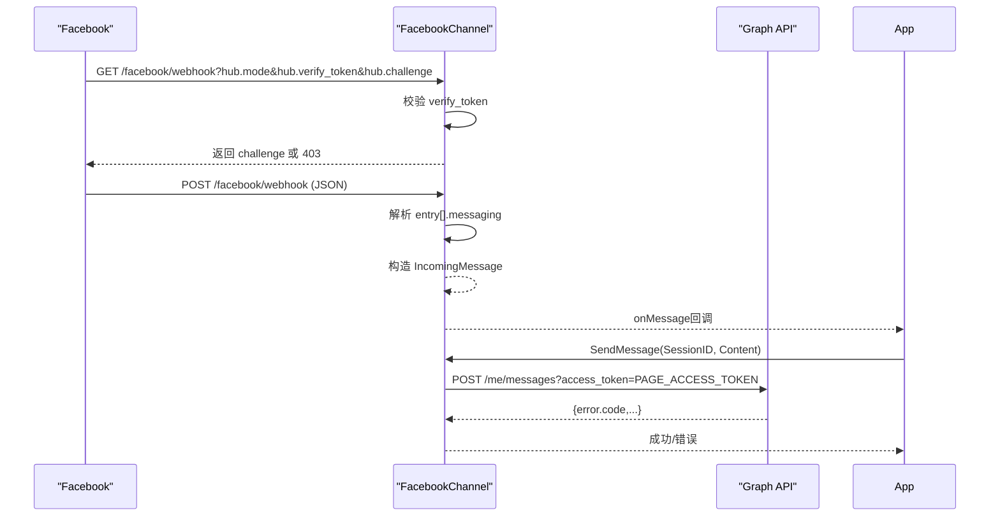
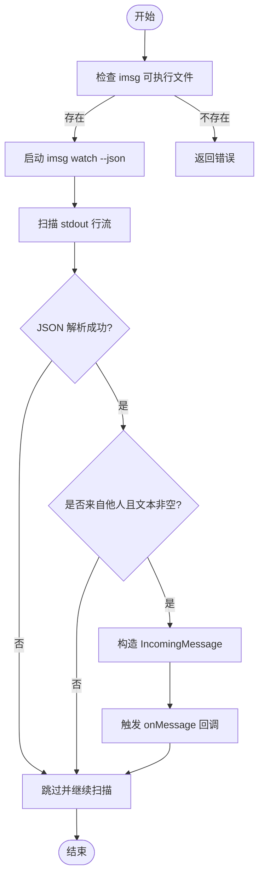
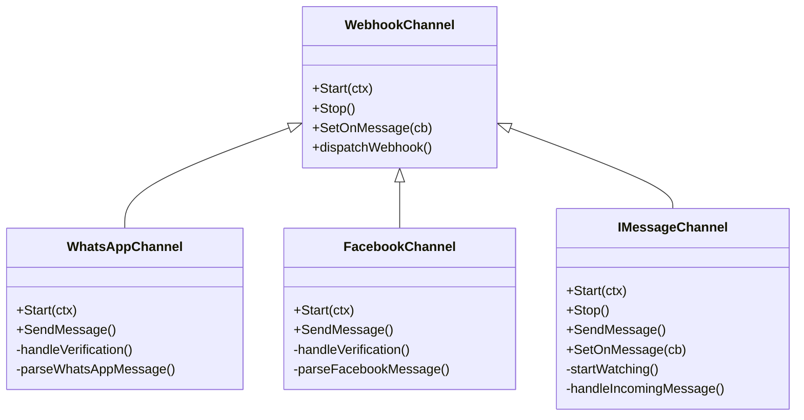

# 其他渠道实现

<cite>
**本文引用的文件**
- [internal/adapters/channels/whatsapp.go](file://internal/adapters/channels/whatsapp.go)
- [internal/adapters/channels/facebook.go](file://internal/adapters/channels/facebook.go)
- [internal/adapters/channels/imessage.go](file://internal/adapters/channels/imessage.go)
- [internal/adapters/channels/webhook_channel.go](file://internal/adapters/channels/webhook_channel.go)
- [internal/adapters/channels/registry.go](file://internal/adapters/channels/registry.go)
- [internal/adapters/channels/breaker.go](file://internal/adapters/channels/breaker.go)
- [internal/adapters/channels/token_refresher.go](file://internal/adapters/channels/token_refresher.go)
- [internal/config/whatsapp.go](file://internal/config/whatsapp.go)
- [internal/config/facebook.go](file://internal/config/facebook.go)
- [internal/config/imessage.go](file://internal/config/imessage.go)
- [internal/entity/channel.go](file://internal/entity/channel.go)
- [config/channels.yml](file://config/channels.yml)
- [skills/imessage/SKILL.md](file://skills/imessage/SKILL.md)
- [skills/imessage/imessage_cli.sh](file://skills/imessage/imessage_cli.sh)
- [pkg/circuitbreaker/breaker.go](file://pkg/circuitbreaker/breaker.go)
- [pkg/circuitbreaker/breaker_test.go](file://pkg/circuitbreaker/breaker_test.go)
</cite>

## 目录
1. [简介](#简介)
2. [项目结构](#项目结构)
3. [核心组件](#核心组件)
4. [架构总览](#架构总览)
5. [详细组件分析](#详细组件分析)
6. [依赖关系分析](#依赖关系分析)
7. [性能考量](#性能考量)
8. [故障排查指南](#故障排查指南)
9. [结论](#结论)
10. [附录](#附录)

## 简介
本文件面向希望在 MindX 中集成其他通信渠道（WhatsApp Business API、Facebook Messenger、iMessage）的开发者与运维人员。文档基于仓库现有实现，系统梳理三类渠道的认证机制、消息格式差异、API 调用流程、平台特性支持、错误处理策略，并给出配置参数、部署要求与安全注意事项。同时提供集成步骤、常见问题与性能优化建议，帮助快速落地。

## 项目结构
MindX 采用“配置驱动 + 工厂注册 + 适配器模式”的多渠道架构：
- 适配器层位于 internal/adapters/channels，按平台拆分文件，统一通过注册中心进行工厂注册与实例化
- 配置层位于 internal/config，定义各平台专属配置结构
- 数据模型位于 internal/entity，统一 IncomingMessage/OutgoingMessage 等消息与状态结构
- 配置文件 config/channels.yml 提供启用开关与默认参数
- 技能层 skills/imessage 提供本地 iMessage 发送脚本与能力描述

图表来源
- [config/channels.yml](file://config/channels.yml#L1-L96)
- [internal/adapters/channels/registry.go](file://internal/adapters/channels/registry.go#L1-L141)
- [internal/adapters/channels/whatsapp.go](file://internal/adapters/channels/whatsapp.go#L1-L303)
- [internal/adapters/channels/facebook.go](file://internal/adapters/channels/facebook.go#L1-L279)
- [internal/adapters/channels/imessage.go](file://internal/adapters/channels/imessage.go#L1-L272)
- [internal/adapters/channels/webhook_channel.go](file://internal/adapters/channels/webhook_channel.go#L1-L306)
- [internal/adapters/channels/breaker.go](file://internal/adapters/channels/breaker.go#L1-L26)
- [internal/adapters/channels/token_refresher.go](file://internal/adapters/channels/token_refresher.go#L1-L58)
- [internal/config/whatsapp.go](file://internal/config/whatsapp.go#L1-L14)
- [internal/config/facebook.go](file://internal/config/facebook.go#L1-L14)
- [internal/config/imessage.go](file://internal/config/imessage.go#L1-L10)
- [internal/entity/channel.go](file://internal/entity/channel.go#L1-L203)
- [skills/imessage/SKILL.md](file://skills/imessage/SKILL.md#L1-L59)
- [skills/imessage/imessage_cli.sh](file://skills/imessage/imessage_cli.sh#L1-L71)

章节来源
- [config/channels.yml](file://config/channels.yml#L1-L96)
- [internal/adapters/channels/registry.go](file://internal/adapters/channels/registry.go#L1-L141)
- [internal/adapters/channels/webhook_channel.go](file://internal/adapters/channels/webhook_channel.go#L1-L306)

## 核心组件
- 注册中心与工厂：通过 Register(name, factory) 完成渠道工厂注册；Manager 按配置批量创建与启动
- WebhookChannel 基类：封装 HTTP 服务器、验证、解析、回调、状态统计等通用逻辑
- 平台适配器：WhatsAppChannel/FacebookChannel 继承 WebhookChannel，实现各自解析与 API 调用；IMessageChannel 为本地进程监听型通道
- 消息模型：IncomingMessage/OutgoingMessage 统一字段，便于跨渠道处理
- 断路器：每个渠道独立断路器，降低上游不稳定影响
- Token 刷新器：为需 OAuth 的渠道提供令牌缓存与刷新

章节来源
- [internal/adapters/channels/registry.go](file://internal/adapters/channels/registry.go#L1-L141)
- [internal/adapters/channels/webhook_channel.go](file://internal/adapters/channels/webhook_channel.go#L1-L306)
- [internal/entity/channel.go](file://internal/entity/channel.go#L1-L203)
- [internal/adapters/channels/breaker.go](file://internal/adapters/channels/breaker.go#L1-L26)
- [internal/adapters/channels/token_refresher.go](file://internal/adapters/channels/token_refresher.go#L1-L58)

## 架构总览
下图展示三类渠道的启动与消息流转路径：

图表来源
- [config/channels.yml](file://config/channels.yml#L1-L96)
- [internal/adapters/channels/registry.go](file://internal/adapters/channels/registry.go#L1-L141)
- [internal/adapters/channels/whatsapp.go](file://internal/adapters/channels/whatsapp.go#L60-L86)
- [internal/adapters/channels/facebook.go](file://internal/adapters/channels/facebook.go#L60-L85)
- [internal/adapters/channels/imessage.go](file://internal/adapters/channels/imessage.go#L86-L107)
- [internal/adapters/channels/webhook_channel.go](file://internal/adapters/channels/webhook_channel.go#L152-L200)

## 详细组件分析

### WhatsApp Business API 集成
- 认证机制
  - 使用 Access Token 作为 Bearer 认证头
  - 验证模式：GET /webhook，校验 hub.mode=subscribe 且 hub.verify_token 与配置一致
- 消息格式
  - 接收：Webhook JSON，对象为 whatsapp_business_account，提取 entry[].changes[].value.messages[]
  - 发送：Graph API POST /{phone-number-id}/messages，消息类型为 text
- API 调用流程
  - Start：创建 HTTP 服务器，注册 /whatsapp/webhook 路由
  - Webhook：GET 验证 -> POST 解析 -> 回调上层
  - 发送：构造 JSON 负载 -> 发起 HTTP 请求 -> 解析响应错误
- 特性支持
  - 仅解析 text 类型消息（非图片/语音等）
  - 会话 ID 使用发送者 WAID
- 错误处理
  - 读取请求体失败、解析失败、HTTP 错误、API 错误码均返回错误
- 配置参数
  - phone_number_id、business_id、access_token、verify_token、port、path
- 部署要求
  - 需公网可达域名与 HTTPS（Facebook/WhatsApp 要求）
  - 配置 Verify Token 与 Webhook URL
- 安全考虑
  - Verify Token 必须保密
  - Access Token 严格权限控制与轮换

图表来源
- [internal/adapters/channels/whatsapp.go](file://internal/adapters/channels/whatsapp.go#L60-L86)
- [internal/adapters/channels/whatsapp.go](file://internal/adapters/channels/whatsapp.go#L165-L202)
- [internal/adapters/channels/whatsapp.go](file://internal/adapters/channels/whatsapp.go#L221-L302)
- [internal/adapters/channels/whatsapp.go](file://internal/adapters/channels/whatsapp.go#L88-L163)
- [internal/config/whatsapp.go](file://internal/config/whatsapp.go#L1-L14)

章节来源
- [internal/adapters/channels/whatsapp.go](file://internal/adapters/channels/whatsapp.go#L1-L303)
- [internal/config/whatsapp.go](file://internal/config/whatsapp.go#L1-L14)
- [config/channels.yml](file://config/channels.yml#L84-L96)

### Facebook Messenger 集成
- 认证机制
  - 使用 Page Access Token 作为查询参数
  - 验证模式：GET /webhook，校验 hub.mode=subscribe 且 hub.verify_token 与配置一致
- 消息格式
  - 接收：Webhook JSON，对象为 page，提取 entry[].messaging[]，仅处理含 mid/text 的消息
  - 发送：Graph API POST /me/messages?access_token=PAGE_ACCESS_TOKEN
- API 调用流程
  - Start：创建 HTTP 服务器，注册 /facebook/webhook 路由
  - Webhook：GET 验证 -> POST 解析 -> 回调上层
  - 发送：构造 recipient/message 文本 -> 发起 HTTP 请求 -> 解析响应错误
- 特性支持
  - 仅解析文本消息
  - 会话 ID 使用发送者 ID
- 错误处理
  - 读取请求体失败、解析失败、HTTP 错误、API 错误码均返回错误
- 配置参数
  - page_id、page_access_token、app_secret、verify_token、port、path
- 部署要求
  - 需公网可达域名与 HTTPS
  - 配置 Verify Token 与 Webhook URL
- 安全考虑
  - Verify Token 与 App Secret 严格保密
  - Page Access Token 权限最小化

图表来源
- [internal/adapters/channels/facebook.go](file://internal/adapters/channels/facebook.go#L60-L85)
- [internal/adapters/channels/facebook.go](file://internal/adapters/channels/facebook.go#L162-L199)
- [internal/adapters/channels/facebook.go](file://internal/adapters/channels/facebook.go#L218-L278)
- [internal/adapters/channels/facebook.go](file://internal/adapters/channels/facebook.go#L87-L160)
- [internal/config/facebook.go](file://internal/config/facebook.go#L1-L14)

章节来源
- [internal/adapters/channels/facebook.go](file://internal/adapters/channels/facebook.go#L1-L279)
- [internal/config/facebook.go](file://internal/config/facebook.go#L1-L14)
- [config/channels.yml](file://config/channels.yml#L16-L28)

### iMessage 集成
- 认证机制
  - 本地 macOS Messages 应用授权，无需网络 Token
  - 通过外部工具 imsg 或 AppleScript 发送/监听
- 消息格式
  - 监听：执行 imsg watch --json，逐行输出 JSON 行流
  - 发送：执行 imsg send --to --text --region
- API 调用流程
  - Start：校验 imsg 可执行文件存在 -> 启动 watch 子进程 -> 扫描 stdout
  - 监听：过滤非自身消息与空文本 -> 构造 IncomingMessage -> 回调上层
  - 发送：执行 imsg send -> 更新统计
- 特性支持
  - 本地通道，适合 macOS 环境
  - 支持区域与去抖参数
- 错误处理
  - imsg 可执行文件缺失、命令执行失败、JSON 解析失败、上下文取消均处理
- 配置参数
  - enabled、imsg_path、region、debounce、watch_since
- 部署要求
  - 仅 macOS，需安装并可用 imsg
  - 若使用 AppleScript 方案，需允许 AppleEvents
- 安全考虑
  - 本地消息访问需系统权限
  - imsg_path 路径与权限控制

图表来源
- [internal/adapters/channels/imessage.go](file://internal/adapters/channels/imessage.go#L185-L226)
- [internal/adapters/channels/imessage.go](file://internal/adapters/channels/imessage.go#L228-L271)
- [internal/config/imessage.go](file://internal/config/imessage.go#L1-L10)
- [config/channels.yml](file://config/channels.yml#L37-L47)

章节来源
- [internal/adapters/channels/imessage.go](file://internal/adapters/channels/imessage.go#L1-L272)
- [internal/config/imessage.go](file://internal/config/imessage.go#L1-L10)
- [config/channels.yml](file://config/channels.yml#L37-L47)
- [skills/imessage/SKILL.md](file://skills/imessage/SKILL.md#L1-L59)
- [skills/imessage/imessage_cli.sh](file://skills/imessage/imessage_cli.sh#L1-L71)

## 依赖关系分析
- 通用依赖
  - WebhookChannel 为 WhatsApp/Facebook 的基类，提供统一的 HTTP 生命周期、验证、解析与回调
  - 断路器按渠道维度隔离，避免单点故障扩散
  - TokenRefresher 为需 OAuth 的渠道提供令牌缓存与刷新
- 平台差异
  - WhatsApp/Facebook：HTTP Webhook + Graph API，需公网与验证
  - iMessage：本地进程监听，无网络 API 依赖

图表来源
- [internal/adapters/channels/webhook_channel.go](file://internal/adapters/channels/webhook_channel.go#L29-L47)
- [internal/adapters/channels/whatsapp.go](file://internal/adapters/channels/whatsapp.go#L32-L55)
- [internal/adapters/channels/facebook.go](file://internal/adapters/channels/facebook.go#L31-L54)
- [internal/adapters/channels/imessage.go](file://internal/adapters/channels/imessage.go#L29-L38)

章节来源
- [internal/adapters/channels/webhook_channel.go](file://internal/adapters/channels/webhook_channel.go#L1-L306)
- [internal/adapters/channels/whatsapp.go](file://internal/adapters/channels/whatsapp.go#L1-L303)
- [internal/adapters/channels/facebook.go](file://internal/adapters/channels/facebook.go#L1-L279)
- [internal/adapters/channels/imessage.go](file://internal/adapters/channels/imessage.go#L1-L272)

## 性能考量
- 断路器策略
  - 每个渠道独立断路器，默认阈值与重试超时可结合业务调整
  - 发送消息前通过断路器包装，异常时快速失败，避免级联故障
- 并发与资源
  - WebhookChannel 使用 goroutine 启动 HTTP 服务，注意端口冲突与优雅关闭
  - iMessage 监听使用 stdout scanner，注意大流量下的 JSON 行解析开销
- 超时与重试
  - HTTP 客户端默认 10 秒超时，可根据平台延迟调优
  - 对于 Facebook/WhatsApp 发送，可在断路器半开状态下进行探测恢复

章节来源
- [internal/adapters/channels/breaker.go](file://internal/adapters/channels/breaker.go#L1-L26)
- [pkg/circuitbreaker/breaker.go](file://pkg/circuitbreaker/breaker.go#L1-L127)
- [pkg/circuitbreaker/breaker_test.go](file://pkg/circuitbreaker/breaker_test.go#L1-L84)
- [internal/adapters/channels/whatsapp.go](file://internal/adapters/channels/whatsapp.go#L48-L54)
- [internal/adapters/channels/facebook.go](file://internal/adapters/channels/facebook.go#L48-L53)

## 故障排查指南
- 无法启动 HTTP 服务
  - 检查端口占用与防火墙
  - 确认配置文件中 port/path 正确
- Webhook 验证失败
  - 核对 verify_token 与平台配置一致
  - 确保 GET 请求携带 hub.mode/hub.verify_token/hub.challenge
- 发送消息失败
  - WhatsApp：检查 phone_number_id 与 access_token
  - Facebook：检查 page_access_token
  - iMessage：确认 imsg_path 可执行且 macOS Messages 已授权
- 消息未到达
  - 检查 onMessage 回调是否设置
  - 查看日志与断路器状态
- 性能问题
  - 调整断路器阈值与重试间隔
  - 优化 iMessage debounce 与 watch_since

章节来源
- [internal/adapters/channels/whatsapp.go](file://internal/adapters/channels/whatsapp.go#L204-L219)
- [internal/adapters/channels/facebook.go](file://internal/adapters/channels/facebook.go#L201-L216)
- [internal/adapters/channels/imessage.go](file://internal/adapters/channels/imessage.go#L94-L96)
- [internal/adapters/channels/webhook_channel.go](file://internal/adapters/channels/webhook_channel.go#L152-L200)

## 结论
本实现以统一的适配器框架支撑多渠道接入，通过注册中心与工厂模式实现配置驱动的扩展；WhatsApp/Facebook 采用 Webhook+Graph API 的标准模式，iMessage 则提供本地监听与发送能力。建议在生产环境强化验证、令牌与权限管理，并结合断路器与日志监控保障稳定性。

## 附录

### 配置参数对照表
- WhatsApp
  - phone_number_id：电话号码 ID
  - business_id：业务 ID
  - access_token：访问令牌
  - verify_token：验证令牌
  - port/path：监听端口与路径
- Facebook
  - page_id：页面 ID
  - page_access_token：页面访问令牌
  - app_secret：应用密钥
  - verify_token：验证令牌
  - port/path：监听端口与路径
- iMessage
  - enabled：是否启用
  - imsg_path：imsg 可执行路径
  - region：区域
  - debounce：去抖间隔
  - watch_since：监听起始位置

章节来源
- [internal/config/whatsapp.go](file://internal/config/whatsapp.go#L1-L14)
- [internal/config/facebook.go](file://internal/config/facebook.go#L1-L14)
- [internal/config/imessage.go](file://internal/config/imessage.go#L1-L10)
- [config/channels.yml](file://config/channels.yml#L16-L28)
- [config/channels.yml](file://config/channels.yml#L37-L47)
- [config/channels.yml](file://config/channels.yml#L84-L96)

### 集成步骤（示例）
- 启用渠道
  - 在 config/channels.yml 中将对应渠道 enabled 设为 true，并填写必要参数
- 启动服务
  - 通过 Manager 按配置批量创建与启动渠道
- 验证 Webhook
  - 在 Facebook/WhatsApp 控制台配置 Verify Token 与 Webhook URL，确保 GET 验证通过
- 发送测试
  - 调用 SendMessage，观察 onMessage 回调与日志

章节来源
- [config/channels.yml](file://config/channels.yml#L1-L96)
- [internal/adapters/channels/registry.go](file://internal/adapters/channels/registry.go#L165-L229)
- [internal/adapters/channels/whatsapp.go](file://internal/adapters/channels/whatsapp.go#L60-L86)
- [internal/adapters/channels/facebook.go](file://internal/adapters/channels/facebook.go#L60-L85)
- [internal/adapters/channels/imessage.go](file://internal/adapters/channels/imessage.go#L86-L107)