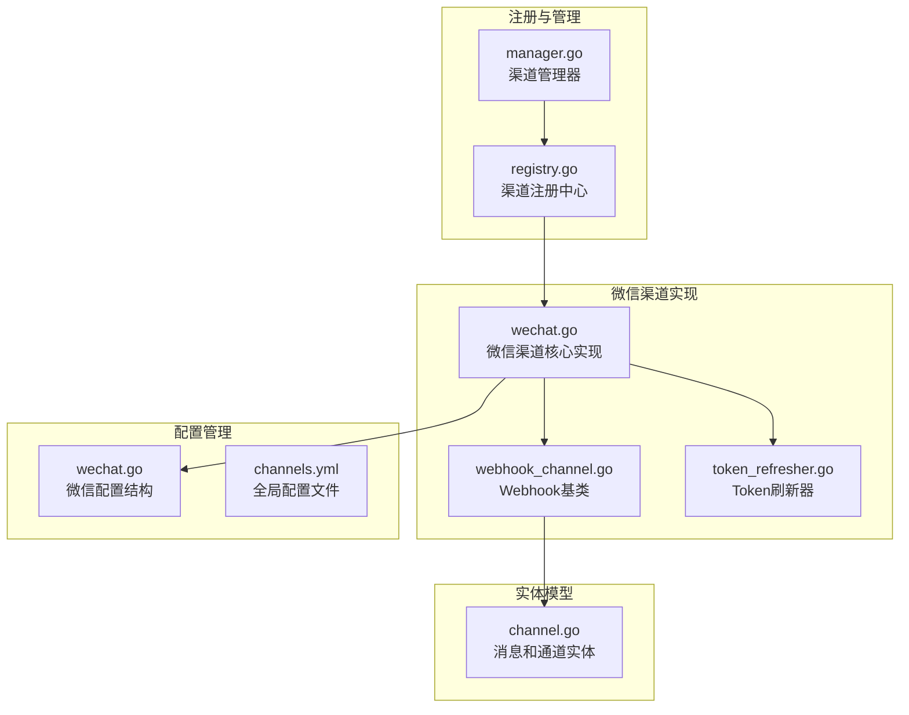
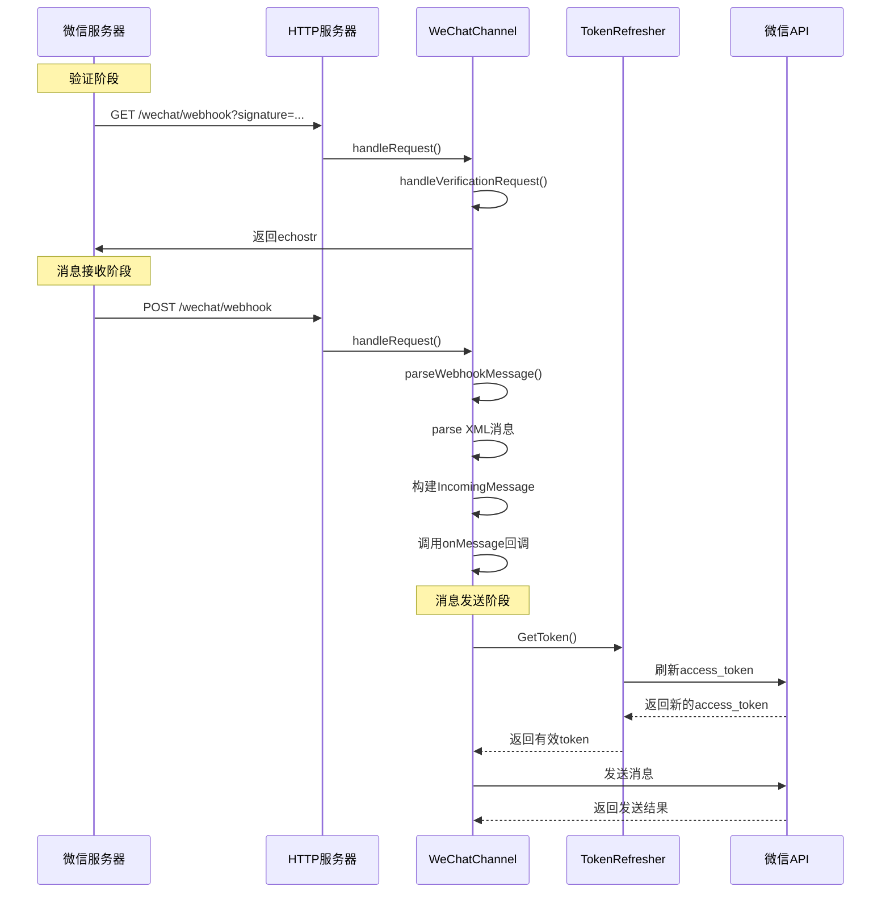
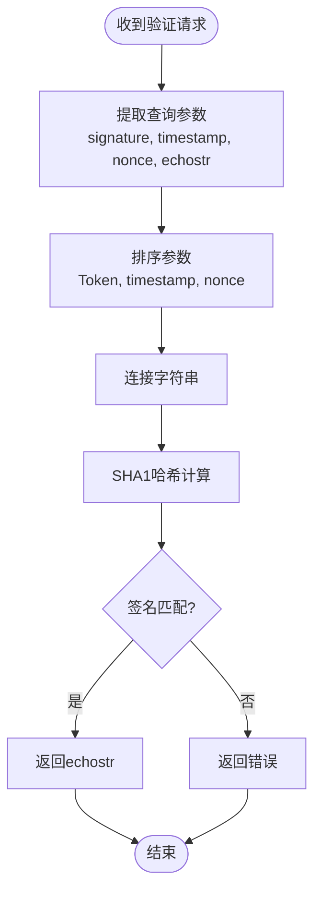
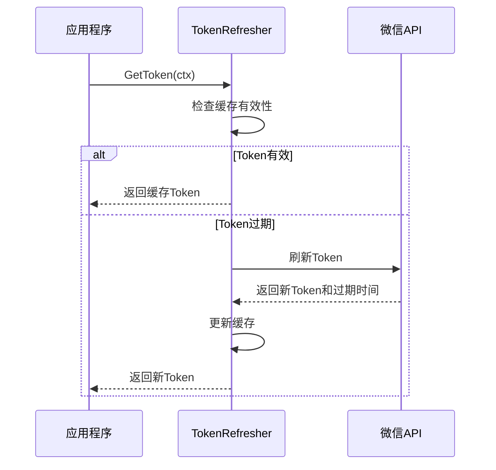
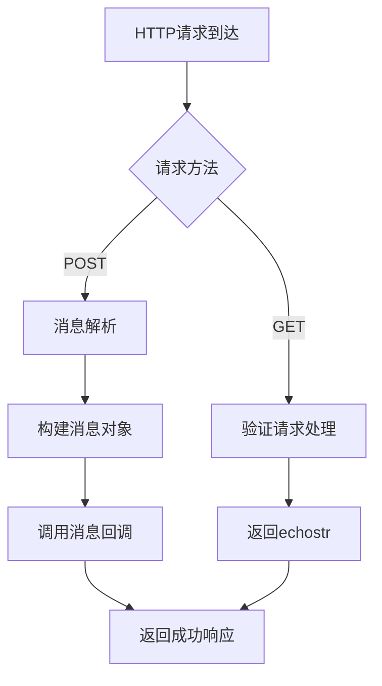
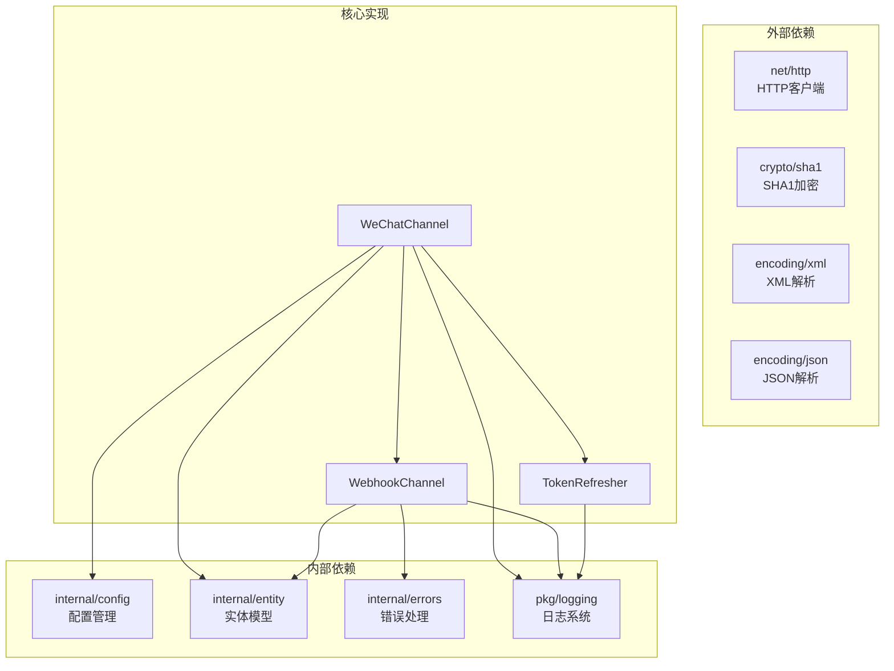

# 微信渠道实现

<cite>
**本文档引用的文件**
- [wechat.go](file://internal/adapters/channels/wechat.go)
- [webhook_channel.go](file://internal/adapters/channels/webhook_channel.go)
- [token_refresher.go](file://internal/adapters/channels/token_refresher.go)
- [wechat.go](file://internal/config/wechat.go)
- [channels.yml](file://config/channels.yml)
- [channel.go](file://internal/entity/channel.go)
- [registry.go](file://internal/adapters/channels/registry.go)
- [manager.go](file://internal/adapters/channels/manager.go)
- [logger.go](file://pkg/logging/logger.go)
</cite>

## 目录
1. [简介](#简介)
2. [项目结构](#项目结构)
3. [核心组件](#核心组件)
4. [架构概览](#架构概览)
5. [详细组件分析](#详细组件分析)
6. [依赖关系分析](#依赖关系分析)
7. [性能考虑](#性能考虑)
8. [故障排除指南](#故障排除指南)
9. [结论](#结论)
10. [附录](#附录)

## 简介

本文档详细介绍了MindX项目中微信渠道的实现，包括微信公众号和企业微信的Webhook集成方式。该实现提供了完整的消息验证机制、Token刷新策略和消息处理流程，涵盖了微信特有的XML消息格式解析、SHA1签名验证算法和消息路由机制。

微信渠道基于统一的Webhook架构构建，支持微信公众号和企业微信两种模式，通过配置驱动的方式实现灵活的部署和管理。

## 项目结构

微信渠道实现位于项目的适配器层，采用模块化设计，主要包含以下关键文件：



**图表来源**
- [wechat.go](file://internal/adapters/channels/wechat.go#L1-L369)
- [webhook_channel.go](file://internal/adapters/channels/webhook_channel.go#L1-L306)
- [token_refresher.go](file://internal/adapters/channels/token_refresher.go#L1-L58)

**章节来源**
- [wechat.go](file://internal/adapters/channels/wechat.go#L1-L369)
- [webhook_channel.go](file://internal/adapters/channels/webhook_channel.go#L1-L306)
- [token_refresher.go](file://internal/adapters/channels/token_refresher.go#L1-L58)

## 核心组件

微信渠道实现包含以下核心组件：

### 1. WeChatChannel 主类
- 继承自WebhookChannel基类
- 实现微信特有的消息解析和验证逻辑
- 提供access_token管理和消息发送功能

### 2. WeChatMessage 数据结构
- 定义微信XML消息的标准字段
- 支持文本消息、事件消息等多种类型
- 提供消息元数据的完整封装

### 3. TokenRefresher 统一Token管理
- 实现双重检查锁的线程安全Token缓存
- 自动处理access_token的获取和刷新
- 提供统一的Token刷新接口

### 4. WebhookChannel 基类
- 提供Webhook消息处理的通用框架
- 支持验证请求和业务消息的分离处理
- 实现消息回调机制和状态管理

**章节来源**
- [wechat.go](file://internal/adapters/channels/wechat.go#L51-L80)
- [wechat.go](file://internal/adapters/channels/wechat.go#L39-L49)
- [token_refresher.go](file://internal/adapters/channels/token_refresher.go#L10-L27)
- [webhook_channel.go](file://internal/adapters/channels/webhook_channel.go#L29-L63)

## 架构概览

微信渠道采用分层架构设计，实现了高内聚、低耦合的模块化结构：



**图表来源**
- [wechat.go](file://internal/adapters/channels/wechat.go#L129-L158)
- [wechat.go](file://internal/adapters/channels/wechat.go#L317-L368)
- [token_refresher.go](file://internal/adapters/channels/token_refresher.go#L29-L57)

## 详细组件分析

### WeChatChannel 类分析

WeChatChannel是微信渠道的核心实现，继承自WebhookChannel基类，提供了微信特有的功能：

```mermaid
classDiagram
class WeChatChannel {
-WebhookChannel WebhookChannel
-WeChatConfig config
-TokenRefresher tokenRefresher
-http.Client httpClient
+Description() string
+Start(ctx) error
+SendMessage(ctx, msg) error
-refreshToken(ctx) (string, int, error)
-handleRequest(w, r)
-parseWebhookMessage(body, r) *IncomingMessage
-handleVerificationRequest(r) *IncomingMessage
}
class WebhookChannel {
-string platformName
-ChannelType platformType
-interface{} config
-http.Server server
-string webhookPath
-func onMessage
-bool isRunning
-time startTime
-int64 totalMsg
-time lastMsgTime
-ChannelStatus status
-Logger logger
-WebhookParser parser
+Start(ctx) error
+Stop() error
+IsRunning() bool
+SetOnMessage(callback)
+SendMessage(ctx, msg) error
+GetStatus() *ChannelStatus
}
class WeChatMessage {
+xml.Name XMLName
+string ToUserName
+string FromUserName
+int64 CreateTime
+string MsgType
+string Content
+int64 MsgID
+string Event
}
WeChatChannel --|> WebhookChannel
WeChatChannel --> WeChatMessage : "使用"
```

**图表来源**
- [wechat.go](file://internal/adapters/channels/wechat.go#L51-L80)
- [webhook_channel.go](file://internal/adapters/channels/webhook_channel.go#L29-L63)
- [wechat.go](file://internal/adapters/channels/wechat.go#L39-L49)

#### 消息验证机制

微信消息验证采用SHA1签名算法，确保消息来源的真实性：



**图表来源**
- [wechat.go](file://internal/adapters/channels/wechat.go#L272-L315)

#### XML消息格式解析

微信采用XML格式传输消息，WeChatMessage结构体定义了标准字段：

| 字段名 | 类型 | 描述 | 必需 |
|--------|------|------|------|
| ToUserName | string | 接收方用户名 | 是 |
| FromUserName | string | 发送方用户名 | 是 |
| CreateTime | int64 | 消息创建时间 | 是 |
| MsgType | string | 消息类型(text/image/location...) | 是 |
| Content | string | 文本消息内容 | 视类型而定 |
| MsgID | int64 | 消息ID | 是 |
| Event | string | 事件类型(subscribe/unsubscribe...) | 视类型而定 |

**章节来源**
- [wechat.go](file://internal/adapters/channels/wechat.go#L233-L270)
- [wechat.go](file://internal/adapters/channels/wechat.go#L39-L49)

### Token刷新策略

微信API需要有效的access_token进行消息发送，TokenRefresher提供了智能的Token管理：



**图表来源**
- [token_refresher.go](file://internal/adapters/channels/token_refresher.go#L29-L57)

#### Token刷新算法

TokenRefresher采用双重检查锁模式，确保线程安全和性能优化：

1. **第一次检查**：读锁检查Token是否有效
2. **第二次检查**：写锁再次检查，防止竞态条件
3. **刷新操作**：调用refreshFunc获取新Token
4. **缓存更新**：设置新的Token和过期时间

**章节来源**
- [token_refresher.go](file://internal/adapters/channels/token_refresher.go#L29-L57)

### Webhook消息处理流程

WebhookChannel提供了统一的消息处理框架：



**图表来源**
- [webhook_channel.go](file://internal/adapters/channels/webhook_channel.go#L82-L135)

**章节来源**
- [webhook_channel.go](file://internal/adapters/channels/webhook_channel.go#L82-L135)

## 依赖关系分析

微信渠道实现具有清晰的依赖层次结构：



**图表来源**
- [wechat.go](file://internal/adapters/channels/wechat.go#L3-L22)
- [webhook_channel.go](file://internal/adapters/channels/webhook_channel.go#L3-L14)
- [token_refresher.go](file://internal/adapters/channels/token_refresher.go#L3-L8)

### 关键依赖关系

1. **配置依赖**：WeChatChannel依赖WeChatConfig进行初始化
2. **实体依赖**：使用IncomingMessage和OutgoingMessage进行消息传递
3. **日志依赖**：通过Logger接口进行统一的日志记录
4. **网络依赖**：使用http.Client进行HTTP请求

**章节来源**
- [wechat.go](file://internal/adapters/channels/wechat.go#L12-L21)
- [webhook_channel.go](file://internal/adapters/channels/webhook_channel.go#L3-L14)

## 性能考虑

微信渠道实现采用了多项性能优化措施：

### 1. Token缓存优化
- **双重检查锁**：减少锁竞争，提高并发性能
- **提前刷新**：在Token过期前5分钟刷新，避免请求失败
- **线程安全**：支持高并发场景下的Token获取

### 2. HTTP客户端优化
- **超时控制**：10秒读取超时和写入超时
- **连接复用**：http.Client自动管理连接池
- **错误处理**：完善的错误恢复机制

### 3. 内存管理
- **消息池**：避免频繁的内存分配
- **资源清理**：及时关闭HTTP响应体
- **日志优化**：按需记录日志，减少I/O开销

## 故障排除指南

### 常见问题及解决方案

#### 1. 签名验证失败
**症状**：日志显示"invalid signature"
**原因**：
- Token配置错误
- 时间戳偏差过大
- 参数顺序错误

**解决方法**：
- 检查微信公众号后台的Token配置
- 确认服务器时间同步
- 验证参数排序逻辑

#### 2. access_token获取失败
**症状**：发送消息时报错"failed to get access token"
**原因**：
- AppID或AppSecret配置错误
- 网络连接问题
- 微信API限流

**解决方法**：
- 验证微信开发者凭据
- 检查网络连通性
- 实现重试机制

#### 3. 消息解析错误
**症状**：日志显示"解析微信消息失败"
**原因**：
- XML格式不符合规范
- 编码问题
- 消息格式变更

**解决方法**：
- 验证XML结构完整性
- 检查字符编码设置
- 更新消息结构定义

**章节来源**
- [wechat.go](file://internal/adapters/channels/wechat.go#L272-L315)
- [wechat.go](file://internal/adapters/channels/wechat.go#L82-L122)
- [wechat.go](file://internal/adapters/channels/wechat.go#L233-L270)

## 结论

微信渠道实现展现了良好的软件工程实践，具有以下特点：

1. **模块化设计**：清晰的职责分离和依赖关系
2. **安全性考虑**：完整的签名验证和Token管理
3. **性能优化**：高效的缓存策略和并发处理
4. **可扩展性**：基于接口的设计便于功能扩展
5. **易维护性**：统一的日志和错误处理机制

该实现为微信公众号和企业微信提供了稳定可靠的集成基础，支持高并发场景下的消息处理需求。

## 附录

### 配置参数说明

| 参数名 | 类型 | 必需 | 默认值 | 描述 |
|--------|------|------|--------|------|
| app_id | string | 是 | 无 | 微信应用ID |
| app_secret | string | 是 | 无 | 微信应用密钥 |
| token | string | 是 | 无 | 微信验证Token |
| encoding_aes_key | string | 否 | 无 | 加解密密钥 |
| port | int | 否 | 6061 | Webhook监听端口 |
| path | string | 否 | /wechat/webhook | Webhook路径 |
| type | string | 否 | mp | 微信类型(mp/企业微信) |

### 部署要求

1. **网络要求**：开放端口访问权限
2. **SSL证书**：生产环境建议使用HTTPS
3. **域名绑定**：微信服务器需要可访问的公网域名
4. **防火墙配置**：允许微信服务器访问指定端口

### 安全考虑

1. **签名验证**：必须实现完整的SHA1签名验证
2. **Token保护**：敏感信息应加密存储
3. **输入验证**：对所有外部输入进行严格验证
4. **日志脱敏**：避免在日志中记录敏感信息
5. **超时控制**：设置合理的网络请求超时时间