# 渠道实现

<cite>
**本文档引用的文件**
- [gateway.go](file://internal/adapters/channels/gateway.go)
- [manager.go](file://internal/adapters/channels/manager.go)
- [registry.go](file://internal/adapters/channels/registry.go)
- [webhook_channel.go](file://internal/adapters/channels/webhook_channel.go)
- [realtime.go](file://internal/adapters/channels/realtime.go)
- [session.go](file://internal/adapters/channels/session.go)
- [wechat.go](file://internal/adapters/channels/wechat.go)
- [dingtalk.go](file://internal/adapters/channels/dingtalk.go)
- [telegramchannel.go](file://internal/adapters/channels/telegramchannel.go)
- [qq.go](file://internal/adapters/channels/qq.go)
- [feishu.go](file://internal/adapters/channels/feishu.go)
- [whatsapp.go](file://internal/adapters/channels/whatsapp.go)
- [facebook.go](file://internal/adapters/channels/facebook.go)
- [imessage.go](file://internal/adapters/channels/imessage.go)
- [channels.yml](file://config/channels.yml)
</cite>

## 目录
1. [简介](#简介)
2. [项目结构](#项目结构)
3. [核心组件](#核心组件)
4. [架构总览](#架构总览)
5. [详细组件分析](#详细组件分析)
6. [依赖关系分析](#依赖关系分析)
7. [性能考虑](#性能考虑)
8. [故障排除指南](#故障排除指南)
9. [结论](#结论)
10. [附录](#附录)

## 简介
本文件面向 MindX 的多渠道通信实现，系统性梳理微信、钉钉、Telegram、QQ、飞书、WhatsApp、Facebook、iMessage 等渠道的适配方式，涵盖架构设计、数据流、认证机制、API 调用流程、实时消息处理、Webhook 集成、会话管理与错误恢复策略，并提供配置参数、环境变量与部署要求说明，以及扩展开发指南。

## 项目结构
MindX 的渠道适配采用“网关 + 通道管理 + 通道工厂注册”的分层架构：
- 网关层负责消息路由、转发、通道切换与实时同步
- 通道管理层负责通道生命周期管理与并发控制
- 通道工厂注册中心按配置动态创建具体渠道实例
- 具体渠道实现遵循统一接口，支持 Webhook/HTTP/WebSocket 等多种接入模式

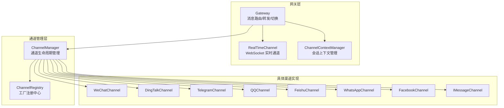

图表来源
- [gateway.go](file://internal/adapters/channels/gateway.go#L1-L510)
- [manager.go](file://internal/adapters/channels/manager.go#L1-L230)
- [registry.go](file://internal/adapters/channels/registry.go#L1-L142)
- [webhook_channel.go](file://internal/adapters/channels/webhook_channel.go#L1-L306)
- [realtime.go](file://internal/adapters/channels/realtime.go#L1-L567)

章节来源
- [gateway.go](file://internal/adapters/channels/gateway.go#L1-L510)
- [manager.go](file://internal/adapters/channels/manager.go#L1-L230)
- [registry.go](file://internal/adapters/channels/registry.go#L1-L142)

## 核心组件
- 网关 Gateway：统一入口，负责消息接收、会话上下文确保、实时同步、语义转发与通道切换
- 通道管理 ChannelManager：集中管理通道生命周期，支持批量启动/停止、查询与并发安全
- 通道注册中心 ChannelRegistry：按名称注册工厂函数，实现配置驱动的通道创建
- WebhookChannel 基类：抽象 Webhook/HTTP 渠道的通用处理逻辑（解析、验证、回调）
- RealTimeChannel：WebSocket 实时通道，支持 Web/Terminal UI 实时展示
- 会话上下文 ChannelContextManager：维护每个会话当前使用的通道，支持切换与持久化

章节来源
- [gateway.go](file://internal/adapters/channels/gateway.go#L1-L510)
- [manager.go](file://internal/adapters/channels/manager.go#L1-L230)
- [registry.go](file://internal/adapters/channels/registry.go#L1-L142)
- [webhook_channel.go](file://internal/adapters/channels/webhook_channel.go#L1-L306)
- [realtime.go](file://internal/adapters/channels/realtime.go#L1-L567)
- [session.go](file://internal/adapters/channels/session.go#L1-L177)

## 架构总览
消息从任意渠道进入，经网关统一处理：
1. 确保会话上下文存在
2. 同步到 RealTimeChannel 以保证 UI 实时可见
3. 调用业务回调生成回答
4. 将回答发送回当前通道
5. 若 SendTo 存在，使用语义向量匹配目标通道并转发
6. 若回答内容语义指向其他通道，触发通道切换

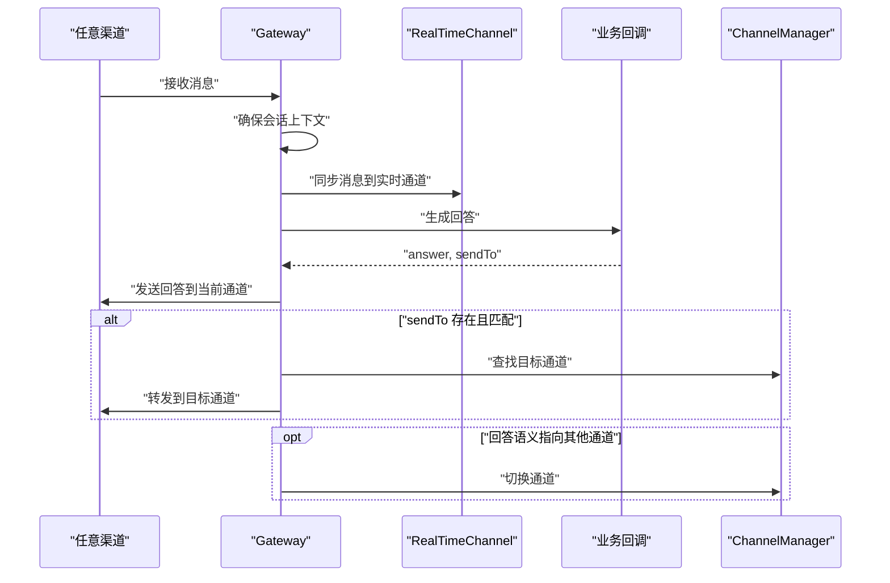

图表来源
- [gateway.go](file://internal/adapters/channels/gateway.go#L74-L272)
- [realtime.go](file://internal/adapters/channels/realtime.go#L290-L350)
- [manager.go](file://internal/adapters/channels/manager.go#L123-L147)

章节来源
- [gateway.go](file://internal/adapters/channels/gateway.go#L74-L272)

## 详细组件分析

### 网关 Gateway
- 职责：消息路由、转发、通道切换、实时同步、优雅关闭
- 关键能力：
  - 会话上下文管理：确保每个会话的当前通道存在
  - 实时同步：将非实时通道的消息同步到 RealTimeChannel
  - 语义转发：基于 EmbeddingService 对 SendTo 内容进行向量匹配，选择目标通道
  - 通道切换：根据回答内容语义自动切换通道
  - 优雅关闭：等待活跃消息处理完毕再停止所有通道

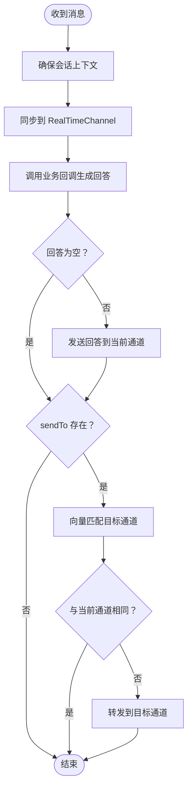

图表来源
- [gateway.go](file://internal/adapters/channels/gateway.go#L120-L272)

章节来源
- [gateway.go](file://internal/adapters/channels/gateway.go#L1-L510)

### 通道管理 ChannelManager
- 职责：通道生命周期管理（添加、启动、停止、查询）
- 特性：线程安全、批量启动、错误聚合、日志记录

章节来源
- [manager.go](file://internal/adapters/channels/manager.go#L1-L230)

### 通道注册中心 ChannelRegistry
- 职责：集中注册各渠道工厂函数，提供按名称获取工厂的能力
- 特性：辅助配置解析工具函数（字符串/整数/布尔）

章节来源
- [registry.go](file://internal/adapters/channels/registry.go#L1-L142)

### WebhookChannel 基类
- 职责：统一处理 Webhook/HTTP 渠道的请求解析、验证、回调分发
- 特性：支持自定义解析器、验证处理、生命周期上下文、状态统计

章节来源
- [webhook_channel.go](file://internal/adapters/channels/webhook_channel.go#L1-L306)

### RealTimeChannel 实时通道
- 职责：WebSocket 实时通道，支持多客户端连接、心跳、思考事件流、消息广播
- 特性：连接数限制、Origin 白名单、Ping/Pong 心跳、会话绑定

章节来源
- [realtime.go](file://internal/adapters/channels/realtime.go#L1-L567)

### 会话上下文管理 ChannelContextManager
- 职责：维护每个会话的当前通道，支持新增、切换、查询、清理
- 特性：默认通道、原因记录、线程安全

章节来源
- [session.go](file://internal/adapters/channels/session.go#L1-L177)

### 微信 WeChatChannel
- 接入方式：Webhook（HTTP），支持微信公众号/企业微信
- 认证机制：Token 校验（SHA1 签名）、Access Token 刷新
- API 调用：自定义消息发送（POST /message/custom/send）
- 配置参数：port、path、app_id、app_secret、token、encoding_aes_key
- 部署要求：公网可访问域名、HTTPS（部分平台要求）

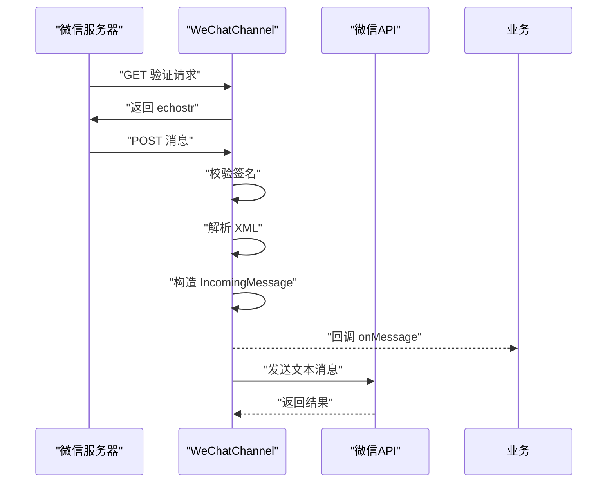

图表来源
- [wechat.go](file://internal/adapters/channels/wechat.go#L272-L368)

章节来源
- [wechat.go](file://internal/adapters/channels/wechat.go#L1-L369)
- [channels.yml](file://config/channels.yml#L71-L83)

### 钉钉 DingTalkChannel
- 接入方式：Webhook（HTTP）或 API（企业内部）
- 认证机制：签名验证（timestamp + encrypt_key）、Access Token 刷新
- API 调用：Webhook（带签名参数）或企业内部 API 异步发送
- 配置参数：port、path、app_key、app_secret、agent_id、encrypt_key、webhook_secret
- 部署要求：内网穿透或公网可访问、签名密钥配置

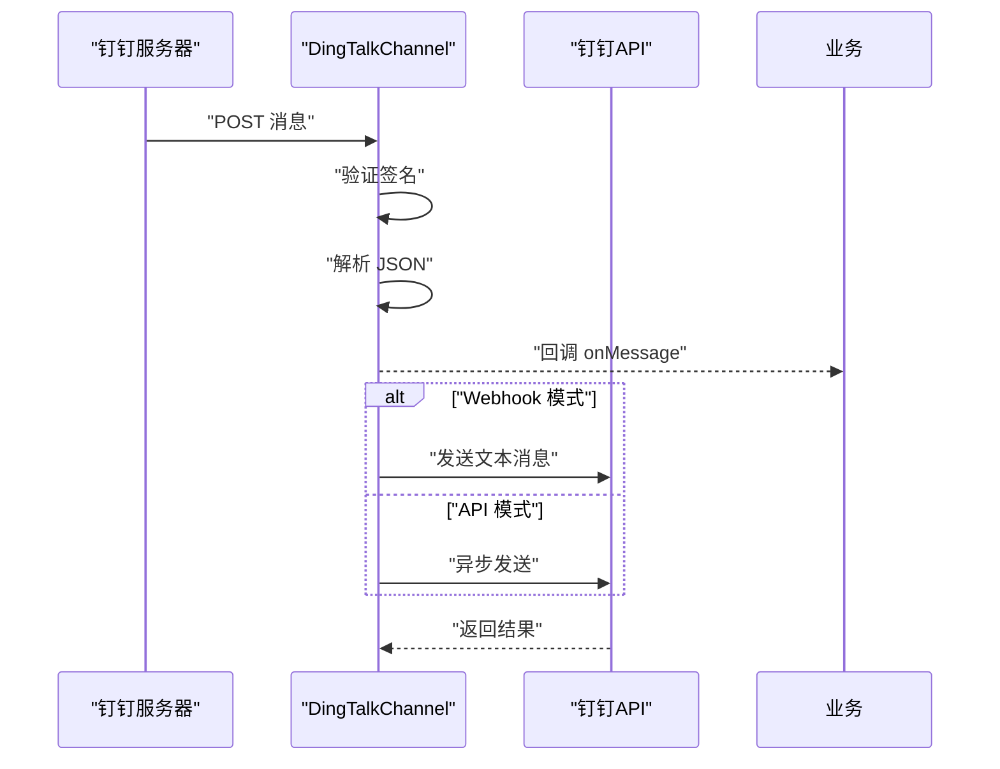

图表来源
- [dingtalk.go](file://internal/adapters/channels/dingtalk.go#L310-L362)

章节来源
- [dingtalk.go](file://internal/adapters/channels/dingtalk.go#L1-L431)
- [channels.yml](file://config/channels.yml#L3-L15)

### Telegram Channel
- 接入方式：Webhook（HTTP）或 Bot API
- 认证机制：Secret Token 校验、Bot Token
- API 调用：sendMessage
- 配置参数：port、path、bot_token、webhook_url、secret_token、use_webhook
- 部署要求：公网可访问域名、可选设置 Webhook URL

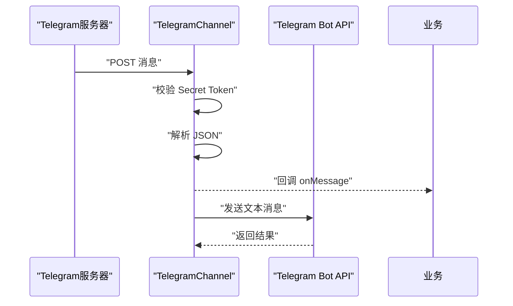

图表来源
- [telegramchannel.go](file://internal/adapters/channels/telegramchannel.go#L222-L264)

章节来源
- [telegramchannel.go](file://internal/adapters/channels/telegramchannel.go#L1-L334)
- [channels.yml](file://config/channels.yml#L59-L70)

### QQ Channel
- 接入方式：Webhook（HTTP）或 OneBot WebSocket
- 认证机制：Bearer Token（可选）
- API 调用：WebSocket send_private_msg/send_group_msg 或 HTTP 端点
- 配置参数：port、path、app_id、app_secret、token、websocket_url、access_token
- 部署要求：OneBot 服务端（如 Go-CQHTTP）或本地 HTTP 服务

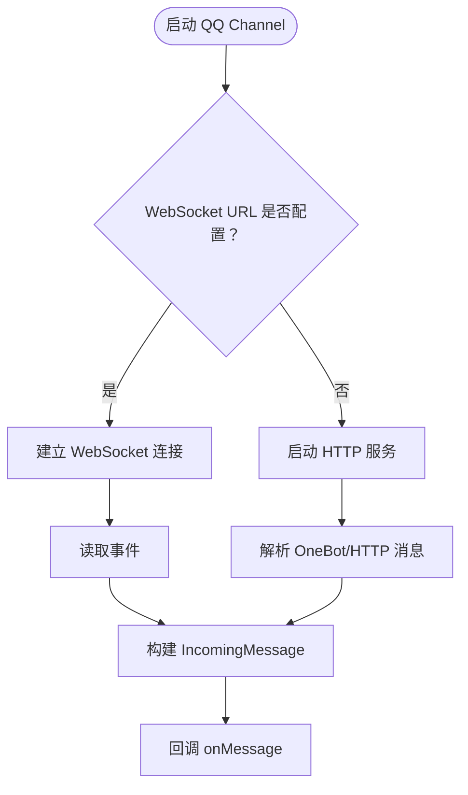

图表来源
- [qq.go](file://internal/adapters/channels/qq.go#L135-L254)

章节来源
- [qq.go](file://internal/adapters/channels/qq.go#L1-L489)
- [channels.yml](file://config/channels.yml#L47-L58)

### 飞书 FeishuChannel
- 接入方式：Webhook（HTTP）
- 认证机制：Verification Token（HMAC-SHA256 签名）
- API 调用：IM 文本消息发送（receive_id_type 自动推断）
- 配置参数：port、path、app_id、app_secret、encrypt_key、verification_token
- 部署要求：公网可访问域名、签名验证

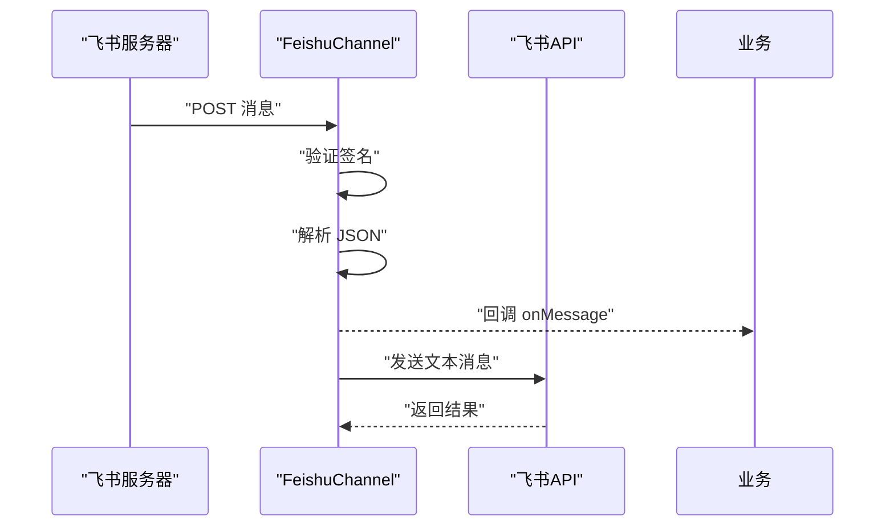

图表来源
- [feishu.go](file://internal/adapters/channels/feishu.go#L238-L276)

章节来源
- [feishu.go](file://internal/adapters/channels/feishu.go#L1-L415)
- [channels.yml](file://config/channels.yml#L28-L36)

### WhatsApp Channel
- 接入方式：Webhook（HTTP）
- 认证机制：Verify Token 校验
- API 调用：Graph API 发送消息
- 配置参数：port、path、phone_number_id、business_id、access_token、verify_token
- 部署要求：Facebook 商业云 API 配置、Verify Token

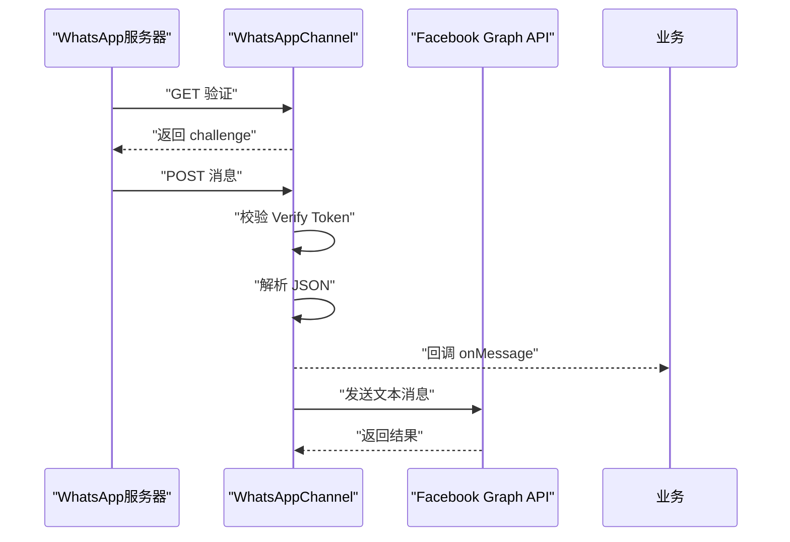

图表来源
- [whatsapp.go](file://internal/adapters/channels/whatsapp.go#L165-L202)

章节来源
- [whatsapp.go](file://internal/adapters/channels/whatsapp.go#L1-L303)
- [channels.yml](file://config/channels.yml#L84-L95)

### Facebook Channel
- 接入方式：Webhook（HTTP）
- 认证机制：Verify Token 校验
- API 调用：Graph API 发送消息
- 配置参数：port、path、page_id、page_access_token、app_secret、verify_token
- 部署要求：Facebook Page 配置、Verify Token

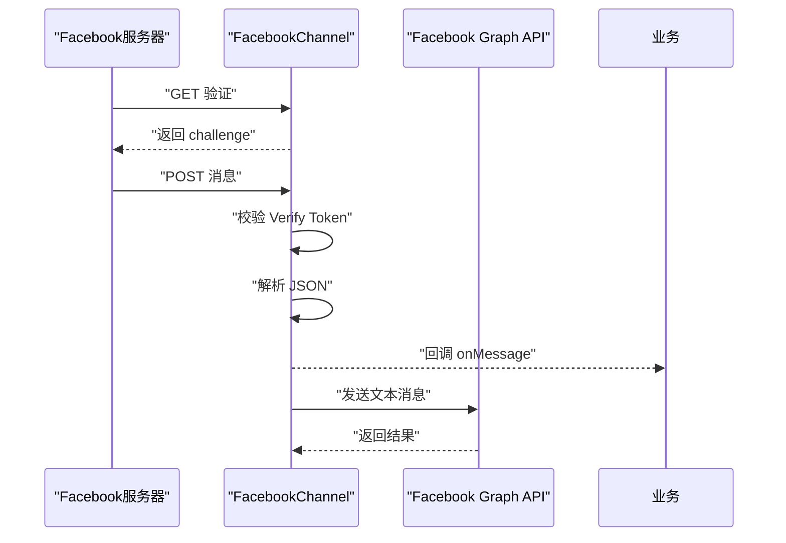

图表来源
- [facebook.go](file://internal/adapters/channels/facebook.go#L162-L199)

章节来源
- [facebook.go](file://internal/adapters/channels/facebook.go#L1-L279)
- [channels.yml](file://config/channels.yml#L16-L27)

### iMessage Channel
- 接入方式：本地 CLI 工具（steipete/imsg）监控与发送
- 认证机制：无外部 API 认证
- API 调用：imsg watch/send
- 配置参数：enabled、imsg_path、region、debounce、watch_since
- 部署要求：macOS 环境、安装 imsg 工具

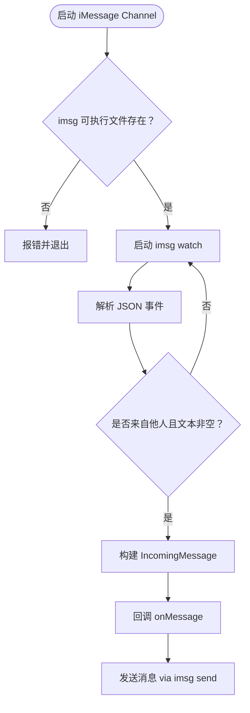

图表来源
- [imessage.go](file://internal/adapters/channels/imessage.go#L185-L271)

章节来源
- [imessage.go](file://internal/adapters/channels/imessage.go#L1-L272)
- [channels.yml](file://config/channels.yml#L37-L46)

## 依赖关系分析
- 通道工厂注册：各渠道在 init() 中通过 Register 注册工厂函数
- 通道创建：ChannelManager 通过 GetFactory 获取工厂并创建实例
- 通道启动：统一通过 ChannelManager.CreateAndStartChannel 启动，设置回调并并发启动
- 网关依赖：Gateway 持有 ChannelManager、ChannelContextManager、EmbeddingService，负责消息路由与转发

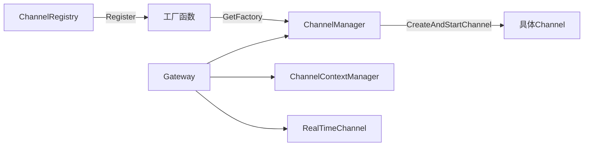

图表来源
- [registry.go](file://internal/adapters/channels/registry.go#L25-L38)
- [manager.go](file://internal/adapters/channels/manager.go#L123-L147)
- [gateway.go](file://internal/adapters/channels/gateway.go#L17-L28)

章节来源
- [registry.go](file://internal/adapters/channels/registry.go#L1-L142)
- [manager.go](file://internal/adapters/channels/manager.go#L1-L230)
- [gateway.go](file://internal/adapters/channels/gateway.go#L1-L510)

## 性能考虑
- 并发与资源：ChannelManager 使用互斥锁保护通道集合；Gateway 使用 WaitGroup 与活跃消息计数保障优雅关闭
- 超时与重试：各渠道 HTTP 客户端设置合理超时；发送路径封装断路器（breaker）以提升稳定性
- 实时性：所有通道消息均同步到 RealTimeChannel，确保 UI 实时可见
- 向量匹配：预计算通道向量，减少运行时开销；相似度阈值可调

章节来源
- [manager.go](file://internal/adapters/channels/manager.go#L1-L230)
- [gateway.go](file://internal/adapters/channels/gateway.go#L397-L453)
- [realtime.go](file://internal/adapters/channels/realtime.go#L1-L567)

## 故障排除指南
- 通道启动失败：检查配置项（端口、路径、密钥）与网络连通性
- Webhook 验证失败：确认签名算法、时间戳新鲜度、Verify Token
- Access Token 过期：使用 TokenRefresher 自动刷新，注意刷新频率与缓存
- 实时通道无连接：检查 WebSocket 连接数限制、Origin 白名单、Ping/Pong 心跳
- iMessage 无法发送：确认 imsg 可执行文件路径、权限、区域设置

章节来源
- [wechat.go](file://internal/adapters/channels/wechat.go#L272-L315)
- [dingtalk.go](file://internal/adapters/channels/dingtalk.go#L364-L387)
- [telegramchannel.go](file://internal/adapters/channels/telegramchannel.go#L222-L240)
- [feishu.go](file://internal/adapters/channels/feishu.go#L356-L371)
- [whatsapp.go](file://internal/adapters/channels/whatsapp.go#L204-L219)
- [facebook.go](file://internal/adapters/channels/facebook.go#L201-L216)
- [imessage.go](file://internal/adapters/channels/imessage.go#L86-L123)

## 结论
MindX 的渠道适配通过统一网关与工厂注册机制，实现了对多平台渠道的一致接入与管理。借助会话上下文与实时通道，系统在多入口场景下仍能保持一致的用户体验与可观测性。针对不同平台的认证与 API 差异，采用基类抽象与子类实现相结合的方式，既保证了扩展性，也降低了维护成本。

## 附录

### 配置参数与环境变量
- 通用配置文件：config/channels.yml
- 环境变量：
  - MINDX_DEV_MODE：开启后允许跨域访问 WebSocket
- 各渠道配置要点：
  - 微信：app_id、app_secret、token、encoding_aes_key、port/path
  - 钉钉：app_key、app_secret、agent_id、encrypt_key、webhook_secret、port/path
  - Telegram：bot_token、webhook_url、secret_token、use_webhook、port/path
  - QQ：websocket_url 或 port/path、access_token、app_id、app_secret、token
  - 飞书：app_id、app_secret、encrypt_key、verification_token、port/path
  - WhatsApp：phone_number_id、access_token、verify_token、port/path
  - Facebook：page_id、page_access_token、app_secret、verify_token、port/path
  - iMessage：imsg_path、region、debounce、watch_since、enabled

章节来源
- [channels.yml](file://config/channels.yml#L1-L96)
- [realtime.go](file://internal/adapters/channels/realtime.go#L51-L77)

### 部署要求
- 网络连通性：各 Webhook/HTTP 渠道需公网可访问，或通过内网穿透
- 证书与域名：HTTPS 建议开启，部分平台要求
- WebSocket：RealTimeChannel 需开放端口并配置 CORS/Origin 白名单
- 平台权限：各平台需在开发者后台配置回调地址、密钥与权限

章节来源
- [wechat.go](file://internal/adapters/channels/wechat.go#L129-L158)
- [dingtalk.go](file://internal/adapters/channels/dingtalk.go#L117-L145)
- [telegramchannel.go](file://internal/adapters/channels/telegramchannel.go#L61-L96)
- [feishu.go](file://internal/adapters/channels/feishu.go#L119-L147)
- [whatsapp.go](file://internal/adapters/channels/whatsapp.go#L61-L86)
- [facebook.go](file://internal/adapters/channels/facebook.go#L60-L85)
- [qq.go](file://internal/adapters/channels/qq.go#L86-L126)
- [imessage.go](file://internal/adapters/channels/imessage.go#L86-L107)

### 扩展开发指南
- 新增渠道步骤：
  1. 在对应文件中实现 init() 注册工厂函数
  2. 实现 Channel 接口（Name/Type/Description/Start/Stop/SendMessage/SetOnMessage）
  3. 如为 Webhook/HTTP 渠道，继承 WebhookChannel 并实现 parseWebhookMessage/HandleVerification
  4. 在 config/channels.yml 中添加配置模板
  5. 在 ChannelManager.CreateChannelsFromConfig 中按需并发创建
- 认证与安全：
  - 严格校验签名与时间戳（如钉钉、飞书）
  - 使用 TokenRefresher 管理 Access Token 生命周期
  - 限制 WebSocket 连接数与 Origin
- 错误恢复：
  - 使用断路器包装外部 API 调用
  - 在 Gateway 层统一捕获错误并反馈到当前通道
  - 提供优雅关闭流程，等待活跃消息处理完毕

章节来源
- [registry.go](file://internal/adapters/channels/registry.go#L25-L38)
- [webhook_channel.go](file://internal/adapters/channels/webhook_channel.go#L49-L80)
- [manager.go](file://internal/adapters/channels/manager.go#L149-L229)
- [gateway.go](file://internal/adapters/channels/gateway.go#L455-L495)