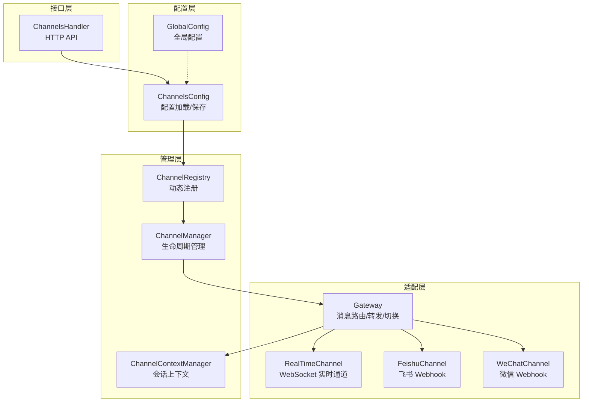
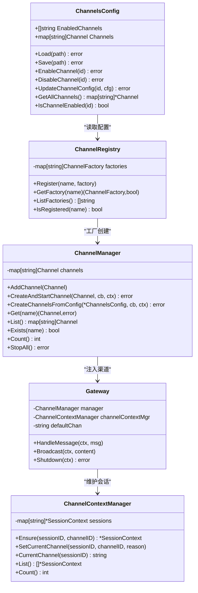
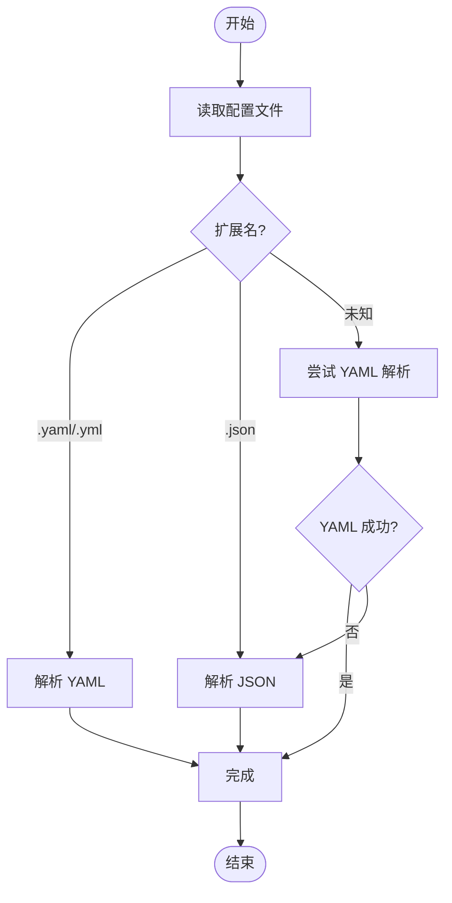
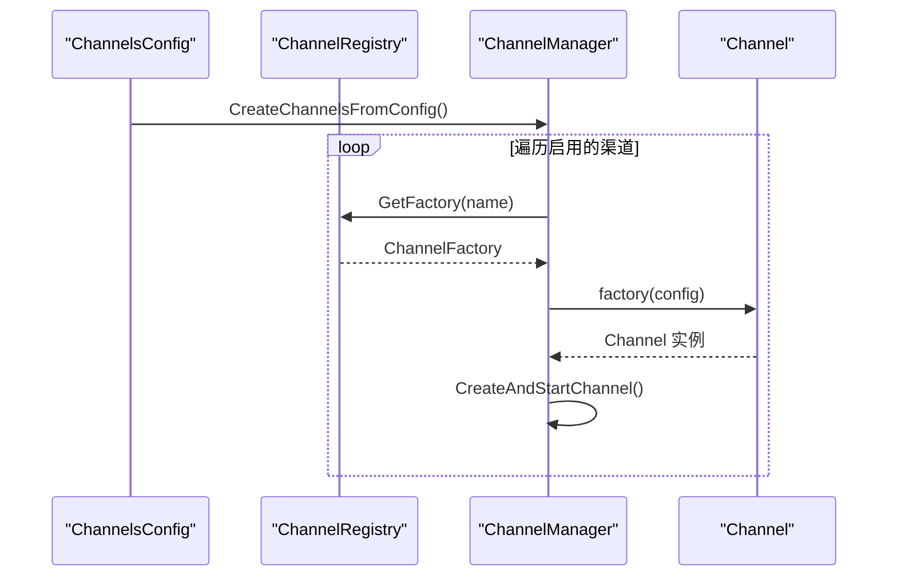
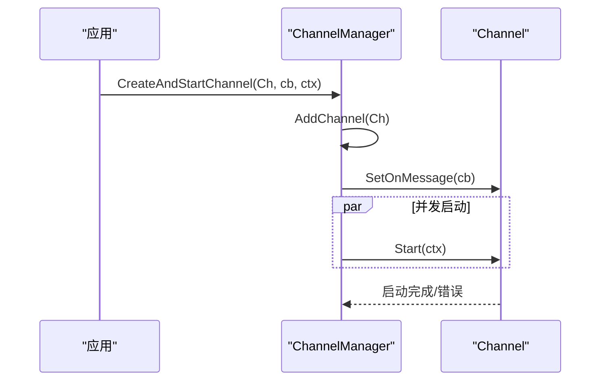
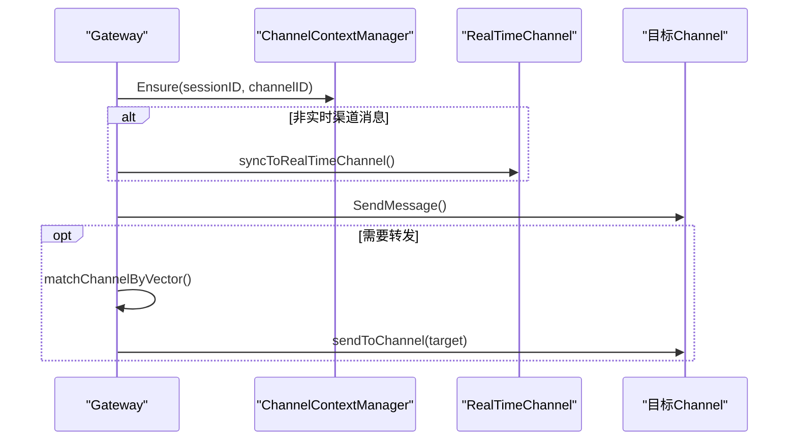
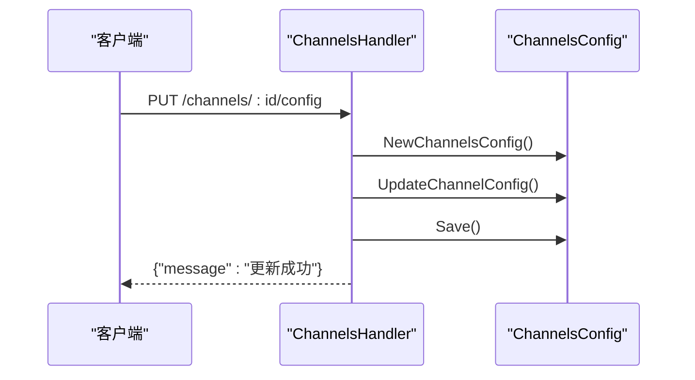
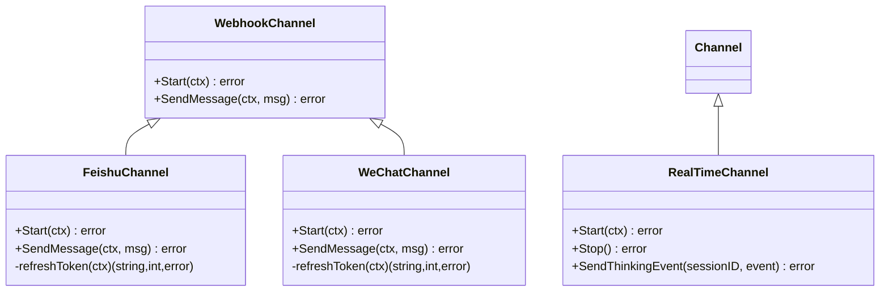
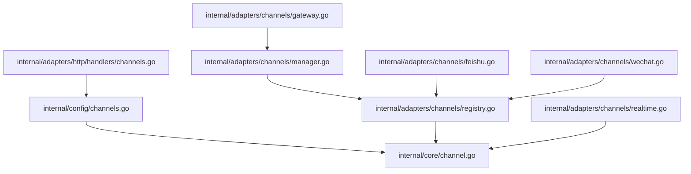

# 渠道配置管理

<cite>
**本文档引用的文件**
- [channels.yml](file://config/channels.yml)
- [channels.go](file://internal/config/channels.go)
- [manager.go](file://internal/adapters/channels/manager.go)
- [registry.go](file://internal/adapters/channels/registry.go)
- [gateway.go](file://internal/adapters/channels/gateway.go)
- [session.go](file://internal/adapters/channels/session.go)
- [channel.go](file://internal/core/channel.go)
- [channels.go](file://internal/adapters/http/handlers/channels.go)
- [feishu.go](file://internal/adapters/channels/feishu.go)
- [wechat.go](file://internal/adapters/channels/wechat.go)
- [realtime.go](file://internal/adapters/channels/realtime.go)
- [global.go](file://internal/config/global.go)
- [manager.go](file://internal/config/manager.go)
</cite>

## 目录
1. [简介](#简介)
2. [项目结构](#项目结构)
3. [核心组件](#核心组件)
4. [架构概览](#架构概览)
5. [详细组件分析](#详细组件分析)
6. [依赖关系分析](#依赖关系分析)
7. [性能考虑](#性能考虑)
8. [故障排查指南](#故障排查指南)
9. [结论](#结论)
10. [附录](#附录)

## 简介
本文件为 MindX 渠道配置管理的全面技术文档，重点阐述渠道管理器的架构设计、动态注册机制与生命周期管理；解释渠道配置的加载流程、热更新机制与配置验证策略；阐述渠道会话管理、状态同步与资源清理机制；并提供配置文件格式、环境变量支持与配置优先级规则，以及具体的配置示例、故障诊断与运维最佳实践。

## 项目结构
MindX 的渠道配置管理围绕以下关键层次组织：
- 配置层：负责渠道配置的加载、保存与验证
- 管理层：负责渠道的动态注册、创建与生命周期管理
- 适配层：负责具体渠道协议实现与消息路由
- 接口层：对外提供 HTTP API 以支持配置的热更新与状态查询

**图表来源**
- [channels.go](file://internal/config/channels.go#L1-L149)
- [manager.go](file://internal/adapters/channels/manager.go#L1-L230)
- [registry.go](file://internal/adapters/channels/registry.go#L1-L142)
- [gateway.go](file://internal/adapters/channels/gateway.go#L1-L510)
- [session.go](file://internal/adapters/channels/session.go#L1-L177)
- [channels.go](file://internal/adapters/http/handlers/channels.go#L1-L214)

**章节来源**
- [channels.go](file://internal/config/channels.go#L1-L149)
- [manager.go](file://internal/adapters/channels/manager.go#L1-L230)
- [registry.go](file://internal/adapters/channels/registry.go#L1-L142)
- [gateway.go](file://internal/adapters/channels/gateway.go#L1-L510)
- [session.go](file://internal/adapters/channels/session.go#L1-L177)
- [channels.go](file://internal/adapters/http/handlers/channels.go#L1-L214)

## 核心组件
- ChannelsConfig：统一的渠道配置模型，支持 YAML/JSON 加载与保存，并提供启用/禁用、更新配置等操作
- ChannelRegistry：全局渠道工厂注册中心，实现按名称动态查找与创建
- ChannelManager：渠道生命周期管理器，负责创建、启动、停止与查询渠道
- Gateway：消息网关，负责消息路由、转发、语义化通道切换与状态同步
- ChannelContextManager：会话上下文管理器，维护每个会话当前使用的渠道
- ChannelsHandler：HTTP API 层，提供配置查询、更新、启停等接口

**章节来源**
- [channels.go](file://internal/config/channels.go#L11-L149)
- [registry.go](file://internal/adapters/channels/registry.go#L14-L53)
- [manager.go](file://internal/adapters/channels/manager.go#L15-L230)
- [gateway.go](file://internal/adapters/channels/gateway.go#L15-L510)
- [session.go](file://internal/adapters/channels/session.go#L11-L177)
- [channels.go](file://internal/adapters/http/handlers/channels.go#L13-L214)

## 架构概览
渠道配置管理采用“配置驱动 + 动态注册 + 生命周期管理”的架构模式：
- 配置驱动：ChannelsConfig 定义渠道配置结构，支持多格式加载与保存
- 动态注册：ChannelRegistry 提供工厂函数注册与查找，各渠道包在 init() 中自动注册
- 生命周期管理：ChannelManager 负责并发创建与启动渠道，支持批量停止
- 消息路由：Gateway 负责消息分发、转发与语义化切换，确保状态一致性
- 会话管理：ChannelContextManager 维护会话与渠道的映射关系，支持默认渠道设置

**图表来源**
- [channels.go](file://internal/config/channels.go#L11-L149)
- [registry.go](file://internal/adapters/channels/registry.go#L14-L53)
- [manager.go](file://internal/adapters/channels/manager.go#L15-L230)
- [gateway.go](file://internal/adapters/channels/gateway.go#L15-L510)
- [session.go](file://internal/adapters/channels/session.go#L11-L177)

**章节来源**
- [channels.go](file://internal/config/channels.go#L23-L149)
- [registry.go](file://internal/adapters/channels/registry.go#L25-L53)
- [manager.go](file://internal/adapters/channels/manager.go#L149-L230)
- [gateway.go](file://internal/adapters/channels/gateway.go#L33-L120)
- [session.go](file://internal/adapters/channels/session.go#L29-L177)

## 详细组件分析

### 配置模型与加载流程
- ChannelsConfig 支持 YAML/JSON 自动识别加载，若扩展名未知则先尝试 YAML 解析，失败再尝试 JSON
- Save 方法根据扩展名选择 YAML 或 JSON 输出格式
- 提供 EnableChannel/DisableChannel/UpdateChannelConfig 等操作，配合 HTTP API 实现热更新

**图表来源**
- [channels.go](file://internal/config/channels.go#L23-L41)

**章节来源**
- [channels.go](file://internal/config/channels.go#L23-L59)

### 动态注册机制
- ChannelRegistry 在全局注册表中维护工厂函数映射
- 各渠道包在 init() 中调用 Register 注册工厂函数
- CreateChannelsFromConfig 通过 GetFactory 获取工厂并创建渠道实例

**图表来源**
- [registry.go](file://internal/adapters/channels/registry.go#L25-L38)
- [manager.go](file://internal/adapters/channels/manager.go#L149-L203)

**章节来源**
- [registry.go](file://internal/adapters/channels/registry.go#L25-L53)
- [manager.go](file://internal/adapters/channels/manager.go#L149-L203)

### 生命周期管理
- ChannelManager 提供 AddChannel、CreateAndStartChannel、StopAll 等能力
- CreateAndStartChannel 并发启动多个渠道，使用 WaitGroup 与错误收集通道聚合错误
- StopAll 逐个停止运行中的渠道并统计成功数量

**图表来源**
- [manager.go](file://internal/adapters/channels/manager.go#L123-L147)

**章节来源**
- [manager.go](file://internal/adapters/channels/manager.go#L58-L147)

### 会话管理与状态同步
- ChannelContextManager 维护会话到渠道的映射，默认渠道可在构造时指定
- Gateway.HandleMessage 中确保会话上下文存在，并在非实时渠道消息到达时同步到实时通道
- 同步消息格式包含来源渠道与消息类型，便于前端展示

**图表来源**
- [gateway.go](file://internal/adapters/channels/gateway.go#L74-L272)
- [session.go](file://internal/adapters/channels/session.go#L90-L112)

**章节来源**
- [session.go](file://internal/adapters/channels/session.go#L90-L143)
- [gateway.go](file://internal/adapters/channels/gateway.go#L120-L272)

### HTTP API 与热更新
- ChannelsHandler 提供获取配置、更新配置、启用/禁用、启动/停止等接口
- 更新配置后立即保存到磁盘，实现热更新
- 启停接口目前为占位，实际启停由服务管理器与 ChannelManager 协作完成

**图表来源**
- [channels.go](file://internal/adapters/http/handlers/channels.go#L56-L100)

**章节来源**
- [channels.go](file://internal/adapters/http/handlers/channels.go#L31-L214)

### 具体渠道实现示例
- 飞书渠道：基于 WebhookChannel，支持自定义端口与路径，集成 Token 刷新与熔断保护
- 微信渠道：基于 WebhookChannel，支持公众号/企业微信，集成 Token 刷新与安全校验
- 实时通道：基于 WebSocket，支持多客户端连接与思考流事件推送

**图表来源**
- [feishu.go](file://internal/adapters/channels/feishu.go#L35-L147)
- [wechat.go](file://internal/adapters/channels/wechat.go#L51-L158)
- [realtime.go](file://internal/adapters/channels/realtime.go#L18-L151)

**章节来源**
- [feishu.go](file://internal/adapters/channels/feishu.go#L21-L147)
- [wechat.go](file://internal/adapters/channels/wechat.go#L24-L158)
- [realtime.go](file://internal/adapters/channels/realtime.go#L95-L151)

## 依赖关系分析
- 配置层依赖 YAML/JSON 解析库，支持多格式自动识别
- 管理层依赖注册中心与核心 Channel 接口，实现松耦合
- 适配层依赖实体模型与日志库，确保可观测性
- HTTP 层依赖 Gin 框架，提供 RESTful 接口

**图表来源**
- [channels.go](file://internal/config/channels.go#L3-L9)
- [registry.go](file://internal/adapters/channels/registry.go#L3-L7)
- [manager.go](file://internal/adapters/channels/manager.go#L3-L13)
- [gateway.go](file://internal/adapters/channels/gateway.go#L3-L13)
- [channels.go](file://internal/adapters/http/handlers/channels.go#L3-L11)
- [feishu.go](file://internal/adapters/channels/feishu.go#L3-L18)
- [wechat.go](file://internal/adapters/channels/wechat.go#L3-L21)
- [realtime.go](file://internal/adapters/channels/realtime.go#L3-L16)

**章节来源**
- [channels.go](file://internal/config/channels.go#L3-L9)
- [registry.go](file://internal/adapters/channels/registry.go#L3-L7)
- [manager.go](file://internal/adapters/channels/manager.go#L3-L13)
- [gateway.go](file://internal/adapters/channels/gateway.go#L3-L13)
- [channels.go](file://internal/adapters/http/handlers/channels.go#L3-L11)
- [feishu.go](file://internal/adapters/channels/feishu.go#L3-L18)
- [wechat.go](file://internal/adapters/channels/wechat.go#L3-L21)
- [realtime.go](file://internal/adapters/channels/realtime.go#L3-L16)

## 性能考虑
- 并发创建：ChannelManager 使用 goroutine 并发创建渠道，WaitGroup 聚合等待，提高初始化效率
- 资源限制：RealTimeChannel 支持最大连接数与 Ping 间隔配置，避免资源耗尽
- 熔断保护：渠道发送消息时使用熔断器，防止下游异常导致级联故障
- 向量化匹配：Gateway 使用嵌入向量进行语义匹配，减少人工规则复杂度

[本节为通用性能建议，无需列出具体文件来源]

## 故障排查指南
- 配置加载失败：检查配置文件扩展名与格式，确认 YAML/JSON 解析无误
- 渠道未注册：确认对应渠道包的 init() 是否执行注册，使用 ListFactories 检查注册情况
- 启动失败：查看 ChannelManager 的错误聚合输出，定位具体渠道创建/启动错误
- 发送失败：检查对应渠道的令牌刷新与网络连通性，关注熔断器状态
- 会话切换异常：确认 ChannelContextManager 的会话映射是否正确更新

**章节来源**
- [registry.go](file://internal/adapters/channels/registry.go#L40-L53)
- [manager.go](file://internal/adapters/channels/manager.go#L208-L222)
- [gateway.go](file://internal/adapters/channels/gateway.go#L290-L330)

## 结论
MindX 的渠道配置管理通过配置驱动、动态注册与生命周期管理实现了高扩展性与可维护性。HTTP API 支持热更新，Gateway 提供消息路由与语义化切换，ChannelContextManager 确保会话一致性。整体架构清晰、职责明确，适合在多渠道场景下稳定演进。

[本节为总结性内容，无需列出具体文件来源]

## 附录

### 配置文件格式与示例
- 配置文件位置：config/channels.yml
- 字段说明：
  - enabled_channels：启用的渠道 ID 列表
  - channels：渠道配置对象，包含 enabled、name、icon、config 等字段
  - config：各渠道的具体参数，如端口、路径、密钥等

**章节来源**
- [channels.yml](file://config/channels.yml#L1-L96)
- [channels.go](file://internal/config/channels.go#L11-L21)

### 环境变量支持
- MINDX_DEV_MODE：开启后允许跨域访问 WebSocket
- 其他环境变量：可通过各渠道实现中的配置项进行注入（如 WebSocket 配置）

**章节来源**
- [realtime.go](file://internal/adapters/channels/realtime.go#L51-L75)

### 配置优先级规则
- 文件优先：HTTP API 更新的配置直接写回配置文件，优先于默认配置
- 运行时覆盖：部分运行时参数（如 WebSocket 配置）可在构造时传入覆盖默认值

**章节来源**
- [channels.go](file://internal/adapters/http/handlers/channels.go#L91-L95)
- [realtime.go](file://internal/adapters/channels/realtime.go#L39-L50)

### 运维最佳实践
- 使用 HTTP API 进行配置变更，变更后立即验证渠道状态
- 监控 Gateway 的活跃消息数与 ChannelManager 的停止统计
- 对外暴露的 Webhook 端口与路径应定期轮换密钥与校验参数
- 在生产环境启用熔断器与健康检查，确保系统稳定性

[本节为通用运维建议，无需列出具体文件来源]