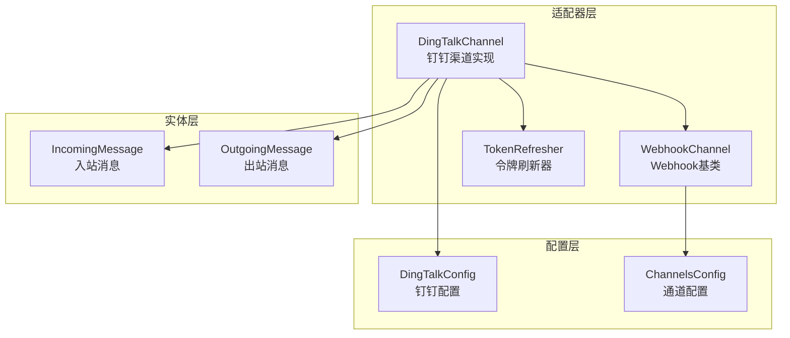
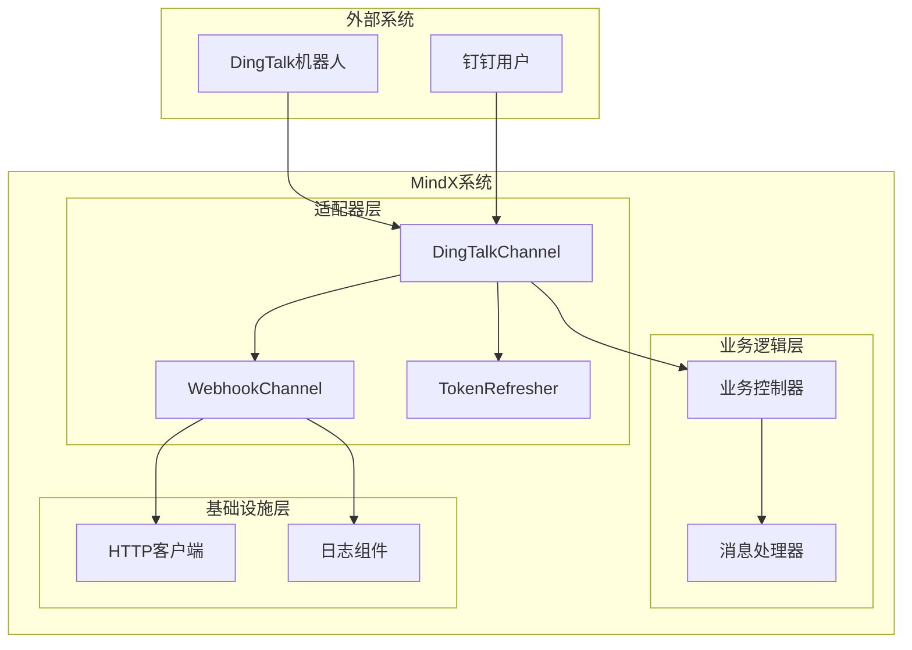
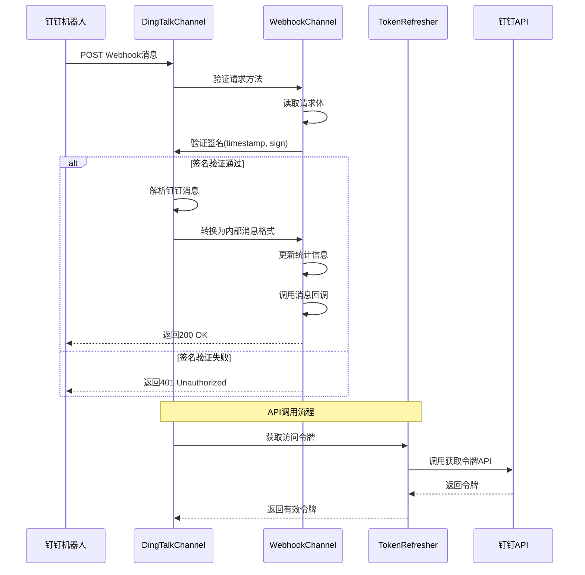
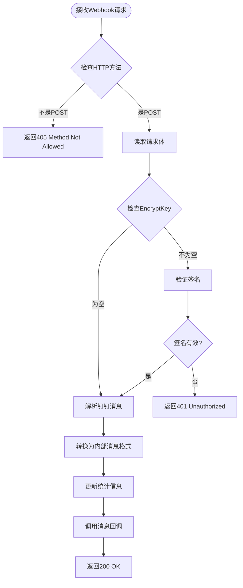
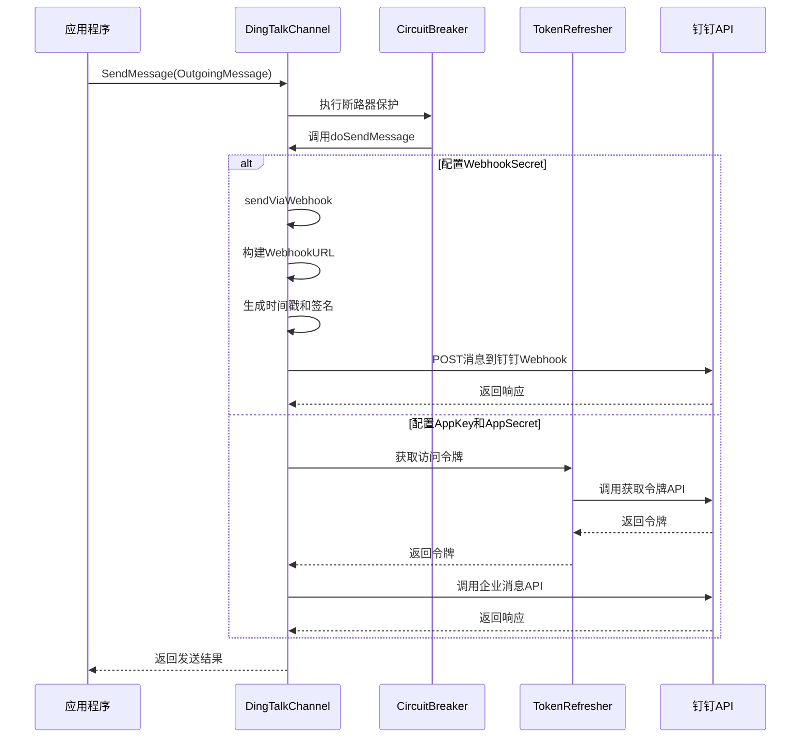
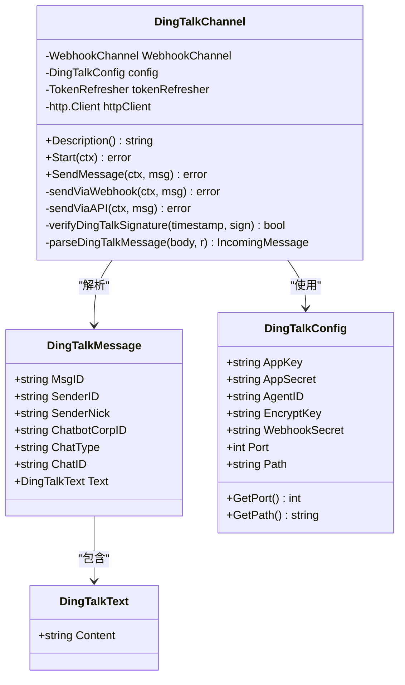
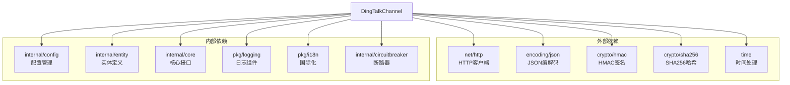

# 钉钉渠道实现

<cite>
**本文档引用的文件**
- [dingtalk.go](file://internal/adapters/channels/dingtalk.go)
- [dingtalk.go](file://internal/config/dingtalk.go)
- [channels.yml](file://config/channels.yml)
- [webhook_channel.go](file://internal/adapters/channels/webhook_channel.go)
- [token_refresher.go](file://internal/adapters/channels/token_refresher.go)
- [breaker.go](file://internal/adapters/channels/breaker.go)
- [channel.go](file://internal/entity/channel.go)
- [channels.go](file://internal/config/channels.go)
</cite>

## 目录
1. [简介](#简介)
2. [项目结构](#项目结构)
3. [核心组件](#核心组件)
4. [架构概览](#架构概览)
5. [详细组件分析](#详细组件分析)
6. [依赖关系分析](#依赖关系分析)
7. [性能考虑](#性能考虑)
8. [故障排除指南](#故障排除指南)
9. [结论](#结论)
10. [附录](#附录)

## 简介

本文档详细介绍了MindX项目中的钉钉渠道实现。该实现提供了完整的钉钉机器人Webhook集成，包括消息格式转换、认证机制、API调用流程以及企业内部应用配置等功能。文档涵盖了钉钉特有的消息类型处理、Markdown格式支持和图片消息处理，并提供了具体的集成示例、错误处理策略和最佳实践建议。

## 项目结构

钉钉渠道实现位于项目的适配器层，采用模块化设计，与其他即时通讯平台保持一致的架构模式。

**图表来源**
- [dingtalk.go](file://internal/adapters/channels/dingtalk.go#L40-L68)
- [webhook_channel.go](file://internal/adapters/channels/webhook_channel.go#L31-L47)
- [token_refresher.go](file://internal/adapters/channels/token_refresher.go#L12-L18)

**章节来源**
- [dingtalk.go](file://internal/adapters/channels/dingtalk.go#L1-L50)
- [channels.yml](file://config/channels.yml#L3-L15)

## 核心组件

### DingTalkChannel 主要功能

DingTalkChannel是钉钉渠道的核心实现，继承自WebhookChannel基类，提供了以下主要功能：

- **Webhook接收**: 支持钉钉机器人的Webhook消息接收和验证
- **API调用**: 支持企业内部应用的API消息发送
- **认证机制**: 实现了完整的签名验证和令牌管理
- **消息转换**: 将钉钉消息格式转换为内部统一格式

### 配置管理

钉钉配置通过DingTalkConfig结构体管理，支持多种配置选项：

- **Webhook配置**: WebhookSecret、EncryptKey、端口和路径
- **企业应用配置**: AppKey、AppSecret、AgentID
- **消息格式**: 支持文本消息的基础格式

**章节来源**
- [dingtalk.go](file://internal/adapters/channels/dingtalk.go#L40-L46)
- [dingtalk.go](file://internal/config/dingtalk.go#L3-L11)

## 架构概览

钉钉渠道采用分层架构设计，确保了良好的可扩展性和维护性。

**图表来源**
- [dingtalk.go](file://internal/adapters/channels/dingtalk.go#L117-L145)
- [webhook_channel.go](file://internal/adapters/channels/webhook_channel.go#L153-L200)

## 详细组件分析

### Webhook消息处理流程

钉钉Webhook消息处理采用标准的HTTP请求-响应模式，实现了完整的消息接收、验证和转换流程。

**图表来源**
- [dingtalk.go](file://internal/adapters/channels/dingtalk.go#L310-L362)
- [dingtalk.go](file://internal/adapters/channels/dingtalk.go#L364-L387)

### 认证机制实现

钉钉渠道实现了双重认证机制，确保消息传输的安全性：

1. **时间戳验证**: 防止重放攻击，限制时间窗口为1小时
2. **HMAC签名验证**: 使用加密密钥生成和验证签名

**图表来源**
- [dingtalk.go](file://internal/adapters/channels/dingtalk.go#L310-L362)
- [dingtalk.go](file://internal/adapters/channels/dingtalk.go#L364-L387)

**章节来源**
- [dingtalk.go](file://internal/adapters/channels/dingtalk.go#L364-L387)

### 消息发送流程

钉钉渠道支持两种消息发送方式，根据配置自动选择合适的发送策略。

**图表来源**
- [dingtalk.go](file://internal/adapters/channels/dingtalk.go#L147-L168)
- [dingtalk.go](file://internal/adapters/channels/dingtalk.go#L170-L241)
- [dingtalk.go](file://internal/adapters/channels/dingtalk.go#L243-L303)

**章节来源**
- [dingtalk.go](file://internal/adapters/channels/dingtalk.go#L147-L168)
- [breaker.go](file://internal/adapters/channels/breaker.go#L13-L25)

### 数据模型设计

钉钉渠道实现了标准化的数据模型，确保与内部系统的兼容性。

**图表来源**
- [dingtalk.go](file://internal/adapters/channels/dingtalk.go#L40-L46)
- [dingtalk.go](file://internal/adapters/channels/dingtalk.go#L417-L430)
- [dingtalk.go](file://internal/config/dingtalk.go#L3-L11)

**章节来源**
- [dingtalk.go](file://internal/adapters/channels/dingtalk.go#L417-L430)
- [channel.go](file://internal/entity/channel.go#L23-L70)

## 依赖关系分析

钉钉渠道实现具有清晰的依赖关系，遵循依赖倒置原则。

**图表来源**
- [dingtalk.go](file://internal/adapters/channels/dingtalk.go#L3-L23)
- [webhook_channel.go](file://internal/adapters/channels/webhook_channel.go#L3-L14)

**章节来源**
- [dingtalk.go](file://internal/adapters/channels/dingtalk.go#L3-L23)
- [webhook_channel.go](file://internal/adapters/channels/webhook_channel.go#L3-L14)

## 性能考虑

### 断路器模式

钉钉渠道实现了断路器模式，防止在钉钉API不可用时造成系统雪崩效应。

### 连接池管理

HTTP客户端设置了合理的超时时间（10秒），避免长时间阻塞影响系统性能。

### 缓存策略

TokenRefresher实现了令牌缓存机制，减少频繁的API调用。

## 故障排除指南

### 常见错误及解决方案

| 错误类型 | 错误代码 | 可能原因 | 解决方案 |
|---------|---------|---------|---------|
| 认证失败 | 401 Unauthorized | 签名验证失败 | 检查EncryptKey配置和时间同步 |
| API调用失败 | 400 Bad Request | 参数错误 | 验证AppKey、AppSecret配置 |
| 网络超时 | 504 Gateway Timeout | 网络连接问题 | 检查网络连通性和防火墙设置 |
| 令牌过期 | 401 Unauthorized | 令牌失效 | 等待自动刷新或重启服务 |

### 日志分析

系统提供了详细的日志记录，包括：
- Webhook请求处理日志
- 签名验证日志
- API调用日志
- 错误处理日志

**章节来源**
- [dingtalk.go](file://internal/adapters/channels/dingtalk.go#L318-L346)
- [token_refresher.go](file://internal/adapters/channels/token_refresher.go#L29-L57)

## 结论

钉钉渠道实现提供了完整的企业级即时通讯集成解决方案。通过标准化的消息格式、完善的认证机制和灵活的配置选项，该实现能够满足不同规模企业的钉钉集成需求。其模块化的架构设计确保了良好的可扩展性和维护性，为未来的功能扩展奠定了坚实基础。

## 附录

### 配置参数说明

| 参数名称 | 类型 | 必需 | 默认值 | 描述 |
|---------|------|------|--------|------|
| app_key | string | 否 | 空 | 钉钉企业应用AppKey |
| app_secret | string | 否 | 空 | 钉钉企业应用AppSecret |
| agent_id | string | 否 | 空 | 钉钉企业应用AgentID |
| encrypt_key | string | 否 | 空 | Webhook签名加密密钥 |
| webhook_secret | string | 否 | 空 | Webhook访问令牌或URL |
| port | int | 否 | 6064 | Webhook监听端口 |
| path | string | 否 | /dingtalk/webhook | Webhook路径 |

### 安全最佳实践

1. **密钥管理**: 使用环境变量存储敏感配置
2. **网络隔离**: 将Webhook服务部署在内网环境中
3. **访问控制**: 配置适当的防火墙规则
4. **监控告警**: 设置API调用和错误监控
5. **定期审计**: 定期检查配置和访问日志

### 部署注意事项

1. **端口开放**: 确保配置的端口在防火墙中开放
2. **域名配置**: 配置正确的回调域名和路径
3. **SSL证书**: 生产环境建议使用HTTPS
4. **负载均衡**: 高并发场景下考虑部署多个实例
5. **备份恢复**: 建立配置和日志的备份策略