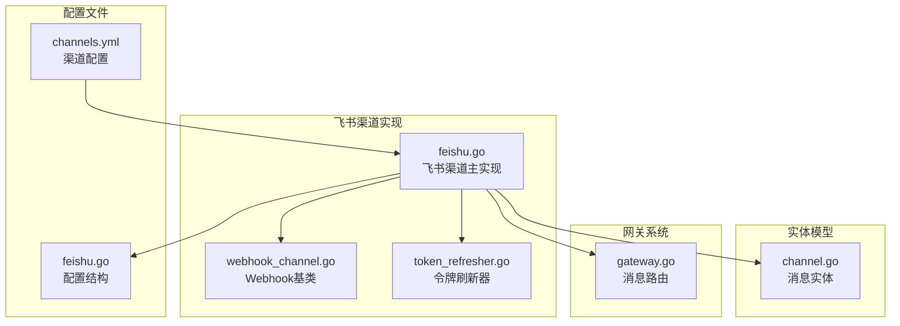
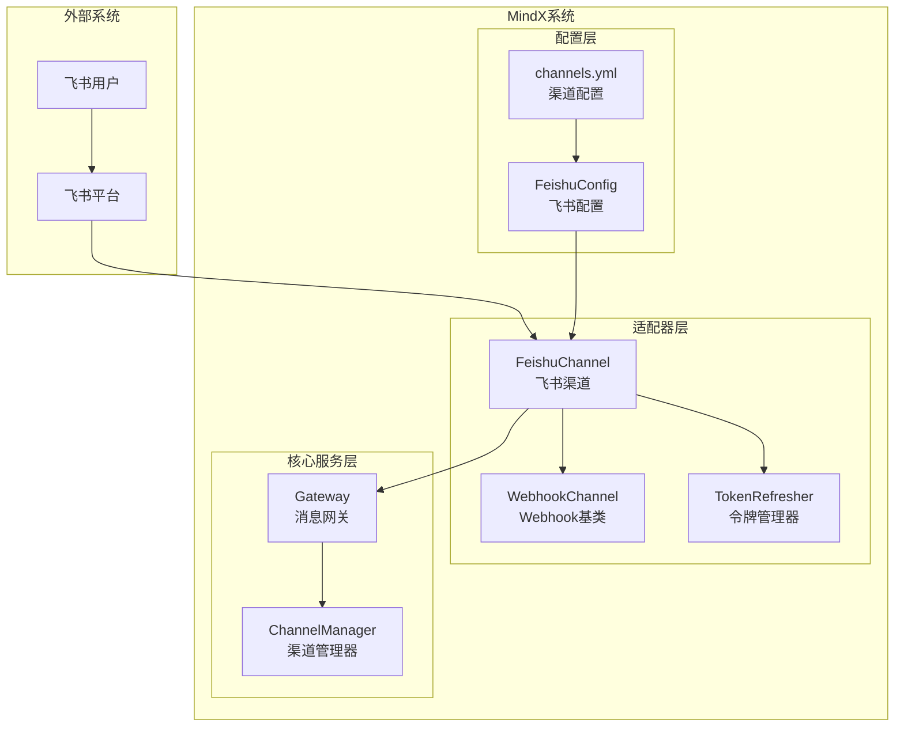
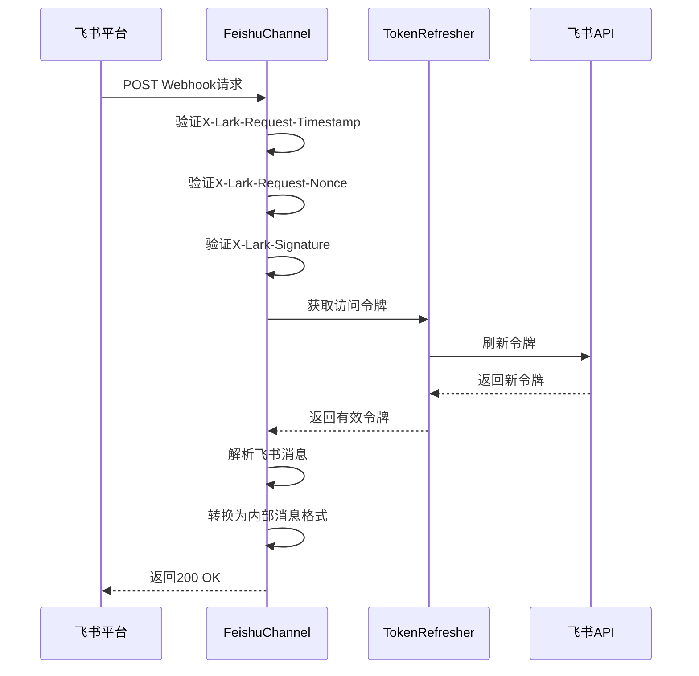
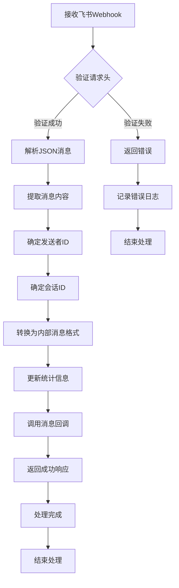
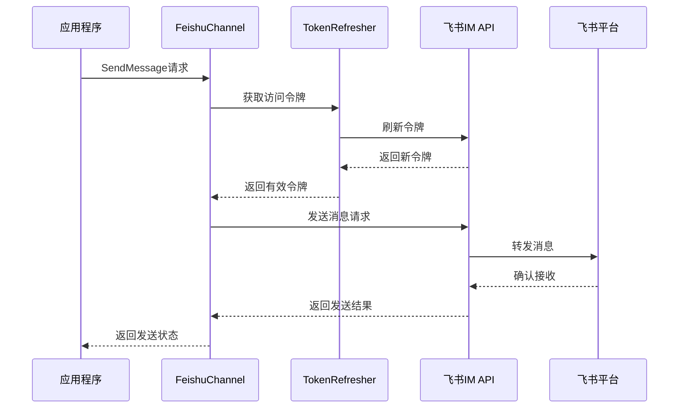
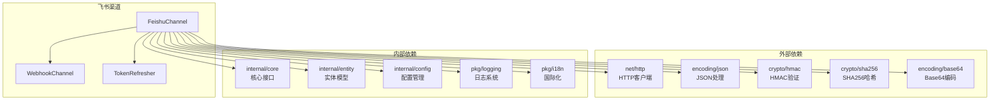

# 飞书渠道实现

<cite>
**本文档引用的文件**
- [feishu.go](file://internal/adapters/channels/feishu.go)
- [webhook_channel.go](file://internal/adapters/channels/webhook_channel.go)
- [token_refresher.go](file://internal/adapters/channels/token_refresher.go)
- [feishu.go](file://internal/config/feishu.go)
- [channel.go](file://internal/entity/channel.go)
- [channels.yml](file://config/channels.yml)
- [gateway.go](file://internal/adapters/channels/gateway.go)
</cite>

## 目录
1. [简介](#简介)
2. [项目结构](#项目结构)
3. [核心组件](#核心组件)
4. [架构概览](#架构概览)
5. [详细组件分析](#详细组件分析)
6. [依赖关系分析](#依赖关系分析)
7. [性能考虑](#性能考虑)
8. [故障排除指南](#故障排除指南)
9. [结论](#结论)
10. [附录](#附录)

## 简介

飞书渠道实现是 MindX 智能体平台中的一个重要组成部分，负责与飞书机器人进行集成。该实现采用 Webhook 方式接收飞书平台的消息，并通过飞书官方 API 发送消息响应。

本实现具有以下特点：
- 基于 Webhook 的消息接收机制
- 完整的消息验证和签名验证
- 支持多种飞书消息类型的处理
- 自动化的访问令牌管理和刷新
- 与网关系统的无缝集成

## 项目结构

飞书渠道实现位于 `internal/adapters/channels/` 目录下，主要包含以下文件：



**图表来源**
- [feishu.go](file://internal/adapters/channels/feishu.go#L1-L50)
- [webhook_channel.go](file://internal/adapters/channels/webhook_channel.go#L1-L50)
- [token_refresher.go](file://internal/adapters/channels/token_refresher.go#L1-L30)

**章节来源**
- [feishu.go](file://internal/adapters/channels/feishu.go#L1-L50)
- [webhook_channel.go](file://internal/adapters/channels/webhook_channel.go#L1-L50)
- [channels.yml](file://config/channels.yml#L28-L36)

## 核心组件

飞书渠道实现的核心组件包括：

### 1. FeishuChannel 主类
- 继承自 WebhookChannel
- 实现飞书特有的消息解析和验证
- 管理飞书 API 访问令牌
- 处理飞书 Webhook 请求

### 2. TokenRefresher 令牌管理器
- 负责飞书访问令牌的获取和刷新
- 实现双重检查锁定机制
- 自动处理令牌过期和续期

### 3. WebhookChannel 基类
- 提供 Webhook 通用处理框架
- 支持自定义消息解析器
- 管理 HTTP 服务器生命周期

### 4. 飞书配置结构
- 包含 AppID、AppSecret、Encryption Key 等必要配置
- 支持自定义端口和路径
- 提供验证令牌配置

**章节来源**
- [feishu.go](file://internal/adapters/channels/feishu.go#L35-L63)
- [token_refresher.go](file://internal/adapters/channels/token_refresher.go#L10-L27)
- [webhook_channel.go](file://internal/adapters/channels/webhook_channel.go#L29-L47)
- [feishu.go](file://internal/config/feishu.go#L3-L10)

## 架构概览

飞书渠道实现采用分层架构设计，确保了良好的可扩展性和维护性：



**图表来源**
- [feishu.go](file://internal/adapters/channels/feishu.go#L35-L63)
- [gateway.go](file://internal/adapters/channels/gateway.go#L15-L31)
- [channels.yml](file://config/channels.yml#L28-L36)

## 详细组件分析

### 飞书消息验证机制

飞书渠道实现了完整的消息验证机制，确保消息来源的安全性：



**图表来源**
- [feishu.go](file://internal/adapters/channels/feishu.go#L238-L276)
- [feishu.go](file://internal/adapters/channels/feishu.go#L356-L371)

#### 验证流程详解

1. **请求头验证**
   - X-Lark-Request-Timestamp：请求时间戳
   - X-Lark-Request-Nonce：随机数
   - X-Lark-Signature：签名值

2. **签名计算过程**
   ```go
   // 构造签名字符串
   signStr := fmt.Sprintf("%s\n%s\n%s", timestamp, nonce, body)
   
   // 使用验证令牌进行HMAC-SHA256计算
   h := hmac.New(sha256.New, []byte(config.VerificationToken))
   h.Write([]byte(signStr))
   signatureCalculated := base64.StdEncoding.EncodeToString(h.Sum(nil))
   ```

3. **验证结果处理**
   - 签名匹配：验证通过，继续处理消息
   - 签名不匹配：返回错误，拒绝处理

**章节来源**
- [feishu.go](file://internal/adapters/channels/feishu.go#L278-L371)

### 飞书消息处理流程

飞书渠道的消息处理流程包括多个步骤：



**图表来源**
- [feishu.go](file://internal/adapters/channels/feishu.go#L238-L354)

#### 消息解析关键点

1. **发送者ID确定优先级**
   - OpenID（优先）
   - UserID
   - UnionID

2. **会话ID确定规则**
   - 私聊：使用发送者ID
   - 群聊：使用聊天室ID
   - 无聊天室ID：回退到发送者ID

3. **消息内容提取**
   - 从事件内容中提取文本字段
   - 支持飞书标准消息格式

**章节来源**
- [feishu.go](file://internal/adapters/channels/feishu.go#L313-L353)

### 飞书API调用流程

飞书渠道通过官方 API 发送消息响应：



**图表来源**
- [feishu.go](file://internal/adapters/channels/feishu.go#L149-L231)

#### API调用关键参数

1. **接收ID类型选择**
   - open_id：用户ID（默认）
   - chat_id：群组ID（当chat_type为group或p2p时）

2. **消息格式规范**
   ```json
   {
     "receive_id": "会话ID",
     "msg_type": "text",
     "content": "{\"text\":\"消息内容\"}"
   }
   ```

3. **认证机制**
   - Authorization: Bearer {access_token}
   - Content-Type: application/json

**章节来源**
- [feishu.go](file://internal/adapters/channels/feishu.go#L170-L187)
- [feishu.go](file://internal/adapters/channels/feishu.go#L194-L200)

### 飞书配置参数详解

飞书渠道支持以下配置参数：

| 参数名称 | 类型 | 必需 | 默认值 | 描述 |
|---------|------|------|--------|------|
| app_id | string | 是 | 无 | 飞书应用ID |
| app_secret | string | 是 | 无 | 飞书应用密钥 |
| encrypt_key | string | 否 | 空 | 加密密钥 |
| verification_token | string | 否 | 空 | 验证令牌 |
| port | int | 否 | 6060 | Webhook监听端口 |
| path | string | 否 | /feishu/webhook | Webhook路径 |

**章节来源**
- [feishu.go](file://internal/config/feishu.go#L3-L10)
- [channels.yml](file://config/channels.yml#L28-L36)

## 依赖关系分析

飞书渠道实现的依赖关系如下：



**图表来源**
- [feishu.go](file://internal/adapters/channels/feishu.go#L3-L19)
- [webhook_channel.go](file://internal/adapters/channels/webhook_channel.go#L3-L14)

### 关键依赖说明

1. **HTTP客户端依赖**
   - net/http：处理Webhook请求和API调用
   - 超时设置：10秒读取超时，10秒写入超时

2. **加密依赖**
   - crypto/hmac：实现HMAC-SHA256签名验证
   - crypto/sha256：SHA256哈希算法
   - encoding/base64：Base64编码解码

3. **内部模块依赖**
   - internal/core：Channel接口定义
   - internal/entity：消息实体结构
   - internal/config：配置管理
   - pkg/logging：日志记录
   - pkg/i18n：国际化支持

**章节来源**
- [feishu.go](file://internal/adapters/channels/feishu.go#L3-L19)
- [webhook_channel.go](file://internal/adapters/channels/webhook_channel.go#L3-L14)

## 性能考虑

飞书渠道实现考虑了多个性能方面的因素：

### 1. 令牌缓存机制
- TokenRefresher 实现双重检查锁定
- 自动处理令牌过期和续期
- 减少不必要的API调用

### 2. 并发处理
- 使用互斥锁保护共享资源
- 支持高并发消息处理
- 异步消息回调处理

### 3. 内存管理
- 合理的HTTP客户端超时设置
- 及时释放网络连接
- 优化JSON解析性能

### 4. 错误处理
- 完善的错误捕获和处理
- 超时和重试机制
- 优雅的降级策略

## 故障排除指南

### 常见问题及解决方案

#### 1. 签名验证失败
**问题症状**：飞书平台返回400错误
**可能原因**：
- VerificationToken配置错误
- 请求头缺失或格式不正确
- 时间戳过期

**解决方法**：
1. 检查VerificationToken配置
2. 确认请求头完整性
3. 验证服务器时间同步

#### 2. 访问令牌获取失败
**问题症状**：API调用返回401错误
**可能原因**：
- AppID或AppSecret配置错误
- 网络连接问题
- 飞书API服务异常

**解决方法**：
1. 验证应用配置
2. 检查网络连通性
3. 查看飞书平台状态

#### 3. 消息发送失败
**问题症状**：用户收不到回复消息
**可能原因**：
- ReceiveID类型选择错误
- 会话ID无效
- 频率限制触发

**解决方法**：
1. 检查ReceiveID类型
2. 验证会话ID有效性
3. 降低发送频率

**章节来源**
- [feishu.go](file://internal/adapters/channels/feishu.go#L285-L287)
- [feishu.go](file://internal/adapters/channels/feishu.go#L165-L168)

## 结论

飞书渠道实现提供了完整、可靠的飞书机器人集成解决方案。该实现具有以下优势：

1. **安全性**：完整的消息验证机制，确保通信安全
2. **可靠性**：自动化的令牌管理和错误处理
3. **可扩展性**：基于接口的设计，易于扩展新功能
4. **易用性**：简洁的配置和部署方式

通过合理的架构设计和完善的错误处理机制，该实现能够稳定地支持飞书机器人的各种使用场景。

## 附录

### 集成示例配置

```yaml
channels:
  feishu:
    enabled: true
    name: 飞书
    icon: feishu
    config:
      app_id: YOUR_APP_ID
      app_secret: YOUR_APP_SECRET
      verification_token: YOUR_VERIFICATION_TOKEN
      encrypt_key: YOUR_ENCRYPT_KEY
      port: 6060
      path: /feishu/webhook
```

### 开发调试建议

1. **本地测试**：使用ngrok等工具进行本地调试
2. **日志监控**：启用详细的日志记录
3. **性能监控**：监控API调用频率和响应时间
4. **错误追踪**：建立完善的错误报告机制