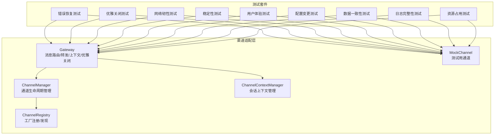
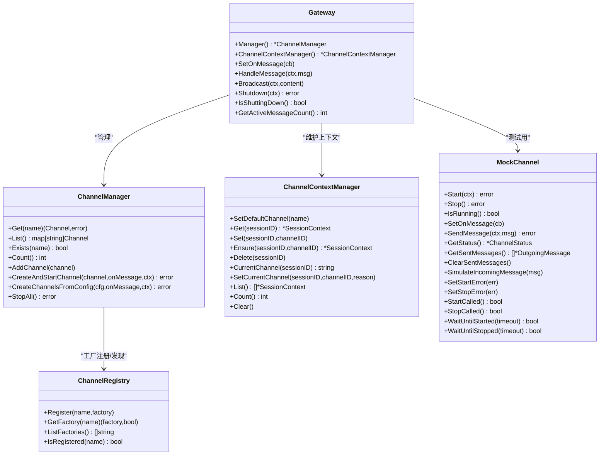
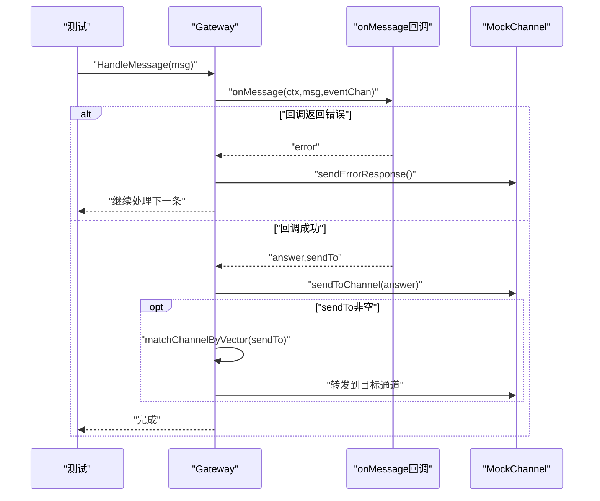
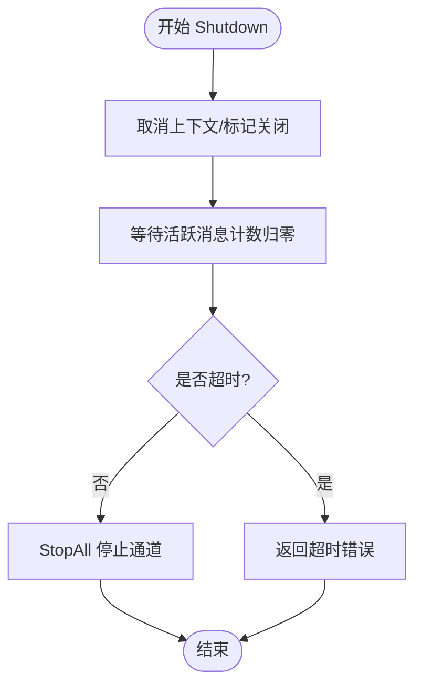
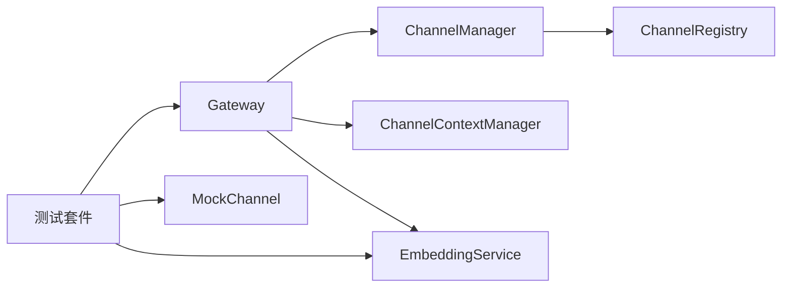

# 渠道测试

<cite>
**本文引用的文件**
- [gateway.go](file://internal/adapters/channels/gateway.go)
- [manager.go](file://internal/adapters/channels/manager.go)
- [registry.go](file://internal/adapters/channels/registry.go)
- [session.go](file://internal/adapters/channels/session.go)
- [mock_channel.go](file://internal/adapters/channels/mock_channel.go)
- [test_utils.go](file://internal/adapters/channels/test_utils.go)
- [gateway_error_recovery_test.go](file://internal/adapters/channels/gateway_error_recovery_test.go)
- [gateway_graceful_shutdown_test.go](file://internal/adapters/channels/gateway_graceful_shutdown_test.go)
- [gateway_network_resilience_test.go](file://internal/adapters/channels/gateway_network_resilience_test.go)
- [gateway_stability_test.go](file://internal/adapters/channels/gateway_stability_test.go)
- [gateway_user_experience_test.go](file://internal/adapters/channels/gateway_user_experience_test.go)
- [gateway_configuration_change_test.go](file://internal/adapters/channels/gateway_configuration_change_test.go)
- [gateway_data_consistency_test.go](file://internal/adapters/channels/gateway_data_consistency_test.go)
- [gateway_log_integrity_test.go](file://internal/adapters/channels/gateway_log_integrity_test.go)
- [gateway_resource_usage_test.go](file://internal/adapters/channels/gateway_resource_usage_test.go)
- [.github/workflows/ci.yml](file://.github/workflows/ci.yml)
- [README.md](file://README.md)
- [go.mod](file://go.mod)
</cite>

## 目录
1. [简介](#简介)
2. [项目结构](#项目结构)
3. [核心组件](#核心组件)
4. [架构总览](#架构总览)
5. [详细组件分析](#详细组件分析)
6. [依赖关系分析](#依赖关系分析)
7. [性能考量](#性能考量)
8. [故障排查指南](#故障排查指南)
9. [结论](#结论)
10. [附录](#附录)

## 简介
本文件面向 MindX 渠道测试体系，围绕渠道网关（Gateway）的测试策略与用例设计展开，覆盖错误恢复、优雅关闭、网络韧性、稳定性、用户体验等维度。文档同时阐述测试环境搭建、Mock 机制、测试数据准备、自动化测试流程与持续集成配置、测试报告生成、覆盖率与性能基准、回归策略以及调试技巧与常见问题。

## 项目结构
MindX 渠道适配层位于 internal/adapters/channels，包含网关、通道管理、上下文管理、注册中心与各类通道实现；测试集中在同目录下的多个 *_test.go 文件，并辅以统一的测试工具与 Mock 通道。

**图表来源**
- [gateway.go](file://internal/adapters/channels/gateway.go#L15-L510)
- [manager.go](file://internal/adapters/channels/manager.go#L15-L230)
- [session.go](file://internal/adapters/channels/session.go#L11-L177)
- [registry.go](file://internal/adapters/channels/registry.go#L14-L142)
- [mock_channel.go](file://internal/adapters/channels/mock_channel.go#L11-L270)

**章节来源**
- [gateway.go](file://internal/adapters/channels/gateway.go#L15-L510)
- [manager.go](file://internal/adapters/channels/manager.go#L15-L230)
- [session.go](file://internal/adapters/channels/session.go#L11-L177)
- [registry.go](file://internal/adapters/channels/registry.go#L14-L142)
- [mock_channel.go](file://internal/adapters/channels/mock_channel.go#L11-L270)

## 核心组件
- 网关 Gateway：负责消息路由、转发、上下文维护、广播、优雅关闭、向量匹配与通道切换、实时同步等。
- 通道管理 ChannelManager：负责通道的增删、启停、列举、批量停止、存在性检查等。
- 会话上下文管理 ChannelContextManager：维护每个会话的当前通道、默认通道、新增/删除/列举/清空等。
- 通道注册中心 ChannelRegistry：集中注册各通道工厂，按名称查找并创建通道实例。
- MockChannel：测试专用通道，支持启动/停止、消息收发、状态查询、错误注入、等待启动/停止等。

上述组件共同构成渠道网关的测试对象与测试基础设施。

**章节来源**
- [gateway.go](file://internal/adapters/channels/gateway.go#L15-L510)
- [manager.go](file://internal/adapters/channels/manager.go#L15-L230)
- [session.go](file://internal/adapters/channels/session.go#L11-L177)
- [registry.go](file://internal/adapters/channels/registry.go#L14-L142)
- [mock_channel.go](file://internal/adapters/channels/mock_channel.go#L11-L270)

## 架构总览
下图展示 Gateway 与各子系统的交互关系及测试覆盖点：

**图表来源**
- [gateway.go](file://internal/adapters/channels/gateway.go#L15-L510)
- [manager.go](file://internal/adapters/channels/manager.go#L15-L230)
- [session.go](file://internal/adapters/channels/session.go#L11-L177)
- [registry.go](file://internal/adapters/channels/registry.go#L14-L142)
- [mock_channel.go](file://internal/adapters/channels/mock_channel.go#L11-L270)

## 详细组件分析

### 错误恢复测试
- 目标：验证网关在消息处理回调错误、连续错误、panic、多通道错误、转发后错误恢复等场景下的健壮性。
- 关键要点：
  - onMessage 回调错误时应发送错误响应并继续处理后续消息。
  - 连续错误后恢复应不影响后续成功消息的处理与错误响应。
  - panic 恢复后应保证处理流程稳定。
  - 多通道错误应独立统计与处理。
  - 转发失败应回退到当前通道提示错误。
- 测试用例路径：
  - [TestGateway_ErrorRecovery](file://internal/adapters/channels/gateway_error_recovery_test.go#L13-L49)
  - [TestGateway_ErrorRecovery_Continuous](file://internal/adapters/channels/gateway_error_recovery_test.go#L51-L105)
  - [TestGateway_ErrorRecovery_MultipleChannels](file://internal/adapters/channels/gateway_error_recovery_test.go#L107-L150)
  - [TestGateway_ErrorRecovery_WithForwarding](file://internal/adapters/channels/gateway_error_recovery_test.go#L152-L197)
  - [TestGateway_ErrorRecovery_PanicRecovery](file://internal/adapters/channels/gateway_error_recovery_test.go#L199-L237)

**图表来源**
- [gateway.go](file://internal/adapters/channels/gateway.go#L74-L272)
- [gateway_error_recovery_test.go](file://internal/adapters/channels/gateway_error_recovery_test.go#L13-L197)
- [mock_channel.go](file://internal/adapters/channels/mock_channel.go#L160-L174)

**章节来源**
- [gateway_error_recovery_test.go](file://internal/adapters/channels/gateway_error_recovery_test.go#L13-L237)
- [gateway.go](file://internal/adapters/channels/gateway.go#L74-L272)
- [mock_channel.go](file://internal/adapters/channels/mock_channel.go#L160-L174)

### 优雅关闭测试
- 目标：验证网关在接收到关闭信号后，能够等待活跃消息完成再停止通道，支持超时、上下文取消、通道停止错误等边界条件。
- 关键要点：
  - Shutdown 通过 context 控制超时，等待所有活跃消息处理完毕。
  - 停止所有通道，忽略个别通道停止失败。
  - 多通道场景下确保每通道均被处理。
  - 空网关关闭应直接返回。
- 测试用例路径：
  - [TestGateway_GracefulShutdown](file://internal/adapters/channels/gateway_graceful_shutdown_test.go#L15-L46)
  - [TestGateway_GracefulShutdown_WithActiveMessages](file://internal/adapters/channels/gateway_graceful_shutdown_test.go#L48-L83)
  - [TestGateway_GracefulShutdown_MultipleChannels](file://internal/adapters/channels/gateway_graceful_shutdown_test.go#L85-L128)
  - [TestGateway_GracefulShutdown_Timeout](file://internal/adapters/channels/gateway_graceful_shutdown_test.go#L130-L159)
  - [TestGateway_GracefulShutdown_Empty](file://internal/adapters/channels/gateway_graceful_shutdown_test.go#L161-L171)
  - [TestGateway_GracefulShutdown_WithErrorHandling](file://internal/adapters/channels/gateway_graceful_shutdown_test.go#L173-L215)
  - [TestGateway_GracefulShutdown_ContextCancellation](file://internal/adapters/channels/gateway_graceful_shutdown_test.go#L217-L243)
  - [TestGateway_GracefulShutdown_ChannelStopError](file://internal/adapters/channels/gateway_graceful_shutdown_test.go#L245-L267)

**图表来源**
- [gateway.go](file://internal/adapters/channels/gateway.go#L455-L495)
- [gateway_graceful_shutdown_test.go](file://internal/adapters/channels/gateway_graceful_shutdown_test.go#L15-L267)

**章节来源**
- [gateway_graceful_shutdown_test.go](file://internal/adapters/channels/gateway_graceful_shutdown_test.go#L15-L267)
- [gateway.go](file://internal/adapters/channels/gateway.go#L455-L495)

### 网络韧性测试
- 目标：验证网关在延迟、超时、连接丢失、部分失败、重试、背压、队列溢出等网络异常场景下的表现。
- 关键要点：
  - 随机延迟与超时处理，确保消息最终被处理。
  - 连接丢失后恢复应继续处理后续消息。
  - 多通道场景下错误隔离与统计。
  - 重试机制需保证幂等或可容忍的重复处理。
  - 背压与队列溢出场景下资源可控。
- 测试用例路径：
  - [TestGateway_NetworkResilience](file://internal/adapters/channels/gateway_network_resilience_test.go#L15-L41)
  - [TestGateway_NetworkResilience_Timeout](file://internal/adapters/channels/gateway_network_resilience_test.go#L43-L74)
  - [TestGateway_NetworkResilience_ConnectionLoss](file://internal/adapters/channels/gateway_network_resilience_test.go#L76-L120)
  - [TestGateway_NetworkResilience_MultipleChannels](file://internal/adapters/channels/gateway_network_resilience_test.go#L122-L166)
  - [TestGateway_NetworkResilience_Retry](file://internal/adapters/channels/gateway_network_resilience_test.go#L168-L212)
  - [TestGateway_NetworkResilience_Backpressure](file://internal/adapters/channels/gateway_network_resilience_test.go#L214-L242)
  - [TestGateway_NetworkResilience_PartialFailure](file://internal/adapters/channels/gateway_network_resilience_test.go#L244-L284)
  - [TestGateway_NetworkResilience_QueueOverflow](file://internal/adapters/channels/gateway_network_resilience_test.go#L286-L311)

**章节来源**
- [gateway_network_resilience_test.go](file://internal/adapters/channels/gateway_network_resilience_test.go#L15-L311)
- [gateway.go](file://internal/adapters/channels/gateway.go#L74-L272)

### 稳定性测试
- 目标：验证网关在长时间高负载下的稳定性与内存泄漏风险。
- 关键要点：
  - 长时间（分钟级）定时发送消息，监控活跃消息数与内存使用。
  - 多通道并发稳定性。
  - 内存泄漏阈值控制（如小于 50MB）。
- 测试用例路径：
  - [TestGateway_Stability](file://internal/adapters/channels/gateway_stability_test.go#L15-L65)
  - [TestGateway_Stability_Short](file://internal/adapters/channels/gateway_stability_test.go#L67-L116)
  - [TestGateway_Stability_MultipleChannels](file://internal/adapters/channels/gateway_stability_test.go#L118-L183)
  - [TestGateway_Stability_WithMemoryLeakCheck](file://internal/adapters/channels/gateway_stability_test.go#L185-L220)

**章节来源**
- [gateway_stability_test.go](file://internal/adapters/channels/gateway_stability_test.go#L15-L220)
- [gateway.go](file://internal/adapters/channels/gateway.go#L455-L495)

### 用户体验测试
- 目标：验证响应时间、并发用户、会话切换、Channel 切换、错误反馈、长时间会话、混合媒体、负载延迟等用户体验指标。
- 关键要点：
  - 平均响应时间与快速响应比例要求。
  - 并发用户场景下的吞吐与延迟。
  - 会话与 Channel 切换的正确性与一致性。
  - 错误反馈及时性与可理解性。
  - 长时间会话的上下文保持。
  - 混合媒体类型的处理。
- 测试用例路径：
  - [TestGateway_UserExperience_ResponseTime](file://internal/adapters/channels/gateway_user_experience_test.go#L14-L59)
  - [TestGateway_UserExperience_ConcurrentUsers](file://internal/adapters/channels/gateway_user_experience_test.go#L61-L102)
  - [TestGateway_UserExperience_SessionSwitching](file://internal/adapters/channels/gateway_user_experience_test.go#L104-L132)
  - [TestGateway_UserExperience_ChannelSwitching](file://internal/adapters/channels/gateway_user_experience_test.go#L134-L177)
  - [TestGateway_UserExperience_ErrorFeedback](file://internal/adapters/channels/gateway_user_experience_test.go#L179-L212)
  - [TestGateway_UserExperience_LongRunningSession](file://internal/adapters/channels/gateway_user_experience_test.go#L214-L249)
  - [TestGateway_UserExperience_MediaMixed](file://internal/adapters/channels/gateway_user_experience_test.go#L251-L275)
  - [TestGateway_UserExperience_LatencyUnderLoad](file://internal/adapters/channels/gateway_user_experience_test.go#L277-L323)

**章节来源**
- [gateway_user_experience_test.go](file://internal/adapters/channels/gateway_user_experience_test.go#L14-L323)
- [session.go](file://internal/adapters/channels/session.go#L11-L177)

### 配置变更测试
- 目标：验证动态添加/移除通道、默认通道切换、消息处理回调更新、通道重启、上下文管理器配置、向量化服务配置、通道状态更新等配置变更场景。
- 关键要点：
  - 动态增删通道不影响现有通道。
  - 默认通道影响未知会话的初始上下文。
  - onMessage 回调更新不影响已排队消息。
  - 通道重启后继续处理消息。
  - 上下文管理器对会话状态的正确维护。
  - 向量化服务替换不影响消息处理。
  - 通道状态随启停变化。
- 测试用例路径：
  - [TestGateway_ConfigurationChange_AddChannel](file://internal/adapters/channels/gateway_configuration_change_test.go#L13-L41)
  - [TestGateway_ConfigurationChange_RemoveChannel](file://internal/adapters/channels/gateway_configuration_change_test.go#L43-L78)
  - [TestGateway_ConfigurationChange_SwitchDefaultChannel](file://internal/adapters/channels/gateway_configuration_change_test.go#L80-L90)
  - [TestGateway_ConfigurationChange_UpdateOnMessageHandler](file://internal/adapters/channels/gateway_configuration_change_test.go#L92-L127)
  - [TestGateway_ConfigurationChange_MultipleChannelsDynamic](file://internal/adapters/channels/gateway_configuration_change_test.go#L129-L160)
  - [TestGateway_ConfigurationChange_ChannelRestart](file://internal/adapters/channels/gateway_configuration_change_test.go#L162-L196)
  - [TestGateway_ConfigurationChange_ContextManagerConfig](file://internal/adapters/channels/gateway_configuration_change_test.go#L198-L227)
  - [TestGateway_ConfigurationChange_EmbeddingServiceConfig](file://internal/adapters/channels/gateway_configuration_change_test.go#L229-L271)
  - [TestGateway_ConfigurationChange_ChannelStatusUpdate](file://internal/adapters/channels/gateway_configuration_change_test.go#L273-L301)

**章节来源**
- [gateway_configuration_change_test.go](file://internal/adapters/channels/gateway_configuration_change_test.go#L13-L301)
- [session.go](file://internal/adapters/channels/session.go#L11-L177)

### 数据一致性测试
- 目标：验证多会话隔离、消息顺序、上下文保持、Channel 切换时的一致性与转发行为。
- 关键要点：
  - 不同会话互不干扰。
  - 消息顺序与内容一致。
  - 上下文在多次消息间保持。
  - Channel 切换后上下文更新正确。
- 测试用例路径：
  - [TestGateway_DataConsistency](file://internal/adapters/channels/gateway_data_consistency_test.go#L12-L48)
  - [TestGateway_DataConsistency_SessionIsolation](file://internal/adapters/channels/gateway_data_consistency_test.go#L50-L84)
  - [TestGateway_DataConsistency_ChannelSwitching](file://internal/adapters/channels/gateway_data_consistency_test.go#L86-L136)
  - [TestGateway_DataConsistency_MultipleSessions](file://internal/adapters/channels/gateway_data_consistency_test.go#L138-L180)
  - [TestGateway_DataConsistency_MessageOrdering](file://internal/adapters/channels/gateway_data_consistency_test.go#L182-L212)
  - [TestGateway_DataConsistency_ContextPreservation](file://internal/adapters/channels/gateway_data_consistency_test.go#L214-L245)

**章节来源**
- [gateway_data_consistency_test.go](file://internal/adapters/channels/gateway_data_consistency_test.go#L12-L245)
- [session.go](file://internal/adapters/channels/session.go#L11-L177)

### 日志完整性测试
- 目标：验证消息日志、错误日志、会话日志、多通道日志、上下文日志、日志文件内容与轮转、日志持久化与一致性。
- 关键要点：
  - 正常与错误消息均应产生相应日志。
  - 多通道场景下日志完整。
  - 会话与上下文状态可追溯。
  - 日志文件读写与轮转正常。
- 测试用例路径：
  - [TestGateway_LogIntegrity_MessageLogging](file://internal/adapters/channels/gateway_log_integrity_test.go#L15-L35)
  - [TestGateway_LogIntegrity_ErrorLogging](file://internal/adapters/channels/gateway_log_integrity_test.go#L37-L66)
  - [TestGateway_LogIntegrity_ChannelSwitchLogging](file://internal/adapters/channels/gateway_log_integrity_test.go#L68-L105)
  - [TestGateway_LogIntegrity_SessionLogging](file://internal/adapters/channels/gateway_log_integrity_test.go#L107-L135)
  - [TestGateway_LogIntegrity_MultipleChannelLogging](file://internal/adapters/channels/gateway_log_integrity_test.go#L137-L170)
  - [TestGateway_LogIntegrity_ContextLogging](file://internal/adapters/channels/gateway_log_integrity_test.go#L172-L198)
  - [TestGateway_LogIntegrity_LogFileContent](file://internal/adapters/channels/gateway_log_integrity_test.go#L200-L223)
  - [TestGateway_LogIntegrity_LogRotation](file://internal/adapters/channels/gateway_log_integrity_test.go#L225-L244)
  - [TestGateway_LogIntegrity_LogPersistence](file://internal/adapters/channels/gateway_log_integrity_test.go#L246-L270)
  - [TestGateway_LogIntegrity_LogConsistency](file://internal/adapters/channels/gateway_log_integrity_test.go#L272-L301)

**章节来源**
- [gateway_log_integrity_test.go](file://internal/adapters/channels/gateway_log_integrity_test.go#L15-L301)

### 资源占用测试
- 目标：验证内存增长、goroutine 泄漏、多会话与多通道资源占用、向量化缓存占用、内存压力下的稳定性。
- 关键要点：
  - 内存增长阈值控制（如小于 100MB）。
  - goroutine 增长可控（如 ≤10）。
  - 多会话/多通道场景资源线性增长。
  - 向量化缓存命中与增长可控。
  - 大规模消息处理后资源回收。
- 测试用例路径：
  - [TestGateway_ResourceUsage](file://internal/adapters/channels/gateway_resource_usage_test.go#L15-L60)
  - [TestGateway_ResourceUsage_MultipleSessions](file://internal/adapters/channels/gateway_resource_usage_test.go#L62-L108)
  - [TestGateway_ResourceUsage_ChannelSwitching](file://internal/adapters/channels/gateway_resource_usage_test.go#L110-L151)
  - [TestGateway_ResourceUsage_EmbeddingCache](file://internal/adapters/channels/gateway_resource_usage_test.go#L153-L207)
  - [TestGateway_ResourceUsage_GoroutineLeak](file://internal/adapters/channels/gateway_resource_usage_test.go#L209-L237)
  - [TestGateway_ResourceUsage_MemoryPressure](file://internal/adapters/channels/gateway_resource_usage_test.go#L239-L286)

**章节来源**
- [gateway_resource_usage_test.go](file://internal/adapters/channels/gateway_resource_usage_test.go#L15-L286)

## 依赖关系分析
- 组件耦合：
  - Gateway 强依赖 ChannelManager 与 ChannelContextManager，弱依赖 EmbeddingService（用于向量匹配）。
  - ChannelManager 依赖 ChannelRegistry 完成工厂注册与发现。
  - 测试通过 MockChannel 与 mockEmbeddingService 解耦真实外部依赖。
- 外部依赖：
  - 日志系统、国际化、工具库等通过统一接口注入，便于测试替换。
- 循环依赖：
  - 代码结构清晰，未见循环依赖迹象。

**图表来源**
- [gateway.go](file://internal/adapters/channels/gateway.go#L15-L510)
- [manager.go](file://internal/adapters/channels/manager.go#L15-L230)
- [registry.go](file://internal/adapters/channels/registry.go#L14-L142)
- [mock_channel.go](file://internal/adapters/channels/mock_channel.go#L11-L270)
- [test_utils.go](file://internal/adapters/channels/test_utils.go#L12-L52)

**章节来源**
- [gateway.go](file://internal/adapters/channels/gateway.go#L15-L510)
- [manager.go](file://internal/adapters/channels/manager.go#L15-L230)
- [registry.go](file://internal/adapters/channels/registry.go#L14-L142)
- [mock_channel.go](file://internal/adapters/channels/mock_channel.go#L11-L270)
- [test_utils.go](file://internal/adapters/channels/test_utils.go#L12-L52)

## 性能考量
- 响应时间与吞吐：
  - 通过用户体验测试中的响应时间与并发用户测试评估。
  - 背压与队列溢出测试保障在高负载下的稳定性。
- 内存与资源：
  - 稳定性与资源占用测试设定内存增长阈值与 goroutine 增长上限。
  - 向量化缓存命中率与缓存大小监控。
- 基准与回归：
  - 建议在 CI 中记录关键指标（平均响应时间、内存增长、goroutine 数），作为回归基线。

[本节为通用指导，无需具体文件分析]

## 故障排查指南
- 常见问题与定位：
  - 消息未送达：检查通道是否运行、是否调用 SendMessage、是否在关闭期间拒绝新消息。
  - 转发失败：确认目标通道存在、向量匹配是否成功、转发消息格式是否正确。
  - 关闭超时：检查活跃消息计数、通道停止是否阻塞、上下文是否提前取消。
  - 内存泄漏：关注大规模消息处理后的内存增长，排查未释放的会话上下文或缓存。
  - 日志缺失：确认日志级别、文件路径与轮转配置。
- 调试技巧：
  - 使用 MockChannel 的状态查询与消息收集辅助断言。
  - 在 onMessage 回调中注入延迟与错误，模拟真实异常场景。
  - 结合活跃消息计数与 goroutine 数量进行并发问题诊断。

**章节来源**
- [gateway.go](file://internal/adapters/channels/gateway.go#L74-L272)
- [gateway_graceful_shutdown_test.go](file://internal/adapters/channels/gateway_graceful_shutdown_test.go#L130-L159)
- [gateway_resource_usage_test.go](file://internal/adapters/channels/gateway_resource_usage_test.go#L209-L237)
- [gateway_log_integrity_test.go](file://internal/adapters/channels/gateway_log_integrity_test.go#L200-L223)

## 结论
MindX 渠道测试体系以 Gateway 为核心，结合 Mock 通道与嵌入式向量化服务，覆盖错误恢复、优雅关闭、网络韧性、稳定性、用户体验、配置变更、数据一致性、日志完整性与资源占用等关键领域。测试用例采用参数化与并发策略，配合 CI 自动化与指标基线，形成完善的回归与性能保障机制。

[本节为总结性内容，无需具体文件分析]

## 附录

### 测试环境搭建与运行
- 运行方式：使用 Go 测试框架，单文件测试通过 go test 命令运行，建议使用 -short 跳过长时间测试。
- 依赖准备：项目根目录包含 go.mod，确保依赖完整；CI 使用 GitHub Actions。
- 日志与报告：测试过程中产生的日志与指标可通过标准输出查看；建议在 CI 中收集测试日志与覆盖率报告。

**章节来源**
- [go.mod](file://go.mod)
- [.github/workflows/ci.yml](file://.github/workflows/ci.yml)
- [README.md](file://README.md)

### Mock 机制与测试数据
- MockChannel：提供启动/停止、消息收发、状态查询、错误注入、等待同步等能力，满足各类边界与异常场景。
- mockEmbeddingService：提供向量化服务的模拟实现，支持缓存与批处理，便于向量匹配测试。
- 测试消息构造：统一的 createTestMessage 工具，便于构造不同会话、通道与内容的消息。

**章节来源**
- [mock_channel.go](file://internal/adapters/channels/mock_channel.go#L11-L270)
- [test_utils.go](file://internal/adapters/channels/test_utils.go#L12-L85)

### 自动化测试与持续集成
- CI 配置：GitHub Actions 工作流负责拉取依赖、构建与测试，建议加入覆盖率与性能指标上报。
- 建议流程：
  - 依赖安装与缓存
  - 单元测试与集成测试
  - 覆盖率统计与报告上传
  - 性能基准与回归对比
  - 失败告警与日志归档

**章节来源**
- [.github/workflows/ci.yml](file://.github/workflows/ci.yml)

### 测试覆盖率与性能基准
- 覆盖率要求：建议关键路径（错误处理、优雅关闭、网络异常、资源管理）覆盖率 ≥ 80%，核心逻辑 ≥ 90%。
- 性能基准：记录平均响应时间、内存增长、goroutine 数、活跃消息计数等指标，作为回归基线。
- 回归策略：每次提交运行基础测试集，大改动运行全量测试集并在 CI 中对比关键指标。

[本节为通用指导，无需具体文件分析]