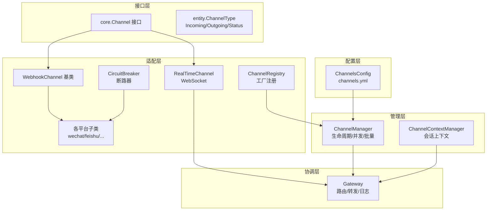
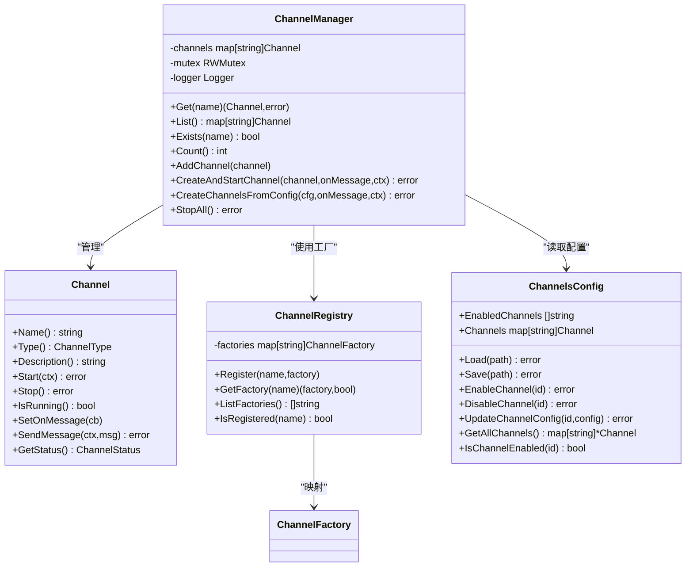
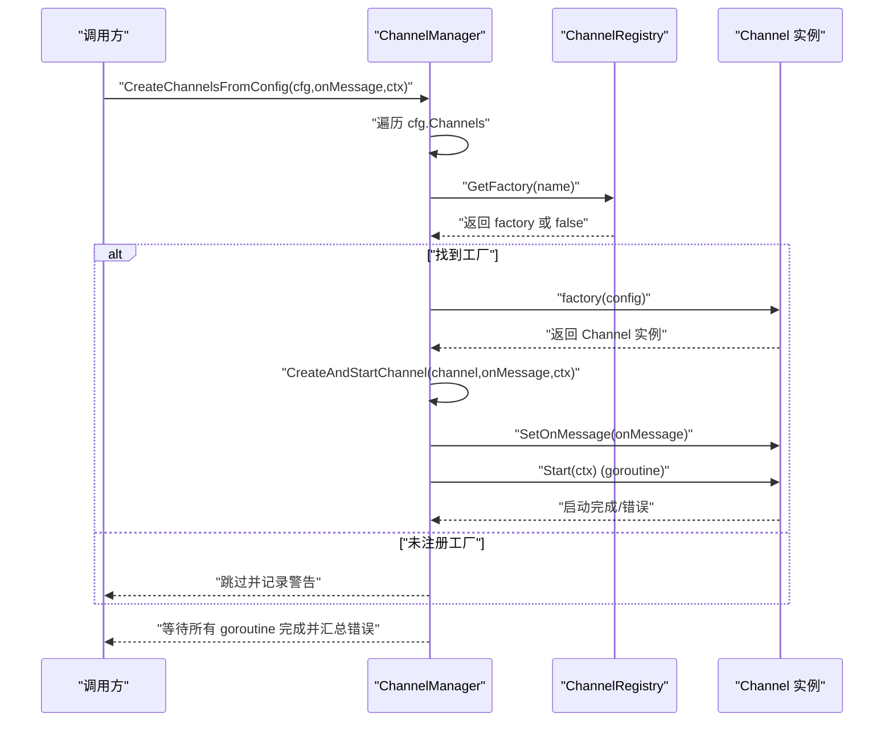
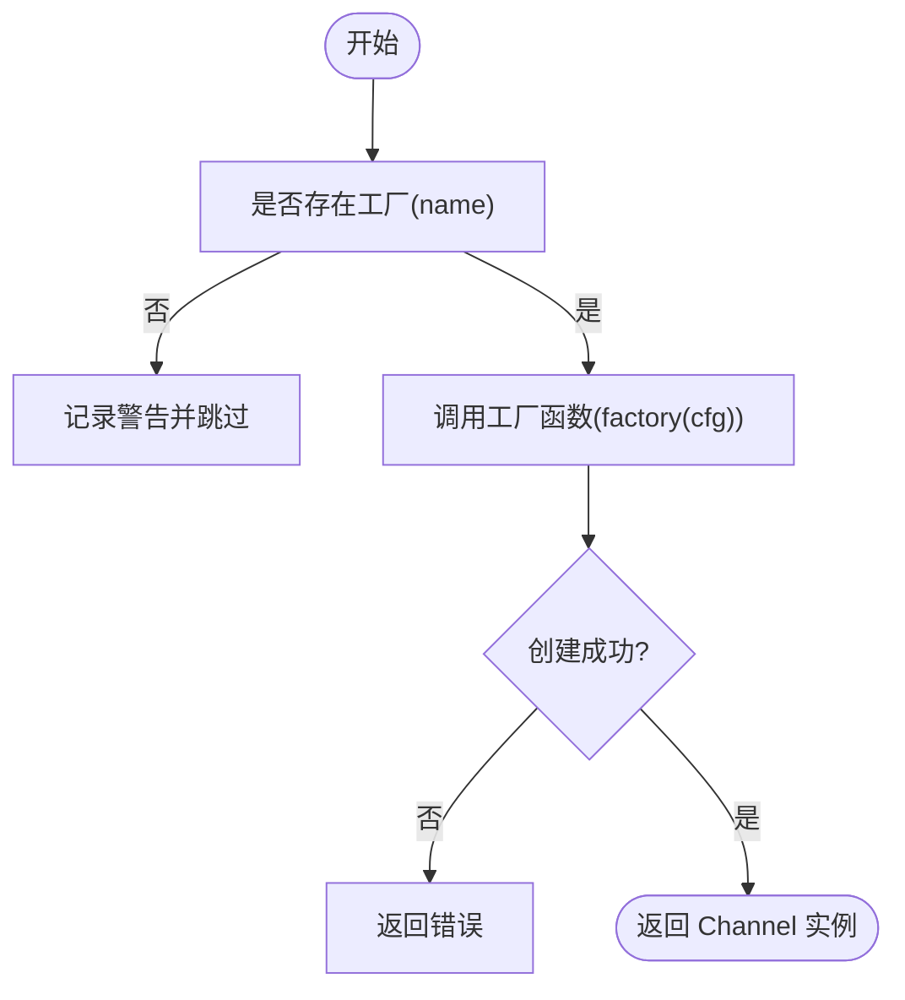
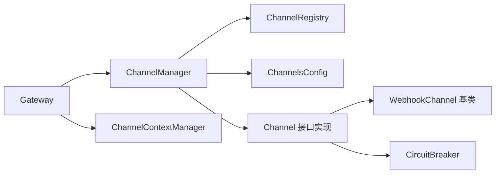

# 渠道管理器

<cite>
**本文引用的文件**
- [internal/adapters/channels/manager.go](file://internal/adapters/channels/manager.go)
- [internal/adapters/channels/registry.go](file://internal/adapters/channels/registry.go)
- [internal/config/channels.go](file://internal/config/channels.go)
- [config/channels.yml](file://config/channels.yml)
- [internal/core/channel.go](file://internal/core/channel.go)
- [internal/entity/channel.go](file://internal/entity/channel.go)
- [internal/adapters/channels/webhook_channel.go](file://internal/adapters/channels/webhook_channel.go)
- [internal/adapters/channels/realtime.go](file://internal/adapters/channels/realtime.go)
- [internal/adapters/channels/gateway.go](file://internal/adapters/channels/gateway.go)
- [internal/adapters/channels/session.go](file://internal/adapters/channels/session.go)
- [internal/adapters/channels/breaker.go](file://internal/adapters/channels/breaker.go)
- [internal/errors/errors.go](file://internal/errors/errors.go)
</cite>

## 目录
1. [简介](#简介)
2. [项目结构](#项目结构)
3. [核心组件](#核心组件)
4. [架构总览](#架构总览)
5. [详细组件分析](#详细组件分析)
6. [依赖关系分析](#依赖关系分析)
7. [性能考量](#性能考量)
8. [故障排查指南](#故障排查指南)
9. [结论](#结论)
10. [附录](#附录)

## 简介
本文件面向 MindX 的“渠道管理器”（ChannelManager），系统性阐述其设计架构、生命周期管理机制、并发安全保障、配置驱动的工厂模式与动态创建流程，并覆盖批量操作（如 StopAll）、错误处理策略以及使用示例与最佳实践。读者无需深入 Go 语言即可理解其工作原理。

## 项目结构
MindX 的渠道体系围绕“接口抽象 + 工厂注册 + 管理器编排”的分层组织：
- 接口层：定义统一的 Channel 接口，屏蔽不同平台（Webhook、WebSocket 等）差异
- 适配层：具体渠道实现（WebhookChannel 基类、各平台子类、实时通道）
- 管理层：ChannelManager 负责生命周期编排、并发安全、批量操作
- 配置层：ChannelsConfig 定义配置结构；channels.yml 提供默认配置
- 协调层：Gateway 负责消息路由、上下文管理、转发与错误处理

图表来源
- [internal/config/channels.go](file://internal/config/channels.go#L11-L21)
- [config/channels.yml](file://config/channels.yml#L1-L96)
- [internal/core/channel.go](file://internal/core/channel.go#L10-L40)
- [internal/adapters/channels/webhook_channel.go](file://internal/adapters/channels/webhook_channel.go#L29-L47)
- [internal/adapters/channels/realtime.go](file://internal/adapters/channels/realtime.go#L18-L36)
- [internal/adapters/channels/registry.go](file://internal/adapters/channels/registry.go#L14-L38)
- [internal/adapters/channels/manager.go](file://internal/adapters/channels/manager.go#L15-L21)
- [internal/adapters/channels/session.go](file://internal/adapters/channels/session.go#L11-L19)
- [internal/adapters/channels/gateway.go](file://internal/adapters/channels/gateway.go#L15-L31)
- [internal/adapters/channels/breaker.go](file://internal/adapters/channels/breaker.go#L8-L11)

章节来源
- [internal/config/channels.go](file://internal/config/channels.go#L11-L21)
- [config/channels.yml](file://config/channels.yml#L1-L96)
- [internal/core/channel.go](file://internal/core/channel.go#L10-L40)
- [internal/adapters/channels/webhook_channel.go](file://internal/adapters/channels/webhook_channel.go#L29-L47)
- [internal/adapters/channels/realtime.go](file://internal/adapters/channels/realtime.go#L18-L36)
- [internal/adapters/channels/registry.go](file://internal/adapters/channels/registry.go#L14-L38)
- [internal/adapters/channels/manager.go](file://internal/adapters/channels/manager.go#L15-L21)
- [internal/adapters/channels/session.go](file://internal/adapters/channels/session.go#L11-L19)
- [internal/adapters/channels/gateway.go](file://internal/adapters/channels/gateway.go#L15-L31)
- [internal/adapters/channels/breaker.go](file://internal/adapters/channels/breaker.go#L8-L11)

## 核心组件
- Channel 接口：统一抽象，包含名称、类型、描述、启动/停止、运行态查询、消息回调设置、消息发送、状态获取等能力
- ChannelManager：集中管理 Channel 的生命周期、并发安全、批量停止、查询等
- ChannelRegistry：全局工厂注册中心，按名称映射工厂函数，实现配置驱动的动态创建
- ChannelsConfig：渠道配置结构与加载/保存、启用/禁用、更新等操作
- WebhookChannel 基类：封装通用 Webhook 接收逻辑、解析器注入、生命周期与状态
- RealTimeChannel：基于 WebSocket 的实时通道，支持多客户端、连接数限制、心跳与并发保护
- Gateway：消息路由中枢，负责会话上下文、消息分发、转发、错误处理与日志
- ChannelContextManager：维护会话到渠道的映射，支持切换与持久化
- CircuitBreaker：为各渠道发送路径提供断路器保护

章节来源
- [internal/core/channel.go](file://internal/core/channel.go#L10-L40)
- [internal/adapters/channels/manager.go](file://internal/adapters/channels/manager.go#L15-L21)
- [internal/adapters/channels/registry.go](file://internal/adapters/channels/registry.go#L14-L38)
- [internal/config/channels.go](file://internal/config/channels.go#L11-L21)
- [internal/adapters/channels/webhook_channel.go](file://internal/adapters/channels/webhook_channel.go#L29-L47)
- [internal/adapters/channels/realtime.go](file://internal/adapters/channels/realtime.go#L18-L36)
- [internal/adapters/channels/gateway.go](file://internal/adapters/channels/gateway.go#L15-L31)
- [internal/adapters/channels/session.go](file://internal/adapters/channels/session.go#L11-L19)
- [internal/adapters/channels/breaker.go](file://internal/adapters/channels/breaker.go#L8-L11)

## 架构总览
ChannelManager 采用“适配器模式 + 工厂模式 + 配置驱动”的组合架构：
- 适配器模式：Channel 接口屏蔽不同平台差异；WebhookChannel 作为适配基类，各平台子类（如 wechat、feishu 等）通过工厂注册实现差异化行为
- 工厂模式：ChannelRegistry 维护工厂函数映射，ChannelManager 通过工厂动态创建 Channel 实例
- 配置驱动：ChannelsConfig 与 channels.yml 定义启用列表与各渠道配置，ChannelManager 按配置并发创建并启动

图表来源
- [internal/core/channel.go](file://internal/core/channel.go#L10-L40)
- [internal/adapters/channels/manager.go](file://internal/adapters/channels/manager.go#L15-L21)
- [internal/adapters/channels/registry.go](file://internal/adapters/channels/registry.go#L14-L38)
- [internal/config/channels.go](file://internal/config/channels.go#L11-L21)

## 详细组件分析

### ChannelManager：生命周期与并发安全
- 生命周期管理：提供 Get、List、Exists、Count 查询；AddChannel 注册；CreateAndStartChannel 创建并异步启动；StopAll 批量停止
- 并发安全：内部使用读写锁保护 channels 映射；查询路径使用读锁，写入路径使用写锁；启动流程在 goroutine 中执行，避免阻塞
- 日志与国际化：统一使用系统日志与国际化键，便于多语言输出
- 批量停止：遍历运行中的 Channel，逐个 Stop，记录成功/失败统计

图表来源
- [internal/adapters/channels/manager.go](file://internal/adapters/channels/manager.go#L149-L229)
- [internal/adapters/channels/registry.go](file://internal/adapters/channels/registry.go#L34-L38)

章节来源
- [internal/adapters/channels/manager.go](file://internal/adapters/channels/manager.go#L31-L147)
- [internal/adapters/channels/manager.go](file://internal/adapters/channels/manager.go#L149-L229)

### ChannelRegistry：工厂注册与动态创建
- ChannelFactory 类型：接收平台配置 map，返回 Channel 实例与错误
- 全局注册中心：以名称为键，映射到工厂函数；各渠道包在 init() 中调用 Register 完成自动注册
- 辅助函数：getStringFromConfig、getIntFromConfig、getBoolFromConfig 等，用于从配置 map 安全提取参数

图表来源
- [internal/adapters/channels/registry.go](file://internal/adapters/channels/registry.go#L34-L38)
- [internal/adapters/channels/registry.go](file://internal/adapters/channels/registry.go#L55-L141)

章节来源
- [internal/adapters/channels/registry.go](file://internal/adapters/channels/registry.go#L9-L38)
- [internal/adapters/channels/registry.go](file://internal/adapters/channels/registry.go#L55-L141)

### ChannelsConfig 与 channels.yml：配置驱动初始化
- ChannelsConfig 结构：包含启用列表与各渠道配置项（启用开关、名称、图标、配置 map）
- 加载/保存：支持 YAML/JSON 自动识别；提供启用/禁用、更新配置、列举等操作
- 默认配置：channels.yml 提供各平台默认字段与示例，便于快速启用

章节来源
- [internal/config/channels.go](file://internal/config/channels.go#L11-L21)
- [internal/config/channels.go](file://internal/config/channels.go#L23-L59)
- [config/channels.yml](file://config/channels.yml#L1-L96)

### WebhookChannel 基类：统一 Webhook 接收与解析
- 统一处理：解析器注入（WebhookParser）、验证请求处理、消息回调触发、统计与状态
- 生命周期：Start(ctx) 支持上下文取消自动停止；子类可通过 StartWithHandler 自定义端口与处理器
- 状态管理：记录启动时间、消息总数、最后消息时间等

章节来源
- [internal/adapters/channels/webhook_channel.go](file://internal/adapters/channels/webhook_channel.go#L29-L47)
- [internal/adapters/channels/webhook_channel.go](file://internal/adapters/channels/webhook_channel.go#L82-L135)
- [internal/adapters/channels/webhook_channel.go](file://internal/adapters/channels/webhook_channel.go#L152-L200)

### RealTimeChannel：WebSocket 实时通道
- 并发保护：runMutex 保护运行态；clients 使用读写锁；发送思考事件也使用读锁
- 连接管理：最大连接数限制、跨域校验、心跳与超时配置
- 事件回调：支持思考流事件回调，按会话定向推送

章节来源
- [internal/adapters/channels/realtime.go](file://internal/adapters/channels/realtime.go#L18-L36)
- [internal/adapters/channels/realtime.go](file://internal/adapters/channels/realtime.go#L95-L151)
- [internal/adapters/channels/realtime.go](file://internal/adapters/channels/realtime.go#L170-L200)

### Gateway：消息路由与上下文管理
- 路由职责：确保会话上下文、根据当前渠道处理消息、同步到实时通道、转发到目标渠道
- 并发与优雅停机：使用 RWMutex 保护活跃消息计数；shutdownWG 等待处理完成；关闭期间拒绝新消息
- 日志与错误：统一记录对话日志与系统日志；错误时发送统一错误响应

章节来源
- [internal/adapters/channels/gateway.go](file://internal/adapters/channels/gateway.go#L74-L200)
- [internal/adapters/channels/session.go](file://internal/adapters/channels/session.go#L11-L19)
- [internal/adapters/channels/session.go](file://internal/adapters/channels/session.go#L43-L88)

### 断路器与错误处理
- 断路器：各渠道发送路径使用 getBreaker(name) 获取/创建断路器，避免雪崩
- 错误类型：内部定义了多种错误类型（含 ErrTypeChannel），便于分类与定位

章节来源
- [internal/adapters/channels/breaker.go](file://internal/adapters/channels/breaker.go#L8-L25)
- [internal/errors/errors.go](file://internal/errors/errors.go#L9-L33)
- [internal/errors/errors.go](file://internal/errors/errors.go#L225-L233)

## 依赖关系分析
- ChannelManager 依赖 ChannelRegistry（工厂映射）与 ChannelsConfig（配置）
- 各渠道实现依赖 WebhookChannel 基类或直接实现 Channel 接口
- Gateway 依赖 ChannelManager、ChannelContextManager 与嵌入式向量服务
- 断路器独立于具体渠道，按名称共享

图表来源
- [internal/adapters/channels/manager.go](file://internal/adapters/channels/manager.go#L15-L21)
- [internal/adapters/channels/registry.go](file://internal/adapters/channels/registry.go#L14-L38)
- [internal/config/channels.go](file://internal/config/channels.go#L11-L21)
- [internal/adapters/channels/gateway.go](file://internal/adapters/channels/gateway.go#L15-L31)
- [internal/adapters/channels/webhook_channel.go](file://internal/adapters/channels/webhook_channel.go#L29-L47)
- [internal/adapters/channels/breaker.go](file://internal/adapters/channels/breaker.go#L8-L11)

章节来源
- [internal/adapters/channels/manager.go](file://internal/adapters/channels/manager.go#L15-L21)
- [internal/adapters/channels/registry.go](file://internal/adapters/channels/registry.go#L14-L38)
- [internal/config/channels.go](file://internal/config/channels.go#L11-L21)
- [internal/adapters/channels/gateway.go](file://internal/adapters/channels/gateway.go#L15-L31)
- [internal/adapters/channels/webhook_channel.go](file://internal/adapters/channels/webhook_channel.go#L29-L47)
- [internal/adapters/channels/breaker.go](file://internal/adapters/channels/breaker.go#L8-L11)

## 性能考量
- 并发读写分离：查询使用读锁，写入使用写锁，降低锁竞争
- 异步启动：Channel 启动在 goroutine 中执行，避免阻塞主流程
- 并发创建：CreateChannelsFromConfig 使用 WaitGroup 与带缓冲错误通道，提升吞吐
- 连接与资源：RealTimeChannel 对连接数与超时进行限制，防止资源耗尽
- 断路器：对易失败的外部 API 调用进行熔断保护

[本节为通用性能建议，不直接分析具体文件]

## 故障排查指南
- 启动失败：检查 channels.yml 中对应渠道的配置字段是否正确；确认端口未被占用；查看系统日志中的国际化错误键
- 无法找到渠道：确认 ChannelRegistry 是否已注册对应工厂；检查配置 Enabled 字段
- 批量停止异常：StopAll 会记录每个 Channel 的停止结果；关注日志中的成功/失败计数
- Webhook 解析失败：确认 WebhookParser 是否正确设置；检查请求方法与 Body 读取
- WebSocket 连接问题：检查 AllowedOrigins、PingInterval、MaxConnections 等配置

章节来源
- [internal/adapters/channels/manager.go](file://internal/adapters/channels/manager.go#L58-L83)
- [internal/adapters/channels/webhook_channel.go](file://internal/adapters/channels/webhook_channel.go#L82-L135)
- [internal/adapters/channels/realtime.go](file://internal/adapters/channels/realtime.go#L95-L151)
- [internal/errors/errors.go](file://internal/errors/errors.go#L225-L233)

## 结论
ChannelManager 通过接口抽象、工厂注册与配置驱动，实现了高扩展性的渠道管理体系；配合读写锁、上下文取消与断路器等机制，兼顾了并发安全与稳定性。Gateway 作为路由中枢，进一步提升了消息处理的可控性与可观测性。整体架构清晰、职责分明，适合在多平台、多场景下演进。

[本节为总结性内容，不直接分析具体文件]

## 附录

### 使用示例与最佳实践
- 启用渠道
  - 在 channels.yml 中将目标渠道 enabled 设为 true，并填写必要配置
  - 通过 ChannelManager.CreateChannelsFromConfig 按配置批量创建并启动
- 动态注册渠道
  - 在各渠道包的 init() 中调用 Register 注册工厂函数
  - 确保配置中 name 与注册名一致
- 并发安全
  - 查询/统计使用只读路径；修改/添加使用写锁路径
  - 启动/停止在 goroutine 中执行，避免阻塞
- 错误处理
  - 使用内部错误类型区分渠道错误与其他类型
  - 对外暴露统一的错误响应，内部记录详细日志
- 最佳实践
  - 为每个渠道提供独立的断路器实例
  - 合理设置 WebSocket 的 MaxConnections 与 PingInterval
  - 使用 ChannelContextManager 管理会话到渠道的映射，便于后续转发与追踪

章节来源
- [config/channels.yml](file://config/channels.yml#L1-L96)
- [internal/adapters/channels/registry.go](file://internal/adapters/channels/registry.go#L25-L32)
- [internal/adapters/channels/manager.go](file://internal/adapters/channels/manager.go#L149-L229)
- [internal/adapters/channels/breaker.go](file://internal/adapters/channels/breaker.go#L13-L25)
- [internal/adapters/channels/realtime.go](file://internal/adapters/channels/realtime.go#L18-L36)
- [internal/errors/errors.go](file://internal/errors/errors.go#L225-L233)