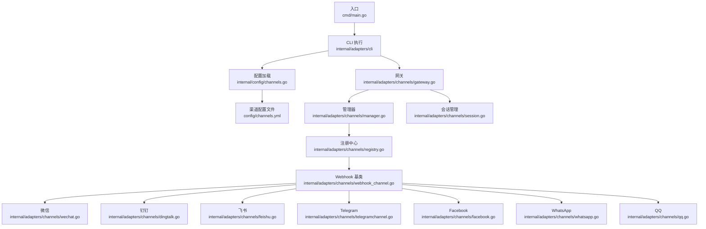
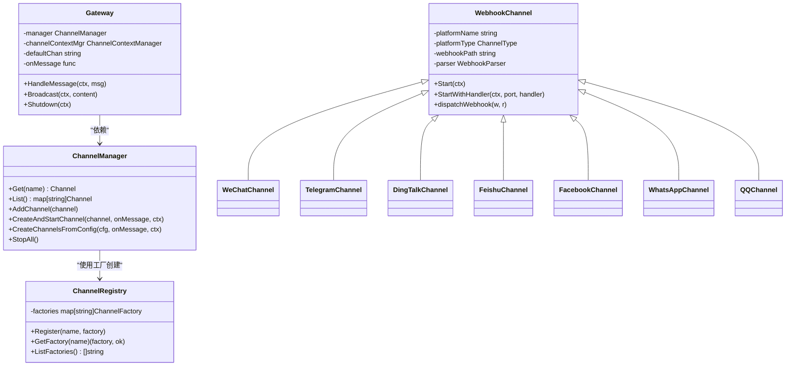
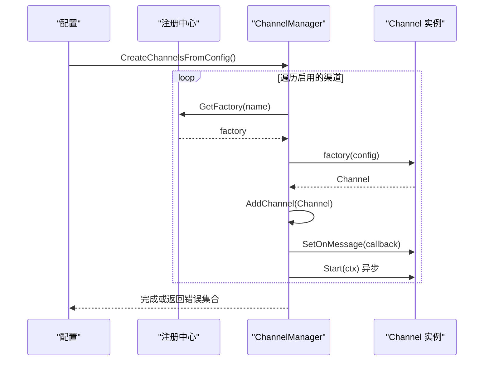
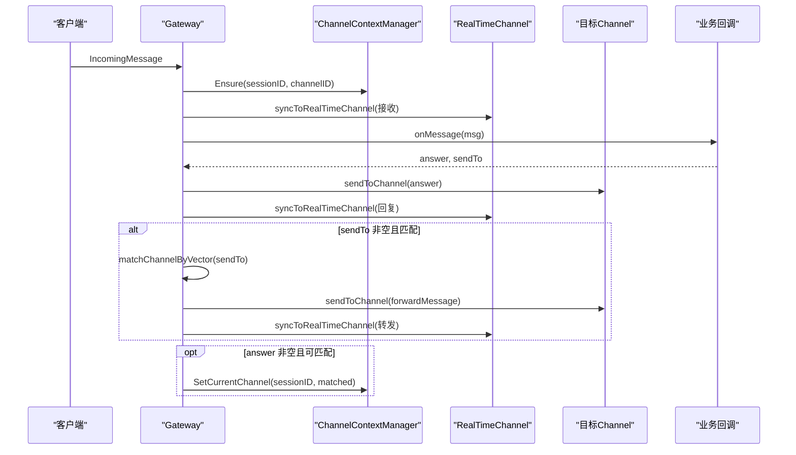
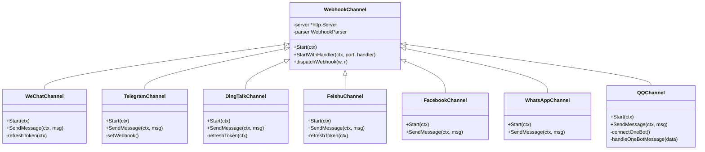
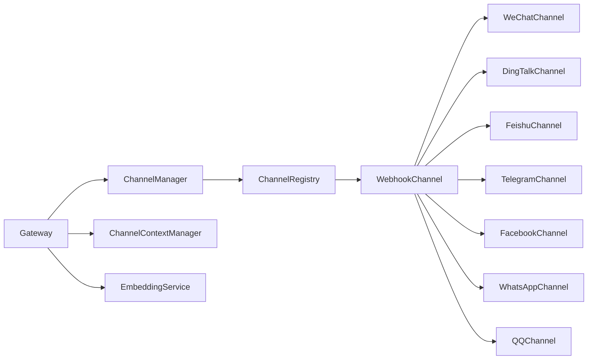

# 渠道通信系统

<cite>
**本文档引用的文件**
- [cmd/main.go](file://cmd/main.go)
- [internal/adapters/channels/manager.go](file://internal/adapters/channels/manager.go)
- [internal/adapters/channels/gateway.go](file://internal/adapters/channels/gateway.go)
- [internal/adapters/channels/registry.go](file://internal/adapters/channels/registry.go)
- [internal/config/channels.go](file://internal/config/channels.go)
- [config/channels.yml](file://config/channels.yml)
- [internal/adapters/channels/session.go](file://internal/adapters/channels/session.go)
- [internal/adapters/channels/webhook_channel.go](file://internal/adapters/channels/webhook_channel.go)
- [internal/adapters/channels/wechat.go](file://internal/adapters/channels/wechat.go)
- [internal/adapters/channels/telegramchannel.go](file://internal/adapters/channels/telegramchannel.go)
- [internal/adapters/channels/dingtalk.go](file://internal/adapters/channels/dingtalk.go)
- [internal/adapters/channels/feishu.go](file://internal/adapters/channels/feishu.go)
- [internal/adapters/channels/facebook.go](file://internal/adapters/channels/facebook.go)
- [internal/adapters/channels/qq.go](file://internal/adapters/channels/qq.go)
- [internal/adapters/channels/whatsapp.go](file://internal/adapters/channels/whatsapp.go)
</cite>

## 目录
1. [简介](#简介)
2. [项目结构](#项目结构)
3. [核心组件](#核心组件)
4. [架构总览](#架构总览)
5. [详细组件分析](#详细组件分析)
6. [依赖关系分析](#依赖关系分析)
7. [性能考虑](#性能考虑)
8. [故障排除指南](#故障排除指南)
9. [结论](#结论)
10. [附录](#附录)

## 简介
本文件为 MindX 渠道通信系统的全面技术文档，重点阐述渠道管理器的设计与实现、适配器模式的应用、动态配置管理、实时消息处理、Webhook 集成、会话管理、热更新机制与错误恢复策略，并提供渠道适配器开发指南与最佳实践。系统支持多种即时通讯渠道：微信、钉钉、Telegram、QQ、飞书、WhatsApp、Facebook 等，通过统一的网关层进行消息路由与转发，结合嵌入向量实现语义化的通道切换与转发。

## 项目结构
MindX 渠道通信系统采用分层与模块化设计：
- 入口与引导：命令入口负责初始化构建信息并启动 CLI。
- 适配器层：channels 包含网关、管理器、注册中心、Webhook 基类以及各平台具体实现。
- 配置层：channels.yml 提供渠道配置；config/channels.go 提供配置加载/保存与启停控制。
- 会话与上下文：ChannelContextManager 管理会话级通道状态。
- 实体与核心：entity 定义消息与状态模型；core 定义 Channel 接口。

**图表来源**
- [cmd/main.go](file://cmd/main.go#L1-L21)
- [internal/adapters/channels/gateway.go](file://internal/adapters/channels/gateway.go#L1-L58)
- [internal/adapters/channels/manager.go](file://internal/adapters/channels/manager.go#L1-L230)
- [internal/adapters/channels/registry.go](file://internal/adapters/channels/registry.go#L1-L142)
- [internal/adapters/channels/webhook_channel.go](file://internal/adapters/channels/webhook_channel.go#L1-L200)
- [internal/adapters/channels/wechat.go](file://internal/adapters/channels/wechat.go#L1-L200)
- [internal/adapters/channels/dingtalk.go](file://internal/adapters/channels/dingtalk.go#L1-L200)
- [internal/adapters/channels/feishu.go](file://internal/adapters/channels/feishu.go#L1-L200)
- [internal/adapters/channels/telegramchannel.go](file://internal/adapters/channels/telegramchannel.go#L1-L200)
- [internal/adapters/channels/facebook.go](file://internal/adapters/channels/facebook.go#L1-L200)
- [internal/adapters/channels/whatsapp.go](file://internal/adapters/channels/whatsapp.go#L1-L200)
- [internal/adapters/channels/qq.go](file://internal/adapters/channels/qq.go#L1-L200)
- [internal/config/channels.go](file://internal/config/channels.go#L1-L149)
- [config/channels.yml](file://config/channels.yml#L1-L96)

**章节来源**
- [cmd/main.go](file://cmd/main.go#L1-L21)
- [internal/adapters/channels/gateway.go](file://internal/adapters/channels/gateway.go#L1-L58)
- [internal/adapters/channels/manager.go](file://internal/adapters/channels/manager.go#L1-L230)
- [internal/adapters/channels/registry.go](file://internal/adapters/channels/registry.go#L1-L142)
- [internal/adapters/channels/webhook_channel.go](file://internal/adapters/channels/webhook_channel.go#L1-L200)
- [internal/config/channels.go](file://internal/config/channels.go#L1-L149)
- [config/channels.yml](file://config/channels.yml#L1-L96)

## 核心组件
- 渠道管理器（ChannelManager）：负责渠道的生命周期管理（添加、启动、停止、查询），线程安全，支持批量停止与统计。
- 网关（Gateway）：消息路由中枢，负责消息接收、会话上下文确保、实时通道同步、语义化通道匹配与转发、广播、优雅关闭。
- 注册中心（ChannelRegistry）：集中管理渠道工厂函数，实现配置驱动的渠道创建。
- WebhookChannel 基类：抽象 Webhook 接收与解析流程，子类仅需实现平台特定解析与发送逻辑。
- 会话上下文管理器（ChannelContextManager）：维护每个会话当前使用的渠道，支持切换与持久化。
- 配置系统（ChannelsConfig）：支持 YAML/JSON 加载/保存、启停控制、动态更新。

**章节来源**
- [internal/adapters/channels/manager.go](file://internal/adapters/channels/manager.go#L15-L230)
- [internal/adapters/channels/gateway.go](file://internal/adapters/channels/gateway.go#L15-L510)
- [internal/adapters/channels/registry.go](file://internal/adapters/channels/registry.go#L9-L142)
- [internal/adapters/channels/webhook_channel.go](file://internal/adapters/channels/webhook_channel.go#L16-L200)
- [internal/adapters/channels/session.go](file://internal/adapters/channels/session.go#L11-L177)
- [internal/config/channels.go](file://internal/config/channels.go#L11-L149)

## 架构总览
系统采用“网关 + 管理器 + 注册中心 + Webhook 基类 + 平台适配器”的分层架构。Gateway 作为消息中枢，统一接收与分发消息；ChannelManager 负责渠道生命周期；Registry 通过工厂函数实现配置驱动创建；WebhookChannel 抽象 Webhook 流程；各平台适配器（微信、钉钉、飞书、Telegram、Facebook、WhatsApp、QQ）继承 WebhookChannel 或实现 Channel 接口。

**图表来源**
- [internal/adapters/channels/manager.go](file://internal/adapters/channels/manager.go#L15-L230)
- [internal/adapters/channels/gateway.go](file://internal/adapters/channels/gateway.go#L15-L58)
- [internal/adapters/channels/registry.go](file://internal/adapters/channels/registry.go#L14-L53)
- [internal/adapters/channels/webhook_channel.go](file://internal/adapters/channels/webhook_channel.go#L29-L63)
- [internal/adapters/channels/wechat.go](file://internal/adapters/channels/wechat.go#L51-L80)
- [internal/adapters/channels/telegramchannel.go](file://internal/adapters/channels/telegramchannel.go#L32-L55)
- [internal/adapters/channels/dingtalk.go](file://internal/adapters/channels/dingtalk.go#L40-L68)
- [internal/adapters/channels/feishu.go](file://internal/adapters/channels/feishu.go#L35-L63)
- [internal/adapters/channels/facebook.go](file://internal/adapters/channels/facebook.go#L31-L54)
- [internal/adapters/channels/whatsapp.go](file://internal/adapters/channels/whatsapp.go#L32-L54)
- [internal/adapters/channels/qq.go](file://internal/adapters/channels/qq.go#L34-L72)

## 详细组件分析

### 渠道管理器（ChannelManager）
- 职责：线程安全地管理渠道集合，提供查询、添加、批量启动、批量停止、存在性检查与数量统计。
- 关键点：使用互斥锁保护并发访问；CreateChannelsFromConfig 支持并发工厂创建与错误聚合；CreateAndStartChannel 支持异步启动并设置消息回调。
- 动态配置：通过配置驱动创建，避免硬编码；支持启用/禁用与配置更新。

**图表来源**
- [internal/adapters/channels/manager.go](file://internal/adapters/channels/manager.go#L149-L229)
- [internal/adapters/channels/registry.go](file://internal/adapters/channels/registry.go#L34-L38)

**章节来源**
- [internal/adapters/channels/manager.go](file://internal/adapters/channels/manager.go#L15-L230)
- [internal/adapters/channels/registry.go](file://internal/adapters/channels/registry.go#L25-L38)

### 网关（Gateway）
- 职责：消息路由、会话上下文管理、实时通道同步、语义化通道匹配与转发、广播、优雅关闭。
- 关键流程：
  - HandleMessage：确保会话上下文、同步到实时通道、调用业务回调、发送响应、转发到目标通道、语义化切换。
  - matchChannelByVector：基于嵌入向量计算相似度，选择目标通道。
  - syncToRealTimeChannel：将消息同步到实时通道，保证 UI 可见性。
  - Shutdown：等待活跃消息完成或超时，然后停止所有渠道。

**图表来源**
- [internal/adapters/channels/gateway.go](file://internal/adapters/channels/gateway.go#L74-L272)
- [internal/adapters/channels/session.go](file://internal/adapters/channels/session.go#L90-L143)

**章节来源**
- [internal/adapters/channels/gateway.go](file://internal/adapters/channels/gateway.go#L15-L510)
- [internal/adapters/channels/session.go](file://internal/adapters/channels/session.go#L11-L177)

### WebhookChannel 基类与平台适配器
- WebhookChannel：统一处理 HTTP Webhook 的启动、验证、解析与回调；子类只需实现平台特定解析与发送逻辑。
- 平台适配器（微信、钉钉、飞书、Telegram、Facebook、WhatsApp、QQ）：
  - 继承 WebhookChannel 或实现 Channel 接口；
  - 在 init() 中注册工厂函数；
  - 实现 Start、SendMessage、解析器与平台 API 调用。

**图表来源**
- [internal/adapters/channels/webhook_channel.go](file://internal/adapters/channels/webhook_channel.go#L29-L200)
- [internal/adapters/channels/wechat.go](file://internal/adapters/channels/wechat.go#L51-L200)
- [internal/adapters/channels/telegramchannel.go](file://internal/adapters/channels/telegramchannel.go#L32-L200)
- [internal/adapters/channels/dingtalk.go](file://internal/adapters/channels/dingtalk.go#L40-L200)
- [internal/adapters/channels/feishu.go](file://internal/adapters/channels/feishu.go#L35-L200)
- [internal/adapters/channels/facebook.go](file://internal/adapters/channels/facebook.go#L31-L200)
- [internal/adapters/channels/whatsapp.go](file://internal/adapters/channels/whatsapp.go#L32-L200)
- [internal/adapters/channels/qq.go](file://internal/adapters/channels/qq.go#L34-L200)

**章节来源**
- [internal/adapters/channels/webhook_channel.go](file://internal/adapters/channels/webhook_channel.go#L16-L200)
- [internal/adapters/channels/wechat.go](file://internal/adapters/channels/wechat.go#L24-L200)
- [internal/adapters/channels/telegramchannel.go](file://internal/adapters/channels/telegramchannel.go#L19-L200)
- [internal/adapters/channels/dingtalk.go](file://internal/adapters/channels/dingtalk.go#L25-L200)
- [internal/adapters/channels/feishu.go](file://internal/adapters/channels/feishu.go#L21-L200)
- [internal/adapters/channels/facebook.go](file://internal/adapters/channels/facebook.go#L18-L200)
- [internal/adapters/channels/whatsapp.go](file://internal/adapters/channels/whatsapp.go#L19-L200)
- [internal/adapters/channels/qq.go](file://internal/adapters/channels/qq.go#L20-L200)

### 会话上下文管理（ChannelContextManager）
- 职责：维护每个会话的当前渠道，支持设置默认渠道、确保上下文存在、切换渠道、列出与清理。
- 与 Gateway 协作：Gateway 在处理消息前确保会话上下文，必要时触发语义化切换。

**章节来源**
- [internal/adapters/channels/session.go](file://internal/adapters/channels/session.go#L11-L177)
- [internal/adapters/channels/gateway.go](file://internal/adapters/channels/gateway.go#L120-L125)

### 配置系统与热更新
- ChannelsConfig：支持 YAML/JSON 加载/保存；提供启用/禁用、更新配置、查询状态等操作。
- channels.yml：默认渠道配置模板，包含各平台的端口、路径、密钥等参数。
- 热更新机制：通过配置文件变更触发重新加载与工厂重建，结合 ChannelManager 的批量启动/停止实现动态启停。

**章节来源**
- [internal/config/channels.go](file://internal/config/channels.go#L11-L149)
- [config/channels.yml](file://config/channels.yml#L1-L96)

## 依赖关系分析
- 组件耦合：Gateway 依赖 ChannelManager；ChannelManager 依赖 Registry；各平台适配器依赖 WebhookChannel 或实现 Channel 接口。
- 外部依赖：HTTP 服务、第三方平台 API、嵌入向量服务（用于语义匹配）。
- 错误传播：工厂创建失败、启动失败、发送失败均通过日志记录并返回错误，Gateway 在转发失败时回写错误提示。

**图表来源**
- [internal/adapters/channels/gateway.go](file://internal/adapters/channels/gateway.go#L17-L57)
- [internal/adapters/channels/manager.go](file://internal/adapters/channels/manager.go#L17-L28)
- [internal/adapters/channels/registry.go](file://internal/adapters/channels/registry.go#L16-L32)
- [internal/adapters/channels/webhook_channel.go](file://internal/adapters/channels/webhook_channel.go#L31-L47)

**章节来源**
- [internal/adapters/channels/gateway.go](file://internal/adapters/channels/gateway.go#L15-L58)
- [internal/adapters/channels/manager.go](file://internal/adapters/channels/manager.go#L15-L28)
- [internal/adapters/channels/registry.go](file://internal/adapters/channels/registry.go#L14-L38)
- [internal/adapters/channels/webhook_channel.go](file://internal/adapters/channels/webhook_channel.go#L29-L47)

## 性能考虑
- 并发创建：ChannelManager 在创建多渠道时使用 goroutine 并发执行，提高启动效率。
- 嵌入向量预计算：Gateway 在启动时对所有渠道生成向量，减少运行时计算开销。
- 超时与重试：WebhookChannel 与各平台适配器设置合理的 HTTP 超时；部分适配器使用断路器封装发送逻辑。
- 资源释放：Gateway 优雅关闭时等待活跃消息完成，避免数据丢失。

[本节为通用性能建议，无需特定文件引用]

## 故障排除指南
- 启动失败
  - 检查配置文件格式与字段完整性（端口、路径、密钥）。
  - 查看日志中的“启动失败”与“创建失败”记录，定位具体渠道。
- 发送失败
  - 平台 API 返回错误：检查令牌、权限与参数。
  - 断路器触发：查看断路器状态与熔断阈值。
- 转发失败
  - 目标渠道不存在或未运行：确认目标渠道名称与状态。
  - 语义匹配失败：检查 EmbeddingService 与文本向量化结果。
- 实时通道不同步
  - 确认 RealTimeChannel 存在且运行；检查 syncToRealTimeChannel 日志。
- 优雅关闭卡顿
  - 检查活跃消息计数与处理耗时；适当调整超时时间。

**章节来源**
- [internal/adapters/channels/gateway.go](file://internal/adapters/channels/gateway.go#L455-L509)
- [internal/adapters/channels/manager.go](file://internal/adapters/channels/manager.go#L58-L83)
- [internal/adapters/channels/wechat.go](file://internal/adapters/channels/wechat.go#L160-L175)
- [internal/adapters/channels/telegramchannel.go](file://internal/adapters/channels/telegramchannel.go#L152-L160)

## 结论
MindX 渠道通信系统通过清晰的分层与适配器模式，实现了对多平台渠道的统一接入与管理。Gateway 作为中枢，结合 ChannelManager 与 Registry，提供了高可用、可扩展的消息处理能力；WebhookChannel 基类与平台适配器降低了接入成本；配置驱动与热更新机制提升了运维灵活性。建议在生产环境中配合监控与告警，持续优化嵌入向量质量与网络稳定性。

[本节为总结性内容，无需特定文件引用]

## 附录

### 渠道适配器开发指南与最佳实践
- 工厂注册
  - 在 init() 中调用 Register 注册工厂函数，参数为配置映射，返回 Channel 实例与错误。
- Webhook 解析
  - 实现 WebhookParser 接口：ParseWebhook 与 HandleVerification，统一在 WebhookChannel.dispatchWebhook 中处理。
- 发送消息
  - 在 SendMessage 中封装 HTTP 请求与错误处理；必要时使用断路器包装。
- 启动与停止
  - Start 中创建 HTTP 服务器或连接 WebSocket；在 ctx.Done() 时优雅停止。
- 配置参数
  - 使用 getStringFromConfig/getIntFromConfig/getBoolFromConfig 等辅助函数读取配置，提供默认值。
- 日志与可观测性
  - 使用系统日志与对话日志记录关键事件与错误，便于排障。

**章节来源**
- [internal/adapters/channels/registry.go](file://internal/adapters/channels/registry.go#L25-L142)
- [internal/adapters/channels/webhook_channel.go](file://internal/adapters/channels/webhook_channel.go#L22-L135)
- [internal/adapters/channels/wechat.go](file://internal/adapters/channels/wechat.go#L24-L80)
- [internal/adapters/channels/telegramchannel.go](file://internal/adapters/channels/telegramchannel.go#L19-L55)
- [internal/adapters/channels/dingtalk.go](file://internal/adapters/channels/dingtalk.go#L25-L68)
- [internal/adapters/channels/feishu.go](file://internal/adapters/channels/feishu.go#L21-L63)
- [internal/adapters/channels/facebook.go](file://internal/adapters/channels/facebook.go#L18-L54)
- [internal/adapters/channels/whatsapp.go](file://internal/adapters/channels/whatsapp.go#L19-L54)
- [internal/adapters/channels/qq.go](file://internal/adapters/channels/qq.go#L20-L72)

### 集成示例（步骤说明）
- 配置渠道
  - 在 channels.yml 中启用所需渠道，填写端口、路径与平台密钥。
- 启动系统
  - CLI 启动后，ChannelManager 根据配置并发创建并启动渠道。
- Webhook 配置
  - 平台侧配置回调地址为 http://host:port/path（与配置一致）。
- 发送测试
  - 向对应渠道发送消息，观察 Gateway 日志与平台返回。
- 转发与切换
  - 通过业务回调返回 sendTo 或答案内容，Gateway 自动进行语义化转发与通道切换。

**章节来源**
- [config/channels.yml](file://config/channels.yml#L1-L96)
- [internal/adapters/channels/manager.go](file://internal/adapters/channels/manager.go#L149-L229)
- [internal/adapters/channels/gateway.go](file://internal/adapters/channels/gateway.go#L74-L272)