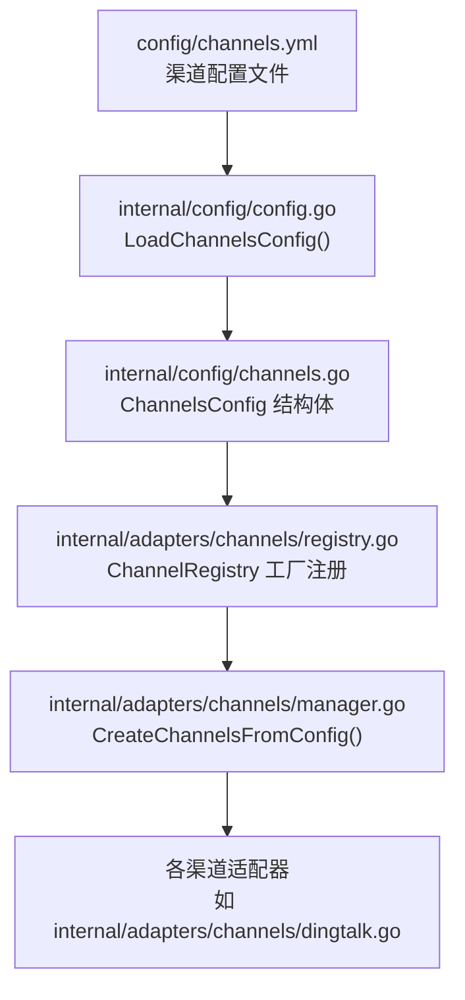
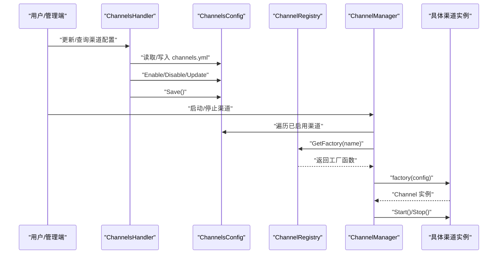
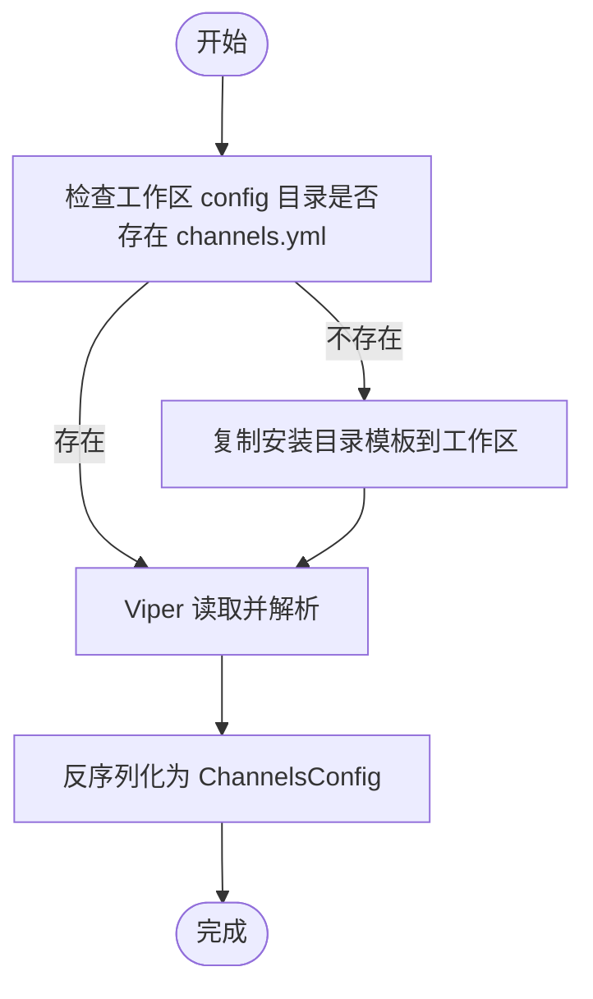
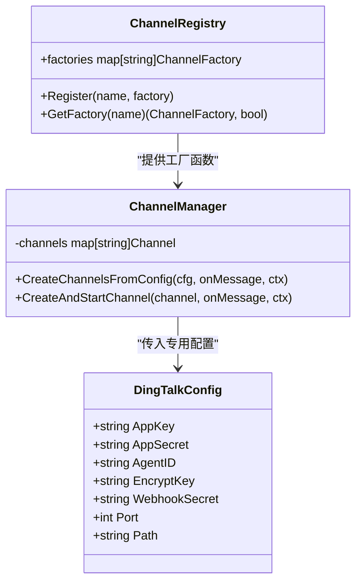
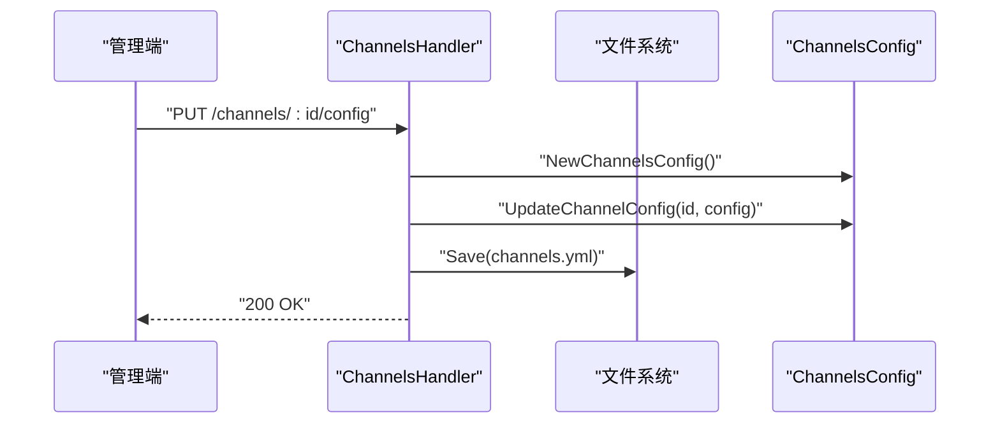
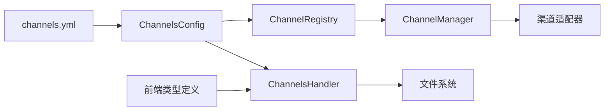

# 渠道配置管理

<cite>
**本文档引用的文件**
- [config/channels.yml](file://config/channels.yml)
- [internal/config/channels.go](file://internal/config/channels.go)
- [internal/config/config.go](file://internal/config/config.go)
- [internal/adapters/channels/manager.go](file://internal/adapters/channels/manager.go)
- [internal/adapters/channels/registry.go](file://internal/adapters/channels/registry.go)
- [internal/adapters/channels/dingtalk.go](file://internal/adapters/channels/dingtalk.go)
- [internal/config/dingtalk.go](file://internal/config/dingtalk.go)
- [internal/config/feishu.go](file://internal/config/feishu.go)
- [internal/config/wechat.go](file://internal/config/wechat.go)
- [internal/config/telegram.go](file://internal/config/telegram.go)
- [internal/config/qq.go](file://internal/config/qq.go)
- [internal/adapters/http/handlers/channels.go](file://internal/adapters/http/handlers/channels.go)
- [dashboard/src/components/channels/types.ts](file://dashboard/src/components/channels/types.ts)
</cite>

## 目录
1. [简介](#简介)
2. [项目结构](#项目结构)
3. [核心组件](#核心组件)
4. [架构总览](#架构总览)
5. [详细组件分析](#详细组件分析)
6. [依赖关系分析](#依赖关系分析)
7. [性能考虑](#性能考虑)
8. [故障排除指南](#故障排除指南)
9. [结论](#结论)
10. [附录](#附录)

## 简介
本文件面向 MindX 渠道配置管理，系统性阐述 channels.yml 配置文件的结构与参数含义，覆盖各渠道的认证信息、回调地址、端口与超时等关键配置项；同时说明配置文件的加载机制、校验规则与热更新能力，解释环境变量覆盖策略与优先级，并给出配置模板使用方法与最佳实践。文末提供完整配置示例、常见错误与排障建议，以及安全与生产部署注意事项。

## 项目结构
MindX 的渠道配置由 YAML/JSON 文件与 Go 配置模型共同构成，运行时通过 Viper 加载并反序列化为强类型结构，随后由渠道注册中心按配置动态创建与启动具体渠道实例。

**图表来源**
- [config/channels.yml](file://config/channels.yml#L1-L96)
- [internal/config/config.go](file://internal/config/config.go#L84-L122)
- [internal/config/channels.go](file://internal/config/channels.go#L11-L21)
- [internal/adapters/channels/registry.go](file://internal/adapters/channels/registry.go#L14-L38)
- [internal/adapters/channels/manager.go](file://internal/adapters/channels/manager.go#L149-L229)
- [internal/adapters/channels/dingtalk.go](file://internal/adapters/channels/dingtalk.go#L25-L38)

**章节来源**
- [config/channels.yml](file://config/channels.yml#L1-L96)
- [internal/config/config.go](file://internal/config/config.go#L84-L122)

## 核心组件
- ChannelsConfig/Channel 数据模型：定义 enabled_channels 列表与 channels 映射，每个渠道包含 enabled、name、icon、config 字段。
- 配置加载器：通过 Viper 读取 channels.yml 并反序列化为结构体；若工作区无配置则复制安装目录模板。
- 渠道注册中心：集中管理各渠道工厂函数，按配置名动态创建实例。
- 渠道管理器：并发创建并启动已启用的渠道，统一处理生命周期与错误聚合。
- HTTP 管理接口：提供查询、更新、启停渠道的 API，支持在线修改 channels.yml 并持久化。

**章节来源**
- [internal/config/channels.go](file://internal/config/channels.go#L11-L21)
- [internal/config/channels.go](file://internal/config/channels.go#L23-L41)
- [internal/adapters/channels/registry.go](file://internal/adapters/channels/registry.go#L14-L38)
- [internal/adapters/channels/manager.go](file://internal/adapters/channels/manager.go#L149-L229)
- [internal/adapters/http/handlers/channels.go](file://internal/adapters/http/handlers/channels.go#L31-L155)

## 架构总览
下图展示从配置文件到渠道实例的全链路流程，包括加载、反序列化、工厂创建与并发启动。

**图表来源**
- [internal/adapters/http/handlers/channels.go](file://internal/adapters/http/handlers/channels.go#L56-L155)
- [internal/config/channels.go](file://internal/config/channels.go#L61-L100)
- [internal/adapters/channels/registry.go](file://internal/adapters/channels/registry.go#L34-L38)
- [internal/adapters/channels/manager.go](file://internal/adapters/channels/manager.go#L149-L229)

## 详细组件分析

### channels.yml 配置结构与字段说明
- enabled_channels：启用渠道 ID 列表，用于记录哪些渠道被显式启用。
- channels：渠道映射，键为渠道 ID（如 dingtalk、facebook、feishu 等），值包含：
  - enabled：是否启用该渠道
  - name/icon：显示名称与图标标识
  - config：渠道专属配置对象，字段因渠道而异

各渠道通用字段（来自配置模型）：
- enabled：布尔，控制是否创建并启动该渠道
- name：字符串，渠道显示名
- icon：字符串，前端图标标识
- config：对象，包含各渠道特有的认证、回调、端口等参数

部分渠道专属字段（节选）：
- 钉钉（dingtalk）
  - agent_id：机器人 Agent ID
  - app_key/app_secret：应用凭证
  - encrypt_key：加密密钥（用于签名）
  - path/port：Webhook 路径与监听端口
  - webhook_secret：Webhook 密钥或访问令牌
- Facebook（facebook）
  - app_secret/page_access_token/page_id/verify_token：平台接入所需凭据
  - path/port：Webhook 路径与端口
- 飞书（feishu）
  - app_id/app_secret：应用凭证
  - path/port：Webhook 路径与端口
- iMessage（imessage）
  - debounce/watch_since：去抖与起始时间戳
  - imsg_path：客户端路径
  - region：区域
- QQ（qq）
  - app_id/app_secret/token：应用凭证与令牌
  - path/port：Webhook 路径与端口
  - sandbox：沙盒模式开关
  - description：描述
- Telegram（telegram）
  - bot_token：机器人令牌
  - path/port：Webhook 路径与端口
  - secret_token/use_webhook/webhook_url：安全令牌与 Webhook URL
- 微信（wechat）
  - app_id/app_secret/token/encoding_aes_key：公众号/企业微信接入参数
  - path/port/type：Webhook 路径、端口与类型
- WhatsApp（whatsapp）
  - access_token/business_id/phone_number_id/verify_token：业务云 API 所需参数
  - path/port：Webhook 路径与端口

**章节来源**
- [config/channels.yml](file://config/channels.yml#L1-L96)
- [internal/config/channels.go](file://internal/config/channels.go#L11-L21)

### 配置加载机制与模板
- 加载入口：InitVippers() 会依次加载 server、channels、capabilities、models 等配置。
- channels.yml 加载：LoadChannelsConfig() 优先读取工作区 config 目录下的 channels.yml；若不存在，则尝试复制安装目录中的 channels.json.template 作为 channels.yml。
- 反序列化：Viper 读取后反序列化为 ChannelsConfig 结构体，内部字段与 channels.yml 对应。

**图表来源**
- [internal/config/config.go](file://internal/config/config.go#L84-L122)

**章节来源**
- [internal/config/config.go](file://internal/config/config.go#L13-L37)
- [internal/config/config.go](file://internal/config/config.go#L84-L122)

### 渠道工厂与动态创建
- 工厂注册：各渠道包的 init() 中通过 Register(name, factory) 注册工厂函数。
- 动态创建：ChannelManager.CreateChannelsFromConfig() 遍历已启用渠道，根据名称从注册中心获取工厂，传入 config 对象创建实例并启动。
- 类型安全：各渠道定义了专用 Config 结构体（如 DingTalkConfig、FeishuConfig 等），用于强类型解析与后续使用。

**图表来源**
- [internal/adapters/channels/registry.go](file://internal/adapters/channels/registry.go#L14-L38)
- [internal/adapters/channels/manager.go](file://internal/adapters/channels/manager.go#L149-L229)
- [internal/config/dingtalk.go](file://internal/config/dingtalk.go#L3-L11)

**章节来源**
- [internal/adapters/channels/registry.go](file://internal/adapters/channels/registry.go#L25-L38)
- [internal/adapters/channels/manager.go](file://internal/adapters/channels/manager.go#L149-L229)
- [internal/config/dingtalk.go](file://internal/config/dingtalk.go#L3-L11)

### HTTP 管理接口与热更新
- 查询接口：返回当前 enabled_channels 与 channels 映射。
- 更新配置：接收 JSON 请求体，更新对应渠道的 config 对象并保存到 channels.yml。
- 启停控制：支持启用/禁用某渠道，内部更新 enabled 字段并持久化。
- 注意：启动/停止具体渠道实例的实际逻辑由服务管理负责，接口层返回“启动成功”提示。

**图表来源**
- [internal/adapters/http/handlers/channels.go](file://internal/adapters/http/handlers/channels.go#L56-L100)

**章节来源**
- [internal/adapters/http/handlers/channels.go](file://internal/adapters/http/handlers/channels.go#L31-L200)

### 环境变量覆盖与优先级
- 当前仓库未发现对 channels.yml 的环境变量覆盖实现。配置加载使用 Viper，但未见针对 channels.yml 的环境变量绑定或覆盖逻辑。
- 若需引入环境变量覆盖，建议在加载阶段为 channels.yml 的字段添加环境变量绑定（例如通过 Viper 的 BindEnv 或替代的环境变量解析工具），并在解析前进行占位符替换。

[本节为一般性指导，不直接分析具体文件，故无章节来源]

### 配置模板使用方法与最佳实践
- 模板生成：首次运行且工作区无 channels.yml 时，系统会从安装目录复制 channels.json.template 作为 channels.yml。
- 最佳实践：
  - 将敏感信息（如 app_secret、token）放入受控环境或密管系统，避免直接写入配置文件。
  - 为每个渠道单独配置独立的 path 与 port，避免冲突。
  - 在启用新渠道前先填写必要字段，确保配置可校验通过。
  - 使用 HTTP 接口在线更新配置时，建议先备份 channels.yml 再操作。

**章节来源**
- [internal/config/config.go](file://internal/config/config.go#L111-L121)

### 完整配置示例与字段对照
以下为各渠道常用字段的参考说明（非代码片段）：
- 钉钉
  - 必填：app_key、app_secret、agent_id 或 webhook_secret
  - 可选：encrypt_key、path、port
- Facebook
  - 必填：page_access_token、verify_token
  - 可选：app_secret、path、port
- 飞书
  - 必填：app_id、app_secret
  - 可选：path、port
- iMessage
  - 必填：imsg_path、region
  - 可选：debounce、watch_since
- QQ
  - 必填：app_id、app_secret、token
  - 可选：path、port、sandbox、description
- Telegram
  - 必填：bot_token
  - 可选：path、port、secret_token、use_webhook、webhook_url
- 微信
  - 必填：app_id、app_secret、token
  - 可选：encoding_aes_key、path、port、type
- WhatsApp
  - 必填：access_token、business_id、phone_number_id
  - 可选：path、port、verify_token

**章节来源**
- [config/channels.yml](file://config/channels.yml#L3-L96)
- [internal/config/dingtalk.go](file://internal/config/dingtalk.go#L3-L11)
- [internal/config/feishu.go](file://internal/config/feishu.go#L3-L10)
- [internal/config/wechat.go](file://internal/config/wechat.go#L3-L11)
- [internal/config/telegram.go](file://internal/config/telegram.go#L3-L10)
- [internal/config/qq.go](file://internal/config/qq.go#L3-L13)

## 依赖关系分析
- 配置层：ChannelsConfig 依赖 channels.yml；通过 Viper 反序列化为结构体。
- 运行时：ChannelRegistry 依赖各渠道包的 init() 注册；ChannelManager 依赖注册中心创建实例。
- HTTP 层：ChannelsHandler 依赖 ChannelsConfig 进行读写与持久化。
- 前端：Channels 页面类型定义与后端响应结构保持一致。

**图表来源**
- [internal/config/channels.go](file://internal/config/channels.go#L11-L21)
- [internal/adapters/channels/registry.go](file://internal/adapters/channels/registry.go#L14-L38)
- [internal/adapters/channels/manager.go](file://internal/adapters/channels/manager.go#L149-L229)
- [internal/adapters/http/handlers/channels.go](file://internal/adapters/http/handlers/channels.go#L31-L54)
- [dashboard/src/components/channels/types.ts](file://dashboard/src/components/channels/types.ts#L1-L15)

**章节来源**
- [internal/config/channels.go](file://internal/config/channels.go#L11-L21)
- [internal/adapters/http/handlers/channels.go](file://internal/adapters/http/handlers/channels.go#L31-L54)
- [dashboard/src/components/channels/types.ts](file://dashboard/src/components/channels/types.ts#L1-L15)

## 性能考虑
- 并发创建：ChannelManager.CreateChannelsFromConfig() 使用 goroutine 并发创建渠道，提高初始化效率。
- 错误聚合：通过 errChan 收集失败原因，便于快速定位问题。
- 超时控制：WebhookChannel 默认设置 ReadTimeout/WriteTimeout，避免阻塞与资源泄漏。
- 断路器：部分渠道（如钉钉）使用断路器包装发送逻辑，降低下游异常影响。

**章节来源**
- [internal/adapters/channels/manager.go](file://internal/adapters/channels/manager.go#L165-L229)
- [internal/adapters/channels/dingtalk.go](file://internal/adapters/channels/dingtalk.go#L117-L145)

## 故障排除指南
- 配置文件缺失
  - 现象：加载 channels.yml 失败或报错
  - 处理：确认工作区 config 目录是否存在 channels.yml；若不存在，系统会尝试复制安装目录模板
- 字段类型不匹配
  - 现象：反序列化失败或字段为空
  - 处理：检查字段类型（字符串/整数/布尔），必要时转换为正确格式
- 渠道未注册
  - 现象：CreateChannelsFromConfig 日志提示工厂未注册
  - 处理：确认对应渠道包已编译并初始化，确保 init() 中已调用 Register
- 启停接口失败
  - 现象：更新配置或启停返回错误
  - 处理：检查 channels.yml 权限、磁盘空间；确认保存路径有效
- Webhook 端口冲突
  - 现象：启动失败或端口占用
  - 处理：为不同渠道分配独立 port，避免冲突

**章节来源**
- [internal/config/config.go](file://internal/config/config.go#L111-L121)
- [internal/adapters/channels/manager.go](file://internal/adapters/channels/manager.go#L179-L186)
- [internal/adapters/http/handlers/channels.go](file://internal/adapters/http/handlers/channels.go#L91-L95)

## 结论
MindX 的渠道配置采用“配置驱动 + 工厂注册 + 并发创建”的架构，具备良好的扩展性与可维护性。channels.yml 提供统一的声明式配置入口，配合 HTTP 管理接口实现在线热更新。建议在生产环境中强化敏感信息保护、完善监控告警，并为新增渠道预留标准化的配置与校验流程。

## 附录

### 配置字段速查表（部分）
- 通用
  - enabled/name/icon：布尔/字符串/字符串
  - config：对象
- 钉钉
  - app_key/app_secret/agent_id/webhook_secret：字符串
  - encrypt_key：字符串
  - path/port：字符串/整数
- Facebook
  - app_secret/page_access_token/page_id/verify_token：字符串
  - path/port：字符串/整数
- 飞书
  - app_id/app_secret：字符串
  - path/port：字符串/整数
- iMessage
  - imsg_path/region：字符串
  - debounce/watch_since：字符串/整数
- QQ
  - app_id/app_secret/token：字符串
  - path/port：字符串/整数
  - sandbox：布尔
  - description：字符串
- Telegram
  - bot_token：字符串
  - path/port：字符串/整数
  - secret_token/use_webhook/webhook_url：字符串/布尔/字符串
- 微信
  - app_id/app_secret/token/encoding_aes_key：字符串
  - path/port/type：字符串/整数/字符串
- WhatsApp
  - access_token/business_id/phone_number_id/verify_token：字符串
  - path/port：字符串/整数

**章节来源**
- [config/channels.yml](file://config/channels.yml#L3-L96)
- [internal/config/dingtalk.go](file://internal/config/dingtalk.go#L3-L11)
- [internal/config/feishu.go](file://internal/config/feishu.go#L3-L10)
- [internal/config/wechat.go](file://internal/config/wechat.go#L3-L11)
- [internal/config/telegram.go](file://internal/config/telegram.go#L3-L10)
- [internal/config/qq.go](file://internal/config/qq.go#L3-L13)