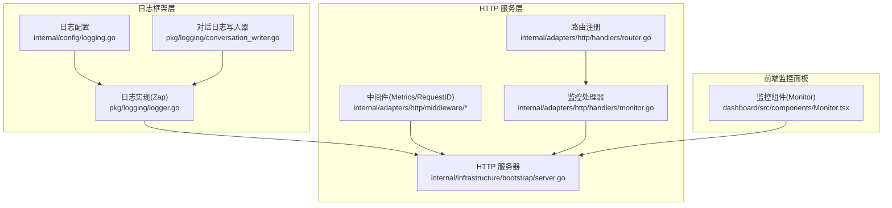
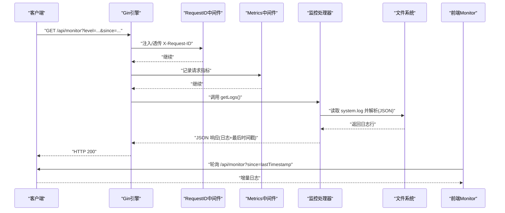
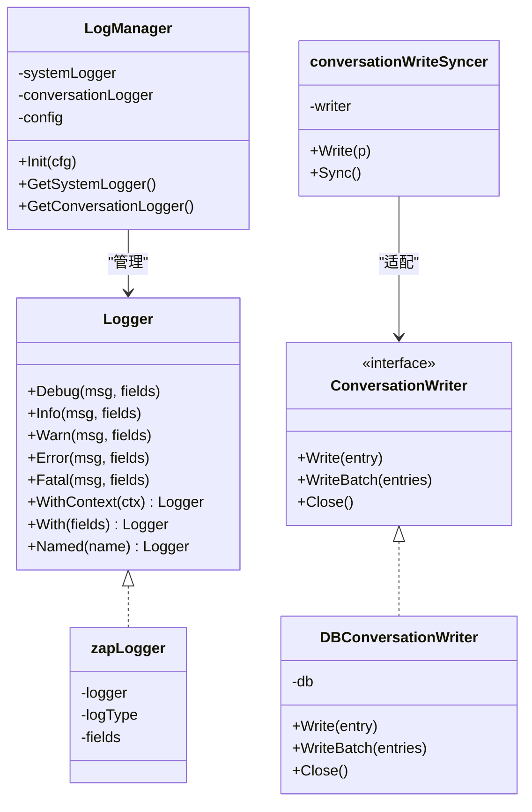
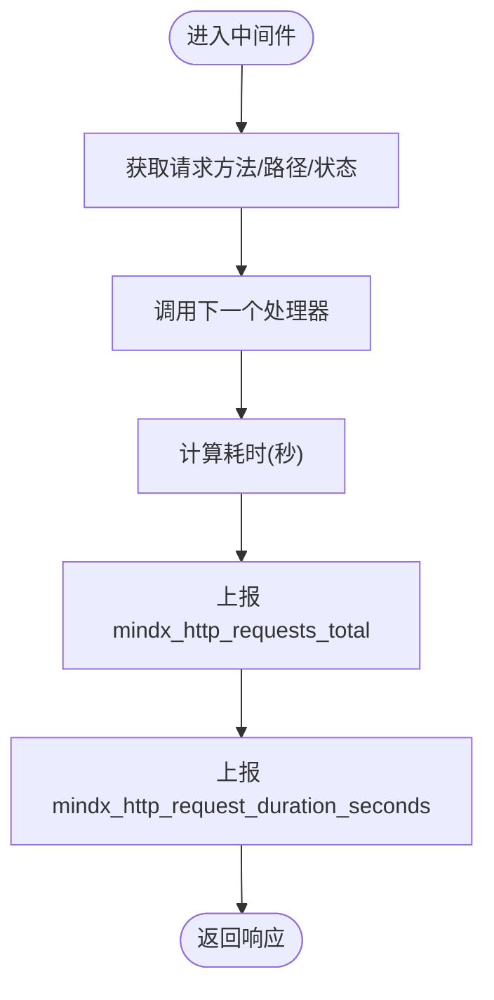
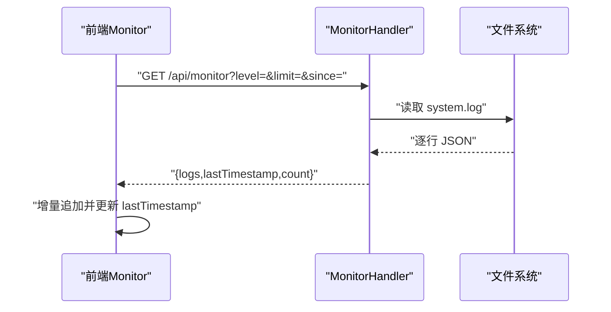
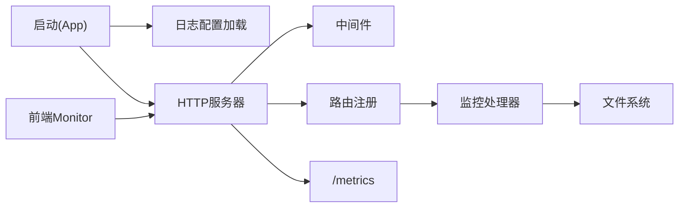

# 监控和日志

<cite>
**本文引用的文件**
- [internal/config/logging.go](file://internal/config/logging.go)
- [pkg/logging/logger.go](file://pkg/logging/logger.go)
- [pkg/logging/conversation_writer.go](file://pkg/logging/conversation_writer.go)
- [internal/adapters/http/middleware/metrics.go](file://internal/adapters/http/middleware/metrics.go)
- [internal/adapters/http/middleware/request_id.go](file://internal/adapters/http/middleware/request_id.go)
- [internal/adapters/http/handlers/monitor.go](file://internal/adapters/http/handlers/monitor.go)
- [internal/adapters/http/handlers/router.go](file://internal/adapters/http/handlers/router.go)
- [internal/entity/logs.go](file://internal/entity/logs.go)
- [dashboard/src/components/Monitor.tsx](file://dashboard/src/components/Monitor.tsx)
- [internal/infrastructure/bootstrap/server.go](file://internal/infrastructure/bootstrap/server.go)
- [internal/infrastructure/bootstrap/app.go](file://internal/infrastructure/bootstrap/app.go)
- [internal/errors/errors.go](file://internal/errors/errors.go)
- [config/server.yml](file://config/server.yml)
</cite>

## 目录
1. [简介](#简介)
2. [项目结构](#项目结构)
3. [核心组件](#核心组件)
4. [架构总览](#架构总览)
5. [组件详解](#组件详解)
6. [依赖关系分析](#依赖关系分析)
7. [性能考量](#性能考量)
8. [故障排查指南](#故障排查指南)
9. [结论](#结论)
10. [附录](#附录)

## 简介
本文件面向 MindX 的监控与日志体系，覆盖以下主题：
- 日志系统设计与实现：日志配置、结构化日志、日志轮转机制
- 性能监控实现：指标采集、健康检查、错误追踪
- 监控中间件工作原理与配置
- 日志分类管理与查询策略
- 监控仪表板集成与可视化
- 日志分析与故障诊断最佳实践
- 运维人员的完整监控与日志管理指南

## 项目结构
MindX 的监控与日志由“日志框架层”“HTTP 服务层”“前端监控面板层”三部分协同构成：
- 日志框架层：基于 Zap 的统一日志实现，支持系统日志与对话日志，具备文件轮转与结构化输出能力
- HTTP 服务层：提供 /api/monitor 查询接口、/metrics 指标端点、/health 健康检查、Prometheus 指标中间件
- 前端监控面板：提供实时日志终端、过滤与增量拉取、自动滚动与清空功能

**图表来源**
- [internal/config/logging.go](file://internal/config/logging.go#L1-L45)
- [pkg/logging/logger.go](file://pkg/logging/logger.go#L1-L402)
- [pkg/logging/conversation_writer.go](file://pkg/logging/conversation_writer.go#L1-L105)
- [internal/infrastructure/bootstrap/server.go](file://internal/infrastructure/bootstrap/server.go#L1-L200)
- [internal/adapters/http/middleware/metrics.go](file://internal/adapters/http/middleware/metrics.go#L1-L69)
- [internal/adapters/http/middleware/request_id.go](file://internal/adapters/http/middleware/request_id.go#L1-L22)
- [internal/adapters/http/handlers/router.go](file://internal/adapters/http/handlers/router.go#L1-L150)
- [internal/adapters/http/handlers/monitor.go](file://internal/adapters/http/handlers/monitor.go#L1-L188)
- [dashboard/src/components/Monitor.tsx](file://dashboard/src/components/Monitor.tsx#L1-L279)

**章节来源**
- [internal/config/logging.go](file://internal/config/logging.go#L1-L45)
- [pkg/logging/logger.go](file://pkg/logging/logger.go#L1-L402)
- [internal/infrastructure/bootstrap/server.go](file://internal/infrastructure/bootstrap/server.go#L1-L200)
- [internal/adapters/http/handlers/router.go](file://internal/adapters/http/handlers/router.go#L1-L150)
- [dashboard/src/components/Monitor.tsx](file://dashboard/src/components/Monitor.tsx#L1-L279)

## 核心组件
- 日志配置与结构化输出
  - 日志配置项：系统日志级别、输出路径、文件轮转参数（大小、备份数、保留天数、压缩）、对话日志开关与输出路径
  - 结构化输出：系统日志采用 JSON 编码，包含时间、级别、调用者、消息、堆栈等；对话日志采用简化 JSON 编码
- 日志轮转机制
  - 基于 lumberjack 的文件轮转，支持按大小、时间、备份数控制
- 监控中间件
  - Prometheus 指标：HTTP 请求总量、耗时直方图、LLM 调用次数与耗时、Token 使用量、通道消息计数、WebSocket 连接数
  - 请求 ID 中间件：注入/透传 X-Request-ID
- 监控 API 与前端面板
  - /api/monitor：支持按级别过滤、限制条数、增量 since 查询、清空系统日志
  - 前端 Monitor 组件：定时轮询、增量追加、过滤与搜索、自动滚动、清空确认
- 错误追踪
  - 类型化错误：统一的错误类型枚举与包装函数，便于分类与追踪
- 健康检查与指标暴露
  - /health、/ready：健康与就绪检查
  - /metrics：Prometheus 指标端点

**章节来源**
- [internal/config/logging.go](file://internal/config/logging.go#L14-L44)
- [pkg/logging/logger.go](file://pkg/logging/logger.go#L112-L242)
- [internal/adapters/http/middleware/metrics.go](file://internal/adapters/http/middleware/metrics.go#L12-L49)
- [internal/adapters/http/middleware/request_id.go](file://internal/adapters/http/middleware/request_id.go#L8-L21)
- [internal/adapters/http/handlers/monitor.go](file://internal/adapters/http/handlers/monitor.go#L48-L98)
- [dashboard/src/components/Monitor.tsx](file://dashboard/src/components/Monitor.tsx#L55-L98)
- [internal/errors/errors.go](file://internal/errors/errors.go#L9-L81)

## 架构总览
下图展示从请求到日志与指标的全链路：

**图表来源**
- [internal/infrastructure/bootstrap/server.go](file://internal/infrastructure/bootstrap/server.go#L40-L46)
- [internal/adapters/http/middleware/request_id.go](file://internal/adapters/http/middleware/request_id.go#L12-L21)
- [internal/adapters/http/middleware/metrics.go](file://internal/adapters/http/middleware/metrics.go#L52-L68)
- [internal/adapters/http/handlers/monitor.go](file://internal/adapters/http/handlers/monitor.go#L48-L72)
- [dashboard/src/components/Monitor.tsx](file://dashboard/src/components/Monitor.tsx#L75-L98)

## 组件详解

### 日志系统设计与实现
- 日志类型与接口
  - 系统日志：用于模块运行跟踪、错误排查、性能监控
  - 对话日志：用于记录用户对话，便于记忆系统后续处理
- 结构化日志
  - 系统日志：JSON 编码，包含 time、level、logger、caller、msg、stacktrace 等键
  - 对话日志：简化 JSON 编码，包含时间戳、消息体等
- 日志轮转
  - lumberjack：按大小、备份数、保留天数、压缩控制日志文件滚动
- 字段与上下文
  - 支持 With/Named/WithContext，便于携带 trace_id 等上下文信息
- 对话日志写入器
  - DBConversationWriter：通过适配器将 Zap 写入器桥接到数据库写入接口

**图表来源**
- [pkg/logging/logger.go](file://pkg/logging/logger.go#L24-L110)
- [pkg/logging/logger.go](file://pkg/logging/logger.go#L112-L242)
- [pkg/logging/conversation_writer.go](file://pkg/logging/conversation_writer.go#L28-L76)
- [pkg/logging/conversation_writer.go](file://pkg/logging/conversation_writer.go#L77-L105)

**章节来源**
- [pkg/logging/logger.go](file://pkg/logging/logger.go#L16-L110)
- [pkg/logging/logger.go](file://pkg/logging/logger.go#L112-L242)
- [pkg/logging/conversation_writer.go](file://pkg/logging/conversation_writer.go#L11-L76)

### 日志配置与默认值
- 系统日志配置项：级别、输出路径、MaxSize、MaxBackups、MaxAge、Compress
- 对话日志配置项：Enable、OutputPath
- 默认系统日志：Info 级别、logs/system.log、100MB、10 份、30 天、压缩
- 默认对话日志：禁用（文件输出）

**章节来源**
- [internal/config/logging.go](file://internal/config/logging.go#L14-L44)
- [pkg/logging/logger.go](file://pkg/logging/logger.go#L262-L280)

### 监控中间件与指标
- 指标定义
  - HTTP 请求总量、耗时直方图（method、path）
  - LLM 调用总量、耗时直方图（model）
  - Token 使用总量（model、type）
  - 通道消息总量（channel、direction）
  - WebSocket 连接数
- 中间件流程
  - RequestID：从 Header 读取或生成 UUID，并透传
  - Metrics：计算耗时并上报对应指标

**图表来源**
- [internal/adapters/http/middleware/metrics.go](file://internal/adapters/http/middleware/metrics.go#L52-L68)
- [internal/adapters/http/middleware/request_id.go](file://internal/adapters/http/middleware/request_id.go#L12-L21)

**章节来源**
- [internal/adapters/http/middleware/metrics.go](file://internal/adapters/http/middleware/metrics.go#L12-L49)
- [internal/adapters/http/middleware/request_id.go](file://internal/adapters/http/middleware/request_id.go#L8-L21)

### 监控 API 与前端面板
- 监控 API
  - GET /api/monitor：支持 level、limit、since 查询；解析 system.log 的 JSON 行，返回 logs、lastTimestamp、count
  - DELETE /api/monitor：清空 system.log
- 前端 Monitor
  - 首次加载完整日志，随后以 2 秒间隔增量轮询 since 之后的日志
  - 支持按级别过滤、文本搜索、自动滚动、清空确认、显示统计与状态

**图表来源**
- [internal/adapters/http/handlers/monitor.go](file://internal/adapters/http/handlers/monitor.go#L48-L72)
- [internal/adapters/http/handlers/monitor.go](file://internal/adapters/http/handlers/monitor.go#L100-L159)
- [dashboard/src/components/Monitor.tsx](file://dashboard/src/components/Monitor.tsx#L55-L98)

**章节来源**
- [internal/adapters/http/handlers/monitor.go](file://internal/adapters/http/handlers/monitor.go#L48-L98)
- [dashboard/src/components/Monitor.tsx](file://dashboard/src/components/Monitor.tsx#L21-L151)

### 健康检查与指标暴露
- 健康检查：/health 返回状态与时间戳；/ready 返回就绪状态
- 指标暴露：/metrics 暴露 Prometheus 格式指标
- 服务器启动：注册中间件、静态资源、路由与健康/指标端点

**章节来源**
- [internal/infrastructure/bootstrap/server.go](file://internal/infrastructure/bootstrap/server.go#L63-L69)
- [internal/infrastructure/bootstrap/server.go](file://internal/infrastructure/bootstrap/server.go#L175-L189)

### 错误追踪与类型化错误
- 错误类型：配置、网络、存储、模型、技能、记忆、会话、WebSocket、渠道等
- 错误包装：支持 Wrap/Wrapf 与调用者信息捕获，便于定位问题来源
- 日志中使用：建议在关键路径记录 Err(field) 以便结构化检索

**章节来源**
- [internal/errors/errors.go](file://internal/errors/errors.go#L9-L81)
- [pkg/logging/logger.go](file://pkg/logging/logger.go#L393-L396)

## 依赖关系分析
- 日志配置依赖 Viper 与工作区路径，启动时根据工作区生成系统日志路径并初始化
- HTTP 服务器注册中间件与路由，暴露健康检查与指标端点
- 监控处理器依赖系统日志目录与文件解析
- 前端 Monitor 通过 /api/monitor 与 /metrics 与后端交互

**图表来源**
- [internal/infrastructure/bootstrap/app.go](file://internal/infrastructure/bootstrap/app.go#L92-L109)
- [internal/infrastructure/bootstrap/server.go](file://internal/infrastructure/bootstrap/server.go#L40-L46)
- [internal/adapters/http/handlers/router.go](file://internal/adapters/http/handlers/router.go#L18-L150)
- [internal/adapters/http/handlers/monitor.go](file://internal/adapters/http/handlers/monitor.go#L38-L46)
- [dashboard/src/components/Monitor.tsx](file://dashboard/src/components/Monitor.tsx#L55-L73)

**章节来源**
- [internal/infrastructure/bootstrap/app.go](file://internal/infrastructure/bootstrap/app.go#L92-L109)
- [internal/infrastructure/bootstrap/server.go](file://internal/infrastructure/bootstrap/server.go#L40-L46)
- [internal/adapters/http/handlers/router.go](file://internal/adapters/http/handlers/router.go#L18-L150)

## 性能考量
- 日志轮转参数建议
  - MaxSize：结合磁盘空间与日志量设定，避免过大导致 IO 压力
  - MaxBackups：保留合理备份数，平衡磁盘占用与回溯需求
  - MaxAge：结合合规要求与审计周期设定
  - Compress：开启压缩可节省空间，但会增加 CPU 开销
- 指标粒度与直方图桶
  - HTTP 请求耗时与 LLM 调用耗时使用默认桶，可根据业务特征调整
  - 指标标签键数量不宜过多，避免 cardinality 泛滥
- 前端轮询
  - since 增量轮询减少重复数据传输，建议保持 2 秒间隔
  - 当日志量较大时，前端会清理旧日志，避免内存膨胀

[本节为通用指导，无需特定文件引用]

## 故障排查指南
- 系统日志无法写入
  - 检查日志输出路径是否存在且可写
  - 确认日志配置中的 MaxSize/MaxBackups/MaxAge 参数是否合理
- 监控面板无日志
  - 确认 /api/monitor 能访问且 system.log 存在
  - 检查 since 参数是否正确传递，避免重复拉取
- 指标缺失
  - 确认 /metrics 能正常访问
  - 检查中间件是否正确注册
- 错误定位
  - 使用 Err(field) 记录错误对象，结合错误类型进行分类处理
  - 在关键路径记录 trace_id，便于跨服务关联

**章节来源**
- [pkg/logging/logger.go](file://pkg/logging/logger.go#L127-L131)
- [internal/adapters/http/handlers/monitor.go](file://internal/adapters/http/handlers/monitor.go#L100-L159)
- [internal/adapters/http/middleware/metrics.go](file://internal/adapters/http/middleware/metrics.go#L52-L68)
- [internal/errors/errors.go](file://internal/errors/errors.go#L83-L120)

## 结论
MindX 的监控与日志体系以结构化日志与 Prometheus 指标为核心，配合前端监控面板实现了可观测性的闭环。通过合理的日志轮转参数、中间件配置与查询策略，可在保证性能的同时满足运维与排障需求。

[本节为总结，无需特定文件引用]

## 附录

### 日志配置参考
- 系统日志：级别、输出路径、MaxSize、MaxBackups、MaxAge、Compress
- 对话日志：Enable、OutputPath（数据库写入待实现）

**章节来源**
- [internal/config/logging.go](file://internal/config/logging.go#L14-L44)
- [pkg/logging/logger.go](file://pkg/logging/logger.go#L262-L280)

### 监控 API 参考
- GET /api/monitor
  - 查询参数：level（debug/info/warn/error/fatal）、limit（默认 100）、since（ISO 时间戳）
  - 响应：logs（日志数组）、lastTimestamp（最新时间戳）、count（数量）
- DELETE /api/monitor
  - 清空 system.log，返回 success 与 message

**章节来源**
- [internal/adapters/http/handlers/monitor.go](file://internal/adapters/http/handlers/monitor.go#L48-L98)
- [internal/adapters/http/handlers/monitor.go](file://internal/adapters/http/handlers/monitor.go#L100-L159)

### 指标参考
- mindx_http_requests_total：按 method、path、status 计数
- mindx_http_request_duration_seconds：按 method、path 分布
- mindx_llm_calls_total：按 model、status 计数
- mindx_llm_call_duration_seconds：按 model 分布
- mindx_token_usage_total：按 model、type 计数
- mindx_channel_messages_total：按 channel、direction 计数
- mindx_active_ws_connections：当前活跃连接数

**章节来源**
- [internal/adapters/http/middleware/metrics.go](file://internal/adapters/http/middleware/metrics.go#L12-L49)

### 健康检查与就绪检查
- /health：返回 status 与 timestamp
- /ready：返回 ready 与 timestamp

**章节来源**
- [internal/infrastructure/bootstrap/server.go](file://internal/infrastructure/bootstrap/server.go#L175-L189)

### 对话日志数据模型
- LogMessage：内容、发送方、时间戳
- ConversationLog：会话 ID、消息列表、起止时间、主题

**章节来源**
- [internal/entity/logs.go](file://internal/entity/logs.go#L5-L19)

### 服务器配置参考
- server.yml：host、port、ws_port、向量存储类型、Token 预算、模型配置等

**章节来源**
- [config/server.yml](file://config/server.yml#L1-L21)