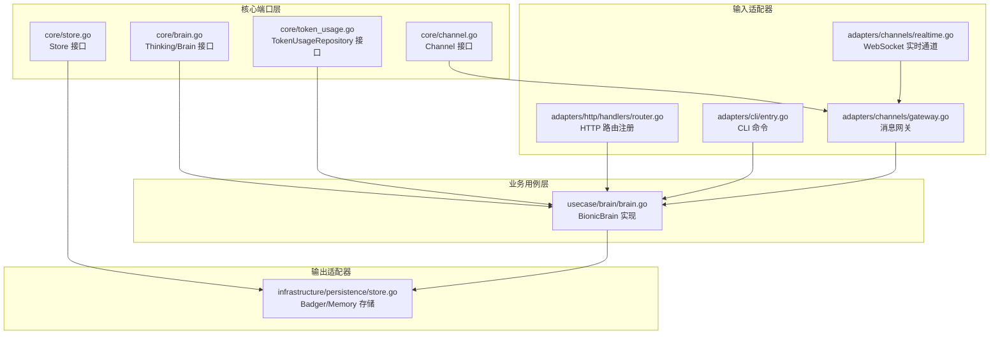
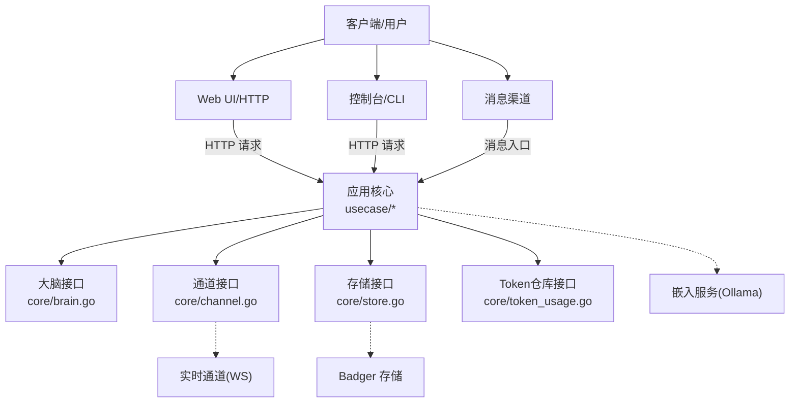
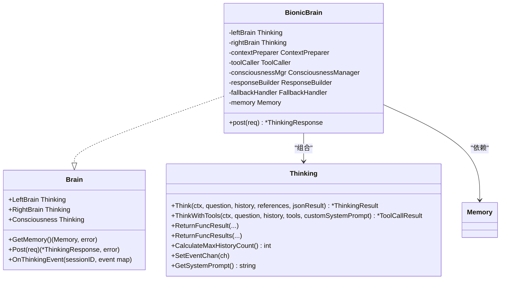
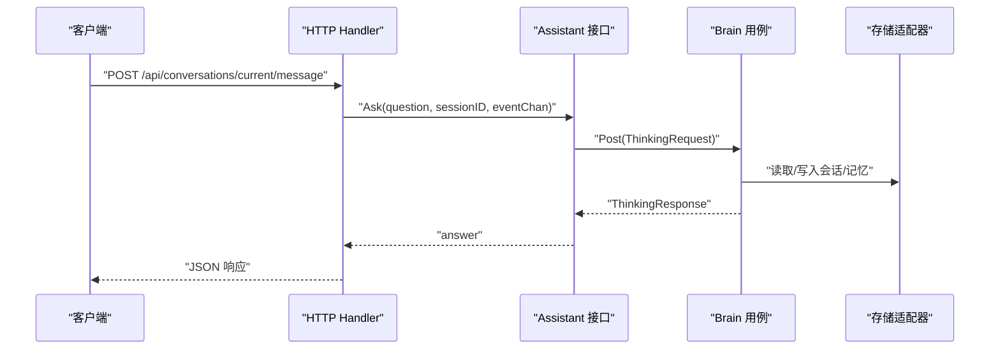
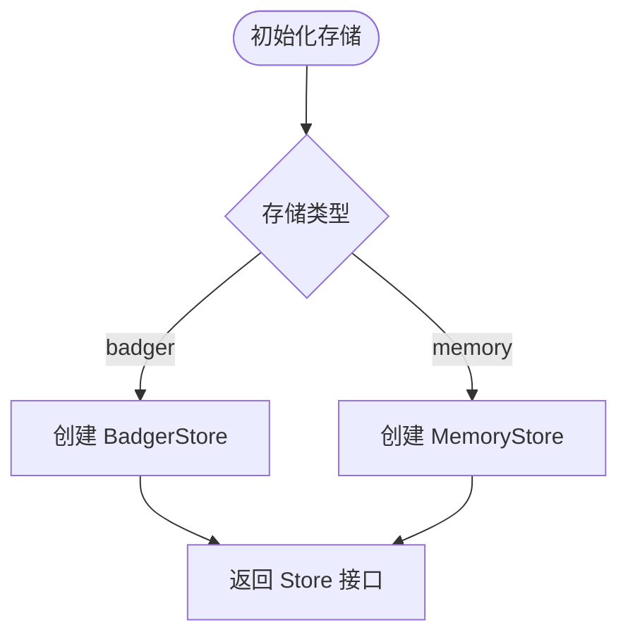
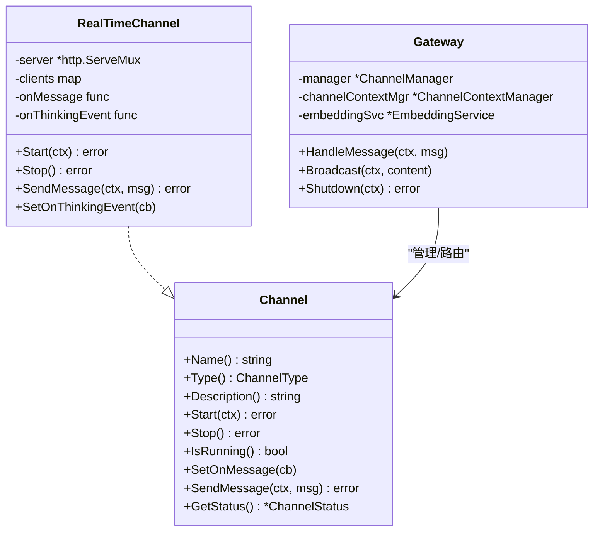
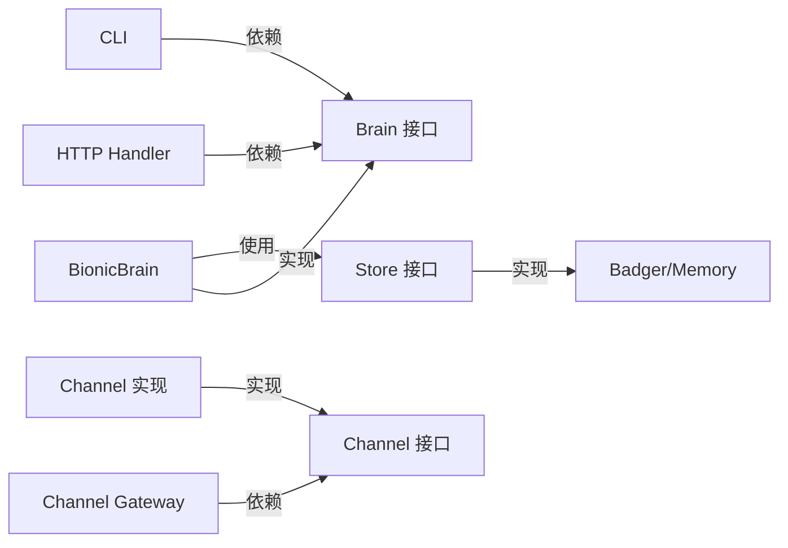

# 六边形架构实现

<cite>
**本文档引用的文件**
- [cmd/main.go](file://cmd/main.go)
- [internal/core/brain.go](file://internal/core/brain.go)
- [internal/entity/session.go](file://internal/entity/session.go)
- [internal/usecase/brain/brain.go](file://internal/usecase/brain/brain.go)
- [internal/adapters/http/handlers/router.go](file://internal/adapters/http/handlers/router.go)
- [internal/adapters/http/handlers/conversations.go](file://internal/adapters/http/handlers/conversations.go)
- [internal/adapters/cli/entry.go](file://internal/adapters/cli/entry.go)
- [internal/adapters/channels/gateway.go](file://internal/adapters/channels/gateway.go)
- [internal/adapters/channels/realtime.go](file://internal/adapters/channels/realtime.go)
- [internal/core/channel.go](file://internal/core/channel.go)
- [internal/infrastructure/persistence/store.go](file://internal/infrastructure/persistence/store.go)
- [internal/core/store.go](file://internal/core/store.go)
- [internal/core/token_usage.go](file://internal/core/token_usage.go)
- [internal/infrastructure/bootstrap/app.go](file://internal/infrastructure/bootstrap/app.go)
- [internal/tests/portcheck_test.go](file://internal/tests/portcheck_test.go)
</cite>

## 目录
1. [简介](#简介)
2. [项目结构](#项目结构)
3. [核心组件](#核心组件)
4. [架构总览](#架构总览)
5. [详细组件分析](#详细组件分析)
6. [依赖分析](#依赖分析)
7. [性能考虑](#性能考虑)
8. [故障排查指南](#故障排查指南)
9. [结论](#结论)
10. [附录](#附录)

## 简介
本文件系统化阐述 MindX 的六边形架构（也称“端口与适配器”）实现，重点说明：
- 核心业务逻辑作为“端口”，通过稳定的接口定义与外部系统解耦
- 外部系统作为“适配器”，以输入/输出两类形式接入系统
- 内部域模型（Entity）通过接口与外部系统解耦，避免泄漏实现细节
- 端口接口的设计原则：稳定、内聚、面向用例
- 端口与适配器的对应关系与交互流程
- 该架构带来的优势：测试友好、易于替换外部依赖、支持多种部署方式
- 适配器开发最佳实践与示例代码路径

## 项目结构
MindX 的代码按“六边形”布局组织：
- 中心：internal/core 定义稳定的端口接口（如 Thinking、Channel、Store、TokenUsageRepository 等）
- 内核：internal/usecase 实现业务用例，依赖端口接口，不直接依赖外部实现
- 适配器：internal/adapters 提供输入/输出适配器
  - 输入适配器：HTTP Handlers、CLI、Channel Gateway/Channels
  - 输出适配器：存储（Badger/Memory）、外部服务（Embedding/Ollama）
- 基础设施：internal/infrastructure 提供基础设施能力（如嵌入、持久化、Cron 等）

图表来源
- [internal/core/brain.go](file://internal/core/brain.go#L70-L140)
- [internal/usecase/brain/brain.go](file://internal/usecase/brain/brain.go#L56-L131)
- [internal/adapters/http/handlers/router.go](file://internal/adapters/http/handlers/router.go#L18-L149)
- [internal/adapters/cli/entry.go](file://internal/adapters/cli/entry.go#L113-L123)
- [internal/adapters/channels/gateway.go](file://internal/adapters/channels/gateway.go#L15-L58)
- [internal/adapters/channels/realtime.go](file://internal/adapters/channels/realtime.go#L18-L78)
- [internal/infrastructure/persistence/store.go](file://internal/infrastructure/persistence/store.go#L25-L43)

章节来源
- [cmd/main.go](file://cmd/main.go#L18-L21)
- [internal/infrastructure/bootstrap/app.go](file://internal/infrastructure/bootstrap/app.go#L66-L200)

## 核心组件
- 端口接口（核心业务逻辑）
  - Thinking/Brain：定义思考与决策的稳定接口，屏蔽底层模型与工具调用细节
  - Channel：统一不同通信渠道的抽象，屏蔽具体协议与平台差异
  - Store：向量存储接口，屏蔽底层存储实现
  - TokenUsageRepository：Token 使用记录的持久化接口
- 领域模型（Entity）
  - Session、Message 等，承载业务数据结构，通过接口与适配器解耦
- 业务用例（Use Cases）
  - BionicBrain：组合左脑、右脑、主意识、记忆、工具调用等，编排思考流程
- 适配器（外部系统）
  - 输入适配器：HTTP Handlers、CLI、Channel Gateway/Channels
  - 输出适配器：Badger/Memory 存储、Ollama 嵌入服务等

章节来源
- [internal/core/brain.go](file://internal/core/brain.go#L70-L140)
- [internal/entity/session.go](file://internal/entity/session.go#L7-L22)
- [internal/usecase/brain/brain.go](file://internal/usecase/brain/brain.go#L56-L131)
- [internal/core/channel.go](file://internal/core/channel.go#L8-L40)
- [internal/core/store.go](file://internal/core/store.go#L5-L15)
- [internal/core/token_usage.go](file://internal/core/token_usage.go#L8-L33)

## 架构总览
六边形架构将“业务用例”置于中心，外部系统通过适配器接入，端口接口保证内聚与稳定。

图表来源
- [internal/adapters/http/handlers/router.go](file://internal/adapters/http/handlers/router.go#L18-L149)
- [internal/adapters/cli/entry.go](file://internal/adapters/cli/entry.go#L40-L91)
- [internal/adapters/channels/gateway.go](file://internal/adapters/channels/gateway.go#L70-L149)
- [internal/adapters/channels/realtime.go](file://internal/adapters/channels/realtime.go#L165-L200)
- [internal/infrastructure/persistence/store.go](file://internal/infrastructure/persistence/store.go#L25-L43)
- [internal/core/brain.go](file://internal/core/brain.go#L70-L140)
- [internal/core/channel.go](file://internal/core/channel.go#L8-L40)
- [internal/core/store.go](file://internal/core/store.go#L5-L15)
- [internal/core/token_usage.go](file://internal/core/token_usage.go#L8-L33)

## 详细组件分析

### 端口与用例：Brain 与 Use Cases
- Brain 接口定义思考与决策的稳定契约，包括思考、工具调用、事件通道、系统提示等
- BionicBrain 实现 Brain 接口，编排左脑、右脑、主意识、记忆、工具调用与响应构建
- 通过依赖注入装配 Thinking、Memory、SkillMgr、TokenUsageRepository 等端口

图表来源
- [internal/core/brain.go](file://internal/core/brain.go#L70-L140)
- [internal/usecase/brain/brain.go](file://internal/usecase/brain/brain.go#L36-L131)

章节来源
- [internal/core/brain.go](file://internal/core/brain.go#L70-L140)
- [internal/usecase/brain/brain.go](file://internal/usecase/brain/brain.go#L56-L131)

### 输入适配器：HTTP Handlers、CLI、Channel Gateway
- HTTP Handlers
  - 路由注册集中于 RegisterRoutes，将 HTTP 请求映射到会话、技能、能力、配置、监控等用例
  - ConversationsHandler 将消息发送请求委派给 Assistant 接口，实现与核心的解耦
- CLI
  - 通过 HTTP 客户端向本地 HTTP 服务发送消息，便于命令行调试与自动化
- Channel Gateway
  - 负责消息路由、转发、频道切换、广播、优雅关闭等，屏蔽具体渠道差异

图表来源
- [internal/adapters/http/handlers/router.go](file://internal/adapters/http/handlers/router.go#L18-L149)
- [internal/adapters/http/handlers/conversations.go](file://internal/adapters/http/handlers/conversations.go#L54-L79)
- [internal/adapters/http/handlers/conversations.go](file://internal/adapters/http/handlers/conversations.go#L47-L52)
- [internal/core/brain.go](file://internal/core/brain.go#L116-L140)
- [internal/infrastructure/persistence/store.go](file://internal/infrastructure/persistence/store.go#L25-L43)

章节来源
- [internal/adapters/http/handlers/router.go](file://internal/adapters/http/handlers/router.go#L18-L149)
- [internal/adapters/http/handlers/conversations.go](file://internal/adapters/http/handlers/conversations.go#L54-L79)
- [internal/adapters/cli/entry.go](file://internal/adapters/cli/entry.go#L40-L91)
- [internal/adapters/channels/gateway.go](file://internal/adapters/channels/gateway.go#L70-L149)

### 输出适配器：存储与外部服务
- 存储适配器
  - NewStore 根据配置选择 Badger 或 Memory 实现，提供 Put/Get/Search/BatchPut/Scan/Close 等操作
- Token 使用记录
  - TokenUsageRepository 接口提供按 ID/模型/时间范围查询与汇总统计，便于监控与计费

图表来源
- [internal/infrastructure/persistence/store.go](file://internal/infrastructure/persistence/store.go#L25-L43)
- [internal/core/store.go](file://internal/core/store.go#L5-L15)
- [internal/core/token_usage.go](file://internal/core/token_usage.go#L8-L33)

章节来源
- [internal/infrastructure/persistence/store.go](file://internal/infrastructure/persistence/store.go#L25-L43)
- [internal/core/store.go](file://internal/core/store.go#L5-L15)
- [internal/core/token_usage.go](file://internal/core/token_usage.go#L8-L33)

### 通道适配器：Channel 接口与实时通道
- Channel 接口统一不同渠道（Web、Terminal、Feishu 等），屏蔽协议差异
- RealTimeChannel 基于 WebSocket，提供事件推送、连接管理、心跳与限流等能力
- Gateway 负责消息路由、转发、频道切换、广播与优雅关闭

图表来源
- [internal/core/channel.go](file://internal/core/channel.go#L8-L40)
- [internal/adapters/channels/realtime.go](file://internal/adapters/channels/realtime.go#L18-L78)
- [internal/adapters/channels/gateway.go](file://internal/adapters/channels/gateway.go#L15-L58)

章节来源
- [internal/core/channel.go](file://internal/core/channel.go#L8-L40)
- [internal/adapters/channels/realtime.go](file://internal/adapters/channels/realtime.go#L18-L78)
- [internal/adapters/channels/gateway.go](file://internal/adapters/channels/gateway.go#L15-L58)

## 依赖分析
- 稳定依赖方向：适配器依赖端口接口，业务用例依赖端口接口，端口接口不依赖适配器
- 解耦效果：通过接口隔离，可在不修改用例的情况下替换存储、渠道、外部服务等实现
- 可替换性：例如存储可从 Badger 切换到 SQLite；渠道可新增 Discord/Slack 等

图表来源
- [internal/adapters/http/handlers/router.go](file://internal/adapters/http/handlers/router.go#L18-L149)
- [internal/adapters/cli/entry.go](file://internal/adapters/cli/entry.go#L113-L123)
- [internal/adapters/channels/gateway.go](file://internal/adapters/channels/gateway.go#L15-L58)
- [internal/usecase/brain/brain.go](file://internal/usecase/brain/brain.go#L56-L131)
- [internal/core/brain.go](file://internal/core/brain.go#L70-L140)
- [internal/core/channel.go](file://internal/core/channel.go#L8-L40)
- [internal/core/store.go](file://internal/core/store.go#L5-L15)
- [internal/infrastructure/persistence/store.go](file://internal/infrastructure/persistence/store.go#L25-L43)

章节来源
- [internal/infrastructure/bootstrap/app.go](file://internal/infrastructure/bootstrap/app.go#L66-L200)
- [internal/tests/portcheck_test.go](file://internal/tests/portcheck_test.go#L60-L64)

## 性能考虑
- 思考事件流：通过事件通道实时推送思考进度，降低等待延迟
- 向量相似度匹配：预计算通道向量，减少实时计算开销
- 存储批处理：BatchPut 提升向量写入效率
- 连接与并发：RealTimeChannel 限制最大连接数，避免资源耗尽
- 优雅关闭：Gateway 在关闭前等待活动消息完成，确保一致性

[本节为通用指导，无需列出章节来源]

## 故障排查指南
- 端口占用测试
  - 通过 portcheck 技能与集成测试验证端口可用性
  - 测试流程：启动应用 → 检查端口 → 关闭应用
- 日志与可观测性
  - 系统日志与会话日志分离，便于定位问题
  - 通过监控接口查看日志与清理
- 通道与消息
  - 检查 Channel 是否运行、消息是否正确路由与转发
  - 关注思考事件回调是否正常触发

章节来源
- [internal/tests/portcheck_test.go](file://internal/tests/portcheck_test.go#L32-L64)

## 结论
MindX 的六边形架构通过稳定端口与清晰适配器边界，实现了：
- 测试友好：用例与接口解耦，便于单元测试与模拟
- 易于替换：存储、渠道、外部服务可独立替换
- 多部署支持：HTTP/CLI/Channel 三种入口，满足不同场景
建议在新增适配器时遵循“稳定端口、最小暴露、职责单一”的原则，持续保持架构内聚与可演进性。

[本节为总结，无需列出章节来源]

## 附录

### 端口与适配器对应关系表
- 入站端口
  - HTTP Handlers：REST API 入口
  - CLI Commands：命令行入口
  - Channel Handlers：消息接收与路由
- 出站端口
  - Badger/Memory Store：向量与会话持久化
  - Ollama Embedding Service：文本向量化
  - TokenUsageRepository：Token 使用记录

章节来源
- [internal/adapters/http/handlers/router.go](file://internal/adapters/http/handlers/router.go#L18-L149)
- [internal/adapters/cli/entry.go](file://internal/adapters/cli/entry.go#L40-L91)
- [internal/adapters/channels/gateway.go](file://internal/adapters/channels/gateway.go#L70-L149)
- [internal/infrastructure/persistence/store.go](file://internal/infrastructure/persistence/store.go#L25-L43)
- [internal/core/store.go](file://internal/core/store.go#L5-L15)
- [internal/core/token_usage.go](file://internal/core/token_usage.go#L8-L33)

### 端口接口设计原则
- 稳定：接口定义不随外部实现变化而频繁调整
- 内聚：每个端口聚焦单一职责（如存储、通道、Token 记录）
- 面向用例：接口围绕业务用例的输入输出设计，避免泄漏实现细节

[本节为原则说明，无需列出章节来源]

### 适配器开发最佳实践
- 严格实现端口接口，避免在适配器中引入业务逻辑
- 对外暴露最小必要字段，隐藏内部实现细节
- 异常处理与日志记录规范化，便于问题定位
- 支持优雅关闭与资源回收，保障稳定性
- 示例代码路径参考：
  - HTTP 路由注册：[internal/adapters/http/handlers/router.go](file://internal/adapters/http/handlers/router.go#L18-L149)
  - CLI 消息发送：[internal/adapters/cli/entry.go](file://internal/adapters/cli/entry.go#L65-L91)
  - Channel 网关处理：[internal/adapters/channels/gateway.go](file://internal/adapters/channels/gateway.go#L70-L149)
  - RealTimeChannel 事件推送：[internal/adapters/channels/realtime.go](file://internal/adapters/channels/realtime.go#L165-L200)
  - 存储适配器创建：[internal/infrastructure/persistence/store.go](file://internal/infrastructure/persistence/store.go#L25-L43)