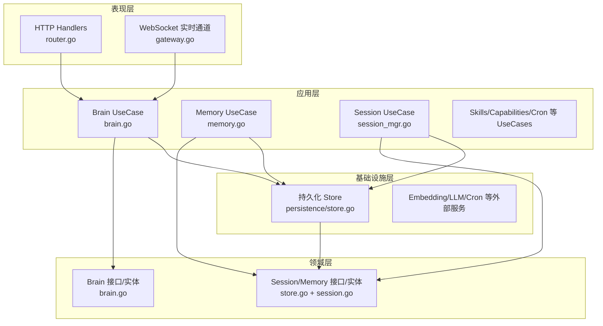
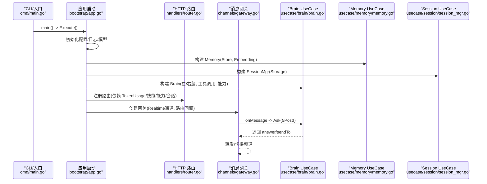
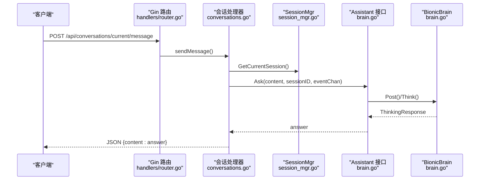
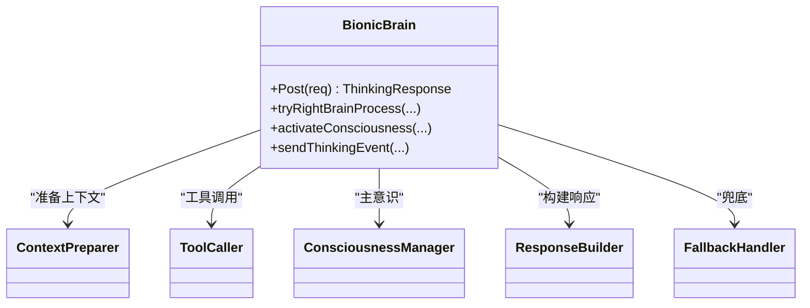
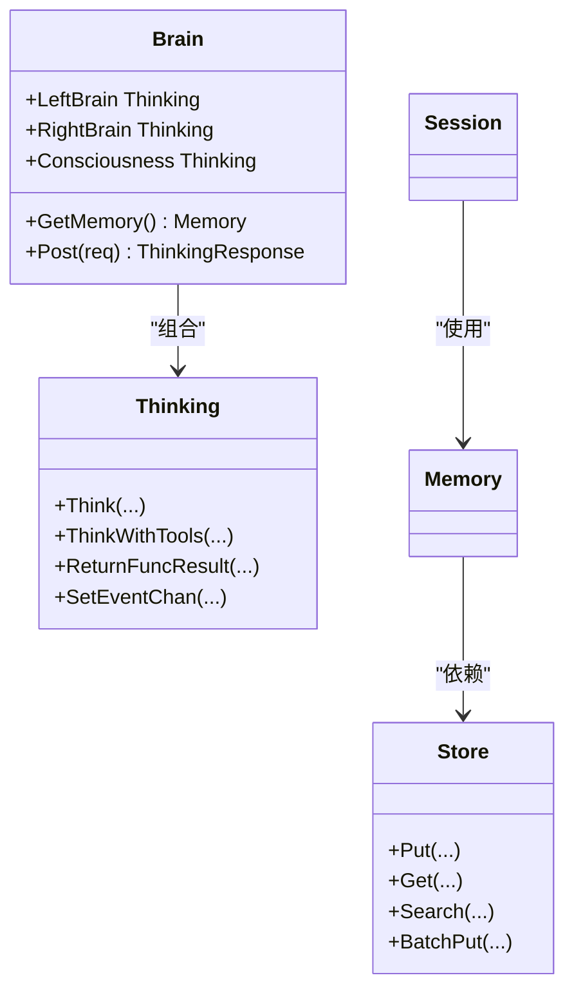
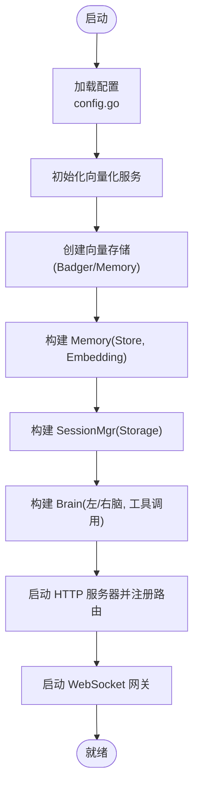
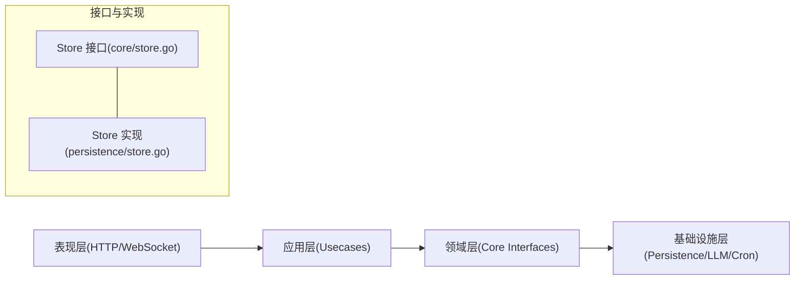

# 分层架构设计

<cite>
**本文档引用的文件**
- [cmd/main.go](file://cmd/main.go)
- [internal/infrastructure/bootstrap/app.go](file://internal/infrastructure/bootstrap/app.go)
- [internal/core/brain.go](file://internal/core/brain.go)
- [internal/usecase/brain/brain.go](file://internal/usecase/brain/brain.go)
- [internal/adapters/http/handlers/router.go](file://internal/adapters/http/handlers/router.go)
- [internal/adapters/http/handlers/conversations.go](file://internal/adapters/http/handlers/conversations.go)
- [internal/adapters/channels/gateway.go](file://internal/adapters/channels/gateway.go)
- [internal/infrastructure/persistence/store.go](file://internal/infrastructure/persistence/store.go)
- [internal/usecase/memory/memory.go](file://internal/usecase/memory/memory.go)
- [internal/entity/session.go](file://internal/entity/session.go)
- [internal/config/config.go](file://internal/config/config.go)
- [internal/usecase/session/session_mgr.go](file://internal/usecase/session/session_mgr.go)
- [internal/core/store.go](file://internal/core/store.go)
</cite>

## 目录
1. [简介](#简介)
2. [项目结构](#项目结构)
3. [核心组件](#核心组件)
4. [架构总览](#架构总览)
5. [详细组件分析](#详细组件分析)
6. [依赖关系分析](#依赖关系分析)
7. [性能考量](#性能考量)
8. [故障排查指南](#故障排查指南)
9. [结论](#结论)
10. [附录](#附录)

## 简介
本文件面向 MindX 项目的分层架构设计，基于 Clean Architecture 的四层模式（表现层、应用层、领域层、基础设施层）进行系统化梳理。文档明确各层职责与边界、层间数据与控制流方向、依赖方向（上层依赖下层接口、下层不依赖上层）、接口定义与实现关系，并提供层间交互示例与扩展指导，帮助开发者快速理解与维护系统。

## 项目结构
MindX 采用 Go 模块化组织方式，按“层”划分目录：
- 表现层：HTTP Handlers、WebSocket（实时通道）
- 应用层：Use Cases（思维、记忆、会话、技能、能力、定时等）
- 领域层：Core（Brain、Session、Memory、工具与思考模型等接口与实体）
- 基础设施层：持久化、外部服务（Embedding、LLM、Cron、日志、环境变量）

图表来源
- [internal/adapters/http/handlers/router.go](file://internal/adapters/http/handlers/router.go#L18-L150)
- [internal/adapters/channels/gateway.go](file://internal/adapters/channels/gateway.go#L15-L58)
- [internal/usecase/brain/brain.go](file://internal/usecase/brain/brain.go#L22-L131)
- [internal/usecase/memory/memory.go](file://internal/usecase/memory/memory.go#L18-L60)
- [internal/usecase/session/session_mgr.go](file://internal/usecase/session/session_mgr.go#L16-L128)
- [internal/core/brain.go](file://internal/core/brain.go#L116-L205)
- [internal/core/store.go](file://internal/core/store.go#L5-L15)
- [internal/infrastructure/persistence/store.go](file://internal/infrastructure/persistence/store.go#L25-L43)

章节来源
- [cmd/main.go](file://cmd/main.go#L18-L21)
- [internal/infrastructure/bootstrap/app.go](file://internal/infrastructure/bootstrap/app.go#L66-L434)

## 核心组件
- 表现层组件
  - HTTP 路由注册：集中注册所有 API 路由，绑定控制器与 usecase
  - WebSocket 网关：统一消息路由、转发、频道切换与事件同步
- 应用层组件
  - Brain UseCase：左脑/右脑/主意识协同，工具调用与能力选择
  - Memory UseCase：记忆点生成、向量化、去重与存储
  - Session UseCase：会话生命周期管理、消息持久化与令牌预算
- 领域层组件
  - Brain 接口与实体：Thinking、ToolSchema、ThinkingResult 等
  - Store 接口：向量存储抽象，屏蔽具体实现
  - Session/Memory 实体：会话与记忆点数据结构
- 基础设施层组件
  - Store 实现：Badger/Memory 向量存储
  - Embedding/LLM：Ollama 提供器与服务
  - Cron：跨平台任务调度

章节来源
- [internal/adapters/http/handlers/router.go](file://internal/adapters/http/handlers/router.go#L18-L150)
- [internal/adapters/channels/gateway.go](file://internal/adapters/channels/gateway.go#L15-L58)
- [internal/usecase/brain/brain.go](file://internal/usecase/brain/brain.go#L22-L131)
- [internal/usecase/memory/memory.go](file://internal/usecase/memory/memory.go#L18-L60)
- [internal/usecase/session/session_mgr.go](file://internal/usecase/session/session_mgr.go#L16-L128)
- [internal/core/brain.go](file://internal/core/brain.go#L116-L205)
- [internal/core/store.go](file://internal/core/store.go#L5-L15)
- [internal/infrastructure/persistence/store.go](file://internal/infrastructure/persistence/store.go#L25-L43)

## 架构总览
MindX 的启动流程体现了典型的四层依赖方向：应用层依赖领域层接口；表现层与基础设施层分别通过接口注入到应用层；应用层组合 usecase 并驱动领域模型完成业务闭环。

图表来源
- [cmd/main.go](file://cmd/main.go#L18-L21)
- [internal/infrastructure/bootstrap/app.go](file://internal/infrastructure/bootstrap/app.go#L66-L434)
- [internal/adapters/http/handlers/router.go](file://internal/adapters/http/handlers/router.go#L18-L150)
- [internal/adapters/channels/gateway.go](file://internal/adapters/channels/gateway.go#L70-L272)
- [internal/usecase/brain/brain.go](file://internal/usecase/brain/brain.go#L133-L237)
- [internal/usecase/memory/memory.go](file://internal/usecase/memory/memory.go#L28-L60)
- [internal/usecase/session/session_mgr.go](file://internal/usecase/session/session_mgr.go#L109-L128)

## 详细组件分析

### 表现层（HTTP Handlers、WebSocket）
- HTTP 路由注册：集中定义 /api 下的健康检查、服务控制、会话管理、渠道管理、技能/能力/定时、设置、监控、Token 使用统计、MCP 等接口，并注入 usecase 与领域接口（如 TokenUsageRepository、SkillMgr、CapabilityManager、SessionMgr、CronScheduler、Assistant）
- WebSocket 网关：负责消息路由、频道切换、转发、与 RealTimeChannel 同步，通过 SetOnMessage 注入应用层回调，实现“上层依赖下层接口”的解耦

图表来源
- [internal/adapters/http/handlers/router.go](file://internal/adapters/http/handlers/router.go#L18-L150)
- [internal/adapters/http/handlers/conversations.go](file://internal/adapters/http/handlers/conversations.go#L54-L79)
- [internal/usecase/session/session_mgr.go](file://internal/usecase/session/session_mgr.go#L164-L200)
- [internal/core/brain.go](file://internal/core/brain.go#L189-L205)
- [internal/usecase/brain/brain.go](file://internal/usecase/brain/brain.go#L133-L237)

章节来源
- [internal/adapters/http/handlers/router.go](file://internal/adapters/http/handlers/router.go#L18-L150)
- [internal/adapters/http/handlers/conversations.go](file://internal/adapters/http/handlers/conversations.go#L54-L79)
- [internal/adapters/channels/gateway.go](file://internal/adapters/channels/gateway.go#L70-L272)

### 应用层（Use Cases）
- Brain UseCase：封装左脑/右脑/主意识，负责意图识别、工具匹配与调用、能力选择、定时任务、思考事件流推送
- Memory UseCase：负责记忆点生成、向量化、语义去重、存储与清理
- Session UseCase：负责会话创建/切换/删除、消息持久化、令牌预算与会话结束回调

图表来源
- [internal/usecase/brain/brain.go](file://internal/usecase/brain/brain.go#L36-L131)
- [internal/usecase/brain/brain.go](file://internal/usecase/brain/brain.go#L239-L532)

章节来源
- [internal/usecase/brain/brain.go](file://internal/usecase/brain/brain.go#L22-L131)
- [internal/usecase/memory/memory.go](file://internal/usecase/memory/memory.go#L18-L60)
- [internal/usecase/session/session_mgr.go](file://internal/usecase/session/session_mgr.go#L16-L128)

### 领域层（Core Business Logic）
- Brain 接口与实体：Thinking、ToolSchema、ThinkingResult、ThinkingEvent、Persona、Assistant 等
- Store 接口：向量存储抽象，屏蔽 Badger/Memory 实现差异
- Session/Memory 实体：会话与记忆点数据结构

图表来源
- [internal/core/brain.go](file://internal/core/brain.go#L116-L205)
- [internal/core/store.go](file://internal/core/store.go#L5-L15)
- [internal/entity/session.go](file://internal/entity/session.go#L14-L22)

章节来源
- [internal/core/brain.go](file://internal/core/brain.go#L116-L205)
- [internal/core/store.go](file://internal/core/store.go#L5-L15)
- [internal/entity/session.go](file://internal/entity/session.go#L14-L22)

### 基础设施层（Persistence、External Services）
- Store 实现：BadgerStore/MemoryStore，支持向量写入、查询、扫描与批处理
- Embedding/LLM：Ollama 提供器与服务，用于向量化与模型推理
- Cron：跨平台任务调度器
- 日志与配置：系统日志、环境变量加载、配置文件读取与保存

图表来源
- [internal/config/config.go](file://internal/config/config.go#L13-L37)
- [internal/infrastructure/persistence/store.go](file://internal/infrastructure/persistence/store.go#L25-L43)
- [internal/usecase/memory/memory.go](file://internal/usecase/memory/memory.go#L28-L60)
- [internal/usecase/session/session_mgr.go](file://internal/usecase/session/session_mgr.go#L109-L128)
- [internal/usecase/brain/brain.go](file://internal/usecase/brain/brain.go#L56-L131)
- [internal/adapters/http/handlers/router.go](file://internal/adapters/http/handlers/router.go#L18-L150)
- [internal/adapters/channels/gateway.go](file://internal/adapters/channels/gateway.go#L33-L58)

章节来源
- [internal/infrastructure/persistence/store.go](file://internal/infrastructure/persistence/store.go#L25-L43)
- [internal/config/config.go](file://internal/config/config.go#L13-L37)

## 依赖关系分析
- 依赖方向：上层仅依赖下层接口（应用层依赖领域接口；表现层依赖应用层接口；基础设施层实现领域/应用层接口）
- 解耦策略：通过接口抽象（Store、Thinking、SessionMgr、TokenUsageRepository 等）隔离具体实现
- 循环依赖规避：领域层不依赖应用层；应用层不依赖基础设施层；表现层不依赖基础设施层

图表来源
- [internal/core/store.go](file://internal/core/store.go#L5-L15)
- [internal/infrastructure/persistence/store.go](file://internal/infrastructure/persistence/store.go#L25-L43)

章节来源
- [internal/core/store.go](file://internal/core/store.go#L5-L15)
- [internal/infrastructure/persistence/store.go](file://internal/infrastructure/persistence/store.go#L25-L43)

## 性能考量
- 向量检索与相似度计算：通过 EmbeddingService 生成向量，结合 VectorService 的相似度计算，注意阈值与 TopN 参数调优
- 会话令牌预算：SessionMgr 基于 MaxTokens 控制上下文长度，避免模型输入溢出
- 工具调用批处理：右脑工具调用支持批量工具匹配与调用，减少往返次数
- 存储批处理：Store.BatchPut 支持批量写入，降低 I/O 成本
- 事件流推送：ThinkingEvent 流式事件通过 RealTimeChannel 实时反馈，注意缓冲区大小与背压处理

## 故障排查指南
- HTTP 路由异常：检查路由注册顺序与控制器依赖注入是否正确
- WebSocket 转发失败：确认目标频道存在、RealTimeChannel 正常运行、EmbeddingService 向量化可用
- 记忆存储失败：检查向量维度与存储实现一致性，查看去重与清理逻辑
- 会话持久化失败：核对文件存储路径权限与磁盘空间
- 配置加载失败：确认配置文件存在且格式正确，必要时使用模板复制

章节来源
- [internal/adapters/channels/gateway.go](file://internal/adapters/channels/gateway.go#L353-L363)
- [internal/usecase/memory/memory.go](file://internal/usecase/memory/memory.go#L90-L107)
- [internal/usecase/session/session_mgr.go](file://internal/usecase/session/session_mgr.go#L189-L200)
- [internal/config/config.go](file://internal/config/config.go#L274-L293)

## 结论
MindX 的分层架构通过清晰的职责划分与接口抽象，实现了关注点分离、可测试性与可替换性。表现层专注于用户交互，应用层聚焦业务编排，领域层沉淀核心模型，基础设施层提供可插拔实现。建议持续优化接口边界与依赖方向，逐步将基础设施中的接口迁移至领域层，进一步提升架构稳定性与演进弹性。

## 附录
- 层间交互示例路径
  - HTTP 请求到 Brain 思考：[internal/adapters/http/handlers/conversations.go](file://internal/adapters/http/handlers/conversations.go#L54-L79) → [internal/usecase/brain/brain.go](file://internal/usecase/brain/brain.go#L133-L237)
  - WebSocket 消息路由与转发：[internal/adapters/channels/gateway.go](file://internal/adapters/channels/gateway.go#L70-L272)
  - 记忆点生成与存储：[internal/usecase/memory/memory.go](file://internal/usecase/memory/memory.go#L62-L107) → [internal/infrastructure/persistence/store.go](file://internal/infrastructure/persistence/store.go#L25-L43)
  - 会话生命周期管理：[internal/usecase/session/session_mgr.go](file://internal/usecase/session/session_mgr.go#L164-L200)