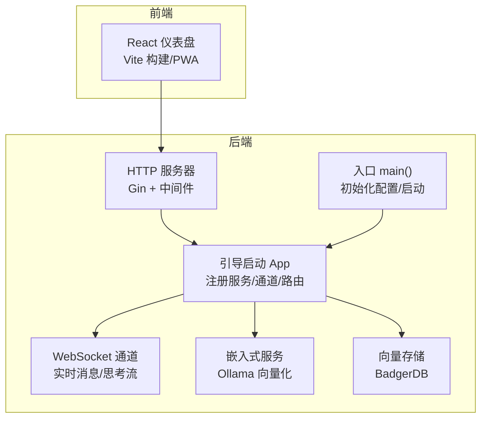
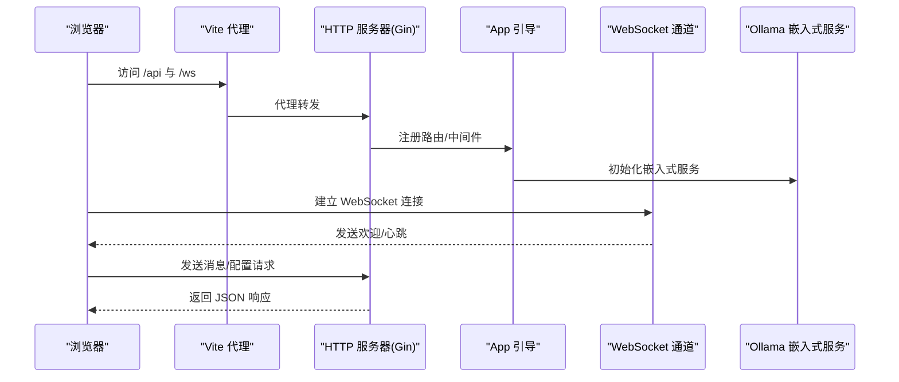
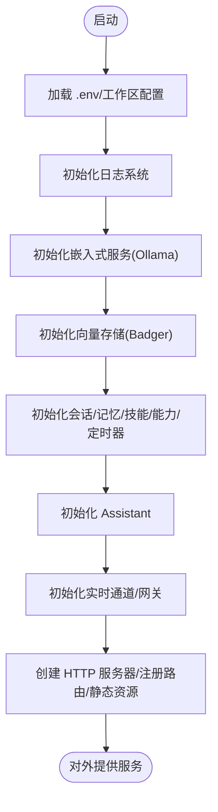
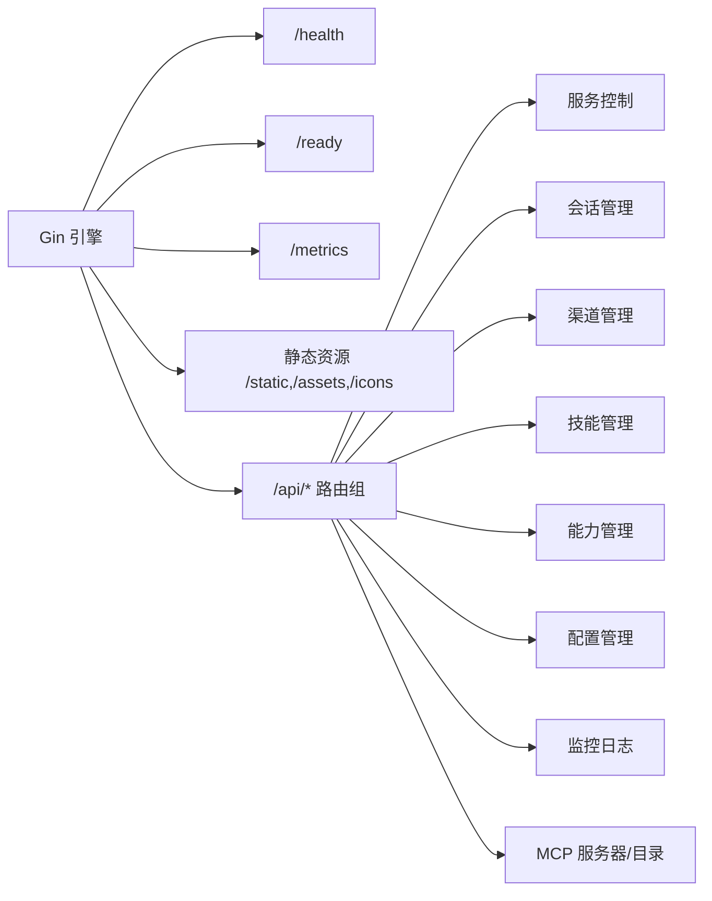
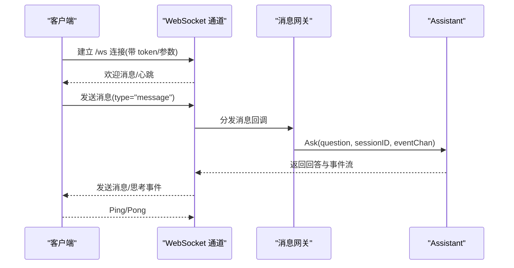
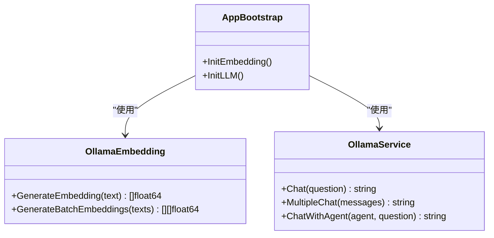
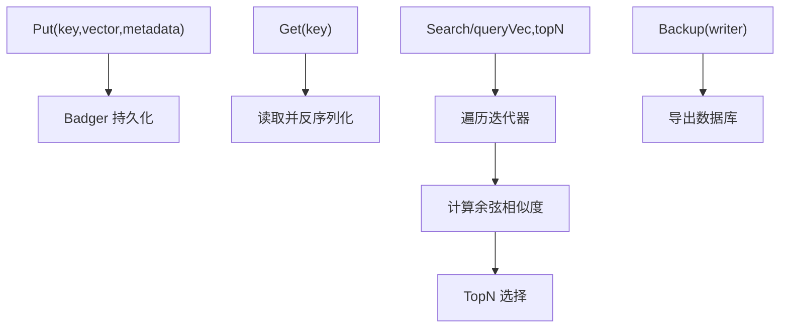
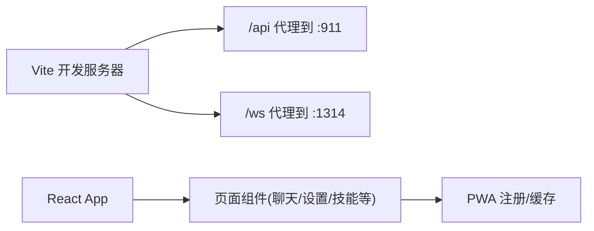
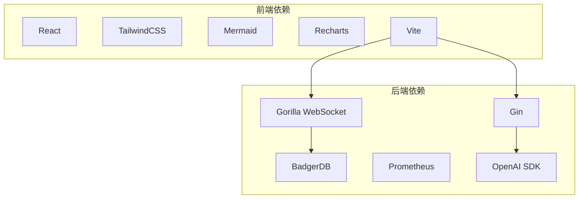

# 技术栈选择

<cite>
**本文引用的文件**
- [cmd/main.go](file://cmd/main.go)
- [go.mod](file://go.mod)
- [internal/infrastructure/bootstrap/app.go](file://internal/infrastructure/bootstrap/app.go)
- [internal/infrastructure/bootstrap/server.go](file://internal/infrastructure/bootstrap/server.go)
- [internal/adapters/http/handlers/router.go](file://internal/adapters/http/handlers/router.go)
- [internal/adapters/channels/realtime.go](file://internal/adapters/channels/realtime.go)
- [internal/infrastructure/embedding/ollama.go](file://internal/infrastructure/embedding/ollama.go)
- [internal/infrastructure/llama/ollama.go](file://internal/infrastructure/llama/ollama.go)
- [internal/infrastructure/persistence/badger_store.go](file://internal/infrastructure/persistence/badger_store.go)
- [dashboard/package.json](file://dashboard/package.json)
- [dashboard/src/App.tsx](file://dashboard/src/App.tsx)
- [dashboard/vite.config.ts](file://dashboard/vite.config.ts)
- [config/server.yml](file://config/server.yml)
- [internal/adapters/http/handlers/service.go](file://internal/adapters/http/handlers/service.go)
- [README.md](file://README.md)
</cite>

## 目录
1. [引言](#引言)
2. [项目结构](#项目结构)
3. [核心组件](#核心组件)
4. [架构总览](#架构总览)
5. [详细组件分析](#详细组件分析)
6. [依赖关系分析](#依赖关系分析)
7. [性能考量](#性能考量)
8. [故障排查指南](#故障排查指南)
9. [结论](#结论)
10. [附录](#附录)

## 引言
本技术栈选择文档围绕 MindX 的后端（Go）、前端（React）、嵌入式存储（BadgerDB）、本地 AI 推理（Ollama）、实时通信（WebSocket）进行系统化说明。文档旨在解释各技术选型的原因、权衡与适用场景，对比替代方案的优缺点，并说明该技术组合如何支撑高并发、低延迟、可扩展与易维护性等核心需求。同时给出技术演进背景、发展趋势与决策框架，为未来升级与运维提供参考。

## 项目结构
MindX 采用前后端分离与模块化分层架构：
- 后端以 Go 为核心，采用分层与领域驱动设计，模块清晰、职责分离。
- 前端基于 React，使用 Vite 构建，提供 Web 仪表盘与 PWA 能力。
- 实时通信通过 WebSocket 实现，结合 HTTP API 与静态资源服务。
- 存储采用嵌入式 KV 数据库 Badger，向量检索与内存缓存配合，满足本地推理与低延迟需求。
- 本地 AI 推理由 Ollama 提供，支持向量化与对话推理。

图表来源
- [cmd/main.go](file://cmd/main.go#L1-L21)
- [internal/infrastructure/bootstrap/app.go](file://internal/infrastructure/bootstrap/app.go#L66-L434)
- [internal/infrastructure/bootstrap/server.go](file://internal/infrastructure/bootstrap/server.go#L18-L88)
- [internal/adapters/channels/realtime.go](file://internal/adapters/channels/realtime.go#L18-L126)
- [internal/infrastructure/embedding/ollama.go](file://internal/infrastructure/embedding/ollama.go#L24-L55)
- [internal/infrastructure/persistence/badger_store.go](file://internal/infrastructure/persistence/badger_store.go#L16-L45)

章节来源
- [cmd/main.go](file://cmd/main.go#L1-L21)
- [internal/infrastructure/bootstrap/app.go](file://internal/infrastructure/bootstrap/app.go#L66-L434)
- [internal/infrastructure/bootstrap/server.go](file://internal/infrastructure/bootstrap/server.go#L18-L88)
- [internal/adapters/channels/realtime.go](file://internal/adapters/channels/realtime.go#L18-L126)
- [internal/infrastructure/embedding/ollama.go](file://internal/infrastructure/embedding/ollama.go#L24-L55)
- [internal/infrastructure/persistence/badger_store.go](file://internal/infrastructure/persistence/badger_store.go#L16-L45)

## 核心组件
- Go 后端：负责业务编排、HTTP API、实时通道、向量存储与 Ollama 集成；采用中间件、指标与优雅关闭。
- React 前端：提供仪表盘界面、路由与主题样式，支持 PWA 与代理后端 API/WebSocket。
- BadgerDB：嵌入式 KV 存储，支持向量条目与元数据持久化，内置 GC 与批量写入。
- Ollama：本地模型推理与向量化服务，支持聊天与 embeddings API。
- WebSocket：实时双向通信，承载思考流与消息推送，具备心跳与连接限制。

章节来源
- [go.mod](file://go.mod#L5-L29)
- [dashboard/package.json](file://dashboard/package.json#L1-L58)
- [internal/infrastructure/persistence/badger_store.go](file://internal/infrastructure/persistence/badger_store.go#L16-L45)
- [internal/infrastructure/embedding/ollama.go](file://internal/infrastructure/embedding/ollama.go#L24-L55)
- [internal/adapters/channels/realtime.go](file://internal/adapters/channels/realtime.go#L18-L126)

## 架构总览
后端通过引导流程装配各子系统：HTTP 服务器、实时通道、向量存储与嵌入式服务，再注册路由与静态资源。前端通过 Vite 代理访问后端 API 与 WebSocket，实现低延迟交互与 PWA 能力。

图表来源
- [internal/infrastructure/bootstrap/server.go](file://internal/infrastructure/bootstrap/server.go#L56-L88)
- [internal/infrastructure/bootstrap/app.go](file://internal/infrastructure/bootstrap/app.go#L382-L434)
- [internal/adapters/channels/realtime.go](file://internal/adapters/channels/realtime.go#L342-L424)
- [internal/infrastructure/embedding/ollama.go](file://internal/infrastructure/embedding/ollama.go#L24-L55)

章节来源
- [internal/infrastructure/bootstrap/server.go](file://internal/infrastructure/bootstrap/server.go#L56-L88)
- [internal/infrastructure/bootstrap/app.go](file://internal/infrastructure/bootstrap/app.go#L382-L434)
- [internal/adapters/channels/realtime.go](file://internal/adapters/channels/realtime.go#L342-L424)
- [internal/infrastructure/embedding/ollama.go](file://internal/infrastructure/embedding/ollama.go#L24-L55)

## 详细组件分析

### Go 后端与引导流程
- 入口初始化构建信息，随后进入 CLI 执行流程。
- 引导阶段加载环境变量、工作区与配置，初始化日志、嵌入式服务、向量存储、会话/记忆/技能/能力管理器、定时任务调度器与 HTTP 服务器。
- 注册路由与静态资源，启动实时通道并通过网关分发消息，设置思考事件回调。

图表来源
- [cmd/main.go](file://cmd/main.go#L14-L20)
- [internal/infrastructure/bootstrap/app.go](file://internal/infrastructure/bootstrap/app.go#L66-L434)

章节来源
- [cmd/main.go](file://cmd/main.go#L14-L20)
- [internal/infrastructure/bootstrap/app.go](file://internal/infrastructure/bootstrap/app.go#L66-L434)

### HTTP API 与静态资源
- Gin 引擎启用 Recovery、Logger、请求 ID 与指标中间件。
- 提供健康检查、就绪检查与 Prometheus 指标端点。
- 静态文件服务与 SPA 回退策略，避免与 /api 与 /ws 冲突。
- 路由注册集中在统一入口，涵盖服务控制、会话、渠道、技能、能力、配置、监控、MCP 等。

图表来源
- [internal/infrastructure/bootstrap/server.go](file://internal/infrastructure/bootstrap/server.go#L56-L88)
- [internal/adapters/http/handlers/router.go](file://internal/adapters/http/handlers/router.go#L18-L149)

章节来源
- [internal/infrastructure/bootstrap/server.go](file://internal/infrastructure/bootstrap/server.go#L56-L88)
- [internal/adapters/http/handlers/router.go](file://internal/adapters/http/handlers/router.go#L18-L149)

### 实时通信（WebSocket）
- 基于 Gorilla WebSocket，支持跨域与令牌认证、最大连接数限制。
- 心跳与 Pong 处理，维持长连接活性；按会话 ID 转发消息与思考事件。
- 提供连接状态查询、活跃连接数统计与健康检查。

图表来源
- [internal/adapters/channels/realtime.go](file://internal/adapters/channels/realtime.go#L342-L424)
- [internal/adapters/channels/realtime.go](file://internal/adapters/channels/realtime.go#L439-L559)

章节来源
- [internal/adapters/channels/realtime.go](file://internal/adapters/channels/realtime.go#L18-L126)
- [internal/adapters/channels/realtime.go](file://internal/adapters/channels/realtime.go#L342-L424)
- [internal/adapters/channels/realtime.go](file://internal/adapters/channels/realtime.go#L439-L559)

### 嵌入式服务与本地 AI 推理（Ollama）
- 向量化服务封装 Ollama Embeddings API，支持单条与批量生成，兼容不同响应格式。
- LLM 对话服务封装 Ollama Chat API，支持多轮对话与系统提示。
- 后端通过配置文件指定默认模型与嵌入模型，支持从模型配置推断 Ollama 地址。

图表来源
- [internal/infrastructure/embedding/ollama.go](file://internal/infrastructure/embedding/ollama.go#L24-L136)
- [internal/infrastructure/llama/ollama.go](file://internal/infrastructure/llama/ollama.go#L13-L104)
- [internal/infrastructure/bootstrap/app.go](file://internal/infrastructure/bootstrap/app.go#L119-L136)

章节来源
- [internal/infrastructure/embedding/ollama.go](file://internal/infrastructure/embedding/ollama.go#L24-L136)
- [internal/infrastructure/llama/ollama.go](file://internal/infrastructure/llama/ollama.go#L13-L104)
- [internal/infrastructure/bootstrap/app.go](file://internal/infrastructure/bootstrap/app.go#L119-L136)
- [config/server.yml](file://config/server.yml#L1-L21)

### 嵌入式存储（BadgerDB）
- 基于 dgraph-io/badger/v4，开启紧凑与后台 GC，定期回收值日志。
- 支持 Put/Get/Delete/Search/BatchPut/Scan 等操作，向量相似度计算在内存中完成。
- 提供备份接口，便于迁移与灾备。

图表来源
- [internal/infrastructure/persistence/badger_store.go](file://internal/infrastructure/persistence/badger_store.go#L65-L198)
- [internal/infrastructure/persistence/badger_store.go](file://internal/infrastructure/persistence/badger_store.go#L206-L263)

章节来源
- [internal/infrastructure/persistence/badger_store.go](file://internal/infrastructure/persistence/badger_store.go#L16-L45)
- [internal/infrastructure/persistence/badger_store.go](file://internal/infrastructure/persistence/badger_store.go#L65-L198)
- [internal/infrastructure/persistence/badger_store.go](file://internal/infrastructure/persistence/badger_store.go#L206-L263)

### 前端（React 与 Vite）
- 依赖 React 18、TailwindCSS、Mermaid、Recharts 等，提供主题与可视化能力。
- Vite 代理后端 API 与 WebSocket，开发模式下热重载与 PWA 支持。
- 仪表盘组件按标签页切换，通过 Provider 管理会话上下文。

图表来源
- [dashboard/package.json](file://dashboard/package.json#L13-L37)
- [dashboard/vite.config.ts](file://dashboard/vite.config.ts#L69-L88)
- [dashboard/src/App.tsx](file://dashboard/src/App.tsx#L19-L63)

章节来源
- [dashboard/package.json](file://dashboard/package.json#L13-L37)
- [dashboard/vite.config.ts](file://dashboard/vite.config.ts#L69-L88)
- [dashboard/src/App.tsx](file://dashboard/src/App.tsx#L19-L63)

## 依赖关系分析
- 后端依赖 Gin（HTTP）、Gorilla WebSocket（实时）、BadgerDB（存储）、Prometheus（指标）、OpenAI SDK（模型对接）等。
- 前端依赖 React、TailwindCSS、Mermaid、Recharts 等，Vite 提供开发与构建工具链。
- 技术栈之间通过 HTTP API 与 WebSocket 协作，Ollama 作为本地推理与向量化提供者。

图表来源
- [go.mod](file://go.mod#L5-L29)
- [dashboard/package.json](file://dashboard/package.json#L13-L37)
- [dashboard/vite.config.ts](file://dashboard/vite.config.ts#L69-L88)

章节来源
- [go.mod](file://go.mod#L5-L29)
- [dashboard/package.json](file://dashboard/package.json#L13-L37)
- [dashboard/vite.config.ts](file://dashboard/vite.config.ts#L69-L88)

## 性能考量
- 高并发与低延迟
  - Go 的并发模型与 Goroutine 适合高并发 IO 密集场景；WebSocket 心跳与读超时保障连接活性。
  - Gin 中间件与指标端点便于观测与调优。
- 存储与检索
  - Badger 作为嵌入式 KV，具备较好的顺序写入与迭代性能；后台 GC 减少空间膨胀。
  - 向量相似度计算在内存中完成，TopN 选择降低网络往返。
- 本地推理
  - Ollama 本地运行，减少网络延迟与带宽占用；通过配置文件与模型管理器动态适配。
- 前端体验
  - Vite 热重载与 PWA 缓存提升开发与使用体验；代理策略避免跨域与 CORS 问题。

[本节为通用性能讨论，不直接分析具体文件]

## 故障排查指南
- Ollama 状态检查
  - 后端提供 Ollama 检查与安装接口，可检测本地服务是否运行及可用模型列表。
- WebSocket 连接问题
  - 检查令牌、跨域与最大连接数限制；确认心跳与 Pong 处理逻辑正常。
- HTTP 服务与路由
  - 通过健康检查与就绪检查端点判断服务状态；查看静态资源映射与 SPA 回退逻辑。
- 存储与向量
  - 关注 Badger 的 GC 行为与备份接口；检查向量写入/读取与相似度计算流程。

章节来源
- [internal/adapters/http/handlers/service.go](file://internal/adapters/http/handlers/service.go#L81-L133)
- [internal/adapters/channels/realtime.go](file://internal/adapters/channels/realtime.go#L342-L424)
- [internal/infrastructure/bootstrap/server.go](file://internal/infrastructure/bootstrap/server.go#L175-L189)
- [internal/infrastructure/persistence/badger_store.go](file://internal/infrastructure/persistence/badger_store.go#L206-L209)

## 结论
MindX 的技术栈组合以 Go 为核心，结合嵌入式存储与本地 AI 推理，形成“高性能后端 + 低延迟实时通信 + 本地隐私推理”的整体方案。该组合在高并发、低延迟、可扩展与易维护性方面具备良好平衡，适合个人与小团队的本地化智能助理场景。未来可关注模型与存储的进一步优化、可观测性增强以及前端交互体验的持续改进。

[本节为总结性内容，不直接分析具体文件]

## 附录

### 技术选型决策框架与评估标准
- 需求维度
  - 性能：并发、吞吐、延迟、资源占用
  - 可靠性：稳定性、容错、可观测性、备份与恢复
  - 可扩展性：水平扩展、模块化、接口契约
  - 易维护性：代码结构、文档、测试覆盖率、升级路径
- 评估标准
  - 技术成熟度与社区生态
  - 与业务场景契合度
  - 部署与运维复杂度
  - 成本（算力、带宽、存储、人力）
- 替代方案对比思路
  - 后端：对比其他语言框架（如 Rust、Python FastAPI）在并发与资源占用上的差异。
  - 存储：对比 RocksDB、SQLite、PostgreSQL 在写入、查询与运维上的权衡。
  - 推理：对比 vLLM、TensorRT-LLM、本地 OpenAI SDK 在推理延迟与资源消耗上的差异。
  - 实时通信：对比 gRPC/HTTP2 与 WebSocket 在连接管理与消息模型上的取舍。
  - 前端：对比 Vue/Angular 与 React 在生态与学习曲线上的差异。

[本节为通用框架与标准说明，不直接分析具体文件]

### 技术演进与趋势
- Go：持续向并发与工具链优化演进，生态完善，适合云原生与边缘场景。
- 前端：React 生态稳定，Vite 与 PWA 能力持续增强，面向多端体验优化。
- 存储：嵌入式 KV 与向量数据库结合，兼顾易用性与性能。
- 本地 AI：Ollama 等本地推理工具降低对云端依赖，隐私与成本优势明显。
- 实时通信：WebSocket 仍是低延迟双向通信的首选，结合心跳与限流保障稳定性。

章节来源
- [README.md](file://README.md#L64-L143)