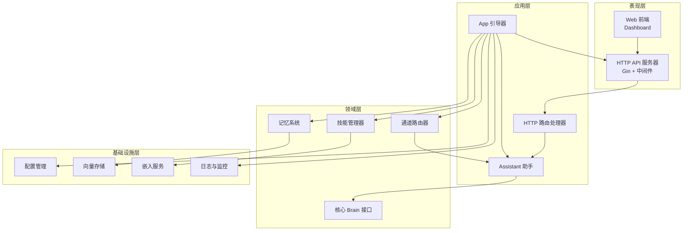
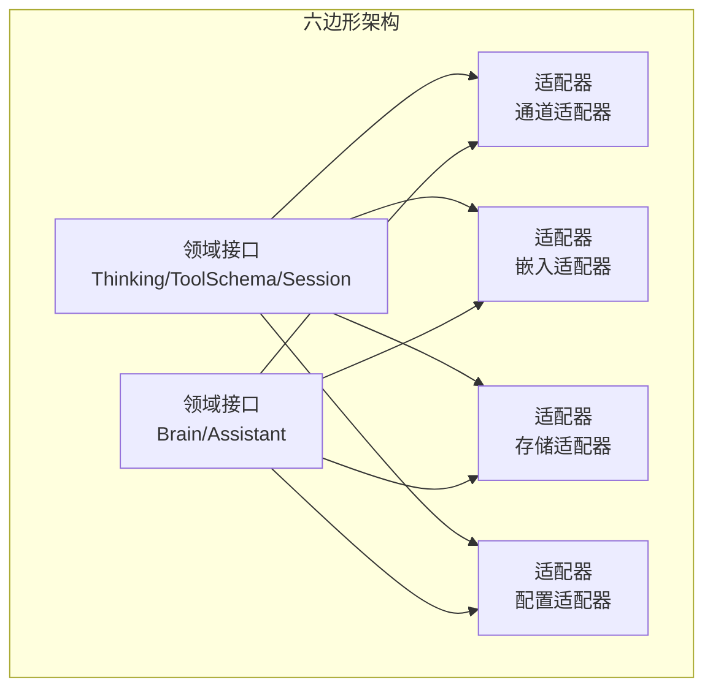
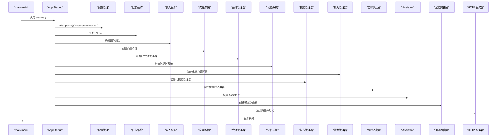
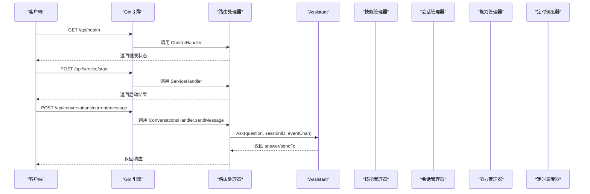
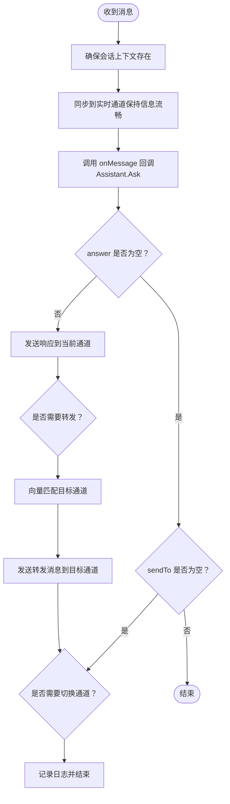
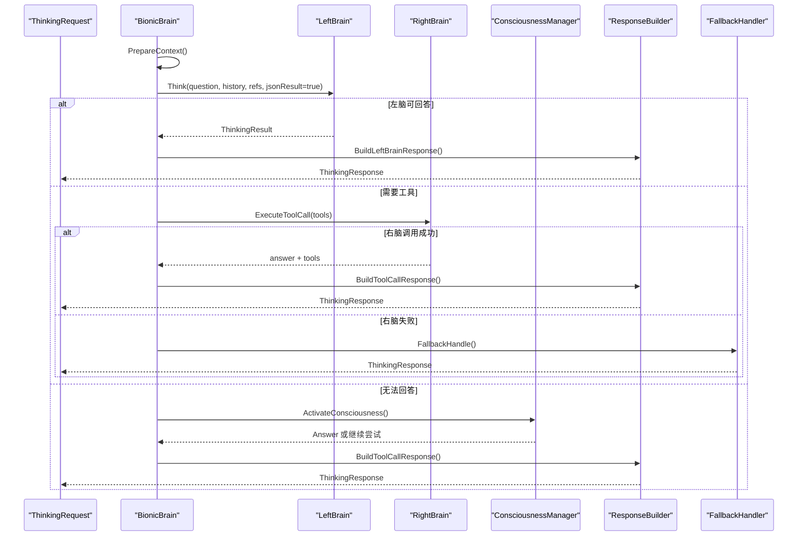
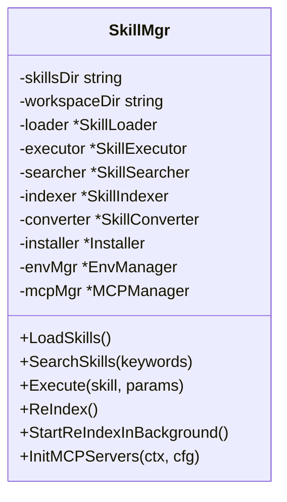
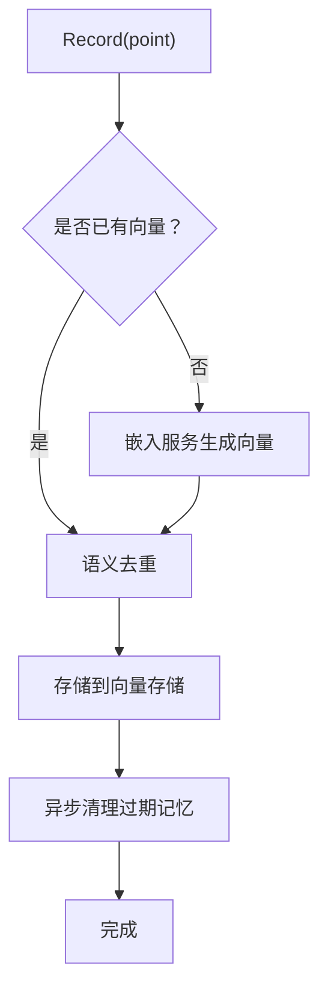
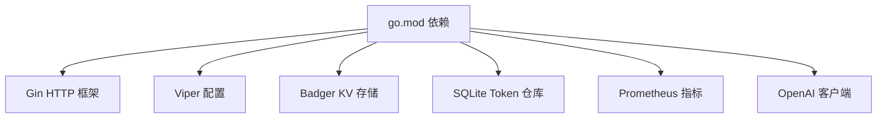

# 整体架构概览

<cite>
**本文档引用的文件**
- [cmd/main.go](file://cmd/main.go)
- [internal/infrastructure/bootstrap/app.go](file://internal/infrastructure/bootstrap/app.go)
- [internal/infrastructure/bootstrap/assistant.go](file://internal/infrastructure/bootstrap/assistant.go)
- [internal/infrastructure/bootstrap/server.go](file://internal/infrastructure/bootstrap/server.go)
- [internal/adapters/http/handlers/router.go](file://internal/adapters/http/handlers/router.go)
- [internal/adapters/channels/gateway.go](file://internal/adapters/channels/gateway.go)
- [internal/adapters/channels/manager.go](file://internal/adapters/channels/manager.go)
- [internal/core/brain.go](file://internal/core/brain.go)
- [internal/usecase/brain/brain.go](file://internal/usecase/brain/brain.go)
- [internal/usecase/skills/skill_mgr.go](file://internal/usecase/skills/skill_mgr.go)
- [internal/usecase/memory/memory.go](file://internal/usecase/memory/memory.go)
- [internal/infrastructure/persistence/store.go](file://internal/infrastructure/persistence/store.go)
- [internal/config/config.go](file://internal/config/config.go)
- [go.mod](file://go.mod)
- [README.md](file://README.md)
</cite>

## 目录
1. [简介](#简介)
2. [项目结构](#项目结构)
3. [核心组件](#核心组件)
4. [架构总览](#架构总览)
5. [详细组件分析](#详细组件分析)
6. [依赖关系分析](#依赖关系分析)
7. [性能考虑](#性能考虑)
8. [故障排查指南](#故障排查指南)
9. [结论](#结论)

## 简介
本文件面向架构师与高级开发者，系统性阐述 MindX 的整体架构设计与实现。MindX 采用分层架构与六边形架构（端口与适配器）相结合的设计模式，将表现层、应用层、领域层与基础设施层清晰分离；通过“仿生大脑”实现思考与决策的分层处理，结合“技能管理器”“记忆系统”“通道路由器”等核心组件，构建可扩展、可维护、可测试的智能体系统。

## 项目结构
MindX 采用模块化分层组织：
- 表现层：HTTP API 服务器与 Web 前端（Dashboard），提供 REST 接口与可视化界面
- 应用层：引导器（App）、助手（Assistant）、用例层（Brain、Skills、Memory、Capability、Cron 等）
- 领域层：核心接口与实体（Brain、Thinking、ToolSchema、Session、MemoryPoint 等）
- 基础设施层：配置管理、持久化存储、嵌入服务、日志与监控、通道适配器



**图表来源**
- [internal/infrastructure/bootstrap/app.go](file://internal/infrastructure/bootstrap/app.go#L66-L434)
- [internal/infrastructure/bootstrap/server.go](file://internal/infrastructure/bootstrap/server.go#L18-L200)
- [internal/adapters/http/handlers/router.go](file://internal/adapters/http/handlers/router.go#L18-L150)
- [internal/adapters/channels/gateway.go](file://internal/adapters/channels/gateway.go#L15-L510)
- [internal/core/brain.go](file://internal/core/brain.go#L116-L140)
- [internal/usecase/skills/skill_mgr.go](file://internal/usecase/skills/skill_mgr.go#L20-L35)
- [internal/usecase/memory/memory.go](file://internal/usecase/memory/memory.go#L18-L26)
- [internal/infrastructure/persistence/store.go](file://internal/infrastructure/persistence/store.go#L25-L43)
- [internal/config/config.go](file://internal/config/config.go#L13-L37)

**章节来源**
- [cmd/main.go](file://cmd/main.go#L1-L21)
- [internal/infrastructure/bootstrap/app.go](file://internal/infrastructure/bootstrap/app.go#L66-L434)
- [internal/infrastructure/bootstrap/server.go](file://internal/infrastructure/bootstrap/server.go#L18-L200)
- [internal/adapters/http/handlers/router.go](file://internal/adapters/http/handlers/router.go#L18-L150)
- [internal/adapters/channels/gateway.go](file://internal/adapters/channels/gateway.go#L15-L510)
- [internal/core/brain.go](file://internal/core/brain.go#L116-L140)
- [internal/usecase/skills/skill_mgr.go](file://internal/usecase/skills/skill_mgr.go#L20-L35)
- [internal/usecase/memory/memory.go](file://internal/usecase/memory/memory.go#L18-L26)
- [internal/infrastructure/persistence/store.go](file://internal/infrastructure/persistence/store.go#L25-L43)
- [internal/config/config.go](file://internal/config/config.go#L13-L37)

## 核心组件
- App 引导器：负责系统启动、模块装配、服务注册与优雅关闭
- Assistant 助手：聚合 Brain、Skills、Memory、Session 等，对外提供问答与记忆总结能力
- HTTP 服务器：提供 REST API、静态资源服务与健康检查
- 通道路由器：统一接入多渠道消息，实现消息路由、转发与上下文管理
- 用例层（Brain/Skills/Memory/Capability/Cron）：实现具体业务逻辑
- 领域接口：Brain、Thinking、ToolSchema、Session、MemoryPoint 等抽象契约
- 基础设施：配置、嵌入、存储、日志与监控

**章节来源**
- [internal/infrastructure/bootstrap/app.go](file://internal/infrastructure/bootstrap/app.go#L52-L62)
- [internal/infrastructure/bootstrap/assistant.go](file://internal/infrastructure/bootstrap/assistant.go#L20-L37)
- [internal/infrastructure/bootstrap/server.go](file://internal/infrastructure/bootstrap/server.go#L18-L27)
- [internal/adapters/channels/gateway.go](file://internal/adapters/channels/gateway.go#L15-L31)
- [internal/core/brain.go](file://internal/core/brain.go#L116-L140)

## 架构总览
MindX 采用分层架构与六边形架构（端口与适配器）相结合：
- 分层架构：表现层（HTTP/Web）、应用层（App/Assistant/Handlers）、领域层（Brain/Thinking/ToolSchema）、基础设施层（Config/Store/Embedding/Logging）
- 六边形架构：领域对象（Brain、Skills、Memory）通过接口与外部系统（通道、嵌入、存储、日志）解耦，适配器负责对接具体实现



**图表来源**
- [internal/core/brain.go](file://internal/core/brain.go#L70-L87)
- [internal/core/brain.go](file://internal/core/brain.go#L116-L140)
- [internal/adapters/channels/gateway.go](file://internal/adapters/channels/gateway.go#L15-L31)
- [internal/infrastructure/persistence/store.go](file://internal/infrastructure/persistence/store.go#L25-L43)
- [internal/config/config.go](file://internal/config/config.go#L13-L37)

## 详细组件分析

### App 引导器（系统入口与装配）
- 职责：加载环境变量与配置、初始化日志、构建嵌入服务与向量存储、装配会话管理器、记忆系统、能力与技能管理器、定时任务调度器、Assistant、通道路由器与 HTTP 服务器，最后启动服务
- 关键交互：通过 App 结构体聚合 Server、Assistant、ChannelRouter、SessionMgr、Embedding、Skills、Capabilities、CronScheduler、TokenUsageRepo，统一对外暴露
- 优雅关闭：按顺序停止通道、关闭 HTTP 服务器、关闭会话管理器与 Token 使用仓库



**图表来源**
- [cmd/main.go](file://cmd/main.go#L18-L20)
- [internal/infrastructure/bootstrap/app.go](file://internal/infrastructure/bootstrap/app.go#L66-L434)

**章节来源**
- [cmd/main.go](file://cmd/main.go#L1-L21)
- [internal/infrastructure/bootstrap/app.go](file://internal/infrastructure/bootstrap/app.go#L66-L434)

### Assistant（智能助手）
- 职责：聚合 Brain、Skills、Memory、Session 等，对外提供 Ask 与 Summarize 能力；设置思考事件回调；暴露能力与技能信息
- 交互：Ask 将问题转发给 Brain，Brain 处理后通过回调通知思考事件；Summarize 负责从会话中提取记忆点并写入记忆系统

```mermaid
classDiagram
class Assistant {
    -name: string
    -gender: string
    -character: string
    -userContent: string
    -persona: *Persona
    -brain: *Brain
    -cfg: *GlobalConfig
    -sessionMgr: SessionMgr
    -capMgr: *CapabilityManager
    -skillMgr: *SkillMgr
    -logger: Logger
    -tokenUsageRepo: TokenUsageRepository
    -cronScheduler: Scheduler
    +SetName(name: string)
    +SetGender(gender: string)
    +SetCharacter(character: string)
    +SetUserContent(content: string)
    +GetName(): string
    +GetGender(): string
    +GetCharacter(): string
    +GetSkillMgr(): SkillManager
    +GetCapabilities(): []Capability
    +GetBrain(): Brain
    +GetMemory(): Memory
    +GetSessions(): []interface{}
    +Ask(question: string, sessionID: string, eventChan: chan): (string, string, error)
    +Summarize(): error
}
```

**图表来源**
- [internal/infrastructure/bootstrap/assistant.go](file://internal/infrastructure/bootstrap/assistant.go#L20-L197)

**章节来源**
- [internal/infrastructure/bootstrap/assistant.go](file://internal/infrastructure/bootstrap/assistant.go#L20-L197)

### HTTP 服务器与路由
- 职责：提供健康检查、服务控制、会话管理、渠道管理、技能管理、能力管理、配置管理、监控日志、Token 使用统计、MCP 服务器管理等 API；提供静态资源与 SPA 回退
- 路由注册：通过 handlers.RegisterRoutes 将各类控制器挂载到 /api 下的子路由组



**图表来源**
- [internal/infrastructure/bootstrap/server.go](file://internal/infrastructure/bootstrap/server.go#L56-L88)
- [internal/adapters/http/handlers/router.go](file://internal/adapters/http/handlers/router.go#L18-L150)

**章节来源**
- [internal/infrastructure/bootstrap/server.go](file://internal/infrastructure/bootstrap/server.go#L18-L200)
- [internal/adapters/http/handlers/router.go](file://internal/adapters/http/handlers/router.go#L18-L150)

### 通道路由器（Channel Router）
- 职责：统一接入多渠道消息，实现消息路由、转发、上下文切换与同步；支持向量语义匹配目标通道；优雅关闭等待活动消息完成
- 关键流程：HandleMessage -> onMessage 回调（由 Assistant 提供）-> 发送响应到当前通道 -> 语义转发到目标通道 -> 语义切换到目标通道



**图表来源**
- [internal/adapters/channels/gateway.go](file://internal/adapters/channels/gateway.go#L74-L272)

**章节来源**
- [internal/adapters/channels/gateway.go](file://internal/adapters/channels/gateway.go#L15-L510)
- [internal/adapters/channels/manager.go](file://internal/adapters/channels/manager.go#L15-L230)

### 用例层：Brain（仿生大脑）
- 职责：实现思考与决策的分层处理，包含左脑（潜意识）、右脑（工具调用）、主意识（能力/远程模型）；支持思考事件流、工具调用、能力路由与兜底策略
- 关键流程：PrepareContext -> LeftBrain.Think -> 判断是否需要右脑工具调用 -> 若无法回答则激活主意识 -> 构建响应



**图表来源**
- [internal/usecase/brain/brain.go](file://internal/usecase/brain/brain.go#L133-L237)
- [internal/core/brain.go](file://internal/core/brain.go#L116-L140)

**章节来源**
- [internal/usecase/brain/brain.go](file://internal/usecase/brain/brain.go#L56-L131)
- [internal/core/brain.go](file://internal/core/brain.go#L116-L140)

### 用例层：Skills（技能管理器）
- 职责：加载、执行、搜索、索引、转换、安装与环境管理；支持 MCP 工具发现与注册；异步索引与后台重建
- 关键流程：Loader.LoadAll -> syncComponents -> Indexer.StartWorker -> 搜索/执行/索引



**图表来源**
- [internal/usecase/skills/skill_mgr.go](file://internal/usecase/skills/skill_mgr.go#L20-L85)

**章节来源**
- [internal/usecase/skills/skill_mgr.go](file://internal/usecase/skills/skill_mgr.go#L20-L558)

### 用例层：Memory（记忆系统）
- 职责：记录记忆点、向量化、语义去重、清理过期记忆；与嵌入服务协作生成向量
- 关键流程：Record -> 生成向量 -> 语义去重 -> 存储 -> 异步清理



**图表来源**
- [internal/usecase/memory/memory.go](file://internal/usecase/memory/memory.go#L62-L107)
- [internal/infrastructure/persistence/store.go](file://internal/infrastructure/persistence/store.go#L25-L43)

**章节来源**
- [internal/usecase/memory/memory.go](file://internal/usecase/memory/memory.go#L18-L112)
- [internal/infrastructure/persistence/store.go](file://internal/infrastructure/persistence/store.go#L25-L57)

### 配置与持久化
- 配置：通过 viper 加载 server.yml、channels.yml、capabilities.yml、models.yml；支持保存与模板复制
- 持久化：根据类型选择 Badger 或内存存储；提供向量相似度计算服务

**章节来源**
- [internal/config/config.go](file://internal/config/config.go#L13-L294)
- [internal/infrastructure/persistence/store.go](file://internal/infrastructure/persistence/store.go#L25-L57)

## 依赖关系分析
- 模块依赖：Go 模块通过 go.mod 管理第三方依赖，包括 Gin、OpenAI、Badger、Prometheus、Viper 等
- 组件耦合：App 作为装配中心，向上提供统一接口，向下协调各模块；Brain 与 Skills 通过接口解耦；通道适配器与嵌入/存储通过接口解耦
- 外部集成：HTTP 服务器集成 Gin 与 Prometheus；通道适配器支持多种 IM 平台；MCP 协议支持外部工具生态



**图表来源**
- [go.mod](file://go.mod#L5-L29)

**章节来源**
- [go.mod](file://go.mod#L1-L113)

## 性能考虑
- 分层思考：左脑快速响应简单任务，右脑与主意识按需激活，降低 Token 与延迟
- 异步索引：技能与能力向量索引后台重建，不影响请求链路
- 优雅关闭：通道与 HTTP 服务器支持超时控制，保证平滑退出
- 向量去重：记忆系统进行语义去重，减少存储与检索开销
- 跨平台调度：根据平台选择 Crontab 或 Windows 任务调度器

## 故障排查指南
- 启动失败：检查 .env 加载、工作区初始化、配置加载与日志初始化
- 通道异常：查看通道管理器日志，确认通道工厂注册与启动状态
- 嵌入/存储异常：核对嵌入服务 URL 与模型配置、向量存储路径权限
- MCP 连接失败：区分可重试错误（超时/网络）与不可重试错误（协议不兼容/进程崩溃）

**章节来源**
- [internal/infrastructure/bootstrap/app.go](file://internal/infrastructure/bootstrap/app.go#L66-L110)
- [internal/adapters/channels/manager.go](file://internal/adapters/channels/manager.go#L58-L83)
- [internal/usecase/skills/skill_mgr.go](file://internal/usecase/skills/skill_mgr.go#L404-L468)

## 结论
MindX 通过分层架构与六边形架构实现了高内聚、低耦合的系统设计，核心业务逻辑（Brain、Skills、Memory）通过接口与外部系统解耦，便于替换与扩展。App 引导器集中装配与启动，HTTP 服务器与通道路由器提供统一的外部交互入口，满足可扩展性、可维护性与可测试性的工程目标。该架构为构建可演进的智能体系统提供了坚实基础。