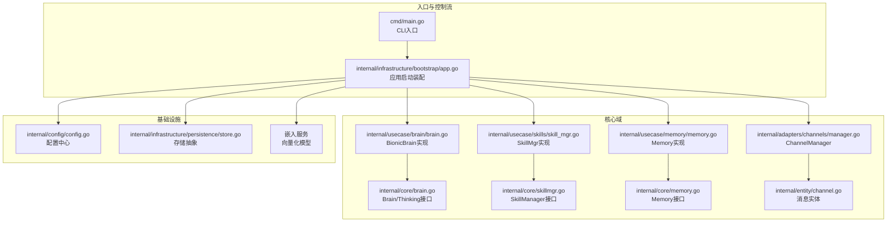
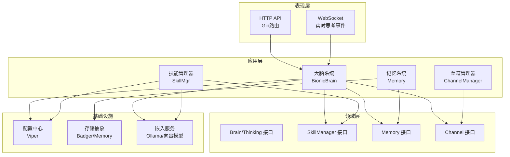
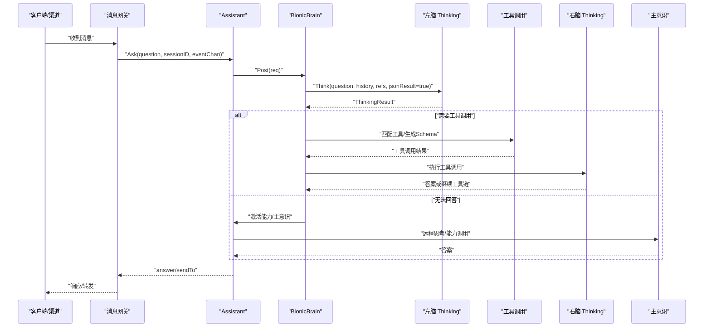
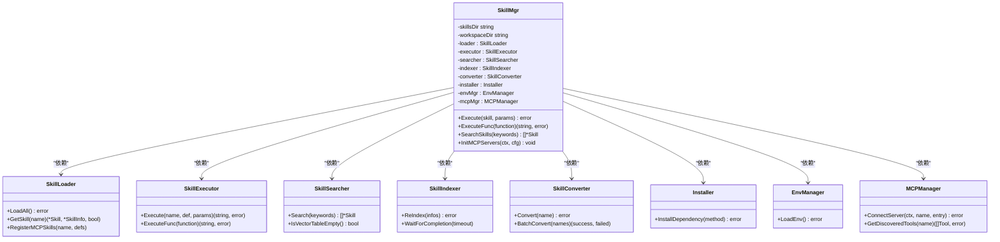
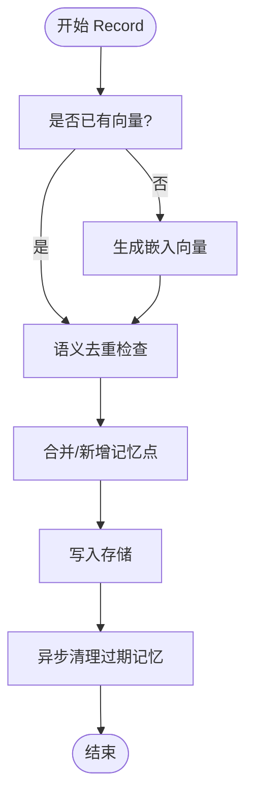
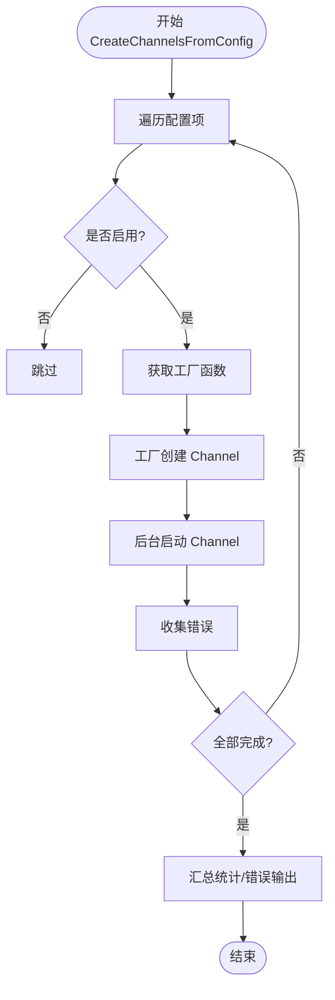
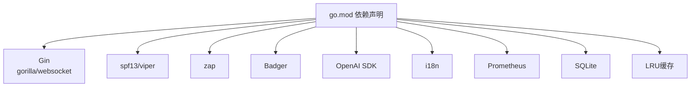

# 系统架构设计

<cite>
**本文引用的文件**
- [cmd/main.go](file://cmd/main.go)
- [internal/infrastructure/bootstrap/app.go](file://internal/infrastructure/bootstrap/app.go)
- [internal/core/brain.go](file://internal/core/brain.go)
- [internal/usecase/brain/brain.go](file://internal/usecase/brain/brain.go)
- [internal/core/skillmgr.go](file://internal/core/skillmgr.go)
- [internal/usecase/skills/skill_mgr.go](file://internal/usecase/skills/skill_mgr.go)
- [internal/core/memory.go](file://internal/core/memory.go)
- [internal/usecase/memory/memory.go](file://internal/usecase/memory/memory.go)
- [internal/adapters/channels/manager.go](file://internal/adapters/channels/manager.go)
- [internal/entity/channel.go](file://internal/entity/channel.go)
- [internal/entity/skill.go](file://internal/entity/skill.go)
- [internal/infrastructure/persistence/store.go](file://internal/infrastructure/persistence/store.go)
- [internal/config/config.go](file://internal/config/config.go)
- [go.mod](file://go.mod)
</cite>

## 目录
1. [简介](#简介)
2. [项目结构](#项目结构)
3. [核心组件](#核心组件)
4. [架构总览](#架构总览)
5. [详细组件分析](#详细组件分析)
6. [依赖分析](#依赖分析)
7. [性能考量](#性能考量)
8. [故障排查指南](#故障排查指南)
9. [结论](#结论)
10. [附录](#附录)

## 简介
本文件面向架构师与高级开发者，系统化阐述 MindX 的系统架构设计。MindX 采用分层架构与六边形架构（Hexagonal Architecture）相结合的设计模式，围绕“大脑系统”“渠道管理器”“技能管理器”“记忆系统”四大核心域展开，辅以配置中心、持久化与嵌入服务等基础设施，实现高内聚、低耦合、可扩展、可观测的智能体中枢。

## 项目结构
MindX 采用 Go 模块化组织方式，按“领域层/用例层/适配器层/基础设施层”分层，结合“核心接口 + 具体实现”的六边形思想，将业务逻辑与外部依赖解耦。

- 入口与启动
  - CLI 入口：cmd/main.go 负责版本信息注入与 CLI 执行入口。
  - 应用启动：internal/infrastructure/bootstrap/app.go 负责配置加载、组件装配、服务启动与资源回收。
- 核心域
  - 大脑系统：internal/core/brain.go 定义 Brain/Thinking 接口；internal/usecase/brain/brain.go 提供具体实现。
  - 技能管理器：internal/core/skillmgr.go 定义接口；internal/usecase/skills/skill_mgr.go 提供实现。
  - 记忆系统：internal/core/memory.go 定义接口；internal/usecase/memory/memory.go 提供实现。
  - 渠道管理器：internal/adapters/channels/manager.go 管理多渠道生命周期；internal/entity/channel.go 定义消息实体。
- 基础设施
  - 配置中心：internal/config/config.go 负责多配置文件加载与保存。
  - 持久化：internal/infrastructure/persistence/store.go 提供 Badger/Memory 存储抽象。
  - 嵌入服务：与向量化模型交互，支撑记忆与技能的向量检索。
- 技术栈与依赖
  - Web 框架：Gin；WebSocket：gorilla/websocket；配置：spf13/viper；日志：zap；向量：Badger；OpenAI SDK；国际化：i18n；Prometheus 指标；SQLite；LRU 缓存等。

**图表来源**
- [cmd/main.go](file://cmd/main.go#L1-L21)
- [internal/infrastructure/bootstrap/app.go](file://internal/infrastructure/bootstrap/app.go#L66-L434)
- [internal/core/brain.go](file://internal/core/brain.go#L116-L140)
- [internal/usecase/brain/brain.go](file://internal/usecase/brain/brain.go#L56-L131)
- [internal/core/skillmgr.go](file://internal/core/skillmgr.go#L9-L18)
- [internal/usecase/skills/skill_mgr.go](file://internal/usecase/skills/skill_mgr.go#L40-L85)
- [internal/core/memory.go](file://internal/core/memory.go#L24-L40)
- [internal/usecase/memory/memory.go](file://internal/usecase/memory/memory.go#L28-L60)
- [internal/adapters/channels/manager.go](file://internal/adapters/channels/manager.go#L15-L30)
- [internal/entity/channel.go](file://internal/entity/channel.go#L23-L70)
- [internal/infrastructure/persistence/store.go](file://internal/infrastructure/persistence/store.go#L25-L43)
- [internal/config/config.go](file://internal/config/config.go#L13-L37)

**章节来源**
- [cmd/main.go](file://cmd/main.go#L1-L21)
- [internal/infrastructure/bootstrap/app.go](file://internal/infrastructure/bootstrap/app.go#L66-L434)
- [internal/config/config.go](file://internal/config/config.go#L13-L37)

## 核心组件
- 大脑系统（Brain）
  - 职责：双脑协同（左脑本地推理 + 右脑工具调用），必要时激活“主意识”（远程大模型/能力）。
  - 关键接口：Thinking、Brain、ToolSchema、ThinkingResult 等。
  - 实现：BionicBrain 负责意图识别、工具匹配、工具调用、能力调度、响应构建与兜底策略。
- 技能管理器（SkillManager）
  - 职责：技能加载、索引、搜索、执行、MCP 工具桥接、环境与依赖管理。
  - 关键接口：SkillManager、Skill、ToolCallFunction 等。
  - 实现：SkillMgr 组合 Loader/Executor/Searcher/Indexer/Converter/Installer/MCPManager，统一编排。
- 记忆系统（Memory）
  - 职责：记忆点记录、向量化、相似检索、去重、聚类与清理。
  - 关键接口：Memory、MemoryPoint、Store 等。
  - 实现：Memory 基于嵌入服务生成向量，写入 Badger/Memory Store，支持 LLM 辅助摘要与关键词抽取。
- 渠道管理器（Channel）
  - 职责：多渠道生命周期管理（创建、启动、停止、批量配置驱动）。
  - 关键接口：Channel、ChannelManager、IncomingMessage/OutgoingMessage。
  - 实现：ChannelManager 通过工厂注册表按配置并发创建并启动各渠道。

**章节来源**
- [internal/core/brain.go](file://internal/core/brain.go#L70-L140)
- [internal/usecase/brain/brain.go](file://internal/usecase/brain/brain.go#L56-L131)
- [internal/core/skillmgr.go](file://internal/core/skillmgr.go#L9-L18)
- [internal/usecase/skills/skill_mgr.go](file://internal/usecase/skills/skill_mgr.go#L40-L85)
- [internal/core/memory.go](file://internal/core/memory.go#L24-L40)
- [internal/usecase/memory/memory.go](file://internal/usecase/memory/memory.go#L28-L60)
- [internal/adapters/channels/manager.go](file://internal/adapters/channels/manager.go#L15-L30)
- [internal/entity/channel.go](file://internal/entity/channel.go#L23-L70)

## 架构总览
MindX 采用“分层 + 六边形”的混合架构：
- 分层架构：表现层（HTTP/WebSocket）、应用层（Brain/Skill/Memory）、领域层（接口定义）、基础设施层（配置/存储/嵌入）。
- 六边形架构：以领域接口为核心，通过适配器对接外部系统（渠道、模型、存储、配置），实现端口与适配器的解耦。

**图表来源**
- [internal/infrastructure/bootstrap/app.go](file://internal/infrastructure/bootstrap/app.go#L382-L407)
- [internal/usecase/brain/brain.go](file://internal/usecase/brain/brain.go#L56-L131)
- [internal/usecase/skills/skill_mgr.go](file://internal/usecase/skills/skill_mgr.go#L40-L85)
- [internal/usecase/memory/memory.go](file://internal/usecase/memory/memory.go#L28-L60)
- [internal/adapters/channels/manager.go](file://internal/adapters/channels/manager.go#L15-L30)
- [internal/infrastructure/persistence/store.go](file://internal/infrastructure/persistence/store.go#L25-L43)
- [internal/config/config.go](file://internal/config/config.go#L13-L37)

## 详细组件分析

### 大脑系统（Brain）交互序列
大脑系统在一次思考请求中的典型流程如下：

**图表来源**
- [internal/usecase/brain/brain.go](file://internal/usecase/brain/brain.go#L133-L237)
- [internal/usecase/brain/brain.go](file://internal/usecase/brain/brain.go#L307-L451)
- [internal/core/brain.go](file://internal/core/brain.go#L116-L140)

**章节来源**
- [internal/usecase/brain/brain.go](file://internal/usecase/brain/brain.go#L133-L237)
- [internal/usecase/brain/brain.go](file://internal/usecase/brain/brain.go#L307-L451)
- [internal/core/brain.go](file://internal/core/brain.go#L70-L140)

### 技能管理器（SkillMgr）类图
SkillMgr 通过组合多个子组件实现技能全生命周期管理，遵循“接口隔离 + 依赖注入”的六边形思想。

**图表来源**
- [internal/usecase/skills/skill_mgr.go](file://internal/usecase/skills/skill_mgr.go#L20-L85)
- [internal/entity/skill.go](file://internal/entity/skill.go#L5-L25)
- [internal/entity/skill.go](file://internal/entity/skill.go#L59-L83)

**章节来源**
- [internal/usecase/skills/skill_mgr.go](file://internal/usecase/skills/skill_mgr.go#L40-L85)
- [internal/entity/skill.go](file://internal/entity/skill.go#L5-L25)
- [internal/entity/skill.go](file://internal/entity/skill.go#L59-L83)

### 记忆系统（Memory）流程图
记忆系统在记录记忆点时的处理流程如下：

**图表来源**
- [internal/usecase/memory/memory.go](file://internal/usecase/memory/memory.go#L62-L107)
- [internal/core/memory.go](file://internal/core/memory.go#L24-L40)

**章节来源**
- [internal/usecase/memory/memory.go](file://internal/usecase/memory/memory.go#L62-L107)
- [internal/core/memory.go](file://internal/core/memory.go#L24-L40)

### 渠道管理器（ChannelManager）并发创建流程
ChannelManager 支持配置驱动的并发创建与启动，保证健壮性与可观测性。

**图表来源**
- [internal/adapters/channels/manager.go](file://internal/adapters/channels/manager.go#L149-L229)
- [internal/entity/channel.go](file://internal/entity/channel.go#L23-L70)

**章节来源**
- [internal/adapters/channels/manager.go](file://internal/adapters/channels/manager.go#L149-L229)
- [internal/entity/channel.go](file://internal/entity/channel.go#L23-L70)

## 依赖分析
- 设计模式
  - 依赖注入：应用启动阶段集中装配依赖（模型管理器、嵌入服务、存储、日志、调度器等），通过构造函数注入到 Brain/Skill/Memory。
  - 工厂模式：ChannelManager 通过工厂注册表按名称创建不同渠道实例，支持扩展新渠道。
  - 观察者模式：Brain 通过事件通道（ThinkingEvent）向实时通道广播思考进度，前端订阅 WebSocket 实时展示。
  - 策略模式：Memory/BionicBrain 在不同场景下选择本地/远程/能力策略，实现灵活的推理路径。
- 外部依赖与权衡
  - Gin：轻量高效，适合 API 场景；WebSocket 由 gorilla/websocket 提供。
  - OpenAI SDK：统一大模型接入；本地/远程可切换。
  - Badger：高性能嵌入式 KV，适合中小规模向量与元数据存储；内存模式用于测试。
  - Viper：多格式配置加载与热更新支持；配置文件缺失时自动复制模板。
  - Prometheus：指标采集，便于运维监控。
  - LRU：缓存热点数据，降低重复计算成本。
- 潜在循环依赖
  - 通过接口隔离避免模块间直接依赖；核心接口位于 core 包，实现位于 usecase/adapters。

**图表来源**
- [go.mod](file://go.mod#L5-L29)

**章节来源**
- [go.mod](file://go.mod#L5-L29)

## 性能考量
- 向量化与检索
  - 使用嵌入服务生成向量，结合向量相似度计算与语义去重，减少冗余存储与检索开销。
  - 记忆与技能均支持向量索引，建议在启动后异步预热索引，避免首次高峰延迟。
- 并发与资源
  - ChannelManager 并发创建与启动，配合 WaitGroup 与错误聚合，提升初始化稳定性。
  - MCP 服务器初始化带指数退避与可重试错误判定，降低冷启动与网络波动影响。
- 缓存与持久化
  - LRU 缓存热点数据；Badger 本地存储，SQLite 记录 Token 使用，降低远程依赖。
- 日志与指标
  - zap 结构化日志；Prometheus 指标暴露，便于容量规划与问题定位。

## 故障排查指南
- 配置加载失败
  - 现象：启动时报配置加载错误。
  - 排查：确认 server.yml/channels.yml/capabilities.yml/models.yml 是否存在；若缺失，系统会尝试复制模板至工作区。
- 渠道启动失败
  - 现象：部分渠道无法启动或批量启动失败。
  - 排查：查看 ChannelManager 的错误聚合日志；确认工厂注册是否正确、配置项是否启用、网络连通性。
- 记忆/技能索引异常
  - 现象：向量索引为空或重建失败。
  - 排查：检查嵌入服务可用性、存储路径权限、索引工作线程状态；必要时手动触发 ReIndex。
- MCP 服务器连接失败
  - 现象：MCP 工具未注册或连接超时。
  - 排查：区分可重试错误（超时/拒绝）与不可重试错误（协议不兼容/进程崩溃）；调整超时与重试策略。

**章节来源**
- [internal/config/config.go](file://internal/config/config.go#L13-L37)
- [internal/adapters/channels/manager.go](file://internal/adapters/channels/manager.go#L149-L229)
- [internal/usecase/skills/skill_mgr.go](file://internal/usecase/skills/skill_mgr.go#L232-L241)
- [internal/usecase/skills/skill_mgr.go](file://internal/usecase/skills/skill_mgr.go#L373-L449)

## 结论
MindX 的架构以“大脑系统”为核心，围绕“技能管理器”“记忆系统”“渠道管理器”构建闭环，通过配置中心与基础设施层实现与外部系统的解耦。分层与六边形的结合确保了高内聚、低耦合与强扩展性；依赖注入、工厂、观察者等模式提升了可维护性与可测试性。建议在生产环境中重点关注向量索引预热、MCP 连接稳定性与日志/指标完善，持续优化推理路径与资源利用率。

## 附录
- 启动流程概览
  - main -> CLI 执行 -> 配置初始化 -> 组件装配 -> 服务启动 -> HTTP/WebSocket 就绪。
- 关键接口一览
  - Brain/Thinking、SkillManager/Skill、Memory、Channel、Store、EmbeddingService 等。