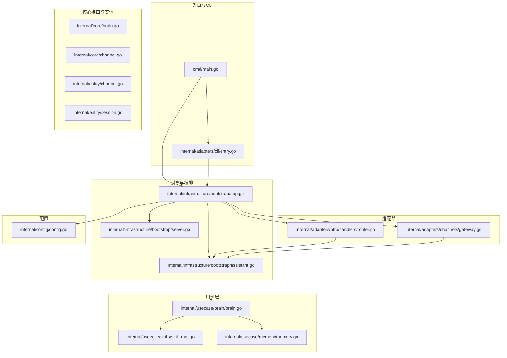
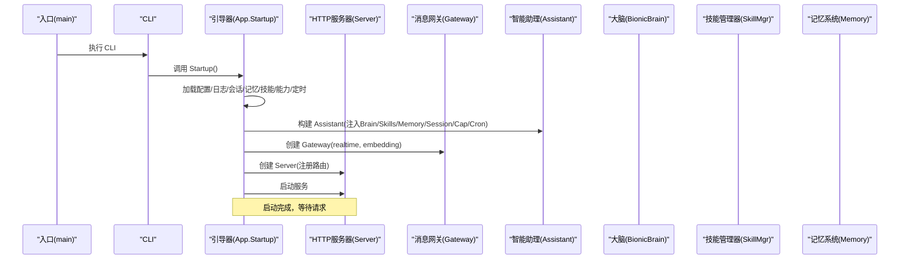
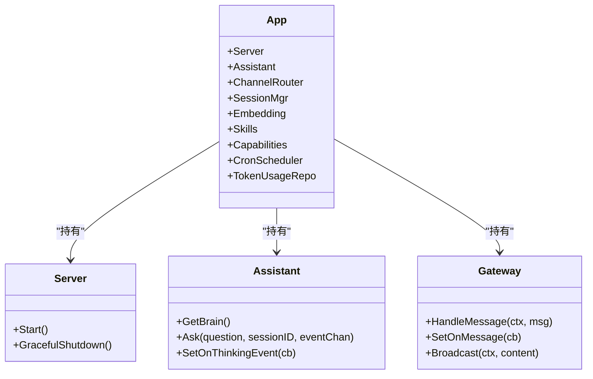
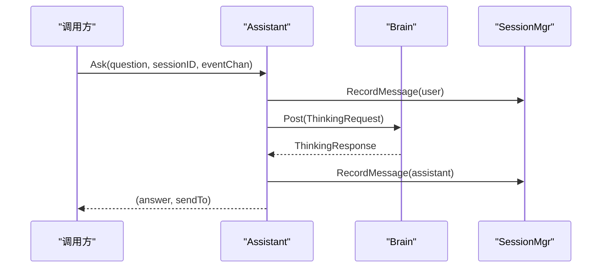
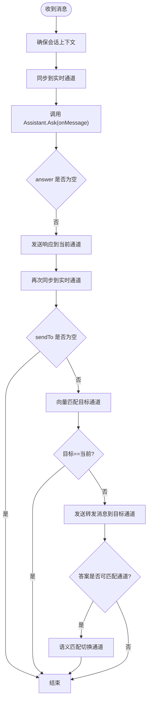
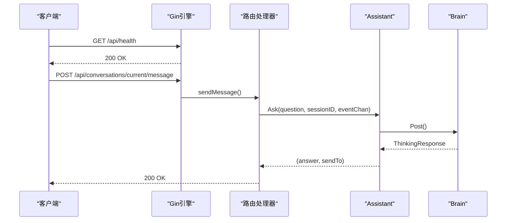
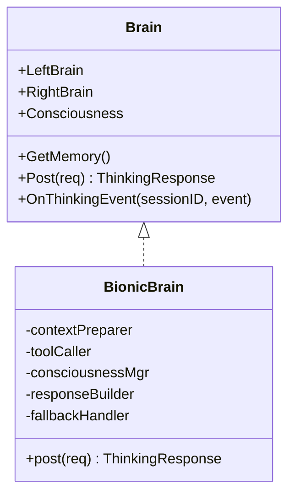
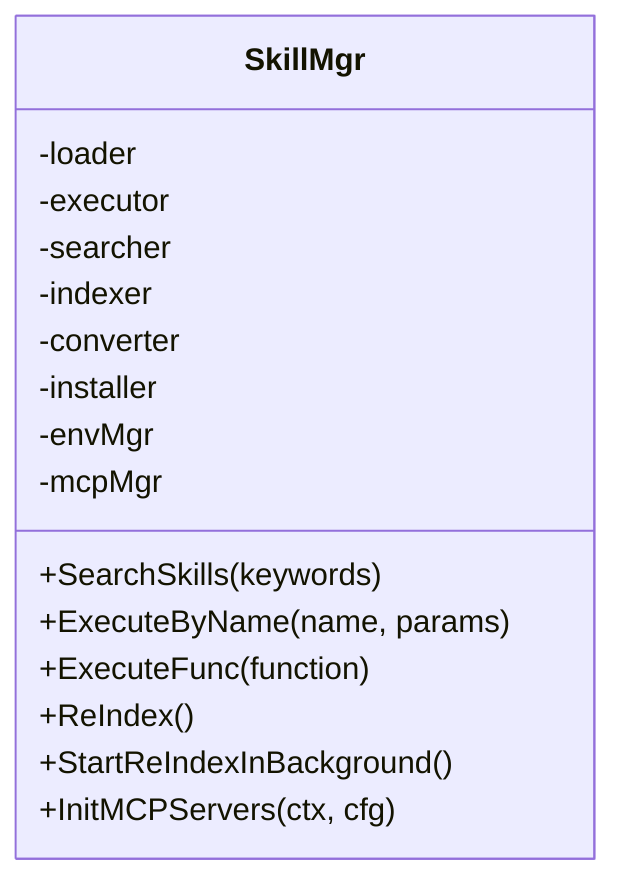
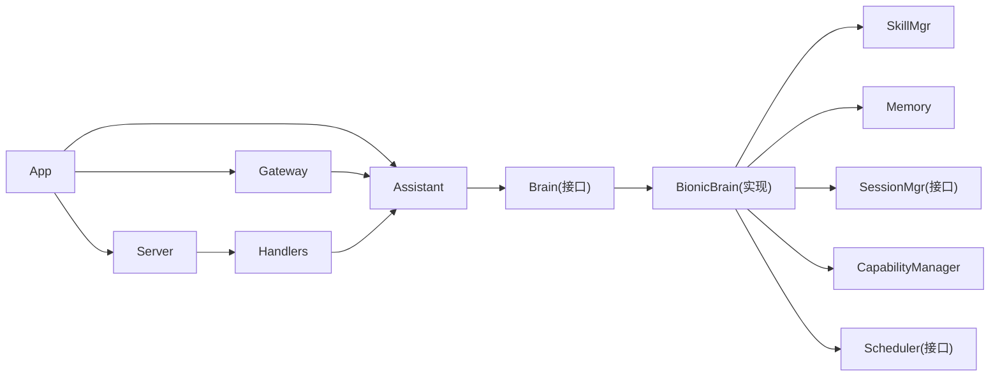

# 组件交互关系

<cite>
**本文引用的文件**
- [cmd/main.go](file://cmd/main.go)
- [internal/adapters/cli/entry.go](file://internal/adapters/cli/entry.go)
- [internal/infrastructure/bootstrap/app.go](file://internal/infrastructure/bootstrap/app.go)
- [internal/infrastructure/bootstrap/assistant.go](file://internal/infrastructure/bootstrap/assistant.go)
- [internal/infrastructure/bootstrap/server.go](file://internal/infrastructure/bootstrap/server.go)
- [internal/adapters/channels/gateway.go](file://internal/adapters/channels/gateway.go)
- [internal/adapters/http/handlers/router.go](file://internal/adapters/http/handlers/router.go)
- [internal/core/brain.go](file://internal/core/brain.go)
- [internal/core/channel.go](file://internal/core/channel.go)
- [internal/entity/channel.go](file://internal/entity/channel.go)
- [internal/entity/session.go](file://internal/entity/session.go)
- [internal/usecase/brain/brain.go](file://internal/usecase/brain/brain.go)
- [internal/usecase/skills/skill_mgr.go](file://internal/usecase/skills/skill_mgr.go)
- [internal/usecase/memory/memory.go](file://internal/usecase/memory/memory.go)
- [internal/config/config.go](file://internal/config/config.go)
</cite>

## 目录
1. [简介](#简介)
2. [项目结构](#项目结构)
3. [核心组件](#核心组件)
4. [架构总览](#架构总览)
5. [详细组件分析](#详细组件分析)
6. [依赖关系分析](#依赖关系分析)
7. [性能考量](#性能考量)
8. [故障排查指南](#故障排查指南)
9. [结论](#结论)
10. [附录](#附录)

## 简介
本文件面向 MindX 的组件交互关系，聚焦以下目标：
- App 引导器如何协调各子系统启动（配置、日志、会话、记忆、技能、能力、HTTP 服务器、消息网关、定时任务等）
- Assistant 如何协调大脑、技能管理器、记忆系统的工作
- Channel 路由器如何将消息路由到 Assistant
- HTTP 服务器如何提供 API 接口
- 组件间的依赖关系与生命周期管理
- 消息传递机制：从渠道接收到响应返回的完整流程
- 时序图展示典型的消息处理流程
- 组件解耦的实现方式：通过接口和事件机制
- 组件交互的调试与监控方法

## 项目结构
MindX 采用分层与领域驱动结合的组织方式：
- cmd 层：程序入口与 CLI 子命令
- internal/infrastructure/bootstrap：应用引导与生命周期编排
- internal/adapters：适配器层（HTTP、渠道）
- internal/core：核心接口与数据模型
- internal/usecase：用例层（大脑、技能、记忆、会话、能力、定时等）
- internal/config：配置加载与持久化
- internal/entity：跨层实体定义
- pkg/*：通用基础设施（日志、国际化、LLM 服务等）

图表来源
- [cmd/main.go](file://cmd/main.go#L1-L21)
- [internal/adapters/cli/entry.go](file://internal/adapters/cli/entry.go#L1-L123)
- [internal/infrastructure/bootstrap/app.go](file://internal/infrastructure/bootstrap/app.go#L1-L468)
- [internal/infrastructure/bootstrap/assistant.go](file://internal/infrastructure/bootstrap/assistant.go#L1-L420)
- [internal/infrastructure/bootstrap/server.go](file://internal/infrastructure/bootstrap/server.go#L1-L200)
- [internal/adapters/channels/gateway.go](file://internal/adapters/channels/gateway.go#L1-L510)
- [internal/adapters/http/handlers/router.go](file://internal/adapters/http/handlers/router.go#L1-L150)
- [internal/core/brain.go](file://internal/core/brain.go#L1-L205)
- [internal/core/channel.go](file://internal/core/channel.go#L1-L45)
- [internal/entity/channel.go](file://internal/entity/channel.go#L1-L203)
- [internal/entity/session.go](file://internal/entity/session.go#L1-L23)
- [internal/usecase/brain/brain.go](file://internal/usecase/brain/brain.go#L1-L674)
- [internal/usecase/skills/skill_mgr.go](file://internal/usecase/skills/skill_mgr.go#L1-L558)
- [internal/usecase/memory/memory.go](file://internal/usecase/memory/memory.go#L1-L112)
- [internal/config/config.go](file://internal/config/config.go#L1-L294)

章节来源
- [cmd/main.go](file://cmd/main.go#L1-L21)
- [internal/adapters/cli/entry.go](file://internal/adapters/cli/entry.go#L1-L123)
- [internal/infrastructure/bootstrap/app.go](file://internal/infrastructure/bootstrap/app.go#L1-L468)

## 核心组件
- App 引导器（App）：负责加载配置、初始化日志、构建向量化服务、会话管理器、记忆系统、Token 使用仓库、能力管理器、技能管理器、定时调度器、Assistant、消息网关、HTTP 服务器，并注册路由与启动服务
- Assistant：智能助理，协调大脑、技能、记忆、会话、能力与定时任务；对外提供 Ask 接口
- Channel 路由器（Gateway）：统一接入消息，维护会话上下文，将消息转发至 Assistant，按语义匹配目标通道进行转发与切换，同步到实时通道
- HTTP 服务器（Server）：基于 Gin 提供 API 与静态资源服务，内置健康检查、就绪检查、Prometheus 指标端点
- 脑（Brain）：由左脑（潜意识）、右脑（行为性思考）、意识（主意识）构成，负责思考、工具调用、能力激活、思考事件流推送
- 技能管理器（SkillMgr）：加载、索引、搜索、执行技能，支持 MCP 工具发现与索引
- 记忆系统（Memory）：向量化存储记忆点，支持去重、清理与持久化
- 会话管理器（SessionMgr）：记录消息、维护历史、统计 Token 使用
- 配置（Config）：加载 server、channels、capabilities、models 配置，提供路径与模板复制逻辑

章节来源
- [internal/infrastructure/bootstrap/app.go](file://internal/infrastructure/bootstrap/app.go#L52-L434)
- [internal/infrastructure/bootstrap/assistant.go](file://internal/infrastructure/bootstrap/assistant.go#L20-L420)
- [internal/adapters/channels/gateway.go](file://internal/adapters/channels/gateway.go#L15-L510)
- [internal/infrastructure/bootstrap/server.go](file://internal/infrastructure/bootstrap/server.go#L18-L200)
- [internal/core/brain.go](file://internal/core/brain.go#L116-L140)
- [internal/usecase/skills/skill_mgr.go](file://internal/usecase/skills/skill_mgr.go#L20-L558)
- [internal/usecase/memory/memory.go](file://internal/usecase/memory/memory.go#L18-L112)
- [internal/config/config.go](file://internal/config/config.go#L13-L294)

## 架构总览
MindX 的启动顺序与组件关系如下：
- 程序入口加载构建信息并执行 CLI
- CLI 调用引导器 Startup，加载 .env、创建工作区、初始化日志
- 初始化向量化服务、会话管理器、记忆系统、Token 使用仓库、能力管理器、技能管理器、定时调度器
- 构建 Assistant，注入大脑、技能、记忆、会话、能力、定时
- 初始化消息网关与实时通道，设置消息回调
- 创建 HTTP 服务器，注册路由，启动服务
- 启动完成后输出启动完成日志

图表来源
- [cmd/main.go](file://cmd/main.go#L18-L20)
- [internal/adapters/cli/entry.go](file://internal/adapters/cli/entry.go#L113-L123)
- [internal/infrastructure/bootstrap/app.go](file://internal/infrastructure/bootstrap/app.go#L66-L434)
- [internal/infrastructure/bootstrap/server.go](file://internal/infrastructure/bootstrap/server.go#L56-L88)
- [internal/adapters/channels/gateway.go](file://internal/adapters/channels/gateway.go#L34-L58)

章节来源
- [internal/infrastructure/bootstrap/app.go](file://internal/infrastructure/bootstrap/app.go#L66-L434)
- [internal/infrastructure/bootstrap/server.go](file://internal/infrastructure/bootstrap/server.go#L56-L88)

## 详细组件分析

### App 引导器（App）
- 职责：集中初始化与编排所有子系统，设置全局日志、构建向量化服务、会话管理器、记忆系统、Token 使用仓库、能力管理器、技能管理器、定时调度器、Assistant、消息网关、HTTP 服务器
- 生命周期：Startup 构建并启动，Shutdown 优雅关闭（停止通道、关闭服务器、关闭 Token 仓库）
- 关键点：
  - 从环境变量与配置文件加载构建信息与配置
  - 初始化日志系统与系统日志路径
  - 构建 Ollama 向量化服务与 Badger 向量存储
  - 初始化会话管理器与默认模型 MaxTokens
  - 初始化记忆系统（OpenAI 客户端、向量存储、嵌入服务）
  - 初始化 Token 使用仓库（SQLite）
  - 初始化能力管理器（从存储加载向量，必要时后台重建索引）
  - 初始化技能管理器（MCP 异步初始化，必要时后台重建索引）
  - 构建 Assistant 并注入依赖
  - 初始化消息网关与实时通道，设置思考事件回调
  - 注册 HTTP 路由并启动服务器

图表来源
- [internal/infrastructure/bootstrap/app.go](file://internal/infrastructure/bootstrap/app.go#L52-L62)
- [internal/infrastructure/bootstrap/assistant.go](file://internal/infrastructure/bootstrap/assistant.go#L20-L37)
- [internal/infrastructure/bootstrap/server.go](file://internal/infrastructure/bootstrap/server.go#L18-L27)
- [internal/adapters/channels/gateway.go](file://internal/adapters/channels/gateway.go#L15-L31)

章节来源
- [internal/infrastructure/bootstrap/app.go](file://internal/infrastructure/bootstrap/app.go#L66-L434)
- [internal/infrastructure/bootstrap/server.go](file://internal/infrastructure/bootstrap/server.go#L95-L126)

### Assistant（智能助理）
- 职责：协调大脑、技能、记忆、会话、能力与定时任务；对外提供 Ask 接口
- 关键点：
  - 构造大脑（左脑、右脑、意识），注入工具请求、能力请求、历史请求、日志、Token 使用仓库、定时调度器
  - Ask 流程：记录用户消息到会话管理器，构造思考请求，调用大脑 Post，记录助手回复到会话管理器，返回答案与转发目标
  - 支持思考事件回调（OnThinkingEvent），用于实时推送思考过程
  - 支持记忆提取（Summarize），对未记忆会话进行记忆点提取

图表来源
- [internal/infrastructure/bootstrap/assistant.go](file://internal/infrastructure/bootstrap/assistant.go#L312-L363)
- [internal/core/brain.go](file://internal/core/brain.go#L131-L137)

章节来源
- [internal/infrastructure/bootstrap/assistant.go](file://internal/infrastructure/bootstrap/assistant.go#L38-L197)
- [internal/infrastructure/bootstrap/assistant.go](file://internal/infrastructure/bootstrap/assistant.go#L312-L363)

### Channel 路由器（Gateway）
- 职责：统一接入消息，维护会话上下文，将消息转发至 Assistant，按语义匹配目标通道进行转发与切换，同步到实时通道
- 关键点：
  - HandleMessage：确保会话上下文、同步到实时通道、调用 onMessage（即 Assistant.Ask）、发送响应、按 SendTo 转发、按答案语义切换通道
  - 向量化匹配：预计算通道向量，基于 Cosine 相似度匹配目标通道
  - 广播：向所有运行中的通道广播消息
  - 优雅关闭：等待活跃消息处理完成后再停止通道

图表来源
- [internal/adapters/channels/gateway.go](file://internal/adapters/channels/gateway.go#L74-L272)

章节来源
- [internal/adapters/channels/gateway.go](file://internal/adapters/channels/gateway.go#L74-L272)

### HTTP 服务器（Server）与路由（Handlers）
- Server：基于 Gin 提供静态资源服务、健康检查、就绪检查、Prometheus 指标端点，支持优雅关闭
- Handlers：注册 /api 下所有路由，包括服务控制、会话管理、渠道管理、技能管理、能力管理、定时任务、设置、监控、Token 使用统计、MCP 管理等
- 与 Assistant 的协作：会话相关路由通过 Assistant 接口进行消息发送与会话操作

图表来源
- [internal/infrastructure/bootstrap/server.go](file://internal/infrastructure/bootstrap/server.go#L63-L88)
- [internal/adapters/http/handlers/router.go](file://internal/adapters/http/handlers/router.go#L18-L149)
- [internal/infrastructure/bootstrap/assistant.go](file://internal/infrastructure/bootstrap/assistant.go#L312-L363)

章节来源
- [internal/infrastructure/bootstrap/server.go](file://internal/infrastructure/bootstrap/server.go#L18-L200)
- [internal/adapters/http/handlers/router.go](file://internal/adapters/http/handlers/router.go#L18-L149)

### 脑（Brain）与大脑实现（BionicBrain）
- Brain 接口：定义 LeftBrain、RightBrain、Consciousness、GetMemory、Post、OnThinkingEvent 等
- BionicBrain 实现：封装上下文准备、工具调用、意识管理、响应构建、降级处理；支持能力前缀、定时任务、思考事件流推送
- 关键流程：左脑思考 -> 右脑工具匹配与调用 -> 意识激活（能力或双脑）-> 构建响应

图表来源
- [internal/core/brain.go](file://internal/core/brain.go#L116-L140)
- [internal/usecase/brain/brain.go](file://internal/usecase/brain/brain.go#L36-L131)

章节来源
- [internal/core/brain.go](file://internal/core/brain.go#L116-L140)
- [internal/usecase/brain/brain.go](file://internal/usecase/brain/brain.go#L133-L237)

### 技能管理器（SkillMgr）
- 职责：加载技能、索引技能、搜索技能、执行技能、转换技能、安装运行时、MCP 工具发现与索引、后台重建索引
- 关键点：组件同步（executor/searcher/indexer/converter/envMgr/mcpMgr），支持增量 MCP 工具索引，带重试的 MCP 初始化

图表来源
- [internal/usecase/skills/skill_mgr.go](file://internal/usecase/skills/skill_mgr.go#L20-L85)

章节来源
- [internal/usecase/skills/skill_mgr.go](file://internal/usecase/skills/skill_mgr.go#L36-L558)

### 记忆系统（Memory）
- 职责：向量化存储记忆点，支持关键词/摘要/内容组合生成向量，语义去重，过期清理，持久化
- 关键点：与嵌入服务配合生成向量，写入存储，后台清理过期记忆

章节来源
- [internal/usecase/memory/memory.go](file://internal/usecase/memory/memory.go#L18-L112)

### 会话与实体
- 会话实体：Message、Session
- 渠道实体：IncomingMessage、OutgoingMessage、MessageSender、Attachment、ChannelStatus、HealthCheck、ChannelSwitchInfo、ChannelForwardInfo
- 渠道接口：Channel（Start/Stop/IsRunning/SetOnMessage/SendMessage/GetStatus）

章节来源
- [internal/entity/session.go](file://internal/entity/session.go#L7-L22)
- [internal/entity/channel.go](file://internal/entity/channel.go#L23-L203)
- [internal/core/channel.go](file://internal/core/channel.go#L8-L45)

## 依赖关系分析
- 组件耦合与内聚：
  - App 对各子系统强依赖，但通过接口注入（SessionMgr、TokenUsageRepository、SkillManager、Memory、CapabilityManager、Scheduler）降低耦合
  - Assistant 通过 Brain 接口与具体实现解耦，Brain 的实现依赖 SkillMgr、Memory、SessionMgr、CapabilityManager、Logger、TokenUsageRepository、Scheduler
  - Channel 路由器通过 onMessage 回调与业务解耦，消息处理链路清晰
  - HTTP 路由通过接口与业务解耦，会话相关路由依赖 Assistant 接口
- 外部依赖：
  - Gin（HTTP）、Prometheus（指标）、OpenAI（记忆 LLM 客户端）、Ollama（嵌入与推理）、Badger（向量存储）、SQLite（Token 使用仓库）
- 潜在循环依赖：
  - 未见直接循环依赖；Brain 与 SkillMgr、Memory 通过接口交互，避免循环

图表来源
- [internal/infrastructure/bootstrap/app.go](file://internal/infrastructure/bootstrap/app.go#L52-L62)
- [internal/infrastructure/bootstrap/assistant.go](file://internal/infrastructure/bootstrap/assistant.go#L20-L37)
- [internal/usecase/brain/brain.go](file://internal/usecase/brain/brain.go#L22-L54)
- [internal/adapters/http/handlers/router.go](file://internal/adapters/http/handlers/router.go#L14-L16)
- [internal/adapters/channels/gateway.go](file://internal/adapters/channels/gateway.go#L70-L72)

章节来源
- [internal/infrastructure/bootstrap/app.go](file://internal/infrastructure/bootstrap/app.go#L52-L62)
- [internal/infrastructure/bootstrap/assistant.go](file://internal/infrastructure/bootstrap/assistant.go#L20-L37)
- [internal/usecase/brain/brain.go](file://internal/usecase/brain/brain.go#L22-L54)
- [internal/adapters/http/handlers/router.go](file://internal/adapters/http/handlers/router.go#L14-L16)
- [internal/adapters/channels/gateway.go](file://internal/adapters/channels/gateway.go#L70-L72)

## 性能考量
- 向量化与索引：嵌入服务与向量存储在启动阶段初始化，必要时后台重建索引，避免阻塞启动
- 异步 MCP 初始化：MCP 服务器并发初始化，带重试策略，避免单点阻塞
- 会话与记忆：记忆记录支持语义去重与后台清理，减少重复存储与查询开销
- HTTP 服务器：Gin 中间件（日志、恢复、请求 ID、指标）在保证可观测性的同时尽量轻量
- 思考事件流：通过事件通道实时推送思考进度，避免阻塞主线程

## 故障排查指南
- 启动失败
  - 检查 .env 加载与工作区初始化日志
  - 查看配置加载（server/channels/capabilities/models）是否成功
  - 关注向量化服务、向量存储、会话存储、记忆系统初始化日志
- 消息处理失败
  - 查看 Gateway 日志：消息处理失败、发送响应失败、转发失败、通道不存在
  - 检查 Assistant.Ask 是否抛出异常，确认大脑思考链路（左脑/右脑/意识）日志
- HTTP 接口异常
  - 使用 /api/health 与 /api/ready 检查服务状态
  - 查看 Gin 日志与中间件输出
  - 检查路由注册与控制器实现
- 记忆与技能
  - 记忆记录失败：检查嵌入服务可用性、存储权限、向量维度
  - 技能执行失败：检查技能定义、依赖安装、MCP 工具可用性
- 优雅关闭
  - 关注 Gateway 的活跃消息计数与关闭等待逻辑
  - Server 的优雅关闭超时与取消上下文

章节来源
- [internal/adapters/channels/gateway.go](file://internal/adapters/channels/gateway.go#L140-L148)
- [internal/infrastructure/bootstrap/assistant.go](file://internal/infrastructure/bootstrap/assistant.go#L336-L340)
- [internal/infrastructure/bootstrap/server.go](file://internal/infrastructure/bootstrap/server.go#L95-L126)
- [internal/usecase/memory/memory.go](file://internal/usecase/memory/memory.go#L90-L107)
- [internal/usecase/skills/skill_mgr.go](file://internal/usecase/skills/skill_mgr.go#L373-L449)

## 结论
MindX 通过 App 引导器集中编排，借助接口与事件机制实现组件解耦，形成清晰的消息处理链路：Channel 路由器接收消息 -> Assistant 协调大脑与技能 -> 脑完成思考与工具调用 -> 记忆系统与会话管理器参与 -> 响应通过路由器与 HTTP 服务器返回。该架构具备良好的扩展性与可观测性，适合在多渠道、多能力场景下演进。

## 附录
- 典型消息处理流程时序图（已包含于前述章节）
- 组件交互调试建议：
  - 使用 /api/monitor 清单查看日志
  - 使用 /api/token-usage 查看 Token 使用统计
  - 使用 /api/config/* 与 /api/settings 更新配置
  - 使用 /api/mcp/* 管理 MCP 服务器与工具