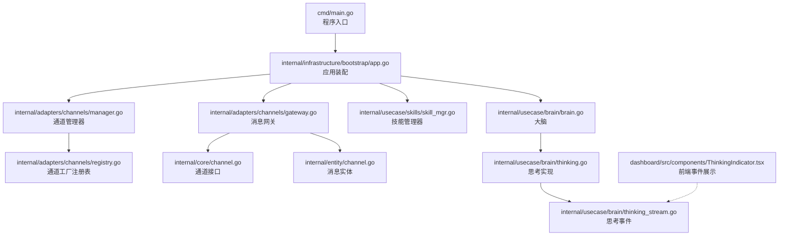
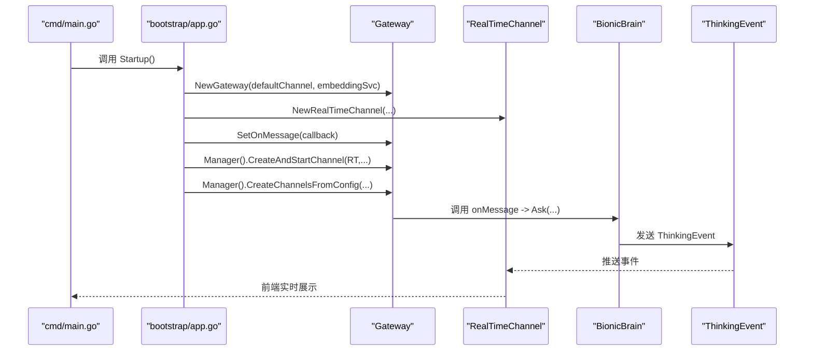
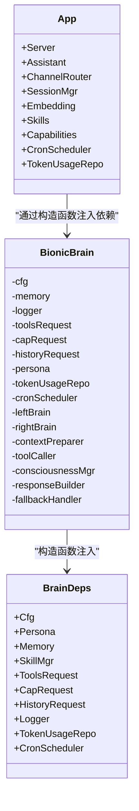
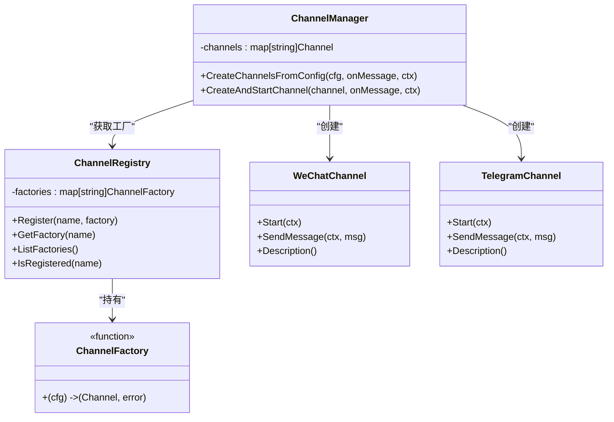
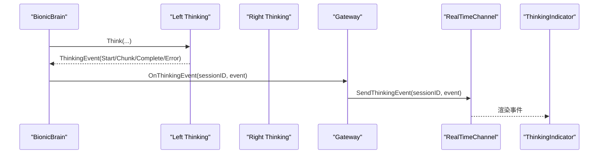
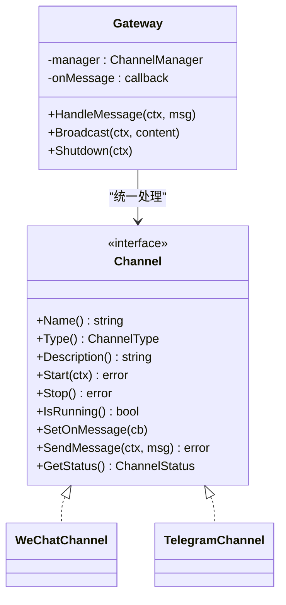
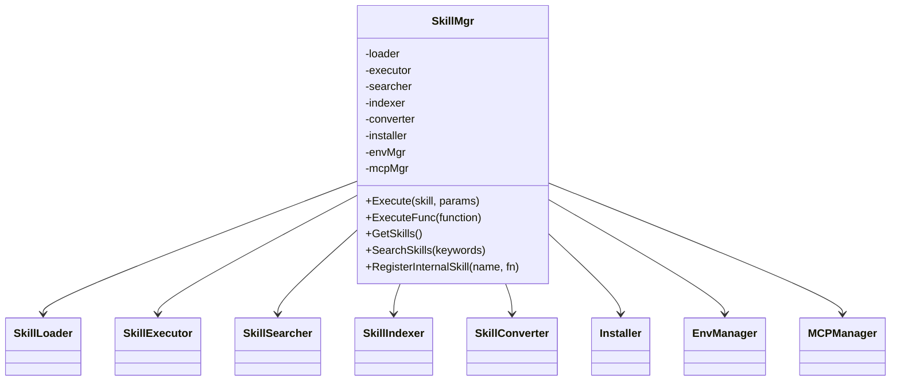
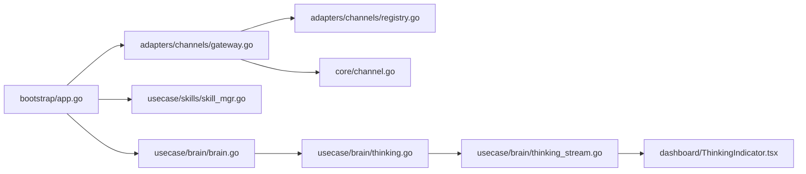

# 设计模式应用

<cite>
**本文档引用的文件**
- [cmd/main.go](file://cmd/main.go)
- [internal/infrastructure/bootstrap/app.go](file://internal/infrastructure/bootstrap/app.go)
- [internal/adapters/channels/manager.go](file://internal/adapters/channels/manager.go)
- [internal/adapters/channels/registry.go](file://internal/adapters/channels/registry.go)
- [internal/adapters/channels/gateway.go](file://internal/adapters/channels/gateway.go)
- [internal/adapters/channels/wechat.go](file://internal/adapters/channels/wechat.go)
- [internal/adapters/channels/telegramchannel.go](file://internal/adapters/channels/telegramchannel.go)
- [internal/core/channel.go](file://internal/core/channel.go)
- [internal/core/skillmgr.go](file://internal/core/skillmgr.go)
- [internal/usecase/skills/skill_mgr.go](file://internal/usecase/skills/skill_mgr.go)
- [internal/usecase/brain/brain.go](file://internal/usecase/brain/brain.go)
- [internal/usecase/brain/thinking.go](file://internal/usecase/brain/thinking.go)
- [internal/usecase/brain/thinking_stream.go](file://internal/usecase/brain/thinking_stream.go)
- [internal/entity/channel.go](file://internal/entity/channel.go)
- [internal/entity/logs.go](file://internal/entity/logs.go)
- [dashboard/src/components/ThinkingIndicator.tsx](file://dashboard/src/components/ThinkingIndicator.tsx)
</cite>

## 目录
1. [简介](#简介)
2. [项目结构](#项目结构)
3. [核心组件](#核心组件)
4. [架构总览](#架构总览)
5. [详细组件分析](#详细组件分析)
6. [依赖关系分析](#依赖关系分析)
7. [性能考虑](#性能考虑)
8. [故障排查指南](#故障排查指南)
9. [结论](#结论)

## 简介
本文件系统性梳理 MindX 在实际工程中对多种设计模式的应用与落地，重点覆盖以下模式及其实现要点：
- 依赖注入模式：通过构造函数注入核心依赖，实现模块解耦与可测试性增强
- 工厂模式：Channel 与技能的动态创建，支持配置驱动与扩展
- 观察者模式：思考事件的实时监控与前端可视化
- 策略模式：不同渠道适配器的统一处理与路由

同时给出 UML 类图、调用序列图、流程图，并提供最佳实践建议与技术权衡分析，帮助开发者在保持架构一致性的同时灵活运用这些模式。

## 项目结构
MindX 采用分层清晰的 Go 项目组织方式：
- cmd 层：程序入口，负责版本信息初始化与 CLI 启动
- internal/infrastructure/bootstrap：应用启动装配层，负责各子系统初始化与依赖注入
- internal/adapters：适配层，包含通道适配器、HTTP 处理器、CLI 命令等
- internal/usecase：用例层，封装业务逻辑（大脑、技能、记忆、会话等）
- internal/core：核心接口与数据结构
- internal/entity：领域实体
- dashboard：前端 React 控件，用于实时展示思考事件

图表来源
- [cmd/main.go](file://cmd/main.go#L1-L21)
- [internal/infrastructure/bootstrap/app.go](file://internal/infrastructure/bootstrap/app.go#L66-L434)
- [internal/adapters/channels/manager.go](file://internal/adapters/channels/manager.go#L1-L230)
- [internal/adapters/channels/gateway.go](file://internal/adapters/channels/gateway.go#L1-L510)
- [internal/adapters/channels/registry.go](file://internal/adapters/channels/registry.go#L1-L142)
- [internal/core/channel.go](file://internal/core/channel.go#L1-L45)
- [internal/entity/channel.go](file://internal/entity/channel.go#L1-L203)
- [internal/usecase/brain/thinking.go](file://internal/usecase/brain/thinking.go#L1-L800)
- [internal/usecase/brain/thinking_stream.go](file://internal/usecase/brain/thinking_stream.go#L1-L48)
- [dashboard/src/components/ThinkingIndicator.tsx](file://dashboard/src/components/ThinkingIndicator.tsx#L68-L97)

章节来源
- [cmd/main.go](file://cmd/main.go#L1-L21)
- [internal/infrastructure/bootstrap/app.go](file://internal/infrastructure/bootstrap/app.go#L66-L434)

## 核心组件
- 依赖注入（构造函数注入）：在应用启动阶段集中装配依赖，通过结构体字段承载，便于替换与测试
- 工厂模式：通道工厂注册表与各通道的 init() 注册，实现按名创建
- 观察者模式：思考事件通道与前端订阅，实现事件驱动的实时展示
- 策略模式：网关对不同通道的统一处理与路由决策

章节来源
- [internal/infrastructure/bootstrap/app.go](file://internal/infrastructure/bootstrap/app.go#L316-L380)
- [internal/adapters/channels/registry.go](file://internal/adapters/channels/registry.go#L25-L38)
- [internal/adapters/channels/gateway.go](file://internal/adapters/channels/gateway.go#L70-L272)
- [internal/usecase/brain/thinking.go](file://internal/usecase/brain/thinking.go#L65-L76)

## 架构总览
MindX 的启动流程体现了“依赖注入 + 工厂 + 观察者”的协同：
- 启动装配层负责构建嵌入式向量化服务、会话管理器、记忆系统、技能管理器、能力管理器、定时调度器等
- 通过构造函数注入到大脑与通道网关
- 通道网关使用工厂注册表动态创建各通道实例
- 大脑在推理过程中通过事件通道向前端推送思考事件

图表来源
- [cmd/main.go](file://cmd/main.go#L18-L20)
- [internal/infrastructure/bootstrap/app.go](file://internal/infrastructure/bootstrap/app.go#L347-L380)
- [internal/adapters/channels/gateway.go](file://internal/adapters/channels/gateway.go#L70-L140)
- [internal/usecase/brain/thinking.go](file://internal/usecase/brain/thinking.go#L69-L76)
- [dashboard/src/components/ThinkingIndicator.tsx](file://dashboard/src/components/ThinkingIndicator.tsx#L68-L97)

## 详细组件分析

### 依赖注入模式（构造函数注入）
- 目标：将外部依赖显式注入到对象构造函数中，降低耦合、提高可测试性
- 实现位置：
  - 应用装配层集中创建并注入依赖（向量化服务、会话管理器、记忆系统、技能管理器、能力管理器、定时调度器、Token 使用仓库等）
  - 大脑构造函数接收全局配置、记忆、技能管理器、工具请求回调、历史请求回调、日志、Token 使用仓库、定时调度器等
- 好处：
  - 明确依赖关系，便于单元测试替换桩
  - 避免全局状态，提升可维护性
- 示例路径：
  - [应用装配 Startup](file://internal/infrastructure/bootstrap/app.go#L66-L434)
  - [大脑构造 BrainDeps/NewBrain](file://internal/usecase/brain/brain.go#L22-L131)

图表来源
- [internal/usecase/brain/brain.go](file://internal/usecase/brain/brain.go#L22-L131)
- [internal/infrastructure/bootstrap/app.go](file://internal/infrastructure/bootstrap/app.go#L52-L62)

章节来源
- [internal/infrastructure/bootstrap/app.go](file://internal/infrastructure/bootstrap/app.go#L66-L434)
- [internal/usecase/brain/brain.go](file://internal/usecase/brain/brain.go#L22-L131)

### 工厂模式（Channel 与技能的动态创建）
- 目标：通过工厂函数按名称创建对象，实现配置驱动与扩展
- 实现位置：
  - 通道工厂注册表：全局注册中心持有工厂映射，通道包在 init() 中注册自身工厂
  - 通道管理器：遍历配置，按名称查找工厂并创建实例
  - 技能管理器：集中创建与装配技能相关组件（加载器、执行器、搜索器、索引器、转换器、安装器、环境管理器、MCP 管理器）
- 好处：
  - 无需修改创建逻辑即可新增通道类型
  - 降低模块间耦合，便于扩展
- 示例路径：
  - [通道工厂注册表](file://internal/adapters/channels/registry.go#L25-L38)
  - [通道管理器创建通道](file://internal/adapters/channels/manager.go#L149-L229)
  - [微信通道工厂注册](file://internal/adapters/channels/wechat.go#L24-L37)
  - [Telegram 通道工厂注册](file://internal/adapters/channels/telegramchannel.go#L19-L30)
  - [技能管理器装配](file://internal/usecase/skills/skill_mgr.go#L36-L84)

图表来源
- [internal/adapters/channels/registry.go](file://internal/adapters/channels/registry.go#L14-L38)
- [internal/adapters/channels/manager.go](file://internal/adapters/channels/manager.go#L149-L229)
- [internal/adapters/channels/wechat.go](file://internal/adapters/channels/wechat.go#L24-L37)
- [internal/adapters/channels/telegramchannel.go](file://internal/adapters/channels/telegramchannel.go#L19-L30)

章节来源
- [internal/adapters/channels/registry.go](file://internal/adapters/channels/registry.go#L14-L53)
- [internal/adapters/channels/manager.go](file://internal/adapters/channels/manager.go#L149-L229)
- [internal/adapters/channels/wechat.go](file://internal/adapters/channels/wechat.go#L24-L37)
- [internal/adapters/channels/telegramchannel.go](file://internal/adapters/channels/telegramchannel.go#L19-L30)
- [internal/usecase/skills/skill_mgr.go](file://internal/usecase/skills/skill_mgr.go#L36-L84)

### 观察者模式（思考事件的实时监控）
- 目标：通过事件通道实现思考过程的实时监控与前端可视化
- 实现位置：
  - 思考实现：在推理过程中通过事件通道发送开始、进度、片段、工具调用、结果、完成、错误等事件
  - 网关：将思考事件回调绑定到实时通道，实现实时推送
  - 前端：订阅事件并渲染
- 好处：
  - 提升用户体验，增强可观测性
  - 便于调试与问题定位
- 示例路径：
  - [思考事件发送](file://internal/usecase/brain/thinking.go#L69-L76)
  - [网关绑定思考事件回调](file://internal/infrastructure/bootstrap/app.go#L352-L359)
  - [前端事件展示组件](file://dashboard/src/components/ThinkingIndicator.tsx#L68-L97)

图表来源
- [internal/usecase/brain/thinking.go](file://internal/usecase/brain/thinking.go#L69-L76)
- [internal/infrastructure/bootstrap/app.go](file://internal/infrastructure/bootstrap/app.go#L352-L359)
- [dashboard/src/components/ThinkingIndicator.tsx](file://dashboard/src/components/ThinkingIndicator.tsx#L68-L97)

章节来源
- [internal/usecase/brain/thinking.go](file://internal/usecase/brain/thinking.go#L69-L76)
- [internal/infrastructure/bootstrap/app.go](file://internal/infrastructure/bootstrap/app.go#L352-L359)
- [dashboard/src/components/ThinkingIndicator.tsx](file://dashboard/src/components/ThinkingIndicator.tsx#L68-L97)

### 策略模式（不同渠道适配器的统一处理）
- 目标：通过统一接口与路由策略，实现对不同渠道的适配与处理
- 实现位置：
  - 通道接口：统一 Start/Stop/SendMessage/SetOnMessage 等能力
  - 网关：统一处理消息接收、转发、通道切换、广播等
  - 各具体通道：实现各自适配逻辑（如微信、Telegram 的 Webhook、Bot API 等）
- 好处：
  - 降低渠道差异带来的复杂度
  - 便于扩展新的渠道类型
- 示例路径：
  - [通道接口定义](file://internal/core/channel.go#L10-L40)
  - [网关统一处理](file://internal/adapters/channels/gateway.go#L74-L272)
  - [微信通道实现](file://internal/adapters/channels/wechat.go#L129-L158)
  - [Telegram 通道实现](file://internal/adapters/channels/telegramchannel.go#L61-L96)

图表来源
- [internal/core/channel.go](file://internal/core/channel.go#L10-L40)
- [internal/adapters/channels/gateway.go](file://internal/adapters/channels/gateway.go#L74-L272)
- [internal/adapters/channels/wechat.go](file://internal/adapters/channels/wechat.go#L129-L158)
- [internal/adapters/channels/telegramchannel.go](file://internal/adapters/channels/telegramchannel.go#L61-L96)

章节来源
- [internal/core/channel.go](file://internal/core/channel.go#L10-L40)
- [internal/adapters/channels/gateway.go](file://internal/adapters/channels/gateway.go#L74-L272)
- [internal/adapters/channels/wechat.go](file://internal/adapters/channels/wechat.go#L129-L158)
- [internal/adapters/channels/telegramchannel.go](file://internal/adapters/channels/telegramchannel.go#L61-L96)

### 技能管理器（策略模式的另一种体现）
- 目标：通过统一接口与内部组件协作，实现技能的加载、执行、搜索、索引与转换
- 实现位置：
  - 技能管理器聚合加载器、执行器、搜索器、索引器、转换器、安装器、环境管理器、MCP 管理器
  - 通过统一接口暴露 Execute/ExecuteFunc/SearchSkills/RegisterInternalSkill 等能力
- 好处：
  - 将技能生命周期与执行策略解耦
  - 支持内置技能与外部 MCP 工具的统一管理
- 示例路径：
  - [技能管理器装配与同步](file://internal/usecase/skills/skill_mgr.go#L36-L98)
  - [技能接口定义](file://internal/core/skillmgr.go#L3-L17)

图表来源
- [internal/usecase/skills/skill_mgr.go](file://internal/usecase/skills/skill_mgr.go#L20-L62)
- [internal/core/skillmgr.go](file://internal/core/skillmgr.go#L3-L17)

章节来源
- [internal/usecase/skills/skill_mgr.go](file://internal/usecase/skills/skill_mgr.go#L36-L98)
- [internal/core/skillmgr.go](file://internal/core/skillmgr.go#L3-L17)

## 依赖关系分析
- 低耦合高内聚：通道接口与具体实现分离；大脑通过依赖注入获得所需能力；网关仅依赖抽象接口
- 可观测性：思考事件通道贯穿大脑与前端，形成闭环
- 可扩展性：工厂注册表与配置驱动，新增通道无需修改既有代码

图表来源
- [internal/infrastructure/bootstrap/app.go](file://internal/infrastructure/bootstrap/app.go#L347-L380)
- [internal/adapters/channels/gateway.go](file://internal/adapters/channels/gateway.go#L1-L510)
- [internal/adapters/channels/registry.go](file://internal/adapters/channels/registry.go#L1-L142)
- [internal/core/channel.go](file://internal/core/channel.go#L1-L45)
- [internal/usecase/brain/thinking.go](file://internal/usecase/brain/thinking.go#L1-L800)
- [internal/usecase/brain/thinking_stream.go](file://internal/usecase/brain/thinking_stream.go#L1-L48)
- [dashboard/src/components/ThinkingIndicator.tsx](file://dashboard/src/components/ThinkingIndicator.tsx#L68-L97)

章节来源
- [internal/infrastructure/bootstrap/app.go](file://internal/infrastructure/bootstrap/app.go#L347-L380)
- [internal/adapters/channels/gateway.go](file://internal/adapters/channels/gateway.go#L1-L510)

## 性能考虑
- 并发与异步：通道创建与 MCP 服务器初始化采用并发与异步策略，避免阻塞启动
- 事件流：思考事件采用流式推送，前端按需渲染，降低内存压力
- 资源管理：网关在优雅关闭时等待活动消息处理完成，确保资源有序释放
- 向量化与索引：嵌入服务与技能/能力向量索引在后台运行，减少启动延迟

章节来源
- [internal/adapters/channels/manager.go](file://internal/adapters/channels/manager.go#L165-L203)
- [internal/usecase/skills/skill_mgr.go](file://internal/usecase/skills/skill_mgr.go#L294-L304)
- [internal/adapters/channels/gateway.go](file://internal/adapters/channels/gateway.go#L455-L495)

## 故障排查指南
- 通道创建失败：检查工厂是否注册、配置项是否正确、通道是否运行
  - 参考路径：[通道工厂获取与创建](file://internal/adapters/channels/manager.go#L179-L193)
- 网关消息处理异常：查看 onMessage 回调返回值与错误日志
  - 参考路径：[网关消息处理](file://internal/adapters/channels/gateway.go#L140-L148)
- 思考事件未到达前端：确认大脑是否设置了思考事件回调、实时通道是否运行
  - 参考路径：[大脑思考事件回调设置](file://internal/infrastructure/bootstrap/app.go#L352-L359)
- 技能执行失败：检查技能是否存在、执行器参数、MCP 工具注册状态
  - 参考路径：[技能执行](file://internal/usecase/skills/skill_mgr.go#L189-L202)

章节来源
- [internal/adapters/channels/manager.go](file://internal/adapters/channels/manager.go#L179-L193)
- [internal/adapters/channels/gateway.go](file://internal/adapters/channels/gateway.go#L140-L148)
- [internal/infrastructure/bootstrap/app.go](file://internal/infrastructure/bootstrap/app.go#L352-L359)
- [internal/usecase/skills/skill_mgr.go](file://internal/usecase/skills/skill_mgr.go#L189-L202)

## 结论
MindX 在实际工程中系统性地应用了依赖注入、工厂、观察者与策略等设计模式，形成了“配置驱动 + 工厂 + 观察者 + 策略”的架构风格。该模式组合带来了良好的可扩展性、可观测性与可维护性。建议在后续迭代中持续：
- 保持依赖注入的清晰边界，避免循环依赖
- 通过工厂注册表与配置文件实现零代码变更的扩展
- 强化事件通道的稳定性与前端渲染的健壮性
- 在策略选择上权衡通用性与性能，必要时引入缓存与批处理