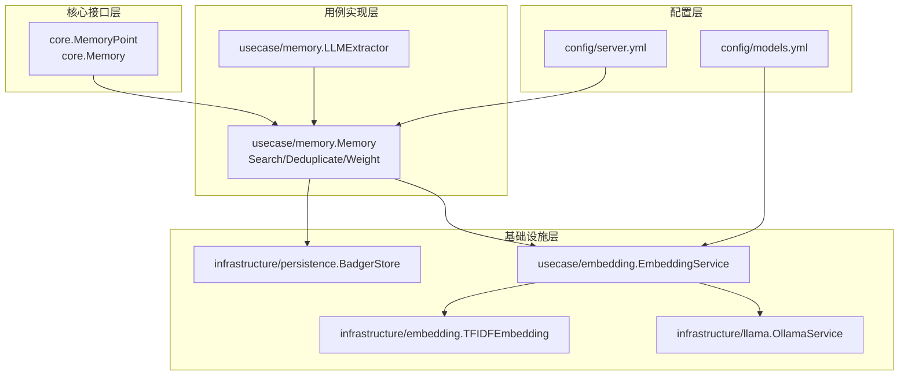
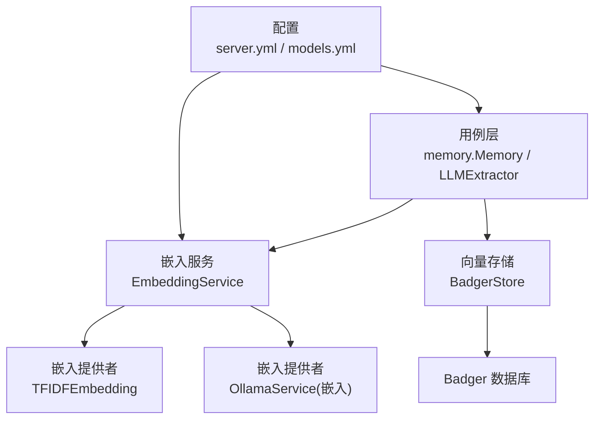
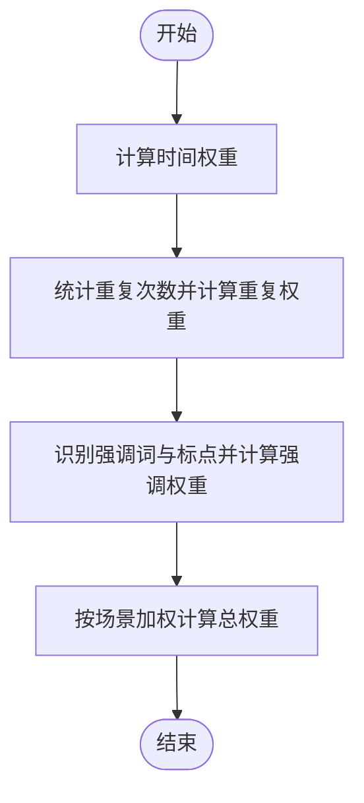
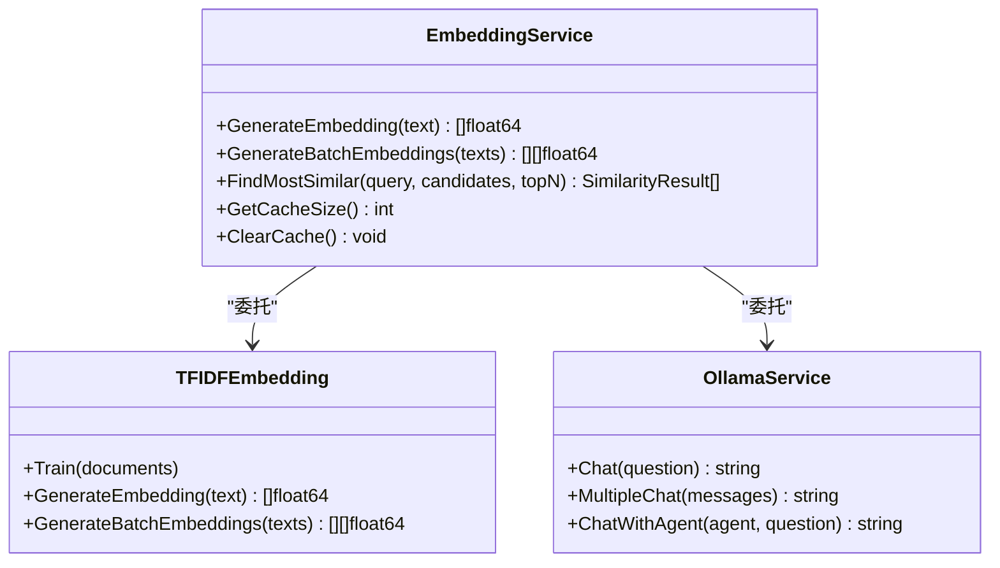
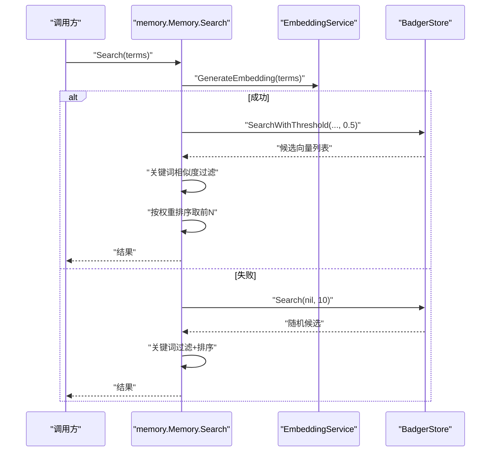
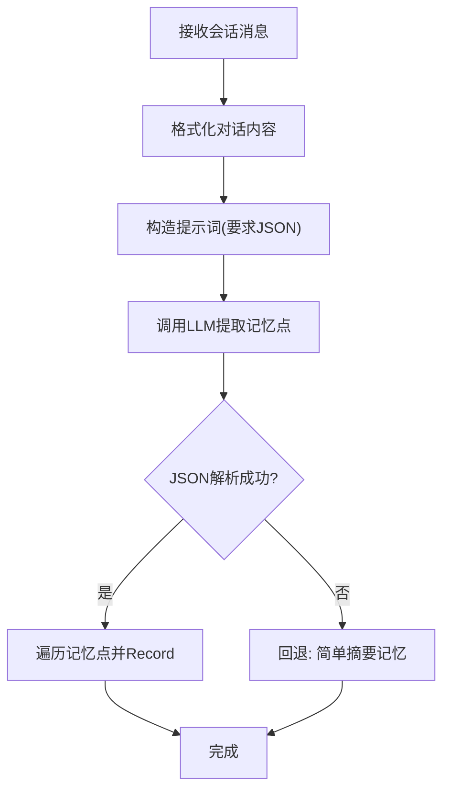
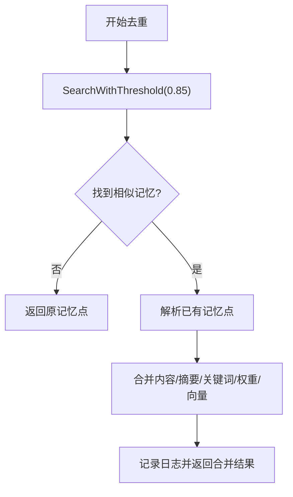
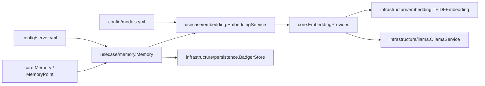

# 向量化记忆系统

<cite>
**本文引用的文件**
- [internal/core/memory.go](file://internal/core/memory.go)
- [internal/usecase/memory/memory.go](file://internal/usecase/memory/memory.go)
- [internal/usecase/memory/search.go](file://internal/usecase/memory/search.go)
- [internal/usecase/memory/extractor.go](file://internal/usecase/memory/extractor.go)
- [internal/usecase/memory/dedup.go](file://internal/usecase/memory/dedup.go)
- [internal/usecase/memory/weight.go](file://internal/usecase/memory/weight.go)
- [internal/entity/vector.go](file://internal/entity/vector.go)
- [internal/infrastructure/embedding/tfidfe.go](file://internal/infrastructure/embedding/tfidfe.go)
- [internal/infrastructure/llama/ollama.go](file://internal/infrastructure/llama/ollama.go)
- [internal/infrastructure/persistence/badger_store.go](file://internal/infrastructure/persistence/badger_store.go)
- [internal/usecase/embedding/service.go](file://internal/usecase/embedding/service.go)
- [config/server.yml](file://config/server.yml)
- [config/models.yml](file://config/models.yml)
</cite>

## 目录
1. [简介](#简介)
2. [项目结构](#项目结构)
3. [核心组件](#核心组件)
4. [架构总览](#架构总览)
5. [详细组件分析](#详细组件分析)
6. [依赖关系分析](#依赖关系分析)
7. [性能考量](#性能考量)
8. [故障排查指南](#故障排查指南)
9. [结论](#结论)
10. [附录](#附录)

## 简介
本文件面向 MindX 向量化记忆系统，系统性阐述其核心概念与实现原理，覆盖记忆点数据结构、向量嵌入生成机制、语义搜索与相似度计算、记忆提取器工作流（关键词提取、摘要生成、内容预处理）、LLM 辅助的记忆处理（智能摘要与关键词标注）、向量存储优化与查询性能提升策略，并提供使用示例与配置参数说明，以及扩展接口与自定义实现指南。

## 项目结构
MindX 的向量化记忆系统由“核心接口层”“用例实现层”“基础设施层”“配置层”组成：
- 核心接口层：定义记忆点结构与记忆系统接口，确保上层业务与底层实现解耦。
- 用例实现层：实现记忆记录、检索、去重、权重计算、LLM 提取等具体逻辑。
- 基础设施层：提供向量嵌入提供者（TF-IDF/Ollama）、向量存储（Badger）、嵌入服务缓存等。
- 配置层：提供模型与向量存储类型、默认模型、嵌入模型等配置项。

图表来源
- [internal/core/memory.go](file://internal/core/memory.go#L8-L39)
- [internal/usecase/memory/memory.go](file://internal/usecase/memory/memory.go#L18-L60)
- [internal/usecase/memory/search.go](file://internal/usecase/memory/search.go#L15-L74)
- [internal/usecase/memory/extractor.go](file://internal/usecase/memory/extractor.go#L15-L40)
- [internal/infrastructure/embedding/tfidse.go](file://internal/infrastructure/embedding/tfidse.go#L5-L144)
- [internal/infrastructure/llama/ollama.go](file://internal/infrastructure/llama/ollama.go#L13-L105)
- [internal/infrastructure/persistence/badger_store.go](file://internal/infrastructure/persistence/badger_store.go#L16-L45)
- [internal/usecase/embedding/service.go](file://internal/usecase/embedding/service.go#L13-L97)
- [config/server.yml](file://config/server.yml#L6-L20)
- [config/models.yml](file://config/models.yml#L1-L92)

章节来源
- [internal/core/memory.go](file://internal/core/memory.go#L8-L39)
- [internal/usecase/memory/memory.go](file://internal/usecase/memory/memory.go#L18-L60)
- [config/server.yml](file://config/server.yml#L6-L20)

## 核心组件
- 记忆点结构体 MemoryPoint：包含关键词、内容、摘要、向量、聚类ID、时间/重复/强调权重、创建/更新时间等字段，用于承载语义记忆。
- 记忆接口 Memory：定义记录、搜索、优化、对话聚类等能力，支撑检索优先级与权重排序。
- 向量嵌入服务 EmbeddingService：统一管理嵌入生成与缓存，支持批量生成与相似度查找。
- TF-IDF 嵌入提供者 TFIDFEmbedding：在无外部服务时提供基础向量生成与归一化。
- Ollama 嵌入服务：通过本地 Ollama API 生成嵌入（结合配置文件中的嵌入模型名）。
- 向量存储 BadgerStore：基于 Badger 的向量键值存储，支持扫描、批量写入、阈值搜索与后台 GC。
- LLM 提取器 LLMExtractor：基于 LLM 的会话记忆提取，支持 JSON 结构解析与回退策略。

章节来源
- [internal/core/memory.go](file://internal/core/memory.go#L8-L39)
- [internal/usecase/memory/memory.go](file://internal/usecase/memory/memory.go#L18-L60)
- [internal/usecase/embedding/service.go](file://internal/usecase/embedding/service.go#L13-L97)
- [internal/infrastructure/embedding/tfidse.go](file://internal/infrastructure/embedding/tfidse.go#L5-L144)
- [internal/infrastructure/llama/ollama.go](file://internal/infrastructure/llama/ollama.go#L13-L105)
- [internal/infrastructure/persistence/badger_store.go](file://internal/infrastructure/persistence/badger_store.go#L16-L45)
- [internal/usecase/memory/extractor.go](file://internal/usecase/memory/extractor.go#L15-L40)

## 架构总览
系统采用“用例层 + 基础设施层”的分层设计，用例层负责业务逻辑（记录、搜索、去重、权重），基础设施层负责可替换的嵌入与存储实现。嵌入服务统一调度嵌入提供者，存储层提供向量检索与阈值过滤，配置层决定模型与存储类型。

图表来源
- [internal/usecase/memory/memory.go](file://internal/usecase/memory/memory.go#L18-L60)
- [internal/usecase/embedding/service.go](file://internal/usecase/embedding/service.go#L13-L97)
- [internal/infrastructure/embedding/tfidse.go](file://internal/infrastructure/embedding/tfidse.go#L5-L144)
- [internal/infrastructure/llama/ollama.go](file://internal/infrastructure/llama/ollama.go#L13-L105)
- [internal/infrastructure/persistence/badger_store.go](file://internal/infrastructure/persistence/badger_store.go#L16-L45)
- [config/server.yml](file://config/server.yml#L6-L20)
- [config/models.yml](file://config/models.yml#L86-L92)

## 详细组件分析

### 记忆点数据结构与权重体系
- 字段设计：关键词、内容、摘要、向量、聚类ID、时间/重复/强调权重、创建/更新时间，支持多维权重融合与排序。
- 权重计算：
  - 时间权重：基于创建至今天数，短期记忆更高。
  - 重复权重：统计与历史记忆的关键词与摘要相似度，重复越多权重越高（上限控制）。
  - 强调权重：识别文本中的强调词与标点，提升关键信息权重。
  - 总权重：按场景（聊天/知识）加权组合，形成最终排序依据。

图表来源
- [internal/usecase/memory/weight.go](file://internal/usecase/memory/weight.go#L12-L101)

章节来源
- [internal/core/memory.go](file://internal/core/memory.go#L8-L22)
- [internal/usecase/memory/weight.go](file://internal/usecase/memory/weight.go#L12-L101)

### 向量嵌入生成机制
- 统一入口：EmbeddingService 提供 GenerateEmbedding/GenerateBatchEmbeddings，内部带 LRU 缓存，避免重复计算。
- 提供者选择：
  - TF-IDF：无外部依赖的基础实现，支持训练与字符频率向量回退。
  - Ollama：通过本地 HTTP API 与模型交互（结合配置文件中的嵌入模型名）。
- 记忆记录时若未提供向量，将组合关键词、摘要与内容后生成向量并写入存储。

图表来源
- [internal/usecase/embedding/service.go](file://internal/usecase/embedding/service.go#L13-L97)
- [internal/infrastructure/embedding/tfidse.go](file://internal/infrastructure/embedding/tfidse.go#L5-L144)
- [internal/infrastructure/llama/ollama.go](file://internal/infrastructure/llama/ollama.go#L13-L105)

章节来源
- [internal/usecase/embedding/service.go](file://internal/usecase/embedding/service.go#L13-L97)
- [internal/infrastructure/embedding/tfidse.go](file://internal/infrastructure/embedding/tfidse.go#L19-L83)
- [internal/infrastructure/llama/ollama.go](file://internal/infrastructure/llama/ollama.go#L20-L96)
- [internal/usecase/memory/memory.go](file://internal/usecase/memory/memory.go#L70-L82)

### 语义搜索与相似度计算
- 查询流程：
  1) 若嵌入服务可用，对查询词生成向量；
  2) 从存储读取全部记忆，计算余弦相似度，过滤阈值（默认 0.5）；
  3) 进一步按关键词相似度（>0.6）二次过滤；
  4) 按总权重排序，返回前 N 条（默认 3）。
- 回退策略：当嵌入服务不可用或生成失败时，回退到关键词匹配与随机取样。

图表来源
- [internal/usecase/memory/search.go](file://internal/usecase/memory/search.go#L15-L74)
- [internal/infrastructure/persistence/badger_store.go](file://internal/infrastructure/persistence/badger_store.go#L135-L198)
- [internal/usecase/embedding/service.go](file://internal/usecase/embedding/service.go#L31-L59)

章节来源
- [internal/usecase/memory/search.go](file://internal/usecase/memory/search.go#L15-L74)
- [internal/infrastructure/persistence/badger_store.go](file://internal/infrastructure/persistence/badger_store.go#L135-L198)

### 记忆提取器工作流程
- 输入：会话消息列表；
- 步骤：
  1) 格式化对话内容；
  2) 构造提示词（JSON 输出约束）；
  3) 调用 LLM 思考接口提取记忆点；
  4) 解析 JSON，失败则回退为简单摘要记忆；
  5) 写入 Memory 系统。
- 关键词与摘要生成：由 LLM 在提示词约束下完成，确保结构化输出。

图表来源
- [internal/usecase/memory/extractor.go](file://internal/usecase/memory/extractor.go#L42-L83)

章节来源
- [internal/usecase/memory/extractor.go](file://internal/usecase/memory/extractor.go#L42-L83)

### 语义去重与合并
- 去重策略：以新记忆向量为查询，在存储中按阈值（0.85）检索相似记忆；
- 合并规则：保留更完整的内容/摘要；合并关键词去重；取更高权重并增加重复权重；更新时间戳；可选使用新向量；
- 返回合并后的记忆点与是否发生合并标记。

图表来源
- [internal/usecase/memory/dedup.go](file://internal/usecase/memory/dedup.go#L12-L41)

章节来源
- [internal/usecase/memory/dedup.go](file://internal/usecase/memory/dedup.go#L12-L41)

### 向量存储优化与查询性能
- 存储实现：BadgerStore 支持：
  - 批量写入 BatchPut；
  - 带阈值的相似度检索 SearchWithThreshold；
  - 前缀扫描 Scan；
  - 后台定时 Value Log GC。
- 性能要点：
  - 嵌入服务缓存（LRU）减少重复计算；
  - 搜索阶段先向量过滤再关键词过滤，降低比较规模；
  - 存储层使用迭代器与预取参数优化扫描。

章节来源
- [internal/infrastructure/persistence/badger_store.go](file://internal/infrastructure/persistence/badger_store.go#L130-L198)
- [internal/usecase/embedding/service.go](file://internal/usecase/embedding/service.go#L31-L59)

## 依赖关系分析
- 记忆接口与实现：core.MemoryPoint 与 core.Memory 定义契约，memory.Memory 实现 Record/Search/Optimize/ClusterConversations。
- 嵌入链路：EmbeddingService -> EmbeddingProvider（TFIDF/Ollama），在 Record 与 Search 中被调用。
- 存储链路：memory.Memory 通过 Store 接口与 BadgerStore 交互，支持阈值检索与批量写入。
- 配置链路：server.yml 决定向量存储类型与默认模型，models.yml 提供可用模型列表与嵌入模型名。

图表来源
- [internal/core/memory.go](file://internal/core/memory.go#L24-L39)
- [internal/usecase/memory/memory.go](file://internal/usecase/memory/memory.go#L18-L60)
- [internal/usecase/embedding/service.go](file://internal/usecase/embedding/service.go#L13-L97)
- [internal/infrastructure/embedding/tfidse.go](file://internal/infrastructure/embedding/tfidse.go#L5-L144)
- [internal/infrastructure/llama/ollama.go](file://internal/infrastructure/llama/ollama.go#L13-L105)
- [internal/infrastructure/persistence/badger_store.go](file://internal/infrastructure/persistence/badger_store.go#L16-L45)
- [config/server.yml](file://config/server.yml#L6-L20)
- [config/models.yml](file://config/models.yml#L86-L92)

章节来源
- [internal/core/memory.go](file://internal/core/memory.go#L24-L39)
- [internal/usecase/memory/memory.go](file://internal/usecase/memory/memory.go#L18-L60)
- [internal/usecase/embedding/service.go](file://internal/usecase/embedding/service.go#L13-L97)
- [internal/infrastructure/persistence/badger_store.go](file://internal/infrastructure/persistence/badger_store.go#L16-L45)
- [config/server.yml](file://config/server.yml#L6-L20)

## 性能考量
- 嵌入缓存：EmbeddingService 使用 LRU 缓存，命中直接返回，显著降低重复文本的嵌入开销。
- 搜索两阶段过滤：先向量阈值过滤，再关键词过滤，减少后续排序成本。
- 存储优化：BadgerStore 使用迭代器与 PrefetchSize 参数，配合后台 GC，降低磁盘碎片与 IO 压力。
- 批量写入：支持批量写入，适合大规模索引预计算与导入。
- 权重计算：时间/重复/强调权重计算复杂度低，可在内存中高效完成。

## 故障排查指南
- 嵌入服务不可用：
  - 现象：Search 时回退到关键词过滤与随机取样。
  - 排查：确认嵌入提供者已正确初始化，模型名与配置一致。
- 存储异常：
  - 现象：Record 失败或 Search 返回空。
  - 排查：检查存储路径权限、Badger 数据库状态与 GC 是否正常运行。
- LLM 提取失败：
  - 现象：JSON 解析失败，触发回退记忆。
  - 排查：检查提示词格式、LLM 输出稳定性与网络连通性。
- 权重异常：
  - 现象：记忆排序不符合预期。
  - 排查：核对时间/重复/强调权重计算逻辑与场景权重比例。

章节来源
- [internal/usecase/memory/search.go](file://internal/usecase/memory/search.go#L18-L36)
- [internal/usecase/memory/memory.go](file://internal/usecase/memory/memory.go#L90-L93)
- [internal/usecase/memory/extractor.go](file://internal/usecase/memory/extractor.go#L62-L65)
- [internal/infrastructure/persistence/badger_store.go](file://internal/infrastructure/persistence/badger_store.go#L47-L63)

## 结论
MindX 向量化记忆系统通过清晰的分层设计与可插拔的嵌入/存储实现，实现了从会话到记忆点的结构化提取、向量嵌入、语义检索与权重排序的完整闭环。系统在性能方面通过缓存与两阶段过滤优化查询效率，在可靠性方面提供了回退策略与后台维护机制。结合配置文件可灵活切换模型与存储类型，满足不同部署场景需求。

## 附录

### 使用示例与配置参数说明
- 记忆记录（Record）：
  - 输入：MemoryPoint（可仅提供关键词、摘要、内容，系统会在 Record 时生成向量）。
  - 行为：若未提供向量，将组合关键词、摘要与内容后生成向量；执行语义去重；写入存储；异步清理过期记忆。
- 记忆搜索（Search）：
  - 输入：查询词。
  - 行为：生成查询向量，阈值过滤 + 关键词过滤 + 权重排序，返回前 N 条。
- LLM 提取（LLMExtractor.Extract）：
  - 输入：会话消息。
  - 行为：格式化对话、构造提示词、调用 LLM、解析 JSON 或回退为简单摘要记忆。
- 配置项（config/server.yml）：
  - vector_store.type：向量存储类型（默认 badger）。
  - embedding_model：嵌入模型名（需与 models.yml 中的模型项对应）。
  - default_model：默认大模型名。
- 模型配置（config/models.yml）：
  - 包含多种模型（本地/云端、不同规模与用途），用于嵌入与对话。

章节来源
- [internal/usecase/memory/memory.go](file://internal/usecase/memory/memory.go#L62-L107)
- [internal/usecase/memory/search.go](file://internal/usecase/memory/search.go#L15-L74)
- [internal/usecase/memory/extractor.go](file://internal/usecase/memory/extractor.go#L42-L83)
- [config/server.yml](file://config/server.yml#L6-L20)
- [config/models.yml](file://config/models.yml#L86-L92)

### 扩展接口与自定义实现指南
- 自定义嵌入提供者：
  - 实现 core.EmbeddingProvider 接口（GenerateEmbedding/GenerateBatchEmbeddings），在 EmbeddingService 中注册即可。
- 自定义存储实现：
  - 实现 core.Store 接口（Put/Get/Delete/Search/SearchWithThreshold/BatchPut/Scan/Close），替换 BadgerStore。
- 自定义提示词与提取逻辑：
  - 修改 LLMExtractor.buildPrompt 与解析结构，确保输出符合 MemoryPointResponse。
- 自定义权重策略：
  - 在 memory.Weight 相关函数中调整时间/重复/强调权重计算与场景权重比例。

章节来源
- [internal/core/embedding.go](file://internal/core/embedding.go#L3-L8)
- [internal/core/memory.go](file://internal/core/memory.go#L24-L39)
- [internal/usecase/memory/extractor.go](file://internal/usecase/memory/extractor.go#L94-L126)
- [internal/usecase/memory/weight.go](file://internal/usecase/memory/weight.go#L12-L101)