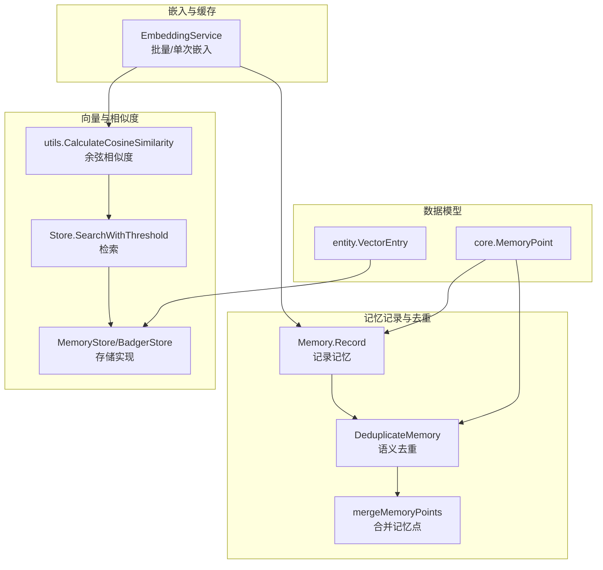
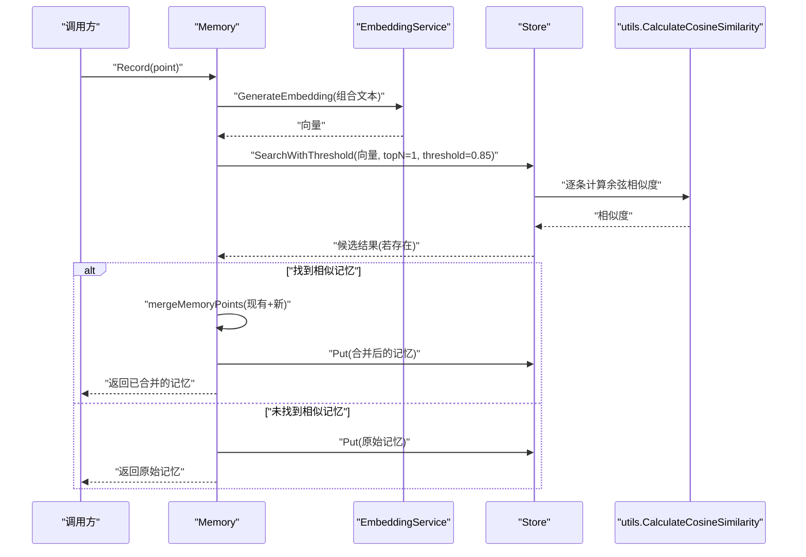
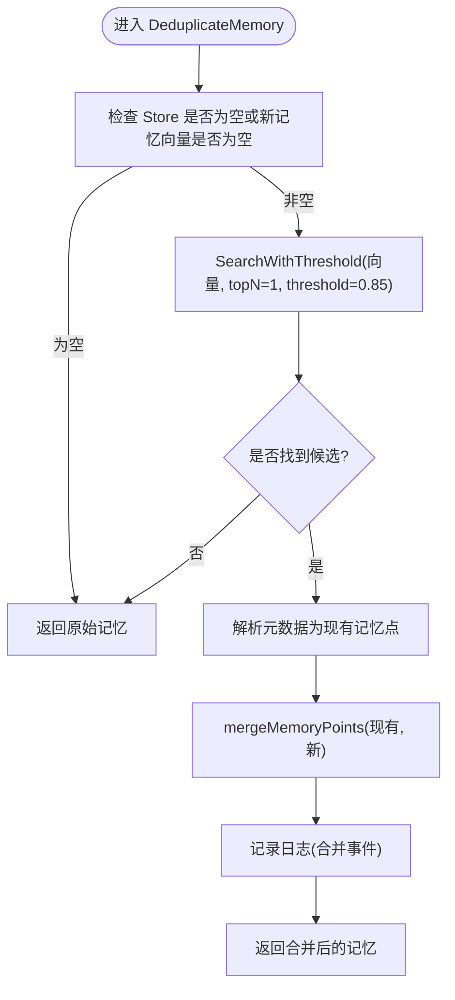
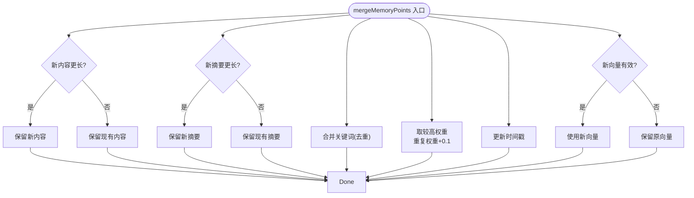
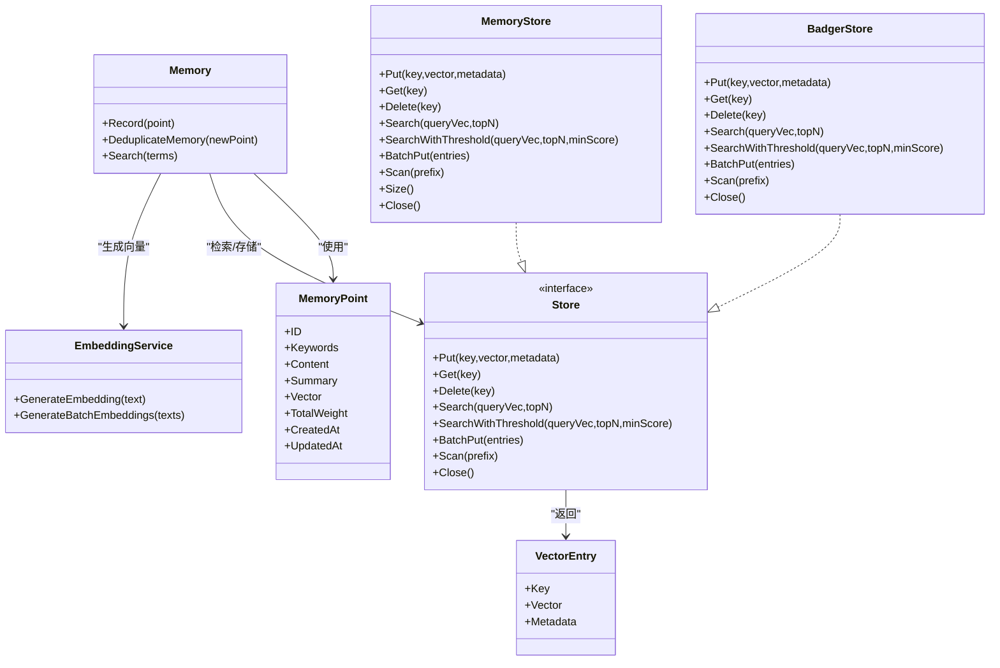

# 记忆去重机制

<cite>
**本文引用的文件**
- [internal/usecase/memory/dedup.go](file://internal/usecase/memory/dedup.go)
- [internal/usecase/memory/memory.go](file://internal/usecase/memory/memory.go)
- [internal/infrastructure/persistence/memory_store.go](file://internal/infrastructure/persistence/memory_store.go)
- [internal/utils/vector.go](file://internal/utils/vector.go)
- [internal/core/memory.go](file://internal/core/memory.go)
- [internal/entity/vector.go](file://internal/entity/vector.go)
- [internal/usecase/memory/search.go](file://internal/usecase/memory/search.go)
- [internal/usecase/memory/consolidation.go](file://internal/usecase/memory/consolidation.go)
- [internal/usecase/embedding/service.go](file://internal/usecase/embedding/service.go)
- [internal/infrastructure/persistence/badger_store.go](file://internal/infrastructure/persistence/badger_store.go)
- [internal/core/store.go](file://internal/core/store.go)
- [config/server.yml](file://config/server.yml)
- [dashboard/src/components/settings/MemorySection.tsx](file://dashboard/src/components/settings/MemorySection.tsx)
- [internal/usecase/memory/maintenance.go](file://internal/usecase/memory/maintenance.go)
- [internal/usecase/memory/memory_internal_test.go](file://internal/usecase/memory/memory_internal_test.go)
- [internal/infrastructure/persistence/memory_store_test.go](file://internal/infrastructure/persistence/memory_store_test.go)
- [internal/infrastructure/persistence/badger_store_test.go](file://internal/infrastructure/persistence/badger_store_test.go)
- [internal/usecase/training/filter.go](file://internal/usecase/training/filter.go)
- [reports/2022-02-23/重构方案/记忆模块重构方案.md](file://reports/2022-02-23/重构方案/记忆模块重构方案.md)
- [reports/2022-02-22/glm-5/技术细节评估报告.md](file://reports/2022-02-22/glm-5/技术细节评估报告.md)
</cite>

## 目录
1. [简介](#简介)
2. [项目结构](#项目结构)
3. [核心组件](#核心组件)
4. [架构总览](#架构总览)
5. [详细组件分析](#详细组件分析)
6. [依赖关系分析](#依赖关系分析)
7. [性能考量](#性能考量)
8. [故障排查指南](#故障排查指南)
9. [结论](#结论)
10. [附录](#附录)

## 简介
本文件系统性阐述 MindX 记忆去重机制的设计与实现，覆盖以下关键主题：
- 语义去重的算法原理与实现策略：相似度阈值设定、向量距离计算、去重判断逻辑
- 记忆合并流程：内容整合、权重更新与冲突解决
- 去重性能优化：批量处理、索引加速与内存管理
- 配置参数与调优：相似度阈值、权重因子、误判处理
- 去重效果监控与评估：指标与方法
- 扩展接口与自定义算法：接口契约与实现指南

## 项目结构
围绕“记忆去重”的核心路径主要涉及：
- 记忆记录与去重入口：internal/usecase/memory/memory.go
- 语义去重与合并：internal/usecase/memory/dedup.go
- 向量相似度计算工具：internal/utils/vector.go
- 存储层接口与实现：internal/core/store.go、internal/infrastructure/persistence/memory_store.go、internal/infrastructure/persistence/badger_store.go
- 记忆点数据模型：internal/core/memory.go、internal/entity/vector.go
- 搜索与关键词过滤：internal/usecase/memory/search.go
- 批量嵌入与聚类：internal/usecase/embedding/service.go、internal/usecase/memory/consolidation.go
- 配置与前端设置项：config/server.yml、dashboard/src/components/settings/MemorySection.tsx
- 维护与清理：internal/usecase/memory/maintenance.go
- 测试与评估报告：internal/usecase/memory/memory_internal_test.go、internal/infrastructure/persistence/memory_store_test.go、internal/infrastructure/persistence/badger_store_test.go、internal/usecase/training/filter.go、reports/2022-02-23/重构方案/记忆模块重构方案.md、reports/2022-02-22/glm-5/技术细节评估报告.md

图表来源
- [internal/usecase/memory/memory.go](file://internal/usecase/memory/memory.go#L62-L107)
- [internal/usecase/memory/dedup.go](file://internal/usecase/memory/dedup.go#L15-L41)
- [internal/utils/vector.go](file://internal/utils/vector.go#L12-L29)
- [internal/infrastructure/persistence/memory_store.go](file://internal/infrastructure/persistence/memory_store.go#L83-L124)
- [internal/usecase/embedding/service.go](file://internal/usecase/embedding/service.go#L31-L59)
- [internal/core/memory.go](file://internal/core/memory.go#L8-L22)
- [internal/entity/vector.go](file://internal/entity/vector.go#L5-L10)

章节来源
- [internal/usecase/memory/memory.go](file://internal/usecase/memory/memory.go#L1-L112)
- [internal/usecase/memory/dedup.go](file://internal/usecase/memory/dedup.go#L1-L87)
- [internal/utils/vector.go](file://internal/utils/vector.go#L1-L71)
- [internal/infrastructure/persistence/memory_store.go](file://internal/infrastructure/persistence/memory_store.go#L1-L177)
- [internal/core/store.go](file://internal/core/store.go#L5-L15)
- [internal/core/memory.go](file://internal/core/memory.go#L1-L40)
- [internal/entity/vector.go](file://internal/entity/vector.go#L1-L11)
- [internal/usecase/embedding/service.go](file://internal/usecase/embedding/service.go#L1-L59)

## 核心组件
- Memory：记忆系统主体，负责记录、去重、存储与维护
- DeduplicateMemory：语义去重主流程，基于向量相似度阈值判断并合并
- mergeMemoryPoints：合并策略，优先保留更完整的内容与更高权重，并合并关键词
- Store 接口与实现：抽象存储能力，MemoryStore（内存）与 BadgerStore（持久化）
- EmbeddingService：统一的嵌入服务，支持缓存与批量嵌入
- utils.CalculateCosineSimilarity：余弦相似度计算
- MemoryPoint：记忆点数据模型，包含向量、关键词、权重等

章节来源
- [internal/usecase/memory/memory.go](file://internal/usecase/memory/memory.go#L18-L60)
- [internal/usecase/memory/dedup.go](file://internal/usecase/memory/dedup.go#L12-L41)
- [internal/infrastructure/persistence/memory_store.go](file://internal/infrastructure/persistence/memory_store.go#L13-L30)
- [internal/infrastructure/persistence/badger_store.go](file://internal/infrastructure/persistence/badger_store.go#L71-L133)
- [internal/usecase/embedding/service.go](file://internal/usecase/embedding/service.go#L13-L29)
- [internal/utils/vector.go](file://internal/utils/vector.go#L10-L29)
- [internal/core/memory.go](file://internal/core/memory.go#L8-L22)

## 架构总览
下图展示从“记录记忆”到“语义去重与合并”的端到端流程，以及与存储层、嵌入服务的交互。

图表来源
- [internal/usecase/memory/memory.go](file://internal/usecase/memory/memory.go#L62-L107)
- [internal/usecase/memory/dedup.go](file://internal/usecase/memory/dedup.go#L15-L41)
- [internal/infrastructure/persistence/memory_store.go](file://internal/infrastructure/persistence/memory_store.go#L83-L124)
- [internal/utils/vector.go](file://internal/utils/vector.go#L12-L29)
- [internal/usecase/embedding/service.go](file://internal/usecase/embedding/service.go#L31-L59)

## 详细组件分析

### 语义去重算法与实现
- 相似度阈值：在去重阶段使用阈值 0.85，仅当与现有记忆的向量相似度超过该阈值才触发合并
- 向量距离计算：采用余弦相似度，范围 [−1, 1]，数值越大越相似
- 去重判断逻辑：通过 Store.SearchWithThreshold 获取最相似的候选；解析元数据得到现有记忆点；调用合并函数
- 合并策略：
  - 内容与摘要：保留更长的版本
  - 关键词：去重后合并
  - 权重：取较高者，并对重复出现的记忆点增加重复权重
  - 时间戳：更新为当前时间
  - 向量：优先使用新向量（若存在）

图表来源
- [internal/usecase/memory/dedup.go](file://internal/usecase/memory/dedup.go#L15-L41)
- [internal/infrastructure/persistence/memory_store.go](file://internal/infrastructure/persistence/memory_store.go#L83-L124)
- [internal/utils/vector.go](file://internal/utils/vector.go#L12-L29)

章节来源
- [internal/usecase/memory/dedup.go](file://internal/usecase/memory/dedup.go#L12-L87)
- [internal/utils/vector.go](file://internal/utils/vector.go#L10-L29)
- [internal/infrastructure/persistence/memory_store.go](file://internal/infrastructure/persistence/memory_store.go#L83-L124)

### 记忆合并处理流程
- 内容整合：比较新旧内容长度，保留更长版本
- 摘要整合：同上
- 关键词合并：构建去重集合后再转回切片
- 权重更新：取较高者，重复出现的记忆点额外加权
- 时间戳更新：更新为当前时间
- 向量替换：若新记忆向量有效，则替换为新向量

图表来源
- [internal/usecase/memory/dedup.go](file://internal/usecase/memory/dedup.go#L43-L86)

章节来源
- [internal/usecase/memory/dedup.go](file://internal/usecase/memory/dedup.go#L43-L86)

### 搜索与关键词过滤
- 搜索流程：先尝试生成查询向量，若失败则退化为关键词过滤与权重排序
- 关键词相似度：对候选记忆点的关键词与查询词做相似度判定，阈值通常高于 0.6
- 排序：按总权重降序返回前 N 条

章节来源
- [internal/usecase/memory/search.go](file://internal/usecase/memory/search.go#L15-L93)

### 批量嵌入与聚类（间接影响去重）
- 批量嵌入：EmbeddingService 支持批量生成向量，减少重复调用开销
- 聚类：对多条记忆进行 K-Means 聚类，生成合并后的记忆点，间接降低后续去重压力

章节来源
- [internal/usecase/embedding/service.go](file://internal/usecase/embedding/service.go#L31-L59)
- [internal/usecase/memory/consolidation.go](file://internal/usecase/memory/consolidation.go#L68-L113)

### 数据模型与存储契约
- MemoryPoint：包含 ID、关键词、内容、摘要、向量、权重、时间戳等字段
- VectorEntry：存储键、向量与元数据
- Store 接口：定义 Put、Get、Delete、Search、SearchWithThreshold、BatchPut、Scan、Close 等方法

章节来源
- [internal/core/memory.go](file://internal/core/memory.go#L8-L22)
- [internal/entity/vector.go](file://internal/entity/vector.go#L5-L10)
- [internal/core/store.go](file://internal/core/store.go#L5-L15)

## 依赖关系分析
- Memory 依赖 EmbeddingService 生成向量，依赖 Store 进行检索与存储
- Store 的具体实现 MemoryStore 与 BadgerStore 均通过 utils.CalculateCosineSimilarity 计算相似度
- mergeMemoryPoints 依赖 MemoryPoint 字段进行合并决策
- 搜索路径中，若嵌入失败，会退化为关键词过滤与权重排序

图表来源
- [internal/usecase/memory/memory.go](file://internal/usecase/memory/memory.go#L18-L60)
- [internal/usecase/embedding/service.go](file://internal/usecase/embedding/service.go#L13-L29)
- [internal/core/store.go](file://internal/core/store.go#L5-L15)
- [internal/infrastructure/persistence/memory_store.go](file://internal/infrastructure/persistence/memory_store.go#L13-L30)
- [internal/infrastructure/persistence/badger_store.go](file://internal/infrastructure/persistence/badger_store.go#L71-L133)
- [internal/core/memory.go](file://internal/core/memory.go#L8-L22)
- [internal/entity/vector.go](file://internal/entity/vector.go#L5-L10)

章节来源
- [internal/usecase/memory/memory.go](file://internal/usecase/memory/memory.go#L18-L60)
- [internal/infrastructure/persistence/memory_store.go](file://internal/infrastructure/persistence/memory_store.go#L13-L30)
- [internal/infrastructure/persistence/badger_store.go](file://internal/infrastructure/persistence/badger_store.go#L71-L133)
- [internal/core/store.go](file://internal/core/store.go#L5-L15)
- [internal/core/memory.go](file://internal/core/memory.go#L8-L22)
- [internal/entity/vector.go](file://internal/entity/vector.go#L5-L10)

## 性能考量
- 相似度计算复杂度：O(N×D)，其中 N 为候选数量，D 为向量维度
- 当前实现为线性扫描，适合中小规模记忆库
- 优化建议：
  - 索引加速：引入近似最近邻（ANN）索引（如 Faiss、HNSW），将检索复杂度降至 O(logN) 或更低
  - 批量处理：利用 EmbeddingService 的批量嵌入能力，减少网络往返与重复计算
  - 内存管理：控制 topN 与 minScore，避免返回过大候选集；定期清理过期记忆
  - 缓存：EmbeddingService 已内置 LRU 缓存，可进一步结合热点数据预热

章节来源
- [internal/utils/vector.go](file://internal/utils/vector.go#L12-L29)
- [internal/infrastructure/persistence/memory_store.go](file://internal/infrastructure/persistence/memory_store.go#L83-L124)
- [internal/usecase/embedding/service.go](file://internal/usecase/embedding/service.go#L21-L29)
- [internal/usecase/memory/maintenance.go](file://internal/usecase/memory/maintenance.go#L149-L169)

## 故障排查指南
- 常见问题与定位
  - 嵌入失败：检查 EmbeddingService 提供者配置与网络连通性
  - 去重未生效：确认新记忆向量是否生成；核对阈值是否过高；查看日志中的合并事件
  - 搜索退化：当嵌入失败时，系统会退化为关键词过滤与权重排序，检查关键词质量
  - 存储异常：检查 Store 的 Put/Get/Delete/Scan 行为，关注并发读写锁与序列化错误
- 单元测试参考
  - 记忆去重与合并逻辑：internal/usecase/memory/memory_internal_test.go
  - 存储层检索与阈值过滤：internal/infrastructure/persistence/memory_store_test.go、internal/infrastructure/persistence/badger_store_test.go
  - 向量相似度计算：internal/usecase/memory/memory_internal_test.go

章节来源
- [internal/usecase/memory/memory_internal_test.go](file://internal/usecase/memory/memory_internal_test.go#L454-L493)
- [internal/infrastructure/persistence/memory_store_test.go](file://internal/infrastructure/persistence/memory_store_test.go#L80-L102)
- [internal/infrastructure/persistence/badger_store_test.go](file://internal/infrastructure/persistence/badger_store_test.go#L96-L112)

## 结论
MindX 的记忆去重机制以“向量相似度 + 合并策略”为核心，具备清晰的流程与可扩展的接口。当前实现简洁可靠，适合中小规模场景；随着数据规模增长，建议引入 ANN 索引与更完善的批量处理策略，以进一步提升性能与稳定性。

## 附录

### 配置参数与调优
- 相似度阈值
  - 记忆去重：阈值 0.85（硬编码于去重逻辑）
  - 搜索关键词过滤：阈值 0.6（硬编码于搜索逻辑）
  - 建议：将阈值作为可配置项，支持按场景动态调整
- 权重因子
  - 重复权重：合并时对重复出现的记忆点增加权重（+0.1）
  - 建议：将权重因子与场景比例参数化，便于调优
- 向量维度与模型
  - 默认嵌入模型：由配置文件指定
  - 建议：根据硬件资源选择合适维度与模型，平衡精度与性能
- 配置文件位置与示例
  - config/server.yml：包含向量存储类型、嵌入模型等基础配置
  - 前端设置项：dashboard/src/components/settings/MemorySection.tsx

章节来源
- [config/server.yml](file://config/server.yml#L6-L18)
- [internal/usecase/memory/dedup.go](file://internal/usecase/memory/dedup.go#L21-L24)
- [internal/usecase/memory/search.go](file://internal/usecase/memory/search.go#L76-L93)
- [internal/usecase/memory/dedup.go](file://internal/usecase/memory/dedup.go#L77-L78)
- [dashboard/src/components/settings/MemorySection.tsx](file://dashboard/src/components/settings/MemorySection.tsx#L1-L10)

### 去重效果监控与评估
- 指标建议
  - 去重命中率：合并记忆数 / 新增记忆数
  - 误判率：被错误合并的记忆数 / 合并记忆数
  - 平均相似度：合并前后向量相似度分布
  - 性能指标：检索耗时、吞吐量、内存占用
- 评估方法
  - A/B 实验：对比不同阈值与权重因子的效果
  - 人工抽样：对合并结果进行人工评估
  - 日志审计：记录合并事件与相似度分布

### 扩展接口与自定义去重算法
- 接口契约
  - Store 接口：统一检索与存储能力，便于替换底层实现
  - MemoryPoint：标准化记忆点结构，便于扩展字段与合并策略
- 自定义去重算法实现指南
  - 设计思路：定义去重器接口，封装相似度计算与合并策略
  - 集成方式：在 Memory.Record 中注入自定义去重器，替代默认实现
  - 参考重构方案：报告中提供了“记忆记录器”与“去重器”的分层设计思路

章节来源
- [internal/core/store.go](file://internal/core/store.go#L5-L15)
- [internal/core/memory.go](file://internal/core/memory.go#L8-L22)
- [reports/2022-02-23/重构方案/记忆模块重构方案.md](file://reports/2022-02-23/重构方案/记忆模块重构方案.md#L567-L642)

### 训练数据去重（对比参考）
- 训练数据去重采用向量相似度阈值（如 0.85）进行去重，并在冲突时保留更长的 completion
- 与记忆去重的差异：训练去重更强调内容长度与批处理，记忆去重更强调合并策略与权重更新

章节来源
- [internal/usecase/training/filter.go](file://internal/usecase/training/filter.go#L167-L185)