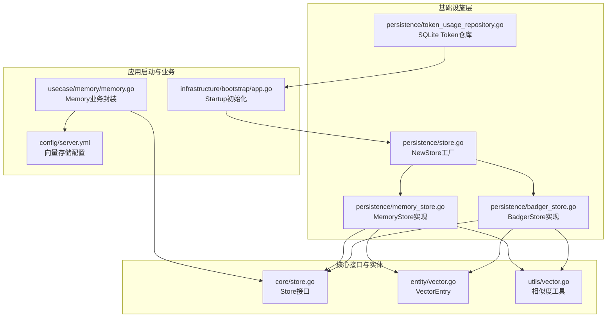
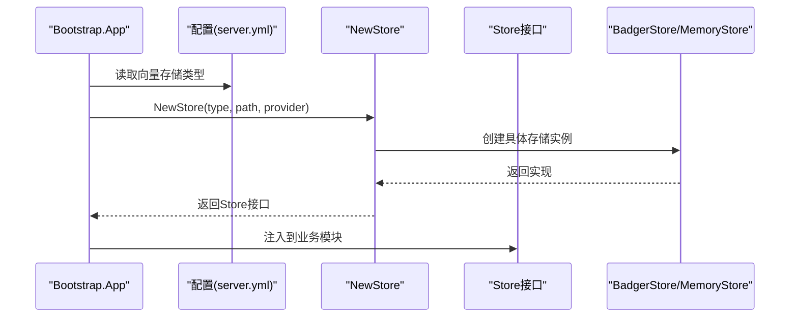
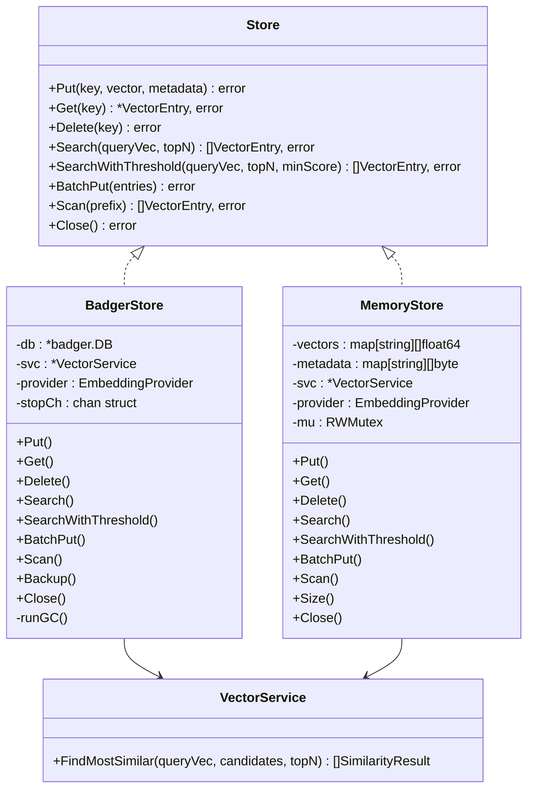
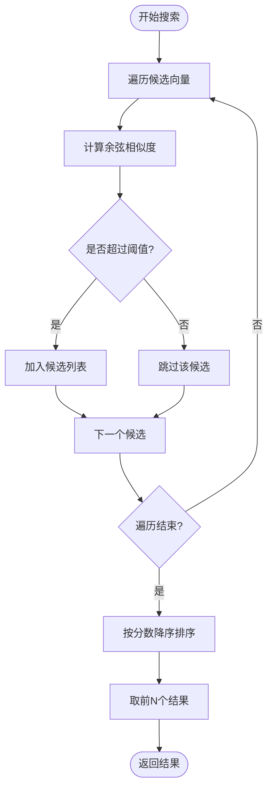
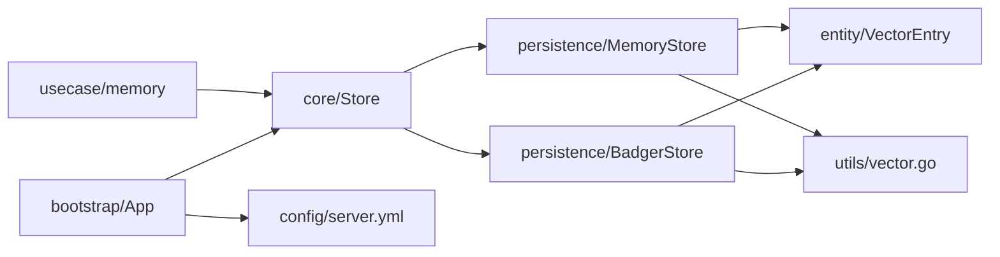

# 记忆存储管理

<cite>
**本文档引用的文件**
- [store.go](file://internal/infrastructure/persistence/store.go)
- [badger_store.go](file://internal/infrastructure/persistence/badger_store.go)
- [memory_store.go](file://internal/infrastructure/persistence/memory_store.go)
- [store.go](file://internal/core/store.go)
- [vector.go](file://internal/entity/vector.go)
- [vector.go](file://internal/utils/vector.go)
- [app.go](file://internal/infrastructure/bootstrap/app.go)
- [memory.go](file://internal/usecase/memory/memory.go)
- [server.yml](file://config/server.yml)
- [config.go](file://internal/config/config.go)
- [token_usage_repository.go](file://internal/infrastructure/persistence/token_usage_repository.go)
- [badger_store_test.go](file://internal/infrastructure/persistence/badger_store_test.go)
- [memory_store_test.go](file://internal/infrastructure/persistence/memory_store_test.go)
</cite>

## 目录
1. [简介](#简介)
2. [项目结构](#项目结构)
3. [核心组件](#核心组件)
4. [架构总览](#架构总览)
5. [详细组件分析](#详细组件分析)
6. [依赖关系分析](#依赖关系分析)
7. [性能考虑](#性能考虑)
8. [故障排查指南](#故障排查指南)
9. [结论](#结论)
10. [附录](#附录)

## 简介
本文件面向 MindX 记忆存储管理系统，系统采用分层架构设计，通过统一的 Store 接口抽象，支持 BadgerDB 和内存两种存储后端。BadgerDB 后端提供持久化能力，具备自动压缩、垃圾回收等机制；内存后端用于开发测试或临时场景。系统还集成了向量相似度计算服务，并提供备份与恢复能力。

## 项目结构
存储相关的核心代码位于 internal/infrastructure/persistence 目录，配合 core 接口、entity 数据模型、utils 工具函数，以及 usecase/memory 的业务封装。应用启动时根据配置选择存储类型并初始化。

**图表来源**
- [store.go](file://internal/infrastructure/persistence/store.go#L25-L43)
- [badger_store.go](file://internal/infrastructure/persistence/badger_store.go#L16-L45)
- [memory_store.go](file://internal/infrastructure/persistence/memory_store.go#L13-L30)
- [store.go](file://internal/core/store.go#L5-L15)
- [vector.go](file://internal/entity/vector.go#L5-L10)
- [vector.go](file://internal/utils/vector.go#L10-L29)
- [app.go](file://internal/infrastructure/bootstrap/app.go#L138-L146)
- [memory.go](file://internal/usecase/memory/memory.go#L18-L60)
- [server.yml](file://config/server.yml#L6-L7)

**章节来源**
- [store.go](file://internal/infrastructure/persistence/store.go#L25-L43)
- [app.go](file://internal/infrastructure/bootstrap/app.go#L138-L146)
- [server.yml](file://config/server.yml#L6-L7)

## 核心组件
- Store 接口：定义统一的向量存储能力，包括 Put、Get、Delete、Search、SearchWithThreshold、BatchPut、Scan、Close。
- BadgerStore：基于 BadgerDB 的持久化实现，内置后台 Value Log GC 定时任务，支持批量写入和前缀扫描。
- MemoryStore：基于内存的临时存储实现，适合测试与开发场景。
- VectorService：向量相似度计算服务，封装相似度查找逻辑。
- VectorEntry：向量条目数据模型，包含键、向量和元数据。
- 工具函数：余弦相似度计算与 TopN 选择算法。
- 应用初始化：Startup 中根据配置创建存储实例并注入到业务模块。

**章节来源**
- [store.go](file://internal/core/store.go#L5-L15)
- [badger_store.go](file://internal/infrastructure/persistence/badger_store.go#L16-L45)
- [memory_store.go](file://internal/infrastructure/persistence/memory_store.go#L13-L30)
- [vector.go](file://internal/entity/vector.go#L5-L10)
- [vector.go](file://internal/utils/vector.go#L10-L29)
- [app.go](file://internal/infrastructure/bootstrap/app.go#L138-L146)

## 架构总览
系统采用“接口抽象 + 多实现”的架构模式。启动流程中，根据配置选择存储类型，BadgerStore 默认启用 CompactL0OnClose 与 NumCompactors 参数以优化写入与压缩行为；同时启动后台定时 GC 任务，定期执行 RunValueLogGC 降低 Value Log 空间占用。

**图表来源**
- [app.go](file://internal/infrastructure/bootstrap/app.go#L138-L146)
- [server.yml](file://config/server.yml#L6-L7)
- [store.go](file://internal/infrastructure/persistence/store.go#L25-L43)

## 详细组件分析

### Store 接口与工厂
- Store 接口定义了向量存储的标准能力集合，确保不同实现对上层业务透明。
- NewStore 工厂根据配置选择存储类型：badger 或 memory，默认 memory。当类型为 badger 且路径为空时，默认使用 data/vectors。

**章节来源**
- [store.go](file://internal/core/store.go#L5-L15)
- [store.go](file://internal/infrastructure/persistence/store.go#L25-L43)

### BadgerStore 实现
- 初始化：使用 DefaultOptions 设置 Logger 为空、CompactL0OnClose 为 true、NumCompactors 为 2，随后打开数据库并启动后台 GC 协程。
- 写入/读取/删除：使用事务封装 Set/Get/Delete，确保原子性。
- 搜索：遍历所有条目，计算余弦相似度，按阈值过滤后返回 TopN。
- 批量写入：在单个事务内循环写入，提升吞吐。
- 前缀扫描：基于迭代器的 Seek+Prefix 机制，支持高效前缀检索。
- 备份：调用 db.Backup 将数据库备份写入 Writer。
- 关闭：关闭停止信号通道并关闭底层数据库。

**图表来源**
- [store.go](file://internal/core/store.go#L5-L15)
- [badger_store.go](file://internal/infrastructure/persistence/badger_store.go#L16-L45)
- [memory_store.go](file://internal/infrastructure/persistence/memory_store.go#L13-L30)
- [store.go](file://internal/infrastructure/persistence/store.go#L45-L57)

**章节来源**
- [badger_store.go](file://internal/infrastructure/persistence/badger_store.go#L24-L45)
- [badger_store.go](file://internal/infrastructure/persistence/badger_store.go#L65-L99)
- [badger_store.go](file://internal/infrastructure/persistence/badger_store.go#L101-L121)
- [badger_store.go](file://internal/infrastructure/persistence/badger_store.go#L123-L129)
- [badger_store.go](file://internal/infrastructure/persistence/badger_store.go#L130-L198)
- [badger_store.go](file://internal/infrastructure/persistence/badger_store.go#L206-L209)
- [badger_store.go](file://internal/infrastructure/persistence/badger_store.go#L211-L229)
- [badger_store.go](file://internal/infrastructure/persistence/badger_store.go#L231-L263)

### MemoryStore 实现
- 并发安全：使用互斥锁保护读写操作。
- 写入/读取/删除：直接操作内存映射，支持元数据 JSON 序列化。
- 搜索：遍历内存中的所有向量，计算相似度并返回 TopN。
- 批量写入：批量更新内存映射。
- 前缀扫描：遍历键前缀匹配。
- 关闭：空实现。

**章节来源**
- [memory_store.go](file://internal/infrastructure/persistence/memory_store.go#L13-L30)
- [memory_store.go](file://internal/infrastructure/persistence/memory_store.go#L32-L48)
- [memory_store.go](file://internal/infrastructure/persistence/memory_store.go#L50-L65)
- [memory_store.go](file://internal/infrastructure/persistence/memory_store.go#L67-L76)
- [memory_store.go](file://internal/infrastructure/persistence/memory_store.go#L78-L124)
- [memory_store.go](file://internal/infrastructure/persistence/memory_store.go#L131-L148)
- [memory_store.go](file://internal/infrastructure/persistence/memory_store.go#L157-L176)

### 向量相似度与搜索流程
- 余弦相似度：计算两个向量的余弦相似度，范围 [-1, 1]。
- TopN 选择：对候选结果按分数排序，取前 N 个。
- 搜索阈值：支持最小分数阈值过滤低质量结果。

**图表来源**
- [vector.go](file://internal/utils/vector.go#L10-L29)
- [vector.go](file://internal/utils/vector.go#L31-L70)
- [badger_store.go](file://internal/infrastructure/persistence/badger_store.go#L135-L198)
- [memory_store.go](file://internal/infrastructure/persistence/memory_store.go#L83-L124)

**章节来源**
- [vector.go](file://internal/utils/vector.go#L10-L29)
- [vector.go](file://internal/utils/vector.go#L31-L70)
- [badger_store.go](file://internal/infrastructure/persistence/badger_store.go#L135-L198)
- [memory_store.go](file://internal/infrastructure/persistence/memory_store.go#L83-L124)

### 应用启动与配置集成
- 启动流程：Startup 中加载配置，初始化嵌入服务，创建向量存储实例（默认 badger），并将存储注入到记忆系统、能力管理器、技能管理器等模块。
- 配置文件：server.yml 中的 vector_store.type 决定存储类型；usecase/memory 在缺失数据路径时默认 data/memory。

**章节来源**
- [app.go](file://internal/infrastructure/bootstrap/app.go#L119-L146)
- [server.yml](file://config/server.yml#L6-L7)
- [memory.go](file://internal/usecase/memory/memory.go#L35-L44)

## 依赖关系分析
- 接口与实现解耦：core.Store 作为抽象接口，BadgerStore/MemoryStore 提供具体实现，便于替换与扩展。
- 数据模型：VectorEntry 作为统一的数据载体，贯穿存储与相似度计算。
- 工具函数：utils.CalculateCosineSimilarity 与 utils.FindMostSimilar 被 BadgerStore 与 MemoryStore 共同使用。
- 启动依赖：Bootstrap 通过 NewStore 工厂创建存储实例，再注入到各业务模块。

**图表来源**
- [store.go](file://internal/core/store.go#L5-L15)
- [badger_store.go](file://internal/infrastructure/persistence/badger_store.go#L16-L45)
- [memory_store.go](file://internal/infrastructure/persistence/memory_store.go#L13-L30)
- [vector.go](file://internal/entity/vector.go#L5-L10)
- [vector.go](file://internal/utils/vector.go#L10-L29)
- [app.go](file://internal/infrastructure/bootstrap/app.go#L138-L146)
- [memory.go](file://internal/usecase/memory/memory.go#L18-L60)

**章节来源**
- [store.go](file://internal/core/store.go#L5-L15)
- [badger_store.go](file://internal/infrastructure/persistence/badger_store.go#L16-L45)
- [memory_store.go](file://internal/infrastructure/persistence/memory_store.go#L13-L30)
- [vector.go](file://internal/entity/vector.go#L5-L10)
- [vector.go](file://internal/utils/vector.go#L10-L29)
- [app.go](file://internal/infrastructure/bootstrap/app.go#L138-L146)
- [memory.go](file://internal/usecase/memory/memory.go#L18-L60)

## 性能考虑
- BadgerDB 参数
  - CompactL0OnClose：关闭时压缩 L0 层，减少后续写放大。
  - NumCompactors：设置压缩器数量，平衡 CPU 与 IO。
  - PrefetchSize：迭代器预取大小，影响扫描性能。
- 后台 GC
  - 定时器每 10 分钟触发一次 RunValueLogGC，持续执行直到返回错误，降低 Value Log 空间占用。
- 批量写入
  - BatchPut 在单个事务内循环写入，减少事务开销，提升吞吐。
- 并发与锁
  - MemoryStore 使用互斥锁保护读写，避免竞态；在高并发场景建议优先使用 BadgerStore。
- 相似度计算
  - 对所有候选进行相似度计算，复杂度 O(N*M)，其中 N 为候选数，M 为向量维度；可通过索引或近似最近邻方法进一步优化（当前实现为线性扫描）。

**章节来源**
- [badger_store.go](file://internal/infrastructure/persistence/badger_store.go#L26-L29)
- [badger_store.go](file://internal/infrastructure/persistence/badger_store.go#L48-L63)
- [badger_store.go](file://internal/infrastructure/persistence/badger_store.go#L140-L142)
- [memory_store.go](file://internal/infrastructure/persistence/memory_store.go#L19)

## 故障排查指南
- 存储初始化失败
  - 检查配置文件中的 vector_store.type 是否正确，确认数据路径是否存在且有写权限。
  - 查看启动日志中关于“创建向量存储失败”或“打开 Badger 数据库失败”的错误信息。
- 查询无结果
  - 确认已写入向量，检查 SearchWithThreshold 的 minScore 是否过高导致过滤过多。
  - 对于 BadgerStore，确认迭代器遍历正常；对于 MemoryStore，确认内存映射中存在对应键。
- 性能异常
  - 观察后台 GC 是否频繁触发，适当调整 CompactL0OnClose 与 NumCompactors。
  - 对大量写入场景使用 BatchPut，避免多次事务开销。
- 数据一致性
  - 写入/删除均在事务中执行，确保原子性；如遇异常，检查事务提交与错误返回。
- 备份与恢复
  - 使用 Backup 将数据库备份到 Writer；恢复时需确保目标环境与 Badger 版本兼容。

**章节来源**
- [badger_store.go](file://internal/infrastructure/persistence/badger_store.go#L206-L209)
- [badger_store.go](file://internal/infrastructure/persistence/badger_store.go#L96-L98)
- [badger_store.go](file://internal/infrastructure/persistence/badger_store.go#L124-L128)

## 结论
MindX 记忆存储系统通过 Store 接口实现了对 BadgerDB 与内存存储的统一抽象，结合向量相似度计算与后台 GC 机制，提供了可扩展、可维护的存储方案。生产环境推荐使用 BadgerStore，配合合理的参数与批量写入策略，以获得更好的性能与稳定性。

## 附录

### 存储配置选项与说明
- 配置文件位置：config/server.yml
- vector_store.type：存储类型，badger 或 memory（默认 memory）
- 数据路径
  - BadgerStore：由 NewStore 工厂在路径为空时默认创建 data/vectors。
  - usecase/memory：在缺失时默认 data/memory。
- 其他配置：embedding_model、default_model 等与向量生成相关，间接影响存储写入的向量生成。

**章节来源**
- [server.yml](file://config/server.yml#L6-L7)
- [store.go](file://internal/infrastructure/persistence/store.go#L29-L31)
- [memory.go](file://internal/usecase/memory/memory.go#L38-L40)

### 生命周期管理与维护
- 启动：Startup 初始化嵌入服务与存储实例。
- 运行：后台 GC 定时执行，定期清理 Value Log。
- 关闭：调用 Close 释放资源，MemoryStore 为空实现，BadgerStore 关闭数据库连接。

**章节来源**
- [app.go](file://internal/infrastructure/bootstrap/app.go#L119-L146)
- [badger_store.go](file://internal/infrastructure/persistence/badger_store.go#L48-L63)
- [badger_store.go](file://internal/infrastructure/persistence/badger_store.go#L200-L204)
- [memory_store.go](file://internal/infrastructure/persistence/memory_store.go#L126-L129)

### 备份与恢复策略
- 备份：BadgerStore 提供 Backup 方法，将数据库备份写入 io.Writer。
- 恢复：需确保目标环境与 Badger 版本兼容，恢复后重新启动应用并验证数据完整性。

**章节来源**
- [badger_store.go](file://internal/infrastructure/persistence/badger_store.go#L206-L209)

### 测试用例参考
- BadgerStore：Put/Get/Delete/Scan/Backup 等基本能力测试。
- MemoryStore：Put/Get/Delete/Scan/批量写入与元数据序列化测试。

**章节来源**
- [badger_store_test.go](file://internal/infrastructure/persistence/badger_store_test.go#L21-L61)
- [memory_store_test.go](file://internal/infrastructure/persistence/memory_store_test.go#L10-L50)
- [memory_store_test.go](file://internal/infrastructure/persistence/memory_store_test.go#L156-L176)