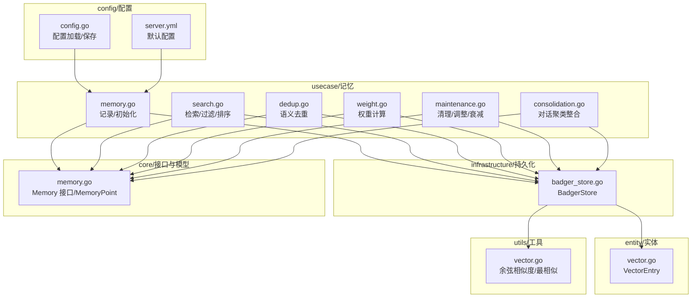
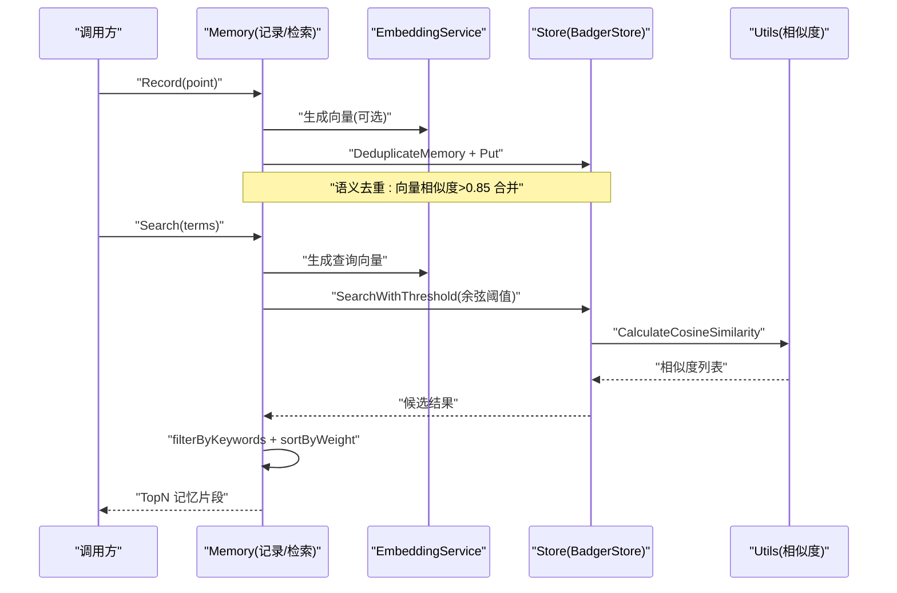
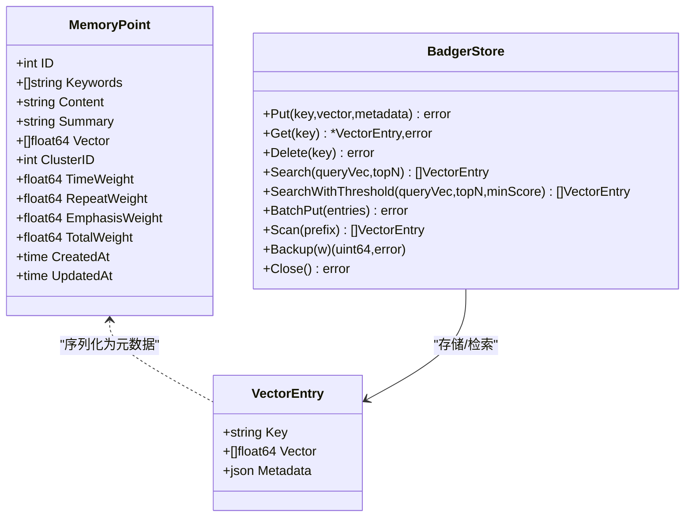
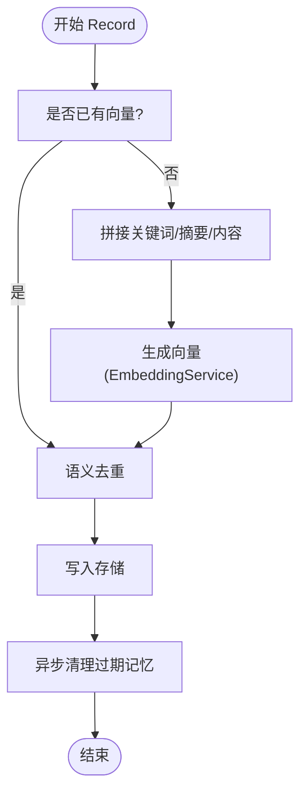
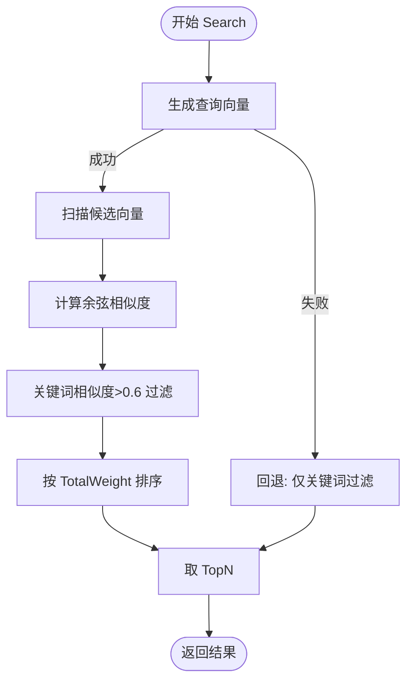
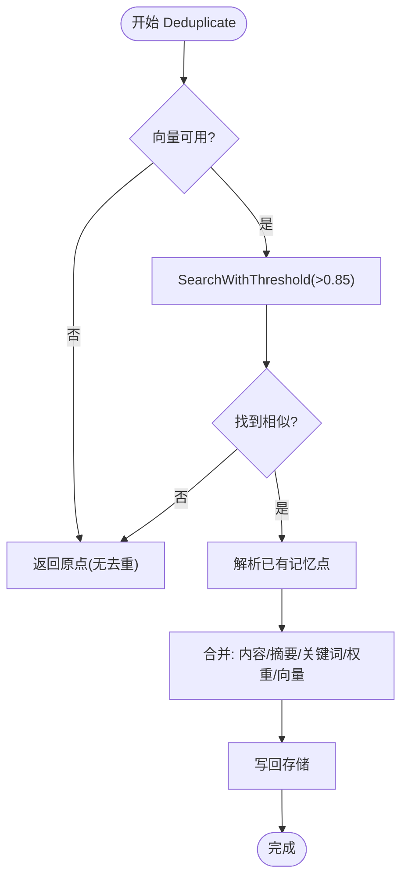
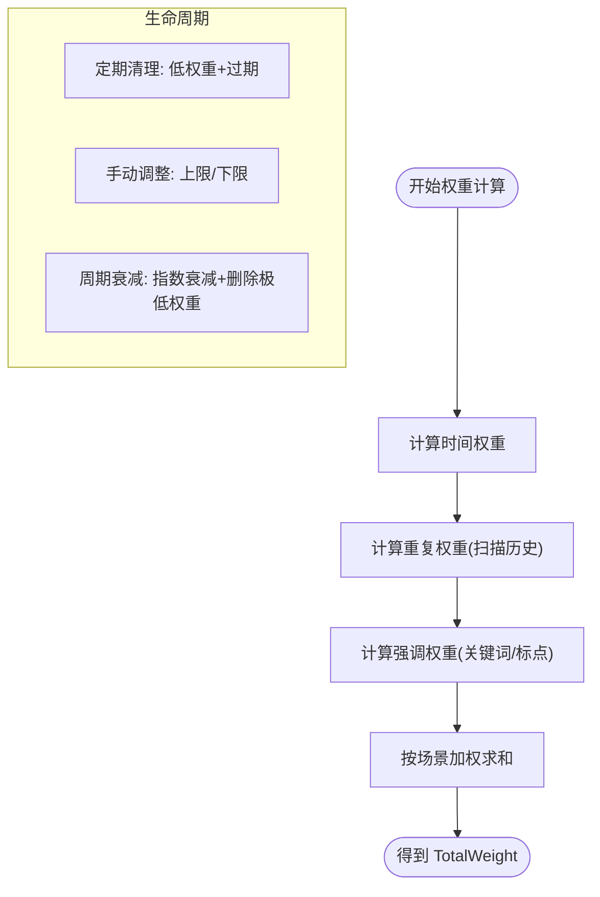
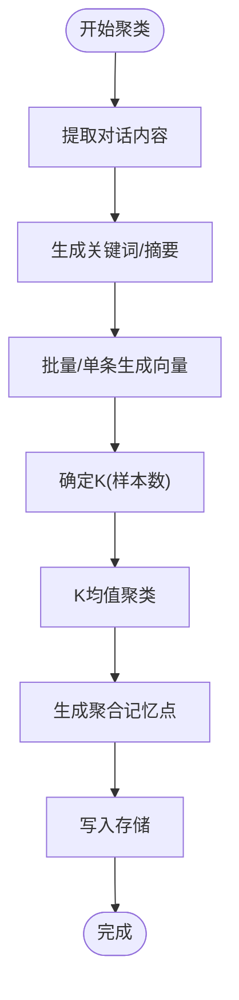
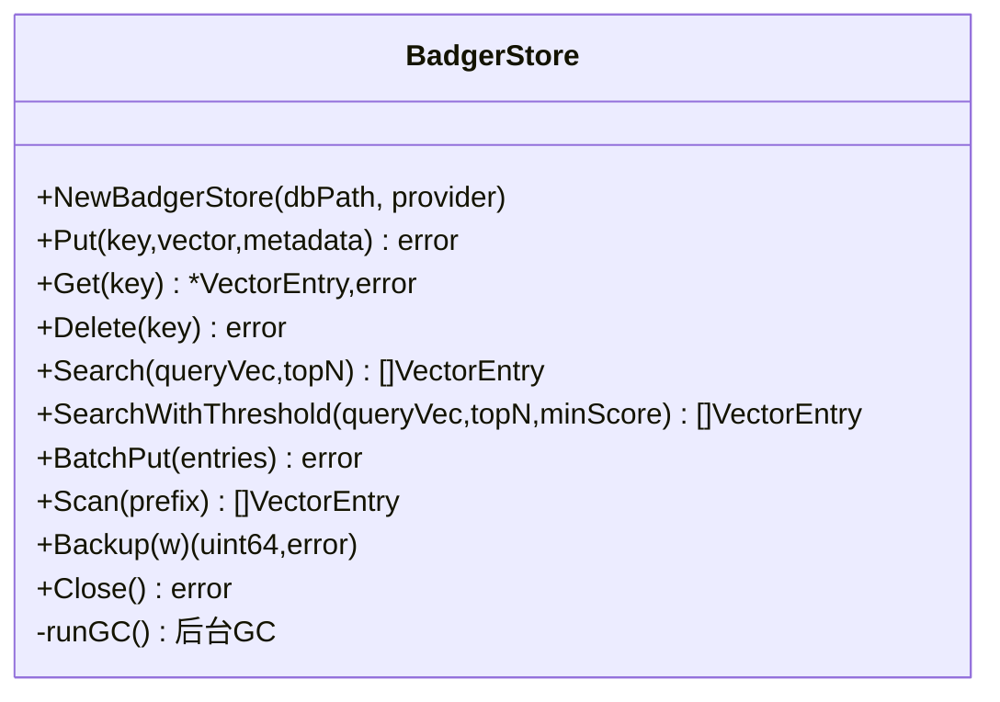
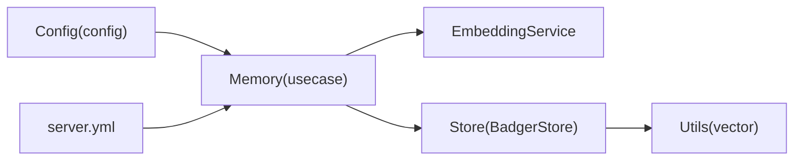

# 记忆存储系统

<cite>
**本文引用的文件**
- [internal/core/memory.go](file://internal/core/memory.go)
- [internal/usecase/memory/memory.go](file://internal/usecase/memory/memory.go)
- [internal/usecase/memory/search.go](file://internal/usecase/memory/search.go)
- [internal/usecase/memory/dedup.go](file://internal/usecase/memory/dedup.go)
- [internal/usecase/memory/weight.go](file://internal/usecase/memory/weight.go)
- [internal/usecase/memory/maintenance.go](file://internal/usecase/memory/maintenance.go)
- [internal/usecase/memory/consolidation.go](file://internal/usecase/memory/consolidation.go)
- [internal/infrastructure/persistence/badger_store.go](file://internal/infrastructure/persistence/badger_store.go)
- [internal/entity/vector.go](file://internal/entity/vector.go)
- [internal/utils/vector.go](file://internal/utils/vector.go)
- [internal/config/config.go](file://internal/config/config.go)
- [config/server.yml](file://config/server.yml)
- [internal/usecase/memory/test_utils.go](file://internal/usecase/memory/test_utils.go)
</cite>

## 目录
1. [简介](#简介)
2. [项目结构](#项目结构)
3. [核心组件](#核心组件)
4. [架构总览](#架构总览)
5. [详细组件分析](#详细组件分析)
6. [依赖关系分析](#依赖关系分析)
7. [性能考量](#性能考量)
8. [故障排查指南](#故障排查指南)
9. [结论](#结论)
10. [附录](#附录)

## 简介
本文件面向 MindX 记忆存储系统，围绕“向量化记忆”的设计理念与实现进行系统化说明。内容涵盖记忆的提取、存储、去重与权重计算机制，BadgerDB 集成与优化策略，语义搜索与相似度匹配流程，以及记忆生命周期管理（自动清理、整理与优化）。同时提供配置项说明、性能调优建议、使用示例与最佳实践，并给出扩展与定制方法，帮助开发者快速理解并高效使用该系统。

## 项目结构
记忆系统位于 internal/usecase/memory 下，采用分层设计：
- usecase 层负责业务逻辑：记录、检索、去重、权重计算、聚类整合、维护与优化
- infrastructure 层负责持久化：BadgerStore 提供向量与元数据存储、检索与批处理
- core 层定义接口与数据模型：Memory 接口与 MemoryPoint 结构体
- entity 层定义通用实体：VectorEntry、相似度结果等
- utils 层提供向量工具：余弦相似度与最相似结果选择
- config 层提供配置加载与保存能力

图表来源
- [internal/usecase/memory/memory.go](file://internal/usecase/memory/memory.go#L1-L112)
- [internal/infrastructure/persistence/badger_store.go](file://internal/infrastructure/persistence/badger_store.go#L1-L264)
- [internal/core/memory.go](file://internal/core/memory.go#L1-L40)
- [internal/entity/vector.go](file://internal/entity/vector.go#L1-L11)
- [internal/utils/vector.go](file://internal/utils/vector.go#L1-L71)
- [internal/config/config.go](file://internal/config/config.go#L1-L294)
- [config/server.yml](file://config/server.yml#L1-L21)

章节来源
- [internal/usecase/memory/memory.go](file://internal/usecase/memory/memory.go#L1-L112)
- [internal/infrastructure/persistence/badger_store.go](file://internal/infrastructure/persistence/badger_store.go#L1-L264)
- [internal/core/memory.go](file://internal/core/memory.go#L1-L40)
- [internal/entity/vector.go](file://internal/entity/vector.go#L1-L11)
- [internal/utils/vector.go](file://internal/utils/vector.go#L1-L71)
- [internal/config/config.go](file://internal/config/config.go#L1-L294)
- [config/server.yml](file://config/server.yml#L1-L21)

## 核心组件
- Memory 接口与 MemoryPoint 数据模型：定义记忆点字段（关键词、内容、摘要、向量、聚类ID、权重、时间戳），以及记录、检索、优化、聚类等操作契约
- Memory 实现：封装向量化记忆的完整生命周期，包括向量生成、语义去重、存储、检索、权重计算、清理与优化
- BadgerStore：基于 BadgerDB 的向量与元数据存储，支持 Put/Get/Delete/Search/BatchPut/Scan/Backup/Close 等操作
- VectorEntry：统一的向量条目结构，包含键、向量与元数据
- 工具函数：余弦相似度计算与“最相似”结果选择

章节来源
- [internal/core/memory.go](file://internal/core/memory.go#L1-L40)
- [internal/usecase/memory/memory.go](file://internal/usecase/memory/memory.go#L1-L112)
- [internal/infrastructure/persistence/badger_store.go](file://internal/infrastructure/persistence/badger_store.go#L1-L264)
- [internal/entity/vector.go](file://internal/entity/vector.go#L1-L11)
- [internal/utils/vector.go](file://internal/utils/vector.go#L1-L71)

## 架构总览
记忆系统以“usecase 层业务逻辑 + infrastructure 层持久化 + core/entity/utils 支撑层”的方式组织。检索路径从 usecase 层发起，通过 embedding 服务生成向量或直接使用已有向量，随后在持久化层进行相似度匹配与过滤，最终返回按权重排序的记忆片段。

图表来源
- [internal/usecase/memory/memory.go](file://internal/usecase/memory/memory.go#L62-L107)
- [internal/usecase/memory/search.go](file://internal/usecase/memory/search.go#L15-L74)
- [internal/infrastructure/persistence/badger_store.go](file://internal/infrastructure/persistence/badger_store.go#L135-L198)
- [internal/utils/vector.go](file://internal/utils/vector.go#L10-L29)

## 详细组件分析

### 数据模型与存储结构
- MemoryPoint 字段：包含关键词、内容、摘要、向量、聚类ID、时间/重复/强调/总权重，以及创建与更新时间
- VectorEntry：键、向量、元数据三元组，作为 BadgerStore 的存储单元
- 存储键规则：使用时间戳纳秒级唯一值作为键，避免冲突
- 元数据映射：将 MemoryPoint 序列化后作为 VectorEntry 的元数据存储

图表来源
- [internal/core/memory.go](file://internal/core/memory.go#L8-L22)
- [internal/entity/vector.go](file://internal/entity/vector.go#L5-L10)
- [internal/infrastructure/persistence/badger_store.go](file://internal/infrastructure/persistence/badger_store.go#L65-L198)

章节来源
- [internal/core/memory.go](file://internal/core/memory.go#L8-L22)
- [internal/entity/vector.go](file://internal/entity/vector.go#L5-L10)
- [internal/infrastructure/persistence/badger_store.go](file://internal/infrastructure/persistence/badger_store.go#L65-L198)

### 记忆提取与向量化
- 记录流程：若未提供向量，则组合关键词、摘要与内容生成向量；随后进行语义去重；最后写入存储
- 批量嵌入：聚类整合阶段对多条对话文本批量生成向量，失败时回退单条生成
- 关键词与摘要：关键词通过分词与简单清洗生成；摘要优先使用话题，否则自动生成

图表来源
- [internal/usecase/memory/memory.go](file://internal/usecase/memory/memory.go#L62-L107)
- [internal/usecase/memory/consolidation.go](file://internal/usecase/memory/consolidation.go#L71-L96)

章节来源
- [internal/usecase/memory/memory.go](file://internal/usecase/memory/memory.go#L62-L107)
- [internal/usecase/memory/consolidation.go](file://internal/usecase/memory/consolidation.go#L71-L96)

### 语义搜索与相似度匹配
- 查询向量生成：对检索词生成向量；若失败则回退到仅关键词过滤
- 相似度计算：遍历候选向量，计算余弦相似度，过滤低于阈值的结果
- 过滤与排序：先按关键词相似度过滤（阈值>0.6），再按总权重排序，返回 TopN
- 工具函数：提供余弦相似度与“最相似”结果选择，确保性能与准确性

图表来源
- [internal/usecase/memory/search.go](file://internal/usecase/memory/search.go#L15-L74)
- [internal/infrastructure/persistence/badger_store.go](file://internal/infrastructure/persistence/badger_store.go#L135-L198)
- [internal/utils/vector.go](file://internal/utils/vector.go#L31-L70)

章节来源
- [internal/usecase/memory/search.go](file://internal/usecase/memory/search.go#L15-L74)
- [internal/infrastructure/persistence/badger_store.go](file://internal/infrastructure/persistence/badger_store.go#L135-L198)
- [internal/utils/vector.go](file://internal/utils/vector.go#L31-L70)

### 语义去重与合并策略
- 去重阈值：相似度阈值 0.85，命中即合并
- 合并规则：保留更长的内容/摘要；关键词集合去重合并；取更高权重并增加重复权重；更新时间戳；可选使用新向量
- 日志与返回：记录合并事件，返回合并后的记忆点与是否发生合并

图表来源
- [internal/usecase/memory/dedup.go](file://internal/usecase/memory/dedup.go#L12-L41)

章节来源
- [internal/usecase/memory/dedup.go](file://internal/usecase/memory/dedup.go#L12-L41)

### 权重计算与生命周期管理
- 时间权重：基于天数的指数衰减函数，区分短期(≤3天)与长期衰减
- 重复权重：统计与当前文本关键词与摘要相似的历史记忆数量，限制上限
- 强调权重：识别中文强调词与标点，叠加权重
- 总权重：按场景加权求和（聊天/知识/默认）
- 生命周期：定期清理低权重与无效记忆；支持手动调整权重；周期性权重衰减

图表来源
- [internal/usecase/memory/weight.go](file://internal/usecase/memory/weight.go#L12-L101)
- [internal/usecase/memory/maintenance.go](file://internal/usecase/memory/maintenance.go#L15-L147)

章节来源
- [internal/usecase/memory/weight.go](file://internal/usecase/memory/weight.go#L12-L101)
- [internal/usecase/memory/maintenance.go](file://internal/usecase/memory/maintenance.go#L15-L147)

### 对话聚类与记忆整合
- 内容提取：拼接对话消息，截断至合理长度
- 关键词与摘要：优先使用话题，否则自动生成
- 向量生成：批量优先，失败回退单条
- K 均值聚类：根据样本数量确定最优簇数，将相似记忆聚合
- 聚合点生成：合并内容、统计关键词频次、平均各权重、取时间窗边界、平均向量
- 存储：逐条或聚合点写入存储

图表来源
- [internal/usecase/memory/consolidation.go](file://internal/usecase/memory/consolidation.go#L17-L216)

章节来源
- [internal/usecase/memory/consolidation.go](file://internal/usecase/memory/consolidation.go#L17-L216)

### BadgerDB 集成与优化策略
- 初始化：设置 CompactL0OnClose、NumCompactors 等参数，启用后台 Value Log GC
- 操作：Put/Get/Delete/Search/BatchPut/Scan/Backup/Close
- 检索：遍历候选、计算余弦相似度、按阈值过滤、返回 TopN
- 批处理：批量写入提升吞吐
- 备份：提供数据库备份接口

图表来源
- [internal/infrastructure/persistence/badger_store.go](file://internal/infrastructure/persistence/badger_store.go#L24-L204)

章节来源
- [internal/infrastructure/persistence/badger_store.go](file://internal/infrastructure/persistence/badger_store.go#L24-L204)

## 依赖关系分析
- usecase/memory 依赖 embedding 服务生成向量，依赖 store 进行持久化
- store 依赖 utils 进行相似度计算
- config 提供全局配置加载与保存，server.yml 提供默认配置

图表来源
- [internal/usecase/memory/memory.go](file://internal/usecase/memory/memory.go#L28-L53)
- [internal/infrastructure/persistence/badger_store.go](file://internal/infrastructure/persistence/badger_store.go#L135-L198)
- [internal/utils/vector.go](file://internal/utils/vector.go#L10-L29)
- [internal/config/config.go](file://internal/config/config.go#L13-L37)
- [config/server.yml](file://config/server.yml#L6-L7)

章节来源
- [internal/usecase/memory/memory.go](file://internal/usecase/memory/memory.go#L28-L53)
- [internal/infrastructure/persistence/badger_store.go](file://internal/infrastructure/persistence/badger_store.go#L135-L198)
- [internal/utils/vector.go](file://internal/utils/vector.go#L10-L29)
- [internal/config/config.go](file://internal/config/config.go#L13-L37)
- [config/server.yml](file://config/server.yml#L6-L7)

## 性能考量
- 向量生成
  - 优先使用批量嵌入，失败时回退单条，平衡吞吐与稳定性
  - 控制输入文本长度，避免超长导致向量质量下降
- 检索性能
  - 设置合适的 minScore 阈值，减少候选集规模
  - 使用 PrefetchSize 与迭代器前缀扫描优化
  - TopN 限制返回数量，降低排序开销
- 存储优化
  - 启用后台 GC，定期压缩与回收
  - 批量写入提升吞吐
- 权重与去重
  - 合理设置去重阈值，避免过度合并
  - 定期清理低权重与无效记忆，保持索引紧凑

## 故障排查指南
- 记录失败
  - 检查向量生成是否成功，确认 embedding 服务可用
  - 查看存储写入错误日志，定位键冲突或磁盘空间问题
- 检索异常
  - 若生成查询向量失败，系统会回退到关键词过滤模式
  - 检查候选向量是否存在、维度是否一致
- 去重无效
  - 确认相似度阈值设置合理
  - 检查已有记忆点是否具备有效向量
- 清理与优化
  - 定期执行清理与权重衰减任务
  - 监控存储大小与 GC 行为，必要时调整 Compactor 参数

章节来源
- [internal/usecase/memory/memory.go](file://internal/usecase/memory/memory.go#L90-L107)
- [internal/usecase/memory/search.go](file://internal/usecase/memory/search.go#L22-L36)
- [internal/usecase/memory/dedup.go](file://internal/usecase/memory/dedup.go#L20-L24)
- [internal/usecase/memory/maintenance.go](file://internal/usecase/memory/maintenance.go#L15-L49)

## 结论
MindX 记忆存储系统通过“向量化 + 语义去重 + 多维权重 + 生命周期管理”的组合，实现了高效、可扩展的记忆检索与管理能力。BadgerDB 提供了可靠的本地向量与元数据存储，配合批量嵌入与相似度计算，满足多样化的应用场景。通过合理的配置与调优，可在保证检索质量的同时兼顾性能与资源占用。

## 附录

### 配置选项与默认值
- 向量存储类型：默认 badger
- 存储路径：默认 data/memory
- 嵌入模型：默认 qllama/bge-small-zh-v1.5:latest
- 默认模型：默认 qwen3:0.6b
- Token 预留与预算：预留输出 Token、最小历史轮数、单轮平均 Token 数

章节来源
- [config/server.yml](file://config/server.yml#L6-L20)
- [internal/usecase/memory/memory.go](file://internal/usecase/memory/memory.go#L35-L40)

### 使用示例与最佳实践
- 记录记忆
  - 准备关键词、摘要与内容，必要时提供向量
  - 调用 Record，系统自动去重与写入
- 检索记忆
  - 调用 Search，系统返回 TopN 结果
  - 若嵌入服务不可用，系统回退到关键词过滤
- 聚类整合
  - 对多轮对话调用 ClusterConversations，系统自动聚类并写入
- 权重调整
  - 使用 AdjustMemoryWeight 对指定记忆点权重进行倍增/缩放
- 清理与优化
  - 定期执行 CleanupExpiredMemories 与 DecayWeights
  - 通过 Optimize 触发清理流程

章节来源
- [internal/usecase/memory/memory.go](file://internal/usecase/memory/memory.go#L62-L107)
- [internal/usecase/memory/search.go](file://internal/usecase/memory/search.go#L15-L74)
- [internal/usecase/memory/consolidation.go](file://internal/usecase/memory/consolidation.go#L17-L109)
- [internal/usecase/memory/maintenance.go](file://internal/usecase/memory/maintenance.go#L50-L102)

### 扩展与定制方法
- 自定义存储后端
  - 实现 core.Store 接口，替换 BadgerStore
- 自定义嵌入模型
  - 实现 core.EmbeddingProvider，接入不同模型服务
- 自定义相似度与过滤
  - 修改 SimilarityResult 与阈值策略
- 测试与验证
  - 使用 test_utils 中的 NewTestMemory 快速搭建测试环境

章节来源
- [internal/core/memory.go](file://internal/core/memory.go#L24-L39)
- [internal/usecase/memory/test_utils.go](file://internal/usecase/memory/test_utils.go#L33-L48)