# 记忆权重计算

<cite>
**本文档引用的文件**
- [internal/usecase/memory/weight.go](file://internal/usecase/memory/weight.go)
- [internal/usecase/memory/maintenance.go](file://internal/usecase/memory/maintenance.go)
- [internal/usecase/memory/search.go](file://internal/usecase/memory/search.go)
- [internal/core/memory.go](file://internal/core/memory.go)
- [internal/usecase/memory/memory_internal_test.go](file://internal/usecase/memory/memory_internal_test.go)
- [reports/2022-02-23/重构方案/记忆模块重构方案.md](file://reports/2022-02-23/重构方案/记忆模块重构方案.md)
- [reports/2022-02-22/glm-5/技术细节评估报告.md](file://reports/2022-02-22/glm-5/技术细节评估报告.md)
- [reports/2022-02-22/glm-5/架构设计评估报告.md](file://reports/2022-02-22/glm-5/架构设计评估报告.md)
</cite>

## 目录
1. [简介](#简介)
2. [项目结构](#项目结构)
3. [核心组件](#核心组件)
4. [架构总览](#架构总览)
5. [详细组件分析](#详细组件分析)
6. [依赖关系分析](#依赖关系分析)
7. [性能考量](#性能考量)
8. [故障排查指南](#故障排查指南)
9. [结论](#结论)
10. [附录](#附录)

## 简介
本文件面向 MindX 记忆权重计算系统，提供从算法原理到实现细节、配置与调优、监控与维护的完整技术文档。重点覆盖以下方面：
- 时间衰减权重、强调权重、重复权重与关键词相似度权重的计算方法
- 权重更新机制与衰减策略（定期维护、手动调整、自动优化）
- 权重计算的配置参数与调优方法（权重系数、衰减因子、阈值）
- 权重对记忆检索与排序的影响机制
- 权重系统的监控指标与性能评估方法
- 扩展接口与自定义权重算法的实现指南

## 项目结构
记忆权重计算位于记忆子系统内部，围绕 Memory 结构体及其相关方法组织，同时通过接口与存储层、嵌入服务解耦。

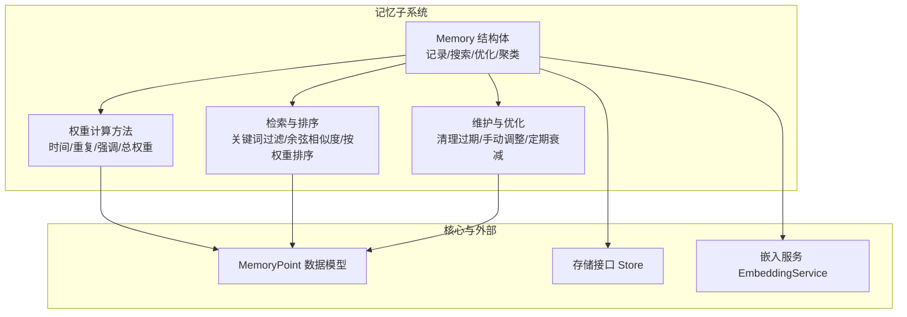

**图表来源**
- [internal/usecase/memory/weight.go](file://internal/usecase/memory/weight.go#L1-L102)
- [internal/usecase/memory/search.go](file://internal/usecase/memory/search.go#L49-L159)
- [internal/usecase/memory/maintenance.go](file://internal/usecase/memory/maintenance.go#L1-L197)
- [internal/core/memory.go](file://internal/core/memory.go#L8-L40)

**章节来源**
- [internal/usecase/memory/weight.go](file://internal/usecase/memory/weight.go#L1-L102)
- [internal/usecase/memory/search.go](file://internal/usecase/memory/search.go#L49-L159)
- [internal/usecase/memory/maintenance.go](file://internal/usecase/memory/maintenance.go#L1-L197)
- [internal/core/memory.go](file://internal/core/memory.go#L8-L40)

## 核心组件
- MemoryPoint：记忆点数据模型，包含时间权重、重复权重、强调权重与总权重等字段。
- 权重计算模块：提供时间衰减、重复检测、强调识别与总权重计算。
- 检索与排序：基于关键词相似度与向量相似度的候选筛选，并按总权重排序。
- 维护与优化：清理过期与无效记忆、手动调整权重、定期衰减。

**章节来源**
- [internal/core/memory.go](file://internal/core/memory.go#L8-L40)
- [internal/usecase/memory/weight.go](file://internal/usecase/memory/weight.go#L1-L102)
- [internal/usecase/memory/search.go](file://internal/usecase/memory/search.go#L49-L159)
- [internal/usecase/memory/maintenance.go](file://internal/usecase/memory/maintenance.go#L1-L197)

## 架构总览
记忆系统遵循“提取器 → 记忆管理 → 存储”的分层架构，权重计算作为记忆管理的核心环节参与记录与检索流程。

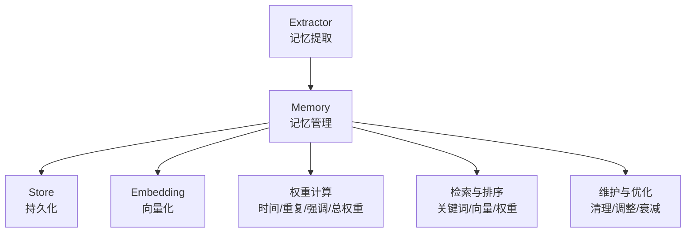

**图表来源**
- [reports/2022-02-22/glm-5/架构设计评估报告.md](file://reports/2022-02-22/glm-5/架构设计评估报告.md#L259-L283)

**章节来源**
- [reports/2022-02-22/glm-5/架构设计评估报告.md](file://reports/2022-02-22/glm-5/架构设计评估报告.md#L259-L283)

## 详细组件分析

### 权重计算模型与算法原理
- 时间衰减权重：采用分段指数衰减函数，近期（≤3天）衰减更快，远期（>3天）衰减更慢，保证新记忆的时效性与旧记忆的稳定性。
- 重复权重：基于关键词匹配与内容相似度的联合判断，统计历史记忆中与当前输入重复出现的次数，按固定倍率累加，设置上限以避免过度放大。
- 强调权重：通过关键词表与标点特征（如感叹号）识别强调信号，选取最大强调权重，用于突出重要性信息。
- 总权重：按场景化比例组合时间、强调与重复权重，支持聊天与知识两类场景的差异化权重分配。

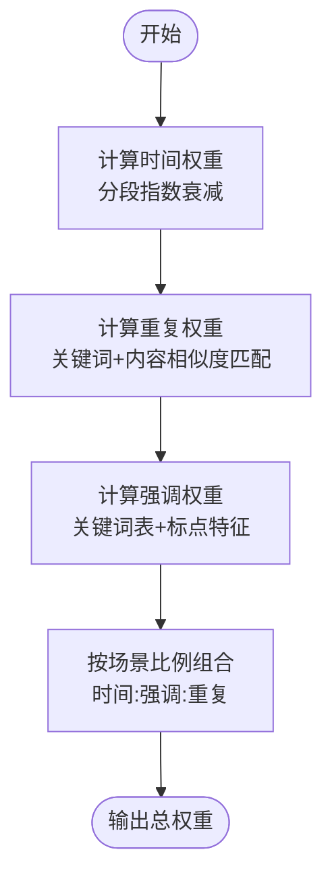

**图表来源**
- [internal/usecase/memory/weight.go](file://internal/usecase/memory/weight.go#L12-L101)

**章节来源**
- [internal/usecase/memory/weight.go](file://internal/usecase/memory/weight.go#L12-L101)
- [internal/usecase/memory/memory_internal_test.go](file://internal/usecase/memory/memory_internal_test.go#L173-L229)

### 权重更新机制与衰减策略
- 定期维护（周期性衰减）：扫描全部记忆点，重新计算时间权重，按阈值删除低权重记忆，并更新存储。
- 手动调整：根据 ID 查找目标记忆点，按倍数调整总权重并限制范围，随后持久化。
- 自动优化：清理过期与无效记忆，维持系统健康状态。

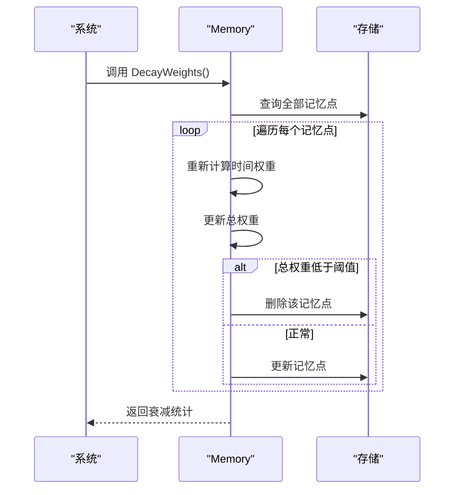

**图表来源**
- [internal/usecase/memory/maintenance.go](file://internal/usecase/memory/maintenance.go#L104-L147)

**章节来源**
- [internal/usecase/memory/maintenance.go](file://internal/usecase/memory/maintenance.go#L15-L197)

### 权重对记忆检索与排序的影响
- 检索流程：先通过向量余弦相似度筛选候选，再基于关键词相似度二次过滤，最终按总权重降序排序，返回前 N 条结果。
- 关键词相似度：以关键词集合的匹配程度衡量，过滤阈值高于一定比例。
- 余弦相似度：对向量表示进行归一化内积计算，作为语义相似度参考。

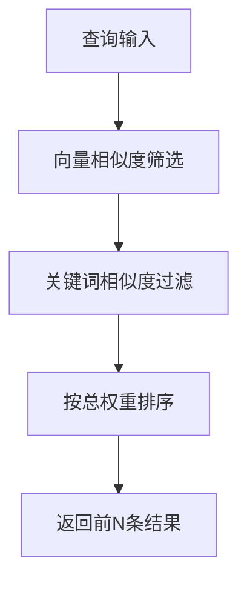

**图表来源**
- [internal/usecase/memory/search.go](file://internal/usecase/memory/search.go#L49-L159)

**章节来源**
- [internal/usecase/memory/search.go](file://internal/usecase/memory/search.go#L49-L159)

### 配置参数与调优方法
- 权重系数与场景比例：支持时间、强调、重复三类权重的比例分配，针对不同场景（如聊天、知识）可独立配置。
- 衰减因子与重复奖励：时间衰减因子控制衰减速率，重复奖励因子控制重复次数对权重的增益幅度，最大重复权重用于限幅。
- 强调关键词表：内置中英文强调词典，可扩展或替换；标点特征增强强调识别。
- 阈值与范围：清理阈值、调整上下限、排序返回数量等参数均可调优。

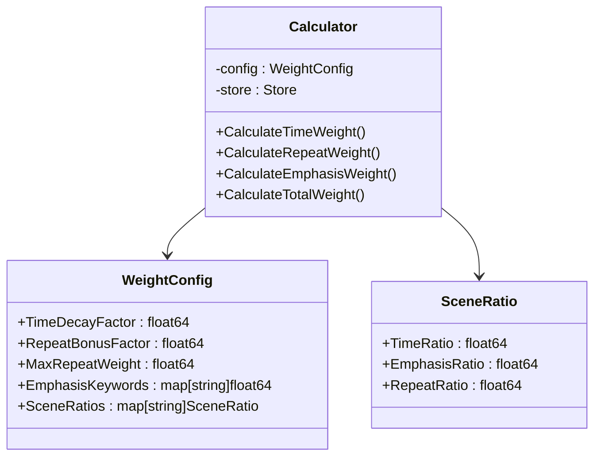

**图表来源**
- [reports/2022-02-23/重构方案/记忆模块重构方案.md](file://reports/2022-02-23/重构方案/记忆模块重构方案.md#L247-L334)

**章节来源**
- [reports/2022-02-23/重构方案/记忆模块重构方案.md](file://reports/2022-02-23/重构方案/记忆模块重构方案.md#L820-L878)

### 监控指标与性能评估
- 基础指标
  - 记忆点总数、活跃数量、删除数量（周期性维护统计）
  - 权重分布直方图（时间/重复/强调/总权重）
  - 检索命中率与平均返回条数
- 性能指标
  - 记忆记录耗时、检索耗时、排序耗时
  - 存储访问次数与延迟
- 可视化建议
  - 权重衰减曲线（按创建时间分桶）
  - 场景化权重贡献占比（饼图）
  - 检索准确率随阈值变化曲线

**章节来源**
- [internal/usecase/memory/maintenance.go](file://internal/usecase/memory/maintenance.go#L143-L146)
- [internal/usecase/memory/search.go](file://internal/usecase/memory/search.go#L66-L74)

### 扩展接口与自定义权重算法
- 扩展点
  - 实现自定义权重计算器接口，替换或补充现有算法
  - 支持多场景比例动态配置，或基于用户画像的个性化权重
  - 引入外部信号（如用户反馈、任务上下文）作为强调权重的输入
- 实现指南
  - 定义权重计算器接口与默认实现
  - 在记忆初始化时注入自定义计算器
  - 通过配置文件或运行时参数切换算法与比例
  - 提供 A/B 测试框架，对比不同算法的检索效果

**章节来源**
- [reports/2022-02-23/重构方案/记忆模块重构方案.md](file://reports/2022-02-23/重构方案/记忆模块重构方案.md#L242-L334)

## 依赖关系分析
- 内聚性：权重计算方法集中在 Memory 结构体内，职责清晰，便于单元测试与演进。
- 耦合性：与存储层通过接口解耦，与嵌入服务通过服务抽象解耦，降低变更影响面。
- 外部依赖：日志、国际化与错误包装模块，保证可观测性与健壮性。

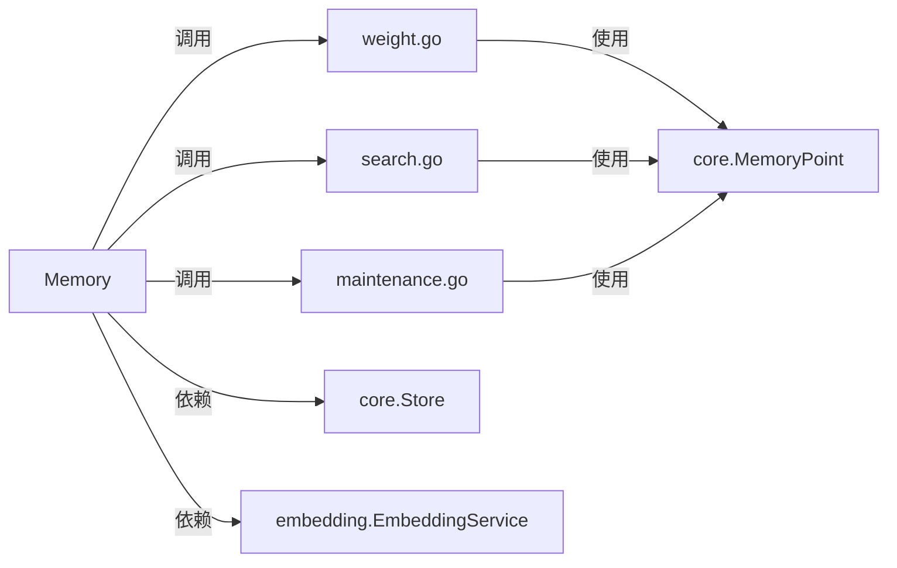

**图表来源**
- [internal/usecase/memory/weight.go](file://internal/usecase/memory/weight.go#L1-L102)
- [internal/usecase/memory/search.go](file://internal/usecase/memory/search.go#L49-L159)
- [internal/usecase/memory/maintenance.go](file://internal/usecase/memory/maintenance.go#L1-L197)
- [internal/core/memory.go](file://internal/core/memory.go#L8-L40)

**章节来源**
- [internal/usecase/memory/weight.go](file://internal/usecase/memory/weight.go#L1-L102)
- [internal/usecase/memory/search.go](file://internal/usecase/memory/search.go#L49-L159)
- [internal/usecase/memory/maintenance.go](file://internal/usecase/memory/maintenance.go#L1-L197)
- [internal/core/memory.go](file://internal/core/memory.go#L8-L40)

## 性能考量
- 时间复杂度
  - 重复权重计算：对历史记忆进行线性扫描，整体 O(N×K)，其中 N 为历史记忆数，K 为关键词匹配成本
  - 检索过滤：向量相似度筛选 O(N)，关键词过滤 O(N×K)，排序 O(N log N)
- 优化建议
  - 使用索引或近似最近邻（ANN）加速向量相似度计算
  - 缓存常用关键词映射与强调词典，减少重复构建
  - 分页批量处理历史记忆，避免一次性全量扫描
  - 在高并发场景下，对存储写入进行批量化与异步化

[本节为通用性能讨论，不直接分析具体文件]

## 故障排查指南
- 记忆记录失败
  - 检查嵌入服务可用性与网络连通性
  - 观察日志中的存储写入错误与向量生成警告
- 权重异常
  - 核对重复权重上限与强调权重阈值是否合理
  - 检查场景比例配置是否符合预期
- 检索结果偏差
  - 调整关键词相似度阈值与返回条数
  - 校验向量维度与嵌入模型一致性
- 维护任务失败
  - 查看删除与更新失败的日志，确认存储权限与键格式
  - 适当放宽清理阈值，避免误删

**章节来源**
- [internal/usecase/memory/maintenance.go](file://internal/usecase/memory/maintenance.go#L15-L49)
- [internal/usecase/memory/weight.go](file://internal/usecase/memory/weight.go#L25-L28)

## 结论
MindX 记忆权重计算系统以清晰的分层架构与可配置的权重模型为核心，结合定期维护与手动调整机制，实现了对记忆的动态管理。通过场景化比例与强调信号的引入，系统在不同应用场景下具备良好的适应性。建议在生产环境中配合监控与性能优化措施，持续迭代权重算法与配置参数，以获得更佳的检索效果与用户体验。

[本节为总结性内容，不直接分析具体文件]

## 附录

### 算法与流程图（补充）
- 时间衰减权重流程（分段指数衰减）

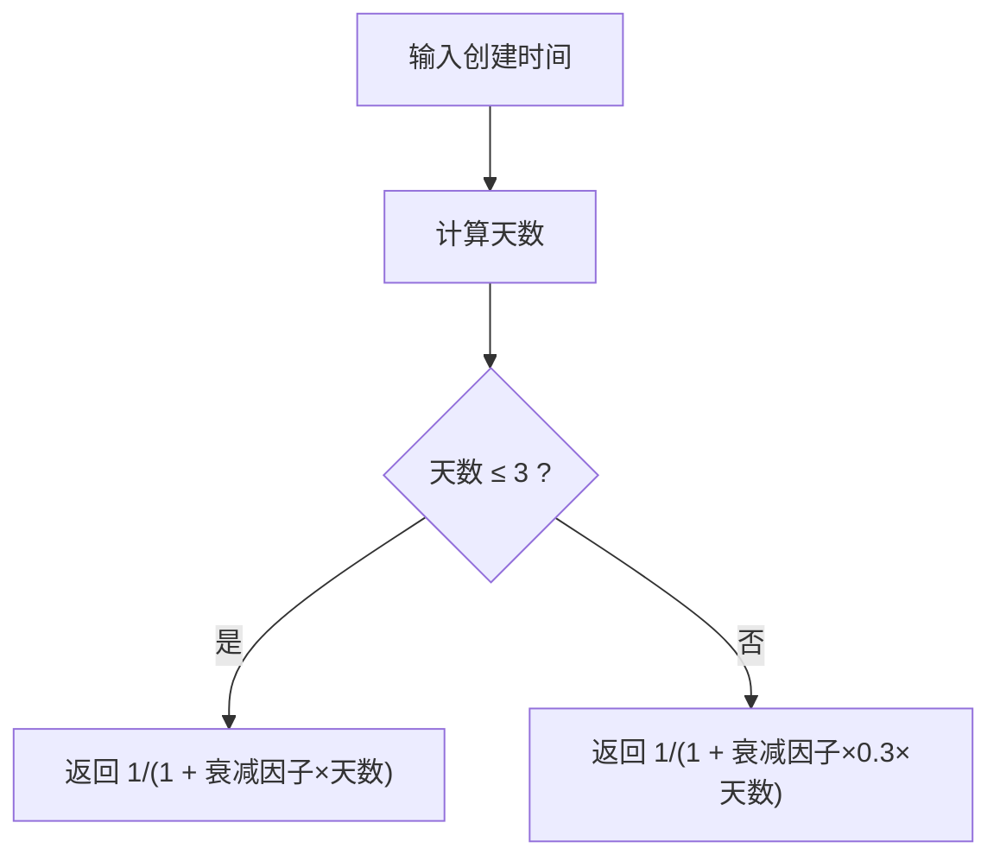

**图表来源**
- [internal/usecase/memory/weight.go](file://internal/usecase/memory/weight.go#L12-L18)

- 重复权重流程（关键词+内容相似度）

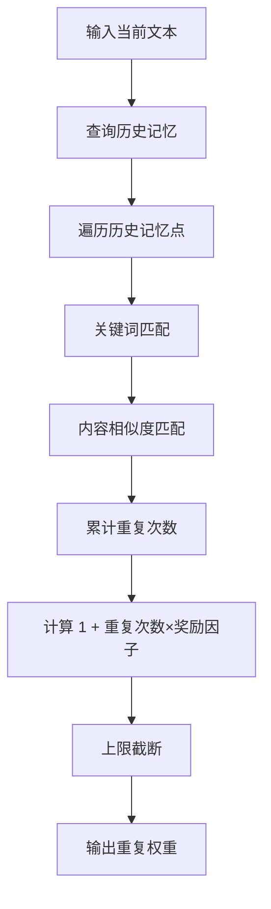

**图表来源**
- [internal/usecase/memory/weight.go](file://internal/usecase/memory/weight.go#L20-L58)

- 强调权重流程（关键词表+标点特征）

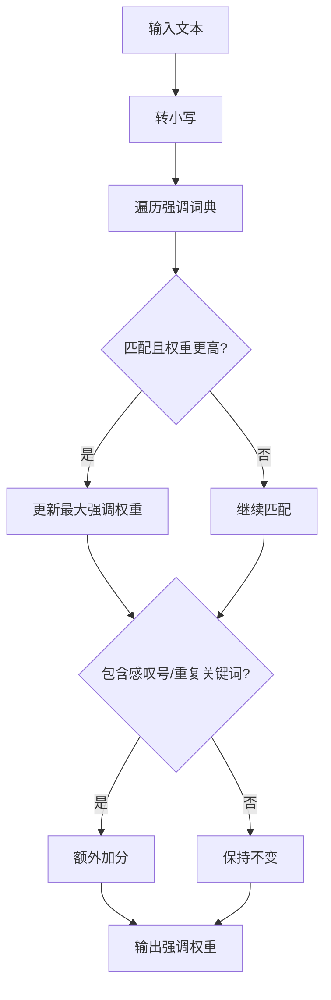

**图表来源**
- [internal/usecase/memory/weight.go](file://internal/usecase/memory/weight.go#L60-L88)

- 总权重流程（场景化比例）

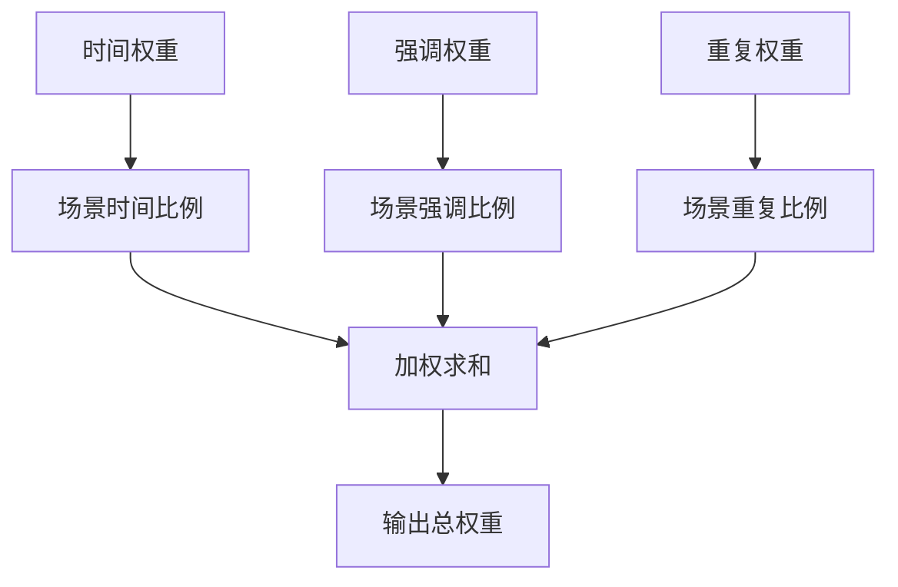

**图表来源**
- [internal/usecase/memory/weight.go](file://internal/usecase/memory/weight.go#L90-L101)