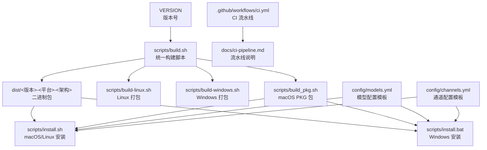
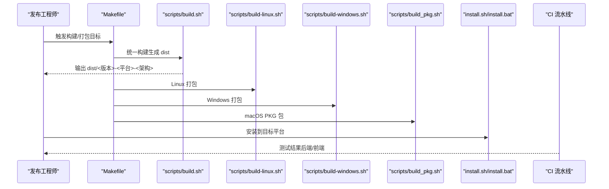
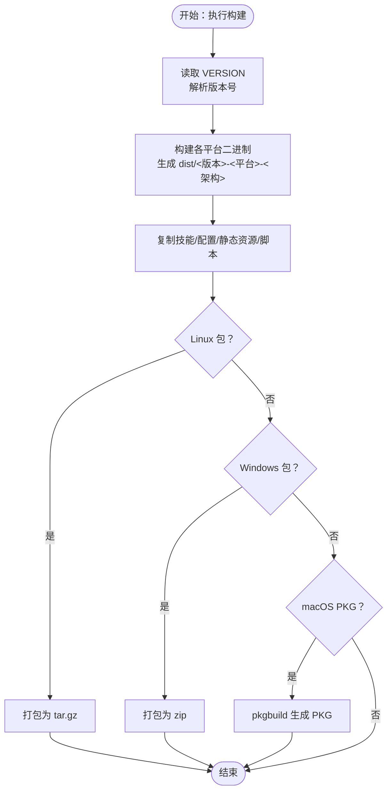
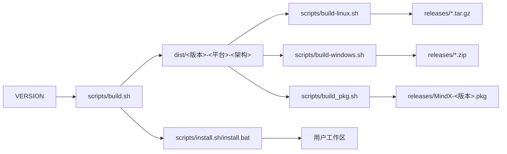

# 发布管理

<cite>
**本文引用的文件**
- [VERSION](file://VERSION)
- [cmd/main.go](file://cmd/main.go)
- [Makefile](file://Makefile)
- [.github/workflows/ci.yml](file://.github/workflows/ci.yml)
- [docs/ci-pipeline.md](file://docs/ci-pipeline.md)
- [scripts/build.sh](file://scripts/build.sh)
- [scripts/build-linux.sh](file://scripts/build-linux.sh)
- [scripts/build-windows.sh](file://scripts/build-windows.sh)
- [scripts/build_pkg.sh](file://scripts/build_pkg.sh)
- [scripts/install.sh](file://scripts/install.sh)
- [scripts/install.bat](file://scripts/install.bat)
- [scripts/uninstall.sh](file://scripts/uninstall.sh)
- [scripts/uninstall.bat](file://scripts/uninstall.bat)
- [scripts/ollama.sh](file://scripts/ollama.sh)
- [config/models.yml](file://config/models.yml)
- [config/channels.yml](file://config/channels.yml)
</cite>

## 目录
1. [简介](#简介)
2. [项目结构](#项目结构)
3. [核心组件](#核心组件)
4. [架构总览](#架构总览)
5. [详细组件分析](#详细组件分析)
6. [依赖关系分析](#依赖关系分析)
7. [性能考量](#性能考量)
8. [故障排查指南](#故障排查指南)
9. [结论](#结论)
10. [附录](#附录)

## 简介
本文件面向产品经理与发布工程师，系统化梳理 MindX 的发布管理体系，覆盖版本号管理策略、语义化版本控制、发布包生成流程（二进制打包、安装包制作、发布文件组织）、多平台发布策略（Linux、macOS、Windows）、测试与验证流程、发布前准备与发布后维护策略，以及发布回滚与紧急修复操作指南。文档以仓库现有脚本与配置为依据，结合 Makefile 的统一入口，形成可执行、可追溯、可复现的发布实践。

## 项目结构
MindX 的发布体系由“版本号来源”“构建与打包脚本”“安装与卸载脚本”“CI 流水线”“配置模板”等组成，关键路径如下：
- 版本号来源：VERSION 文件
- 构建与打包：scripts/build.sh、scripts/build-linux.sh、scripts/build-windows.sh、scripts/build_pkg.sh
- 安装与卸载：scripts/install.sh、scripts/install.bat、scripts/uninstall.sh、scripts/uninstall.bat
- CI 流水线：.github/workflows/ci.yml、docs/ci-pipeline.md
- 配置模板：config/models.yml、config/channels.yml
- 统一入口：Makefile

图表来源
- [VERSION](file://VERSION#L1-L2)
- [scripts/build.sh](file://scripts/build.sh#L1-L145)
- [scripts/build-linux.sh](file://scripts/build-linux.sh#L1-L75)
- [scripts/build-windows.sh](file://scripts/build-windows.sh#L1-L75)
- [scripts/build_pkg.sh](file://scripts/build_pkg.sh#L1-L189)
- [scripts/install.sh](file://scripts/install.sh#L1-L324)
- [scripts/install.bat](file://scripts/install.bat#L1-L78)
- [.github/workflows/ci.yml](file://.github/workflows/ci.yml#L1-L49)
- [docs/ci-pipeline.md](file://docs/ci-pipeline.md#L1-L109)
- [config/models.yml](file://config/models.yml#L1-L92)
- [config/channels.yml](file://config/channels.yml#L1-L96)

章节来源
- [Makefile](file://Makefile#L1-L299)
- [VERSION](file://VERSION#L1-L2)

## 核心组件
- 版本号与构建注入
  - 版本号来源：VERSION 文件，如 v1.0.4
  - 构建注入：Go 构建时通过 ldflags 注入 Version 变量，便于运行时查询版本
- 构建与打包脚本
  - 统一构建：scripts/build.sh 产出 dist/<版本>-<平台>-<架构> 目录，包含二进制、技能、配置模板、前端静态资源与安装脚本
  - 平台打包：scripts/build-linux.sh 与 scripts/build-windows.sh 将 dist 内容打包为 tar.gz 或 zip；scripts/build_pkg.sh 生成 macOS PKG 包
- 安装与卸载脚本
  - macOS/Linux：scripts/install.sh 安装至 /usr/local/mindx 或自定义路径，创建符号链接与守护进程；scripts/uninstall.sh 卸载并清理
  - Windows：scripts/install.bat 与 scripts/uninstall.bat 提供安装与卸载流程
- CI 流水线
  - .github/workflows/ci.yml 并行执行后端与前端测试；docs/ci-pipeline.md 提供本地复现与常见问题说明
- 配置模板
  - config/models.yml 与 config/channels.yml 作为默认配置模板，随安装包分发至用户工作区

章节来源
- [VERSION](file://VERSION#L1-L2)
- [cmd/main.go](file://cmd/main.go#L1-L21)
- [scripts/build.sh](file://scripts/build.sh#L1-L145)
- [scripts/build-linux.sh](file://scripts/build-linux.sh#L1-L75)
- [scripts/build-windows.sh](file://scripts/build-windows.sh#L1-L75)
- [scripts/build_pkg.sh](file://scripts/build_pkg.sh#L1-L189)
- [scripts/install.sh](file://scripts/install.sh#L1-L324)
- [scripts/install.bat](file://scripts/install.bat#L1-L78)
- [scripts/uninstall.sh](file://scripts/uninstall.sh#L1-L263)
- [scripts/uninstall.bat](file://scripts/uninstall.bat#L1-L145)
- [.github/workflows/ci.yml](file://.github/workflows/ci.yml#L1-L49)
- [docs/ci-pipeline.md](file://docs/ci-pipeline.md#L1-L109)
- [config/models.yml](file://config/models.yml#L1-L92)
- [config/channels.yml](file://config/channels.yml#L1-L96)

## 架构总览
发布流程从“版本号”出发，经“构建与打包”，生成“安装包与发布文件”，再通过“安装脚本”部署到目标平台，并由“CI 流水线”保障质量。

图表来源
- [Makefile](file://Makefile#L26-L161)
- [scripts/build.sh](file://scripts/build.sh#L1-L145)
- [scripts/build-linux.sh](file://scripts/build-linux.sh#L1-L75)
- [scripts/build-windows.sh](file://scripts/build-windows.sh#L1-L75)
- [scripts/build_pkg.sh](file://scripts/build_pkg.sh#L1-L189)
- [scripts/install.sh](file://scripts/install.sh#L1-L324)
- [scripts/install.bat](file://scripts/install.bat#L1-L78)
- [.github/workflows/ci.yml](file://.github/workflows/ci.yml#L1-L49)

## 详细组件分析

### 版本号管理与语义化版本控制
- 版本号来源与格式
  - VERSION 文件采用 v<主>.<次>.<修订> 格式，如 v1.0.4
  - 构建脚本读取该文件，作为二进制与打包产物的版本标识
- 构建注入
  - Go 构建时通过 ldflags 注入 Version 变量，便于运行时查询版本
- 语义化版本建议
  - 主版本号：破坏性变更
  - 次版本号：向下兼容的功能新增
  - 修订号：向下兼容的问题修正
  - 建议在发布前统一更新 VERSION，并在发布分支打标签

章节来源
- [VERSION](file://VERSION#L1-L2)
- [cmd/main.go](file://cmd/main.go#L1-L21)
- [scripts/build.sh](file://scripts/build.sh#L24-L28)

### 发布包生成流程
- 统一构建（scripts/build.sh）
  - 清理并准备 dist 目录
  - 构建前端（dashboard）与后端（Go），生成本地二进制
  - 为 darwin/amd64、darwin/arm64、linux/amd64、linux/arm64、windows/amd64、windows/arm64 生成 dist/<版本>-<平台>-<架构>
  - 复制技能、配置模板、前端静态资源、安装脚本与 VERSION/README
- Linux 打包（scripts/build-linux.sh）
  - 将 dist/<版本>-linux-<架构> 目录打包为 releases/mindx-<版本>-linux-<架构>.tar.gz
- Windows 打包（scripts/build-windows.sh）
  - 将 dist/<版本>-windows-<架构> 目录打包为 releases/mindx-<版本>-windows-<架构>.zip
- macOS PKG 包（scripts/build_pkg.sh）
  - 从 dist 对应目录复制二进制、技能、静态资源、配置模板
  - 生成 postinstall 脚本，安装 Ollama（如需）、创建符号链接、创建工作空间、生成 .env
  - 使用 pkgbuild 生成 releases/MindX-<版本>.pkg

图表来源
- [scripts/build.sh](file://scripts/build.sh#L24-L101)
- [scripts/build-linux.sh](file://scripts/build-linux.sh#L50-L62)
- [scripts/build-windows.sh](file://scripts/build-windows.sh#L50-L62)
- [scripts/build_pkg.sh](file://scripts/build_pkg.sh#L164-L178)

章节来源
- [scripts/build.sh](file://scripts/build.sh#L1-L145)
- [scripts/build-linux.sh](file://scripts/build-linux.sh#L1-L75)
- [scripts/build-windows.sh](file://scripts/build-windows.sh#L1-L75)
- [scripts/build_pkg.sh](file://scripts/build_pkg.sh#L1-L189)

### 多平台发布策略
- macOS
  - 产物：dist/<版本>-darwin-<arch> 与 releases/MindX-<版本>.pkg
  - 安装：postinstall 自动安装 Ollama（如需）、创建 /usr/local/bin/mindx 符号链接、设置 LaunchAgents 守护进程
- Linux
  - 产物：releases/mindx-<版本>-linux-<arch>.tar.gz
  - 安装：scripts/install.sh 将文件复制到 /usr/local/mindx，创建 /usr/local/bin/mindx 符号链接，设置 systemd 守护进程
- Windows
  - 产物：releases/mindx-<版本>-windows-<arch>.zip
  - 安装：scripts/install.bat 复制到 ProgramFiles\MindX，创建工作目录与 .env，设置 PATH；卸载脚本移除服务与路径

章节来源
- [scripts/build_pkg.sh](file://scripts/build_pkg.sh#L31-L36)
- [scripts/install.sh](file://scripts/install.sh#L212-L301)
- [scripts/install.bat](file://scripts/install.bat#L1-L78)
- [scripts/uninstall.sh](file://scripts/uninstall.sh#L129-L166)
- [scripts/uninstall.bat](file://scripts/uninstall.bat#L84-L110)

### 测试与验证流程
- CI 流水线
  - 后端：ubuntu-latest，setup-go，go vet，准备 .test 工作区，go test
  - 前端：ubuntu-latest，setup-node，npm ci、lint、tsc、test
- 本地复现
  - 文档提供本地复现步骤与 Makefile 快捷命令，确保一致性
- 验证要点
  - 构建产物完整性（二进制、技能、配置、静态资源）
  - 安装后守护进程与日志路径正确
  - 配置模板按需生成至用户工作区

章节来源
- [.github/workflows/ci.yml](file://.github/workflows/ci.yml#L1-L49)
- [docs/ci-pipeline.md](file://docs/ci-pipeline.md#L1-L109)
- [Makefile](file://Makefile#L63-L70)

### 发布前准备与发布后维护
- 发布前准备
  - 更新 VERSION，确保语义化版本一致
  - 在发布分支打标签，保证可追溯性
  - 运行 CI 流水线，确保后端与前端测试通过
  - 本地复核安装包内容与安装脚本行为
- 发布后维护
  - 上传 releases 中的安装包与归档
  - 更新文档与公告，记录版本变更点
  - 监控安装与日志，收集用户反馈

章节来源
- [VERSION](file://VERSION#L1-L2)
- [.github/workflows/ci.yml](file://.github/workflows/ci.yml#L1-L49)
- [docs/ci-pipeline.md](file://docs/ci-pipeline.md#L1-L109)

### 回滚与紧急修复
- 回滚策略
  - macOS/Linux：使用 scripts/uninstall.sh 卸载，再安装上一个版本的 releases 包
  - Windows：使用 scripts/uninstall.bat 卸载，再安装上一个版本的 releases 包
- 紧急修复
  - 修复后重新执行构建与打包，生成新版本安装包
  - 通过 scripts/ollama.sh 检查并拉取必要模型，确保修复后功能可用

章节来源
- [scripts/uninstall.sh](file://scripts/uninstall.sh#L1-L263)
- [scripts/uninstall.bat](file://scripts/uninstall.bat#L1-L145)
- [scripts/ollama.sh](file://scripts/ollama.sh#L1-L27)

## 依赖关系分析
- 版本号依赖
  - VERSION → 构建脚本 → 二进制与打包产物 → 安装脚本 → 用户工作区
- 构建与打包依赖
  - scripts/build.sh 依赖 Go、Node/npm、系统工具（tar/zip/lipo/pkgbuild）
  - 平台打包脚本依赖 dist 结构
- 安装脚本依赖
  - 安装脚本依赖打包产物结构与系统环境（systemd/launchd/PATH）

图表来源
- [VERSION](file://VERSION#L1-L2)
- [scripts/build.sh](file://scripts/build.sh#L1-L145)
- [scripts/build-linux.sh](file://scripts/build-linux.sh#L1-L75)
- [scripts/build-windows.sh](file://scripts/build-windows.sh#L1-L75)
- [scripts/build_pkg.sh](file://scripts/build_pkg.sh#L1-L189)
- [scripts/install.sh](file://scripts/install.sh#L1-L324)
- [scripts/install.bat](file://scripts/install.bat#L1-L78)

章节来源
- [Makefile](file://Makefile#L1-L299)

## 性能考量
- 构建性能
  - 使用 CGO_ENABLED 控制编译参数，减少动态链接开销
  - 前端构建使用 npm ci，确保依赖锁定与可复现
- 打包性能
  - tar/zip 压缩对大体量静态资源有成本，建议按需裁剪与缓存
- 安装性能
  - 守护进程启动与日志路径设置影响首次体验，建议预热与最小化依赖

## 故障排查指南
- 版本号不一致
  - 确认 VERSION 文件格式与构建注入一致
- 构建失败
  - 检查 Go/Node 环境与依赖；参考 docs/ci-pipeline.md 的本地复现步骤
- 安装异常
  - macOS/Linux：检查 /usr/local/bin 符号链接与守护进程状态
  - Windows：检查 PATH 与服务状态，必要时手动删除残留
- 模型不可用
  - 使用 scripts/ollama.sh 检查并拉取所需模型

章节来源
- [docs/ci-pipeline.md](file://docs/ci-pipeline.md#L1-L109)
- [scripts/install.sh](file://scripts/install.sh#L148-L160)
- [scripts/install.bat](file://scripts/install.bat#L48-L53)
- [scripts/ollama.sh](file://scripts/ollama.sh#L1-L27)

## 结论
MindX 的发布管理以 VERSION 为核心，通过统一的构建与打包脚本、跨平台安装脚本与 CI 流水线，实现了可追溯、可复现、可维护的发布体系。建议在发布前严格执行版本号与测试流程，在发布后持续监控与迭代，确保用户体验与稳定性。

## 附录
- 关键命令速查
  - 构建：make build
  - Linux 发布包：make build-linux-release
  - Windows 发布包：make build-windows-release
  - 全量发布包：make build-all-releases
  - 安装：make install
  - 卸载：make uninstall
  - 测试：make test
  - 环境检查：make doctor

章节来源
- [Makefile](file://Makefile#L253-L299)