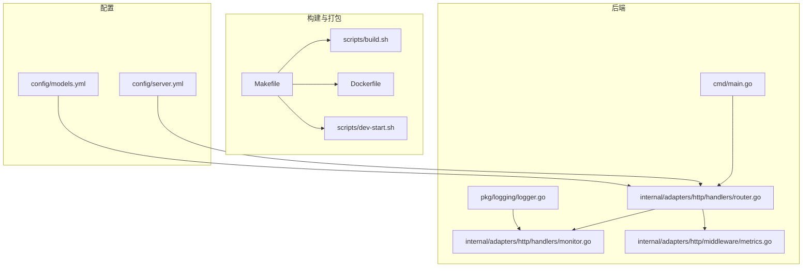
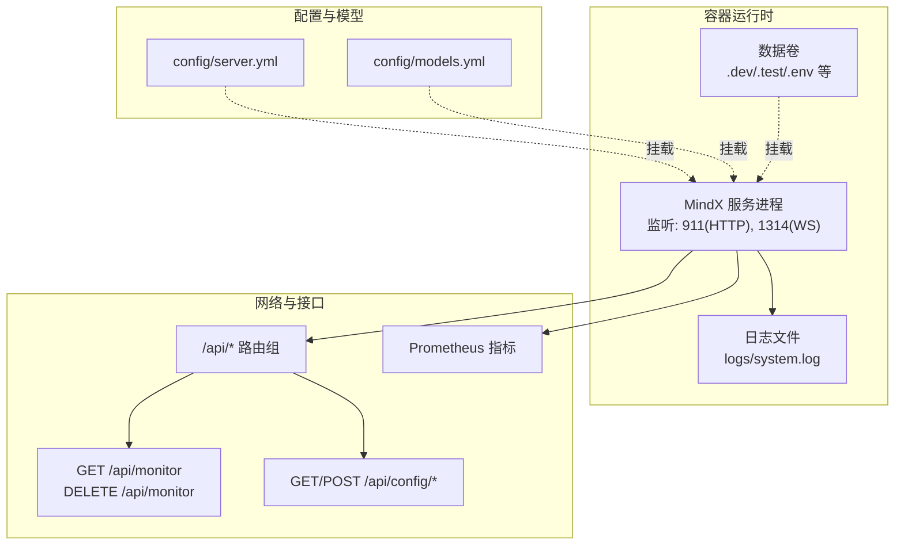
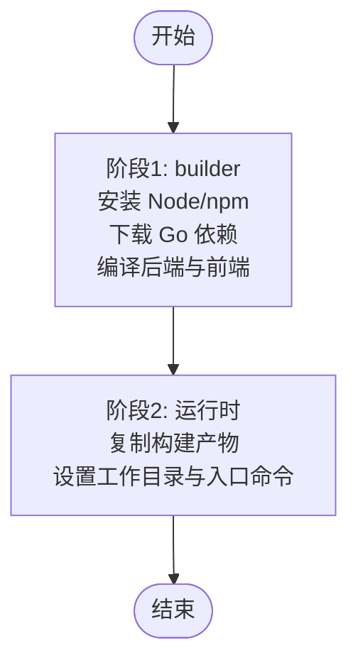
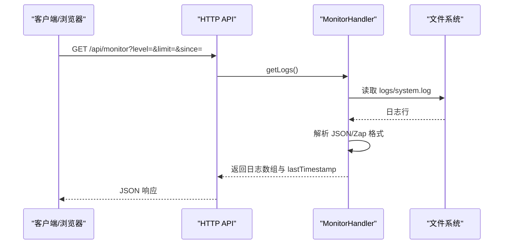
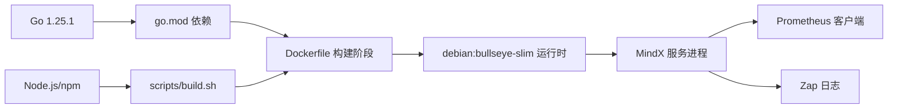

# 容器化部署

<cite>
**本文引用的文件**
- [Dockerfile](file://Dockerfile)
- [.dockerignore](file://.dockerignore)
- [README.md](file://README.md)
- [Makefile](file://Makefile)
- [cmd/main.go](file://cmd/main.go)
- [go.mod](file://go.mod)
- [config/server.yml](file://config/server.yml)
- [config/models.yml](file://config/models.yml)
- [scripts/build.sh](file://scripts/build.sh)
- [scripts/dev-start.sh](file://scripts/dev-start.sh)
- [internal/adapters/http/handlers/router.go](file://internal/adapters/http/handlers/router.go)
- [internal/adapters/http/handlers/monitor.go](file://internal/adapters/http/handlers/monitor.go)
- [pkg/logging/logger.go](file://pkg/logging/logger.go)
- [internal/adapters/http/middleware/metrics.go](file://internal/adapters/http/middleware/metrics.go)
</cite>

## 目录
1. [简介](#简介)
2. [项目结构](#项目结构)
3. [核心组件](#核心组件)
4. [架构总览](#架构总览)
5. [详细组件分析](#详细组件分析)
6. [依赖关系分析](#依赖关系分析)
7. [性能考量](#性能考量)
8. [故障排除指南](#故障排除指南)
9. [结论](#结论)
10. [附录](#附录)

## 简介
本文件面向 DevOps 工程师，提供 MindX 的容器化部署完整参考。内容涵盖 Dockerfile 多阶段构建策略、基础镜像选择与依赖管理；容器化部署的优势与适用场景；容器配置文件结构与关键配置项；镜像构建与推送流程；最佳实践与安全考虑；以及容器监控、日志管理与故障排除指南。

## 项目结构
MindX 采用 Go 语言后端与 React 前端的混合架构，通过 Makefile 统一构建与运行入口，并提供 Dockerfile 与 .dockerignore 支持容器化打包。核心目录与文件如下：
- Dockerfile：多阶段构建镜像，产出最小运行时镜像
- .dockerignore：排除构建无关文件，减少镜像体积
- Makefile：统一构建、安装、运行、测试、清理等命令
- cmd/main.go：程序入口，注入版本信息
- config/server.yml：服务监听地址、端口、模型与向量存储配置
- config/models.yml：模型列表与参数配置
- scripts/build.sh：跨平台二进制与静态资源打包脚本
- scripts/dev-start.sh：开发模式启动脚本，支持前后端热重载
- internal/adapters/http/handlers/router.go：HTTP API 路由注册，含监控与日志接口
- internal/adapters/http/handlers/monitor.go：系统日志读取与清空接口
- pkg/logging/logger.go：基于 Zap 的日志系统，支持文件轮转与控制台输出
- internal/adapters/http/middleware/metrics.go：基于 Prometheus 的指标中间件

**图表来源**
- [Makefile](file://Makefile#L1-L299)
- [scripts/build.sh](file://scripts/build.sh#L1-L145)
- [Dockerfile](file://Dockerfile#L1-L27)
- [scripts/dev-start.sh](file://scripts/dev-start.sh#L1-L285)
- [cmd/main.go](file://cmd/main.go#L1-L21)
- [internal/adapters/http/handlers/router.go](file://internal/adapters/http/handlers/router.go#L1-L150)
- [internal/adapters/http/handlers/monitor.go](file://internal/adapters/http/handlers/monitor.go#L1-L188)
- [pkg/logging/logger.go](file://pkg/logging/logger.go#L1-L402)
- [internal/adapters/http/middleware/metrics.go](file://internal/adapters/http/middleware/metrics.go#L1-L43)
- [config/server.yml](file://config/server.yml#L1-L21)
- [config/models.yml](file://config/models.yml#L1-L92)

**章节来源**
- [Dockerfile](file://Dockerfile#L1-L27)
- [.dockerignore](file://.dockerignore#L1-L11)
- [Makefile](file://Makefile#L1-L299)
- [scripts/build.sh](file://scripts/build.sh#L1-L145)
- [scripts/dev-start.sh](file://scripts/dev-start.sh#L1-L285)
- [cmd/main.go](file://cmd/main.go#L1-L21)
- [internal/adapters/http/handlers/router.go](file://internal/adapters/http/handlers/router.go#L1-L150)
- [internal/adapters/http/handlers/monitor.go](file://internal/adapters/http/handlers/monitor.go#L1-L188)
- [pkg/logging/logger.go](file://pkg/logging/logger.go#L1-L402)
- [internal/adapters/http/middleware/metrics.go](file://internal/adapters/http/middleware/metrics.go#L1-L43)
- [config/server.yml](file://config/server.yml#L1-L21)
- [config/models.yml](file://config/models.yml#L1-L92)

## 核心组件
- 多阶段 Docker 构建：第一阶段使用 Go 官方 Debian 基础镜像进行编译与前端打包；第二阶段使用精简的 Debian Slim 镜像作为运行时，仅拷贝必要的二进制与静态资源，显著减小镜像体积。
- 构建与打包：Makefile 统一入口，scripts/build.sh 负责跨平台二进制与静态资源打包；Dockerfile 在第二阶段直接复制构建产物，避免在运行时编译。
- 配置驱动：config/server.yml 与 config/models.yml 提供服务监听、端口、模型与向量存储等配置，便于容器内挂载与覆盖。
- 日志与监控：内置 HTTP 接口提供系统日志读取与清空；日志系统支持文件轮转与控制台输出；Prometheus 指标中间件暴露请求与 LLM 调用等指标。
- 开发与运维：scripts/dev-start.sh 支持开发模式热重载；.dockerignore 排除构建无关文件，加速构建与减小镜像体积。

**章节来源**
- [Dockerfile](file://Dockerfile#L1-L27)
- [Makefile](file://Makefile#L1-L299)
- [scripts/build.sh](file://scripts/build.sh#L1-L145)
- [config/server.yml](file://config/server.yml#L1-L21)
- [config/models.yml](file://config/models.yml#L1-L92)
- [internal/adapters/http/handlers/monitor.go](file://internal/adapters/http/handlers/monitor.go#L1-L188)
- [pkg/logging/logger.go](file://pkg/logging/logger.go#L1-L402)
- [internal/adapters/http/middleware/metrics.go](file://internal/adapters/http/middleware/metrics.go#L1-L43)
- [.dockerignore](file://.dockerignore#L1-L11)

## 架构总览
下图展示了容器化部署的整体架构：前端静态资源与后端二进制在构建阶段被打包，运行时镜像仅包含最小依赖；容器通过挂载配置与数据卷实现持久化；HTTP API 提供监控、日志与指标接口。

**图表来源**
- [internal/adapters/http/handlers/router.go](file://internal/adapters/http/handlers/router.go#L1-L150)
- [internal/adapters/http/handlers/monitor.go](file://internal/adapters/http/handlers/monitor.go#L1-L188)
- [pkg/logging/logger.go](file://pkg/logging/logger.go#L1-L402)
- [internal/adapters/http/middleware/metrics.go](file://internal/adapters/http/middleware/metrics.go#L1-L43)
- [config/server.yml](file://config/server.yml#L1-L21)
- [config/models.yml](file://config/models.yml#L1-L92)

## 详细组件分析

### Dockerfile 多阶段构建策略
- 第一阶段（builder）：基于 golang:1.25-bullseye，安装 Node.js 与 npm 以构建前端，随后下载 Go 依赖并编译后端，生成发布产物。
- 第二阶段（运行时）：基于 debian:bullseye-slim，仅拷贝构建产物（release、dist、bin），设置工作目录与默认命令。
- 优点：构建与运行分离，运行时镜像极小，减少攻击面；构建缓存友好，重复构建更快。

**图表来源**
- [Dockerfile](file://Dockerfile#L1-L27)

**章节来源**
- [Dockerfile](file://Dockerfile#L1-L27)

### 容器配置文件结构与关键配置项
- config/server.yml
  - 监听主机与端口：host、port、ws_port
  - 向量存储类型：vector_store.type（如 badger）
  - Token 预算：reserved_output_tokens、min_history_rounds、avg_tokens_per_round
  - 潜意识/主意识模型：subconscious、consciousness
  - 嵌入模型与默认模型：embedding_model、default_model
- config/models.yml
  - 模型列表与参数：name、base_url、api_key、temperature、max_tokens 等

这些配置可通过容器挂载覆盖，实现环境隔离与灵活部署。

**章节来源**
- [config/server.yml](file://config/server.yml#L1-L21)
- [config/models.yml](file://config/models.yml#L1-L92)

### 构建与推送流程
- 本地构建
  - 使用 Makefile 统一入口：make build 触发 scripts/build.sh，生成多平台二进制与静态资源
  - Docker 镜像构建：docker build -t mindx:tag .
- 推送镜像
  - docker tag mindx:tag <registry>/<namespace>/mindx:<tag>
  - docker push <registry>/<namespace>/mindx:<tag>
- 运行容器
  - docker run -d --name mindx -p 911:911 -p 1314:1314 -v /path/to/config:/mindx/config -v /path/to/data:/mindx/.dev mindx:tag
  - 注意：容器内默认命令会打印帮助信息，实际启动应通过服务入口或自定义 CMD

**章节来源**
- [Makefile](file://Makefile#L1-L299)
- [scripts/build.sh](file://scripts/build.sh#L1-L145)
- [Dockerfile](file://Dockerfile#L1-L27)

### 容器化部署优势与适用场景
- 优势
  - 一致性：镜像包含运行所需全部依赖，避免“在我机器上能跑”的问题
  - 可移植：一次构建，多环境运行（开发、测试、生产）
  - 轻量化：多阶段构建减少镜像体积，缩短拉取与启动时间
  - 可观测：内置日志与指标接口，便于集中监控
- 适用场景
  - CI/CD 流水线：自动化构建、测试与部署
  - 微服务化：将 MindX 作为独立服务接入平台
  - 边缘计算：在资源受限环境中快速部署与扩缩容

**章节来源**
- [README.md](file://README.md#L1-L215)
- [Dockerfile](file://Dockerfile#L1-L27)

### 容器配置与挂载最佳实践
- 配置挂载
  - 将 config/server.yml 与 config/models.yml 挂载到容器内 /mindx/config，实现配置解耦
- 数据持久化
  - 将 .dev、.test、logs 等目录映射到宿主机，确保重启后数据不丢失
- 环境隔离
  - 使用不同标签区分环境（dev/stage/prod），避免配置混淆
- 安全
  - 仅开放必要端口（911/1314），启用网络策略与只读根文件系统
  - 使用非 root 用户运行（可在 Dockerfile 中添加）

**章节来源**
- [config/server.yml](file://config/server.yml#L1-L21)
- [config/models.yml](file://config/models.yml#L1-L92)
- [.dockerignore](file://.dockerignore#L1-L11)

### 监控、日志与指标
- 日志
  - 系统日志：logs/system.log，支持文件轮转与控制台输出
  - 对话日志：可配置启用/禁用，输出至文件或控制台
  - HTTP 接口：GET /api/monitor 获取增量日志；DELETE /api/monitor 清空日志
- 指标
  - Prometheus 指标：mindx_http_requests_total、mindx_http_request_duration_seconds、mindx_llm_calls_total、mindx_token_usage_total、mindx_channel_messages_total
- 前端监控页面
  - 通过 Dashboard 页面的 Monitor 组件轮询 /api/monitor 实时查看日志

**图表来源**
- [internal/adapters/http/handlers/router.go](file://internal/adapters/http/handlers/router.go#L121-L124)
- [internal/adapters/http/handlers/monitor.go](file://internal/adapters/http/handlers/monitor.go#L48-L72)
- [pkg/logging/logger.go](file://pkg/logging/logger.go#L112-L191)

**章节来源**
- [internal/adapters/http/handlers/router.go](file://internal/adapters/http/handlers/router.go#L1-L150)
- [internal/adapters/http/handlers/monitor.go](file://internal/adapters/http/handlers/monitor.go#L1-L188)
- [pkg/logging/logger.go](file://pkg/logging/logger.go#L1-L402)
- [internal/adapters/http/middleware/metrics.go](file://internal/adapters/http/middleware/metrics.go#L1-L43)

## 依赖关系分析
- 构建依赖
  - Go 1.25.1（go.mod）
  - Node.js 与 npm（Dockerfile 安装）
  - 前端依赖（scripts/build.sh 中 npm install）
- 运行时依赖
  - Debian Bullseye Slim（运行时镜像）
  - 本地大模型服务（Ollama，默认通过 http://localhost:11434/v1 访问）
- 外部集成
  - Prometheus 客户端库（指标导出）
  - Gin（HTTP 路由与中间件）
  - Zap（高性能日志）

**图表来源**
- [go.mod](file://go.mod#L1-L113)
- [scripts/build.sh](file://scripts/build.sh#L1-L145)
- [Dockerfile](file://Dockerfile#L1-L27)
- [internal/adapters/http/middleware/metrics.go](file://internal/adapters/http/middleware/metrics.go#L1-L43)
- [pkg/logging/logger.go](file://pkg/logging/logger.go#L1-L402)

**章节来源**
- [go.mod](file://go.mod#L1-L113)
- [Dockerfile](file://Dockerfile#L1-L27)
- [scripts/build.sh](file://scripts/build.sh#L1-L145)
- [internal/adapters/http/middleware/metrics.go](file://internal/adapters/http/middleware/metrics.go#L1-L43)
- [pkg/logging/logger.go](file://pkg/logging/logger.go#L1-L402)

## 性能考量
- 镜像体积与启动时间
  - 多阶段构建显著减小运行时镜像，缩短拉取与启动时间
  - .dockerignore 排除 node_modules、dist、bin、releases 等，减少层大小
- 日志与磁盘 IO
  - 使用 lumberjack 进行日志轮转，避免单文件过大
  - 建议将日志目录映射到高性能存储或使用专用日志收集
- 模型推理性能
  - 通过 config/models.yml 选择合适模型与参数，结合 Token 预算控制
  - 本地 Ollama 服务性能直接影响响应时间，建议在容器内合理分配 CPU/内存资源

**章节来源**
- [.dockerignore](file://.dockerignore#L1-L11)
- [pkg/logging/logger.go](file://pkg/logging/logger.go#L112-L191)
- [config/server.yml](file://config/server.yml#L1-L21)
- [config/models.yml](file://config/models.yml#L1-L92)

## 故障排除指南
- 容器启动后无响应
  - 检查端口占用：911(HTTP)、1314(WS)，确认未被宿主机占用
  - 查看日志：通过 /api/monitor 或查看 logs/system.log
- 模型不可用
  - 确认 Ollama 服务可达（默认 http://localhost:11434/v1）
  - 检查 config/models.yml 中 base_url 与 api_key 配置
- 日志为空或无法增量刷新
  - 确认 logs/system.log 存在且可读
  - 使用 DELETE /api/monitor 清空后重试 GET /api/monitor
- 开发模式异常
  - scripts/dev-start.sh 提供前后端热重载，检查端口 911/5173 占用情况

**章节来源**
- [scripts/dev-start.sh](file://scripts/dev-start.sh#L1-L285)
- [internal/adapters/http/handlers/router.go](file://internal/adapters/http/handlers/router.go#L121-L124)
- [internal/adapters/http/handlers/monitor.go](file://internal/adapters/http/handlers/monitor.go#L1-L188)
- [config/models.yml](file://config/models.yml#L1-L92)

## 结论
MindX 的容器化部署通过多阶段 Dockerfile、统一的 Makefile 与脚本化构建，实现了从开发到生产的高效闭环。配合配置驱动的 server.yml 与 models.yml、完善的日志与指标体系，能够满足多种部署场景的需求。遵循本文的安全与最佳实践建议，可进一步提升容器化部署的稳定性与可观测性。

## 附录
- 常用命令
  - 构建：make build
  - 安装：make install
  - 更新：make update
  - 清理：make clean
  - 开发：make dev
  - 构建镜像：docker build -t mindx:tag .
  - 运行容器：docker run -d -p 911:911 -p 1314:1314 -v /path/to/config:/mindx/config -v /path/to/data:/mindx/.dev mindx:tag
- 关键端口
  - 911：HTTP API 与 Dashboard
  - 1314：WebSocket 通信