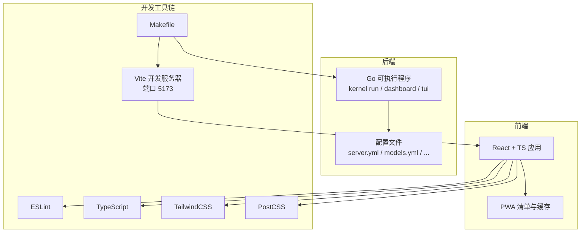
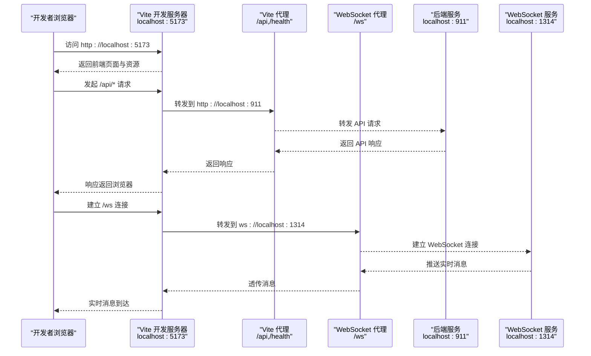
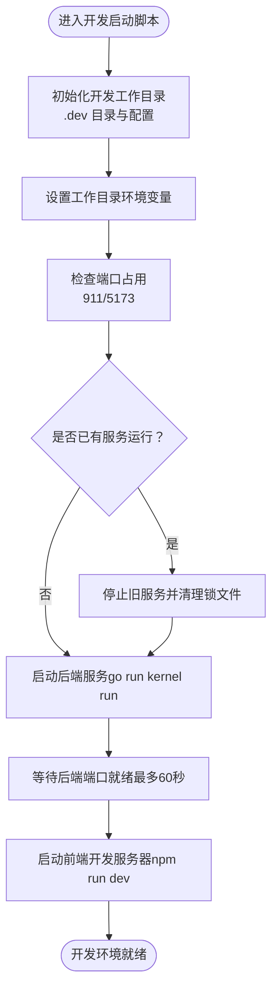
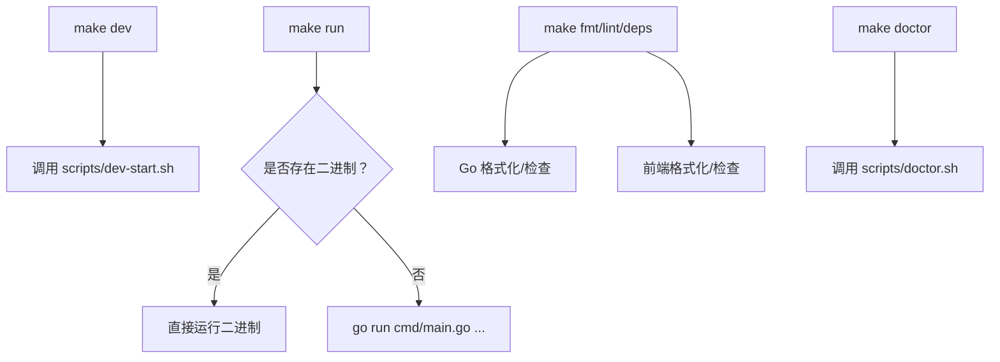
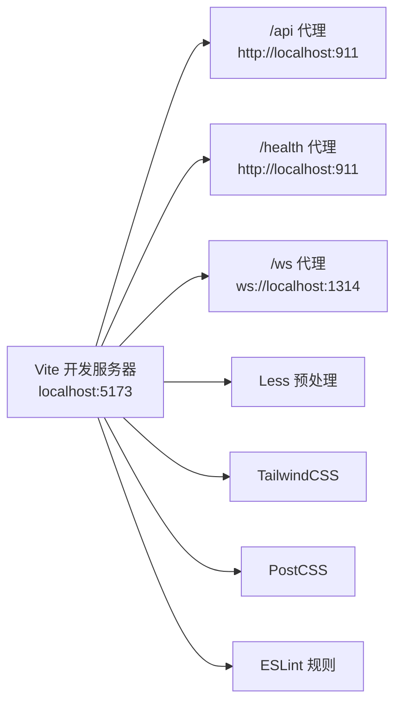
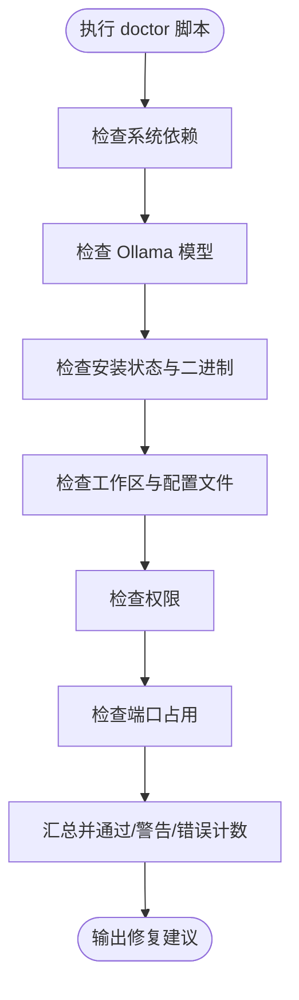
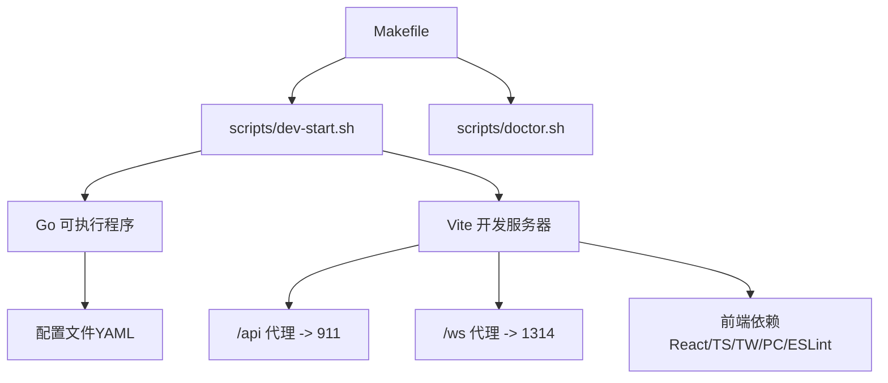

# 开发环境

<cite>
**本文引用的文件**
- [README.md](file://README.md)
- [INSTALL.md](file://INSTALL.md)
- [Makefile](file://Makefile)
- [cmd/main.go](file://cmd/main.go)
- [scripts/dev-start.sh](file://scripts/dev-start.sh)
- [scripts/doctor.sh](file://scripts/doctor.sh)
- [dashboard/vite.config.ts](file://dashboard/vite.config.ts)
- [dashboard/package.json](file://dashboard/package.json)
- [dashboard/eslint.config.js](file://dashboard/eslint.config.js)
- [dashboard/tailwind.config.js](file://dashboard/tailwind.config.js)
- [dashboard/postcss.config.js](file://dashboard/postcss.config.js)
- [.golangci.yml](file://.golangci.yml)
- [dashboard/tsconfig.app.json](file://dashboard/tsconfig.app.json)
- [dashboard/.env](file://dashboard/.env)
</cite>

## 目录
1. [简介](#简介)
2. [项目结构](#项目结构)
3. [核心组件](#核心组件)
4. [架构总览](#架构总览)
5. [详细组件分析](#详细组件分析)
6. [依赖关系分析](#依赖关系分析)
7. [性能考虑](#性能考虑)
8. [故障排除指南](#故障排除指南)
9. [结论](#结论)
10. [附录](#附录)

## 简介
本文件面向 MindX 开发者，提供从零搭建开发环境的完整指南，覆盖前置依赖、环境配置、热重载开发模式、工具链配置（IDE、调试、代码格式化）、诊断工具与问题排查、性能优化建议与最佳实践，并附带常见问题解决方案与故障排除清单。内容以仓库内现有脚本、配置与文档为依据，确保可操作与可追溯。

## 项目结构
MindX 采用前后端分离的开发模式：
- 后端：Go 语言实现，入口为命令行程序，提供 Dashboard、TUI、Kernel、训练、模型与技能管理等子命令。
- 前端：React + TypeScript + Vite，提供 Web 仪表盘与 PWA 能力，通过代理转发 API 与 WebSocket 请求。
- 开发脚本：Makefile 统一构建、安装、运行、测试、清理与诊断；开发启动脚本负责并行启动后端与前端。
- 配置体系：Go 端通过 YAML 配置文件管理服务器、模型、能力与渠道；前端通过 Vite、Tailwind、PostCSS、ESLint 等工具链进行构建与质量控制。

图表来源
- [Makefile](file://Makefile#L47-L51)
- [scripts/dev-start.sh](file://scripts/dev-start.sh#L70-L143)
- [dashboard/vite.config.ts](file://dashboard/vite.config.ts#L69-L88)
- [dashboard/package.json](file://dashboard/package.json#L6-L12)

章节来源
- [README.md](file://README.md#L64-L143)
- [INSTALL.md](file://INSTALL.md#L193-L215)

## 核心组件
- 开发模式入口
  - Makefile 的开发目标会调用开发启动脚本，该脚本负责：
    - 初始化开发工作目录（.dev），复制配置模板，准备数据与日志目录。
    - 设置工作目录环境变量，启动后端 Kernel 服务（监听 911），等待端口就绪。
    - 在 dashboard 子目录启动 Vite 开发服务器（监听 5173），支持热重载。
    - 通过代理将 /api、/health 转发至后端，/ws 转发至 WebSocket 端口（1314）。
- 环境诊断工具
  - Makefile 的 doctor 目标调用诊断脚本，检查：
    - 系统依赖（Go、Node、Ollama）、Ollama 模型、安装状态、工作区状态、权限、端口占用。
    - 输出通过/警告/错误计数与具体修复建议。
- 代码质量与格式化
  - Go：启用多个静态检查器，提供格式化与代码检查目标。
  - 前端：ESLint 规则、TypeScript 严格模式、Tailwind/Turbo/PWA 配置。

章节来源
- [Makefile](file://Makefile#L47-L51)
- [scripts/dev-start.sh](file://scripts/dev-start.sh#L26-L50)
- [scripts/doctor.sh](file://scripts/doctor.sh#L36-L67)
- [.golangci.yml](file://.golangci.yml#L1-L7)
- [dashboard/eslint.config.js](file://dashboard/eslint.config.js#L1-L29)
- [dashboard/tsconfig.app.json](file://dashboard/tsconfig.app.json#L1-L26)

## 架构总览
下图展示了开发模式下的请求流与组件交互，体现热重载与代理机制：

图表来源
- [dashboard/vite.config.ts](file://dashboard/vite.config.ts#L69-L88)
- [scripts/dev-start.sh](file://scripts/dev-start.sh#L90-L108)

章节来源
- [dashboard/vite.config.ts](file://dashboard/vite.config.ts#L69-L88)
- [scripts/dev-start.sh](file://scripts/dev-start.sh#L70-L143)

## 详细组件分析

### 组件 A：开发模式启动脚本（并行启动后端与前端）
职责与行为：
- 初始化开发工作目录（.dev），复制配置模板，创建数据与日志目录。
- 设置工作目录环境变量，启动后端 Kernel 服务（支持热重载的 go run），等待端口就绪。
- 在 dashboard 目录启动 Vite 开发服务器，支持热重载。
- 提供信号处理，优雅关闭后端与前端进程。
- 若检测到已有服务运行，可选择重启或仅启动缺失的服务。

图表来源
- [scripts/dev-start.sh](file://scripts/dev-start.sh#L26-L50)
- [scripts/dev-start.sh](file://scripts/dev-start.sh#L70-L109)
- [scripts/dev-start.sh](file://scripts/dev-start.sh#L111-L143)

章节来源
- [scripts/dev-start.sh](file://scripts/dev-start.sh#L26-L50)
- [scripts/dev-start.sh](file://scripts/dev-start.sh#L70-L143)

### 组件 B：Makefile 开发与运行目标
职责与行为：
- 开发模式：调用开发启动脚本，启动后端与前端。
- 运行模式：优先使用已构建的二进制，否则回退到 go run。
- 代码质量：提供格式化、代码检查、依赖更新等目标。
- 诊断：调用 doctor 脚本进行环境检查。

图表来源
- [Makefile](file://Makefile#L47-L51)
- [Makefile](file://Makefile#L166-L191)
- [Makefile](file://Makefile#L224-L244)
- [Makefile](file://Makefile#L72-L76)

章节来源
- [Makefile](file://Makefile#L47-L51)
- [Makefile](file://Makefile#L166-L191)
- [Makefile](file://Makefile#L224-L244)
- [Makefile](file://Makefile#L72-L76)

### 组件 C：前端开发服务器与代理配置
职责与行为：
- Vite 开发服务器监听 5173，支持 React + TS + PWA。
- 代理规则：
  - /api → http://localhost:911
  - /health → http://localhost:911
  - /ws → ws://localhost:1314
- CSS 预处理器：Less，主题变量集中配置。
- 测试：集成 Vitest，环境为 jsdom。

图表来源
- [dashboard/vite.config.ts](file://dashboard/vite.config.ts#L69-L88)
- [dashboard/vite.config.ts](file://dashboard/vite.config.ts#L89-L104)
- [dashboard/package.json](file://dashboard/package.json#L38-L56)

章节来源
- [dashboard/vite.config.ts](file://dashboard/vite.config.ts#L69-L88)
- [dashboard/vite.config.ts](file://dashboard/vite.config.ts#L89-L104)
- [dashboard/package.json](file://dashboard/package.json#L38-L56)

### 组件 D：环境诊断脚本
职责与行为：
- 检查系统依赖（Go、Node、Ollama）、Ollama 模型、安装状态、工作区状态、权限、端口占用。
- 输出统计与修复建议，便于快速定位问题。

图表来源
- [scripts/doctor.sh](file://scripts/doctor.sh#L36-L67)
- [scripts/doctor.sh](file://scripts/doctor.sh#L77-L92)
- [scripts/doctor.sh](file://scripts/doctor.sh#L102-L150)
- [scripts/doctor.sh](file://scripts/doctor.sh#L160-L204)
- [scripts/doctor.sh](file://scripts/doctor.sh#L214-L243)

章节来源
- [scripts/doctor.sh](file://scripts/doctor.sh#L36-L67)
- [scripts/doctor.sh](file://scripts/doctor.sh#L77-L92)
- [scripts/doctor.sh](file://scripts/doctor.sh#L102-L150)
- [scripts/doctor.sh](file://scripts/doctor.sh#L160-L204)
- [scripts/doctor.sh](file://scripts/doctor.sh#L214-L243)

## 依赖关系分析
- 开发模式依赖
  - Makefile 依赖开发启动脚本与诊断脚本。
  - 开发启动脚本依赖后端可执行程序（go run）与前端 Node 依赖。
  - 前端依赖 Vite、React、Tailwind、PostCSS、ESLint、TypeScript。
  - 后端依赖 Go 工具链与 Ollama 服务。
- 关键耦合点
  - Vite 代理与后端端口（911）耦合。
  - Vite 代理与 WebSocket 端口（1314）耦合。
  - 开发工作目录（.dev）与后端配置、数据、日志目录耦合。

图表来源
- [Makefile](file://Makefile#L47-L51)
- [scripts/dev-start.sh](file://scripts/dev-start.sh#L70-L143)
- [dashboard/vite.config.ts](file://dashboard/vite.config.ts#L69-L88)
- [dashboard/package.json](file://dashboard/package.json#L13-L37)

章节来源
- [Makefile](file://Makefile#L47-L51)
- [scripts/dev-start.sh](file://scripts/dev-start.sh#L70-L143)
- [dashboard/vite.config.ts](file://dashboard/vite.config.ts#L69-L88)
- [dashboard/package.json](file://dashboard/package.json#L13-L37)

## 性能考虑
- 后端启动与端口等待
  - 开发启动脚本对后端端口进行轮询等待，最长等待时间约 60 秒，避免固定 sleep 导致的不必要等待。
- 前端热重载
  - Vite 开发服务器默认监听 5173，支持按需热更新，减少全量刷新带来的性能损耗。
- 代理策略
  - 对 /api 与 /health 使用 NetworkOnly，避免缓存干扰开发请求；WebSocket 通过 ws 代理直连，保证实时性。
- 依赖安装
  - 前端首次运行自动安装依赖，建议在稳定网络环境下进行，减少重复安装成本。
- 端口占用
  - 诊断脚本会检查 911 与 1314 端口占用情况，避免冲突导致的额外重试与失败。

章节来源
- [scripts/dev-start.sh](file://scripts/dev-start.sh#L89-L96)
- [scripts/doctor.sh](file://scripts/doctor.sh#L233-L243)
- [dashboard/vite.config.ts](file://dashboard/vite.config.ts#L51-L61)

## 故障排除指南
- 环境检查
  - 使用 make doctor 检查系统依赖、Ollama 模型、安装状态、工作区、权限与端口占用。
  - 修复建议会明确指出缺失项与安装/配置步骤。
- 端口冲突
  - 911（Dashboard）、1314（WebSocket）被占用时，修改相应配置或释放端口。
- 权限问题
  - 确保工作目录具有读写权限；Linux/macOS 可使用 chmod 调整权限。
- 模型连接失败
  - 检查 Ollama 服务是否运行、模型是否拉取、网络与 base_url 配置。
- Dashboard 静态文件缺失
  - 确保已执行构建；开发模式使用 make dev。
- 后端未就绪
  - 开发启动脚本会等待后端端口就绪，若超时请查看日志并确认 Ollama 与配置。
- 前端启动失败
  - 检查 node_modules 安装与依赖版本；必要时清理并重新安装。

章节来源
- [scripts/doctor.sh](file://scripts/doctor.sh#L360-L437)
- [INSTALL.md](file://INSTALL.md#L411-L437)
- [scripts/dev-start.sh](file://scripts/dev-start.sh#L89-L108)

## 结论
MindX 的开发环境以 Makefile 为核心入口，结合开发启动脚本与前端 Vite 代理，实现了后端与前端的高效协同开发。通过环境诊断脚本与完善的配置体系，开发者可以快速定位并解决问题。遵循本文档的前置依赖、配置与工具链设置，配合热重载与诊断流程，能够显著提升开发效率与稳定性。

## 附录

### A. 前置依赖与环境准备
- 系统要求与依赖
  - Go 1.21+、Node.js 18+（仅构建 Dashboard）、Ollama（本地模型推理）。
- 安装与验证
  - 使用安装指南提供的命令进行构建、安装与验证。
- 环境变量
  - MINDX_PATH：安装目录路径（默认 /usr/local/mindx）
  - MINDX_WORKSPACE：工作目录路径（默认 ~/.mindx）

章节来源
- [INSTALL.md](file://INSTALL.md#L3-L8)
- [INSTALL.md](file://INSTALL.md#L310-L316)

### B. 热重载开发模式配置与使用
- 启动方式
  - make dev 启动后端与前端，分别监听 911 与 5173。
  - 前端通过代理将 /api、/health 转发至后端，/ws 转发至 WebSocket 端口。
- 临时工作目录
  - .dev 作为开发工作目录，.test 用于测试；两者均在 .gitignore 中，避免提交。
- 重启策略
  - 开发启动脚本支持检测并重启现有服务，或仅启动缺失的服务。

章节来源
- [INSTALL.md](file://INSTALL.md#L193-L215)
- [scripts/dev-start.sh](file://scripts/dev-start.sh#L21-L50)
- [scripts/dev-start.sh](file://scripts/dev-start.sh#L174-L243)

### C. 开发工具链配置
- Go 代码质量
  - 静态检查器启用：govet、errcheck、staticcheck、unused。
  - 提供格式化与代码检查目标。
- 前端工具链
  - ESLint：推荐规则与 React Refresh 插件。
  - TypeScript：严格模式与路径别名配置。
  - TailwindCSS：内容扫描与主题颜色扩展。
  - PostCSS：Tailwind 与 Autoprefixer。
  - PWA：VitePWA 插件，自动更新与运行时缓存策略。
- IDE 设置建议
  - Go：启用 vet、errcheck、staticcheck、unused。
  - TypeScript：启用严格模式与 ESLint 集成。
  - React：启用 React Refresh 与 ESLint 插件。
  - PWA：确保 VitePWA 配置生效，关注运行时缓存与最大文件大小。

章节来源
- [.golangci.yml](file://.golangci.yml#L1-L7)
- [dashboard/eslint.config.js](file://dashboard/eslint.config.js#L1-L29)
- [dashboard/tsconfig.app.json](file://dashboard/tsconfig.app.json#L1-L26)
- [dashboard/tailwind.config.js](file://dashboard/tailwind.config.js#L1-L36)
- [dashboard/postcss.config.js](file://dashboard/postcss.config.js#L1-L7)
- [dashboard/vite.config.ts](file://dashboard/vite.config.ts#L6-L63)

### D. 诊断工具与问题排查
- 环境检查
  - make doctor：检查系统依赖、Ollama 模型、安装状态、工作区、权限、端口。
- 日志位置
  - 系统日志：$MINDX_WORKSPACE/logs/system.log
  - 对话日志：$MINDX_WORKSPACE/logs/YYYY/MM/DD/
- 常见问题
  - 端口被占用、权限不足、模型连接失败、静态文件缺失、服务未就绪。

章节来源
- [scripts/doctor.sh](file://scripts/doctor.sh#L360-L437)
- [INSTALL.md](file://INSTALL.md#L432-L437)

### E. 性能优化建议与最佳实践
- 启动阶段
  - 使用轮询等待后端端口就绪，避免固定睡眠。
  - 代理策略避免缓存干扰开发请求，WebSocket 直连保证实时性。
- 依赖管理
  - 前端首次安装依赖后复用缓存；定期更新依赖并运行 lint。
- 端口与权限
  - 优先使用默认端口，避免冲突；确保工作目录可写。

章节来源
- [scripts/dev-start.sh](file://scripts/dev-start.sh#L89-L96)
- [dashboard/vite.config.ts](file://dashboard/vite.config.ts#L51-L61)
- [scripts/doctor.sh](file://scripts/doctor.sh#L233-L243)

### F. 常见问题与解决方案
- Q: Ollama 未安装或未运行
  - A: 安装 Ollama 并启动服务，验证模型列表。
- Q: 端口被占用
  - A: 释放 911/1314 端口或修改配置。
- Q: 权限不足
  - A: 调整工作目录权限或以管理员身份运行。
- Q: Dashboard 静态文件缺失
  - A: 执行构建或使用开发模式。
- Q: 后端未就绪
  - A: 查看日志并确认 Ollama 与配置。

章节来源
- [README.md](file://README.md#L145-L158)
- [scripts/doctor.sh](file://scripts/doctor.sh#L411-L437)
- [INSTALL.md](file://INSTALL.md#L411-L437)