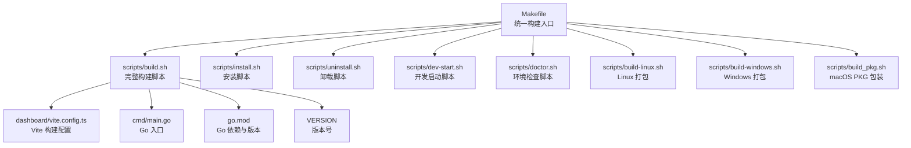
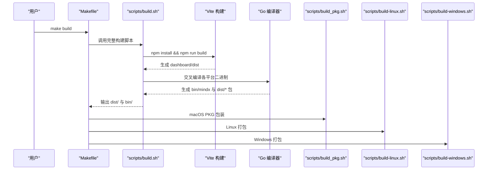
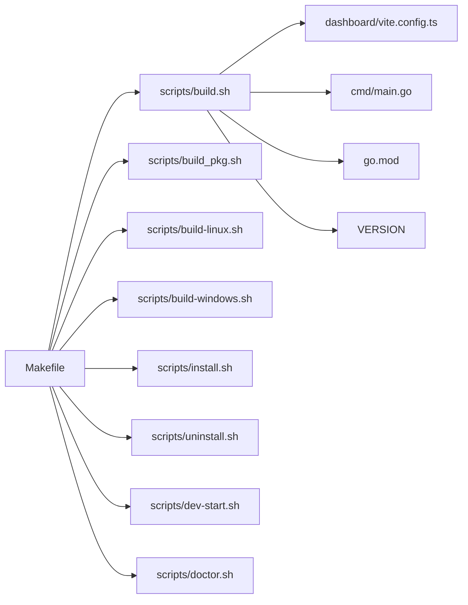
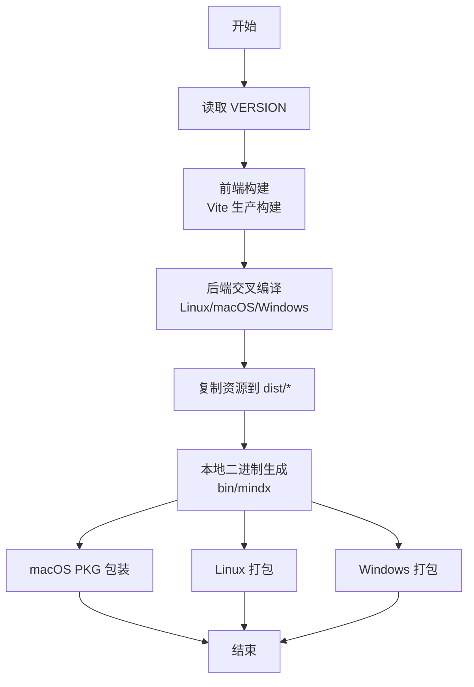

# 构建系统

<cite>
**本文引用的文件列表**
- [Makefile](file://Makefile)
- [scripts/build.sh](file://scripts/build.sh)
- [scripts/build-linux.sh](file://scripts/build-linux.sh)
- [scripts/build-windows.sh](file://scripts/build-windows.sh)
- [scripts/build_pkg.sh](file://scripts/build_pkg.sh)
- [scripts/install.sh](file://scripts/install.sh)
- [scripts/uninstall.sh](file://scripts/uninstall.sh)
- [scripts/dev-start.sh](file://scripts/dev-start.sh)
- [scripts/doctor.sh](file://scripts/doctor.sh)
- [dashboard/vite.config.ts](file://dashboard/vite.config.ts)
- [dashboard/package.json](file://dashboard/package.json)
- [cmd/main.go](file://cmd/main.go)
- [go.mod](file://go.mod)
- [VERSION](file://VERSION)
</cite>

## 目录
1. [简介](#简介)
2. [项目结构](#项目结构)
3. [核心组件](#核心组件)
4. [架构总览](#架构总览)
5. [详细组件分析](#详细组件分析)
6. [依赖关系分析](#依赖关系分析)
7. [性能考虑](#性能考虑)
8. [故障排除指南](#故障排除指南)
9. [结论](#结论)
10. [附录](#附录)

## 简介
本文件面向 MindX 构建系统的使用者与维护者，系统化阐述统一构建流程、前后端分别构建策略、跨平台编译与打包、以及可定制化配置与优化建议。文档以 Makefile 为核心入口，串联脚本化的构建、安装、运行与诊断流程，并覆盖 Linux、macOS、Windows 的差异化配置与交叉编译策略。

## 项目结构
MindX 的构建体系由顶层 Makefile 统一调度，配合一组 Bash 脚本完成前端 Vite 构建、Go 后端编译、跨平台打包与安装卸载等任务；前端工程位于 dashboard 目录，后端入口为 cmd/main.go。

图表来源
- [Makefile](file://Makefile#L1-L299)
- [scripts/build.sh](file://scripts/build.sh#L1-L145)
- [scripts/install.sh](file://scripts/install.sh#L1-L324)
- [scripts/uninstall.sh](file://scripts/uninstall.sh#L1-L263)
- [scripts/dev-start.sh](file://scripts/dev-start.sh#L1-L285)
- [scripts/doctor.sh](file://scripts/doctor.sh#L1-L328)
- [dashboard/vite.config.ts](file://dashboard/vite.config.ts#L1-L106)
- [cmd/main.go](file://cmd/main.go#L1-L21)
- [go.mod](file://go.mod#L1-L113)
- [VERSION](file://VERSION#L1-L2)

章节来源
- [Makefile](file://Makefile#L1-L299)
- [scripts/build.sh](file://scripts/build.sh#L1-L145)
- [dashboard/vite.config.ts](file://dashboard/vite.config.ts#L1-L106)
- [cmd/main.go](file://cmd/main.go#L1-L21)
- [go.mod](file://go.mod#L1-L113)
- [VERSION](file://VERSION#L1-L2)

## 核心组件
- Makefile：统一入口，提供 build、install、uninstall、run、dev、test、doctor、update 等常用目标，封装跨平台编译与打包调用。
- scripts/build.sh：完整构建流水线，负责前端构建、后端交叉编译、产物打包与本地二进制生成。
- scripts/build-linux.sh / scripts/build-windows.sh：基于 dist/ 的二次打包，产出 tar.gz 或 zip 发行包。
- scripts/build_pkg.sh：macOS PKG 包装，集成安装路径、脚本与 LaunchAgent 自动启动。
- scripts/install.sh / scripts/uninstall.sh：安装/卸载脚本，支持 macOS/Linux，创建符号链接、服务、工作空间与配置。
- scripts/dev-start.sh：开发模式一键启动后端与前端，自动检测端口占用与 PID 管理。
- scripts/doctor.sh：环境诊断工具，检查 Go、Node、Ollama、模型、PATH、安装目录、工作空间、权限与端口。
- dashboard/vite.config.ts：前端构建配置，含 PWA、代理、主题变量与测试配置。
- cmd/main.go：Go 后端入口，注入版本信息并执行 CLI。
- go.mod / VERSION：Go 版本约束与项目版本号来源。

章节来源
- [Makefile](file://Makefile#L1-L299)
- [scripts/build.sh](file://scripts/build.sh#L1-L145)
- [scripts/build-linux.sh](file://scripts/build-linux.sh#L1-L75)
- [scripts/build-windows.sh](file://scripts/build-windows.sh#L1-L75)
- [scripts/build_pkg.sh](file://scripts/build_pkg.sh#L1-L189)
- [scripts/install.sh](file://scripts/install.sh#L1-L324)
- [scripts/uninstall.sh](file://scripts/uninstall.sh#L1-L263)
- [scripts/dev-start.sh](file://scripts/dev-start.sh#L1-L285)
- [scripts/doctor.sh](file://scripts/doctor.sh#L1-L328)
- [dashboard/vite.config.ts](file://dashboard/vite.config.ts#L1-L106)
- [cmd/main.go](file://cmd/main.go#L1-L21)
- [go.mod](file://go.mod#L1-L113)
- [VERSION](file://VERSION#L1-L2)

## 架构总览
下图展示从 Makefile 到各子脚本与工具链的调用关系，以及前后端构建与打包的关键节点。

图表来源
- [Makefile](file://Makefile#L26-L30)
- [scripts/build.sh](file://scripts/build.sh#L39-L126)
- [dashboard/vite.config.ts](file://dashboard/vite.config.ts#L1-L106)
- [scripts/build_pkg.sh](file://scripts/build_pkg.sh#L1-L189)
- [scripts/build-linux.sh](file://scripts/build-linux.sh#L1-L75)
- [scripts/build-windows.sh](file://scripts/build-windows.sh#L1-L75)

## 详细组件分析

### Makefile 统一构建流程
- 核心目标
  - build：调用 scripts/build.sh 完成前端与后端构建。
  - install：先 build 再执行 scripts/install.sh 安装到系统路径。
  - uninstall：执行 scripts/uninstall.sh 卸载。
  - run：默认启动 Dashboard（内部委派至 bin/mindx dashboard 或 go run）。
  - dev：启动开发模式，同时运行后端与前端。
  - clean：清理 bin、dist、dashboard/dist、vite 缓存与测试/开发工作区。
  - test：准备 .test 工作区并执行 go test。
  - doctor：运行环境检查脚本。
  - update：拉取最新代码、重新构建并安装。
- 平台相关目标
  - build-frontend / build-backend：仅构建前端或后端。
  - build-all：一次性交叉编译 Linux、macOS、Windows 二进制。
  - build-linux-release / build-windows-release / build-all-releases：调用对应打包脚本。

章节来源
- [Makefile](file://Makefile#L26-L92)
- [Makefile](file://Makefile#L98-L161)

### 前端构建（Vite）
- 构建配置要点
  - 插件：React、PWA（workbox、manifest、图标、自动更新）、测试（Vitest）。
  - 代理：/api、/health、/ws 指向后端服务端口。
  - CSS：Less 变量注入，主题色与容器配色。
  - 开发服务器：host=0.0.0.0，端口 5173，允许外部访问。
- 构建流程
  - scripts/build.sh 中进入 dashboard 目录，先确保 node_modules，再执行 npm run build。
  - 构建产物写入 dashboard/dist，随后被复制到 dist/*/static。

章节来源
- [dashboard/vite.config.ts](file://dashboard/vite.config.ts#L1-L106)
- [scripts/build.sh](file://scripts/build.sh#L40-L48)
- [dashboard/package.json](file://dashboard/package.json#L1-L58)

### 后端构建（Go）
- 版本注入
  - cmd/main.go 定义 Version、BuildTime、GitCommit 变量，并在 init 中注入配置。
  - scripts/build.sh 在 go build 时通过 ldflags 注入 Version。
- 交叉编译策略
  - Linux：CGO_ENABLED=0，GOOS=linux，GOARCH=amd64/arm64，产物不含 CGO 依赖，便于分发。
  - macOS：CGO_ENABLED=0，GOOS=darwin，GOARCH=amd64/arm64，最终通过 lipo 合成通用二进制。
  - Windows：CGO_ENABLED=0，GOOS=windows，GOARCH=amd64，输出 .exe。
- 产物组织
  - bin/mindx：当前平台本地二进制。
  - dist/mindx-<version>-<os>-<arch>：按平台打包的发行目录，包含 bin、skills、config、static、脚本与 README/VERSION。

章节来源
- [cmd/main.go](file://cmd/main.go#L1-L21)
- [scripts/build.sh](file://scripts/build.sh#L50-L126)
- [go.mod](file://go.mod#L1-L113)
- [VERSION](file://VERSION#L1-L2)

### 多平台构建系统
- Linux
  - 二进制：amd64、arm64，无 CGO。
  - 打包：scripts/build-linux.sh 将 dist/mindx-<version>-linux-<arch> 打包为 tar.gz。
- macOS
  - 二进制：darwin/amd64、darwin/arm64，无 CGO；通过 lipo 合成通用二进制。
  - 安装：scripts/install.sh 支持 macOS LaunchAgent；scripts/build_pkg.sh 生成 .pkg，内置 postinstall 自动安装 Ollama、创建符号链接、工作空间与 LaunchAgent。
- Windows
  - 二进制：amd64、arm64，无 CGO，输出 .exe。
  - 打包：scripts/build-windows.sh 将 dist/mindx-<version>-windows-<arch> 打包为 zip。

章节来源
- [Makefile](file://Makefile#L125-L161)
- [scripts/build.sh](file://scripts/build.sh#L103-L126)
- [scripts/build-linux.sh](file://scripts/build-linux.sh#L1-L75)
- [scripts/build-windows.sh](file://scripts/build-windows.sh#L1-L75)
- [scripts/build_pkg.sh](file://scripts/build_pkg.sh#L1-L189)
- [scripts/install.sh](file://scripts/install.sh#L208-L301)

### 交叉编译与二进制打包流程
- 交叉编译
  - 通过设置 GOOS/GOARCH 与 CGO_ENABLED 控制编译目标与是否启用 CGO。
  - Linux/macOS 使用 CGO_ENABLED=0，避免动态库依赖，提升可移植性。
- 打包
  - scripts/build.sh 生成 dist/*/ 结构，包含 bin、skills、config、static、脚本与元数据。
  - scripts/build-linux.sh 与 scripts/build-windows.sh 将 dist/*/ 压缩为 tar.gz/zip。
  - scripts/build_pkg.sh 生成 macOS PKG，包含 postinstall 脚本，自动安装 Ollama、创建符号链接、工作空间与 LaunchAgent。

章节来源
- [scripts/build.sh](file://scripts/build.sh#L50-L101)
- [scripts/build-linux.sh](file://scripts/build-linux.sh#L50-L66)
- [scripts/build-windows.sh](file://scripts/build-windows.sh#L50-L66)
- [scripts/build_pkg.sh](file://scripts/build_pkg.sh#L65-L178)

### 构建脚本使用方法与自定义配置
- 常用命令
  - make build：完整构建（前端 + 后端）。
  - make install：安装到系统路径，创建符号链接与服务。
  - make run：启动 Dashboard。
  - make dev：开发模式，同时启动后端与前端。
  - make doctor：环境检查。
- 自定义配置
  - 版本：VERSION 文件决定版本号，scripts/build.sh 读取并注入 ldflags。
  - 安装路径：MINDX_PATH（默认 /usr/local/mindx），工作空间：MINDX_WORKSPACE（默认 ~/.mindx），可在 .env 或交互中选择。
  - 前端代理：dashboard/vite.config.ts 的 server.proxy 可根据实际后端端口调整。
  - 服务管理：macOS 使用 LaunchAgent，Linux 使用 systemd，均可通过脚本生成与启用。

章节来源
- [Makefile](file://Makefile#L26-L92)
- [scripts/build.sh](file://scripts/build.sh#L23-L29)
- [scripts/install.sh](file://scripts/install.sh#L62-L97)
- [dashboard/vite.config.ts](file://dashboard/vite.config.ts#L73-L87)

### 开发辅助与运行目标
- run-dashboard / run-tui / run-kernel / run-train / run-model-test / run-skill-list
  - 若 bin/mindx 存在则直接执行，否则通过 go run 启动。
- dev-start.sh
  - 自动创建 .dev 工作目录，复制 config 模板，设置 MINDX_WORKSPACE。
  - 后端：go run ./cmd/main.go kernel run，等待端口 911 就绪。
  - 前端：npm run dev，等待端口 5173 就绪。
  - 支持 Ctrl+C 清理并停止所有服务。

章节来源
- [Makefile](file://Makefile#L166-L219)
- [scripts/dev-start.sh](file://scripts/dev-start.sh#L70-L143)

## 依赖关系分析
- Makefile 作为单一入口，依赖各脚本与工具链。
- scripts/build.sh 依赖：
  - dashboard/vite.config.ts（前端构建）
  - cmd/main.go（后端入口）
  - go.mod（Go 版本与依赖）
  - VERSION（版本号）
- 打包脚本依赖 dist/ 产物结构。
- 安装/卸载脚本依赖操作系统服务（macOS LaunchAgent、Linux systemd）。

图表来源
- [Makefile](file://Makefile#L1-L299)
- [scripts/build.sh](file://scripts/build.sh#L1-L145)
- [dashboard/vite.config.ts](file://dashboard/vite.config.ts#L1-L106)
- [cmd/main.go](file://cmd/main.go#L1-L21)
- [go.mod](file://go.mod#L1-L113)
- [VERSION](file://VERSION#L1-L2)
- [scripts/build_pkg.sh](file://scripts/build_pkg.sh#L1-L189)
- [scripts/build-linux.sh](file://scripts/build-linux.sh#L1-L75)
- [scripts/build-windows.sh](file://scripts/build-windows.sh#L1-L75)
- [scripts/install.sh](file://scripts/install.sh#L1-L324)
- [scripts/uninstall.sh](file://scripts/uninstall.sh#L1-L263)
- [scripts/dev-start.sh](file://scripts/dev-start.sh#L1-L285)
- [scripts/doctor.sh](file://scripts/doctor.sh#L1-L328)

章节来源
- [Makefile](file://Makefile#L1-L299)
- [scripts/build.sh](file://scripts/build.sh#L1-L145)

## 性能考虑
- 二进制体积与启动速度
  - Linux/macOS/Windows 采用 CGO_ENABLED=0，减少动态库依赖，提升启动一致性与可移植性。
  - 使用 ldflags "-s -w" 去除符号表与调试信息，减小体积。
- 前端构建优化
  - Vite 生产构建默认最小化与资源缓存；PWA 配置限制最大缓存文件大小，避免缓存膨胀。
  - 代理仅对 /api、/ws 走网络，其他静态资源走本地缓存。
- 并行与增量
  - Makefile 目标为 .PHONY，避免缓存干扰；scripts 层面尽量复用已安装的 node_modules，减少重复安装时间。
- 交叉编译并行
  - scripts/build.sh 顺序构建各平台，如需加速可拆分为并行任务（需注意 dist/ 目录互斥）。

章节来源
- [scripts/build.sh](file://scripts/build.sh#L62-L70)
- [dashboard/vite.config.ts](file://dashboard/vite.config.ts#L48-L62)

## 故障排除指南
- 环境检查
  - 使用 make doctor 或 ./scripts/doctor.sh 检查 Go、Node、Ollama、模型、PATH、安装目录、工作空间、权限与端口占用。
- 常见问题定位
  - 前端构建失败：确认 Node.js 已安装且 dashboard/node_modules 存在；必要时删除 node_modules 后重新安装。
  - 后端编译失败：确认 Go 版本满足 go.mod 要求；检查 CGO 环境（macOS 需要 Xcode 命令行工具）。
  - 二进制缺失：执行 make build 或 scripts/build.sh，确认 dist/ 与 bin/ 生成。
  - 服务无法启动：检查端口 911/1314 是否被占用；查看工作空间 logs 目录日志。
  - 安装失败：macOS 需要管理员权限；Linux 需要写入 /etc/systemd/system 权限。
- 卸载与清理
  - 使用 ./scripts/uninstall.sh 删除符号链接、服务、安装目录与可选工作空间；清理临时文件。

章节来源
- [scripts/doctor.sh](file://scripts/doctor.sh#L36-L92)
- [scripts/install.sh](file://scripts/install.sh#L208-L301)
- [scripts/uninstall.sh](file://scripts/uninstall.sh#L68-L166)
- [scripts/dev-start.sh](file://scripts/dev-start.sh#L52-L109)

## 结论
MindX 构建系统以 Makefile 为中心，结合多脚本实现“前端 Vite + Go 后端”的统一构建与跨平台打包。通过清晰的目录结构与版本注入机制，系统在保证可移植性的同时兼顾开发效率与可维护性。建议在 CI/CD 中复用 scripts/build.sh 与打包脚本，结合 doctor.sh 进行环境校验，确保构建稳定性。

## 附录
- 关键流程图：构建与打包序列

图表来源
- [scripts/build.sh](file://scripts/build.sh#L23-L126)
- [scripts/build_pkg.sh](file://scripts/build_pkg.sh#L1-L189)
- [scripts/build-linux.sh](file://scripts/build-linux.sh#L1-L75)
- [scripts/build-windows.sh](file://scripts/build-windows.sh#L1-L75)