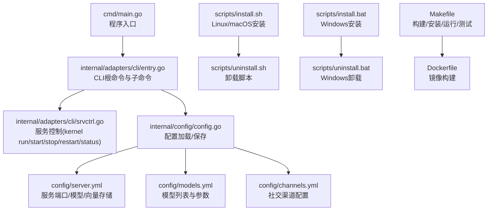
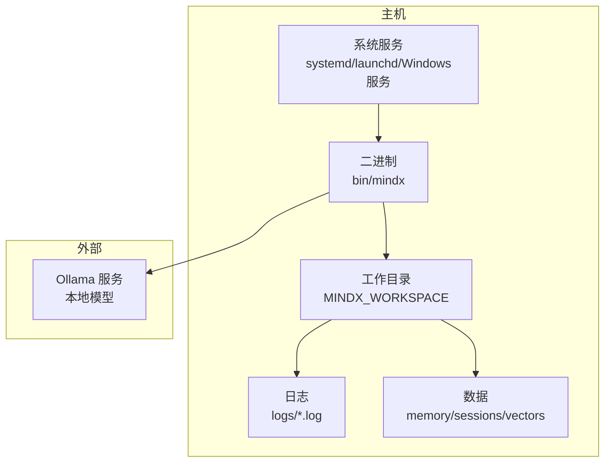
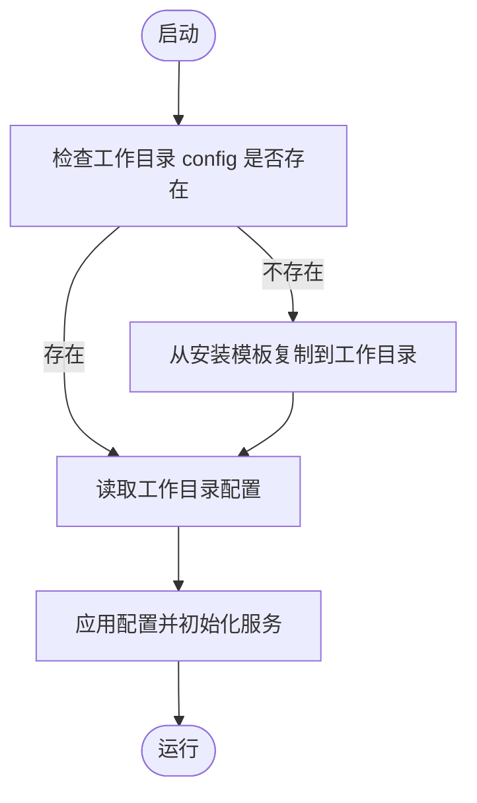
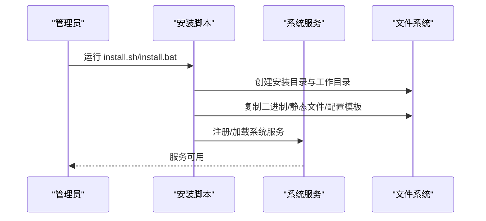
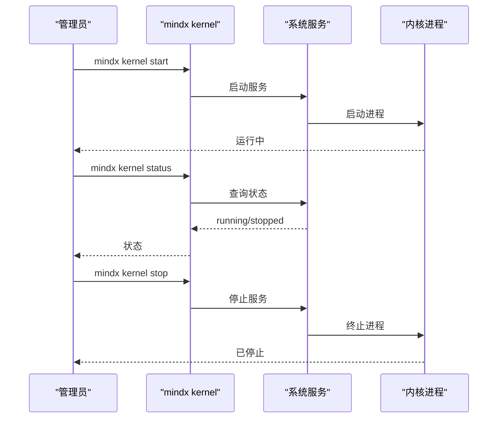
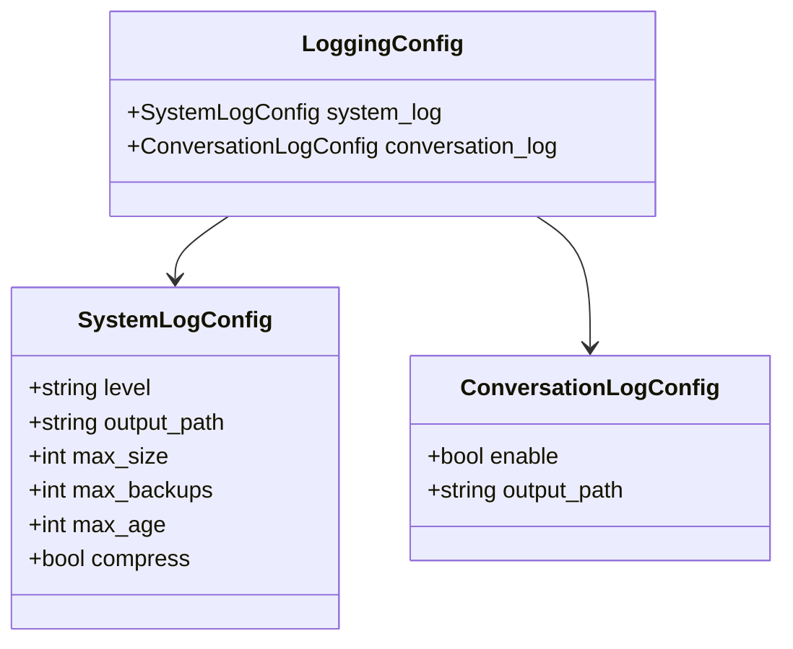
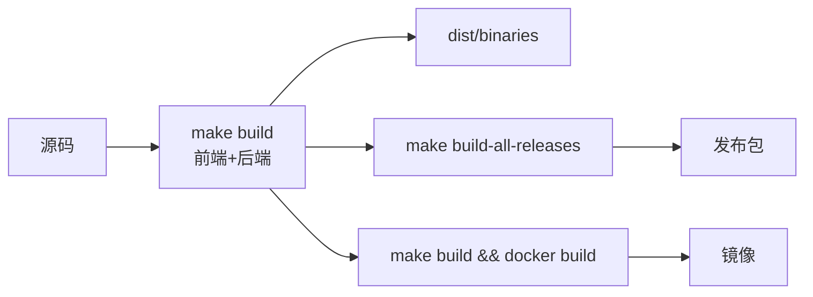
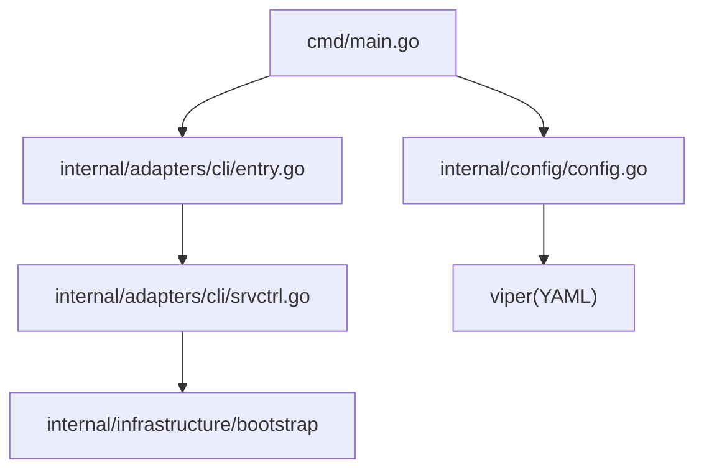

# 生产部署

<cite>
**本文引用的文件**
- [cmd/main.go](file://cmd/main.go)
- [internal/adapters/cli/entry.go](file://internal/adapters/cli/entry.go)
- [internal/adapters/cli/srvctrl.go](file://internal/adapters/cli/srvctrl.go)
- [internal/config/config.go](file://internal/config/config.go)
- [internal/config/logging.go](file://internal/config/logging.go)
- [config/server.yml](file://config/server.yml)
- [config/models.yml](file://config/models.yml)
- [config/channels.yml](file://config/channels.yml)
- [scripts/install.sh](file://scripts/install.sh)
- [scripts/uninstall.sh](file://scripts/uninstall.sh)
- [scripts/install.bat](file://scripts/install.bat)
- [scripts/uninstall.bat](file://scripts/uninstall.bat)
- [Makefile](file://Makefile)
- [Dockerfile](file://Dockerfile)
- [README.md](file://README.md)
</cite>

## 目录
1. [简介](#简介)
2. [项目结构](#项目结构)
3. [核心组件](#核心组件)
4. [架构总览](#架构总览)
5. [详细组件分析](#详细组件分析)
6. [依赖关系分析](#依赖关系分析)
7. [性能考虑](#性能考虑)
8. [故障排查指南](#故障排查指南)
9. [结论](#结论)
10. [附录](#附录)

## 简介
本文件面向系统管理员与运维工程师，提供 MindX 在生产环境的完整部署与运维参考。内容涵盖部署架构、安装与卸载流程、系统集成与权限配置、配置管理、服务启停与重启、监控与日志、性能调优与容量规划、备份恢复与灾难恢复策略，以及容器化与 CI/CD 的集成要点。

## 项目结构
MindX 采用前后端一体化的单二进制可执行文件设计，配合安装脚本实现跨平台服务化部署。核心目录与文件职责如下：
- cmd/main.go：程序入口，初始化构建信息并委托 CLI 执行
- internal/adapters/cli：CLI 子命令与服务控制逻辑（kernel run/start/stop/restart/status）
- internal/config：配置加载与保存（server.yml、models.yml、channels.yml、capabilities.yml）
- config：默认配置模板（server.yml、models.yml、channels.yml 等）
- scripts：跨平台安装/卸载脚本（install.sh、uninstall.sh、install.bat、uninstall.bat）
- Makefile：统一构建、安装、运行、测试、打包与发布流程
- Dockerfile：基于多阶段构建的镜像定义
- README.md：系统要求、安装与验证说明

**图表来源**
- [cmd/main.go](file://cmd/main.go#L1-L21)
- [internal/adapters/cli/entry.go](file://internal/adapters/cli/entry.go#L1-L123)
- [internal/adapters/cli/srvctrl.go](file://internal/adapters/cli/srvctrl.go#L1-L513)
- [internal/config/config.go](file://internal/config/config.go#L1-L294)
- [config/server.yml](file://config/server.yml#L1-L21)
- [config/models.yml](file://config/models.yml#L1-L92)
- [config/channels.yml](file://config/channels.yml#L1-L96)
- [scripts/install.sh](file://scripts/install.sh#L1-L324)
- [scripts/uninstall.sh](file://scripts/uninstall.sh#L1-L263)
- [scripts/install.bat](file://scripts/install.bat#L1-L78)
- [scripts/uninstall.bat](file://scripts/uninstall.bat#L1-L145)
- [Makefile](file://Makefile#L1-L299)
- [Dockerfile](file://Dockerfile#L1-L27)

**章节来源**
- [cmd/main.go](file://cmd/main.go#L1-L21)
- [Makefile](file://Makefile#L1-L299)
- [Dockerfile](file://Dockerfile#L1-L27)
- [README.md](file://README.md#L64-L138)

## 核心组件
- CLI 与服务控制：通过 mindx kernel 子命令实现服务生命周期管理；支持跨平台状态查询与启停
- 配置管理：集中于 YAML 文件，按需从安装模板复制到工作目录，并支持运行时保存
- 安装与卸载：提供 Linux/macOS systemd/launchd 与 Windows 服务集成，支持工作目录与配置迁移
- 构建与打包：Makefile 统一构建前端与后端，支持多平台交叉编译与发布包生成
- 容器化：Dockerfile 多阶段构建，产出最小化运行镜像

**章节来源**
- [internal/adapters/cli/entry.go](file://internal/adapters/cli/entry.go#L1-L123)
- [internal/adapters/cli/srvctrl.go](file://internal/adapters/cli/srvctrl.go#L1-L513)
- [internal/config/config.go](file://internal/config/config.go#L1-L294)
- [scripts/install.sh](file://scripts/install.sh#L1-L324)
- [scripts/uninstall.sh](file://scripts/uninstall.sh#L1-L263)
- [scripts/install.bat](file://scripts/install.bat#L1-L78)
- [scripts/uninstall.bat](file://scripts/uninstall.bat#L1-L145)
- [Makefile](file://Makefile#L1-L299)
- [Dockerfile](file://Dockerfile#L1-L27)

## 架构总览
MindX 生产部署采用“单二进制 + 配置文件 + 系统服务”的模式：
- 单二进制：bin/mindx，内置 HTTP 服务、内核与技能生态
- 工作目录：MINDX_WORKSPACE，存放配置、日志、内存与向量数据
- 系统服务：Linux 使用 systemd，macOS 使用 launchd，Windows 使用服务或 PowerShell 启动
- 外部依赖：Ollama 本地推理引擎（模型仓库）

**图表来源**
- [scripts/install.sh](file://scripts/install.sh#L208-L301)
- [scripts/install.bat](file://scripts/install.bat#L1-L78)
- [internal/adapters/cli/srvctrl.go](file://internal/adapters/cli/srvctrl.go#L405-L439)
- [config/server.yml](file://config/server.yml#L1-L21)

**章节来源**
- [scripts/install.sh](file://scripts/install.sh#L208-L301)
- [scripts/install.bat](file://scripts/install.bat#L1-L78)
- [internal/adapters/cli/srvctrl.go](file://internal/adapters/cli/srvctrl.go#L405-L439)
- [config/server.yml](file://config/server.yml#L1-L21)

## 详细组件分析

### 配置管理
- 配置加载顺序：优先读取工作目录 config；不存在则从安装目录模板复制一份到工作目录再读取
- 支持配置：server.yml（服务端口、模型、向量存储）、models.yml（模型列表与参数）、channels.yml（社交渠道）
- 配置保存：运行时可通过接口或 CLI 写回 YAML，便于生产变更管理

**图表来源**
- [internal/config/config.go](file://internal/config/config.go#L39-L82)
- [internal/config/config.go](file://internal/config/config.go#L84-L122)
- [internal/config/config.go](file://internal/config/config.go#L164-L203)

**章节来源**
- [internal/config/config.go](file://internal/config/config.go#L1-L294)
- [config/server.yml](file://config/server.yml#L1-L21)
- [config/models.yml](file://config/models.yml#L1-L92)
- [config/channels.yml](file://config/channels.yml#L1-L96)

### 服务安装与卸载（跨平台）
- Linux/macOS：安装脚本创建 systemd/launchd 服务，建立 /usr/local/bin/mindx 符号链接，创建工作目录与初始配置
- Windows：安装脚本复制文件至 Program Files，创建工作目录，设置环境变量，提供卸载脚本
- 卸载：停止服务/进程，移除符号链接/服务文件，删除安装目录，可选删除工作目录

**图表来源**
- [scripts/install.sh](file://scripts/install.sh#L100-L144)
- [scripts/install.sh](file://scripts/install.sh#L208-L301)
- [scripts/install.bat](file://scripts/install.bat#L17-L46)
- [scripts/uninstall.sh](file://scripts/uninstall.sh#L100-L123)
- [scripts/uninstall.bat](file://scripts/uninstall.bat#L54-L82)

**章节来源**
- [scripts/install.sh](file://scripts/install.sh#L1-L324)
- [scripts/uninstall.sh](file://scripts/uninstall.sh#L1-L263)
- [scripts/install.bat](file://scripts/install.bat#L1-L78)
- [scripts/uninstall.bat](file://scripts/uninstall.bat#L1-L145)

### 服务启停与重启（kernel 子命令）
- kernel run：前台运行内核，接收信号优雅退出
- kernel start/stop/restart/status：跨平台控制服务状态
- CLI 还提供 send 命令进行快速连通性测试

**图表来源**
- [internal/adapters/cli/srvctrl.go](file://internal/adapters/cli/srvctrl.go#L63-L133)
- [internal/adapters/cli/srvctrl.go](file://internal/adapters/cli/srvctrl.go#L135-L203)
- [internal/adapters/cli/entry.go](file://internal/adapters/cli/entry.go#L40-L91)

**章节来源**
- [internal/adapters/cli/srvctrl.go](file://internal/adapters/cli/srvctrl.go#L1-L513)
- [internal/adapters/cli/entry.go](file://internal/adapters/cli/entry.go#L1-L123)

### 日志与监控
- 日志配置结构：支持系统日志与对话日志，可配置级别、滚动策略与输出路径
- 生产建议：将日志滚动与保留策略与磁盘配额结合，避免日志膨胀影响系统稳定性

**图表来源**
- [internal/config/logging.go](file://internal/config/logging.go#L14-L44)

**章节来源**
- [internal/config/logging.go](file://internal/config/logging.go#L1-L45)

### 构建与发布（Makefile 与 Dockerfile）
- Makefile：统一构建前端与后端、多平台打包、安装/卸载、测试、清理与环境检查
- Dockerfile：多阶段构建，产出最小运行镜像，COPY 发布产物与二进制

**图表来源**
- [Makefile](file://Makefile#L98-L161)
- [Makefile](file://Makefile#L166-L219)
- [Dockerfile](file://Dockerfile#L1-L27)

**章节来源**
- [Makefile](file://Makefile#L1-L299)
- [Dockerfile](file://Dockerfile#L1-L27)

## 依赖关系分析
- 入口依赖：cmd/main.go 依赖 internal/config 初始化构建信息，依赖 internal/adapters/cli 执行命令
- CLI 依赖：internal/adapters/cli/srvctrl.go 依赖 internal/infrastructure/bootstrap 启动/关闭内核
- 配置依赖：internal/config/config.go 依赖 viper 读取 YAML，依赖内部错误包装类型
- 安装脚本依赖：跨平台服务注册（systemd/launchd/Windows 服务），工作目录与环境变量

**图表来源**
- [cmd/main.go](file://cmd/main.go#L3-L6)
- [internal/adapters/cli/entry.go](file://internal/adapters/cli/entry.go#L11-L14)
- [internal/adapters/cli/srvctrl.go](file://internal/adapters/cli/srvctrl.go#L12-L16)
- [internal/config/config.go](file://internal/config/config.go#L3-L11)

**章节来源**
- [cmd/main.go](file://cmd/main.go#L1-L21)
- [internal/adapters/cli/entry.go](file://internal/adapters/cli/entry.go#L1-L123)
- [internal/adapters/cli/srvctrl.go](file://internal/adapters/cli/srvctrl.go#L1-L513)
- [internal/config/config.go](file://internal/config/config.go#L1-L294)

## 性能考虑
- 模型与资源：根据业务负载选择合适模型与温度/最大 Token 参数，避免过度消耗
- 向量存储：Badger 作为默认向量存储，注意磁盘 IO 与数据量增长带来的性能影响
- 并发与端口：合理设置并发与端口，避免端口冲突与资源争用
- 本地推理：优先本地模型以减少网络延迟，云端模型仅在必要时调用
- 容量规划：结合对话轮次、历史保留与向量索引规模，预留足够的磁盘与内存空间

**章节来源**
- [config/server.yml](file://config/server.yml#L6-L19)
- [config/models.yml](file://config/models.yml#L1-L92)

## 故障排查指南
- 环境检查：使用 make doctor 或安装脚本检查 Ollama 与依赖
- 服务状态：使用 mindx kernel status 检查服务状态，跨平台差异由脚本处理
- 日志定位：查看工作目录 logs 下的日志文件，结合日志级别与滚动策略定位问题
- 卸载重装：若配置异常，可使用卸载脚本清理后重新安装，保留或删除工作目录按需选择

**章节来源**
- [Makefile](file://Makefile#L72-L76)
- [internal/adapters/cli/srvctrl.go](file://internal/adapters/cli/srvctrl.go#L135-L203)
- [scripts/uninstall.sh](file://scripts/uninstall.sh#L1-L263)

## 结论
MindX 的生产部署以“单二进制 + 配置文件 + 系统服务”为核心，通过安装脚本实现跨平台服务化与权限配置，结合 Makefile 与 Dockerfile 实现标准化构建与交付。生产环境中应重点关注配置管理、日志与监控、性能与容量规划，以及备份恢复与灾难恢复策略，确保系统稳定、可维护与可扩展。

## 附录

### 环境变量与工作目录
- MINDX_PATH：安装目录（默认 /usr/local/mindx 或 Program Files\MindX）
- MINDX_WORKSPACE：工作目录（默认 ~/.mindx 或 %APPDATA%\MindX）
- Windows 替代：MINDX_HOME 与 PATH 注入

**章节来源**
- [scripts/install.sh](file://scripts/install.sh#L62-L64)
- [scripts/install.bat](file://scripts/install.bat#L40-L52)

### 监控与日志配置要点
- 系统日志：设置合适的日志级别与滚动策略，避免磁盘占满
- 对话日志：按需开启数据库持久化，或使用文件输出作为补充
- 告警联动：结合系统日志滚动与外部监控系统，设置阈值告警

**章节来源**
- [internal/config/logging.go](file://internal/config/logging.go#L14-L44)

### 备份与灾难恢复
- 备份对象：工作目录下的 config、logs、data（memory/sessions/vectors）
- 备份策略：定期增量备份，验证恢复流程
- 灾难恢复：在新节点上安装 MindX，恢复工作目录，重建系统服务并验证

**章节来源**
- [scripts/uninstall.sh](file://scripts/uninstall.sh#L188-L218)
- [scripts/uninstall.bat](file://scripts/uninstall.bat#L112-L129)